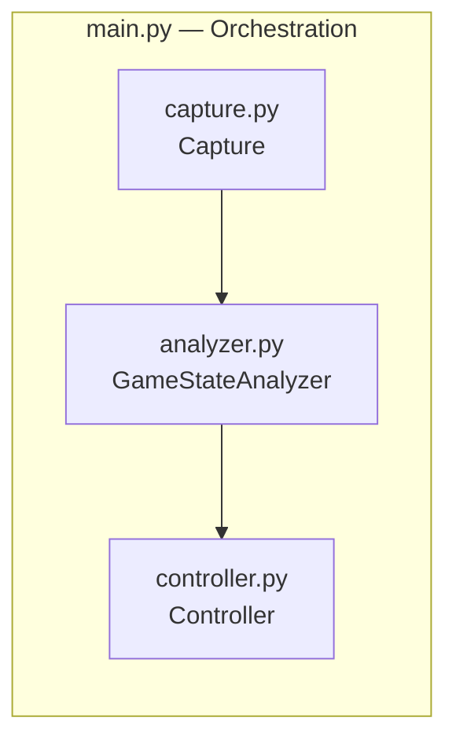
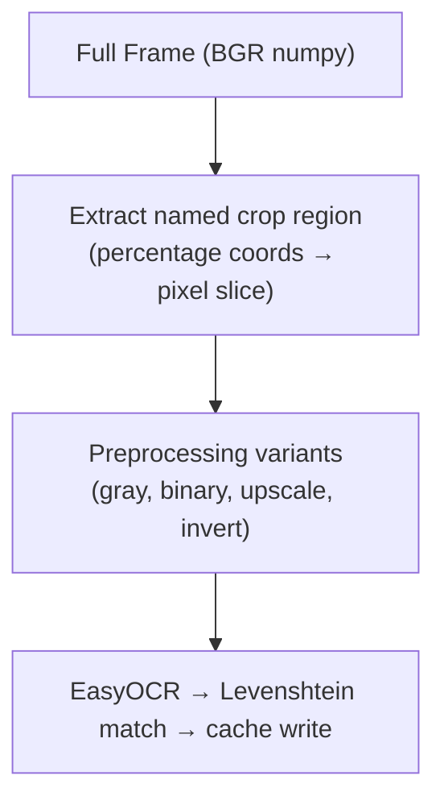
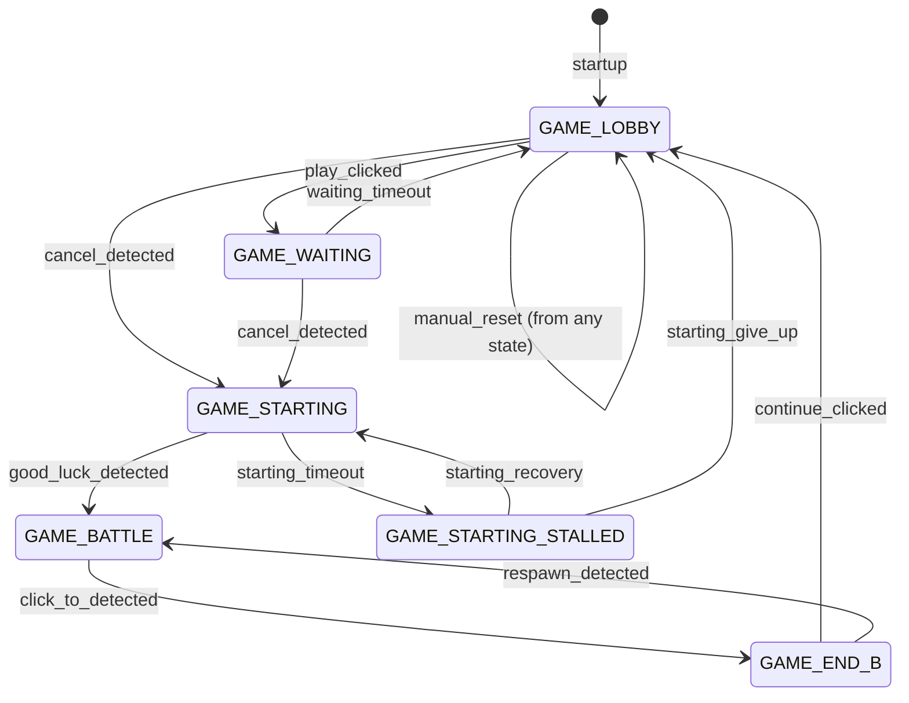
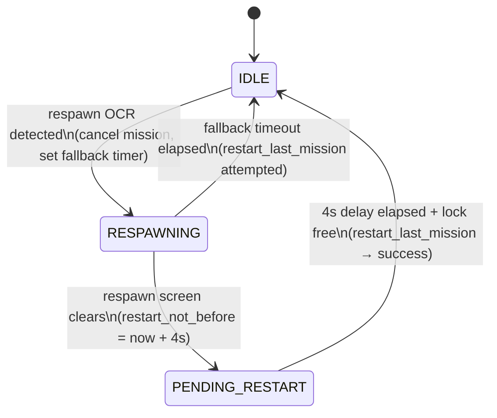
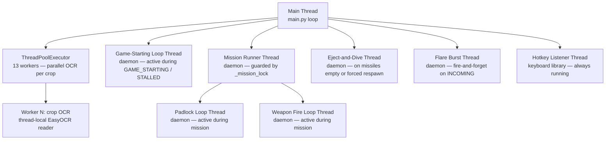
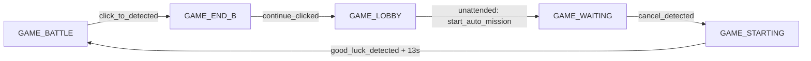

# Wingman — Architecture

## Overview

Wingman is a game automation assistant for MetalStorm. It captures a live screen region, runs EasyOCR-based perception to detect game events, and issues keyboard and mouse inputs to execute flight missions without human input.

The design goal is a **non-blocking main loop**: perception is always asynchronous, the main thread never waits on OCR, and hotkeys remain responsive regardless of what the OCR pipeline is doing.

---

## Component Map



| Module | Responsibility |
|---|---|
| `capture.py` | Screen region capture via `mss`. No logic. |
| `analyzer.py` | Perception: OCR detection, FSM ownership, result caches. No input. |
| `controller.py` | Actuation: keyboard/mouse, missions, hotkeys. No perception. |
| `main.py` | Orchestration: main loop, respawn recovery, unattended mode. |

---

## Module Detail

### `Capture`

Owns a single `mss` context created at startup. `get_frame()` grabs the configured region on the configured monitor and returns a BGR `numpy` array, or `None` if the grab fails. Callers must check for `None`.

Must be called from the same thread that constructed the instance — `mss` uses thread-local storage internally. Daemon threads in `controller.py` create their own short-lived `mss()` contexts rather than calling `get_frame()`.

---

### `GameStateAnalyzer`

The perception engine and FSM owner. Receives raw frames from `main.py`, dispatches OCR work to a thread pool, and exposes cached results synchronously to the main loop.

**Game state machine** — owned by `GameStateAnalyzer` via the `transitions` library. Trigger methods (`play_clicked`, `cancel_detected`, …) are injected onto the instance by `Machine.__init__`. All callers use `_trigger()` for thread-safe dispatch under `_state_lock`.

See [FSM section](#game-state-machine) below for states and transitions.

**Named crop regions** — OCR targets are defined in `config.yaml` as named entries with percentage coordinates of the capture frame. At runtime they are resolved to pixel `CropCoords` and stored in `analyzer.crops`. The set of crops scanned on each frame is gated by the current FSM state (see `_STATE_CROPS` in `analyzer.py`).

**Result caches** — background OCR workers write to thread-safe caches; the main loop reads them without blocking:

| Cache / Event | Signal | Used for |
|---|---|---|
| `_last_result` | Full `analyze_frame` dict | All per-frame state reads |
| `alive_event` | `threading.Event` — set on health dead→alive | Immediate mission restart |
| `_easyocr_*` per crop | Per-crop OCR text result | Queried by `analyze_frame` |

**OCR pipeline** — per crop, when cache is expired:



Multiple crops are submitted to the `ThreadPoolExecutor` (13 workers) and run in parallel. Only crops relevant to the current FSM state are submitted. See [ADR 023](adr/023-percentage-coordinate-crop-regions.md).

**Thread-local readers** — each pool thread owns its own `EasyOCR` reader, initialized once on first use behind a serialization lock (prevents model-download races on first run). Always runs on CPU (`use_gpu: false` in config). See [ADR 020](adr/020-cpu-only-ocr-optimizations.md).

**Lock safety** — `_background_ocr_lock` is acquired with a 5-second timeout on the main-loop path. If a background thread stalls holding the lock, the main loop skips the frame rather than blocking. See [ADR 022](adr/022-concurrency-safety-patterns.md).

---

### `Controller`

The actuation layer. Holds the mission lock, fires keys/clicks, and manages the game-starting loop.

**Key state:**

| Field | Purpose |
|---|---|
| `_mission_lock` | Mutex: only one mission runs at a time |
| `_mission_cancel` | Event: set to cooperatively stop a running mission |
| `_auto_respawn_restart` | Bool: cleared by `End` key or maneuver key press; restored when a mission starts |
| `_eject_stop` | Event: set by `End` key or respawn detection to abort `eject_and_dive` early |
| `_game_battle_since` | Timestamp of last `GAME_BATTLE` entry; used by 2s maneuver-key grace period |
| `_last_mission` | String (`"j20"` / `"loiter"`): used by `restart_last_mission()` |

**Mission execution** (`mission_j20`):

```
acquire _mission_lock
nose_up (2s)
    → start padlock loop (background daemon, every 6s)
    → start weapon fire loop (background daemon, every 1s)
    → afterburner cycles + roll maneuvers (loop)
    → checks _mission_cancel at each step
release _mission_lock (in finally, guarded with if locked(): release())
```

**Eject and dive** (`eject_and_dive`):

Runs as a daemon thread when missiles are empty or respawn is forced. Holds `NOSE_DOWN + AFTERBURNER` for 10s, then holds afterburner until respawn is detected or 120s elapses. Cancelled early by `_eject_stop` (set by `End` key or respawn OCR detection). Injected key presses carry `is_injected=True` so the keyboard listener skips them — they are not treated as manual maneuver key presses.

**Game-starting loop** (`_start_game_starting_loop`):

Runs as a daemon thread, started by `on_enter_GAME_STARTING`. Polls for "Good Luck" and fires `good_luck_detected` when found. On timeout, fires `starting_timeout` → `GAME_STARTING_STALLED`.

```
while state == GAME_STARTING:
    press J20 key
    scan for event-refresh popup → dismiss if found
    scan good_luck crop via OCR
    if detected → wait 13s → launch mission_j20() → fire good_luck_detected trigger
    else wait 5s

on 120s timeout → fire starting_timeout trigger → GAME_STARTING_STALLED
```

---

### `main.py` — Orchestration

The main loop runs at `loop_interval_sec` (default 1.5s). Each iteration:

1. Capture frame — skip cycle if `None`
2. Call `analyzer.analyze_frame()` — returns cached state immediately
3. Detect FSM state transition → run state-entry side effects (cancel mission on GAME_LOBBY entry, auto-trigger `start_auto_mission` in unattended mode)
4. Run per-state timed checks:
   - `GAME_LOBBY`: retry PLAY scan every 5s; stall guard (10s) force-clicks PLAY if OCR keeps failing
   - `GAME_WAITING`: scan for CANCEL every 3s; re-click PLAY only if PLAY is actually visible again; 180s timeout → `waiting_timeout`
   - `GAME_END_B`: stall guard (30s) fires `manual_reset` if click-through gets stuck
5. Check `alive_event` → call `_handle_alive_transition()` for immediate mission restart
6. Check ammo events → eject-and-dive if missiles empty
7. Check respawn detection → drive `RespawnState` sub-machine
8. Check for low flares → log warning

---

## Game State Machine

Six states managed by the `transitions` library inside `GameStateAnalyzer`. All trigger calls go through `_trigger()` which holds `_state_lock`. `ignore_invalid_triggers=False` — invalid transitions raise `MachineError` immediately. See [ADR 025](adr/025-formalise-game-state-machine.md).



**FSM callbacks wired by `main.py`:**

| Hook | Action |
|---|---|
| `on_enter_GAME_LOBBY` | `ctrl.cancel_mission()` |
| `on_enter_GAME_STARTING` | `ctrl._start_game_starting_loop()` |

**OCR gating by state** — only crops listed here are scanned on each frame:

| State | Crops scanned |
|---|---|
| `GAME_BATTLE` | `respawn`, `incoming`, `click_to`, `HEALTH`, `AMMO_FLARES`, `AMMO_MISSILE`, `ENEMY_CLOSE_BY` |
| `GAME_END_B` | `click_to`, `FINAL_CONTINUE` |
| `GAME_LOBBY` | `PLAY`, `READY`, `UNREADY`, `CANCEL`, `CREATION_FAILED`, `INSPECT`, `INVITED`, `REVEAL_ALL`, `TAP_HERE_TO_CONTINUE`, `UNLOCK_CLOSE`, `FINAL_CONTINUE` |
| `GAME_WAITING` | `PLAY`, `READY`, `CANCEL` |
| `GAME_STARTING` / `GAME_STARTING_STALLED` | `good_luck` |

---

## Respawn Recovery State Machine

A secondary state machine in `main.py`, independent of the FSM. Handles the respawn screen appearing and disappearing.



Note: health dead→alive transitions bypass this machine and restart immediately via `alive_event` + `_handle_alive_transition()`. See [ADR 011](adr/011-respawn-mission-restart-flowchart.md).

---

## Threading Model



All worker threads are `daemon=True`. `cleanup()` shuts down the `ThreadPoolExecutor` and is called from the main thread's `finally` block and by `GameStateAnalyzer.__exit__`.

Long-running daemon threads are stoppable via `threading.Event` — no bare `while True: time.sleep()` loops. See [CLAUDE.md](../CLAUDE.md) and [ADR 022](adr/022-concurrency-safety-patterns.md).

---

## Unattended Mode

Activated by pressing `M` or setting `unattended_mode: true` in config. When active, `GAME_LOBBY` entry automatically calls `start_auto_mission()`.



---

## Configuration

All tunable values live in `wingman/config.yaml`. Key bindings are module-level constants in `controller.py`.

| Section | Controls |
|---|---|
| `region` | Capture area (left, top, width, height) and monitor index |
| `crops` | Named OCR regions as percentage coordinates; recalibrate with `make calibrate` |
| `unattended_mode` | Enable/disable fully automated play |
| `loop_interval_sec` | Main loop tick rate |
| `mission` | Restart delays, retry intervals, respawn fallback timeout |
| `ocr` | `use_gpu` flag, cooldown, preprocessing parameters |

---

## Key Flows

### Startup

```
load config
init Capture (mss context)
init GameStateAnalyzer (FSM starts at GAME_LOBBY)
init Controller (registers hotkeys)
if unattended_mode → set unattended_active event
enter main loop → GAME_LOBBY detected → start_auto_mission()
```

### Normal Game Cycle (Unattended)

```
[GAME_LOBBY]
  → cancel_mission()  (on_enter_GAME_LOBBY callback)
  → start_auto_mission() scans for PLAY/READY
  → PLAY found → fire play_clicked → GAME_WAITING

[GAME_WAITING]
  → scan for CANCEL every 3s
  → CANCEL visible → fire cancel_detected → GAME_STARTING

[GAME_STARTING]
  → _start_game_starting_loop() thread starts
  → press J20 key every 5s
  → scan good_luck crop
  → Good Luck detected → wait 13s → launch mission_j20()
  → fire good_luck_detected → GAME_BATTLE

[GAME_BATTLE]
  → padlock + weapon fire + afterburner loops
  → parallel OCR: health, ammo, respawn, incoming, enemy proximity
  → click_to detected → fire click_to_detected → GAME_END_B

[GAME_END_B]
  → _click_through_game_end(): click x7, click PLAY
  → fire continue_clicked → GAME_LOBBY
  → cycle repeats
```

### Missiles Empty

```
AMMO_MISSILE OCR reads 0 in GAME_BATTLE
  → fire cancel_mission()
  → spawn eject_and_dive thread
      → NOSE_DOWN + AFTERBURNER for 10s
      → hold AFTERBURNER until respawn detected or 120s timeout
  → alive_event fires on respawn → _handle_alive_transition() → restart_last_mission()
```

---

## ADR Index

| ADR | Decision |
|---|---|
| [001](adr/001-easyocr-for-screen-number-detection.md) | EasyOCR for text detection |
| [002](adr/002-keyboard-library-for-game-input.md) | `keyboard` library for game input |
| [003](adr/003-grid-based-screen-scanning-architecture.md) | Original grid-based screen region addressing (superseded by ADR 023) |
| [004](adr/004-background-ocr-threading-for-non-blocking-analysis.md) | Non-blocking OCR via background threading |
| [005](adr/005-multi-instance-architecture-for-android-emulators.md) | Multi-instance architecture |
| [006](adr/006-multi-monitor-screen-selection.md) | Multi-monitor support |
| [007](adr/007-ocr-time-reduction.md) | OCR performance optimizations |
| [008](adr/008-levenshtein-distance-for-ocr-text-matching.md) | Levenshtein distance for fuzzy OCR matching |
| [009](adr/009-sequential-ocr-outperforms-parallel.md) | Sequential vs parallel OCR tradeoffs |
| [010](adr/010-respawn-incoming-ocr-threading-fix.md) | Threading fix for respawn + incoming OCR |
| [011](adr/011-respawn-mission-restart-flowchart.md) | Respawn → restart state machine |
| [012](adr/012-dual-region-ocr-architecture.md) | Single-frame dual-region OCR pipeline |
| [013](adr/013-automated-test-architecture.md) | Test architecture |
| [014](adr/014-mouse-click-via-win32-mouse-event.md) | Win32 `mouse_event` for click injection |
| [015](adr/015-game-state-machine.md) | Original game state machine (superseded by ADR 025) |
| [016](adr/016-ocr-multiprocessing-to-threading-migration.md) | Multiprocessing → threading migration |
| [017](adr/017-ocr-performance-gpu-vs-template-matching.md) | GPU OCR vs template matching |
| [018](adr/018-adb-input-injection-and-remote-control-architecture.md) | ADB input injection for remote control |
| [019](adr/019-incoming-region-subgrid-ocr-optimization.md) | Subgrid crop optimization for incoming OCR |
| [020](adr/020-cpu-only-ocr-optimizations.md) | CPU-only OCR: skip GPU probe, workers=0, thread pool |
| [021](adr/021-ocr-pipeline-design-rationale.md) | OCR pipeline advanced patterns rationale |
| [022](adr/022-concurrency-safety-patterns.md) | Lock release in finally, stoppable threads, lock timeouts |
| [023](adr/023-percentage-coordinate-crop-regions.md) | Named crop regions with percentage coordinates |
| [024](adr/024-phase3-behavior-tree-architecture.md) | Phase 3 behavior tree architecture |
| [025](adr/025-formalise-game-state-machine.md) | Formal FSM via `transitions` library |
