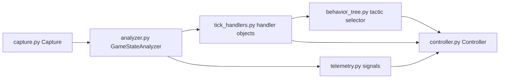
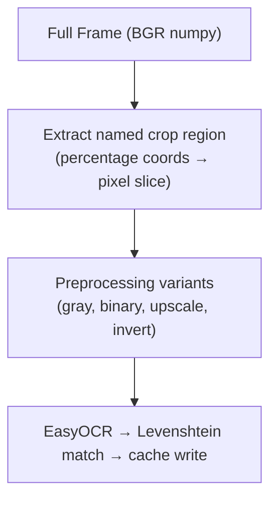
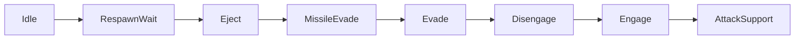
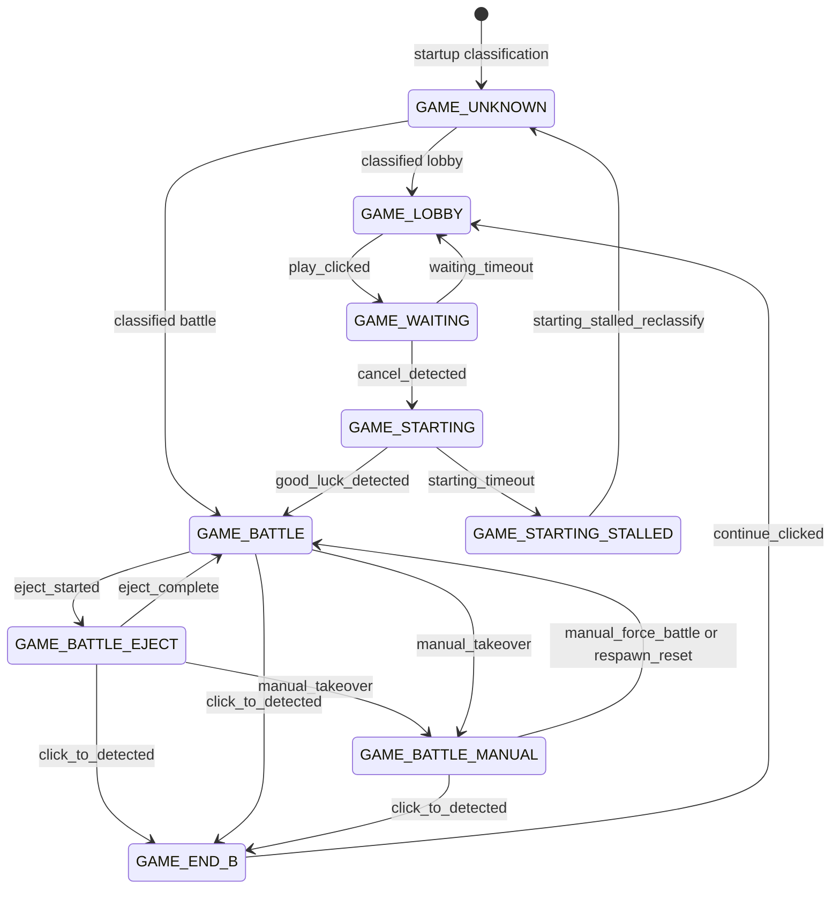
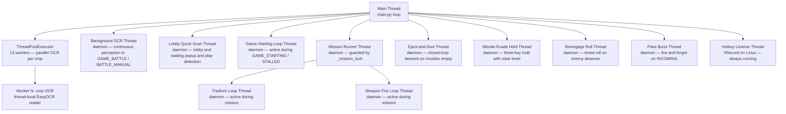
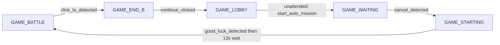

# Wingman — Architecture

| Status | Date | Wingman Version |
|---|---|---|
| Active | 2026-08-14 | 1.8.0 |

## Overview

Wingman is a game automation assistant for MetalStorm. It captures a live screen region, runs EasyOCR-based perception to detect game events, and issues keyboard and mouse inputs to execute flight missions without human input.

The design goal is a **non-blocking main loop**: perception is always asynchronous, the main thread never waits on OCR, and hotkeys remain responsive regardless of what the OCR pipeline is doing.

---

## Component Map



| Module | Responsibility |
|---|---|
| `capture.py` | Screen capture. `mss` on Windows; PipeWire screencast via the desktop portal on Linux Wayland, with xwininfo game-window auto-detect and offset correction. No logic. |
| `crop_region.py` | `CropCoords` (fractions of the frame, 0.0–1.0) and helpers. No internal imports. |
| `analyzer.py` | Perception: parallel EasyOCR, incoming template matching (ADR 046), FSM ownership, dual-sensor respawn detection (ADR 064), health confirmation filter (ADR 063), startup classification (ADR 042), result caches. No input. |
| `telemetry.py` | Altitude/speed OCR signals with plausibility filtering and flight-path angle (ADR 038/067, metric units). |
| `controller.py` | Actuation: keyboard/mouse via XTest (Linux) or `keyboard` (Windows), missions, eject descent control (ADR 069), missile evade hold (ADR 070), hotkeys, key-release guarantees (SAF-007). No perception. |
| `tick_handlers.py` | Per-concern tick-loop handler objects and the `BehaviorTreeHandler` (ADR 060, ADR 024). |
| `behavior_tree.py` | py-trees tactic selector: condition leaves over a frozen `AnalyzerSnapshot`, actuator wiring (ADR 024/070). |
| `engage_nav.py` | Minimap ring binning and engage-geometry navigation (Design 003 / ADR 028). |
| `mission_stats.py` | Per-mission/session outcome tracking and per-engagement survival metric (ADR 055, ADR 070 V5). |
| `performance.py` | Per-crop OCR timing, reaction latency, regression gate vs release baseline (ADR 031/034/043). |
| `replay.py` | Replay injection, assertion engine, live path capture engine (ADR 037/041/044/045). |
| `hud.py` / `tracker.py` | Live HUD snapshot; HSV target tracking (off by default). |
| `portal.py` | Linux screencast portal session + restore token. |
| `main.py` | Orchestration: main loop, handler dispatch, unattended mode, startup stall watchdog (exits wingman only — never the host). |

---

## Module Detail

### `Capture`

Platform-split backend behind one interface. `get_frame()` returns a BGR `numpy` array of the configured region, or `None` if the grab fails — callers must check for `None`.

- **Windows:** a single `mss` context created at startup. Must be called from the constructing thread (`mss` uses thread-local storage); daemon threads needing a frame create short-lived contexts.
- **Linux (GNOME Wayland):** a PipeWire screencast pipeline negotiated through the desktop portal (`portal.py`, with a restore token so the share dialog appears once ever — ADR 050). The stream covers the desktop; the game window is located via a fast `xwininfo` lookup and its offset applied to the region, re-detected automatically. Capture lanes can pin to the raw config region instead (`--capture-pin-region`, ADR 045 presenter lane only).

---

### `GameStateAnalyzer`

The perception engine and FSM owner. Runs two persistent background threads: a **lobby quick-scan thread** (active in `GAME_LOBBY` / `GAME_WAITING`) and a **background OCR thread** (active in `GAME_BATTLE` / `GAME_BATTLE_MANUAL`). The main loop reads from result caches synchronously without blocking.

**Game state machine** — owned by `GameStateAnalyzer` via the `transitions` library. Trigger methods (`play_clicked`, `cancel_detected`, …) are injected onto the instance by `Machine.__init__`. All callers use `_trigger()` for thread-safe dispatch under `_state_lock`.

See [FSM section](#game-state-machine) below for states and transitions.

**Named crop regions** — OCR targets are defined in `config.yaml` as named entries with percentage coordinates of the capture frame. At runtime they are resolved to pixel `CropCoords` and stored in `analyzer.crops`. The set of crops scanned on each frame is gated by the current FSM state (see `_STATE_CROPS` in `analyzer.py`).

**Result caches** — background OCR workers write to thread-safe caches; the main loop reads them without blocking:

| Cache / Event | Signal | Used for |
|---|---|---|
| `_last_result` | Full `analyze_frame` dict | All per-frame state reads |
| `alive_event` | `threading.Event` — set on health dead→alive | Immediate mission restart |
| `incoming_event` | `threading.Event` — set when new incoming OCR result written | Wake main loop for flare deploy |
| `_easyocr_*` per crop | Per-crop OCR text result | Queried by `analyze_frame` |

**OCR pipeline** — per crop, when cache is expired:



Multiple crops are submitted to the `ThreadPoolExecutor` (13 workers) and run in parallel. Only crops relevant to the current FSM state are submitted. See [ADR 023](adr/023-percentage-coordinate-crop-regions.md).

**Thread-local readers** — each pool thread owns its own `EasyOCR` reader, initialized once on first use behind a serialization lock (prevents model-download races on first run). Always runs on CPU (`use_gpu: false` in config). See [ADR 020](adr/020-cpu-only-ocr-optimizations.md).

**Health ceiling filter** — `_apply_health_ceiling_filter` maintains a rolling window of recent health readings and rejects any value more than `HEALTH_SPIKE_FACTOR` (1.5×) above the established ceiling. Window size is 10 readings. On `GAME_BATTLE` entry or a False→True alive transition (respawn), the window and ceiling are cleared so the first post-respawn reading sets a fresh baseline. See [ADR 030](adr/030-health-ceiling-from-repeated-readings.md).

**Lock safety** — `_background_ocr_lock` is acquired with a 5-second timeout on the main-loop path. If a background thread stalls holding the lock, the main loop skips the frame rather than blocking. See [ADR 022](adr/022-concurrency-safety-patterns.md).

---

### `Controller`

The actuation layer. Holds the mission lock, fires keys/clicks, manages the game-starting loop, and registers all keyboard hotkeys. `cleanup()` calls `keyboard_module.unhook_all()` on shutdown.

**Key state:**

| Field | Purpose |
|---|---|
| `_mission_lock` | Mutex: only one mission runs at a time |
| `_mission_cancel` | Event: set to cooperatively stop a running mission |
| `_auto_respawn_restart` | Bool: cleared by `End` key or maneuver key press; restored when a mission starts |
| `_eject_stop` | Event: set by `End` key or respawn detection to abort `eject_and_dive` early |
| `_game_battle_since` | Timestamp of last `GAME_BATTLE` entry; 2s maneuver-key grace period suppresses false manual-takeover triggers at mission start |
| `_last_mission` | String (`"j20"` / `"loiter"`): used by `restart_last_mission()` |
| `_target_painting_mode` | Bool: when True, J20 mission includes target-lock painting phase |

**Mission execution** (`mission_j20`):

```
acquire _mission_lock
nose_up (2s)
    → start padlock loop (background daemon, every 6s)
    → start weapon fire loop (background daemon, every 1s)
    → afterburner cycles + roll maneuvers (loop)
    → checks _mission_cancel at each step
release _mission_lock (in finally, guarded with if locked(): release())
```

**Eject and dive** (`eject_and_dive`, ADR 069):

Runs as a daemon thread on confirmed missiles-empty (the FSM enters `GAME_BATTLE_EJECT`). Descent control is closed-loop against telemetry: bounded NOSE_DOWN **impulse rotations** with mandatory observation gaps (continuous pitch input mushes the airframe — ADR 069 d2), a raw-altitude-rate dive criterion, then a hands-off **ballistic phase** with the afterburner gated on descending flight. Ends on respawn detection, the over-rotation guard, the pulse budget, or a 120 s safety timeout. Programmatic key presses are bracketed (`_programmatic_key_counts` + a release-grace window scaled to measured X-server latency) so wingman's own XTest auto-repeats are never mistaken for a manual takeover.

**Missile evade** (`missile_evade_mode`, ADR 070):

Started by the behavior tree's MissileEvade leaf on an incoming-missile detection. Holds AFTERBURNER + ROLL_RIGHT + YAW_LEFT until the detection has been clear for `clear_seconds` (measured on fresh perception samples — a stalled OCR cache cannot end the hold), with a tactical limit at `max_manoeuvre_s` (~6 s: beyond that the manoeuvre only bleeds energy) and an outer detector-fault backstop at `max_hold_s`. Yields the airframe to an eject within one 0.1 s poll (d11). Live evidence: 90% vs 68% ten-second engagement survival with the evade on (n=122).

**Game-starting loop** (`_start_game_starting_loop`):

Runs as a daemon thread, started by `on_enter_GAME_STARTING`. Polls for "Good Luck" and fires `good_luck_detected` when found. After 10s, arms the health-scan fallback: if `game_battle_alive` becomes True (health OCR detects the aircraft is alive) before Good Luck appears, fires `good_luck_detected` immediately. On 120s timeout, fires `starting_timeout` → `GAME_STARTING_STALLED`. See [ADR 032](adr/032-game-battle-alive-fallback-trigger.md).

```
while state == GAME_STARTING:
    press J20 key
    scan for event-refresh popup → dismiss if found
    scan good_luck crop via OCR
    if detected → wait 13s → launch mission_j20() → fire good_luck_detected trigger
    if 10s elapsed → arm health-scan fallback
    if game_battle_alive (fallback) → launch mission_j20() → fire good_luck_detected
    else wait 5s

on 120s timeout → fire starting_timeout trigger → GAME_STARTING_STALLED
```

**Manual takeover (GAME_BATTLE_MANUAL):**

Any registered maneuver key pressed during `GAME_BATTLE` (outside the 2s entry grace period, and not injected by the bot) fires `manual_takeover` → `GAME_BATTLE_MANUAL`. In this state the bot does not restart missions automatically. Pressing `End` or detecting respawn returns to `GAME_BATTLE` via `respawn_reset` or transitions to `GAME_LOBBY` via `continue_clicked`.

---

### `main.py` — Orchestration

The main loop runs at `loop_interval_sec` (default 1.5 s). Per-concern logic lives in **handler objects** (`tick_handlers.py`, ADR 060) constructed once at startup and dispatched each tick; FSM entry-hooks are wired through a typed event registry (named subscribers, duplicate names raise at wiring time). Each iteration:

1. Capture frame — skip the cycle if `None`
2. `analyzer.analyze_frame()` — returns cached state immediately
3. FSM transition detection → `on_state_change` fan-out to every handler
4. `RespawnHandler` — dual-sensor respawn detection and the health-gated restart flow (ADR 059/061/064)
5. `AmmoEventsHandler` — incoming→flare bursts, low-flare reload, debounced no-missiles verdict (feeds the BT Eject leaf)
6. `WaitingFallbackHandler` / lobby and END_B stall guards
7. `BehaviorTreeHandler.tick()` — freeze an `AnalyzerSnapshot`, tick the tactic selector, actuate the selection (see Behavior Tree below)
8. Startup stall watchdog — if `GAME_BATTLE` is never reached within `startup_stall_exit_after_s`, log at ERROR and exit **wingman only** (never the host)

---

### Behavior Tree (ADR 024, active — 3.1a + 3.1b)

A py-trees priority selector ticked once per loop tick. Leaves read a single frozen `AnalyzerSnapshot` from the blackboard — no leaf touches the live analyzer. Selection priority is the mutual-exclusion mechanism: a higher tactic being selected is what stops lower tactics actuating.



| Leaf | Condition | Actuation |
|---|---|---|
| Idle | not in GAME_BATTLE | none — other states own the keys |
| RespawnWait | respawn overlay detected | none |
| Eject | debounced missiles-empty verdict | `eject_and_dive` (ADR 069) |
| MissileEvade | incoming detected, sticky while the hold runs | `missile_evade_mode` (ADR 070) |
| Evade | health threshold — unset, selection-only | none (uncalibrated) |
| Disengage | all rings empty 30 s (MinimumHold) | `disengage_roll_right` |
| Engage | any minimap ring occupied | ring-engage geometry (`engage_nav.py`) |
| AttackSupport | always | fallback |

Actuating tactics self-terminate in their own Controller threads (clear timers, budgets, caps) — `ConditionTactic.terminate` is deliberately a no-op so selector churn cannot abort a manoeuvre mid-flight. Tactics that share keys (eject and evade both own AFTERBURNER) are excluded both by selector priority **and** a runtime yield check (ADR 070 d11), because priority orders selections, not thread lifetimes.

---

## Game State Machine

Nine states managed by the `transitions` library inside `GameStateAnalyzer`. All trigger calls go through `_trigger()`, which mutates state under `_state_lock` and defers external side effects until after the lock is released. `ignore_invalid_triggers=False` — invalid transitions raise `MachineError` immediately. See [ADR 025](adr/025-formalise-game-state-machine.md); `GAME_UNKNOWN` startup classification is ADR 042, `GAME_BATTLE_EJECT` is ADR 056.



`GAME_UNKNOWN` is both the boot state and the stall-recovery state: the startup classifier scans lobby/battle crops until one matches (ADR 042), and `GAME_STARTING_STALLED` re-enters it after a hold so live screen state can re-route the FSM.

**FSM callbacks wired by `main.py`:**

| Hook | Action |
|---|---|
| `on_enter_GAME_LOBBY` | `ctrl.cancel_mission()`; clear health window and ceiling |
| `on_enter_GAME_STARTING` | `ctrl._start_game_starting_loop()` |
| `on_enter_GAME_BATTLE` | Clear health window + ceiling; set `alive_event` if health already ≥ 1 |
| `on_enter_GAME_BATTLE_MANUAL` | `ctrl.cancel_mission()`; suppress auto-restart |

**OCR gating by state** — only crops listed here are scanned on each frame:

| State | Crops scanned |
|---|---|
| `GAME_BATTLE` | `respawn`, `incoming`, `click_to`, `HEALTH`, `AMMO_FLARES`, `AMMO_MISSILE`, `ENEMY_CLOSE_BY` |
| `GAME_BATTLE_MANUAL` | `respawn`, `incoming`, `click_to`, `HEALTH`, `AMMO_FLARES`, `AMMO_MISSILE`, `ENEMY_CLOSE_BY` |
| `GAME_END_B` | `click_to`, `FINAL_CONTINUE` |
| `GAME_LOBBY` | `PLAY`, `READY`, `UNREADY`, `CANCEL`, `CREATION_FAILED`, `INSPECT`, `INVITED`, `REVEAL_ALL`, `TAP_HERE_TO_CONTINUE`, `UNLOCK_CLOSE`, `FINAL_CONTINUE`, `SILVER` |
| `GAME_WAITING` | `PLAY`, `READY`, `CANCEL` |
| `GAME_STARTING` / `GAME_STARTING_STALLED` | `good_luck` |

---

## Respawn Recovery State Machine

Respawn handling is **dual-sensor** (ADR 064) with a **single health-gated restart path** (ADR 059/061):

- **Overlay OCR** detects the RESPAWN screen (recall ~92%). While the overlay is up, the mission lock is released and the FSM waits.
- **Health-evidence fallback** covers OCR misses: a death mark (confirmed-zero read = strong tier; digits absent = weak tier, valid only in plain `GAME_BATTLE`) followed by a dead→alive transition fires the respawn plumbing, standing down when OCR owns the episode.
- **The restart itself is gated on health returning**, never on the overlay clearing: the alive transition is a one-shot event with an explicit disposition for every FSM state (restart in battle, terminate-eject in `GAME_BATTLE_EJECT` after an observed death, consume elsewhere) — it is never consumed silently.

Restart requires a short respawn-clear stability window so flapping OCR cannot relaunch into a still-open respawn screen.

---

## Threading Model



All worker threads are `daemon=True` and stoppable via `threading.Event`. `analyzer.cleanup()` sets the stop events, then shuts down the `ThreadPoolExecutor`. `controller.cleanup()` stops the eject and evade threads (joining briefly so their `finally` blocks release keys), then **unconditionally releases every injectable key** — XTest key state lives in the X server and survives the process, so a key left held would auto-repeat into the focused window forever (SAF-007) — and finally deregisters hooks. Both are called from the main thread's `finally` block; SIGTERM is routed through the same path.

Long-running daemon threads are stoppable via `threading.Event` — no bare `while True: time.sleep()` loops. See [CLAUDE.md](../CLAUDE.md) and [ADR 022](adr/022-concurrency-safety-patterns.md).

---

## Unattended Mode

Activated by pressing `M` or setting `unattended_mode: true` in config. When active, `GAME_LOBBY` entry automatically calls `start_auto_mission()`.



---

## Configuration

All tunable values live in `wingman/config.yaml`. Key bindings are module-level constants in `controller.py`.

| Section | Controls |
|---|---|
| `region` | Capture area (left, top, width, height) and monitor index |
| `crops` | Named OCR regions as fractional coordinates; recalibrate with `make calibrate` (references come from the gate corpus — ADR 072) |
| `unattended_mode` | Enable/disable fully automated play |
| `loop_interval_sec` | Main loop tick rate |
| `mission` | No-missiles debounce, stall/reclassify timers, startup stall exit, respawn-clear stability |
| `respawn_detection` / `health` | Dual-sensor mode, confirmation window/tolerance, death evidence thresholds (ADR 063/064) |
| `incoming_detection` | Template threshold/near band, OCR fallback, debounce (ADR 046) |
| `behavior_tree` | Selector mode (off / shadow / active), disengage/evade holds, `missile_evade` block (ADR 024/070) |
| `j20_mission` / `minimap` | Ring-engage geometry, orbit cadence, blob band (Design 003) |
| `telemetry` | Plausibility bounds, smoothing, `eject_closed_loop` thresholds (ADR 038/067/069) |
| `performance` | Regression gate thresholds and histogram output |

---

## Key Flows

### Startup

```
load config
init Capture (mss on Windows; PipeWire portal pipeline on Linux)
init GameStateAnalyzer (FSM starts at GAME_UNKNOWN; pre-warm 13 OCR workers)
init Controller (registers all hotkeys)
construct tick handlers + behavior tree (ADR 060/024)
if unattended_mode → set unattended_active event
enter main loop → startup classifier routes GAME_UNKNOWN → lobby or battle (ADR 042)
```

### Normal Game Cycle (Unattended)

```
[GAME_LOBBY]
  → cancel_mission() + health window reset  (on_enter_GAME_LOBBY callback)
  → lobby quick-scan thread: detects PLAY/READY → click play → play_clicked → GAME_WAITING

[GAME_WAITING]
  → scan for CANCEL every 3s
  → CANCEL visible → fire cancel_detected → GAME_STARTING

[GAME_STARTING]
  → _start_game_starting_loop() thread starts
  → press J20 key every 5s
  → scan good_luck crop
  → Good Luck detected → wait 13s → launch mission_j20()
  → fire good_luck_detected → GAME_BATTLE

[GAME_BATTLE]
  → background OCR thread runs continuous parallel OCR
  → padlock + weapon fire + afterburner loops
  → click_to detected → fire click_to_detected → GAME_END_B

[GAME_END_B]
  → _click_through_game_end(): click x7, click PLAY
  → fire continue_clicked → GAME_LOBBY
  → cycle repeats
```

### Missiles Empty

```
AMMO_MISSILE OCR reads 0 (debounced: consecutive confirmations + grace windows)
  → BT Eject leaf consumes the confirmed verdict → eject_and_dive
  → FSM: GAME_BATTLE → GAME_BATTLE_EJECT (eject_started)
  → descent control (ADR 069): impulse rotations → dive confirmed → ballistic,
    afterburner gated on descending flight
  → respawn detected (overlay OCR, or health evidence after an observed death)
      → eject ends → FSM back to GAME_BATTLE
  → alive transition → health-gated restart → restart_last_mission()
```

### Incoming Missile

```
Incoming template match (>= 0.82, debounced 500 ms)
  → AmmoEventsHandler: flare burst thread (3 presses)   [always]
  → BT selects MissileEvade (outranks Engage; yields to Eject)
      → missile_evade_mode: hold AFTERBURNER + ROLL_RIGHT + YAW_LEFT
      → exits: clear (3 s fresh-negative window) | manoeuvre limit (~6 s)
               | eject preemption | detector-fault cap
  → per-engagement survival recorded in MissionStatsTracker (ADR 070 V5)
```

### Manual Takeover

```
Player presses NOSE_UP / NOSE_DOWN / ROLL_LEFT / ROLL_RIGHT during GAME_BATTLE
  (outside 2s grace period, not injected by bot)
  → maneuver_key_pressed handler fires manual_takeover trigger
  → FSM: GAME_BATTLE → GAME_BATTLE_MANUAL
  → on_enter_GAME_BATTLE_MANUAL: cancel_mission(); suppress auto-restart
  → OCR continues (health, ammo, incoming all still monitored)
  → player presses End → cancel_mission(); _auto_respawn_restart = False
  → click_to_detected or continue_clicked returns to GAME_LOBBY
```

---

## ADR Index

| ADR | Decision |
|---|---|
| [001](adr/001-easyocr-for-screen-number-detection.md) | EasyOCR for text detection |
| [002](adr/002-keyboard-library-for-game-input.md) | `keyboard` library for game input |
| [003](adr/003-grid-based-screen-scanning-architecture.md) | Original grid-based screen region addressing (superseded by ADR 023) |
| [004](adr/004-background-ocr-threading-for-non-blocking-analysis.md) | Non-blocking OCR via background threading |
| [005](adr/005-multi-instance-architecture-for-android-emulators.md) | Multi-instance architecture |
| [006](adr/006-multi-monitor-screen-selection.md) | Multi-monitor support |
| [007](adr/007-ocr-time-reduction.md) | OCR performance optimizations |
| [008](adr/008-levenshtein-distance-for-ocr-text-matching.md) | Levenshtein distance for fuzzy OCR matching |
| [009](adr/009-sequential-ocr-outperforms-parallel.md) | Sequential vs parallel OCR tradeoffs |
| [010](adr/010-respawn-incoming-ocr-threading-fix.md) | Threading fix for respawn + incoming OCR |
| [011](adr/011-respawn-mission-restart-flowchart.md) | Respawn → restart state machine |
| [012](adr/012-dual-region-ocr-architecture.md) | Single-frame dual-region OCR pipeline |
| [013](adr/013-automated-test-architecture.md) | Test architecture |
| [014](adr/014-mouse-click-via-win32-mouse-event.md) | Win32 `mouse_event` for click injection |
| [015](adr/015-game-state-machine.md) | Original game state machine (superseded by ADR 025) |
| [016](adr/016-ocr-multiprocessing-to-threading-migration.md) | Multiprocessing → threading migration |
| [017](adr/017-ocr-performance-gpu-vs-template-matching.md) | GPU OCR vs template matching |
| [018](adr/018-adb-input-injection-and-remote-control-architecture.md) | ADB input injection for remote control |
| [019](adr/019-incoming-region-subgrid-ocr-optimization.md) | Subgrid crop optimization for incoming OCR |
| [020](adr/020-cpu-only-ocr-optimizations.md) | CPU-only OCR: skip GPU probe, workers=0, thread pool |
| [021](adr/021-ocr-pipeline-design-rationale.md) | OCR pipeline advanced patterns rationale |
| [022](adr/022-concurrency-safety-patterns.md) | Lock release in finally, stoppable threads, lock timeouts |
| [023](adr/023-percentage-coordinate-crop-regions.md) | Named crop regions with percentage coordinates |
| [024](adr/024-phase3-behavior-tree-architecture.md) | Phase 3 behavior tree architecture (Draft) |
| [025](adr/025-formalise-game-state-machine.md) | Formal FSM via `transitions` library |
| [026](adr/026-game-lobby-state-machine-sequence.md) | GAME_LOBBY state machine sequence (superseded by ADR 029) |
| [027](adr/027-j20-target-painting-mode.md) | J20 target painting mode |
| [028](adr/028-enemy-quadrant-detection-and-nose-orientation.md) | Minimap enemy bearing and overhead attack positioning (Draft) |
| [029](adr/029-game-lobby-quick-scan-thread.md) | GAME_LOBBY dedicated quick-scan background thread |
| [030](adr/030-health-ceiling-from-repeated-readings.md) | Health ceiling spike filter from rolling OCR window |
| [031](adr/031-round-end-histogram-reporting.md) | Round-end OCR timing histogram on GAME_LOBBY entry (Draft) |
| [032](adr/032-game-battle-alive-fallback-trigger.md) | `game_battle_alive` fallback trigger for GAME_STARTING → GAME_BATTLE |
| [033](adr/033-phase3-architecture-recommendations.md) | Phase 3 architecture recommendations |
| [034](adr/034-two-tier-performance-regression-detection.md) | Two-tier performance regression detection |
| [035](adr/035-runtime-performance-release-trend-chart.md) | Runtime performance release trend chart |
| [036](adr/036-game-lobby-play-template-matching-pilot.md) | PLAY template-matching pilot |
| [037](adr/037-timed-screenshot-replay-integration-testing.md) | Timed screenshot replay integration testing |
| [038](adr/038-game-battle-altitude-speed-signals-for-phase3-and-eject-dive.md) | Altitude/speed telemetry signals |
| [039](adr/039-reduce-orchestration-coupling-first.md) | Reduce orchestration coupling first |
| [040](adr/040-game-waiting-secondary-matchmaking-confirmation.md) | GAME_WAITING secondary matchmaking confirmation |
| [041](adr/041-live-replay-auto-capture-for-integration-screenshots.md) | Live auto-capture for integration screenshots |
| [042](adr/042-game-unknown-startup-state-detection-and-resume.md) | GAME_UNKNOWN startup classification and resume |
| [043](adr/043-sqlite-performance-store.md) | SQLite performance store |
| [044](adr/044-runtime-screenshot-driven-automation-lane.md) | Runtime screenshot-driven automation gate |
| [045](adr/045-dual-lane-runtime-validation-replay-and-live-screen.md) | Dual-lane runtime validation (replay + live screen) |
| [046](adr/046-incoming-template-matching-replacement.md) | Incoming detection via template matching |
| [047](adr/047-host-environment-preflight-check.md) | Host environment preflight check |
| [048](adr/048-dual-ai-assistant-instructions.md) | Dual AI assistant instructions |
| [049](adr/049-linux-migration-game-and-automation-layer.md) | Linux migration: game and automation layer |
| [050](adr/050-wayland-screen-capture.md) | PipeWire screen capture on GNOME Wayland |
| [051](adr/051-linux-pitch-control-joystick-binding.md) | Pitch control: joystick mode under Wine |
| [052](adr/052-metalstorm-keybinding-persistence.md) | MetalStorm keybinding persistence |
| [053](adr/053-linux-one-command-launch.md) | Linux one-command launch: XTest + XRecord input stack |
| [054](adr/054-gnome-wayland-freeze-on-wine-window-drag.md) | GNOME freeze on Wine window drag |
| [055](adr/055-mission-level-statistics-tracker.md) | Mission-level statistics tracker |
| [056](adr/056-game-battle-eject-fsm-state.md) | Eject as a first-class FSM state |
| [057](adr/057-gnome-shell-extension-window-left-placement.md) | Window left-placement extension |
| [058](adr/058-eject-dive-confirmation-via-raw-descent-rate.md) | Eject dive confirmation via raw descent rate |
| [059](adr/059-health-gated-immediate-mission-restart.md) | Health-gated immediate mission restart |
| [060](adr/060-tick-loop-handlers-and-typed-event-registry.md) | Tick-loop handlers and typed event registry |
| [061](adr/061-eject-termination-via-observed-death-health-signal.md) | Eject termination via observed-death health signal |
| [062](adr/062-health-signal-respawn-detection-retiring-respawn-ocr.md) | Health-signal respawn detection (rejected; superseded by 064) |
| [063](adr/063-health-ocr-value-confirmation-filter.md) | Health OCR value-confirmation filter |
| [064](adr/064-dual-sensor-respawn-detection.md) | Dual-sensor respawn detection |
| [065](adr/065-starting-health-probe-reachability.md) | GAME_STARTING health probe reachability |
| [066](adr/066-strictdoc-requirements-adoption.md) | StrictDoc requirements adoption |
| [067](adr/067-metric-hud-units-pitch-normalization-recalibration.md) | Metric HUD units and pitch normalization |
| [068](adr/068-eject-dive-angle-target-and-over-rotation-evidence.md) | Eject dive-angle target and over-rotation evidence |
| [069](adr/069-eject-impulse-rotation-and-ballistic-descent.md) | Eject: impulse rotation and ballistic descent |
| [070](adr/070-missile-evade-tactic.md) | MISSILE_EVADE_MODE behavior tactic |
| [071](adr/071-single-gate-corpus-screenshot-set.md) | Single gate-corpus screenshot set |
| [072](adr/072-calibration-screenshot-consolidation.md) | Calibration screenshots consolidated onto the gate corpus |
