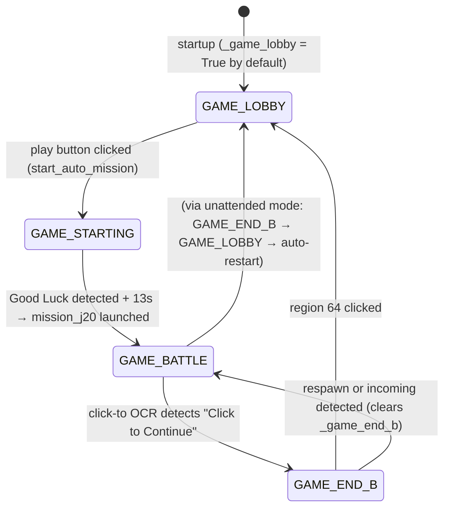

# Wingman — Architecture

## Overview

Wingman is a game automation assistant for MetalStorm. It captures a live screen region, runs OCR-based perception to detect game events (respawn, incoming missiles, end-of-match prompts), and issues keyboard and mouse inputs to execute flight missions without human input.

The design goal is a **non-blocking main loop**: perception is always asynchronous, the main thread never waits on OCR, and hotkeys remain responsive regardless of what the OCR pipeline is doing.

---

## Component Map

```
┌─────────────────────────────────────────────────────────┐
│  main.py — Orchestration & State Machine                │
│  ┌──────────┐  ┌──────────────────────┐  ┌───────────┐ │
│  │ Capture  │  │  GameStateAnalyzer   │  │Controller │ │
│  │          │→ │  (perception)        │→ │(actuation)│ │
│  └──────────┘  └──────────────────────┘  └───────────┘ │
└─────────────────────────────────────────────────────────┘
```

| Module | Responsibility |
|---|---|
| `capture.py` | Screen region capture via `mss`. No logic. |
| `analyzer.py` | Perception: OCR detection, game state, caches. No input. |
| `controller.py` | Actuation: keyboard/mouse, missions, hotkeys. No perception. |
| `main.py` | Orchestration: main loop, state transitions, respawn recovery. |

---

## Module Detail

### `Capture`

Owns a single `mss` context created at startup. `get_frame()` grabs the configured region on the configured monitor and returns a BGR `numpy` array. Stateless beyond the region/monitor configuration.

> **Known issue (P2):** `get_frame()` has no exception handling for monitor disconnect. See [code-review-todos.md](code-review-todos.md) §2.2.

---

### `GameStateAnalyzer`

The perception engine. Receives raw frames from `main.py` and produces structured results. All heavy work runs off the main thread.

**Game state flags** (three booleans, computed into a `GameState` enum):

| Flag | Set by | Cleared by |
|---|---|---|
| `_game_starting` | `Controller.start_auto_mission()` | `Controller._set_last_mission()` |
| `_game_lobby` | `Controller.click_grid_region()` (region 64) | `Controller._set_last_mission()` |
| `_game_end_b` | Click-to OCR background thread | `Controller._set_last_mission()` or respawn/incoming detection |

**OCR caches** — three independent thread-safe caches, each written by a background thread and read by the main loop without blocking:

| Cache | Signal | Writer thread | Cooldown |
|---|---|---|---|
| `_ocr_cache` | Respawn (`RESPAWN` text) | `ThreadPoolExecutor` worker | `ocr_cooldown` (default 0.1s) |
| `_incoming_cache` | Incoming missile (`INCOMING`/`MING` text) | `ThreadPoolExecutor` worker | same |
| `_click_to_cache` | End-of-match prompt (`Click to Continue`) | Dedicated background thread (5s interval) | — |

**OCR pipeline** (per frame, when cache is expired):

```
Full Frame (BGR numpy array)
    │
    ├─ Extract respawn region → gray → Otsu binary → resize 0.7×
    │       └─ EasyOCR → Levenshtein match → respawn cache
    │
    └─ Extract incoming region → 4 preprocessing variants
            (gray, binary, upscale 1.4×, inverted+upscale)
            └─ EasyOCR → text match → incoming cache
```

Both extractions happen from a single frame capture. Both OCR calls are submitted to a `ThreadPoolExecutor` (3 workers, thread-local `EasyOCR` readers) and run in parallel. See [ADR 012](adr/012-dual-region-ocr-architecture.md).

**Thread-local readers** — each pool thread owns its own `EasyOCR` reader, initialized once on first use behind a serialization lock (prevents model-download races). GPU is used if available; falls back to CPU. See [ADR 004](adr/004-background-ocr-threading-for-non-blocking-analysis.md).

---

### `Controller`

The actuation layer. Holds the mission lock, fires keys/clicks, and manages the game-starting loop.

**Key state:**

| Field | Purpose |
|---|---|
| `_mission_lock` | Mutex: only one mission runs at a time |
| `_mission_cancel` | Event: set to cooperatively stop a running mission |
| `_mission_complete` | Event: set when a mission finishes normally |
| `_last_mission` | String (`"j20"` / `"loiter"`): used by `restart_last_mission()` |
| `_auto_respawn_restart` | Bool: cleared by `End` key press; restored on mission start |

**Mission execution** (`mission_j20`):

```
nose_up (2s)
    → start padlock loop (background, every 6s)
    → start weapon fire loop (background, every 1s)
    → afterburner (20s)
    → roll_right
    → ... additional maneuvers
    → loops until cancelled or complete
```

All maneuvers check `_mission_cancel` at each step. Loops use interruptible sleeps (10Hz polling).

**Game-starting loop** (`_start_game_starting_loop`):

Runs as a daemon thread from `GAME_STARTING` entry until either Good Luck is detected or a 120s timeout fires.

```
while _game_starting:
    press J20 key (MISSION_J20_KEY)
    check region 30 for event-refresh popup → click ready button if found
    submit async OCR scan for "Good Luck" in region 16
    wait 5s (interruptible)

on Good Luck detected:
    wait 13s
    launch mission_j20()
```

---

### `main.py` — Orchestration

The main loop runs at `loop_interval_sec` (default 1.5s). Each iteration:

1. Capture frame
2. Call `analyzer.analyze_frame()` — returns immediately with cached state
3. Check for game state transition → handle `GAME_LOBBY` (start auto mission if unattended)
4. Check for new incoming missile result → deploy flares burst (3×, fire-and-forget thread)
5. Check for respawn — drive the `RespawnState` sub-machine
6. Check for click-to-continue → cancel mission, click region 64
7. Sleep remainder of interval, polling incoming cache at 20Hz during sleep

---

## Game State Machine

Four states. Transitions are event-driven, never time-based. See [ADR 015](adr/015-game-state-machine.md).



**OCR gating by state:**

| Scan | `GAME_BATTLE` | `GAME_END_B` | `GAME_LOBBY` | `GAME_STARTING` |
|---|---|---|---|---|
| Respawn OCR | ✅ | ✅ | ❌ | ❌ |
| Incoming OCR | ✅ | ✅ | ❌ | ❌ |
| Click-to OCR | ✅ (5s interval) | ❌ | ❌ | ❌ |

---

## Respawn Recovery State Machine

A secondary state machine runs inside `main.py`, independent of `GameState`.

```
IDLE
  │  respawn detected
  ▼
RESPAWNING ──────────────────────── fallback timeout (20s) ──→ try restart anyway
  │  respawn screen clears
  ▼
PENDING_RESTART
  │  restart_delay_after_unlock elapsed (4s) + lock free
  ▼
restart_last_mission() → IDLE
```

See [ADR 011](adr/011-respawn-mission-restart-flowchart.md) for the full decision tree.

---

## Threading Model

```
Main Thread (main.py loop)
    │
    ├─ Background OCR Thread Pool (ThreadPoolExecutor, 3 workers)
    │       ├─ Worker 0: respawn region OCR (thread-local EasyOCR reader)
    │       ├─ Worker 1: incoming region OCR (thread-local EasyOCR reader)
    │       └─ Worker 2: (available for click-to or future use)
    │
    ├─ Click-to Background Thread (daemon, while True, 5s interval)
    │       └─ Reads _click_to_latest_frame, writes _click_to_cache
    │
    ├─ Game-Starting Loop Thread (daemon, active during GAME_STARTING only)
    │       └─ Presses J20 key, scans for Good Luck, launches mission
    │
    ├─ Mission Runner Thread (daemon, one at a time, guarded by _mission_lock)
    │       ├─ Padlock Loop Thread (daemon, active during mission)
    │       └─ Weapon Fire Loop Thread (daemon, active during mission)
    │
    ├─ Flare Burst Thread (daemon, fire-and-forget on incoming detection)
    │
    └─ Hotkey Listener Thread (keyboard library, always running)
```

All worker threads are `daemon=True` — they do not prevent interpreter shutdown. The main thread owns the `analyzer.cleanup()` call in its `finally` block, which shuts down the `ThreadPoolExecutor`.

---

## Unattended Mode

When `unattended_mode: true` in config (or activated by pressing `M`), the main loop auto-triggers `start_auto_mission()` on every `GAME_LOBBY` state entry. This closes the loop for fully automated play:

```
GAME_BATTLE → (click-to detected) → GAME_END_B → (region 64 clicked) → GAME_LOBBY
                                                                              │
                                                               unattended → start_auto_mission()
                                                                              │
                                                                        GAME_STARTING
                                                                              │
                                                                   Good Luck + 13s
                                                                              │
                                                                        GAME_BATTLE
```

---

## Grid System

The capture region is divided into an N×N grid (default 8×8 = 64 regions, numbered 1–64 row-major). All region references in config and code use these 1-based grid numbers. The grid is the addressing scheme for:

- Identifying which screen area to OCR (respawn region, incoming region, click-to region)
- Clicking UI elements (ready button, continue button)
- Debugging (V key screenshots with grid overlay)

Region extraction formula: `row = (n - 1) // cols`, `col = (n - 1) % cols`.

See [ADR 003](adr/003-grid-based-screen-scanning-architecture.md).

---

## Configuration

All tunable values live in `wingman/config.yaml`. Nothing is hardcoded except key bindings (defined as module-level constants in `controller.py`).

Key config sections:

| Section | Controls |
|---|---|
| `region` | Capture area (left, top, width, height) and monitor index |
| `unattended_mode` | Enable/disable fully automated play |
| `loop_interval_sec` | Main loop frequency |
| `mission` | Restart delays, retry intervals, respawn fallback timeout |
| `respawn_detection` | Grid size, region numbers, OCR cooldown, subgrid crop parameters |
| `controls` | Ready button region number |
| `debug` | Grid overlay, screenshot output directory |

---

## Key Flows

### Startup

```
load config
init Capture (mss context)
init GameStateAnalyzer (sets _game_lobby = True)
init Controller (registers hotkeys)
if unattended_mode → set unattended_active event
enter main loop
```

On first loop iteration: `game_state == GAME_LOBBY` → if unattended, `start_auto_mission()` fires immediately.

### Normal Game Cycle (Unattended)

```
GAME_LOBBY detected
  → cancel_mission() (cleanup any stale state)
  → start_auto_mission()
      → sleep 3s
      → click ready button (region N)
      → _game_starting = True
      → _start_game_starting_loop()

[game_starting loop, ~30–90s]
  → press J20 key every 5s
  → OCR scan for "Good Luck" in region 16
  → Good Luck detected → wait 13s → launch mission_j20()
  → _game_starting = False → GAME_BATTLE

[mission running, 5–10min]
  → padlock camera every 6s
  → fire weapon every 1s
  → afterburner, maneuvers...

[game ends]
  → click-to OCR detects "Click to Continue" → GAME_END_B
  → click region 64 → _game_lobby = True → GAME_LOBBY
  → (cycle repeats)
```

### Respawn Recovery

```
respawn OCR detects "RESPAWN"
  → cancel_mission() → wait for lock release (up to 5s)
  → RespawnState = RESPAWNING
  → restart_not_before = now + 20s (fallback)

[respawn screen clears]
  → RespawnState = PENDING_RESTART
  → restart_not_before = now + 4s

[4s elapsed, lock free]
  → restart_last_mission()
  → RespawnState = IDLE
```

---

## ADR Index

| ADR | Decision |
|---|---|
| [001](adr/001-easyocr-for-screen-number-detection.md) | EasyOCR chosen for text detection |
| [002](adr/002-keyboard-library-for-game-input.md) | `keyboard` library for game input |
| [003](adr/003-grid-based-screen-scanning-architecture.md) | Grid-based screen region addressing |
| [004](adr/004-background-ocr-threading-for-non-blocking-analysis.md) | Non-blocking OCR via background threading |
| [005](adr/005-multi-instance-architecture-for-android-emulators.md) | Multi-instance architecture |
| [006](adr/006-multi-monitor-screen-selection.md) | Multi-monitor support |
| [007](adr/007-ocr-time-reduction.md) | OCR performance optimizations |
| [008](adr/008-levenshtein-distance-for-ocr-text-matching.md) | Levenshtein distance for fuzzy OCR matching |
| [009](adr/009-sequential-ocr-outperforms-parallel.md) | Sequential vs parallel OCR tradeoffs |
| [010](adr/010-respawn-incoming-ocr-threading-fix.md) | Threading fix for respawn+incoming OCR |
| [011](adr/011-respawn-mission-restart-flowchart.md) | Respawn → restart state machine |
| [012](adr/012-dual-region-ocr-architecture.md) | Single-frame dual-region OCR pipeline |
| [013](adr/013-automated-test-architecture.md) | Test architecture |
| [014](adr/014-mouse-click-via-win32-mouse-event.md) | Win32 `mouse_event` for click injection |
| [015](adr/015-game-state-machine.md) | Game state machine design |
| [016](adr/016-ocr-multiprocessing-to-threading-migration.md) | Multiprocessing → threading migration |
| [017](adr/017-ocr-performance-gpu-vs-template-matching.md) | GPU OCR vs template matching |
| [018](adr/018-adb-input-injection-and-remote-control-architecture.md) | ADB input injection for remote control |
| [019](adr/019-incoming-region-subgrid-ocr-optimization.md) | Subgrid crop optimization for incoming OCR |

---

## Known Architectural Debt

See [code-review-todos.md](code-review-todos.md) for the full list. P1 items scheduled for the next release:

| # | Issue |
|---|---|
| 1.2 | Click-to background thread has no stop event; never joined on shutdown |
| 1.3 | `ThreadPoolExecutor` lifecycle not guaranteed if `cleanup()` is bypassed |
| 1.4 | Mission lock can be permanently stuck held if `release()` raises |
| 1.5 | `_background_ocr_lock` acquire blocks main loop indefinitely if worker stalls |
