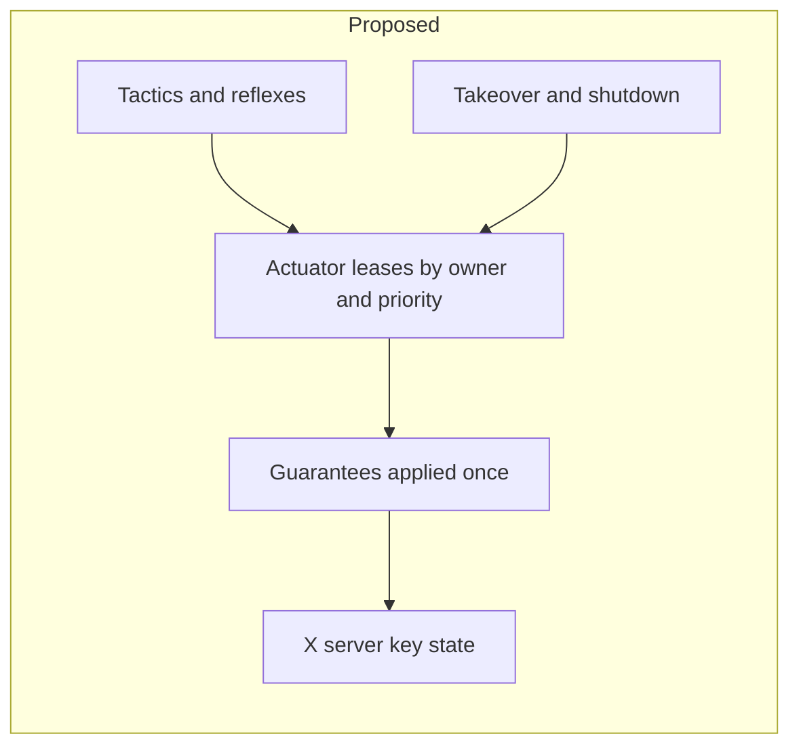

# Code Review 018 — Architecture: actuation ownership, decision authority and module boundaries

| Status | Date       | Wingman Version |
|--------|------------|-----------------|
| Draft  | 2026-09-27 | 1.8.12          |

## Scope

A project-wide architectural review of [wingman/](../../wingman/) at HEAD `eb709e5` (branch
`auto-resupply`, clean tree). It asks one question: which structural changes would most reduce the
defect rate and the cost of each change, given the operating constraints recorded in
[Future 002 §0](../FUTURE/002-engineering-capability-assessment.md)? The companion document
[Future 003](../FUTURE/003-architecture-trajectory-and-target.md) holds the target architecture and
the migration path. This review holds the findings.

Method:

- Read in depth: the press paths, tactic entry points, missions, takeover and cleanup in
  `controller.py`; the FSM, event bus and background threads in `analyzer.py`; the main loop and its
  closures in `main.py`; `BehaviorTreeHandler` in `tick_handlers.py`; `behavior_tree.py`,
  `input_linux.py`, `focus_guard.py` and `config_schema.py`. Also read
  [docs/architecture.md](../architecture.md), [HLDD 011](../hldd/011-acs-mode-hldd.md),
  [ADR 128](../adr/128-afterburner-during-an-incoming-alert.md),
  [ADR 137](../adr/137-emergency-climb-airbrake-and-crash-instrument.md),
  [ADR 139](../adr/139-behavior-tree-slot-composition-and-wiring.md) and SAF-001.
- Measured: module line counts at eight dates since 2026-06-15, call-site and handler counts, the
  import graph and import times.
- Probed: one scratch test, kept outside the repo, confirmed CR-018-07 and CR-018-08. It ran in
  simulate mode with `keyboard_module` patched to `None`, so no key reached the X server.
- Re-ran in isolation the two tests that the 2026-09-26 18:57 `make test` report shows failing.
- Not run: `make test`, `make tp` or a live session. The full suite has latched a real key into the
  X server before (CR-016-01), so the 2026-09-26 report stands in for a fresh run.

**Numbering.** The earlier reviews 018 (target tracking) and 019 (shutdown and takeover paths) were
removed from this folder in `eefacb6` (2026-09-27) and are kept untracked. Tracked code still cites
their item IDs: CR-018-01, -04 and -05 appear in `config.yaml`, `config_schema.py` and
`tests/test_cr018_*.py`, and CR-019-01 to -05 appear in `tests/test_cr019_handback.py` and
`analyzer.py`. This review's items therefore start at **CR-018-07**, so every ID stays unique in a
grep. The next review number, 019, has the same collision.

## Review summary

Three findings account for most of the others.

1. **No component owns the airframe's inputs.** The X server keeps one state per key, and the
   architecture document says so itself: another tactic's release "would otherwise drop a key the
   pursuit is holding" ([architecture.md:513](../architecture.md#L513)). Even so, wingman presses
   keys through five separate paths. Each applies its own subset of the six guarantees a press
   needs, and at least six writers share `AFTERBURNER_KEY`. Conflicts are settled in three ways: by
   re-pressing (cruise re-presses every tick, the evade hold every second), by pairwise "X owns the
   airframe" checks at tactic entry, and by hand-kept lists of writers to stop on takeover and
   shutdown. Every safety property is therefore opt-in per writer, and new writers keep missing
   one. The disengage roll was missing from takeover until 2026-09-09. It was missing from
   `cleanup()` until CR-019-04. The ADR 128 afterburner evade is missing from both today and keeps
   pressing the afterburner after a manual takeover (CR-018-07, confirmed).
2. **Three authorities decide what the aircraft does:** the behavior tree, the per-tick reflexes
   that run outside it (`note_incoming`, `note_afterburner_cruise`, `note_stall_prevention`), and
   mission threads that run their own control loops. Arbitration between them is spread across tree
   priority, controller entry guards and the key re-press race (CR-018-12).
3. **Growth goes where the primitives are.** `controller.py` grew from 3,090 to 8,136 lines since
   Future 002 (2026-08-20). 2,788 of those lines arrived in the last seven days, 56% of all source
   growth that week. Concerns that have a home of their own are well factored: tick handlers,
   capture backends, telemetry, the config schema, the focus and liveness guards. A new flight
   feature, though, has to live in `Controller`, because that is where the key primitives and about
   25 shared `Event`s are (CR-018-13).

HEAD is red: two tests fail, so `make tp` cannot pass (CR-018-11).

## Findings

| ID | Severity | Area | Finding | Status |
|----|----------|------|---------|--------|
| CR-018-07 | High | Safety, SAF-001 | The ADR 128 afterburner evade re-commands `AFTERBURNER_KEY` in `GAME_BATTLE_MANUAL` | Confirmed by probe and in the 2026-09-27 04:58 log; fixed as ADR 128 D7, live-verified 2026-09-27 08:25 |
| CR-018-08 | High | Safety, ADR 137 | The same hold cancels an emergency climb's airbrake | Confirmed by probe; operator decision |
| CR-018-09 | High | Architecture | No single owner of key state: five press paths, each with its own guarantees | Phase 1 done (uncommitted), 2026-09-27: `wingman/actuator.py`; Phase 2 open |
| CR-018-10 | High | Architecture | Tactic threads share no lifecycle; stop lists are kept by hand | Open |
| CR-018-11 | Medium | Build health | HEAD is red: two tests fail | Open |
| CR-018-12 | Medium | Architecture | Three decision authorities act on the same flight axes | Open |
| CR-018-13 | Medium | Architecture | `Controller` and `main()` keep absorbing features; split along seams that already exist | Open |
| CR-018-14 | Medium | FSM | Triggers fire from 21 sites on six threads; state changes arrive three ways; two wildcard triggers | Open |
| CR-018-15 | Medium | Boundaries | Shared types and perception reads live in the 4,582-line analyzer | `state.py` done 2026-09-27; `Perception` port open |
| CR-018-16 | Medium | Config | Operator state lives in the tracked, tested config; defaults are not single-sourced | Open |
| CR-018-17 | Medium | Observability | 39 exception handlers log only at DEBUG, including safety reflexes | Done for the 7 per-tick reflexes, the presence watch and the focus probe (uncommitted), 2026-09-27 |
| CR-018-18 | Low | Documentation | Design records outgrow their purpose and drift from the code | Open |
| CR-018-19 | Low | Concurrency | Mission entry still clears `_mission_cancel`, now in six places | Open, carried from CR-016-01 |

---

### CR-018-07 — The afterburner evade keeps flying after a manual takeover (High)

SAF-001 says wingman "shall cease all commanded flight input, including the tactic hold threads,
within 2.0 s … and shall not re-command flight until health evidence indicates a death and
respawn". Its rationale counts the afterburner as flight input: the incident behind it was a climb
hold "pulsing nose-up and cycling the afterburner" after takeover.

The path:

- `BehaviorTreeHandler.tick` calls `note_incoming(incoming)` on every tick, in every game state
  ([tick_handlers.py:2171-2178](../../wingman/tick_handlers.py#L2171-L2178)). The background OCR
  keeps detecting incoming missiles in `GAME_BATTLE_MANUAL`, which is what keeps flares working
  there.
- `note_incoming(True)` pushes a deadline forward and starts `_start_afterburner_evade`
  ([controller.py:5046-5125](../../wingman/controller.py#L5046-L5125)). The hold presses
  `AFTERBURNER_KEY` through `_climb_key` and re-presses it every 1.0 s. It stops only after the
  alert has been quiet for `afterburner_clear_s` (4 s) or after `afterburner_max_s` (20 s).
- Nothing on that path checks for a takeover.
  `_may_hold_key(..., requester="afterburner_evade")` returns `True` unconditionally
  ([controller.py:5347-5350](../../wingman/controller.py#L5347-L5350)). `_climb_key` has no SAF-001
  refusal ([controller.py:5361-5373](../../wingman/controller.py#L5361-L5373)). The thread has no
  stop event: it exits only on `_exit_event`, its deadline or its cap.
- `release_for_manual_takeover` ([controller.py:7653-7699](../../wingman/controller.py#L7653-L7699))
  stops the writers it names and releases every injectable key once. The afterburner evade is not
  on its list, so within a second it presses the key again.

Probe: after `release_for_manual_takeover()` in `GAME_BATTLE_MANUAL`, calling `note_incoming(True)`
every 0.1 s for 2.5 s recorded **3 `AFTERBURNER_KEY` `key_press` intents**, all with
`action=evade`.

Scenario: a missile is inbound and the operator presses Enter to take the aircraft. For as long as
the alert persists, up to 20 s, wingman holds the throttle and re-presses it over any release the
operator makes. The reflex fires at the exact moment the operator took over.

`tests/test_afterburner_evade.py` has no manual-takeover or emergency-climb case.

**Recommendation** (small; do this before CR-018-09):

- Give the hold a stop event, and set it in `release_for_manual_takeover()` and `cleanup()`.
- Have `note_incoming` and the hold loop refuse while `_manual_takeover_active()`, for the first
  press as well as the re-press.
- Add two tests: no afterburner press intent after takeover while the alert persists; the hold
  ends within one poll of takeover.

### CR-018-08 — The afterburner evade cancels an emergency climb's airbrake (High, operator decision)

ADR 137 holds `AIRBRAKE_KEY` instead of the afterburner during an emergency climb, "so the
emergency case never touches afterburner at all, regardless of fuel or an incoming missile"
([controller.py:4962-4966](../../wingman/controller.py#L4962-L4966)). The measurement behind it was
cruise re-pressing `AFTERBURNER_KEY` "inside 10 of 18 emergency-climb windows in one session,
cancelling the airbrake's own deceleration each time"
([controller.py:818-824](../../wingman/controller.py#L818-L824)). The fix made cruise yield:
`_may_hold_key("cruise")` checks `_climb_emergency_active`.

The afterburner evade is a second writer with the same conflict and no yield. Probe: with
`_climb_emergency_active = True` and an alert persisting, it recorded **2 afterburner presses in
1.5 s**.

This gap is known and deferred. [ADR 139](../adr/139-behavior-tree-slot-composition-and-wiring.md)
D4 (Accepted 2026-09-13) records that the five afterburner sites "do not agree today", reproduces
each one exactly, and defers any fix to "a separate, future decision requiring its own live
validation". That decision has not been made in the two weeks since.

**Decision needed from the operator:** should a missile alert override the emergency airbrake?
ADR 137's own text says no. If no:

- make the `afterburner_evade` requester yield to `_climb_emergency_active`, as cruise does, for the
  first press as well as the re-press;
- add a test;
- check live that emergency-climb windows log no evade press.

### CR-018-09 — No component owns key state (High)

The five press paths and the guarantees each one applies:

| Press path | Callers | Simulate intent | Echo bracket and release grace | Focus gate (ADR 098) | SAF-001 refusal at press |
|---|---|---|---|---|---|
| `_execute_key_press` | 16 verbs: `nose_up`, `roll_left`, `deploy_flares`, `fire_*`, `padlock_camera`, `wingsweep`, … | yes | yes | yes | **yes** (flares exempt) |
| `_eject_key`, nose keys | 4 eject functions | yes | yes | yes | no, relies on `_eject_stop` |
| `_eject_key`, other keys | the same | yes | no | **no** | no |
| `_climb_key` | 9: climb hold and exit push, spawn guard, boundary turn, cruise, stall prevention, afterburner evade, pursuit tracking holds | yes | left to the caller | **no** | no; cruise and stall prevention check at the call site |
| Inline, missile-evade hold | `_run_missile_evade_hold` | yes | yes | hold keys yes, burner **no** | no, relies on `_me_stop` |
| Inline, disengage roll | `disengage_roll_right` | yes | yes | yes | no, relies on `_disengage_stop` |

Consequences in the tree today:

- `_may_inject`'s docstring says gating happens in one place because "one place cannot be forgotten
  when a new tactic adds a keypress" ([controller.py:69-74](../../wingman/controller.py#L69-L74)).
  Three raw press sites bypass it, at
  [2411](../../wingman/controller.py#L2411), [4640](../../wingman/controller.py#L4640) and
  [5370](../../wingman/controller.py#L5370), and one of them is `_climb_key` with nine callers. The
  focus guard is off by default and rarely matters on the nested lane, so this is latent, but the
  claim is false.
- [architecture.md:827](../architecture.md#L827) says every non-flare press in manual is "refused at
  the single choke point in `_execute_key_press`". `_climb_key` is a second choke point without that
  refusal. CR-018-07 is the result.
- [HLDD 011:485](../hldd/011-acs-mode-hldd.md#L485) argues that boresight tracking inherits SAF-001's
  bracket "for free" because tracking routes through `_execute_key_press`. Sustained-hold actuation
  ([HLDD 005](../hldd/005-target-tracking-hldd.md), 2026-09-23) moved tracking onto
  `_press_tracking_key` and `_climb_key` two days later. The argument no longer holds, and nothing
  flagged that.
- `AFTERBURNER_KEY` has at least six writers: cruise, afterburner evade, climb hold, missile-evade
  hold, eject and stall prevention. Two of them win conflicts by re-pressing. ADR 139 D4 records
  that their gates disagree.
- SAF-001 and SAF-007 are implemented as lists. `release_for_manual_takeover` names its writers,
  `cleanup()` names six stop events and joins three threads, and `INJECTABLE_KEYS` lists sixteen keys
  by hand.

**Recommendation.** Create one `Actuator` object and make it the only holder of `keyboard_module`:

- `press(key, owner)`, `release(key, owner)` and `tap(key, owner, hold_s)` apply every guarantee
  once: the simulate-mode intent, the echo bracket and release grace for watched keys, the focus
  gate, SAF-001's refusal with its flares exception, and latch logging on a failed release.
- **Leases per owner.** A key stays down while any owner holds it, and one owner's release does not
  drop another's hold. That removes the re-press race and the pairwise "the pursuit owns the
  airframe" guards.
- **Priority as data.** A table of owners per contested key replaces the per-requester branches in
  `_may_hold_key`.
- `revoke_all(keep=("flares",))` for takeover and `release_everything()` for shutdown, both computed
  from the held set rather than from lists.

**Migration**, fitted to the live-validation budget:

- **Phase 1 preserves behaviour.** Every path calls the `Actuator` and passes its current gates
  explicitly, following ADR 139's "replicate, do not fix". The gates alone validate this phase.
- **Phase 2 unifies the gates** one key at a time, each change with a live check.
- **A structural check** keeps it that way: a test that fails when any module other than the
  `Actuator` calls `keyboard_module.press`. This is an AST check, like the config drift guard.

Afterwards, correct [architecture.md:827](../architecture.md#L827) and the reasoning at
[HLDD 011:485](../hldd/011-acs-mode-hldd.md#L485).

### CR-018-10 — Tactic threads share no lifecycle contract (High)

Each tactic hand-rolls the same parts:

- a running `Event`, set synchronously before the spawn (the "ADR 070 d8 pattern");
- a stop `Event` and a thread handle;
- a `finally` that releases its keys;
- entry guards against other tactics, such as "climb suppressed — eject in progress".

`Controller` keeps 13 thread handles, and `controller.py` has 33 `threading.Thread(` sites.
`cleanup()` sets six stop events and joins three threads
([controller.py:8063-8093](../../wingman/controller.py#L8063-L8093)). `release_for_manual_takeover()`
keeps its own list. The lists have drifted three times:

- `_disengage_stop` was missing from takeover until 2026-09-09 (comment at
  [controller.py:7669](../../wingman/controller.py#L7669));
- it was missing from `cleanup()` until CR-019-04;
- the afterburner evade is missing from both today (CR-018-07).

`cleanup()` joins neither the climb, spawn-guard, pursuit and weapon-loop threads nor the
afterburner evade. It relies on daemon death plus the `INJECTABLE_KEYS` sweep, which is why SAF-007's
sweep exists at all.

**Recommendation.** Add a small `HoldTactic` base. It sets the running flag synchronously and clears
stop on start, and offers `stop(reason)`, `join(timeout)` and `is_running`. It registers itself with
the controller, and takes its keys through an `Actuator` lease (CR-018-09), so its `finally` cannot
forget one. Takeover and `cleanup()` then become loops over the registry. A test that every thread
`Controller` starts is registered turns the next omission into a test failure. This makes CR-017-02
concrete.

### CR-018-11 — HEAD is red (Medium)

Two tests fail at HEAD. Re-run in isolation, the result was 2 failed and 20 passed. They also failed
in the 2026-09-26 18:57 report: 2,339 passed, 2 failed, 35 skipped, 7 min 26 s.

- `tests/test_invite_policy.py::test_shipped_config_declines_by_default`. `config.yaml` sets
  `accept_invite: true`. Commit `bbad845` (2026-09-26) added `scripts/toggle-invite.py`, flipped the
  value, and added this test in the same change. The comment above the key still says "Default
  false". The root cause is CR-018-16.
- `tests/test_lobby_ready_squad_layout.py::test_the_ready_crop_covers_the_button_it_is_meant_to_read`.
  The READY crop covers 66% × 63% of the squad-lobby READY button. The test's own message is that OCR
  then never reads READY. The crop's current coordinates arrived in `e12f9d9` (2026-09-25 19:50),
  about two hours after the test was added in `2763c82`. If the fixture is right, the squad-lobby
  ready-up is broken live. The config comment above the crop records what that costs: lobby dwells
  of 127 to 194 s until the operator clicked by hand.

**Recommendation:**

- Decide both cases: the invite default through CR-018-16, and the READY crop by recalibrating it
  against the fixture or correcting the fixture.
- Then land [HLDD 016](../hldd/016-faster-test-feedback-hldd.md) Part 3, the pre-push hook, so a red
  suite cannot reach a pushed branch unnoticed.

### CR-018-12 — Three decision authorities act on the same flight axes (Medium)

Three authorities decide flight input:

- **The behavior tree** chooses the tactic.
- **The per-tick reflexes run outside the tree** by design, "it only touches one key and would rarely
  tick if it had to compete … for tree priority". These are `note_incoming`,
  `note_afterburner_cruise`, `note_stall_prevention` and `note_boundary`.
- **Mission threads fly their own scripts:** the su30 and f111 climb, level-off and nose-angle
  steps, the loiter orbit and the pursuit's steering loop. They consult controller flags to stay out
  of each other's way. For example, `climb_mode` refuses while a pursuit flies
  ([controller.py:4988-4999](../../wingman/controller.py#L4988-L4999)).

So arbitration happens in three places: tree priority, controller entry guards and the key re-press
race. The rules for who beats whom are therefore written nowhere as a whole. The operator's own
decisions are recorded one site at a time: cruise overrides eject (ADR 134 D9), stall prevention
overrides the emergency airbrake, and the pursuit owns the airframe (2026-09-26).

**Recommendation:**

- **Now:** write the precedence as a single table per contested key or axis, with the owner, what it
  yields to and the ADR, in `docs/architecture.md`, and make CR-018-09's priority table that same
  data.
- **Rule until then:** no new actuator outside the tree without a row in that table.
- **Later:** the direction in [Future 003](../FUTURE/003-architecture-trajectory-and-target.md), in
  which the tree selects and the missions only parameterise.

### CR-018-13 — `Controller` and `main()` keep absorbing features (Medium)

| Measure | 2026-08-20 (Future 002) | 2026-09-27 |
|---|---|---|
| `controller.py` | 3,090 lines | 8,136 lines; the class is 7,848 lines with 180 methods |
| `Controller.__init__` | 463 lines before ADR 085 | 1,103 lines, 117 inline `.get(key, default)` reads, 11 hotkey closures |
| `main()` | 891 lines | 1,614 lines ([main.py:363-1977](../../wingman/main.py#L363-L1977)), 16 nested closures |
| `GameStateAnalyzer` | — | 3,580 lines, 106 methods; `_run_game_lobby_quick_scan` alone is 445 |

Seams that already exist:

- **Hotkeys.** Registering eleven global hooks inside `__init__`
  ([controller.py:1068-1391](../../wingman/controller.py#L1068-L1391)) is why tests construct
  `Controller.__new__` 14 times and pass `disable_hotkeys` 71 times. Moved to `hotkeys.py` and wired by
  `main`, construction becomes free of side effects.
- **Missions.** `mission_j20`, `mission_su30`, `mission_f111`, `mission_jas39` and `mission_loiter`
  repeat one shell ([mission_f111 at controller.py:7101-7168](../../wingman/controller.py#L7101-L7168)
  is typical). The shell acquires the lock without blocking, arms the turn guard, clears cancel,
  runs a runner thread, releases in `finally`, then poll-waits, joins and sleeps. The step helpers are
  already generic (`_scripted_wait_for_altitude`, `_scripted_set_nose_angle`,
  `_scripted_activate_pursuit`). A `missions/` package with one `MissionShell` fixes CR-018-19 once
  instead of six times.
- **Session flow.** Getting from the lobby to battle and back — PLAY and READY, popups, stall
  recovery, the game-starting loop, the end-screen click-through, the lobby ESC loop — is spread over
  the analyzer's quick-scan thread, five `main()` closures, `Controller._start_game_starting_loop`
  and `WaitingFallbackHandler`. None of it is flight-critical, and `make rr-path1-gate` replays it,
  so it is the lowest-risk large extraction.
- **Tactics** (climb, evade, boundary turn, spawn guard, eject, pursuit). Move these after
  CR-018-09 and CR-018-10 give them an `Actuator` and a lifecycle to depend on.

What the tests pin: 272 direct writes to private attributes (`ctrl._x = …`) and 35 analyzer-shaped
stubs. Each extraction keeps `Controller` as a facade that forwards the old attribute names until
the tests migrate. The tick handlers ([ADR 060](../adr/060-tick-loop-handlers-and-typed-event-registry.md)) already
show the target shape: ten classes, the largest 784 lines.

### CR-018-14 — FSM transitions have no single owner (Medium)

- **Many triggering sites.** 21 trigger call sites in four modules fire on at least six threads: the
  main loop, background OCR, the click-to thread, the lobby quick-scan thread, the hotkey listener,
  and mission and eject threads. `on_enter_*` hooks run on whichever thread fired the trigger, which
  is why CR-019-03 was needed.
- **Three delivery routes for state changes:**
  - the analyzer's `on_enter_*` hooks;
  - `FSM_TRANSITION` subscribers;
  - a main-loop poll, `current_game_state != last_game_state`
    ([main.py:1434-1514](../../wingman/main.py#L1434-L1514)), which fans out to six handlers'
    `on_state_change`.

  The poll coalesces transitions. A `GAME_BATTLE` → `GAME_BATTLE_EJECT` → `GAME_BATTLE` round trip
  inside one 1.5 s tick never reaches those handlers.
- **Wildcard triggers.** `manual_force_battle` and `manual_reset` accept `"*"` as their source
  ([analyzer.py:835-836](../../wingman/analyzer.py#L835-L836)), so any caller can jump to
  `GAME_BATTLE` from `GAME_END_B` or `GAME_UNKNOWN`.

**Recommendation:**

- Have handlers subscribe to `FSM_TRANSITION` through a queue that the main thread drains in order,
  then retire the poll.
- Replace the two wildcards with explicit source lists.
- Add the exhaustive table-driven transition test and the generated FSM diagram, the two parts of
  Future 001 item 3 still open.

### CR-018-15 — Shared types and perception reads live in the analyzer (Medium)

- **Import cost.** `GameState`, `GameEvent`, `BATTLE_STATES`, `NOSE_DOWN` and `_FSM_TRANSITIONS`
  live in `analyzer.py`, which imports `easyocr` at module load
  ([analyzer.py:116-119](../../wingman/analyzer.py#L116-L119)). Importing `behavior_tree` or
  `controller` just for the enum costs **2.2 s**, against 0.2 s for a leaf module. That is paid on
  every single-test run and by each worker under HLDD 016's xdist.
- **Reads across the boundary.** `Controller` reads perception through 21 analyzer members at 61
  call sites, including three private attributes: `_ammo_missiles`, `_last_battle_event_ts` and
  `_last_lobby_play_click_ts`. The frozen-snapshot contract (CR-017-06) covers the tree, not the
  controller's closed loops.
- **Duplicated test doubles.** 35 analyzer-shaped stubs in the tests each re-implement whatever
  subset their test needs.

**Recommendation:**

- Move the types into a leaf `wingman/state.py`, with re-exports from `analyzer.py` for
  compatibility. This is mechanical, one session at most.
- Define a `Perception` read port, a `typing.Protocol` listing what controllers and tactics may read.
  Tactics depend on the port, and one shared fake serves the tests.

### CR-018-16 — Operator state lives in the tracked, tested config (Medium)

- **Operator toggles edit the tested file.** `scripts/toggle-invite.py` rewrites the tracked
  `config.yaml`, and a test pins the shipped value, so the operator's own toggle turns the suite red
  (CR-018-11). The same pattern will recur for every "flip it for tonight" setting.
- **Defaults live at the read sites.** `config_schema.py` checks shape and deliberately injects no
  defaults, so defaults sit at 339 inline `.get(key, default)` sites: 117 in the controller
  constructor, 94 in the tick handlers, 84 in the analyzer and 44 in `main.py`.
- **One key already disagrees with itself.** `telemetry.steep_dive_min_sin` defaults to 0.8 in the
  eject controller ([controller.py:772](../../wingman/controller.py#L772)) and to 0.5 in
  `TelemetryProcessor` ([telemetry.py:269](../../wingman/telemetry.py#L269)). The shipped 0.8 hides
  this. Any run without the key splits the two components.

**Recommendation:**

- Add an untracked `config.local.yaml` overlay. It is merged at load, validated by the same schema
  and written by the toggle scripts. Tests read only the shipped file.
- Later, let the schema carry defaults for new keys, so each default has one source.

### CR-018-17 — Failures in safety reflexes are invisible at INFO (Medium)

39 `except Exception` handlers log only at DEBUG. Twelve of them are in `tick_handlers.py`, including
the per-tick calls to `note_incoming`, `note_afterburner_cruise`, `note_stall_prevention`,
`detect_terrain_ahead` and `climb_emergency_update_fn`
([tick_handlers.py:2177-2192](../../wingman/tick_handlers.py#L2177-L2192)). If stall prevention raised
on every tick, an INFO session would show nothing while the reflex was dead. This is the failure
class of Future 002's A-06, one level down.

**Recommendation:** add a small `log_suppressed(name, exc)` helper. It logs a WARNING with the
traceback on the first failure, then every Nth, and counts failures per name for the session
summary. Use it for any handler that guards a reflex or a safety tactic.

### CR-018-18 — Design records outgrow their purpose (Low)

The records are large and mostly still `Draft`:

- The ADR corpus is **33,104 lines**, more than the 29,521 lines of source. The median ADR is 175
  lines and seven exceed 500.
- ADR 137 runs to 1,492 lines, [HLDD 005](../hldd/005-target-tracking-hldd.md) to 2,183 and HLDD 015
  to 1,505.
- **44 of the 51 ADRs numbered 100 to 150 are `Draft`**, including shipped ones such as 102, 128
  and 137.

A `Draft` ADR may be amended in place indefinitely, so the no-modify rule for `Accepted` records
protects almost nothing recent. Each AI session pays for the size on entry, which is Future 002
§3.1's argument about file size applied to documents. Stale claims also survive:
[architecture.md:827](../architecture.md#L827) and [HLDD 011:485](../hldd/011-acs-mode-hldd.md#L485)
(CR-018-09).

**Recommendation:**

- A closure pass that moves shipped decisions to `Accepted`.
- A shape for new ADRs: the decision and its consequences on the first page, with live-trial
  evidence moved into `docs/anomaly/` or `docs/performance/` documents that the ADR links.
- Supersede rather than append once a decision is live.

### CR-018-19 — Mission entry still clears `_mission_cancel` (Low, carried forward)

CR-016-01 found that clearing `_mission_cancel` at mission entry swallows a cancel that races the
thread spawn. It was contained in the test fixture only: teardown re-asserts cancel until the lock
frees ([tests/test_mission_cancel.py:48-56](../../tests/test_mission_cancel.py#L48-L56)). The
product pattern has since been copied into three new missions, at
[6402](../../wingman/controller.py#L6402), [6615](../../wingman/controller.py#L6615),
[6718](../../wingman/controller.py#L6718), [7113](../../wingman/controller.py#L7113),
[7333](../../wingman/controller.py#L7333) and [7800](../../wingman/controller.py#L7800). Other layers
now limit its reach: SAF-001's suppression at press time, and CR-019-01's refusal to restart after a
handback. The fix is Future 001's cancel token, a generation counter captured at the request. It
belongs in CR-018-13's `MissionShell`, so it is written once.

---

## What is working, and should be protected

- **The dependency structure.** The import graph is acyclic, and `main.py` is the single
  composition root.
- **The FSM table.** Transitions are data (`_FSM_TRANSITIONS`), and `_trigger` runs side effects
  outside `_state_lock`.
- **The behavior tree** reads one frozen `AnalyzerSnapshot`, and its diagram is generated from the
  built tree ([Research 013](../research/013-behavior-tree-tooling-and-composability.md), `scripts/render-behavior-tree.py`).
- **The event bus** has fully replaced the single-slot setters. There are 31 `subscribe()` calls and
  no `set_on_*` callers left in `wingman/`.
- **Adapters.** Capture sits behind backends (`_MssBackend`, `_PipeWireBackend`, `_GstBackend`). Linux
  input is its own module. Focus, liveness, memory, shutdown and signal-ack guards bound failures
  generically.
- **Config validation.** `config_schema.py` fails fast on unknown, mistyped and out-of-range keys.
- **The verification lanes** (replay, live-screen, OCR, requirements traceability), and a test
  suite that caught both of today's red items.

## Disposition of Code Review 017 items

| Item | Disposition |
|------|-------------|
| CR-017-01 Split the controller | **Superseded** by CR-018-09, -10 and -13, which name the seams and the order |
| CR-017-02 One lifecycle contract | **Superseded** by CR-018-10 |
| CR-017-03 Transition invariants and stale-lobby recovery | Stale lobby **Resolved**: `starting_play_visible` returns `GAME_STARTING` to `GAME_LOBBY` ([ADR 102](../adr/102-lobby-recheck-from-game-starting.md), [analyzer.py:822](../../wingman/analyzer.py#L822)). Ordering invariants **Superseded** by CR-018-14 |
| CR-017-04 Narrow single-source injection gate | **Superseded** by CR-018-09; CR-018-07 shows the cost |
| CR-017-05 OS adapters | **Deferred**. Capture backends, `input_linux.py` and `focus_guard.py` exist; 14 platform branches remain, 11 of them in `controller.py` |
| CR-017-06 Versioned snapshot contract | **Deferred**. The tree's snapshot is frozen; the controller's live reads are CR-018-15 |
| CR-017-07 Config discipline | Schema **Resolved** (ADR 085 d2). Layering and defaults **Superseded** by CR-018-16 |
| CR-017-08 Observability | **Superseded** by CR-018-17 |
| CR-017-09 Test coupling | **Superseded** by CR-018-13 (side-effect-free construction) and CR-018-15 (one perception fake) |
| CR-017-10 Design intent next to code | **Superseded** by CR-018-18 |

## Recommended order of work

Sizes are in sessions: S is one or less, M is two to three, L is four or more.

1. **CR-018-07 (S), then CR-018-08** once the operator has decided (S). These are the only items that
   change flight behaviour now.
2. **CR-018-11 (S)** with HLDD 016 Part 3, so the suite is green and stays green.
3. **CR-018-15's `state.py` (S) and CR-018-17 (S).** Both are cheap, mechanical, and lower the cost of
   everything after them.
4. **CR-018-09 Phase 1 (M), then CR-018-10 (M).** Behaviour-preserving, so the gates validate them.
5. **CR-018-13 extractions, in this order:** hotkeys (S), missions with the cancel token that closes
   CR-018-19 (M), session flow (M), tactics (L).
6. **CR-018-14 (M) and CR-018-16 (S).**
7. **CR-018-09 Phase 2 and CR-018-12** follow the direction in Future 003. Each key or axis gets a
   live check.

## Evidence reviewed

- Source: [wingman/controller.py](../../wingman/controller.py),
  [wingman/analyzer.py](../../wingman/analyzer.py), [wingman/main.py](../../wingman/main.py),
  [wingman/tick_handlers.py](../../wingman/tick_handlers.py),
  [wingman/behavior_tree.py](../../wingman/behavior_tree.py),
  [wingman/input_linux.py](../../wingman/input_linux.py),
  [wingman/focus_guard.py](../../wingman/focus_guard.py),
  [wingman/config_schema.py](../../wingman/config_schema.py),
  [wingman/telemetry.py](../../wingman/telemetry.py), [wingman/capture.py](../../wingman/capture.py),
  [wingman/config.yaml](../../wingman/config.yaml).
- Requirements: SAF-001 in [001-safety.sdoc](../requirements/001-safety.sdoc).
- Design records: [docs/architecture.md](../architecture.md), [HLDD 011](../hldd/011-acs-mode-hldd.md),
  [HLDD 016](../hldd/016-faster-test-feedback-hldd.md), ADR [128](../adr/128-afterburner-during-an-incoming-alert.md),
  [137](../adr/137-emergency-climb-airbrake-and-crash-instrument.md),
  [139](../adr/139-behavior-tree-slot-composition-and-wiring.md),
  [102](../adr/102-lobby-recheck-from-game-starting.md).
- Tests: `tests/test_afterburner_evade.py`, `tests/test_mission_cancel.py`,
  `tests/test_invite_policy.py`, `tests/test_lobby_ready_squad_layout.py`, and the 2026-09-26 18:57
  `tests/test-output/report.html`.
- Git history: `bbad845`, `e12f9d9`, `2763c82` and `eefacb6`, plus `controller.py`, `analyzer.py`,
  `main.py` and `tick_handlers.py` line counts at eight dates from 2026-06-15 to 2026-09-27.
- [Code review 017](017-2026-09.md), [Future 001](../FUTURE/001-principal-architect-improvements.md),
  [Future 002](../FUTURE/002-engineering-capability-assessment.md).
