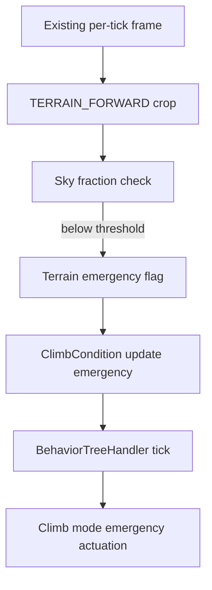

# Design 001 — Terrain Avoidance: High-Level Design Document

| Status | Date       | Wingman Version |
|--------|------------|-----------------|
| Active | 2026-09-20 | 1.8.9           |

## Redesign note (2026-09-16)

This document was originally written 2026-05-03 against v1.6.5, proposing a
dedicated 15 Hz forward-view HSV pixel-density scanner. **It was never
implemented** — no trace of `TerrainScanner`, `terrain_avoidance` config, or
a `terrain_forward` crop exists anywhere in the codebase. Two later
documents found this gap the hard way: Design 004 (Strike Package Bravo)
hard-gates itself on "terrain avoidance from Design 001 is enabled and
healthy," a condition that has **never been true**; Design 011 (ACS Mode)
hit the same dependency and explicitly posed the question this redesign
answers — *"if forward-scan terrain avoidance per Design 001 is still the
right approach, versus doubling down on fixing `BoundaryTurn`."*

**Both happened, and neither replaces the other.** `BoundaryTurn` got its
real fix (Anomaly 007, 2026-09-14, live-validated the same night — the
priority-Selector staleness bug that let it ignore a live climb emergency).
But `BoundaryTurn` and the existing ttg-based Climb emergency band
(ADR 073/086) both key off telemetry — altitude and vertical descent
rate — and the map-edge boundary detector. **Neither has ever looked at the
forward camera view.** An aircraft flying level or gently climbing straight
at a cliff face is invisible to all of them: no boundary crossing, no
negative altitude rate, nothing for `ClimbCondition`'s time-to-ground
calculation to key off. That gap is what this document now addresses,
scoped and phased for the first time, rather than the ground-up scanner
subsystem originally proposed.

**Original detection strategy (positive terrain-color HSV matching, 5-sector
scan, dedicated 15 Hz thread) is superseded**, not carried forward — see
"Why the original design doesn't fit" below. The GPU/depth-estimation
section is kept as still-relevant future material, unchanged in substance.

## The problem, measured

**ADR 076 already exists for the specific case this document originally
targeted (spawn crashes) and already helps a lot — it does not fully close
the gap.** ADR 076 (Accepted, 2026-08-17) holds `NOSE_UP_KEY` blindly from
death to spawn, on a fixed timer, with zero vision — it cannot tell a
benign spawn from one that puts a mountain in the flight path, and it only
covers the first few seconds of a life. Its own live trial reported
**0 spawn crashes in 49 respawns**. Tonight's sessions (2026-09-14 through
2026-09-16, the same build) measured **11 spawn crashes across 877
respawns (1.25%)** — including one 14-hour session alone at 7/434 — using
the exact same `MissionStatsTracker` instrument ADR 076 cites (death
3-10s after `restart_last_mission`, `wingman/mission_stats.py`). This is
not a regression in ADR 076 — 1.25% against whatever the true pre-076
baseline was is still a real improvement — but "small samples mislead" cuts
both ways: n=49 showing 0 was never proof of 0%, and n=877 now shows the
guard's blind timing isn't sufficient on its own.

`terrain_blackout_20260914_063746_stuck30s.png` (the reference frame for
this redesign — a hand-placed example, not an actual historical capture;
see "Evidence capture" below for why the filename shape matters anyway)
shows exactly the failure ADR 076 cannot see: the aircraft is flying level
at 1067 m, 1078 KPH, a rock formation filling the frame dead ahead from the
lower third to well above the boresight. Nothing currently watching this
aircraft — not `ClimbCondition` (no descent), not `BoundaryTurn` (no map
edge), not ADR 076's guard (timer already expired) — would react before
impact if it kept flying straight. **The reference screenshot's own flight
state (level, steady speed, stable HUD) shows this is not necessarily a
freshly-spawned aircraft — it's the general "flying into unseen terrain"
failure mode, of which a bad spawn heading is the specific, measured,
motivating case, not the only one.** Phase 1 targets the measured spawn-crash
case; the detector itself is not spawn-specific and should help beyond it
once shipped.

**Second reference, a different map:**
`terrain2_screenshot_20260916_024055.png` — an ice/snow map, 693 m, 1046
KPH, a wall of ice and rock filling the frame from dead ahead to well above
the boresight, HUD showing an ongoing engagement (enemy nameplates, health
bars), not a fresh spawn. This confirms the earlier point directly: the
failure is not spawn-exclusive. It also raises the sharpest evidence yet for
the per-map color-variance concern under "Why the original design doesn't
fit" — this map's overcast sky is a hazy pale blue-gray, and the ice cliff
itself is white-to-pale-blue, i.e. **close to the sky's own color**, unlike
the first (rocky/desert) reference where clean blue sky and tan-gray rock
are easy to tell apart by hue alone. A single fixed sky-HSV range tuned
against one map's sky is not guaranteed to hold on this one. See Open
Question 1 and 3 below — this is now a measured concern with two concrete,
different-map examples behind it, not a hypothetical "other maps may
differ" caveat.

## Why the original design doesn't fit

- **A dedicated 15 Hz thread doesn't match how this codebase does
  perception.** Every existing per-tick vision signal (`BoundaryPerceptionHandler
  .perceive()`, telemetry OCR, health/ammo OCR) runs once per the main
  loop's existing ~1.5 s tick, called before the behavior tree ticks — not
  in a parallel thread at a different rate. A second, independently-clocked
  vision loop is exactly the kind of surface Anomaly 007 just got fixed for
  a *different* reason (state going stale between independently-timed
  components) — introducing a new one on purpose, in the same season, needs
  a much stronger reason than "the original doc proposed 15 Hz." Phase 1
  below shares the existing tick instead.
- **Positive terrain-color HSV matching (mountain gray-brown, vegetation
  green-brown, building gray-tan) is the fragile part of the original
  design, and the original document already said so under Open Questions**
  ("HSV thresholds require per-map calibration... may produce false
  positives on water maps or sunset lighting"). The operator's own framing
  for this redesign — *"other maps may have different objects to
  avoid"* — is the same concern restated. `detect_map_boundary` (ADR
  107/108/133) looks superficially similar (HSV mask → connected
  components) but solves a different problem: one fixed-hue thin HUD stroke
  on a known background, not classifying large, irregular, per-map-varying
  natural terrain. That approach doesn't transfer. Phase 1 proposes
  detecting the *absence of sky* instead of the presence of terrain — see
  below. **This substitution has its own limit, now evidenced by the two
  reference frames rather than assumed**: sky-absence still depends on sky
  being reliably distinguishable from terrain by color, and the second
  reference (ice map, hazy pale sky against a white-to-pale-blue ice cliff)
  is a real case where that's much closer to failing than the first
  (rock map, clean blue sky against tan-gray rock). Flagged, not solved,
  under Open Questions 1 and 3 — Phase 1 ships shadow-first specifically
  because this is a real, not hypothetical, risk.
- **A brand-new actuator isn't needed.** `Controller.climb_mode(...,
  emergency=True)` (ADR 073/086/137) already exists, is exactly "pitch up
  hard, forcefully, overriding the normal pulse/observe cadence," and is
  the same mechanism this project spent tonight fixing and live-validating
  (Anomaly 007: 117 real emergency firings, zero failures, three sessions).
  Phase 1 reuses it directly rather than building a second nose-up
  actuator.

## Phase 1 — forward sky-occlusion, feeding the existing emergency-climb path

**Scope, deliberately narrow.** Detect "something is filling the forward
view where sky should be" and force the existing emergency climb. No
lateral/roll avoidance, no sector steering, no looming/rate-of-growth
signal, no per-map HSV tuning system. Those are explicitly Phase 2+ (see
below) — Phase 1 exists to close the measured 1.25% spawn-crash gap with
the smallest change that plugs into infrastructure already proven tonight.



The debounce (below threshold for `confirm_reads` consecutive ticks, not a
single reading) and the reused-mechanism detail (Anomaly 007's pre-tick
hook, ADR 073/086/137's existing actuator) are described in prose below,
not crammed into the diagram — matching this project's own Mermaid
convention of plain, single-line node labels.

### Detection: sky-fraction, not terrain-color

Crop one forward-center region — not five sectors — biased toward where
sky belongs during safe level/climbing flight (roughly the upper-middle of
the frame, excluding the bottom band where ground is normally visible even
when safe, and excluding known HUD regions at top/top-right/bottom).
Implemented as `TERRAIN_FORWARD`: `x: 0.3-0.7, y: 0.1-0.55` — measured, not
guessed, the same pixel-measurement discipline this project already uses
for every other crop. The first candidate bounds/HSV range (see below)
would have FAILED to detect either reference incident — direct
measurement against both reference frames caught this before it shipped,
not after a live session did.

For each tick, classify pixels in that crop as sky-like (broad blue hues,
or high-value/low-saturation white for cloud) via `cv2.inRange` on an HSV
conversion — the same primitive `detect_map_boundary` and the telemetry OCR
preprocessing already use, just with different thresholds and no
connected-components step (Phase 1 needs a fraction, not a shape). If the
sky fraction drops below `sky_min_frac` for `confirm_reads` consecutive
ticks — the identical debounce shape `ClimbCondition`'s own ttg trigger
already uses, "one bad reading must never command a climb" — raise a
terrain-ahead signal.

**Explicitly not attempted in Phase 1**: classifying *what* is occluding
the sky (rock vs building vs another aircraft's fuselage filling the frame
at close range). A false positive here still only forces a climb — the
same de-escalating bar every other auto-action in this codebase is held
to — so the cost of over-triggering is a wasted altitude gain, not a wrong
or dangerous action.

### Actuation: extend the existing emergency signal, don't build a parallel one

`ClimbCondition.update_emergency` (the method Anomaly 007 added tonight,
called unconditionally every tick before `tree.tick()`) currently computes
`emergency` from ttg alone. Phase 1 extends it: `emergency = ttg_emergency
or terrain_ahead`. Everything downstream — `BoundaryTurn`'s yield check,
the `DIVE RECOVERY`-style warning log (a parallel `TERRAIN AHEAD` line),
`_active` forcing, `climb_mode(emergency=True)` actuation — is already
built, already tested, and now has three full sessions of live validation
behind it (Anomaly 007). This is deliberate: a second emergency source
sharing the first one's already-proven pipeline is a much smaller, safer
change than a second pipeline next to it.

### Evidence capture (done)

Implemented as `BehaviorTreeHandler._capture_terrain_frame`, same
cap-and-never-raise shape as ADR 137 D5's `_capture_crash_frame`: saves the
tick's frame on the FALSE→TRUE edge of `terrain_ahead_active` (via a new
`tree.climb_terrain_ahead_fn` exposure, mirroring `climb_emergency_fn`), not
on every tick the trigger stays latched. Filename convention deviates from
the original design sketch above — `test_screenshots/terrain_ahead/
terrain_<timestamp>_<seq>.png`, matching the actual established
per-feature-subdirectory convention (`unknown_anomalies/`,
`crash_with_missiles/`) rather than the flat `terrain_blackout_..._stuck<n>s`
name, which was really the ad hoc naming of the one manually-saved reference
screenshot, not a designed convention. Capped via
`behavior_tree.climb.terrain_avoidance.capture_max` (40 in config.yaml; 0
disables) — no separate enabled flag, since capture is already a no-op
whenever the trigger itself is disabled.

Added after the first live shadow trial (2026-09-16) produced firings that
could only be judged from log text and altitude/weapon-fire timing
correlation — inferred, not measured, which is exactly the gap this section
originally called out and then shipped Phase 1 without.

**`capture_cooldown_s` (added same day, after watching that trial run).**
The 20-frame starting budget emptied in 42 minutes of real flight, then a
single ~5-minute dogfight — banked and rolling near real canyon terrain,
re-crossing the FALSE→TRUE edge every 10-25s as cloud cover and attitude
fluctuated — burned most of what was left, leaving the remaining ~5+ hours
of that session with no capture budget for whatever happened later
(including at least one more genuine spawn-into-terrain firing with no
photo to show for it). `capture_cooldown_s` (20.0s in config.yaml) bounds
how much budget one episode can spend, checked before the cap so a
cooldown-blocked attempt doesn't consume it either; `capture_max` was
raised to 40 alongside it. Both are diagnostic tuning, not safety
parameters — shrinking the evidence trail never changes what the trigger
itself does.

### Config

Split across two blocks, mirroring the existing `minimap.boundary_hsv` (top
level, read by `analyzer.py`, which has full top-level config access) vs
`behavior_tree.boundary.*` (trigger tuning, read by `_build_climb_slot`,
which only sees `bt_cfg`) precedent:

```yaml
# Top level — detection config: crop and sky-color range.
terrain_avoidance:
  crop: TERRAIN_FORWARD
  sky_hsv:
    lower: [98, 20, 180]    # measured against both reference frames —
    upper: [115, 100, 255]  # see "The problem, measured" above

# behavior_tree.climb.terrain_avoidance — trigger/debounce tuning, next to
# the ttg emergency trigger this is an OR-term beside.
behavior_tree:
  climb:
    terrain_avoidance:
      enabled: false          # master switch — Phase 1's own shipped default
                              # is off; live config.yaml has run with this
                              # flipped true since the first live trial,
                              # 2026-09-16 (see "Live trial results" above)
      shadow: true             # UN-GRADUATED 2026-09-17 — see below
      sky_min_frac: 0.55       # below this, sky is considered occluded
      confirm_reads: 2         # same debounce shape as climb.confirm_reads
      capture_max: 40          # evidence-capture budget, this session
      capture_cooldown_s: 20.0 # bounds how much one episode can spend
```

`TERRAIN_FORWARD` added to `crops:` via the existing calibration tool
conventions. The HSV range was deliberately narrowed past the first
candidate: a wider range needed to accept frame 2's hazy sky also absorbed
too much of frame 2's ice-wall terrain, so the shipped range is biased
toward correctly rejecting terrain over accepting every hazy sky —
validated against sampled crops from both reference frames plus sampled
clear-sky patches before landing in config, not just the one frame that
prompted the feature.

`shadow: true` shipped in production config.yaml throughout Phase 1's
initial live trials, regardless of `enabled`: the terrain OR-term computed
and logged (`TERRAIN AHEAD`) every tick but did not fold into `emergency`
until a live session validated the false-positive rate on hazy skies — the
same shadow-first discipline ADR 073 used for the climb tactic itself.
**Flipped to `shadow: false` on 2026-09-16** after ~16 hours/four sessions
of shadow-mode validation (see "Live trial results" below) — an operator
decision, made after reviewing the full true/false-positive breakdown, not
something this document or the agent that ran the trial decided on its
own.

**Flipped back to `shadow: true` on 2026-09-17**, also an operator
decision. The padlock camera (`Controller._start_search_and_destroy_locked`'s
`_padlock_loop`, ADR 136) re-points the capture away from forward-looking
whenever it engages — roughly every ~6s during ordinary search-and-destroy
operation, not just around respawn — which can corrupt this trigger's
sky-occlusion read in either direction: a false "terrain ahead" while
padlocked onto an enemy against a background that happens to read as
non-sky, or a missed real terrain-ahead while padlock happens to be looking
somewhere safe. There is no reliable padlock-engaged signal today —
`TargetTracker.detect_padlock_off` is confirmed broken (ADR 136 D4: it
tracks a flight-path/velocity marker, not the padlock ring, and must not be
reused) — so there is currently no way to gate this trigger on camera state.
Graduation is deferred again until a padlock-engaged detector exists and is
itself validated; the false-positive taxonomy in "Live trial results" below
was gathered without controlling for padlock state at all, so it should not
be read as having already accounted for this.

### Testing plan

- Unit (done, `TestTerrainAheadTrigger` in `test_behavior_tree.py`): clear
  sky never triggers; a low sky fraction triggers only after
  `terrain_confirm_reads` consecutive ticks, not one; a single-tick
  dropout (one low read bracketed by high reads) does not trigger; a
  missing reading resets the streak rather than freezing it (a
  deliberately different policy from the ttg trigger's blind-read memory —
  a perception gap here is not evidence of danger the way a stale descent
  reading is); `shadow: true` sets `terrain_ahead_active` without setting
  `emergency_active`; disabled by default. Plus `detect_terrain_ahead`
  itself (done, `test_analyzer.py`): a synthetic frame filled with a color
  inside the real production `terrain_avoidance.sky_hsv` range reads high,
  one filled with a rock-toned color outside it reads low, a missing
  `TERRAIN_FORWARD` crop returns `None` — run against the real
  `GameStateAnalyzer` and its real config.yaml values, not a
  re-implementation.
- Integration (done): `test_boundary_turn_yields_to_a_terrain_emergency`
  and `test_boundary_turn_keeps_selection_when_terrain_is_shadowed` in
  `test_behavior_tree.py`, extending the Anomaly 007
  `test_reproduces_the_incident_without_the_pre_tick_update`
  /`test_yields_to_climb_when_the_pre_tick_update_runs` pattern with a
  terrain-triggered case on the real tree — confirms `BoundaryTurn` yields
  to a terrain emergency through the same `climb_emergency_update_fn`
  pre-tick pipeline the ttg trigger uses, and that shadow mode does not
  actuate.
- Live (done — see "Live trial results" below): shadow-first (ADR 073's own
  precedent) — with `enabled: true, shadow: true`, logged `TERRAIN AHEAD`
  and captured evidence without actuating across four sessions spanning
  ~16 hours on 2026-09-16. **Graduated to active (`shadow: false`) the same
  day**, operator decision, after reviewing the full live trial results
  below — every true positive inspected was real terrain on a collision
  course, every false positive failed in the safe direction.
  **Un-graduated back to `shadow: true` on 2026-09-17** — see "Config"
  above. The one session this trigger actually held the controls surfaced
  a real actuation-layer bug (fixed same day: an emergency escalation
  mid-hold could keep pulsing nose-up after altitude already confirmed
  above target, see `docs/adr/137-emergency-climb-airbrake-and-crash-
  instrument.md`), plus the padlock-interference gap below — both needed
  a live actuation session to surface, which is exactly what shadow-mode
  testing cannot do. Re-graduation needs its own fresh live trial once a
  padlock-engaged detector exists.

### Live trial results (2026-09-16)

Four sessions, shadow mode throughout (`enabled: true, shadow: true`),
zero actuation: Trial A (03:58-04:21, ~23 min, pre-evidence-capture, 32
firings logged, 0 frames saved — the capture mechanism below didn't exist
yet); Trial B (04:31-10:45, 6h14m, 311 firings, 20 frames saved before the
original 20-frame budget emptied at 42 minutes in); Trial C (10:50-11:03,
~13 min, ended by a genuine Xwayland `XIO: fatal IO error 110` crash —
infrastructure, not a code fault, confirmed by no orphaned processes and a
clean relaunch); Trial D (11:20-20:39, 9h25m, 559 firings, 40 frames saved
under the raised budget and cooldown from "Evidence capture" above). Roughly
900 `TERRAIN AHEAD` log lines and 62 saved evidence frames total, reviewed
by eye against the actual saved PNGs, not inferred from log text alone —
several early conclusions drawn from log timing/altitude correlation before
evidence capture existed turned out wrong once a real frame was available
(see below).

**True positives — real terrain, level or climbing flight, genuine
collision course.** Confirmed across at least four visually distinct
maps: a dark misty karst-spire map (the same recurring spawn point hit
repeatedly across many respawns — this map's default spawn heading points
the aircraft directly at a rock-spire cluster essentially every mission
start), a dusk coastal map (tall rock towers over water), a bright daytime
volcanic-island map (aircraft level at 824 m, targeting reticle centered
directly on the peak — as clean an example as the two original reference
screenshots), and a low-altitude (872 m) real-mountain-plus-sea-stack
catch during active combat. No confirmed miss found in any frame
inspected — every case where the forward view showed real terrain on a
level or climbing flight path produced a `TERRAIN AHEAD` firing.

**False positives — four distinct causes, all failing in the safe
direction (a wasted climb, never a missed hazard):**
1. **Clouds/haze** — a dense cumulus bank, and separately a hazy dusk sky
   with jet contrails. Anticipated in "Explicitly not attempted in Phase
   1" above and in Open Question 3 below.
2. **Attitude during hard maneuvering** — a near-vertical zoom climb and a
   banked/rolled dogfighting turn both pointed the fixed forward-center
   crop at real terrain or ocean far below purely because of aircraft
   attitude, not an actual collision course. Not anticipated by name in
   the original Open Questions; the closest was "steep intentional dives"
   under Question 3 — rolls and zoom climbs are the same underlying gap
   (the crop assumes roughly level flight) but weren't named specifically.
3. **Post-match cutscenes** — the "MVP"/"Top 3" results-screen camera
   shows someone else's aircraft near mountains in a scripted replay
   angle; the player isn't flying at that moment. Not anticipated at all
   in the original Open Questions.
4. **Eject sequence** — the view during/after bailing out reads as
   terrain-occluded at altitude with no real hazard, since the mission has
   already ended. Not anticipated at all in the original Open Questions.

**Cross-check against real crashes.** Separately, this session's
`crash_with_missiles` investigation (ADR 137's seventh live trial) reviewed
30+ real crash frames across two of the same four sessions. The two
crashes confirmed as genuine ground impacts (steep, fast dives — -588 and
-782 m/s) did **not** correlate with a `TERRAIN AHEAD` firing nearby — as
designed: Phase 1 targets level/climbing flight into an obstacle, not a
dive too fast to recover from, which is the pre-existing ttg trigger's
job (ADR 086/137). No case was found where a Phase-1-shaped hazard (level
flight into terrain) went undetected.

**What this does and doesn't answer.** The false-positive taxonomy above
is now measured, not guessed (closes most of Open Question 3's original
uncertainty). Open Question 4 — whether Phase 1 measurably reduces the
1.25% spawn-crash rate — remains genuinely open: shadow mode never
actuated, so there is no live data yet on outcomes with the climb
actually firing, only on whether the detector's own judgment matches what
a human reviewing the frame would call dangerous. Today's evidence
supports that it does, consistently, across every true positive
inspected — that is the case for graduating to active, not proof of the
downstream crash-rate effect, which can only be measured after.

## Phase 2+ (not designed here, explicitly deferred)

- **Lateral avoidance.** Phase 1 only pitches up. A wall too tall to climb
  over, or terrain that a roll would clear faster, needs the original
  document's sector/lateral-delta idea — revisit once Phase 1's pitch-only
  response has live data showing how often it's insufficient alone.
- **Looming (rate-of-growth).** The original secondary signal, useful for
  catching a fast, shallow approach a static sky-fraction threshold might
  miss. Needs Phase 1's frame-by-frame sky fraction already being computed
  as its input, so it's a cheap add-on once Phase 1 has live data to tune
  against, not a blocker for shipping Phase 1.
- **Per-map HSV recalibration / robustness.** Sky can vary further than
  Phase 1's single tuned range covers (storms, night maps, colored
  nebula-style skyboxes if any exist). Whether that needs per-map profiles,
  a wider tolerant range, or a fundamentally different signal (horizon-line
  detection, texture variance) is a real open question — do not expand
  scope on it until Phase 1's live data shows it's actually needed on a map
  in rotation, per this project's own "don't guess ahead of measurement"
  discipline.
- **GPU depth/segmentation path** — unchanged from the original document,
  reproduced below for continuity.

### Feasibility Assessment — GPU (Future, unchanged from the original document)

**Verdict: Possible. High complexity, significant quality improvement.**

A GPU-enabled version would replace the HSV heuristic with a monocular
depth estimation model (e.g. MiDaS, Depth Anything V2) or a lightweight
semantic segmentation model (e.g. MobileNetV3 + DeepLabV3).

| Approach | Latency (GPU) | Latency (CPU) | Advantage |
|---|---|---|---|
| Sky-fraction HSV (Phase 1) | <1 ms | <1 ms | Low overhead, works now |
| MiDaS depth estimation | ~15–30 ms | ~300–600 ms | True depth, lighting-invariant |
| Semantic segmentation | ~20–40 ms | ~400–900 ms | Discriminates terrain from buildings/water |

**GPU path considerations:**
- Would reuse the PyTorch + CUDA infrastructure already documented in
  `docs/TODO-enable-gpu-ocr.md`.
- Should run in a separate process or dedicated CUDA stream to avoid
  contention with GPU-accelerated OCR.
- Depth model gives a distance map — can threshold at `depth < D_threshold`
  to get a reliable near-terrain mask without HSV tuning at all.
- Adds ~200–500 MB VRAM for the depth model.
- Requires NVIDIA GPU (not available on current hardware per
  `wingman.log`: `OCR mode: CPU`).

## Integration Points (Phase 1)

| Component | Change |
|---|---|
| `wingman/analyzer.py` | New sky-fraction detection function, same shape as `detect_map_boundary` |
| `wingman/behavior_tree.py` | `ClimbCondition.update_emergency` gains the `terrain_ahead` OR-term; no new leaf, no new tactic |
| `wingman/tick_handlers.py` | Pass the terrain-ahead reading into the same pre-tick call Anomaly 007 already wired |
| `wingman/config.yaml` | Add `terrain_avoidance` block and `TERRAIN_FORWARD` crop |
| `wingman/config_schema.py` | Validate the new block, same shape as `eject_stuck_detector` |
| No FSM change | Terrain-ahead is a per-tick reading, not a state; it feeds an existing condition, not a new transition |

### Addendum (2026-09-20): companion work bundled into the Phase 1 reintroduction

The terrain-ahead trigger above shipped and was live-trialled on a branch
(`test1`) alongside three unrelated operator-directed mechanisms and two
actuator bug fixes, all sharing the same `ClimbCondition`
(`wingman/behavior_tree.py`) and climb-hold actuator
(`wingman/controller.py`) this document already covers. The operator
reverted that entire branch as a "major regression" after six distinct
live-caught bugs stacked on the same hot code path faster than any one of
them could soak. The terrain-ahead trigger itself was not the cause (it
shipped `shadow: true` throughout and never actuated), but it was reverted
along with everything else and had to be reintroduced from the clean base
this document already describes.

**[ADR 141](../adr/141-phase1-altitude-floor-stall-prevention-and-emergency-yields.md)
is the full record** of that reintroduction. In terms of this document's own
scope, the two load-bearing changes are:

- `ClimbCondition` gained a fourth, sibling OR-term (`alt_floor_m`, a hard
  4000 m mission_j20 floor — unrelated to terrain detection, but living in
  the same condition object) and a `hard_emergency_active` property that is
  `ttg or terrain_ahead`, deliberately **excluding** the floor. This
  document's own `emergency = ttg_emergency or terrain_ahead` (see
  "Actuation" above) is what `BoundaryTurn` used to yield to; it now yields
  to the narrower `hard_emergency_active` instead, so a long-running
  altitude-floor climb cannot lock `BoundaryTurn` out of the map edge for
  its duration. Terrain-ahead is unaffected by this split — it was already
  part of the hard signal and still is.
- The climb-hold actuator (`_run_climb_hold`) picked up two oscillation-
  crash fixes (exit-push overshoot correction; a blind-pulse observe gap)
  that apply to every emergency climb this trigger can cause, not something
  specific to terrain detection — see ADR 141 D5 for the live incidents.

Terrain-ahead's own status is unchanged by this addendum: still
`enabled: true, shadow: true` in production `config.yaml`, still not
actuating, still gated on Open Question 6's padlock-interference concern
below.

## Open Questions

1. **Sky HSV range calibration, now a two-map problem, not a one-map
   guess.** The rock-map reference (clean blue sky vs tan-gray rock) and
   the ice-map reference (hazy pale sky vs white-to-pale-blue ice) need
   real corpus measurement — pixel sampling across both, plus more maps as
   they're encountered — before Phase 1 can ship active rather than
   shadow-only. It is now a measured open question whether *one* fixed
   `sky_hsv` range can cover both, or whether the ice map specifically
   pushes this toward needing a wider tolerance, a per-map profile, or a
   different signal entirely (e.g. brightness/texture variance instead of
   hue) — do not guess the answer before the corpus measurement exists.
   **Largely answered by the live trial results above**: the single
   shipped range correctly triggered true positives and correctly stayed
   quiet on ordinary sky across at least four visually distinct maps
   (karst, coastal, volcanic, desert canyon) with no per-map tuning — no
   evidence yet that this needs to be a per-map profile. Not fully closed:
   none of those four is the ice/snow map the second reference frame came
   from, so that specific hard case is still unconfirmed live.
2. **Crop geometry**: the forward-center band's exact fractional bounds
   need calibration against actual HUD layout (top kill-counter, top-right
   minimap, bottom weapon/fuel readouts) so the detector never reads HUD
   chrome as "not sky" — confirmed necessary on both reference frames,
   which have different HUD element positions/content (enemy nameplates
   visible in the ice-map reference, absent in the rock-map one). **No
   HUD-chrome false positive found in ~900 live firings across four
   sessions** — every false positive traced to a real cause (cloud,
   attitude, cutscene, eject), not a HUD element misread as terrain. Not
   proof the geometry is perfectly tuned, only that it hasn't produced
   this specific failure yet.
3. **False-positive rate over ordinary gameplay**: clouds, other aircraft,
   smoke/tracer effects, falling snow (visible in the ice-map reference —
   a texture the rock-map reference doesn't have at all), and steep
   intentional dives could all reduce sky fraction without real terrain
   risk. The shadow-first live trial (Testing plan, above) exists
   specifically to measure this before actuation is enabled — do not
   assume the answer, and do not assume the two reference maps bound the
   full range of conditions this will see live. **Measured by the live
   trial results above**: four real causes found (clouds/haze, hard-
   maneuvering attitude, post-match cutscenes, eject sequences), none of
   them terrain-colored objects or falling snow specifically — this
   session's maps didn't include the ice/snow reference map, so that
   specific risk is still unconfirmed live. All four found causes fail in
   the safe direction (wasted climb, not a missed hazard). **Correction,
   2026-09-17**: "wasted climb" was an incomplete characterization — it
   assumed shadow mode's "logs but never actuates" cost, not what an
   actual live actuation costs. The one session this trigger held the
   controls surfaced a real actuation-layer bug where a false-positive
   escalation mid-hold could keep pulsing nose-up well past the target
   altitude and (measured) drop the aircraft ~5900m in ~6s — see the
   "Config" section's 2026-09-17 note and ADR 137. Fixed the same day, but
   the general point stands: "fails safe" claims drawn from shadow-mode
   data describe the detector's judgment, not the actuator's behavior once
   that judgment is wired to the controls — the two need separate
   validation, not an assumption that one implies the other.
4. **Whether Phase 1 alone measurably reduces the 1.25% spawn-crash rate**
   is itself unverified until live data exists — this document proposes a
   plausible mechanism, not a proven fix. **Still open after the live
   trial**: shadow mode never actuates, so today's data confirms the
   detector's judgment matches a human's on captured frames, not that
   flipping it active actually reduces crashes — that can only be
   measured after graduation.
5. **Design 004 and Design 011's dependency on this document**: both should
   be revisited once Phase 1 ships (Design 004's currently-unsatisfiable
   hard gate, Design 011's open fork question) — not done as part of this
   redesign, which is scoped to Design 001 itself.
6. **Padlock camera interference — new 2026-09-17, unresolved.** The
   padlock camera (`Controller._start_search_and_destroy_locked`'s
   `_padlock_loop`, ADR 136) re-points the capture away from
   forward-looking whenever it engages — roughly every ~6s during ordinary
   search-and-destroy operation, well beyond just the respawn window the
   operator first flagged this under. This can corrupt the sky-occlusion
   read in either direction: a false "terrain ahead" while padlocked onto
   an enemy against a background that happens to read as non-sky, or a
   missed real terrain-ahead while padlock happens to be looking somewhere
   safe. No reliable padlock-engaged signal exists today —
   `Controller._padlock_engaged` is write-only-false and never set true;
   `TargetTracker.detect_padlock_off` is confirmed broken (ADR 136 D4: it
   tracks a flight-path/velocity marker, not the padlock ring). A
   promising but unvalidated lead exists — the reticle renders solid with
   the target's name/distance/type/health when padlocked, dashed and
   empty when not — spotted by comparing real captured frames, but not yet
   confirmed by a controlled experiment (the auto-padlock loop's own
   periodic press has so far confounded every manual before/after test).
   **Correction, 2026-09-17 (later the same day)**: this specific lead did
   not hold up against a wider set of real frames — a confirmed padlock-off
   capture showed the reticle staying dashed while a named enemy
   ("[RCMP] Darksy 4.7km Su-47") was displayed near it, contradicting
   "solid = locked." A different, more promising signal was found instead
   (a small solid green dot fixed at exact screen center, distinct from
   this moving reticle) and is now specified in
   `docs/adr/140-padlock-camera-state-detection.md`, with real HSV
   measurements from 8 captured frames — not shipped yet, still needs the
   padlock-ON comparison that ADR's own Open Question 1 calls out.
   **Operator decision, 2026-09-17: `terrain_avoidance.shadow` reverted to
   `true` (see "Config" above) until this is resolved** — Phase 1 keeps
   observing and capturing evidence, but no longer actuates, so a padlock-
   confused false positive cannot force a climb in the meantime. The
   ttg/`recover_below_time_s` emergency trigger is telemetry-only and
   unaffected by camera view; this does not touch it. Re-graduation is
   gated on ADR 140 landing and being live-validated first.
   **Update, 2026-09-20**: ADR 140 has landed (D1-D6 implemented) and been
   live-validated across several sessions, including throughout the
   [ADR 141](../adr/141-phase1-altitude-floor-stall-prevention-and-emergency-yields.md)
   soak session — `padlock_state()` logged correctly the whole 1h 36m run.
   It remains purely observational everywhere, including here: nothing in
   `BehaviorTreeHandler.tick()` reads it yet, so this trigger's
   sky-occlusion reading is still taken regardless of camera state, exactly
   as this Open Question describes. Wiring `padlock_state()` into this
   trigger — not flipping `shadow` back — is the concrete next step,
   proposed in
   [ADR 142](../adr/142-gate-terrain-ahead-on-padlock-state.md).

## References

- ADR 076 — the existing blind spawn-attitude guard; Phase 1 is a
  complementary, vision-based layer, not a replacement.
- ADR 073/086/137 — the emergency-climb mechanism (`ClimbCondition`,
  `climb_mode(emergency=True)`) Phase 1 reuses rather than duplicates.
- ADR 107 — `BoundaryTurn`; Anomaly 007 fixed the staleness bug that let it
  ignore a live climb emergency, and Phase 1's terrain signal flows through
  that same, now-fixed, now-validated path.
- ADR 133 — `detect_map_boundary`'s void/absence detection pattern, the
  closest existing precedent for Phase 1's "detect the absence of sky"
  approach (detecting absence rather than a specific positive signature).
- `docs/anomaly/007-boundary-turn-never-yields-to-a-live-climb-emergency.md`
  — the fix and its live validation this design builds on directly.
- `test_screenshots/terrain_blackout_20260914_063746_stuck30s.png` — Phase 1
  reference frame 1 (rock/desert map, clean sky-vs-rock color separation).
- `test_screenshots/terrain2_screenshot_20260916_024055.png` — Phase 1
  reference frame 2 (ice/snow map, hazy sky close to ice-cliff color — the
  harder case for the sky-fraction approach; see Open Questions 1 and 3).
- Design 004 — Strike Package Bravo; currently hard-gated on this document
  in a condition that has never been true.
- Design 011 — ACS Mode; posed the fork this redesign resolves.
