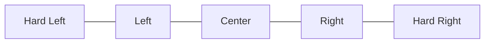
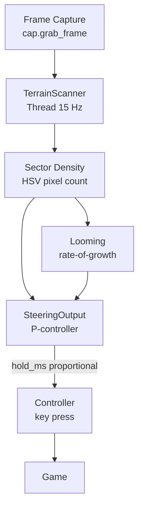

# Design 001 — Terrain Avoidance: High-Level Design Document

| Status | Date       | Wingman Version |
|--------|------------|-----------------|
| Draft  | 2026-05-03 | 1.6.5           |

## Overview

This document describes a general-purpose terrain avoidance capability for Wingman. The goal is to detect mountains, buildings, and other terrain obstacles in the forward view of the aircraft and issue corrective control inputs before impact.

The existing OCR pipeline is unsuitable for this purpose — it runs at 0.8–1.5 s per cycle (from live logs) and handles text regions. Terrain avoidance requires a dedicated fast-scan loop running at 10–20 Hz using pure OpenCV operations on the captured frame.

---

## Current System Timing (from wingman.log, 2026-05-02)

| Metric | Observed |
|---|---|
| OCR cycle time (typical) | 0.40 – 0.66 s |
| OCR cycle time (worst case) | 0.80 s |
| Background OCR interval | ~1.0 – 1.5 s |
| SDL weapon fire interval | ~1.1 s |
| SDL padlock interval | ~6 s |
| Frame capture (cap) | present, reused |

The OCR pipeline is already saturating CPU during battle. Any terrain detection approach must be designed to add minimal CPU overhead and must not share threads with the OCR executor.

---

## Detection Strategy

### Primary: HSV Pixel Density

Divide a horizontal scan band across the forward viewport into five sectors.



For each sector, count pixels matching terrain HSV ranges (mountain gray-brown, vegetation green-brown, building gray-tan). If total density in the center sector exceeds a threshold the aircraft is on a collision course. Lateral imbalance between left and right sectors drives the roll correction.

Terrain HSV ranges (starting point, requires per-map tuning):

| Surface | H range | S range | V range |
|---|---|---|---|
| Mountain / rock | 0–25 | 0–80 | 30–180 |
| Vegetation | 25–80 | 30–180 | 20–160 |
| Buildings / concrete | 0–20 | 0–60 | 80–210 |

### Secondary: Looming Detection (rate-of-growth)

Track center-sector density across consecutive frames. If density is growing faster than a threshold it indicates the terrain is expanding toward the aircraft (imminent collision), regardless of absolute pixel count. This catches edge cases where terrain colors partially overlap with sky or water.

```
looming_signal = (density_t1 - density_t0) / dt
```

When `looming_signal > loom_threshold`, upgrade severity to emergency pull-up regardless of density level.

---

## Architecture



### TerrainScanner Thread

- Dedicated `threading.Thread`, daemon, stoppable via `threading.Event` (per CLAUDE.md pattern)
- Runs at 15 Hz using `event.wait(timeout=0.067)`
- Acquires the frame via the existing capture object — read-only, no lock needed if capture is already thread-safe
- Owns no OCR, no EasyOCR, no model — pure `cv2.inRange` + `np.count_nonzero`

### Sector Scan Region

A named crop (added to `config.yaml` under `crops`) defines the forward-view band. Recommended starting geometry: center 60% of screen width, vertically covering the horizon band (roughly middle 20% of screen height). This excludes cockpit HUD elements at top and bottom.

### Steering Output (P-controller)

```
lateral_delta  = density_right - density_left        # positive = terrain right of center
pitch_signal   = density_center                       # high = pull up
loom_signal    = (density_center_t1 - density_t0) / dt

roll_hold_ms   = clamp(K_roll  * lateral_delta,  0, MAX_ROLL_MS)
pitch_hold_ms  = clamp(K_pitch * pitch_signal,   0, MAX_PITCH_MS)

# Emergency: looming overrides pitch to max
if loom_signal > LOOM_THRESHOLD:
    pitch_hold_ms = MAX_PITCH_MS
```

All gain constants (`K_roll`, `K_pitch`) and limits (`MAX_ROLL_MS`, `MAX_PITCH_MS`) go in `config.yaml`.

### Priority and Conflict with Existing Loops

The SDL padlock loop and terrain avoidance both issue roll/yaw inputs. A simple priority flag `_terrain_avoiding: bool` is set on the Controller while avoidance is active. The padlock loop checks this flag and skips its padlock press for that cycle.

The weapon loop is unaffected — firing while banking is fine.

---

## Feasibility Assessment — CPU Only

**Verdict: High feasibility. Negligible CPU cost.**

| Operation | Estimated time per frame |
|---|---|
| `cap.grab_frame` | Already running — shared, no extra cost |
| `cv2.cvtColor` (BGR → HSV) | ~0.3 ms (640×360 crop) |
| `cv2.inRange` × 3 masks | ~0.5 ms total |
| `np.count_nonzero` × 5 sectors | < 0.1 ms |
| **Total per frame** | **< 1 ms** |

At 15 Hz: ~15 ms/s of CPU. Current OCR load is 400–800 ms per 1–1.5 s cycle — terrain scanning is ~2% of existing CPU load. No contention with the OCR `ThreadPoolExecutor` because the scanner runs in its own thread with no pool usage.

**Constraints:**
- HSV thresholds require per-map calibration. A single threshold set may produce false positives on water maps or sunset lighting.
- 15 Hz reaction loop gives ~67 ms response granularity — adequate at typical in-game speeds but may be tight in high-speed dives.
- No depth information: cannot distinguish distant terrain (safe) from near terrain (dangerous) by HSV alone. Looming detection partially compensates.

---

## Feasibility Assessment — GPU (Future)

**Verdict: Possible. High complexity, significant quality improvement.**

A GPU-enabled version would replace the HSV heuristic with a monocular depth estimation model (e.g. MiDaS, Depth Anything V2) or a lightweight semantic segmentation model (e.g. MobileNetV3 + DeepLabV3).

| Approach | Latency (GPU) | Latency (CPU) | Advantage |
|---|---|---|---|
| HSV pixel count (proposed) | <1 ms | <1 ms | Low overhead, works now |
| MiDaS depth estimation | ~15–30 ms | ~300–600 ms | True depth, lighting-invariant |
| Semantic segmentation | ~20–40 ms | ~400–900 ms | Discriminates terrain from buildings/water |

**GPU path considerations:**
- Would reuse the PyTorch + CUDA infrastructure already documented in `docs/TODO-enable-gpu-ocr.md`
- Should run in a separate process or dedicated CUDA stream to avoid contention with GPU-accelerated OCR
- Depth model gives a distance map — can threshold at `depth < D_threshold` to get a reliable near-terrain mask without HSV tuning
- Adds ~200–500 MB VRAM for the depth model
- Requires NVIDIA GPU (not available on current hardware per `wingman.log`: `OCR mode: CPU`)

**Recommended GPU architecture delta:** replace `HSVScanner` with `DepthScanner` implementing the same `get_sector_densities()` interface — swap at config level, rest of steering logic unchanged.

---

## Configuration Additions

```yaml
terrain_avoidance:
  enabled: false                  # master switch
  scan_hz: 15                     # scanner loop rate
  center_threshold: 0.08          # fraction of sector pixels to trigger pull-up
  loom_threshold: 0.04            # density growth per second to trigger emergency
  K_roll: 800                     # ms per unit lateral delta
  K_pitch: 600                    # ms per unit center density
  max_roll_ms: 300                # cap on roll key hold
  max_pitch_ms: 400               # cap on pitch key hold
  sector_crop: terrain_forward    # crop key in crops section
```

---

## Integration Points

| Component | Change |
|---|---|
| `analyzer.py` | None — terrain scanner reads frame directly |
| `controller.py` | Add `_terrain_avoiding` flag; padlock loop checks it |
| `main.py` | Instantiate `TerrainScanner`, pass controller; start/stop with battle state |
| `config.yaml` | Add `terrain_avoidance` block and `terrain_forward` crop |
| FSM | Scanner starts on `GAME_BATTLE` enter, stops on exit |

---

## Open Questions

1. **Crop calibration**: the forward-view band geometry will vary by device resolution and game camera FOV. Needs calibration using the existing crop calibration job aid.
2. **Sky/water false positives**: blue sky and water can bleed into the scan band at certain pitch angles. A sky-exclusion HSV mask (high V, low S, blue H) may be needed.
3. **Roll key mapping**: `j`/`l` are currently registered as maneuver-cancel hotkeys. Terrain avoidance rolling must use the same keys — need to confirm they are also bound to in-game roll, and that the cancel-on-press behavior does not fire.
4. **GPU timing**: no GPU hardware available for benchmarking. Depth model latency estimates above are from published benchmarks on comparable hardware.
