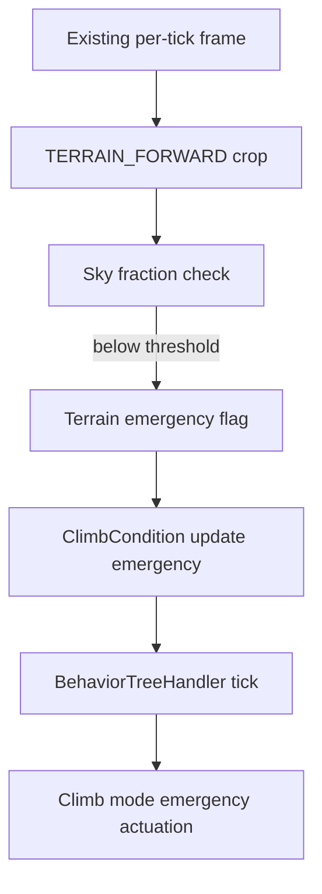

# Design 001 — Terrain Avoidance: High-Level Design Document

| Status | Date       | Wingman Version |
|--------|------------|-----------------|
| Draft  | 2026-09-16 | 1.8.9           |

## Redesign note (2026-09-16)

This document was originally written 2026-05-03 against v1.6.5, proposing a
dedicated 15 Hz forward-view HSV pixel-density scanner. **It was never
implemented** — no trace of `TerrainScanner`, `terrain_avoidance` config, or
a `terrain_forward` crop exists anywhere in the codebase. Two later
documents found this gap the hard way: Design 004 (Strike Package Bravo)
hard-gates itself on "terrain avoidance from Design 001 is enabled and
healthy," a condition that has **never been true**; Design 011 (ACS Mode)
hit the same dependency and explicitly posed the question this redesign
answers — *"if forward-scan terrain avoidance per Design 001 is still the
right approach, versus doubling down on fixing `BoundaryTurn`."*

**Both happened, and neither replaces the other.** `BoundaryTurn` got its
real fix (Anomaly 007, 2026-09-14, live-validated the same night — the
priority-Selector staleness bug that let it ignore a live climb emergency).
But `BoundaryTurn` and the existing ttg-based Climb emergency band
(ADR 073/086) both key off telemetry — altitude and vertical descent
rate — and the map-edge boundary detector. **Neither has ever looked at the
forward camera view.** An aircraft flying level or gently climbing straight
at a cliff face is invisible to all of them: no boundary crossing, no
negative altitude rate, nothing for `ClimbCondition`'s time-to-ground
calculation to key off. That gap is what this document now addresses,
scoped and phased for the first time, rather than the ground-up scanner
subsystem originally proposed.

**Original detection strategy (positive terrain-color HSV matching, 5-sector
scan, dedicated 15 Hz thread) is superseded**, not carried forward — see
"Why the original design doesn't fit" below. The GPU/depth-estimation
section is kept as still-relevant future material, unchanged in substance.

## The problem, measured

**ADR 076 already exists for the specific case this document originally
targeted (spawn crashes) and already helps a lot — it does not fully close
the gap.** ADR 076 (Accepted, 2026-08-17) holds `NOSE_UP_KEY` blindly from
death to spawn, on a fixed timer, with zero vision — it cannot tell a
benign spawn from one that puts a mountain in the flight path, and it only
covers the first few seconds of a life. Its own live trial reported
**0 spawn crashes in 49 respawns**. Tonight's sessions (2026-09-14 through
2026-09-16, the same build) measured **11 spawn crashes across 877
respawns (1.25%)** — including one 14-hour session alone at 7/434 — using
the exact same `MissionStatsTracker` instrument ADR 076 cites (death
3-10s after `restart_last_mission`, `wingman/mission_stats.py`). This is
not a regression in ADR 076 — 1.25% against whatever the true pre-076
baseline was is still a real improvement — but "small samples mislead" cuts
both ways: n=49 showing 0 was never proof of 0%, and n=877 now shows the
guard's blind timing isn't sufficient on its own.

`terrain_blackout_20260914_063746_stuck30s.png` (the reference frame for
this redesign — a hand-placed example, not an actual historical capture;
see "Evidence capture" below for why the filename shape matters anyway)
shows exactly the failure ADR 076 cannot see: the aircraft is flying level
at 1067 m, 1078 KPH, a rock formation filling the frame dead ahead from the
lower third to well above the boresight. Nothing currently watching this
aircraft — not `ClimbCondition` (no descent), not `BoundaryTurn` (no map
edge), not ADR 076's guard (timer already expired) — would react before
impact if it kept flying straight. **The reference screenshot's own flight
state (level, steady speed, stable HUD) shows this is not necessarily a
freshly-spawned aircraft — it's the general "flying into unseen terrain"
failure mode, of which a bad spawn heading is the specific, measured,
motivating case, not the only one.** Phase 1 targets the measured spawn-crash
case; the detector itself is not spawn-specific and should help beyond it
once shipped.

**Second reference, a different map:**
`terrain2_screenshot_20260916_024055.png` — an ice/snow map, 693 m, 1046
KPH, a wall of ice and rock filling the frame from dead ahead to well above
the boresight, HUD showing an ongoing engagement (enemy nameplates, health
bars), not a fresh spawn. This confirms the earlier point directly: the
failure is not spawn-exclusive. It also raises the sharpest evidence yet for
the per-map color-variance concern under "Why the original design doesn't
fit" — this map's overcast sky is a hazy pale blue-gray, and the ice cliff
itself is white-to-pale-blue, i.e. **close to the sky's own color**, unlike
the first (rocky/desert) reference where clean blue sky and tan-gray rock
are easy to tell apart by hue alone. A single fixed sky-HSV range tuned
against one map's sky is not guaranteed to hold on this one. See Open
Question 1 and 3 below — this is now a measured concern with two concrete,
different-map examples behind it, not a hypothetical "other maps may
differ" caveat.

## Why the original design doesn't fit

- **A dedicated 15 Hz thread doesn't match how this codebase does
  perception.** Every existing per-tick vision signal (`BoundaryPerceptionHandler
  .perceive()`, telemetry OCR, health/ammo OCR) runs once per the main
  loop's existing ~1.5 s tick, called before the behavior tree ticks — not
  in a parallel thread at a different rate. A second, independently-clocked
  vision loop is exactly the kind of surface Anomaly 007 just got fixed for
  a *different* reason (state going stale between independently-timed
  components) — introducing a new one on purpose, in the same season, needs
  a much stronger reason than "the original doc proposed 15 Hz." Phase 1
  below shares the existing tick instead.
- **Positive terrain-color HSV matching (mountain gray-brown, vegetation
  green-brown, building gray-tan) is the fragile part of the original
  design, and the original document already said so under Open Questions**
  ("HSV thresholds require per-map calibration... may produce false
  positives on water maps or sunset lighting"). The operator's own framing
  for this redesign — *"other maps may have different objects to
  avoid"* — is the same concern restated. `detect_map_boundary` (ADR
  107/108/133) looks superficially similar (HSV mask → connected
  components) but solves a different problem: one fixed-hue thin HUD stroke
  on a known background, not classifying large, irregular, per-map-varying
  natural terrain. That approach doesn't transfer. Phase 1 proposes
  detecting the *absence of sky* instead of the presence of terrain — see
  below. **This substitution has its own limit, now evidenced by the two
  reference frames rather than assumed**: sky-absence still depends on sky
  being reliably distinguishable from terrain by color, and the second
  reference (ice map, hazy pale sky against a white-to-pale-blue ice cliff)
  is a real case where that's much closer to failing than the first
  (rock map, clean blue sky against tan-gray rock). Flagged, not solved,
  under Open Questions 1 and 3 — Phase 1 ships shadow-first specifically
  because this is a real, not hypothetical, risk.
- **A brand-new actuator isn't needed.** `Controller.climb_mode(...,
  emergency=True)` (ADR 073/086/137) already exists, is exactly "pitch up
  hard, forcefully, overriding the normal pulse/observe cadence," and is
  the same mechanism this project spent tonight fixing and live-validating
  (Anomaly 007: 117 real emergency firings, zero failures, three sessions).
  Phase 1 reuses it directly rather than building a second nose-up
  actuator.

## Phase 1 — forward sky-occlusion, feeding the existing emergency-climb path

**Scope, deliberately narrow.** Detect "something is filling the forward
view where sky should be" and force the existing emergency climb. No
lateral/roll avoidance, no sector steering, no looming/rate-of-growth
signal, no per-map HSV tuning system. Those are explicitly Phase 2+ (see
below) — Phase 1 exists to close the measured 1.25% spawn-crash gap with
the smallest change that plugs into infrastructure already proven tonight.



The debounce (below threshold for `confirm_reads` consecutive ticks, not a
single reading) and the reused-mechanism detail (Anomaly 007's pre-tick
hook, ADR 073/086/137's existing actuator) are described in prose below,
not crammed into the diagram — matching this project's own Mermaid
convention of plain, single-line node labels.

### Detection: sky-fraction, not terrain-color

Crop one forward-center region — not five sectors — biased toward where
sky belongs during safe level/climbing flight (roughly the upper-middle of
the frame, excluding the bottom band where ground is normally visible even
when safe, and excluding known HUD regions at top/top-right/bottom; exact
fractional bounds need the same pixel-measurement calibration this
project already does for every other crop, not a guess from one reference
frame).

For each tick, classify pixels in that crop as sky-like (broad blue hues,
or high-value/low-saturation white for cloud) via `cv2.inRange` on an HSV
conversion — the same primitive `detect_map_boundary` and the telemetry OCR
preprocessing already use, just with different thresholds and no
connected-components step (Phase 1 needs a fraction, not a shape). If the
sky fraction drops below `sky_min_frac` for `confirm_reads` consecutive
ticks — the identical debounce shape `ClimbCondition`'s own ttg trigger
already uses, "one bad reading must never command a climb" — raise a
terrain-ahead signal.

**Explicitly not attempted in Phase 1**: classifying *what* is occluding
the sky (rock vs building vs another aircraft's fuselage filling the frame
at close range). A false positive here still only forces a climb — the
same de-escalating bar every other auto-action in this codebase is held
to — so the cost of over-triggering is a wasted altitude gain, not a wrong
or dangerous action.

### Actuation: extend the existing emergency signal, don't build a parallel one

`ClimbCondition.update_emergency` (the method Anomaly 007 added tonight,
called unconditionally every tick before `tree.tick()`) currently computes
`emergency` from ttg alone. Phase 1 extends it: `emergency = ttg_emergency
or terrain_ahead`. Everything downstream — `BoundaryTurn`'s yield check,
the `DIVE RECOVERY`-style warning log (a parallel `TERRAIN AHEAD` line),
`_active` forcing, `climb_mode(emergency=True)` actuation — is already
built, already tested, and now has three full sessions of live validation
behind it (Anomaly 007). This is deliberate: a second emergency source
sharing the first one's already-proven pipeline is a much smaller, safer
change than a second pipeline next to it.

### Evidence capture

On the first tick a terrain-ahead emergency fires, save a frame using the
exact same shape as `UnknownAnomalyRecorder`/`HealthDropoutRecorder`/
`BoundaryPerceptionHandler._capture_boundary_frame` (ADR 074/080/087/106/108):
`test_screenshots/terrain_blackout_<timestamp>_stuck<n>s.png` — the
reference file's own name is that convention, applied in advance. Capped
per-session like its siblings; never raises (wrapped, logs a warning on
failure per the established pattern).

### Config

```yaml
terrain_avoidance:
  enabled: false                  # master switch — Phase 1 ships off
  sky_min_frac: 0.55              # below this, sky is considered occluded
  confirm_reads: 2                # same debounce shape as climb.confirm_reads
  crop: TERRAIN_FORWARD           # new crop key, coordinates via calibration
  sky_hsv:
    lower: [90, 0, 120]           # placeholder — needs corpus measurement
    upper: [140, 60, 255]
```

`TERRAIN_FORWARD` added to `crops:` via the existing calibration tool, not
guessed — matching this project's own convention (the STALL_PARTS_CRATE
crops shipped this session were pixel-measured from a reference frame, not
estimated).

### Testing plan

- Unit: a synthetic sky-blue frame never triggers; a synthetic frame with
  the lower crop region replaced by rock-toned pixels (built from real
  HSV ranges sampled off the reference frame, not invented) does, after
  `confirm_reads` ticks, not one; a single-tick sky dropout (e.g., a UI
  flash) does not trigger — mirrors `TestTimeToGroundRecovery`'s existing
  shape in `test_behavior_tree.py`.
- Integration: extend `test_reproduces_the_incident_without_the_pre_tick_update`
  /`test_yields_to_climb_when_the_pre_tick_update_runs`'s pattern (Anomaly
  007) with a terrain-triggered case using the real tree, confirming
  `BoundaryTurn` yields to a terrain emergency exactly as it does to a ttg
  one — same shared `_emergency_active` flag, so this should require no new
  yield-path code, only a new test proving it.
- Live: shadow-first (ADR 073's own precedent) — log `TERRAIN AHEAD` and
  capture evidence without actuating for the first live sessions, so false
  positive rate is measured against real gameplay before the emergency
  climb is allowed to fire. Graduate to active once a session shows the
  detector agrees with operator judgment on captured frames.

## Phase 2+ (not designed here, explicitly deferred)

- **Lateral avoidance.** Phase 1 only pitches up. A wall too tall to climb
  over, or terrain that a roll would clear faster, needs the original
  document's sector/lateral-delta idea — revisit once Phase 1's pitch-only
  response has live data showing how often it's insufficient alone.
- **Looming (rate-of-growth).** The original secondary signal, useful for
  catching a fast, shallow approach a static sky-fraction threshold might
  miss. Needs Phase 1's frame-by-frame sky fraction already being computed
  as its input, so it's a cheap add-on once Phase 1 has live data to tune
  against, not a blocker for shipping Phase 1.
- **Per-map HSV recalibration / robustness.** Sky can vary further than
  Phase 1's single tuned range covers (storms, night maps, colored
  nebula-style skyboxes if any exist). Whether that needs per-map profiles,
  a wider tolerant range, or a fundamentally different signal (horizon-line
  detection, texture variance) is a real open question — do not expand
  scope on it until Phase 1's live data shows it's actually needed on a map
  in rotation, per this project's own "don't guess ahead of measurement"
  discipline.
- **GPU depth/segmentation path** — unchanged from the original document,
  reproduced below for continuity.

### Feasibility Assessment — GPU (Future, unchanged from the original document)

**Verdict: Possible. High complexity, significant quality improvement.**

A GPU-enabled version would replace the HSV heuristic with a monocular
depth estimation model (e.g. MiDaS, Depth Anything V2) or a lightweight
semantic segmentation model (e.g. MobileNetV3 + DeepLabV3).

| Approach | Latency (GPU) | Latency (CPU) | Advantage |
|---|---|---|---|
| Sky-fraction HSV (Phase 1) | <1 ms | <1 ms | Low overhead, works now |
| MiDaS depth estimation | ~15–30 ms | ~300–600 ms | True depth, lighting-invariant |
| Semantic segmentation | ~20–40 ms | ~400–900 ms | Discriminates terrain from buildings/water |

**GPU path considerations:**
- Would reuse the PyTorch + CUDA infrastructure already documented in
  `docs/TODO-enable-gpu-ocr.md`.
- Should run in a separate process or dedicated CUDA stream to avoid
  contention with GPU-accelerated OCR.
- Depth model gives a distance map — can threshold at `depth < D_threshold`
  to get a reliable near-terrain mask without HSV tuning at all.
- Adds ~200–500 MB VRAM for the depth model.
- Requires NVIDIA GPU (not available on current hardware per
  `wingman.log`: `OCR mode: CPU`).

## Integration Points (Phase 1)

| Component | Change |
|---|---|
| `wingman/analyzer.py` | New sky-fraction detection function, same shape as `detect_map_boundary` |
| `wingman/behavior_tree.py` | `ClimbCondition.update_emergency` gains the `terrain_ahead` OR-term; no new leaf, no new tactic |
| `wingman/tick_handlers.py` | Pass the terrain-ahead reading into the same pre-tick call Anomaly 007 already wired |
| `wingman/config.yaml` | Add `terrain_avoidance` block and `TERRAIN_FORWARD` crop |
| `wingman/config_schema.py` | Validate the new block, same shape as `eject_stuck_detector` |
| No FSM change | Terrain-ahead is a per-tick reading, not a state; it feeds an existing condition, not a new transition |

## Open Questions

1. **Sky HSV range calibration, now a two-map problem, not a one-map
   guess.** The rock-map reference (clean blue sky vs tan-gray rock) and
   the ice-map reference (hazy pale sky vs white-to-pale-blue ice) need
   real corpus measurement — pixel sampling across both, plus more maps as
   they're encountered — before Phase 1 can ship active rather than
   shadow-only. It is now a measured open question whether *one* fixed
   `sky_hsv` range can cover both, or whether the ice map specifically
   pushes this toward needing a wider tolerance, a per-map profile, or a
   different signal entirely (e.g. brightness/texture variance instead of
   hue) — do not guess the answer before the corpus measurement exists.
2. **Crop geometry**: the forward-center band's exact fractional bounds
   need calibration against actual HUD layout (top kill-counter, top-right
   minimap, bottom weapon/fuel readouts) so the detector never reads HUD
   chrome as "not sky" — confirmed necessary on both reference frames,
   which have different HUD element positions/content (enemy nameplates
   visible in the ice-map reference, absent in the rock-map one).
3. **False-positive rate over ordinary gameplay**: clouds, other aircraft,
   smoke/tracer effects, falling snow (visible in the ice-map reference —
   a texture the rock-map reference doesn't have at all), and steep
   intentional dives could all reduce sky fraction without real terrain
   risk. The shadow-first live trial (Testing plan, above) exists
   specifically to measure this before actuation is enabled — do not
   assume the answer, and do not assume the two reference maps bound the
   full range of conditions this will see live.
4. **Whether Phase 1 alone measurably reduces the 1.25% spawn-crash rate**
   is itself unverified until live data exists — this document proposes a
   plausible mechanism, not a proven fix.
5. **Design 004 and Design 011's dependency on this document**: both should
   be revisited once Phase 1 ships (Design 004's currently-unsatisfiable
   hard gate, Design 011's open fork question) — not done as part of this
   redesign, which is scoped to Design 001 itself.

## References

- ADR 076 — the existing blind spawn-attitude guard; Phase 1 is a
  complementary, vision-based layer, not a replacement.
- ADR 073/086/137 — the emergency-climb mechanism (`ClimbCondition`,
  `climb_mode(emergency=True)`) Phase 1 reuses rather than duplicates.
- ADR 107 — `BoundaryTurn`; Anomaly 007 fixed the staleness bug that let it
  ignore a live climb emergency, and Phase 1's terrain signal flows through
  that same, now-fixed, now-validated path.
- ADR 133 — `detect_map_boundary`'s void/absence detection pattern, the
  closest existing precedent for Phase 1's "detect the absence of sky"
  approach (detecting absence rather than a specific positive signature).
- `docs/anomaly/007-boundary-turn-never-yields-to-a-live-climb-emergency.md`
  — the fix and its live validation this design builds on directly.
- `test_screenshots/terrain_blackout_20260914_063746_stuck30s.png` — Phase 1
  reference frame 1 (rock/desert map, clean sky-vs-rock color separation).
- `test_screenshots/terrain2_screenshot_20260916_024055.png` — Phase 1
  reference frame 2 (ice/snow map, hazy sky close to ice-cliff color — the
  harder case for the sky-fraction approach; see Open Questions 1 and 3).
- Design 004 — Strike Package Bravo; currently hard-gated on this document
  in a condition that has never been true.
- Design 011 — ACS Mode; posed the fork this redesign resolves.
