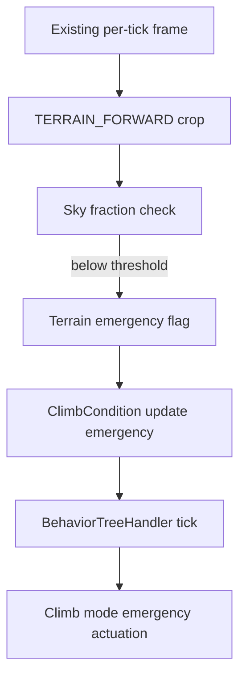
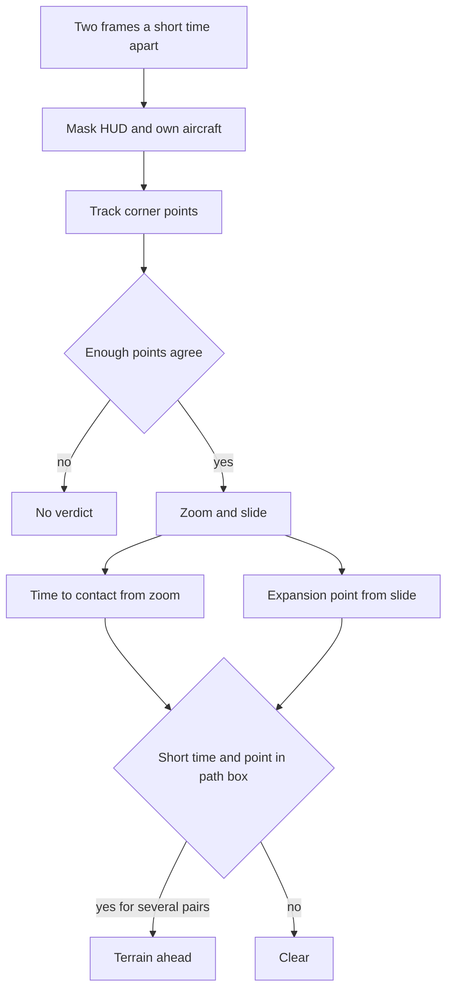
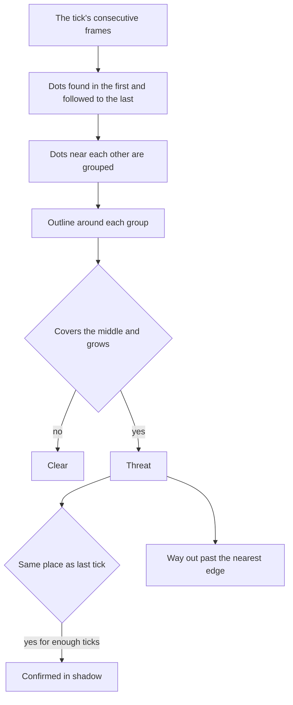
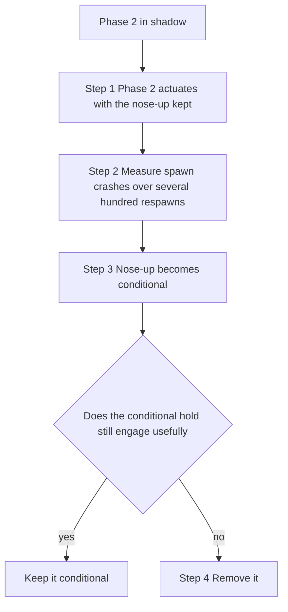

# Design 001 — Terrain Avoidance: High-Level Design Document

| Status | Date       | Wingman Version |
|--------|------------|-----------------|
| Active | 2026-09-20 | 1.8.9           |

## Redesign note (2026-09-16)

This document was originally written 2026-05-03 against v1.6.5, proposing a
dedicated 15 Hz forward-view HSV pixel-density scanner. **It was never
implemented** — no trace of `TerrainScanner`, `terrain_avoidance` config, or
a `terrain_forward` crop exists anywhere in the codebase. Two later
documents found this gap the hard way: Design 004 (Strike Package Bravo)
hard-gates itself on "terrain avoidance from Design 001 is enabled and
healthy," a condition that has **never been true**; Design 011 (ACS Mode)
hit the same dependency and explicitly posed the question this redesign
answers — *"if forward-scan terrain avoidance per Design 001 is still the
right approach, versus doubling down on fixing `BoundaryTurn`."*

**Both happened, and neither replaces the other.** `BoundaryTurn` got its
real fix (Anomaly 007, 2026-09-14, live-validated the same night — the
priority-Selector staleness bug that let it ignore a live climb emergency).
But `BoundaryTurn` and the existing ttg-based Climb emergency band
(ADR 073/086) both key off telemetry — altitude and vertical descent
rate — and the map-edge boundary detector. **Neither has ever looked at the
forward camera view.** An aircraft flying level or gently climbing straight
at a cliff face is invisible to all of them: no boundary crossing, no
negative altitude rate, nothing for `ClimbCondition`'s time-to-ground
calculation to key off. That gap is what this document now addresses,
scoped and phased for the first time, rather than the ground-up scanner
subsystem originally proposed.

**Original detection strategy (positive terrain-color HSV matching, 5-sector
scan, dedicated 15 Hz thread) is superseded**, not carried forward — see
"Why the original design doesn't fit" below. The GPU/depth-estimation
section is kept as still-relevant future material, unchanged in substance.

## The problem, measured

**ADR 076 already exists for the specific case this document originally
targeted (spawn crashes) and already helps a lot — it does not fully close
the gap.** ADR 076 (Accepted, 2026-08-17) holds `NOSE_UP_KEY` blindly from
death to spawn, on a fixed timer, with zero vision — it cannot tell a
benign spawn from one that puts a mountain in the flight path, and it only
covers the first few seconds of a life. Its own live trial reported
**0 spawn crashes in 49 respawns**. Tonight's sessions (2026-09-14 through
2026-09-16, the same build) measured **11 spawn crashes across 877
respawns (1.25%)** — including one 14-hour session alone at 7/434 — using
the exact same `MissionStatsTracker` instrument ADR 076 cites (death
3-10s after `restart_last_mission`, `wingman/mission_stats.py`). This is
not a regression in ADR 076 — 1.25% against whatever the true pre-076
baseline was is still a real improvement — but "small samples mislead" cuts
both ways: n=49 showing 0 was never proof of 0%, and n=877 now shows the
guard's blind timing isn't sufficient on its own.

`terrain_blackout_20260914_063746_stuck30s.png` (the reference frame for
this redesign — a hand-placed example, not an actual historical capture;
see "Evidence capture" below for why the filename shape matters anyway)
shows exactly the failure ADR 076 cannot see: the aircraft is flying level
at 1067 m, 1078 KPH, a rock formation filling the frame dead ahead from the
lower third to well above the boresight. Nothing currently watching this
aircraft — not `ClimbCondition` (no descent), not `BoundaryTurn` (no map
edge), not ADR 076's guard (timer already expired) — would react before
impact if it kept flying straight. **The reference screenshot's own flight
state (level, steady speed, stable HUD) shows this is not necessarily a
freshly-spawned aircraft — it's the general "flying into unseen terrain"
failure mode, of which a bad spawn heading is the specific, measured,
motivating case, not the only one.** Phase 1 targets the measured spawn-crash
case; the detector itself is not spawn-specific and should help beyond it
once shipped.

**Second reference, a different map:**
`terrain2_screenshot_20260916_024055.png` — an ice/snow map, 693 m, 1046
KPH, a wall of ice and rock filling the frame from dead ahead to well above
the boresight, HUD showing an ongoing engagement (enemy nameplates, health
bars), not a fresh spawn. This confirms the earlier point directly: the
failure is not spawn-exclusive. It also raises the sharpest evidence yet for
the per-map color-variance concern under "Why the original design doesn't
fit" — this map's overcast sky is a hazy pale blue-gray, and the ice cliff
itself is white-to-pale-blue, i.e. **close to the sky's own color**, unlike
the first (rocky/desert) reference where clean blue sky and tan-gray rock
are easy to tell apart by hue alone. A single fixed sky-HSV range tuned
against one map's sky is not guaranteed to hold on this one. See Open
Question 1 and 3 below — this is now a measured concern with two concrete,
different-map examples behind it, not a hypothetical "other maps may
differ" caveat.

## Why the original design doesn't fit

- **A dedicated 15 Hz thread doesn't match how this codebase does
  perception.** Every existing per-tick vision signal (`BoundaryPerceptionHandler
  .perceive()`, telemetry OCR, health/ammo OCR) runs once per the main
  loop's existing ~1.5 s tick, called before the behavior tree ticks — not
  in a parallel thread at a different rate. A second, independently-clocked
  vision loop is exactly the kind of surface Anomaly 007 just got fixed for
  a *different* reason (state going stale between independently-timed
  components) — introducing a new one on purpose, in the same season, needs
  a much stronger reason than "the original doc proposed 15 Hz." Phase 1
  below shares the existing tick instead.
- **Positive terrain-color HSV matching (mountain gray-brown, vegetation
  green-brown, building gray-tan) is the fragile part of the original
  design, and the original document already said so under Open Questions**
  ("HSV thresholds require per-map calibration... may produce false
  positives on water maps or sunset lighting"). The operator's own framing
  for this redesign — *"other maps may have different objects to
  avoid"* — is the same concern restated. `detect_map_boundary` (ADR
  107/108/133) looks superficially similar (HSV mask → connected
  components) but solves a different problem: one fixed-hue thin HUD stroke
  on a known background, not classifying large, irregular, per-map-varying
  natural terrain. That approach doesn't transfer. Phase 1 proposes
  detecting the *absence of sky* instead of the presence of terrain — see
  below. **This substitution has its own limit, now evidenced by the two
  reference frames rather than assumed**: sky-absence still depends on sky
  being reliably distinguishable from terrain by color, and the second
  reference (ice map, hazy pale sky against a white-to-pale-blue ice cliff)
  is a real case where that's much closer to failing than the first
  (rock map, clean blue sky against tan-gray rock). Flagged, not solved,
  under Open Questions 1 and 3 — Phase 1 ships shadow-first specifically
  because this is a real, not hypothetical, risk.
- **A brand-new actuator isn't needed.** `Controller.climb_mode(...,
  emergency=True)` (ADR 073/086/137) already exists, is exactly "pitch up
  hard, forcefully, overriding the normal pulse/observe cadence," and is
  the same mechanism this project spent tonight fixing and live-validating
  (Anomaly 007: 117 real emergency firings, zero failures, three sessions).
  Phase 1 reuses it directly rather than building a second nose-up
  actuator.

## Phase 1 — forward sky-occlusion, feeding the existing emergency-climb path

**Scope, deliberately narrow.** Detect "something is filling the forward
view where sky should be" and force the existing emergency climb. No
lateral/roll avoidance, no sector steering, no looming/rate-of-growth
signal, no per-map HSV tuning system. Those are explicitly Phase 2+ (see
below) — Phase 1 exists to close the measured 1.25% spawn-crash gap with
the smallest change that plugs into infrastructure already proven tonight.


```mermaid
flowchart TD
    F[Existing per-tick frame] --> C[TERRAIN_FORWARD crop]
    C --> S[Sky fraction check]
    S -->|below threshold| E[Terrain emergency flag]
    E --> CC[ClimbCondition update emergency]
    CC --> T[BehaviorTreeHandler tick]
    T --> CM[Climb mode emergency actuation]
```

The debounce (below threshold for `confirm_reads` consecutive ticks, not a
single reading) and the reused-mechanism detail (Anomaly 007's pre-tick
hook, ADR 073/086/137's existing actuator) are described in prose below,
not crammed into the diagram — matching this project's own Mermaid
convention of plain, single-line node labels.

### Detection: sky-fraction, not terrain-color

Crop one forward-center region — not five sectors — biased toward where
sky belongs during safe level/climbing flight (roughly the upper-middle of
the frame, excluding the bottom band where ground is normally visible even
when safe, and excluding known HUD regions at top/top-right/bottom).
Implemented as `TERRAIN_FORWARD`: `x: 0.3-0.7, y: 0.1-0.55` — measured, not
guessed, the same pixel-measurement discipline this project already uses
for every other crop. The first candidate bounds/HSV range (see below)
would have FAILED to detect either reference incident — direct
measurement against both reference frames caught this before it shipped,
not after a live session did.

For each tick, classify pixels in that crop as sky-like (broad blue hues,
or high-value/low-saturation white for cloud) via `cv2.inRange` on an HSV
conversion — the same primitive `detect_map_boundary` and the telemetry OCR
preprocessing already use, just with different thresholds and no
connected-components step (Phase 1 needs a fraction, not a shape). If the
sky fraction drops below `sky_min_frac` for `confirm_reads` consecutive
ticks — the identical debounce shape `ClimbCondition`'s own ttg trigger
already uses, "one bad reading must never command a climb" — raise a
terrain-ahead signal.

**Explicitly not attempted in Phase 1**: classifying *what* is occluding
the sky (rock vs building vs another aircraft's fuselage filling the frame
at close range). A false positive here still only forces a climb — the
same de-escalating bar every other auto-action in this codebase is held
to — so the cost of over-triggering is a wasted altitude gain, not a wrong
or dangerous action.

### Actuation: extend the existing emergency signal, don't build a parallel one

`ClimbCondition.update_emergency` (the method Anomaly 007 added tonight,
called unconditionally every tick before `tree.tick()`) currently computes
`emergency` from ttg alone. Phase 1 extends it: `emergency = ttg_emergency
or terrain_ahead`. Everything downstream — `BoundaryTurn`'s yield check,
the `DIVE RECOVERY`-style warning log (a parallel `TERRAIN AHEAD` line),
`_active` forcing, `climb_mode(emergency=True)` actuation — is already
built, already tested, and now has three full sessions of live validation
behind it (Anomaly 007). This is deliberate: a second emergency source
sharing the first one's already-proven pipeline is a much smaller, safer
change than a second pipeline next to it.

### Evidence capture (done)

Implemented as `BehaviorTreeHandler._capture_terrain_frame`, same
cap-and-never-raise shape as ADR 137 D5's `_capture_crash_frame`: saves the
tick's frame on the FALSE→TRUE edge of `terrain_ahead_active` (via a new
`tree.climb_terrain_ahead_fn` exposure, mirroring `climb_emergency_fn`), not
on every tick the trigger stays latched. Filename convention deviates from
the original design sketch above — `test_screenshots/terrain_ahead/
terrain_<timestamp>_<seq>.png`, matching the actual established
per-feature-subdirectory convention (`unknown_anomalies/`,
`crash_with_missiles/`) rather than the flat `terrain_blackout_..._stuck<n>s`
name, which was really the ad hoc naming of the one manually-saved reference
screenshot, not a designed convention. Capped via
`behavior_tree.climb.terrain_avoidance.capture_max` (40 in config.yaml; 0
disables) — no separate enabled flag, since capture is already a no-op
whenever the trigger itself is disabled.

Added after the first live shadow trial (2026-09-16) produced firings that
could only be judged from log text and altitude/weapon-fire timing
correlation — inferred, not measured, which is exactly the gap this section
originally called out and then shipped Phase 1 without.

**`capture_cooldown_s` (added same day, after watching that trial run).**
The 20-frame starting budget emptied in 42 minutes of real flight, then a
single ~5-minute dogfight — banked and rolling near real canyon terrain,
re-crossing the FALSE→TRUE edge every 10-25s as cloud cover and attitude
fluctuated — burned most of what was left, leaving the remaining ~5+ hours
of that session with no capture budget for whatever happened later
(including at least one more genuine spawn-into-terrain firing with no
photo to show for it). `capture_cooldown_s` (20.0s in config.yaml) bounds
how much budget one episode can spend, checked before the cap so a
cooldown-blocked attempt doesn't consume it either; `capture_max` was
raised to 40 alongside it. Both are diagnostic tuning, not safety
parameters — shrinking the evidence trail never changes what the trigger
itself does.

### Overlay on the live HUD (2026-10-03, wingman 1.9.0)

`tests/test-output/live_hud.png` ([Design 005](005-target-tracking-hldd.md)) shows what this detector saw, so
a reading can be judged against the picture while a session runs. Until now the only evidence was a log line
and raw frames saved on the trigger's rising edge.

- **Box**: the `TERRAIN_FORWARD` crop. Green is clear, yellow is below `sky_min_frac` but not yet confirmed,
  red is terrain ahead, grey is no reading.
- **Tint**: the pixels the sky test accepted, tinted green. It comes from `GameStateAnalyzer.terrain_sky_mask`,
  the same mask `detect_terrain_ahead` takes its fraction from, not from a second copy of the test.
- **Status line**: `Terrain[SHADOW]: sky 0.31  TERRAIN AHEAD  view 0.31  min 0.55`. `sky` is the detector's
  reading from its last tick. `view` is the same test on the frame drawn. They differ when the reading is a
  tick old, and `sky` is absent ("no reading") on ticks the padlock gate (ADR 142) skips.
- **Stale**: the pursuit loops also write the HUD and render several times between readings. A reading older
  than 4 s is drawn grey, so an old alarm is not shown as live.

The saved evidence frames in `test_screenshots/terrain_ahead/` stay unannotated. The overlay is off when
`behavior_tree.climb.terrain_avoidance.enabled` is false. It adds no config key.

| Date | Code | Game | Observation | Label |
|------|------|------|-------------|-------|
| 2026-10-03 23:38:14 to 23:38:54 | same, health gate live | not recorded | **Forty seconds measured second by second in live battle: one picture change in every second, without exception.** Altitude 4,826 m, state `GAME_BATTLE_EJECT`, health on screen. The picture had been at 28 to 29 a second from 23:37:27 to about 23:37:50. An exact one a second, with no jitter, points at the display side and not the game: Xwayland falls back to a one-second timer for a window the desktop is not drawing. The desktop's window list cannot be read from outside the shell, so this is still not observed. The health gate held: all 105 shape readings of the session were taken with health being read, and none without. Stop requested with `z` at 23:39:38. | measured; the cause is inferred |
| 2026-10-03 23:37:05 | same, health gate live | not recorded | **A third kind of slow picture: before the round starts.** 23 s into the session's first battle the probe measured 1.0 picture change a second; the screen ([picture](001-terrain-avoidance/game-reports-fps-2-before-the-round-starts-20261003-233705.png)) shows the match clock at 5:00, the score 0 to 0, a washed-out view and the game's counter at `FPS 2`. 22 s later the same measurement gave 29 changes a second and the counter read `FPS 29`. So the game itself runs slowly while it holds a round before the start, as it did on the round-end screen (19:27) and on joining a match in progress (19:38, with the Good Luck banner up). None of those three is a hidden window. What is still unexplained is the 19:11 session's last battles, which the recording shows at one picture a second for minutes at a time. Two background mapping jobs were running during this measurement, so 29 against the 49 measured at 19:25 is not a clean comparison. | measured; the cause of the long spells is not established |
| 2026-10-03 22:58 | picture outlines, `lost`, plus the health gate | not recorded | **The looming and shape detectors now run only while health is being read.** Operator's rule of 2026-10-03, after the round-end MVP card was measured as terrain for 20 s at 19:27 while the state still said battle. The gate is the analyzer's own `game_battle_alive`, which goes false after 6 s without health digits, so up to four ticks of a new screen can still be read. Replayed on the two sessions before it: the gate would have removed 65 of 409 shape ticks (48 of them frozen) in the 18:18 session and 151 of 790 (64 frozen) in the 19:11 session. The sky test is not gated by it. Not yet run live. | measured from the earlier logs; unmeasured live |
| 2026-10-03 19:38:00 | same | not recorded | **The slow picture is real: the game's own counter read `FPS 1` in live battle.** The probe measured 1.0 picture change a second and kept the screen ([picture](001-terrain-avoidance/game-reports-fps-1-in-battle-20261003-193800.png)): a live battle, 866 KPH at 853 m, flying at a mountain, with `FPS 1` in red at the bottom left. So the 19:27 row's doubt is withdrawn: the round-end screen there was also at one change a second, and the probe read 1.0 again at 19:31. The picture was at 49 a second at 19:25 and at 1 from about 19:27 on. On `:3` the Wine Desktop window held the input focus and was the only window, so focus inside the nested display is not the cause. The desktop was not blanked or locked. What is left is the host side: Xwayland paces a window the compositor is not showing at one frame a second, which matches the figure exactly, but whether the nested window was covered at the time was not observed. Stop requested with `z` at 19:38. | measured, except the cause, which is inferred |
| 2026-10-03 19:27:01 | same | not recorded | **The first freeze caught by the probe was the round-end screen, not a slow game.** Ticks alternated frozen and readable from 19:27:01; the probe measured 1.0 picture change a second on `:3` (49 a second two minutes earlier) and kept the screen: the MVP card over a slow fly-past ([picture](001-terrain-avoidance/frozen-ticks-on-the-round-end-screen-20261003-192701.png)). Wingman was still in `GAME_BATTLE_EJECT` and did not reach `GAME_END_B` until 19:27:21, so the shape and looming detectors ran on that screen for 20 s. This is the same alternating pattern that the 16:10 and 18:22 rows read as the game dropping to one picture a second. Those rows are now in doubt: some or all of those ticks may have been screens like this one, read while the state still said battle. Not yet checked against those logs. | measured for this spell; the earlier rows are unverified |
| 2026-10-03 19:19:05 | same | not recorded | **First live sight of the `lost` rule, before a death logged `cause=terrain`.** Tick by tick over the last 30 s: threat, threat, nothing found (127 dots, so read as clear), threat, then four ticks that found nothing with 18, 1, 7 and 5 dots, now `blind`; later threat, threat, then two more with 4 and 3 dots, `blind`. Before this change all six would have read `clear`. 20 of the session's first 420 shape ticks took the new verdict. The two terrain deaths before it (19:15:47, 19:16:40) had no such tick: each threat was followed by a shape still in the middle. One death, so no rate. | measured |
| 2026-10-03 19:11 session | same | not recorded | **The frozen picture is real but comes and goes, and it is not tied to one game state.** Frozen share of shape ticks, `GAME_BATTLE` and `GAME_BATTLE_EJECT`: 15:06 session 13 and 17 percent; 18:18 session 42 and 51 percent; this session (first 14 minutes) 4 and 10 percent. Measured directly on `:3` at 19:25 in a healthy spell: 49 picture changes a second. One 30 s spell of wholly frozen ticks at 19:22:41 cleared without anything being done. The desktop was not blanked or locked at the time (power save 0, screensaver off). A probe now measures the real picture rate and keeps a screenshot the next time ticks freeze. Not the cause: a ten-minute desktop timer (`shell-cgroup-sampler`) ran 20 s before this spell but 3 minutes before the 18:22 one and after the 16:10 one. | measured; cause not established |
| 2026-10-03 18:22 onward | same | not recorded | **The picture froze again four minutes into the session, so this run cannot judge the `lost` change.** 18:19 to 18:21: 0 of 93 shape ticks read `same-frame`. From 18:22: about half of every minute's ticks did (12 of 40, 22 of 40, 18 of 39, 19 of 38), each after a full frozen-picture wait of about 0.26 s per pair. The desktop was neither locked nor idle. The same thing happened at 16:10. `GAME_STARTING` then ran 2.5 minutes without a Good Luck read and timed out (18:27:27). Three deaths followed, none labelled terrain (two `enemy_fire`, one `unclassified`). Stop requested with `z` at 18:36:02. What makes the game's picture slow down is still not established (Design 009). | measured; cause not established |
| 2026-10-03 18:18 | picture outlines, plus `lost` | not recorded | **A view that goes unreadable straight after a threat now reads `blind`, not `clear`.** From the 15:06 to 16:10 log: 58 of 199 threat ticks were followed by a tick that found no outline at all, and 57 percent of those followed under 25 dots. Before 4 of the 6 deaths logged `cause=terrain`, the last confirmed threat was followed by such ticks (9, 6, 0, 0, 6, 4, 6 and 11 dots) and the verdict read `clear`. The rule: straight after a threat, nothing in the middle and fewer than `shapes.lost_dots` (25) dots followed is `blind`, and stays so until a tick reads the view. With no threat before it the same picture stays `clear`, because plain sky also has nothing to follow. Shadow only; the confirm streak is unchanged. Session started 18:18 with recording on. No result from it yet. | measured from the earlier log; the fix is unmeasured live |
| 2026-10-03 01:46 | `28d1def` plus the uncommitted overlay, 1.9.0 | not recorded | First live frame, night map, aircraft at 1406 m in open sky: box red, `sky 0.00`, `view 0.00`, no pixel tinted. The night failure of [ADR 148](../adr/148-a-dive-recovery-flies-through-a-pursuit.md) seen directly | measured, one frame |
| 2026-10-03 (offline) | same | n/a | Rock-map reference frame `terrain_blackout_20260914_063746_stuck30s.png`: `sky 0.31`. The tint leaves out a bright cloud and the deeper blue at the top of the box, both real sky | measured, one frame |
| 2026-10-03 01:45 to 02:13 | same | not recorded | 27 m 23 s, 4 missions: 1207 HUD writes with the overlay, 0 overlay errors, 0 render errors. 15 `TERRAIN AHEAD` lines, 1 terrain crash | measured |
| 2026-10-03 02:15 to 02:16 | same plus `sky=` on the BT line, 1.9.0 | not recorded | First minute of battle on a canyon map: 47 readings, 46 below 0.55 (median 0.33, max 0.55). At 2000 m or higher: 15 of 15 below. One `TERRAIN AHEAD` line in that minute, because the trigger stayed latched | measured, one minute, one map |

**The reading is on the log every tick (2026-10-03).** The per-tick `BT[...]: selected=` DEBUG line ends with
`sky=0.34`, or `sky=n/a` for a tick that took no reading. `TERRAIN AHEAD` is written only on the rising edge,
so counting those lines measures how often the trigger re-arms, not how long it holds. The 02:15 row shows the
gap: one line, and a reading under the threshold on 46 of 47 ticks. Rates for this detector should be counted
from `sky=` against `alt=` on the same line, per mission.

Tests: `tests/test_hud_terrain_overlay.py`.

### Config

Split across two blocks, mirroring the existing `minimap.boundary_hsv` (top
level, read by `analyzer.py`, which has full top-level config access) vs
`behavior_tree.boundary.*` (trigger tuning, read by `_build_climb_slot`,
which only sees `bt_cfg`) precedent:

```yaml
# Top level — detection config: crop and sky-color range.
terrain_avoidance:
  crop: TERRAIN_FORWARD
  sky_hsv:
    lower: [98, 20, 180]    # measured against both reference frames —
    upper: [115, 100, 255]  # see "The problem, measured" above

# behavior_tree.climb.terrain_avoidance — trigger/debounce tuning, next to
# the ttg emergency trigger this is an OR-term beside.
behavior_tree:
  climb:
    terrain_avoidance:
      enabled: false          # master switch — Phase 1's own shipped default
                              # is off; live config.yaml has run with this
                              # flipped true since the first live trial,
                              # 2026-09-16 (see "Live trial results" above)
      shadow: true             # UN-GRADUATED 2026-09-17 — see below
      sky_min_frac: 0.55       # below this, sky is considered occluded
      confirm_reads: 2         # same debounce shape as climb.confirm_reads
      capture_max: 40          # evidence-capture budget, this session
      capture_cooldown_s: 20.0 # bounds how much one episode can spend
```

`TERRAIN_FORWARD` added to `crops:` via the existing calibration tool
conventions. The HSV range was deliberately narrowed past the first
candidate: a wider range needed to accept frame 2's hazy sky also absorbed
too much of frame 2's ice-wall terrain, so the shipped range is biased
toward correctly rejecting terrain over accepting every hazy sky —
validated against sampled crops from both reference frames plus sampled
clear-sky patches before landing in config, not just the one frame that
prompted the feature.

`shadow: true` shipped in production config.yaml throughout Phase 1's
initial live trials, regardless of `enabled`: the terrain OR-term computed
and logged (`TERRAIN AHEAD`) every tick but did not fold into `emergency`
until a live session validated the false-positive rate on hazy skies — the
same shadow-first discipline ADR 073 used for the climb tactic itself.
**Flipped to `shadow: false` on 2026-09-16** after ~16 hours/four sessions
of shadow-mode validation (see "Live trial results" below) — an operator
decision, made after reviewing the full true/false-positive breakdown, not
something this document or the agent that ran the trial decided on its
own.

**Flipped back to `shadow: true` on 2026-09-17**, also an operator
decision. The padlock camera (`Controller._start_search_and_destroy_locked`'s
`_padlock_loop`, ADR 136) re-points the capture away from forward-looking
whenever it engages — roughly every ~6s during ordinary search-and-destroy
operation, not just around respawn — which can corrupt this trigger's
sky-occlusion read in either direction: a false "terrain ahead" while
padlocked onto an enemy against a background that happens to read as
non-sky, or a missed real terrain-ahead while padlock happens to be looking
somewhere safe. There is no reliable padlock-engaged signal today —
`TargetTracker.detect_padlock_off` is confirmed broken (ADR 136 D4: it
tracks a flight-path/velocity marker, not the padlock ring, and must not be
reused) — so there is currently no way to gate this trigger on camera state.
Graduation is deferred again until a padlock-engaged detector exists and is
itself validated; the false-positive taxonomy in "Live trial results" below
was gathered without controlling for padlock state at all, so it should not
be read as having already accounted for this.

### Testing plan

- Unit (done, `TestTerrainAheadTrigger` in `test_behavior_tree.py`): clear
  sky never triggers; a low sky fraction triggers only after
  `terrain_confirm_reads` consecutive ticks, not one; a single-tick
  dropout (one low read bracketed by high reads) does not trigger; a
  missing reading resets the streak rather than freezing it (a
  deliberately different policy from the ttg trigger's blind-read memory —
  a perception gap here is not evidence of danger the way a stale descent
  reading is); `shadow: true` sets `terrain_ahead_active` without setting
  `emergency_active`; disabled by default. Plus `detect_terrain_ahead`
  itself (done, `test_analyzer.py`): a synthetic frame filled with a color
  inside the real production `terrain_avoidance.sky_hsv` range reads high,
  one filled with a rock-toned color outside it reads low, a missing
  `TERRAIN_FORWARD` crop returns `None` — run against the real
  `GameStateAnalyzer` and its real config.yaml values, not a
  re-implementation.
- Integration (done): `test_boundary_turn_yields_to_a_terrain_emergency`
  and `test_boundary_turn_keeps_selection_when_terrain_is_shadowed` in
  `test_behavior_tree.py`, extending the Anomaly 007
  `test_reproduces_the_incident_without_the_pre_tick_update`
  /`test_yields_to_climb_when_the_pre_tick_update_runs` pattern with a
  terrain-triggered case on the real tree — confirms `BoundaryTurn` yields
  to a terrain emergency through the same `climb_emergency_update_fn`
  pre-tick pipeline the ttg trigger uses, and that shadow mode does not
  actuate.
- Live (done — see "Live trial results" below): shadow-first (ADR 073's own
  precedent) — with `enabled: true, shadow: true`, logged `TERRAIN AHEAD`
  and captured evidence without actuating across four sessions spanning
  ~16 hours on 2026-09-16. **Graduated to active (`shadow: false`) the same
  day**, operator decision, after reviewing the full live trial results
  below — every true positive inspected was real terrain on a collision
  course, every false positive failed in the safe direction.
  **Un-graduated back to `shadow: true` on 2026-09-17** — see "Config"
  above. The one session this trigger actually held the controls surfaced
  a real actuation-layer bug (fixed same day: an emergency escalation
  mid-hold could keep pulsing nose-up after altitude already confirmed
  above target, see `docs/adr/137-emergency-climb-airbrake-and-crash-
  instrument.md`), plus the padlock-interference gap below — both needed
  a live actuation session to surface, which is exactly what shadow-mode
  testing cannot do. Re-graduation needs its own fresh live trial once a
  padlock-engaged detector exists.

### Live trial results (2026-09-16)

Four sessions, shadow mode throughout (`enabled: true, shadow: true`),
zero actuation: Trial A (03:58-04:21, ~23 min, pre-evidence-capture, 32
firings logged, 0 frames saved — the capture mechanism below didn't exist
yet); Trial B (04:31-10:45, 6h14m, 311 firings, 20 frames saved before the
original 20-frame budget emptied at 42 minutes in); Trial C (10:50-11:03,
~13 min, ended by a genuine Xwayland `XIO: fatal IO error 110` crash —
infrastructure, not a code fault, confirmed by no orphaned processes and a
clean relaunch); Trial D (11:20-20:39, 9h25m, 559 firings, 40 frames saved
under the raised budget and cooldown from "Evidence capture" above). Roughly
900 `TERRAIN AHEAD` log lines and 62 saved evidence frames total, reviewed
by eye against the actual saved PNGs, not inferred from log text alone —
several early conclusions drawn from log timing/altitude correlation before
evidence capture existed turned out wrong once a real frame was available
(see below).

**True positives — real terrain, level or climbing flight, genuine
collision course.** Confirmed across at least four visually distinct
maps: a dark misty karst-spire map (the same recurring spawn point hit
repeatedly across many respawns — this map's default spawn heading points
the aircraft directly at a rock-spire cluster essentially every mission
start), a dusk coastal map (tall rock towers over water), a bright daytime
volcanic-island map (aircraft level at 824 m, targeting reticle centered
directly on the peak — as clean an example as the two original reference
screenshots), and a low-altitude (872 m) real-mountain-plus-sea-stack
catch during active combat. No confirmed miss found in any frame
inspected — every case where the forward view showed real terrain on a
level or climbing flight path produced a `TERRAIN AHEAD` firing.

**False positives — four distinct causes, all failing in the safe
direction (a wasted climb, never a missed hazard):**
1. **Clouds/haze** — a dense cumulus bank, and separately a hazy dusk sky
   with jet contrails. Anticipated in "Explicitly not attempted in Phase
   1" above and in Open Question 3 below.
2. **Attitude during hard maneuvering** — a near-vertical zoom climb and a
   banked/rolled dogfighting turn both pointed the fixed forward-center
   crop at real terrain or ocean far below purely because of aircraft
   attitude, not an actual collision course. Not anticipated by name in
   the original Open Questions; the closest was "steep intentional dives"
   under Question 3 — rolls and zoom climbs are the same underlying gap
   (the crop assumes roughly level flight) but weren't named specifically.
3. **Post-match cutscenes** — the "MVP"/"Top 3" results-screen camera
   shows someone else's aircraft near mountains in a scripted replay
   angle; the player isn't flying at that moment. Not anticipated at all
   in the original Open Questions.
4. **Eject sequence** — the view during/after bailing out reads as
   terrain-occluded at altitude with no real hazard, since the mission has
   already ended. Not anticipated at all in the original Open Questions.

**Cross-check against real crashes.** Separately, this session's
`crash_with_missiles` investigation (ADR 137's seventh live trial) reviewed
30+ real crash frames across two of the same four sessions. The two
crashes confirmed as genuine ground impacts (steep, fast dives — -588 and
-782 m/s) did **not** correlate with a `TERRAIN AHEAD` firing nearby — as
designed: Phase 1 targets level/climbing flight into an obstacle, not a
dive too fast to recover from, which is the pre-existing ttg trigger's
job (ADR 086/137). No case was found where a Phase-1-shaped hazard (level
flight into terrain) went undetected.

**What this does and doesn't answer.** The false-positive taxonomy above
is now measured, not guessed (closes most of Open Question 3's original
uncertainty). Open Question 4 — whether Phase 1 measurably reduces the
1.25% spawn-crash rate — remains genuinely open: shadow mode never
actuated, so there is no live data yet on outcomes with the climb
actually firing, only on whether the detector's own judgment matches what
a human reviewing the frame would call dangerous. Today's evidence
supports that it does, consistently, across every true positive
inspected — that is the case for graduating to active, not proof of the
downstream crash-rate effect, which can only be measured after.

## Phase 2 — looming from frame-to-frame motion (design and spike, 2026-10-03, wingman 1.9.0)

Status of this section: Draft. Nothing here runs live.

**Why now.** Phase 1's sky test is a colour test. On 2026-10-03 00:07 it actuated on a night map, read a sky
fraction of 0.000 to 0.001 while the aircraft climbed into open sky, and held terrain ahead true continuously
([ADR 148](../adr/148-a-dive-recovery-flies-through-a-pursuit.md), change 5 reverted). The operator's proposal
the same night: follow ground structure outlines, treat an outline that slides sideways as off the flight path,
and treat a pattern that stays in the centre and grows as a collision.

**Design.** That is looming, measured from motion instead of colour:

- Track many corner points in the forward view between two frames, with the HUD and the own aircraft masked
  out. One outline is fragile (it can be an enemy, smoke or a flare); a few hundred points vote.
- Fit one similarity transform to the tracked points with outlier rejection: a zoom and a slide.
- The zoom gives a time to contact, `tau`: the frame interval divided by the zoom minus one. It needs neither
  distance nor speed and is in seconds, the same unit as ADR 086's time to ground, so it feeds
  `ClimbCondition.update_emergency` as a third term beside time to ground and Phase 1's sky fraction.
- The slide answers "is it in the flight path": the transform has one point that does not move, the point the
  picture expands from. Inside a box around the screen centre, the aircraft is flying at it. Outside, the
  structure passes to that side, which is also the direction a lateral avoidance would turn away from.
- No trackable texture (sky, water, a dark night sky) gives no verdict, never "terrain ahead".


```mermaid
flowchart TD
    A[Two frames a short time apart] --> B[Mask HUD and own aircraft]
    B --> C[Track corner points]
    C --> D{Enough points agree}
    D -->|no| E[No verdict]
    D -->|yes| F[Zoom and slide]
    F --> G[Time to contact from zoom]
    F --> H[Expansion point from slide]
    G --> I{Short time and point in path box}
    H --> I
    I -->|yes for several pairs| J[Terrain ahead]
    I -->|no| K[Clear]
```

Conditions, in words: "enough points agree" is a minimum count of tracked points consistent with one transform;
"short time" is `tau` under a threshold; "several pairs" is a confirm count, as in Phase 1.

**Frames.** The main loop's 1.5 s tick is too coarse (see the spike). The pursuit loop already grabs a frame
about every 0.14 s, so a chase has the pairs; elsewhere, two grabs about 0.1 s apart inside one tick. No
separate vision thread (the reason in "Why the original design doesn't fit" stands).

**Overlay.** `tests/test-output/live_hud.png` (HLDD 005) gains the tracked points, the path box, the expansion
point, `tau` and the verdict colour, beside Phase 1's box and status line ("Overlay on the live HUD" above).

### Spike (measured, `scripts/terrain-loom-spike.py`)

Input: `logs/session_20260916_021132_acct1.mp4` (960 by 600, one frame per 0.506 s, 44.1 minutes, canyon and
ice maps) and its `bt_trace`, whose changes to `RespawnWait` mark deaths. OpenCV corner tracking and
`estimateAffinePartial2D`, about 78 s of CPU wall time for the session.

- 68% of the 5,222 frame pairs were readable (25 or more points agreeing).
- The trace lists 20 changes to `RespawnWait`. Labelled by eye from the frame 2.5 s before each: 2 are not
  deaths (match-end screen, lobby), about 5 are clearly terrain, about 4 possibly terrain, about 9 enemy fire.
  The trace's time trails the impact by several seconds (the RESPAWN banner is already up at t minus 2.5 s in
  one), so warnings are scored within 13 s before it.
- A countdown is visible before terrain deaths: at t=1956.8 s `tau` read 13, 7, 5, 5, 4, 4, 3, 3, 2, 2;
  at t=2272.3 s 21, 10, 8, 7, 7, 5, 5, 4. A straight dive at t=466 s (HUD 3299 m, 2084 kph, about 5.7 s to the
  ground by arithmetic) read `tau` 4.1 s.
- Warning rule `tau` under 8 s on 3 consecutive pairs, any direction: 30 warnings, 5 of the 20 trace deaths
  warned (4 of them on the terrain or possibly-terrain list), 24 warnings not followed by a death within 15 s.
  With the path-box test (`tau` under 6 s, 2 pairs): 19 warnings, 1 death warned. The expansion point is too
  noisy at this frame rate to gate on.
- Missed: t=1339 (two readable pairs, then the ground filled the view and tracking stopped) and t=93 (`tau`
  only fell to 10).
- False alarm seen: at t=1142 s, in a steep climb at 7089 m, the camera swings and the own aircraft fills the
  view against featureless sky, so every tracked point is on the own airframe.
- The ten frame pairs saved 1.5 s apart at recovery starts on 2026-10-02 (ADR 148) were unreadable in 9 of 10:
  a pull-up rotates the picture too far between frames. The cliff deaths of that night were not recorded on
  video, so they are not evaluated.

**What the spike says.** The signal exists and is colour-free. It is not ready to act: at 2 fps the rule that
catches most terrain deaths also fires 24 times in 44 minutes without one, and the path test cannot be trusted.

### Shadow implementation (2026-10-03, wingman 1.9.0)

The measurement now runs live in shadow. It logs and draws; nothing reads it to actuate.

- **Code**: `wingman/terrain_loom.py` (`TerrainLoom`), the spike's method and parameters. Config under
  `terrain_avoidance.loom`, defaults declared in the schema.
- **Frames**: on each battle tick with the padlock camera confirmed off (ADR 142), the behavior tree handler
  grabs its own two frames `pair_interval_s` (0.12 s) apart, after the tree has acted, so the wait never delays
  the tick's decision. Live runs only: replay and capture lanes are not wired, because a replay capture hands
  out its next scripted screenshot on every grab.
- **HUD mask**: learned while running. An edge at the same pixel in more than 35 percent of the views seen is a
  HUD stroke and is not tracked. The first 10 pairs give no reading ("warming").
- **Log**: the per-tick `BT[...]: selected=` line ends with `tau=`: seconds to contact (`4.2s`), `4.2s/off` when
  the expansion point is outside the path box, `inf` when the view is not expanding, or `n/a(reason)`. A
  `LOOM:` DEBUG line carries zoom, point counts, expansion point, pair interval and cost. `LOOM[shadow]:
  terrain closing` is written when `tau` is under `tau_warn_s` (8 s) and on course for `confirm_pairs` (3)
  consecutive ticks.
- **Overlay** on `live_hud.png`: the tracked points that agreed, the path box, the expansion point and a
  `Loom[SHADOW]:` status line, beside Phase 1's box. The points belong to the pair that was measured, so they
  are dropped when the reading is older than 4 s.

A featureless view (sky, water, a dark night) gives `n/a(few-points)`, never a warning. A tick with no reading
resets the confirm streak.

**Check against the spike's recording** (`logs/session_20260916_021132_acct1.mp4`, frames 0.506 s apart, the
live class run offline):

| Measure | Spike | Live class |
|---------|-------|------------|
| Frame pairs | 5,222 | 5,222 |
| Readable | 68 percent | 64 percent (few points 1,537, too few agreeing 252, same frame 64, warming 9) |
| `tau` before the death at t=1956.8 s | 13, 7, 5, 5, 4, 4, 3, 3, 2, 2 | 4, 3, 3, 2, 2, then not expanding |
| `tau` before the death at t=2272.3 s | 21, 10, 8, 7, 7, 5, 5, 4 | 20, 10, 9, 8, 6, 5, 5, 4, 4, 4, 3, 2 |
| Cost per pair | about 15 ms | median 5.1 ms, 95th percentile 9.0 ms |

With the on-course test and 3 pairs the live class gave 17 warning episodes in the 44 minutes. That recording
is at the spike's coarse frame interval, so this confirms the code matches the spike and says nothing yet about
0.12 s pairs. The first live rows go in the table below.

| Date | Code | Game | Observation | Label |
|------|------|------|-------------|-------|
| 2026-10-03 02:13 to 02:54 | `28d1def` plus the uncommitted Phase 1 overlay and `sky=`, 1.9.0, no looming | not recorded | 40 m 38 s, 7 missions, canyon map. Sky fraction below 0.55 on 1,270 of 1,335 readings: 106 of 109 under 1000 m, 573 of 613 from 1000 to 2000 m, 419 of 424 from 2000 to 4000 m. 28 `TERRAIN AHEAD` lines, 0 terrain crashes. The sky test reads low at every altitude on this map | measured |
| 2026-10-03 02:55 to 02:56 | same plus looming shadow, 1.9.0 | not recorded | First 55 pairs, canyon map: 28 readable, 9 warming, 9 same frame, 8 few points, 1 too few agreeing. Pair interval median 0.12 s, maximum 0.14 s. Cost per tick median 155 ms including the 120 ms wait. Readable pairs tracked 42 to 390 points. 0 warnings, 0 errors. One HUD frame: 376 of 377 points on canyon rock, `contact 4.0s passing`, while the sky box read `sky 0.00 TERRAIN AHEAD` | measured, 90 seconds |
| 2026-10-03 02:54 to 03:19 | same | not recorded | 24 minutes, 592 pairs: 354 readable (60 percent), 161 same frame (27 percent), 52 few points, 16 too few agreeing, 9 warming. Of the readable, 173 not expanding, 73 on course (25 under 8 s), 108 passing (38 under 8 s). 0 shadow warnings, 0 errors. Cost per tick median 159 ms, maximum 310 ms | measured |
| 2026-10-03 03:20 | same | not recorded | Same-frame check from a separate process in live flight: 4 of 61 pairs 0.12 s apart were identical, the picture frozen 0.13 to 0.17 s each time. Wingman's own count over the same 40 s: 4 of 27. The game itself holds a picture longer than the pair interval; why it is commoner at wingman's grab moments is not explained | measured, 40 seconds |
| 2026-10-03 02:54 to 03:41 | same (the whole session, no colour mask) | not recorded | 46 m 49 s, 7 missions, 24 respawns. 1,359 pairs: 880 readable (65 percent), 271 same frame, 155 few points, 44 too few agreeing, 9 warming. Readable: 440 not expanding, 194 on course (58 under 8 s), 246 passing (74 under 8 s). **7 deaths logged `cause=terrain`, 0 shadow warnings.** In the 24 s before each, a `tau` under 5 s appeared in 6 of the 7 (2.3, 4.5, 1.3, 0.6, 3.3, 1.3 s), never on three consecutive ticks: readings alternated between on course, passing and unreadable, and the last seconds were mostly `few-points`. The last altitude read before these deaths was 2,285 to 3,559 m in 4 of them, so the `cause=terrain` label itself is not verified here | measured; the label is the log's |
| 2026-10-03 03:42 to 03:45 | same plus the HUD colour mask, 1.9.0 | not recorded | First 109 pairs, a daytime karst map: 46 readable, 28 few points, 24 same frame, 9 warming, 2 too few agreeing. The colour mask removed a median 4.0 percent of the view (maximum 11.0). Cost per tick median 166 ms. 0 errors. One HUD frame: the ladder, lock circle and reticle darkened as excluded | measured, 3 minutes |
| 2026-10-03 03:41 to 03:59 | same plus the HUD colour mask (18 minutes of the session) | not recorded | 3 missions, 586 pairs: 291 readable (50 percent), 167 few points (28 percent), 95 same frame (16 percent), 24 too few agreeing, 9 warming. Colour mask share of the view median 3.9 percent. 0 warnings, 0 errors, 7 deaths. Against the 02:54 baseline (65 percent readable, 11 percent few points) the maps differ, so the drop is not attributable. Part of it is expected: HUD strokes do not move, so a view with only HUD in it used to read "not closing" and now reads "few points" | measured; the cause of the drop is inferred |
| 2026-10-03 (both sessions) | as above | not recorded | Base rate for a looser rule. A `tau` under 5 s in any direction: 02:54 session 81 ticks in 45 episodes, 16 followed by a death within 12 s, and 16 of 25 deaths had one in the 12 s before. 03:41 session: 17 episodes, 5 followed by a death, 5 of 7 deaths. On course only: 28 episodes and 9 of 25 deaths; 6 episodes and 1 of 7. Deaths here are all deaths (respawn edges), not only terrain | measured |
| 2026-10-03 | n/a | n/a | Main loop tick period: median 1.50 s and 90th percentile 1.51 s before looming, 1.50 s and 1.53 s with it. The loop pads each tick, so the looming cost is taken from slack | measured, 200 ticks each |
| 2026-10-03 03:41 to 04:10 | same plus the HUD colour mask (the whole session) | not recorded | 29 m 07 s, 4 missions, 12 respawns, 3 deaths logged `cause=terrain`. 1,004 pairs: 530 readable (53 percent), 260 few points (26 percent), 161 same frame (16 percent), 44 too few agreeing, 9 warming. 0 shadow warnings, 0 errors | measured |
| 2026-10-03 04:11 to 04:16 | same plus the same-frame wait, 1.9.0 | not recorded | First 121 pairs: 55 readable (45 percent), 48 few points, 9 warming, 6 same frame (5 percent), 3 too few agreeing. 19 pairs (16 percent) met a frozen picture and waited a median 45 ms (maximum 159 ms): 8 became readable, 4 few points, 1 too few agreeing, 6 never changed. Cost per tick median 199 ms, 90th percentile 362 ms, maximum 496 ms. Tick period median 1.50 s, 90th percentile 1.64 s, maximum 1.72 s (was 1.53 s at the 90th percentile): the wait overruns the loop's slack on about one tick in ten | measured, 5 minutes |
| 2026-10-03 04:11 to 05:09 | same plus the same-frame wait (the whole session, one reading a tick) | not recorded | 58 m 23 s, 10 missions, 31 respawns, 10 deaths logged `cause=terrain`. 1,892 pairs: 1,336 readable (71 percent), 405 few points (21 percent), 87 too few agreeing, 55 same frame (3 percent), 9 warming. At 05:00 (1,552 pairs): 271 had waited on a frozen picture, median 46 ms. Tick period median 1.50 s, 90th percentile 1.64 s. **0 shadow warnings, 0 errors** | measured |
| 2026-10-03 05:11 to 05:15 | same plus three readings a tick, 1.9.0 | not recorded | First 101 ticks, 303 pairs, 3.00 pairs a tick: 210 readable (69 percent), 52 same frame (17 percent), 27 few points, 9 warming, 5 too few agreeing. Looming cost per tick median 536 ms, 90th percentile 726 ms, maximum 851 ms. Tick period median 1.51 s, 90th percentile 1.66 s, maximum 1.97 s. 0 shadow warnings, 0 errors, 2 deaths (neither logged as terrain). Same-frame is back up because the frozen-picture wait is one budget per tick: a freeze that outlasts it leaves the tick's later pairs unreadable | measured, 4 minutes |
| 2026-10-03 05:23:46 | same (three readings a tick) | not recorded | **First shadow warning, followed by a terrain death.** Readings before it: 05:23:41.8 `2.6s/off, 16.3s/off, 3.9s/off`; 05:23:43.3 `3.4s/off, 11.2s/off, 2.4s/off`; 05:23:44.8 `7.4s/off, 2.4s/off, 5.2s`; 05:23:46.2 `4.5s, 2.2s, 3.1s` on course, warning written (altitude 1559 m, rate -53 m/s, time to ground 30 s). The existing emergency climb (ADR 086) engaged at 05:23:47.3, 1.0 s after the warning. Altitude then 1311 m at -202 m/s and 890 m at -166 m/s; looming unreadable from 05:23:47.8 (too few points). `DIED ARMED cause=terrain` at 05:23:56. Warning to death about 10 s. The first reading under 4 s, passing, was 14 s before the death. Session to that point: 1 warning, 1 death logged as terrain | measured, one event |
| 2026-10-03 05:27:03 | same (three readings a tick) | not recorded | **Second shadow warning, a dive that was recovered.** A steep dive from 6,845 m at -224 to -531 m/s. The existing emergency climb engaged first, at 05:26:59.7 (time to ground 21 s). Looming read `7.7s, 4.0s/off, 3.8s/off` at 05:27:00.3 and `4.3s, 3.9s, 4.7s` on course at 05:27:03.2, when the warning was written: 3.5 s after the existing trigger, at 5,278 m with time to ground 12 s. The aircraft bottomed at 802 m at 05:27:16 and climbed away. No death. A true closing-with-the-ground warning in a survived dive; the existing trigger led | measured, one event |
| 2026-10-03 05:29:02 | same (three readings a tick) | not recorded | Third shadow warning, same shape as the second: a dive from 3,485 m at -105 to -274 m/s. Readings `8.2s, 6.4s, 5.1s` on course at 05:29:00.5 (the first is over the 8 s limit, so the streak stood at two), existing emergency climb at 05:29:01.5, warning at 05:29:02.2 on `3.5s`, 0.7 s after it. Recovered at 1,639 m, no death | measured, one event |
| 2026-10-03 05:34:59 | same (three readings a tick) | not recorded | **Fourth shadow warning, followed by a terrain death at altitude.** Readings: 05:34:52.5 `13.8s, 18.0s, 14.8s` on course; 05:34:56.7 `8.2s, 8.8s, 11.1s` on course (all just over the 8 s limit); 05:34:59.7 `5.1s, 1.3s, 1.3s` on course, warning written at 2,763 m, -150 m/s, **time to ground by altitude 18 s**. Existing emergency climb at 05:35:00.8, 1.0 s after the warning. Last altitude read 2,293 m at -223 m/s, time to ground 10 s, looming unreadable (too few points). Death at 05:35:06.7, 7 s after the warning, logged `cause=terrain`. Looming said 1.3 s while the altitude arithmetic said 18 s: the ground it hit was far above zero altitude. Session to that point: 4 warnings, 2 deaths logged as terrain, both preceded by a warning | measured, one event |
| 2026-10-03 05:36:14 | same (three readings a tick) | not recorded | **Terrain death with no warning: the on-course test blocked it.** Eight consecutive readable readings under 8 s, every one classed as passing: 05:36:04.6 `6.7s, 6.7s` with the expansion point at (958, 2165) and (931, 2101), far below the frame; 05:36:06.3 `6.5s` at (985, 2180) and `4.4s` at (1588, 790); existing emergency climb at 05:36:07.0; 05:36:07.5 `3.0s, 1.6s, 1.7s` at (1282, -239), (1313, -2), (1305, 137), above and right of the box, during the pull-up. One on-course reading (`0.7s`) at 05:36:09.1, then unreadable. Altitude 1,472 m at -85 m/s then 1,152 m at -233 m/s. Death at 05:36:14.4, about 10 s after the first short reading. The path box is x 730 to 1190, y 360 to 744 on the 1920 by 1200 frame | measured, one event |
| 2026-10-03 05:11 to 05:36 | same | not recorded | Where the expansion point sat for the session's 213 expanding readings under 8 s: 47 in the path box, 55 below it and centred, 40 below and to a side, 24 above it, 36 above and to a side, 11 level to a side. Session to this point: 4 warnings, 3 deaths logged as terrain, 2 of them preceded by a warning | measured |
| 2026-10-03 05:36:49 | same (three readings a tick) | not recorded | Second unwarned terrain death, same shape as 05:36:14. From 05:36:38.4: `6.5s/off`, `3.7s/off, 2.7s/off`, `4.0s/off, 2.0s/off` with the expansion point centred and below the frame (y 1,117 to 1,659), then `1.8s` and `0.7s` on course, then unreadable. Existing emergency climb at 05:36:42.2. Altitude 3,414 m at -93 m/s, then 2,373 m at -385 m/s. Death at 05:36:49.6, 11 s after the first short reading. A missile alert had ended 15 s earlier, so the `cause=terrain` label is the log's. Session: 4 warnings, 4 deaths logged as terrain, 2 warned and 2 blocked by the path box | measured, one event |
| 2026-10-03 05:37:14 | same (three readings a tick) | not recorded | **Fifth shadow warning, 10 s ahead of the existing trigger, then a death.** A shallow descent: 2,258 m at -65 m/s, time to ground by altitude 35 s. Readings `2.2s/off, 3.9s/off, 5.5s` at 05:37:13.3, then `7.3s, 3.7s, 2.9s` on course at 05:37:14.8, warning written. Readings stayed short for the next 9 s (`2.7s`, `3.2s/off, 2.4s/off, 2.6s/off`, `2.6s/off, 1.9s/off, 2.8s`) while altitude fell only to 1,881 m at -24 m/s. The existing emergency climb engaged at 05:37:24.6, 9.8 s after the warning. Death (tactic to RespawnWait) at 05:37:30.6, 15.8 s after the warning. No `DIED ARMED` line was written for it, so the log gives no cause | measured, one event |
| 2026-10-03 05:37:58 | same (three readings a tick) | not recorded | Sixth and seventh shadow warnings, one event, same shape as the first and fourth. `2.6s, 3.8s, 4.2s` on course at 05:37:58.8 (3,344 m, -177 m/s, time to ground 19 s), warning; existing emergency climb 1.0 s later; `0.6s, 1.8s, 1.4s` at 05:38:02.0, warning again after one broken reading; unreadable from 05:38:04.8; death at 05:38:08.7 logged `cause=terrain`, 9.9 s after the first warning, last altitude 2,706 m. Session: 7 warning lines in 6 events; 5 deaths logged as terrain, 3 warned and 2 blocked by the path box; plus one warned death with no cause logged and 2 recovered dives | measured, one event |
| 2026-10-03 05:11 to 06:02 | three readings a tick, closed box (the whole session) | not recorded | 51 m 04 s, 7 missions, 27 deaths of which 8 logged `cause=terrain`, 68 emergency climbs. 4,830 pairs: 3,067 readable (63 percent), 1,163 few points (24 percent), 391 same frame (8 percent), 200 too few agreeing, 9 warming. 14 warning lines in 12 episodes: 7 followed by a death within 16 s, 4 by an emergency climb that survived, 1 by neither. Terrain deaths warned: 4 of 8. Replayed with the box open below: 21 episodes, 12 then a death, 8 then a survived climb, 1 neither, terrain deaths warned 7 of 8. The open box was chosen on the first 38 minutes; the last 13 minutes were not used in choosing it | measured |
| 2026-10-03 06:02 to 06:05 | same plus the box open below, 1.9.0 | not recorded | First 246 pairs on a night island map: 112 readable, 99 few points, 24 too few agreeing, 9 warming, 2 same frame. 42 on-course readings, 14 of them with the expansion point below the old box bottom. 2 warnings: 06:04:35.0, followed by a death logged `cause=terrain` at 06:04:42.5 (7.5 s later), and 06:05:26.3. 0 errors. HUD: the box is drawn without a bottom edge | measured, 3 minutes |
| 2026-10-03 06:17:54 | box open below | not recorded | **First warning while the aircraft was climbing.** `7.4s/off, 7.2s/off, 8.1s/off` at 06:17:52.8, then `5.7s, 3.6s, 4.9s` on course at 06:17:54.3, warning written at 2,134 m with the altitude rate at +46 m/s and no time to ground at all. The rate turned to -95 m/s on the next reading; existing emergency climb at 06:17:56.8, 2.6 s after the warning; a second warning at 06:17:58.8 (`3.7s, 3.9s, 1.6s`); unreadable from 06:18:00; death at 06:18:07.3 logged `cause=terrain`, 13 s after the first warning. A missile alert was active from 06:17:51 to 06:17:55, so the label is the log's. Session to this point (16 minutes): 7 warning lines, 3 deaths logged as terrain, all 3 warned | measured, one event |
| 2026-10-03 06:22:59 | box open below | not recorded | **Terrain death with no warning under the open box: blocked by the box's width.** Low-level flight, 892 to 1,447 m, altitude rate between +148 and -93 m/s. From 06:22:46 to 06:22:57, 13 readings under 9 s; on course only singly (`6.3s`, `5.8s`, `6.1s`, `2.7s`, `2.6s`), never three in a row. The passing ones had the expansion point below the box and just left of its left edge at x 730: (724, 735), (395, 1024), (664, 1000), (692, 2410), (637, 1547), (556, 1719). Existing emergency climb at 06:22:53.2; death at 06:22:59.2. "Anything not above the box" would have counted them. Session to this point (21 minutes): 8 warning lines, 4 deaths logged as terrain, 3 warned | measured, one event |
| 2026-10-03 06:27:23 | box open below | not recorded | **A death logged `cause=terrain` that the flight state does not support.** A dive from 5,530 m; existing emergency climb at 06:27:09.5; the descent had slowed from -346 to -76 m/s by 2,873 m (time to ground 38 s). A missile alert at 06:27:17.2; death at 06:27:22.9, 5.7 s after the alert and with about 2,900 m of altitude in hand. Looming read not expanding or far (`inf`, `77.2s`, `104.5s`) until 06:27:13, then unreadable (too few points) for 8 s on a night map. No warning, and none would be expected if this was a missile. The label comes from the hard-emergency flag being set at death (ADR 143), which a recovering dive still carries. Deaths labelled this way should not be scored as looming misses without the flight state. Session to this point (25 minutes): 10 warning lines, 6 deaths logged as terrain, 4 warned, 1 blocked by box width, 1 this one | measured; the cause is inferred |
| 2026-10-03 06:33:47 | box open below | not recorded | Second unwarned terrain death under the open box, blocked by the box's width and top. From 06:33:29.7 to 06:33:32.6, eight readings under 9 s (`8.5s, 5.7s, 5.1s, 5.3s, 1.6s, 1.4s, 1.9s, 3.0s`), none on course. Expansion points: (258, 1777), (1, 968), (473, 1490), (583, 1507), (707, 791) to the left of the box, and (606, 128), (883, 330), (949, 138) above its top edge at y 360. Altitude 2,602 m at -43 m/s, then 2,381 m at -139 m/s. Existing emergency climb at 06:33:33.6. Unreadable from 06:33:34; respawn at 06:33:47. Session to this point (31 minutes): 11 warning lines, 7 deaths logged as terrain: 4 warned, 2 blocked by the box, 1 probably a missile | measured, one event |
| 2026-10-03 06:02 to 07:47 | box open below (the whole session) | not recorded | 1 h 44 m, 18 missions, 46 respawns. 9,327 pairs: 6,448 readable (69 percent), 2,240 few points (24 percent), 485 too few agreeing, 145 same frame (2 percent), 9 warming. 47 deaths, 13 logged `cause=terrain`, 137 emergency climbs, 29 warning lines, 0 looming errors. By hand, of the 13: 6 warned, 4 blocked by the direction test (06:22, 06:33, 06:44, 07:36), 3 probably missile kills during a recovery (06:27, 07:27, 07:37). Replay, 8 s limit, 3 in a row: closed box 19 episodes (9 then a death, 7 then a survived climb, 3 neither, 5 of 13 terrain deaths warned); open below 26 (11, 10, 5; 6 of 13); anything not above the box 54 (21, 25, 8; 10 of 13); any direction 65 (27, 31, 7; 10 of 13). The session ended stuck, not by looming: see the anomaly note below | measured |
| 2026-10-03 08:12 to 08:32 | box open below, operator-started session | not recorded | 21 minutes, cut short: the session was killed mid-round at 08:32:55 by a second launch (an agent error, see the note below), so it has no summary. 1,719 pairs: 902 readable (52 percent), 443 few points, 283 same frame (16 percent), 82 too few agreeing, 9 warming. 11 deaths, 3 logged `cause=terrain`, 16 emergency climbs, 5 warning lines. Replay: open below 4 episodes (2 then a death, 1 then a survived climb, 1 neither), 0 of 3 terrain deaths warned; not above the box 9 episodes (2, 5, 2), 0 of 3; any direction 13 (3, 7, 3), 0 of 3. No rule warned before any of the 3 terrain-labelled deaths in this short session | measured |
| 2026-10-03 08:35:04 | box without sides | not recorded | First terrain death under the new rule, unwarned. Very low level: 100 m climbing at +146 m/s, 746 m, then 590 m at -219 m/s (time to ground 3 s), 340 m. From 08:34:50 to 08:35:00, 14 readings under 12 s; 11 were off course with the expansion point far above the top edge and far outside the frame, for example (-420, -2685), (-2443, -3128), (1327, -2450), (1957, -149). Three on-course readings came singly (`6.0s`, `4.9s`, `1.8s`). Existing emergency climb at 08:34:55.9; death at 08:35:04.8. An expansion point thousands of pixels away means the pair was mostly a slide, here the picture moving down as the nose pitched up, with a small zoom on top: the time to contact from such a pair is weak evidence, and "above the box" excluded it as designed. Session: 1 warning line, 1 death logged as terrain, not warned | measured, one event |
| 2026-10-03 08:33 to 08:42 | box without sides (agent's session) | not recorded | 9 minutes, ended when the operator started a session at 08:42:48, so no summary. 867 pairs: 429 readable (49 percent), 362 same frame (42 percent), 41 few points, 26 too few agreeing, 9 warming. 3 deaths, 1 logged `cause=terrain` (08:35, row above), 8 emergency climbs, 2 warning lines, both followed by an emergency climb that survived. Terrain deaths warned: 0 of 1. The same-frame share is far above the 2 to 8 percent of the earlier sessions and is not explained | measured |
| 2026-10-03 08:43 to 08:46 | operator's session, at start-up | not recorded | Stuck-screen capture working again: `GAME_UNKNOWN` for 152 s on a parts-crate reward screen, 2 frames saved (`unknown_20261003_084325_stuck31s.png`, `unknown_20261003_084526_stuck152s.png`); the session then reached the lobby on its own at 08:46. Not a looming matter; recorded because the capture was restored this morning | measured |
| 2026-10-03 09:02:27 | box without sides, operator's session | not recorded | Terrain death, unwarned, and not by the direction test. Readings, all on course unless marked: 09:02:14.2 `22.5s, 7.8s, 4.5s`; 09:02:15.8 `19.4s, 3.4s, 9.7s/off`; 09:02:17.4 `4.1s, inf, 4.9s`. Five readings under 8 s in 3.2 s, never three in a row: a far or not-expanding reading fell between them each time. Existing emergency climb at 09:02:15.2 (2,798 m, -109 m/s); unreadable from 09:02:20; death at 09:02:27.2, last altitude 1,473 m, no missile alert for 46.7 s. The confirm needs unbroken agreement and single readings scatter. Session to that point (20 minutes): 12 warning lines, 5 armed deaths, 1 logged terrain | measured, one event |
| 2026-10-03 09:11:50 | operator's session (started 08:42:48; the classifier edit was saved at 08:42:25, so it runs the revised ADR 143) | not recorded | First `cause=contested` death. Missile alerts at 09:11:41.5, 09:11:43.0 and 09:11:44.6; altitude 3,446 m at -160 m/s, 22 s to the ground; existing emergency climb at 09:11:47.3; death at 09:11:50.8, alert age 6.5 s. Looming read far or not expanding throughout (`43.9s`, `16.7s, 13.9s`, `inf`). Under the old rule this was `cause=terrain`. The flight state says missile | measured, one event; the cause is inferred |
| 2026-10-03 09:55:01 | box without sides, operator's session | not recorded | **Terrain death looming could not have seen: the ground was below a raised nose.** Short readings early (`4.7s, 7.9s` at 09:54:42.8, then `3.1s/off, 2.3s/off`, then `2.2s`), unconfirmed. Existing emergency climb at 09:54:45.1 (1,621 m, -183 m/s, 9 s to the ground). During the pull-out, 09:54:51 to 09:54:54, looming read not expanding three times running while the sky fraction rose to 0.79: the camera was looking up. In that window altitude went from 900 m at -34 m/s to 692 m at +8 m/s and health fell from 61 to 1. The aircraft flew on at 676 m, +10 m/s, reading 8 to 31 s, and died at 09:55:01 with no missile alert for 236 s. Inferred: it struck the ground at the bottom of the pull-out, out of the forward view. A forward-looking detector has no reading for that; the descent-rate trigger is the one that covers it, and it had fired 6 s earlier. Session to that point (72 minutes): 38 warning lines, 5 deaths logged terrain: 2 warned, 2 missed through scatter, this one | measured; the strike is inferred from health and altitude |

**Same-frame pairs: wait for the picture to change (2026-10-03).** When the second grab shows the same forward
view, the handler waits up to `same_frame_wait_s` (0.25 s) for the picture to change and then takes a new pair
starting from the changed frame. The original pair is not stretched: how long the first picture had already
been on screen is unknown, so its interval would be a guess, and `tau` scales with the interval. A view that
never changes is still reported `same-frame`. The `LOOM:` line carries `waited=`.

**Several readings a tick (2026-10-03).** `pairs_per_tick` (3 in `config.yaml`, schema default 1) takes that
many readings from consecutive frames each tick: three pairs from four grabs. Each reading advances the confirm
streak in order, so `confirm_pairs` can be met inside one tick, in about 0.4 s of agreement instead of 3 to
4.5 s. A tick with no reading still resets the streak, once. The `BT[...]` line lists the tick's readings in
order (`tau=4.2s,3.9s/off,n/a(few-points)`), each `LOOM:` line carries `pair=k/n`, and the HUD shows the last
reading. The frozen-picture wait is budgeted per tick, not per pair. The rule itself (`tau_warn_s` 8 s, on
course, 3 in a row) is unchanged. Measured cost: see the 05:11 row.

**The path box assumes the aircraft flies where the camera points (2026-10-03 05:36).** In a descent the flight
path is below the boresight, so the picture expands from a point below the box, and the reading is classed as
passing while the aircraft is flying at the ground. A pull-up then rotates the picture, which moves the fitted
expansion point again, here to above the box. 95 of the session's 213 short readings had the expansion point
below the box against 47 inside it. The spike had already found the expansion point "too noisy to gate on" at
its frame rate; at 0.12 s pairs it is steady enough to read, and what it shows is that the box is in the wrong
place for a descent. No rule is changed here.

**The path box is open below (2026-10-03).** `path_open_below: true`: an expansion point within the box's
width and anywhere under its top edge counts as on course, including below the frame. The logged readings of
the 05:11 session (38 minutes to 05:49, 3,426 pairs, 18 deaths of which 5 logged `cause=terrain`, 43 emergency
climbs) were replayed under four on-course rules, 8 s limit, 3 in a row. The replay of the closed box gives
the 7 episodes that were logged live.

| On-course rule | Episodes | Then a death within 16 s | Then an emergency climb, survived | Neither | Terrain deaths warned |
|----------------|----------|--------------------------|-----------------------------------|---------|-----------------------|
| Closed box | 7 | 3 | 3 | 1 | 3 of 5 |
| Open below, same width | 15 | 7 | 7 | 1 | 5 of 5 |
| Anything not above the box | 21 | 8 | 12 | 1 | 5 of 5 |
| Any direction | 24 | 8 | 12 | 4 | 5 of 5 |

Open below warns before all 5 terrain deaths with the count of warnings followed by nothing unchanged at 1.
Wider rules add episodes without adding a warned terrain death, and "any direction" adds false alarms. A 10 s
limit moved each row by 2 to 5 episodes and no warned death, so the limit stays at 8 s. This is one session on
one evening; the open box is a hypothesis for the next sessions to test, not a result. The replay script is
kept in the session scratchpad, not in the repository.

**The open box on its own session, 88 minutes in (2026-10-03 06:02 to 07:31).** 8,634 pairs, 70 percent
readable, 40 deaths of which 11 logged `cause=terrain`, 128 emergency climbs, 28 warning lines, 0 errors.
Two of the 11 look like missile kills during a recovery (06:27 and 07:27 rows and note). Replay of the
logged readings, 8 s limit, 3 in a row:

| On-course rule | Episodes | Then a death within 16 s | Then an emergency climb, survived | Neither | Terrain deaths warned | All deaths warned |
|----------------|----------|--------------------------|-----------------------------------|---------|-----------------------|-------------------|
| Closed box | 18 | 8 | 7 | 3 | 5 of 11 | 9 of 40 |
| Open below (live) | 25 | 10 | 10 | 5 | 6 of 11 | 11 of 40 |
| Anything not above the box | 52 | 19 | 25 | 8 | 9 of 11 | 20 of 40 |
| Any direction | 62 | 24 | 31 | 7 | 9 of 11 | 23 of 40 |

The first session flattered the open box: there it warned 7 of 8 terrain deaths with 1 warning followed by
nothing. Here it warns 6 of 11 with 5 followed by nothing. Three terrain deaths were blocked by the box's width
or top (06:22, 06:33, 06:44 rows): at low level, manoeuvring, the expansion point wanders sideways while `tau`
stays short. The two widest rules warn 9 of the 11 (the other 2 being the probable missile kills), and their
share of warnings followed by nothing is lower, 8 of 52 and 7 of 62 against 5 of 25, at about twice the number
of episodes. On this session the direction test costs more warned deaths than it saves in false alarms. No
rule is changed here; this is the evidence for the next decision.

**Session ended on the game's Invite Players screen (2026-10-03 07:38, not a looming matter).** After a round,
`CLICK TO CONTINUE` was detected a second time at 07:38:19, one second after the lobby had been declared, and
its seven clicks at (939, 1094) went to the lobby at 07:38:24.2. The game then showed Invite Players. The
follow-up PLAY click at (1751, 1096), 07:38:25.1, landed on that screen, where the same position is the INVITE
button of the bottom visible squadron row ([ISAF] Mobius7, shown Offline; the button was greyed in a capture
at 07:46). Wingman then waited in GAME_STARTING for 150 s, fell to GAME_UNKNOWN, found no stall-recovery
match, and the liveness guard fired at 07:46:14. Stopped with `z` at 07:47:04. Whether an invite was sent is
inferred from the click position and the greyed button, not confirmed. This belongs with
[Anomaly 009](../anomaly/009-click-to-continue-ignored-after-ubuntu-26-04.md) and the lobby click path, not
with this document.

**The path box loses its sides too (2026-10-03).** `path_open_sides: true`: only an expansion point above the
box's top edge is off course. This sets aside the first rule of this section, that structure sliding sideways
is off the flight path. Sideways drift of the fitted expansion point turned out to accompany low, banked or
turning flight near terrain, with `tau` short throughout, and three terrain deaths were blocked by it (06:22,
06:33, 06:44). What is kept is the one exclusion with a measured cause: a pull-up rotates the picture and
moves the point above the box.

Replay of both three-readings sessions, 8 s limit, 3 in a row:

| Session | Rule | Episodes | Then a death | Then a survived climb | Neither | Terrain deaths warned |
|---------|------|----------|--------------|-----------------------|---------|-----------------------|
| 05:11, 51 min | Open below | 21 | 12 | 8 | 1 | 7 of 8 |
| 05:11, 51 min | Not above the box | 30 | 12 | 17 | 1 | 7 of 8 |
| 05:11, 51 min | Any direction | 37 | 13 | 19 | 5 | 7 of 8 |
| 06:02, 104 min | Open below | 26 | 11 | 10 | 5 | 6 of 13 |
| 06:02, 104 min | Not above the box | 54 | 21 | 25 | 8 | 10 of 13 |
| 06:02, 104 min | Any direction | 65 | 27 | 31 | 7 | 10 of 13 |

Over the 155 minutes, "not above the box" warns the same 17 of 21 terrain deaths as "any direction" with 84
episodes against 102 and 9 followed by nothing against 12. Three of the 4 unwarned look like missile kills
during a recovery. The cost against the open box is volume: 84 episodes against 47, about one every two
minutes of session time, a little over half of them dives the aircraft survives anyway. Both sessions were
used to choose this rule, so its own test is the next session.

`unknown_anomaly.max_per_episode` went from 0 back to 5 in the same launch (operator request): a stuck screen
now leaves frames. It does not touch looming.

**The 08:12 session was killed by the agent's launch (2026-10-03 08:32).** The operator had a session running
(started 08:12). The agent ran its pre-flight and `make r1` in one command, so the launch went ahead although
the pre-flight showed a running session; `make r1` closed the display and the game mid-round. The replacement
session (08:33, box without sides) entered straight into the live round. Nothing in this document depends on
the lost minutes, but the 08:12 row is a partial session for that reason.

**The terrain label is corrected at its source (2026-10-03).** The death classifier
([ADR 143](../adr/143-classify-died-armed-deaths-enemy-fire-vs-terrain.md), revised) now calls a death
`contested` when a missile alert and a hard emergency are both recent, instead of `terrain`. Over the five
sessions from 04:11 to 08:41, 5 of the 35 terrain-labelled deaths were of that kind. Counts of "terrain deaths
warned" in the rows above use the old label; from the next session on, `cause=terrain` means a hard emergency
with no missile alert in the last 10 s. Three terrain-labelled deaths with an alert 12 to 14 s earlier
(06:15:14, 06:18:07, 07:37:40) fall outside that window and stay `terrain`; the window is not changed here.

**The no-sides rule on data it was not chosen on (2026-10-03 08:42 to 11:03, operator's session, 141 minutes
so far).** 12,981 pairs, 64 percent readable, 3 percent same frame, 0 looming errors. 91 deaths under the
revised labels: 9 `terrain`, 12 `contested`, 39 `enemy_fire`, 8 `unclassified`, the rest unarmed. 136 emergency
climbs, 58 warning lines. Tick period with three readings a tick: median 1.50 s, 90th percentile 1.69 s, 99th
percentile 1.84 s. Replay, 8 s limit, 3 in a row:

| On-course rule | Episodes | Then a death within 16 s | Then an emergency climb, survived | Neither | Terrain deaths warned |
|----------------|----------|--------------------------|-----------------------------------|---------|-----------------------|
| Closed box | 14 | 8 | 4 | 2 | 2 of 9 |
| Open below | 21 | 11 | 7 | 3 | 4 of 9 |
| Not above the box (live) | 45 | 21 | 21 | 3 | 4 of 9 |
| Any direction | 65 | 24 | 30 | 11 | 3 of 9 |

The rule that warned 17 of 21 on the two sessions it was chosen on warns 4 of 9 here, the same as the open
box, with twice the episodes. The replay figure was fitted, as feared. What does hold: 42 of 45 episodes are
followed by a death or an emergency climb, so the warnings are not false alarms; they are just not catching
most terrain deaths. By hand, the misses in this session are scatter between readings (09:02, 09:27) and a
strike below a raised nose (09:55); the others are not yet examined. 17 of the 21 warned deaths carry a label
other than `terrain`, which suggests either that the aircraft is often closing with the ground when it is
shot, or that the label still under-counts terrain; not resolved.

**Why each terrain death in that session was or was not warned (08:42 session, to 11:33).** The 30 readings
in the 14 s before each of the 9 deaths labelled `terrain`:

| Death | Warned | Under 8 s (on course) | Unreadable of 30 | Why |
|-------|--------|-----------------------|------------------|-----|
| 09:02:27 | no | 6 (5) | 11 | Scatter: short readings never three in a row |
| 09:12:31 | 12 s before | 16 (14) | 11 | |
| 09:27:37 | no | 5 (5) | 10 | Scatter |
| 09:34:39 | 11 s before | 10 (8) | 11 | |
| 09:55:02 | no | 0 (0) | 5 | Strike below a raised nose; health 61 to 1 in the pull-out |
| 10:33:11 | at the death | 7 (5) | 9 | Confirmed too late to count |
| 10:41:29 | no | 1 (1) | 19 | Mostly unreadable |
| 10:42:16 | no | 1 (1) | 20 | Mostly unreadable |
| 10:51:38 | 9 s before | 4 (4) | 17 | |

Three useful warnings in nine. The direction test accounts for none of the six others: 2 are scatter, 2 are
unreadable views, 1 is out of the forward view and 1 confirmed at the moment of death. A third to two thirds
of the readings before every one of these deaths were unreadable ("few points"), against 36 percent over the
whole session. The view is hardest to track exactly when the ground is closest, which now looks like the main
limit on this detector, ahead of any rule about the readings it does get.

**The whole 08:42 session (2026-10-03 08:42 to 13:39, operator's, stopped by the operator at the lobby).**
4 h 56 m, 51 missions, 197 respawns: the first sample here over 40 missions. Code: three readings a tick, HUD
colour mask, frozen-picture wait, box without sides, revised ADR 143 labels. 27,495 pairs: 17,499 readable
(64 percent), 8,120 few points (30 percent), 1,281 too few agreeing, 586 same frame (2 percent). 0 looming
errors. Died armed 168: 104 `enemy_fire`, 26 `contested`, 21 `unclassified`, 17 `terrain` (0.33 a mission).
Spawn crashes 2 in 197 respawns (1.0 percent). 251 emergency climbs, 114 warning lines.

| On-course rule | Episodes | Then a death within 16 s | Then an emergency climb, survived | Neither | Terrain deaths warned |
|----------------|----------|--------------------------|-----------------------------------|---------|-----------------------|
| Closed box | 31 | 14 | 8 | 9 | 4 of 17 |
| Open below | 44 | 19 | 14 | 11 | 6 of 17 |
| Not above the box (live) | 95 | 37 | 39 | 19 | 7 of 17 |
| Any direction | 128 | 41 | 57 | 30 | 6 of 17 |

The live rule warned before 7 of 17 terrain deaths (41 percent), with 95 episodes (1.9 a mission) of which 19
(20 percent) were followed by neither a death nor an emergency climb. The mid-session figure of 3 in 45
followed by nothing did not hold either. No on-course rule reaches half of the terrain deaths. As a detector
on its own, in shadow, this is not ready to actuate: it misses more terrain deaths than it catches, and the
misses are in the readings (unreadable near the ground, scatter, ground out of the forward view), not in the
rule applied to them.

**The three-consecutive-ticks rule did not fire before any of the 7 deaths.** At one reading per 1.5 s tick,
three in a row is 3 to 4.5 s of unbroken agreement, and the pre-death readings were not unbroken. Whether a
looser rule would have warned usefully depends on how often a `tau` under 5 s appears when nothing follows,
which is not counted yet. No rule is changed here.

**HUD colour mask (2026-10-03, operator's proposal).** HUD strokes are left out of the tracking by colour, as
well as by the learned static-edge mask. Nameplates, target markers and the lock circle move, so the learned
mask cannot catch them, and they move independently of the ground. Config: `terrain_avoidance.loom.hud_mask`.

- Measured on 85 raw frames at 1920 by 1200 (today's resupply captures, 40 crash frames, 3 live grabs; 31 of
  them more than 20 percent orange rock): **10.4 percent of trackable corner points sat on HUD red and 19.0
  percent on HUD green**, 29 percent together.
- HUD red measured at hue 1 to 7, saturation 150 to 194, value 190 to 255. HUD green at hue 55 to 62,
  saturation 76 to 201, value 199 to 253. The shipped ranges are a little wider.
- Cost in view: red removed a median 0.2 percent and green 1.3 percent, with a margin. On the rockiest canyon
  frames (61 to 85 percent rock) red removed under 2.2 percent, with no solid patch.
- The one large red patch (11 percent of the view, one frame) was a sunset-lit cloud, not rock.
- The colour test runs at full resolution and is then widened by `margin_px`: shrinking first blends a thin
  stroke into what is behind it, and a corner forms where a stroke meets terrain.
- A tracked point that ends under a HUD colour in the second frame is dropped as well.
- The overlay darkens what the mask excluded, and the status line and the `LOOM:` line give the share
  (`hud=`), so terrain taken for HUD by mistake is visible.
- Not masked: blue (friendly), yellow (resupply and proximity markers) and white (damage numbers). White
  cannot be separated from cloud and snow by colour.
- On the spike's recording the mask changes nothing measurable (64 percent readable, 17 warning episodes and
  the same countdowns with it on and off). That video is 960 by 600 and compressed; its HUD share reads a
  median 0.6 percent. The mask's effect has to be judged on live frames.

Tests: `tests/test_terrain_loom.py`.

Not addressed here and still open: items 2 to 5 below. Item 1 is replaced by counting `tau=` against `alt=` on
the live log.

### Shapes: outlines around the dots, and a way out (2026-10-03, wingman 1.9.0)

Status: shadow. Nothing here actuates.

**The operator's design.** The dots are grouped into objects and an outline is drawn around each group. An
outline that covers the middle of the screen and grows is something the aircraft is flying at, and it should
turn away from it: left, right or up. This was proposed after the five-hour session showed the pair readings
warning before 7 of 17 terrain deaths, and after the agent's review had argued for dropping forward-view
detection in favour of a terrain floor. The operator disagreed, and the measurements support trying it: the
existing pull-up fired before all 17 of those deaths and did not save the aircraft, and turning away is the
response nobody has tested.

**What it adds to the pair readings.**

- One growth rate for each object. The pair reading fits one zoom to every dot in the view and so averages a
  near mesa with a far ridge, a likely source of the scatter that broke the confirm at 09:02 and 09:27.
- The same dots followed through all of the tick's frames (four, about 0.4 s), not one interval at a time.
- A way out. The pair reading only says closing or not.

For one rigid object the outline's growth and the pair reading's zoom are the same quantity: the area grows as
the square of the zoom. The gain is in separating objects, following them and reading a direction off them.


```mermaid
flowchart TD
    A[The tick's consecutive frames] --> B[Dots found in the first and followed to the last]
    B --> C[Dots near each other are grouped]
    C --> D[Outline around each group]
    D --> E{Covers the middle and grows}
    E -->|no| F[Clear]
    E -->|yes| G[Threat]
    G --> H{Same place as last tick}
    H -->|yes for enough ticks| I[Confirmed in shadow]
    G --> J[Way out past the nearest edge]
```

Conditions, in words:

- **Grouped**: dots within `link_px` of each other, chained. Dots in a group that do not move with the rest
  are dropped before the outline is drawn, so one bad track cannot move an edge.
- **Grows**: the area of the outline around the same dots, first frame to last, as a time to contact; under
  `tau_warn_s` (8 s).
- **Covers the middle**: the centre of the path box is inside the outline, or the outline's centre is inside
  the path box.
- **Enough ticks**: `confirm_ticks` (2), each tick's threat overlapping the one before.
- **Way out**: past the outline's nearest edge, left or right. Up only when the top edge is nearer than
  `up_bias` (0.5) of the nearer side edge, because up is what the aircraft already does and it fails against
  rising ground (06:17, 09:34). An edge within `edge_margin_px` of the view's border is not an edge of the
  object, only where it left the picture, so that side is not offered. With neither side open the answer is up.

**Code and log.** `wingman/terrain_shapes.py` (`TerrainShapes`), config under `terrain_avoidance.loom.shapes`.
The `BT[...]` line ends with `shape=`: `4.2s:left` for a threat and its way out, `clear` for shapes with no
threat, `n/a(reason)` for none. A `SHAPE:` DEBUG line carries the count, areas, clipped sides and cost.
`SHAPE[shadow]:` is written when a threat is confirmed. On `live_hud.png` every outline is drawn, the threat's
in yellow (red once confirmed), with an arrow for the way out.

**Check on the spike's recording** (frames 0.506 s apart, so two-frame chains; the live class run offline):

| Measure | Pair readings | Shapes |
|---------|---------------|--------|
| Readable | 64 percent | 77 percent |
| Before the death at t=1956.8 s | `4 3 3 2 2` | `5.6 4.8 4.1 3.3 2.7 2.4 1.9` |
| Before the death at t=2272.3 s | `20 10 8 7 6 5 5 4 4 4 3 2` | `7.3 5.7 4.8 4.2 3.8 3.5 3.0 2.5` |
| Confirmed episodes in 44 minutes | 17 | 25 |
| Cost | median 6 ms a pair | median 4.8 ms a tick |

Shapes per readable pair: median 1, at most 5. Two weaknesses already visible: the way out flips between left
and right from one frame to the next (`right, left, left, left, right, right, right` before the first death),
and 25 episodes in 44 minutes have not been checked against outcomes. This is the recording the method was
developed on, at a coarse frame interval; the live rows go in the table below.

| Date | Code | Game | Observation | Label |
|------|------|------|-------------|-------|
| 2026-10-03 14:11 to 14:22 | `b291909` plus the uncommitted shapes, 1.9.0 | not recorded | No shape data: the game spent over 100 s on its "Loading hangar" screen, wingman's start-up classification timed out and took the lobby for a battle, and the lobby showed FINDING SERVERS in place of PLAY for about 12 minutes. Looming and shapes stayed idle (padlock unconfirmed), no clicks were sent. Stopped with SIGTERM, no round in progress; one stuck-screen frame saved. Not a shapes matter | measured |
| 2026-10-03 14:25 to 14:28 | same, attached to the game already up | not recorded | First 82 ticks, a desert canyon map: 76 readable (93 percent), 3 warming, 3 few points. Frames per tick: 59 with four, 15 with three, 8 with two (frozen pictures break the run). Shapes per readable tick: median 1, at most 4. 4 ticks with a threat (way out: right 2, left 1, up 1), 1 confirmed at 14:27:36 (`5.9s`, 24 dots, way out left). Cost median 26 ms, maximum 47 ms. 0 errors. One HUD frame over open desert: the ground is a single wide outline cut off at both sides of the view, "none growing in the middle" | measured, 3 minutes |
| 2026-10-03 14:31:44 | same | not recorded | **First terrain death under shapes: confirmed 10 s ahead, then read clear while the pair readings read 1.5 s.** A dive from 7,010 m. Existing emergency climb at 14:31:32.4 (6,236 m, -277 m/s). Shapes: `4.1s:right` at 14:31:32.9 (one shape, 313 dots, cut off at the left and top of the view), `2.7s:left` at 14:31:34.5 and confirmed (209 dots). At 14:31:36.1 and 14:31:37.6 shapes read `clear` (186 then 18 dots followed) while the pair readings read `1.7s, 1.5s, 1.5s` then `0.7s, 0.9s`. Unreadable from 14:31:38.9. Death at 14:31:44.3, `cause=terrain`, no missile alert for 163 s, last altitude 2,713 m at -364 m/s. The way out went right then left on consecutive ticks; in a steep dive the ground fills the view and neither means anything. Inferred for the `clear` readings: following dots through four frames keeps the far, slow ones and loses the near, fast ones, so the outline that survives understates the growth when closing is fastest | measured; the cause of `clear` is inferred |
| 2026-10-03 14:25 to 14:37 | dot-hull shapes (the whole of what was reviewed) | not recorded | 2 missions. 329 shape ticks: 258 readable (78 percent), 64 few points, 4 same frame, 3 warming; cost median 27 ms. 2 deaths logged `cause=terrain`: shapes confirmed before 1, the pair readings warned before both. In the 12 s before those deaths shapes read `clear` on 9 ticks while the pair readings gave 13 readings under 8 s | measured |

Tests: `tests/test_terrain_loom.py` (the shapes section).

### Outlines from the picture itself (2026-10-03, wingman 1.9.0, replaces the dot hulls)

Status: shadow. The operator's second step: find the outlines of the objects on the screen, instead of drawing
a line round whichever dots survived. A hull round dots is not the object's edge, and steering round something
needs its edge. The dot hulls also under-read: before the two terrain deaths of the 14:25 session they read
`clear` on 9 ticks while the pair readings saw 1.5 to 3.4 s.

**How an outline is found.** Where the picture has texture (rock, ground, buildings) against where it is smooth
(sky, haze, water): edge strength averaged over `texture_blur_px`, above `texture_energy`. The border of each
textured region is an outline. HUD strokes are strong edges, so their strength is removed first (the learned
static mask and the colour mask), and they make no region of their own. No colour and no frame-to-frame
tracking is used to find the shape. Cost under 1 ms.

Tried on 104 saved frames at 1920 by 1200 before building: 59 had a usable outline (15 to 85 percent of the
view textured), 10 were almost all textured (ground fills the view, nothing to outline), 35 almost none (sky or
a black screen). On the rock-map reference frame the outline follows the spire and the cliff tops against the
sky.

**Three things measured while building, each of which changed the design.**

- **Cloud is not told from terrain by its dots.** The plan was that cloud holds too few trackable corners to
  pass as solid. Measured: 4.0 corners per 1,000 px in a cloud region against 4.1 in rock. So nothing here
  separates cloud from terrain in one frame. The growth test does: distant cloud does not get bigger. Flying
  into near cloud can still raise a shadow threat.
- **The outline's own area is not a usable measure of growth.** The plan was to take growth from the outline
  and cross-check with the dots. On a test object 6.0 s from contact the dots inside read 6.2 to 6.3 s and the
  outline's area read 31 s and 1.3 s; on the reference frame with 4.0 s applied by hand, 4.0 s against 37.5 s.
  The outline's border is uncertain by a few pixels, which over 0.4 s is as large as the growth. So the outline
  gives the shape and the way out, and the dots inside it give the growth. The outline's figure is still
  logged.
- **A hole is not a gap.** A smooth patch inside an object, or a notch in its edge, read as an open way out.
  Open now means smooth, joined to the top of the view where the sky is, and at least `gap_min_px` wide.

**What the verdict can be.** `4.2s:left` is a threat and its way out. `clear` is nothing growing in the middle.
`blind` is new: something covers the middle and there were too few dots inside it to take its growth. That is
neither clear nor a threat, and it is the state the dot hulls reported as `clear` near the ground. The `SHAPE:`
line now always carries `middle=[outline 6.1s dots 5.4s n=42 clipped=LR]` for the largest shape covering the
middle, so a `clear` can be told from "measured slow" and from "not measured".

Dots are tracked over the last pair of frames only, not through all four: following them through every frame
keeps the far, slow ones and loses the near, fast ones.

**Check on the spike's recording** (two-frame chains, 0.506 s apart):

| Measure | Dot hulls | Picture outlines |
|---------|-----------|------------------|
| Pairs with a verdict | 77 percent | 99 percent: 3,860 clear, 1,064 blind, 225 threat |
| Before the death at t=1956.8 s | `5.6 4.8 4.1 3.3 2.7 2.4 1.9` | `5.2 4.5 3.8 3.4 2.8 2.2 1.8` |
| Before the death at t=2272.3 s | `7.3 5.7 4.8 4.2 3.8 3.5 3.0 2.5` | `7.7 6.3 5.4 4.8 4.2 3.9 3.5 3.1 2.3` |
| Confirmed episodes in 44 minutes | 25 | 34 |
| Way out | flipped left and right | up on 160 of 225 threat pairs, left 36, right 29 |
| Cost | median 4.8 ms | median 8.0 ms |

The way out is mostly up on this recording because the ground fills the view before those deaths and there is
no gap to either side. 34 episodes have not been checked against outcomes. This is the recording the method was
developed on; the live rows go in the table below.

| Date | Code | Game | Observation | Label |
|------|------|------|-------------|-------|
| 2026-10-03 14:25 to 15:05 | dot-hull shapes (the whole session, for comparison) | not recorded | 40 minutes, 6 missions, 14 deaths of which 2 logged `cause=terrain`. 928 shape ticks: 562 readable (61 percent), 284 same frame (31 percent), 79 few points. 7 confirmed shape threats: 2 followed by a death within 16 s, 1 by an emergency climb that survived, 4 by neither. 7 pair-reading warnings: 3, 3 and 1. Terrain deaths with a shape threat beforehand: 1 of 2; with a pair warning: 2 of 2 | measured |
| 2026-10-03 15:06 to 15:12 | `b291909` plus the uncommitted picture outlines, 1.9.0 | not recorded | First 84 ticks: 80 with a verdict (95 percent), 3 warming, 1 same frame. Verdicts: 73 clear, 7 threat (way out up 3, left 3, right 1), 0 blind. Something covered the middle on 28 ticks, each time with 8 or more dots inside. Shapes per tick median 1, at most 5. Cost median 28 ms, maximum 40 ms. 0 errors | measured, 2 minutes of battle |
| 2026-10-03 15:12:06 | same | not recorded | First confirmed threat: climbing at +80 m/s through 2,772 m, no time to ground. Pair readings `5.3s, 4.4s, 9.0s` at 15:12:03.9; shapes `2.1s:up` at 15:12:05.4 (one outline filling the view, 139 dots inside) and `1.1s:up`, confirmed, at 15:12:06.9, the same instant as the pair warning. Existing emergency climb at 15:12:07.8. Then no outline at all and too few points; respawn at 15:12:14. No `DIED ARMED` line, so no cause is logged. The HUD frame at 15:12:11 shows another aircraft's wing filling the screen: what grew in the middle may have been an aircraft, not terrain. Not resolved | measured; what the shape was is not known |
| 2026-10-03 15:12:59 | same | not recorded | Second confirmed threat, a dive that was recovered. From 3,295 m at -133 m/s. Pair warning at 15:12:58.7; existing emergency climb at 15:12:59.3; shapes confirmed at 15:12:59.8. Shapes held a threat on four ticks running, `7.4s:left, 2.6s:left, 3.1s:left, 3.9s:left`, with 24 to 49 dots inside the outline, while the pair readings on the last three of those ticks were unreadable or passing (`few-points`, `3.1s/off`). The way out stayed left throughout. Bottomed at 1,203 m and climbed away; no death. Here the outline kept a reading where the whole-view fit lost it, and the direction did not flip | measured, one event |
| 2026-10-03 15:15:54 | same | not recorded | Third confirmed threat, the first where shapes led every other signal, then a death. Threat `7.7s:up` at 15:15:52.5 (2,865 m, -55 m/s, time to ground 52 s), confirmed `2.7s:up` at 15:15:54.0 with 150 dots inside. Existing emergency climb at 15:15:54.8, 0.9 s later; pair warning at 15:15:55.5, 1.6 s later. `0.9s:up` at 15:15:55.5, then `clear` on two ticks with the pair readings unreadable, `blind` at 15:15:59.8 while the pair readings read `6.3s, 4.6s, 3.9s`, then respawn at 15:16:03, about 8 s after the confirm. No `DIED ARMED` line (no missiles aboard), so no cause is logged. Open: the two `clear` ticks are wrong in the same way the dot hulls were. At -300 m/s the picture smears, no textured region is found, so nothing "covers the middle" and the verdict falls to `clear` instead of `blind` | measured, one event |
| 2026-10-03 15:19:45 | same | not recorded | First death logged `cause=terrain` under the picture outlines: confirmed 12 s ahead, then unreadable to the end. A dive from 5,457 m. Existing emergency climb at 15:19:27.9; pair warning and first shape threat (`3.2s:left`) at 15:19:28.4; `clear` at 15:19:29.9 with the pair readings not expanding; `2.2s:up` at 15:19:31.4; confirmed `3.1s:right` at 15:19:32.9 (4,023 m, -381 m/s). The way out went left, up, right on three threat ticks: in a steep dive the ground fills the view (clipped on three or four sides each time) and there is no real gap. From 15:19:34.6 to the death: `clear, clear, blind, blind, clear, blind, blind`, the pair readings `few-points` throughout. The aircraft had levelled at 1,868 m (-1 m/s) by 15:19:38.8 and died at 15:19:45. Sky fraction 0.00 for the whole event, so probably a dark map: level flight at night into terrain, with nothing in the view sharp enough to follow | measured; "dark map" is inferred from the sky reading |
| 2026-10-03 15:22:19 | same | not recorded | **The level-flight case, and shapes were the only signal calling it on course.** Twenty seconds after a recovered dive, level at 1,399 m, -7 m/s, time to ground 200 s. At 15:22:17.6 the pair readings read `6.3s/off, 8.6s/off, 4.0s/off` (passing) and shapes read `4.0s:up`: one outline filling the view, cut off on all four sides, 153 dots inside. Existing emergency climb at 15:22:18.4. Confirmed `1.7s:up` at 15:22:19.1 with 319 dots; `0.9s:up` at 15:22:20.4. From 15:22:22 no outline and too few points, with altitude unreadable, until the respawn at 15:22:33. The readings say contact at about 15:22:21. No `DIED ARMED` line. The whole-view fit put the expansion point above the path box and called it passing; the fit to the dots inside the outline has no direction test and read it. Lead from the first shape threat to the predicted contact: about 4 s. Session to this point (16 minutes): 7 confirmed threats, 5 followed by a death and 2 by a recovered dive, none in level safe flight | measured; the moment of impact is inferred |
| 2026-10-03 15:28:16 | same | not recorded | **Level, slightly climbing flight into terrain, confirmed 10 s ahead and 3.8 s before the existing trigger.** After a recovered dive (threat confirmed at 15:27:49.9, 1.5 s before the pair warning; bottomed at 1,769 m), the aircraft was at 1,878 to 1,993 m climbing at +9 to +38 m/s, no time to ground. Shapes: `7.3s:up` at 15:28:04.9 with the pair readings `8.3s, 6.7s, 7.4s`; confirmed `6.5s:up` at 15:28:06.5 (228 dots); `blind`; `2.7s:up` at 15:28:09.3 as a descent appeared (-81 m/s). Existing emergency climb at 15:28:10.3. Then `blind, blind`, `4.0s:right`, and the respawn at 15:28:16.8, `cause=terrain`, no missile alert for 349 s. First threat to death 11.9 s; confirm to death 10.3 s. The way out was up on every threat tick but the last. Session to this point (22 minutes): 10 confirmed threats, 7 followed by a death and 3 by a recovered dive; 2 deaths logged terrain, both confirmed beforehand | measured, one event |
| 2026-10-03 15:29:13 | same | not recorded | Terrain death from level flight with almost no usable lead. 2,476 m, +20 m/s. What covered the middle, tick by tick (dots inside the outline): `21.4s`, `124.9s`, `10.1s` at 15:29:04.2, `1.1s` at 15:29:05.7, `0.5s` at 15:29:07.2 (confirmed). The pair readings on the 15:29:04.2 tick were `4.4s, 5.0s, 9.1s`: shapes take their dots from the tick's last pair only, so they saw the 9 to 10 s reading and not the two shorter ones before it, and stayed `clear` one tick longer than the pair readings did. Existing emergency climb at 15:29:06.6. Respawn at 15:29:13.1, `cause=terrain`, no missile alert for 406 s. From 10 s to 1 s in one tick is faster than a steady approach gives, so either the 10 s was an over-read or the terrain came into the path abruptly. Session to this point (23 minutes): 11 confirmed threats, 8 followed by a death; 3 deaths logged terrain, all confirmed, with 12 s, 10 s and about 1 s of lead | measured, one event |
| 2026-10-03 15:44:00 | same | not recorded | **First terrain-labelled death under the picture outlines with no shape threat before it.** Low and shallow: 1,603 to 1,783 m, altitude rate +50 to -22 m/s, then -125 m/s after the existing emergency climb at 15:43:53.9. Shapes read `clear` on every tick of the last 14 s. What covered the middle: `dots 11.3s`, `dots 13.4s` (measured, over the 8 s limit), then **nothing covering the middle on five ticks** although 91 to 369 dots were tracked elsewhere in the view and the sky fraction was 0.12 to 0.34. The pair readings gave three short readings in passing (`5.6s`, `2.6s/off`, `3.3s`) and then `19.0s, 13.9s, 14.4s` two seconds before the death; no warning from them either. Respawn at 15:44:00.4, `cause=terrain`, no missile alert for 1,293 s. Inferred: the nose was up and the middle of the view was sky, with the ground below the forward view, as at 09:55. Session to this point (38 minutes): 5 deaths logged terrain, 4 with a confirmed shape threat beforehand and this one without | measured; where the ground was is inferred |
| 2026-10-03 16:40:05 | same | not recorded | **A death logged `cause=terrain` that was the end of the round.** For over a minute before it the forward view was identical on every grab (`same-frame` on every pair and every shape reading from 16:39:21) and telemetry sat at 600 to 603 m, +0 m/s. The existing emergency climb fired at 16:39:55.6 on a reading of 545 m, -41 m/s. `DIED ARMED cause=terrain` at 16:40:05.3. A screen capture at 16:40:20 shows the end-of-match podium ("Click to Continue"); wingman recognised it at 16:40:33 and went to the lobby. The round was over and the picture was a still. Shapes and pair readings reported no threat throughout, correctly. This is a third way the label over-counts terrain, after missile kills during a recovery (now `contested`) and gun kills or collisions (16:12 row): deaths labelled terrain need the flight state beside them before they are used to score a detector. Session to this point (94 minutes): 8 deaths logged terrain; 5 with a confirmed shape threat beforehand, 1 missed with the ground below the view (15:44), and 2 set aside as not terrain (16:12, 16:40) | measured; "end of the round" rests on the capture and the state change |
| 2026-10-03 16:10 onward | same | not recorded | **The game dropped to one picture a second at 16:10 and everything after it in this session is invalid.** Same-frame share of pairs by minute: 16:08 1 percent, 16:09 0, 16:10 21, 16:11 86, then 60 to 98 percent to the end. Measured from a separate process at 16:44: 305 grabs in 6 s, the picture changed 6 times, 1,001 ms apart (median). The display was not in power save (`PowerSaveMode` 0, `idle-delay` 0) and the machine was not locked. A steady 1 Hz is what a compositor gives a surface it is not showing; [Design 009](009-nested-display-isolation-hldd.md) lists this as "not established" and ADR 099 V3 as "not done". Inferred, not confirmed: the nested display's window was minimised, covered or moved to another workspace at about 16:10. The rows above for 16:12, 16:40 and 16:43 fall inside this period and should not be used. The frozen-picture wait cannot help here: it waits 0.25 s and the picture holds for 1 s. Stopped with `z` at 16:45 | measured; the cause is inferred |
| 2026-10-03 15:06 to 16:10 | picture outlines, the valid part of the session | not recorded | 64 minutes, 12 missions, 26 deaths of which 6 logged `cause=terrain`. 46 confirmed shape threats, 13 of them followed by a death within 16 s. Of the 6 terrain deaths: 5 had a confirmed shape threat beforehand (15:19, 15:28, 15:29, 15:43, 16:06), 1 did not (15:44, ground below the forward view). Under 40 missions, on mostly dark maps: examples of behaviour, not a rate | measured |

Tests: `tests/test_terrain_loom.py` (the shapes and outlines sections).

### Open before any shadow stage

1. A recording at the pursuit loop's frame interval on the canyon map (the session recorder's `fps`), to
   re-measure readability, the expansion point and the false-alarm rate where frames are 0.14 s apart.
2. The own aircraft: a mask that follows it, or a rule that the agreeing points must cover the view.
   **Constraint (operator, 2026-10-03):** ACS mode ([Design 011](011-acs-mode-hldd.md)) flies any airframe, so
   the own aircraft's shape, size and place on screen are not fixed. A mask drawn for one airframe is ruled
   out. Whatever handles this must not know the airframe: the view-coverage rule, rejecting points that do
   not move on screen, or the learned static-edge mask (which is learned per session and so adapts, but has
   not been measured on a second airframe).
3. The unlabelled 24: how many were dives that were pulled out of (true, survived) against false alarms.
4. Hard manoeuvres: hold the last verdict, or no verdict, while the picture rotates faster than tracking allows.
5. Night maps: whether canyon rock at night has enough texture to track. Not measured.

## Successor approach: a map of the terrain (2026-10-03)

The sessions recorded above led to a different approach, which has its own document:
[Design 017](017-terrain-map-from-flight-footage-hldd.md) builds a height map of each arena offline from flight
footage and telemetry, so wingman looks the terrain up instead of detecting it in the view. The forward-view
detectors in this document stay in shadow as they are.

## Retiring the spawn nose-up (plan, 2026-10-03, wingman 1.9.0)

Status of this section: Draft. Nothing here is implemented.

[ADR 076](../adr/076-respawn-nose-up-spawn-crash-guard.md) holds nose-up blindly at battle start and at every
respawn, in case the spawn points at terrain. It sees nothing, so it also climbs on every clear spawn. The
question is when a detector from this document can take its place.

**Not in Phase 1, and not in Phase 2 as it stands.**

- Phase 1's sky test cannot say "the spawn is clear": it read below its threshold on 1,270 of 1,335 ticks on
  the canyon map and 0.00 in open night sky (rows above).
- Phase 2 is in shadow, has given 0 warnings across 10 deaths logged as terrain, and is unreadable on about
  half of its pairs.
- Phase 2 is also slower off the mark than the guard. The guard acts from the first instant. Looming needs
  readable pairs first, and spawn crashes come 3 to 10 s after the restart.

**The order.** Each step is one change, so a shift in the spawn-crash rate can be attributed.


```mermaid
flowchart TD
    A[Phase 2 in shadow] --> B[Step 1 Phase 2 actuates with the nose-up kept]
    B --> C[Step 2 Measure spawn crashes over several hundred respawns]
    C --> D[Step 3 Nose-up becomes conditional]
    D --> E{Does the conditional hold still engage usefully}
    E -->|yes| F[Keep it conditional]
    E -->|no| G[Step 4 Remove it]
```

1. **Phase 2 graduates to actuating, with the nose-up kept.** Both run together.
2. **Measure spawn crashes over several hundred respawns.** The yardstick is 11 in 877 respawns (1.25
   percent) with the blind hold alone ("The problem, measured"), from `MissionStatsTracker`: a death 3 to 10 s
   after `restart_last_mission`. ADR 076's own trial showed 0 in 49, which was too few to mean anything.
3. **The nose-up becomes conditional.** It stays the default at spawn and is released early when looming reads
   "not closing" on a readable view. An unreadable view keeps the hold. This removes the wasted climb on clear
   spawns without resting the aircraft on a detector that may see nothing.
4. **Remove it outright only if step 3's numbers show the conditional hold almost never engages usefully.** The
   honest outcome may be that it is never removed, only made conditional.

Exit criterion for each of steps 3 and 4: the spawn-crash rate over at least as many respawns as the 877
baseline is no worse than 1.25 percent.

ADR 076 is Accepted, so steps 3 and 4 are made by a superseding ADR, not by editing it.

## Phase 2+ (not designed here, explicitly deferred)

- **Lateral avoidance.** Phase 1 only pitches up. A wall too tall to climb
  over, or terrain that a roll would clear faster, needs the original
  document's sector/lateral-delta idea — revisit once Phase 1's pitch-only
  response has live data showing how often it's insufficient alone.
- **Looming (rate-of-growth).** Now designed above as Phase 2 (2026-10-03), from motion
  rather than from the sky fraction. The original note follows. The original secondary signal, useful for
  catching a fast, shallow approach a static sky-fraction threshold might
  miss. Needs Phase 1's frame-by-frame sky fraction already being computed
  as its input, so it's a cheap add-on once Phase 1 has live data to tune
  against, not a blocker for shipping Phase 1.
- **Per-map HSV recalibration / robustness.** Sky can vary further than
  Phase 1's single tuned range covers (storms, night maps, colored
  nebula-style skyboxes if any exist). Whether that needs per-map profiles,
  a wider tolerant range, or a fundamentally different signal (horizon-line
  detection, texture variance) is a real open question — do not expand
  scope on it until Phase 1's live data shows it's actually needed on a map
  in rotation, per this project's own "don't guess ahead of measurement"
  discipline.
- **GPU depth/segmentation path** — unchanged from the original document,
  reproduced below for continuity.

### Feasibility Assessment — GPU (Future, unchanged from the original document)

**Verdict: Possible. High complexity, significant quality improvement.**

A GPU-enabled version would replace the HSV heuristic with a monocular
depth estimation model (e.g. MiDaS, Depth Anything V2) or a lightweight
semantic segmentation model (e.g. MobileNetV3 + DeepLabV3).

| Approach | Latency (GPU) | Latency (CPU) | Advantage |
|---|---|---|---|
| Sky-fraction HSV (Phase 1) | <1 ms | <1 ms | Low overhead, works now |
| MiDaS depth estimation | ~15–30 ms | ~300–600 ms | True depth, lighting-invariant |
| Semantic segmentation | ~20–40 ms | ~400–900 ms | Discriminates terrain from buildings/water |

**GPU path considerations:**
- Would reuse the PyTorch + CUDA infrastructure already documented in
  `docs/TODO-enable-gpu-ocr.md`.
- Should run in a separate process or dedicated CUDA stream to avoid
  contention with GPU-accelerated OCR.
- Depth model gives a distance map — can threshold at `depth < D_threshold`
  to get a reliable near-terrain mask without HSV tuning at all.
- Adds ~200–500 MB VRAM for the depth model.
- Requires NVIDIA GPU (not available on current hardware per
  `wingman.log`: `OCR mode: CPU`).

## Integration Points (Phase 1)

| Component | Change |
|---|---|
| `wingman/analyzer.py` | New sky-fraction detection function, same shape as `detect_map_boundary` |
| `wingman/behavior_tree.py` | `ClimbCondition.update_emergency` gains the `terrain_ahead` OR-term; no new leaf, no new tactic |
| `wingman/tick_handlers.py` | Pass the terrain-ahead reading into the same pre-tick call Anomaly 007 already wired |
| `wingman/config.yaml` | Add `terrain_avoidance` block and `TERRAIN_FORWARD` crop |
| `wingman/config_schema.py` | Validate the new block, same shape as `eject_stuck_detector` |
| No FSM change | Terrain-ahead is a per-tick reading, not a state; it feeds an existing condition, not a new transition |

### Addendum (2026-09-20): companion work bundled into the Phase 1 reintroduction

The terrain-ahead trigger above shipped and was live-trialled on a branch
(`test1`) alongside three unrelated operator-directed mechanisms and two
actuator bug fixes, all sharing the same `ClimbCondition`
(`wingman/behavior_tree.py`) and climb-hold actuator
(`wingman/controller.py`) this document already covers. The operator
reverted that entire branch as a "major regression" after six distinct
live-caught bugs stacked on the same hot code path faster than any one of
them could soak. The terrain-ahead trigger itself was not the cause (it
shipped `shadow: true` throughout and never actuated), but it was reverted
along with everything else and had to be reintroduced from the clean base
this document already describes.

**[ADR 141](../adr/141-phase1-altitude-floor-stall-prevention-and-emergency-yields.md)
is the full record** of that reintroduction. In terms of this document's own
scope, the two load-bearing changes are:

- `ClimbCondition` gained a fourth, sibling OR-term (`alt_floor_m`, a hard
  4000 m mission_j20 floor — unrelated to terrain detection, but living in
  the same condition object) and a `hard_emergency_active` property that is
  `ttg or terrain_ahead`, deliberately **excluding** the floor. This
  document's own `emergency = ttg_emergency or terrain_ahead` (see
  "Actuation" above) is what `BoundaryTurn` used to yield to; it now yields
  to the narrower `hard_emergency_active` instead, so a long-running
  altitude-floor climb cannot lock `BoundaryTurn` out of the map edge for
  its duration. Terrain-ahead is unaffected by this split — it was already
  part of the hard signal and still is.
- The climb-hold actuator (`_run_climb_hold`) picked up two oscillation-
  crash fixes (exit-push overshoot correction; a blind-pulse observe gap)
  that apply to every emergency climb this trigger can cause, not something
  specific to terrain detection — see ADR 141 D5 for the live incidents.

Terrain-ahead's own status is unchanged by this addendum: still
`enabled: true, shadow: true` in production `config.yaml`, still not
actuating, still gated on Open Question 6's padlock-interference concern
below.

## Open Questions

1. **Sky HSV range calibration, now a two-map problem, not a one-map
   guess.** The rock-map reference (clean blue sky vs tan-gray rock) and
   the ice-map reference (hazy pale sky vs white-to-pale-blue ice) need
   real corpus measurement — pixel sampling across both, plus more maps as
   they're encountered — before Phase 1 can ship active rather than
   shadow-only. It is now a measured open question whether *one* fixed
   `sky_hsv` range can cover both, or whether the ice map specifically
   pushes this toward needing a wider tolerance, a per-map profile, or a
   different signal entirely (e.g. brightness/texture variance instead of
   hue) — do not guess the answer before the corpus measurement exists.
   **Largely answered by the live trial results above**: the single
   shipped range correctly triggered true positives and correctly stayed
   quiet on ordinary sky across at least four visually distinct maps
   (karst, coastal, volcanic, desert canyon) with no per-map tuning — no
   evidence yet that this needs to be a per-map profile. Not fully closed:
   none of those four is the ice/snow map the second reference frame came
   from, so that specific hard case is still unconfirmed live.
2. **Crop geometry**: the forward-center band's exact fractional bounds
   need calibration against actual HUD layout (top kill-counter, top-right
   minimap, bottom weapon/fuel readouts) so the detector never reads HUD
   chrome as "not sky" — confirmed necessary on both reference frames,
   which have different HUD element positions/content (enemy nameplates
   visible in the ice-map reference, absent in the rock-map one). **No
   HUD-chrome false positive found in ~900 live firings across four
   sessions** — every false positive traced to a real cause (cloud,
   attitude, cutscene, eject), not a HUD element misread as terrain. Not
   proof the geometry is perfectly tuned, only that it hasn't produced
   this specific failure yet.
3. **False-positive rate over ordinary gameplay**: clouds, other aircraft,
   smoke/tracer effects, falling snow (visible in the ice-map reference —
   a texture the rock-map reference doesn't have at all), and steep
   intentional dives could all reduce sky fraction without real terrain
   risk. The shadow-first live trial (Testing plan, above) exists
   specifically to measure this before actuation is enabled — do not
   assume the answer, and do not assume the two reference maps bound the
   full range of conditions this will see live. **Measured by the live
   trial results above**: four real causes found (clouds/haze, hard-
   maneuvering attitude, post-match cutscenes, eject sequences), none of
   them terrain-colored objects or falling snow specifically — this
   session's maps didn't include the ice/snow reference map, so that
   specific risk is still unconfirmed live. All four found causes fail in
   the safe direction (wasted climb, not a missed hazard). **Correction,
   2026-09-17**: "wasted climb" was an incomplete characterization — it
   assumed shadow mode's "logs but never actuates" cost, not what an
   actual live actuation costs. The one session this trigger held the
   controls surfaced a real actuation-layer bug where a false-positive
   escalation mid-hold could keep pulsing nose-up well past the target
   altitude and (measured) drop the aircraft ~5900m in ~6s — see the
   "Config" section's 2026-09-17 note and ADR 137. Fixed the same day, but
   the general point stands: "fails safe" claims drawn from shadow-mode
   data describe the detector's judgment, not the actuator's behavior once
   that judgment is wired to the controls — the two need separate
   validation, not an assumption that one implies the other.
4. **Whether Phase 1 alone measurably reduces the 1.25% spawn-crash rate**
   is itself unverified until live data exists — this document proposes a
   plausible mechanism, not a proven fix. **Still open after the live
   trial**: shadow mode never actuates, so today's data confirms the
   detector's judgment matches a human's on captured frames, not that
   flipping it active actually reduces crashes — that can only be
   measured after graduation.
5. **Design 004 and Design 011's dependency on this document**: both should
   be revisited once Phase 1 ships (Design 004's currently-unsatisfiable
   hard gate, Design 011's open fork question) — not done as part of this
   redesign, which is scoped to Design 001 itself.
6. **Padlock camera interference — new 2026-09-17, unresolved.** The
   padlock camera (`Controller._start_search_and_destroy_locked`'s
   `_padlock_loop`, ADR 136) re-points the capture away from
   forward-looking whenever it engages — roughly every ~6s during ordinary
   search-and-destroy operation, well beyond just the respawn window the
   operator first flagged this under. This can corrupt the sky-occlusion
   read in either direction: a false "terrain ahead" while padlocked onto
   an enemy against a background that happens to read as non-sky, or a
   missed real terrain-ahead while padlock happens to be looking somewhere
   safe. No reliable padlock-engaged signal exists today —
   `Controller._padlock_engaged` is write-only-false and never set true;
   `TargetTracker.detect_padlock_off` is confirmed broken (ADR 136 D4: it
   tracks a flight-path/velocity marker, not the padlock ring). A
   promising but unvalidated lead exists — the reticle renders solid with
   the target's name/distance/type/health when padlocked, dashed and
   empty when not — spotted by comparing real captured frames, but not yet
   confirmed by a controlled experiment (the auto-padlock loop's own
   periodic press has so far confounded every manual before/after test).
   **Correction, 2026-09-17 (later the same day)**: this specific lead did
   not hold up against a wider set of real frames — a confirmed padlock-off
   capture showed the reticle staying dashed while a named enemy
   ("[RCMP] Darksy 4.7km Su-47") was displayed near it, contradicting
   "solid = locked." A different, more promising signal was found instead
   (a small solid green dot fixed at exact screen center, distinct from
   this moving reticle) and is now specified in
   `docs/adr/140-padlock-camera-state-detection.md`, with real HSV
   measurements from 8 captured frames — not shipped yet, still needs the
   padlock-ON comparison that ADR's own Open Question 1 calls out.
   **Operator decision, 2026-09-17: `terrain_avoidance.shadow` reverted to
   `true` (see "Config" above) until this is resolved** — Phase 1 keeps
   observing and capturing evidence, but no longer actuates, so a padlock-
   confused false positive cannot force a climb in the meantime. The
   ttg/`recover_below_time_s` emergency trigger is telemetry-only and
   unaffected by camera view; this does not touch it. Re-graduation is
   gated on ADR 140 landing and being live-validated first.
   **Update, 2026-09-20**: ADR 140 has landed (D1-D6 implemented) and been
   live-validated across several sessions, including throughout the
   [ADR 141](../adr/141-phase1-altitude-floor-stall-prevention-and-emergency-yields.md)
   soak session — `padlock_state()` logged correctly the whole 1h 36m run.
   It remains purely observational everywhere, including here: nothing in
   `BehaviorTreeHandler.tick()` reads it yet, so this trigger's
   sky-occlusion reading is still taken regardless of camera state, exactly
   as this Open Question describes. Wiring `padlock_state()` into this
   trigger — not flipping `shadow` back — is the concrete next step,
   proposed in
   [ADR 142](../adr/142-gate-terrain-ahead-on-padlock-state.md).

## References

- ADR 076 — the existing blind spawn-attitude guard; Phase 1 is a
  complementary, vision-based layer, not a replacement.
- ADR 073/086/137 — the emergency-climb mechanism (`ClimbCondition`,
  `climb_mode(emergency=True)`) Phase 1 reuses rather than duplicates.
- ADR 107 — `BoundaryTurn`; Anomaly 007 fixed the staleness bug that let it
  ignore a live climb emergency, and Phase 1's terrain signal flows through
  that same, now-fixed, now-validated path.
- ADR 133 — `detect_map_boundary`'s void/absence detection pattern, the
  closest existing precedent for Phase 1's "detect the absence of sky"
  approach (detecting absence rather than a specific positive signature).
- `docs/anomaly/007-boundary-turn-never-yields-to-a-live-climb-emergency.md`
  — the fix and its live validation this design builds on directly.
- `test_screenshots/terrain_blackout_20260914_063746_stuck30s.png` — Phase 1
  reference frame 1 (rock/desert map, clean sky-vs-rock color separation).
- `test_screenshots/terrain2_screenshot_20260916_024055.png` — Phase 1
  reference frame 2 (ice/snow map, hazy sky close to ice-cliff color — the
  harder case for the sky-fraction approach; see Open Questions 1 and 3).
- Design 004 — Strike Package Bravo; currently hard-gated on this document
  in a condition that has never been true.
- Design 011 — ACS Mode; posed the fork this redesign resolves.
