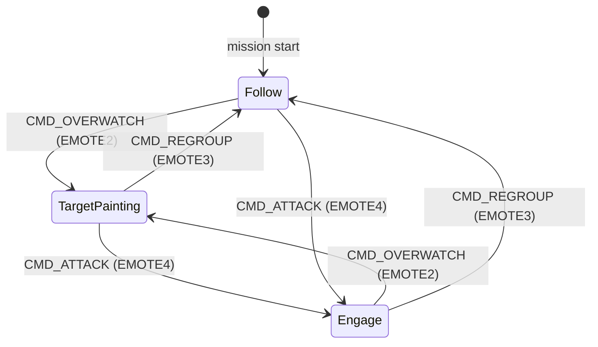
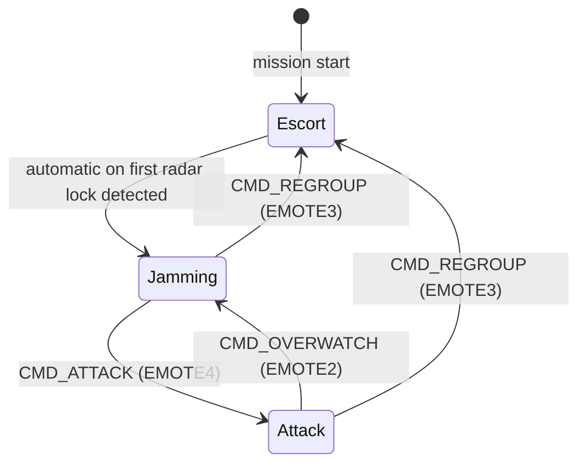
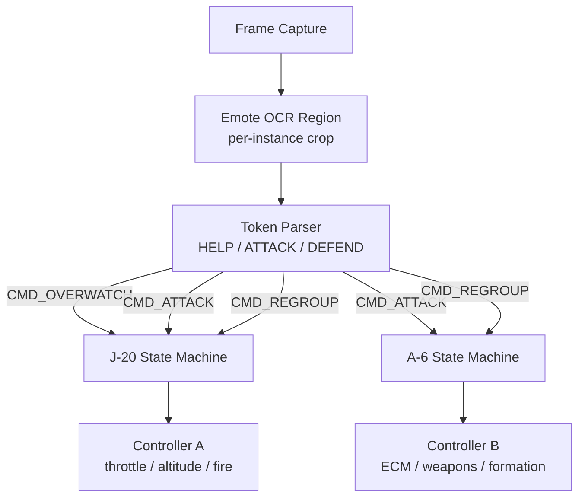
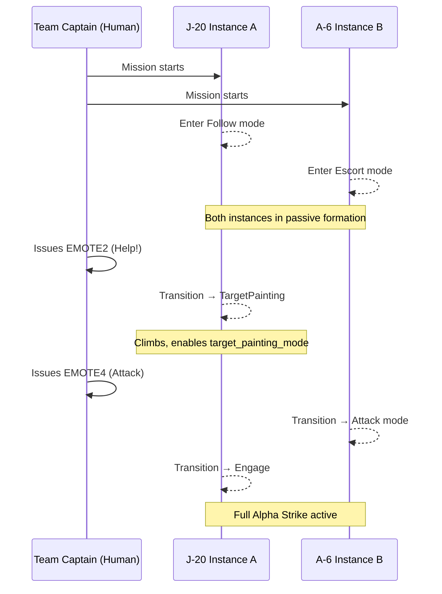

# Design 002 — Alpha Strike: Multi-Instance Coordinated Air Support

| Status | Date       | Wingman Version |
|--------|------------|-----------------|
| Draft  | 2026-05-03 | 1.6.5           |

## Overview

Alpha Strike is a coordinated multi-instance Wingman operation where three roles fly a structured combined-arms air attack. A human Team Captain commands the formation using in-game emotes. Two Wingman instances fly as autonomous AI wingmen, each with a distinct tactical role:

| Role | Aircraft | Primary Task | Wingman Instance |
|---|---|---|---|
| Team Captain | Any fighter | Formation command and attack lead | Human (user) |
| Overwatch | J-20 | High-altitude loiter, target painting, long-range support | Instance A |
| AWACS | A-6 Intruder | Radar jamming, escort, suppression | Instance B |

---

## Command System: Emote Mapping

The Team Captain issues tactical orders by using in-game emote shortcuts. Wingman instances monitor the game state and OCR-detect the Captain's emote display in real time.

| Emote | Label | Command Issued | Effect on J-20 | Effect on A-6 |
|---|---|---|---|---|
| EMOTE2 | Help! | `CMD_OVERWATCH` | Enter high-altitude target painting mode | Maintain radar jamming / escort |
| EMOTE4 | Attack | `CMD_ATTACK` | Maintain target painting, descend to engagement range | Switch from jamming to attack mode |
| EMOTE3 | Defend | `CMD_REGROUP` | Return to follow-the-leader formation | Return to escort formation |
| EMOTE1 | Moving to | `CMD_DEFAULT` | Reset to follow-the-leader mode | Reset to radar jamming mode |

Emote detection uses an existing OCR crop region scoped to the emote notification area. Text match against `[HELP, ATTACK, DEFEND]` tokens triggers a mode transition in the relevant instance.

---

## J-20 Overwatch Instance (Instance A)

### State Machine



### State Descriptions

**Follow (default on mission start)**
- Standard follow-the-leader formation behind the Captain.
- `target_painting_mode: false`
- Passive: weapons ready, no autonomous engagement.

**TargetPainting (Overwatch)**
- J-20 climbs to high altitude and loiters.
- `target_painting_mode: true` (enabled in `config.yaml` under `j20_mission`).
- Continuously paints designated targets to allow the Captain and A-6 quick missile lock.
- Does not fire autonomously unless CMD_ATTACK received.
- Maintains altitude hold; avoids descending below a configured altitude floor.

**Engage**
- Descends to effective strike range.
- Combines target painting with active weapons free.
- Autonomous search-and-destroy loop: detect → classify → engage → reassess → re-task.
- Returns to TargetPainting on CMD_OVERWATCH.

---

## A-6 Intruder AWACS Instance (Instance B)

### State Machine



### State Descriptions

**Escort (default on mission start)**
- Follow-the-leader formation.
- Monitors radar lock indicator region via OCR/pixel scan.
- Transitions automatically to Jamming when radar lock detected.

**Jamming**
- A-6 activates ECM countermeasures (configured key binding).
- Holds a medium-altitude protective orbit around the formation.
- Continues to escort but breaks toward threat bearing to maximise jamming coverage.
- Passive radar suppression allows J-20 target painting to be more effective.

**Attack**
- Switches off jamming, enters weapons-free engagement.
- Runs standard search-and-destroy loop.
- Intended for situations where the Captain wants concentrated firepower, accepting reduced ECM cover.

---

## Emote Detection Architecture



Each Wingman instance runs its own OCR polling loop. Command arbitration is local — each instance only acts on commands relevant to its role. There is no direct inter-process communication between instances; the shared medium is the in-game emote display visible to both instances on screen.

---

## Mission Start Sequence



---

## Configuration

New config keys required under `wingman/config.yaml`:

```yaml
alpha_strike:
  enabled: false
  role: overwatch          # overwatch | awacs | captain
  emote_crop:
    coords:
      - [0.40, 0.88]
      - [0.60, 0.94]
    text: [HELP, ATTACK, DEFEND]
  j20:
    altitude_floor_px: 200        # minimum screen Y for high-altitude hold
    painting_mode_on_start: false # start in Follow, not TargetPainting
  a6:
    ecm_key: "e"
    auto_jam_on_lock: true
```

The `role` key determines which state machine each instance loads at startup. The `captain` role is informational only; a human-driven instance does not run an autonomous state machine.

---

## Open Questions

| # | Question | Notes |
|---|---|---|
| 1 | Can the A-6 ECM key be reliably bound in-game? | Needs testing; may require ADB injection path |
| 2 | Emote text region — does on-screen position vary across screen resolutions? | Requires crop calibration per monitor resolution |
| 3 | Altitude hold implementation | Not yet in Wingman; may need a dedicated vertical-control loop |
| 4 | How does the J-20 detect current altitude? | Screen-space heuristic or HUD OCR region |
| 5 | Inter-instance safety — what if both instances misread the same emote? | Idempotent state transitions mitigate double-trigger risk |

---

## Future Phases

| Phase | Description |
|---|---|
| 4 | Reinforcement learning for J-20 engagement geometry optimisation |
| 5 | Neural network target classification to replace HSV pixel matching |
| 6 | Dynamic role reassignment — Captain can re-assign AWACS to overwatch mid-mission |
