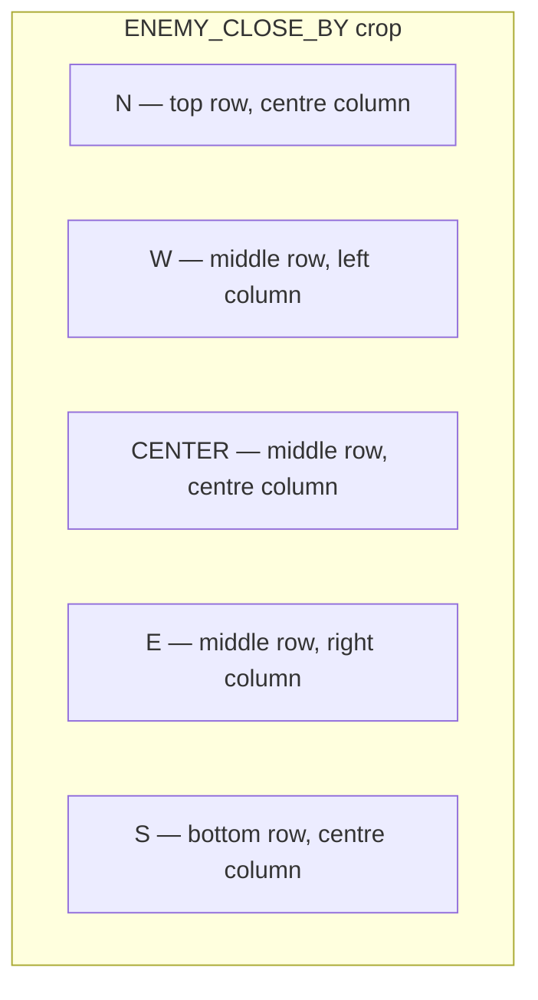
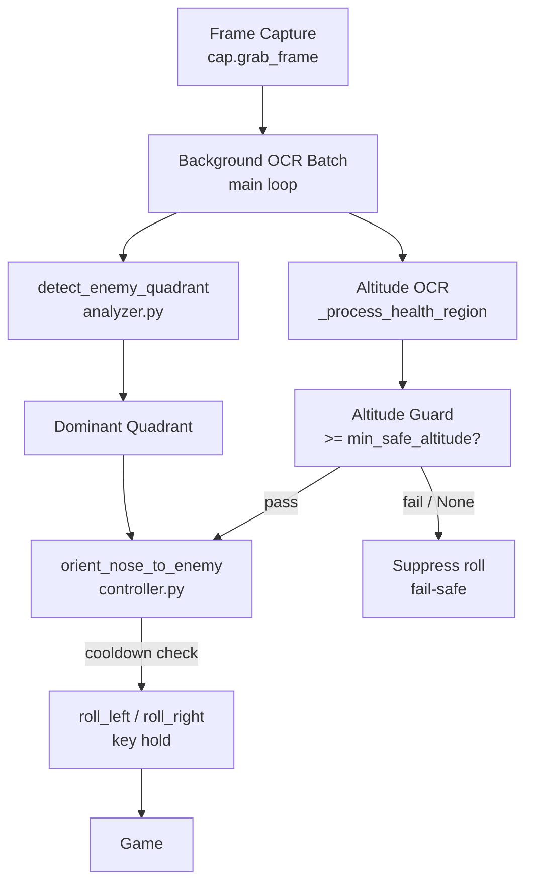

# Design 003 — Enemy Quadrant Detection and Nose Orientation: High-Level Design Document

| Status | Date       | Wingman Version |
|--------|------------|-----------------|
| Draft  | 2026-05-04 | 1.6.5           |

## Overview

This document describes the enemy quadrant detection and nose-orientation capability for Wingman's J20 attack mode. The goal is to determine *where* enemies are relative to the aircraft and issue corrective roll inputs so the J20 maintains a vertical stack above clustered enemies — maximising stall-geometry and target-painting buff uptime (ADR 027).

The existing `ENEMY_CLOSE_BY` crop returns a single boolean (red pixels present or absent), sufficient for the 30-second disengage timer but providing no directional information. This design extends that crop into five named quadrants and adds a roll-correction loop gated on an altitude safety guard.

ADR reference: [ADR 028](../adr/028-enemy-quadrant-detection-and-nose-orientation.md)

---

## Quadrant Layout

The `ENEMY_CLOSE_BY` crop pixel array is divided into thirds horizontally and vertically. Five named sub-regions are extracted:



| Quadrant | Row slice   | Col slice   |
|----------|-------------|-------------|
| N        | top 1/3     | middle 1/3  |
| S        | bottom 1/3  | middle 1/3  |
| E        | middle 1/3  | right 1/3   |
| W        | middle 1/3  | left 1/3    |
| CENTER   | middle 1/3  | middle 1/3  |

The dominant quadrant is the one with the highest red-pixel count. Ties default to CENTER (no roll issued).

---

## Roll-to-Enemy Decision Table

| Dominant quadrant | Action                                       |
|-------------------|----------------------------------------------|
| E                 | `roll_right(hold_seconds=0.3)`               |
| W                 | `roll_left(hold_seconds=0.3)`                |
| N or CENTER       | no action (already on-target or centred)     |
| S                 | `roll_right(hold_seconds=0.6)` (partial reversal) |

The `S` hold duration is longer to initiate a partial heading reversal rather than a full 180°. Both values are tunable via config.

---

## Architecture



### `detect_enemy_quadrant` (analyzer.py)

- Signature: `detect_enemy_quadrant(frame) → dict[str, int]`
- Returns pixel counts for keys `{N, S, E, W, CENTER}`.
- Returns all-zeros dict if the crop is unavailable or an exception occurs (fail-safe).
- The existing boolean check at call sites becomes `sum(counts.values()) > 0` — `detect_enemy_red` remains callable unchanged.
- Re-uses the existing `ENEMY_CLOSE_BY` HSV pipeline; no new screen region is required for the enemy scan itself.

### `orient_nose_to_enemy` (controller.py)

- Accepts `dominant_quadrant: str` and `altitude: int | None`.
- Checks `analyzer.game_state != GAME_BATTLE_MANUAL` before issuing any roll (consistent with ADR 027 pattern).
- Suppresses if `altitude is None` or `altitude < min_safe_altitude`.
- Enforces a per-call cooldown (`attack_mode_cooldown`, default `4.0 s`) to prevent roll thrashing.
- Issues `roll_right` / `roll_left` hold via existing controller key-hold helpers.

### Altitude OCR

- New calibrated crop `ALTITUDE` reads the in-game altitude indicator via `_process_health_region` (existing numeric OCR helper supporting single- and multi-digit reads).
- Extracted value is the altitude in game units (integer).
- Read in the existing main-loop OCR batch alongside `AMMO_MISSILE` / `HEALTH`.
- Result stored in `analyzer._altitude` behind `analyzer._altitude_lock` (consistent with existing pattern for shared OCR results).
- Main loop reads `analyzer._altitude` before calling `orient_nose_to_enemy`.

---

## Altitude Guard

The altitude guard prevents controlled flight into terrain (CFIT) during roll corrections:

| Condition                            | Outcome                  |
|--------------------------------------|--------------------------|
| `altitude >= min_safe_altitude`      | Roll permitted           |
| `altitude < min_safe_altitude`       | Roll suppressed          |
| OCR returns `None` (read failure)    | Roll suppressed (fail-safe) |

`min_safe_altitude` defaults to `500` game units and is tunable per device/map via config.

---

## Feasibility Assessment

**Verdict: High feasibility. Negligible additional CPU cost.**

| Operation | Estimated time per frame |
|---|---|
| `detect_enemy_quadrant` (numpy slicing + count) | < 0.1 ms |
| Altitude OCR (re-uses `_process_health_region`) | Already in OCR batch — no extra cost |
| `orient_nose_to_enemy` (decision + key hold) | < 0.1 ms |

Quadrant detection adds at most one extra numpy array split and five `np.count_nonzero` calls on an already-captured crop — effectively zero marginal CPU overhead.

**Constraints:**

- **`ALTITUDE` crop calibration required**: must be calibrated per device/resolution. Until calibrated, `attack_mode` defaults to suppressed (altitude reads `None`).
- **Roll hold durations are approximate**: 0.3 s / 0.6 s are starting values. Actual angular correction depends on in-game roll rate and load-out. These require tuning.
- **No pitch correction**: only azimuth (roll) is corrected. Nose-down manoeuvres at low altitude are more dangerous than beneficial and are intentionally excluded.
- **CENTER / N suppression**: no roll fires when enemies are ahead or centred. This is correct for the tactic (already positioned) — the padlock loop maintains lock in this case.

---

## Configuration Additions

```yaml
j20_mission:
  attack_mode: false               # master switch for roll-to-enemy behaviour
  attack_mode_cooldown: 4.0        # minimum seconds between roll corrections
  attack_mode_roll_s_hold: 0.6     # hold duration (s) for South (partial reversal)
  min_safe_altitude: 500           # altitude floor below which rolls are suppressed
```

A new `ALTITUDE` entry is also required in the `crops` section of `config.yaml` (device-specific geometry, calibrated via the standard crop calibration job aid).

---

## Integration Points

| Component     | Change                                                                                          |
|---------------|-------------------------------------------------------------------------------------------------|
| `analyzer.py` | Add `detect_enemy_quadrant(frame)`; add `_altitude` / `_altitude_lock`; read `ALTITUDE` crop in OCR batch |
| `controller.py` | Add `orient_nose_to_enemy(dominant_quadrant, altitude)`; enforce cooldown and altitude guard   |
| `main.py`     | Replace `detect_enemy_red` call with `detect_enemy_quadrant`; pass altitude to `orient_nose_to_enemy` |
| `config.yaml` | Add `j20_mission.attack_mode*` keys and `ALTITUDE` crop geometry                              |
| FSM           | No FSM changes — feature is gated by `attack_mode` config flag within existing battle state    |

---

## Open Questions

1. **`ALTITUDE` crop geometry**: must be calibrated per device. The numeric altitude display position varies between game versions and screen resolutions. Use the existing crop calibration job aid.
2. **Roll hold tuning**: 0.3 s and 0.6 s starting values need in-game validation. Log the dominant quadrant and resulting heading change to calibrate `K_roll` empirically.
3. **Roll key conflicts**: confirm that roll-left / roll-right keys are not also bound to manoeuvre-cancel actions (same concern as terrain avoidance, Design 001). If they are dual-bound, a key-hold sequence rather than a tap may be needed.
4. **Ties between quadrants**: current tie-break defaults to CENTER (no action). If two off-axis quadrants (e.g. E and W) tie, a smarter default (e.g. prefer the last-fired direction) may reduce oscillation.
5. **Interaction with terrain avoidance**: if Design 001 terrain avoidance is active simultaneously, its `_terrain_avoiding` flag should also suppress `orient_nose_to_enemy` to prevent conflicting roll inputs.
