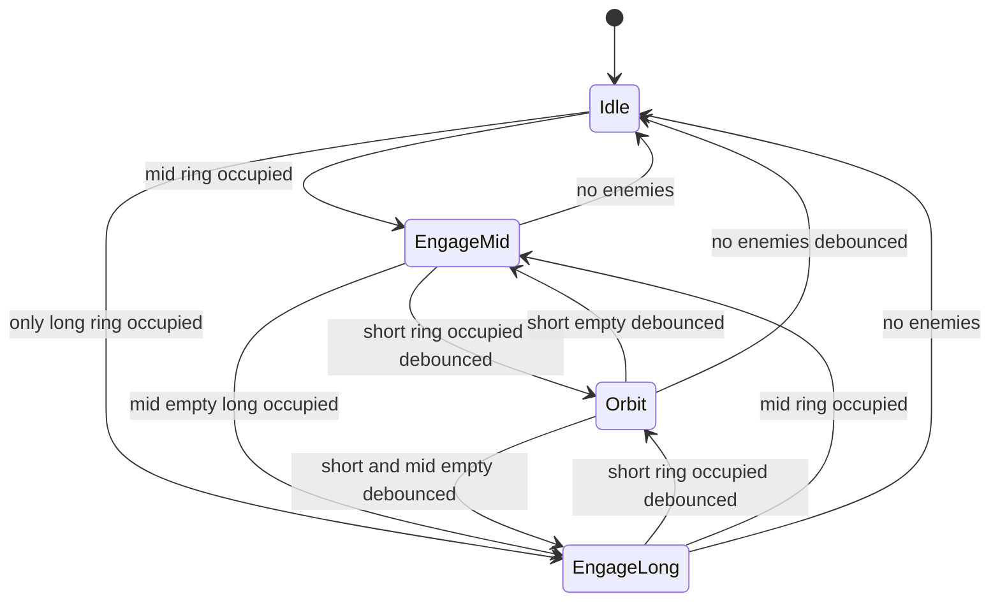
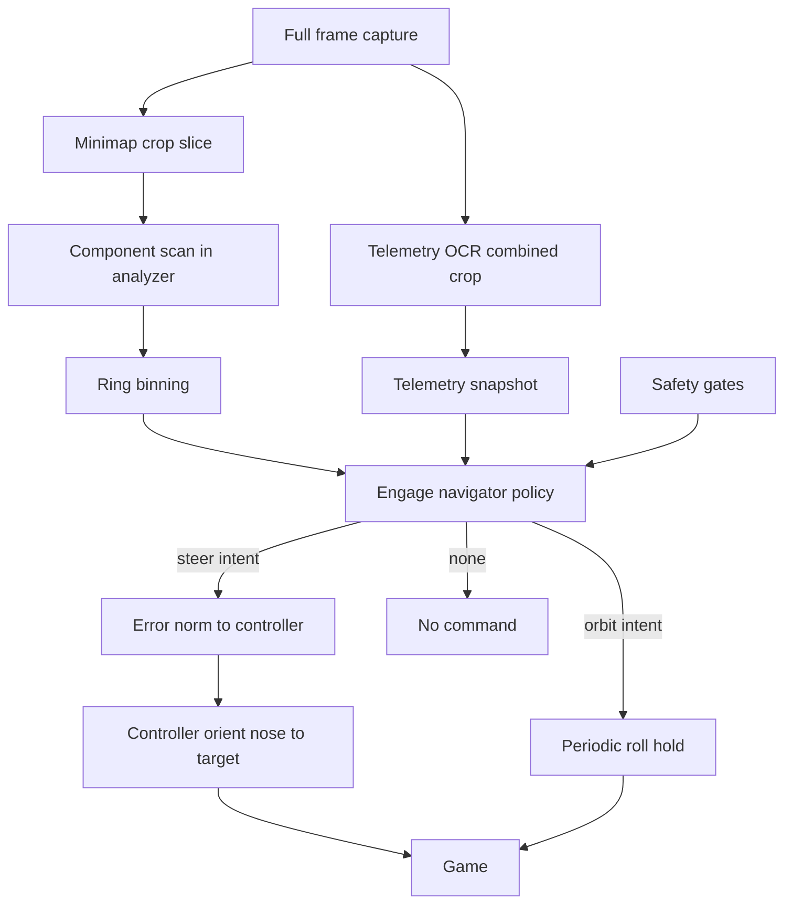

# Design 003 — Minimap Ring-Engage Navigation

| Status | Date       | Wingman Version |
|--------|------------|-----------------|
| Draft  | 2026-08-08 | 1.7.1           |

> **Revision note:** third in-place revision (the document never left
> `Draft`; the filename keeps its original slug). Revision 1: quadrant grid
> over `ENEMY_CLOSE_BY` (never implemented). Revision 2: single `MINIMAP`
> crop + overhead-attack phase machine — implemented, then measured in a
> dry-run and a live session on 2026-08-08. Revision 3: the phase machine is
> replaced by mission-agnostic ring-engage navigation; the sensor pipeline
> and its session evidence carry forward unchanged. Companion decision
> record: [ADR 028](../adr/028-enemy-quadrant-detection-and-nose-orientation.md).
> Arena-containment requirement: FR-005 in
> `docs/requirements/002-functional.sdoc`.

## Overview

The J20 currently flies a preprogrammed path; enemies are only a disengage
timer. This design makes live minimap data the navigation reference: the
aircraft continuously course-corrects toward detected enemies **at any
altitude**, orbits when the fight is close, and — because enemies only
render inside the battle arena — stays inside the arena as a consequence
(FR-005).

The policy is deliberately mission-agnostic. Today the J20 mission's tick
handler invokes it; under Phase 3 (ADR 024) the behavior tree's engage node
(working name `GAME_BATTLE_ENGAGE`) invokes the same object. That name is a
tree node, **not** a `transitions` FSM state — the FSM stays screen-derived.

**Division of labour with Design 005 (screen-space target tracking):**

- Design 003 (this document) — *coarse navigation*: whole-map, 360°, brings
  the aircraft to the fight and keeps it there.
- Design 005 — *terminal alignment*: continuous screen-space error on
  visible target markers, frustum-limited, fine-grained.
- Both actuate through `Controller.orient_nose_to_target`; the shared
  cooldown timestamp lets the terminal loop win when both want the roll axis.

## Sensor — the Minimap (unchanged from revision 2, evidence retained)

Verified on `P1_040`/`P1_060` (1920×1200): circular map, top-right HUD
corner, **heading-up rotation** (compass letters rotate; own-ship wedge
fixed at centre pointing up). Consequences: icon angle from the up-axis is
relative bearing to the nose; map centre is own position; red icons are
enemies, blue friendly; rim letters, capture badges, wreck markers, pickup
crosses, and the red locked-target ring and route line are filter targets.

The `MINIMAP` crop is the tight bounding square of the circle (calibrated
2026-08-08; live values in `config.yaml`). A cached disc mask
(`minimap.mask_radius_frac` × half the shorter side) excludes corners and
rim letters. The `enemy_hsv` mask (plus hue wrap-around) and the component
area band (`min_blob_px`–`max_blob_px`) are field-proven: across both
sessions the scan returned a bearing on every battle tick, and the ~1000 px
ring/route-line overlays were rejected by the band.

## Detection Pipeline (analyzer.py)

The pure scan now exposes **per-component polar positions** instead of only
a whole-map centroid:

1. `_scan_minimap_components(crop, …) → [(bearing_deg, radius_frac,
   area_px), …]` — mask, red HSV + wrap band, connected components, area
   band, per-component centroid → polar. Empty list when nothing survives.
2. `_scan_minimap_red(…)` — kept: aggregates the component list into the
   whole-map area-weighted centroid (same output contract as revision 2;
   still used by the step-2 `ENEMY_CLOSE_BY` consolidation plan and the
   frame regression tests).
3. `GameStateAnalyzer.detect_enemy_map_components(frame) → list | None` —
   crop lookup, cached disc mask, fail-safe `None` on missing crop or
   exception (list may be empty: scan worked, nothing red).

Ring binning is **not** done in the analyzer — it is policy-side pure math
(`engage_nav.bin_rings`), so the sensor stays tactic-neutral.

## Ring Model and Policy (wingman/engage_nav.py)

The normalised radius is split into three **equal-width** rings: short
(0–1/3), mid (1/3–2/3), long (2/3–1). Equal width, not equal area: travel
distance is the quantity of interest (the long ring covering 56% of map
area is irrelevant to that). Ring bands ~0.33 wide sit well outside the
measured centroid jitter that broke revision 2's 0.12 overhead latch.

`bin_rings(components)` → per-ring `{count, pixel_count, bearing_deg,
radius_frac}` where the bearing is the area-weighted centroid of **that
ring's components only** — a long-range straggler cannot capture steering
while the mid ring is occupied (live-session finding: single-blob identity
hop dragged raw radius 0.58 → 0.99 at bearing ≈ 0°).

`EngageNavigator.update(components, altitude, now) → Intent`:

| Priority | Condition                                           | Mode        | Intent                       |
|----------|-----------------------------------------------------|-------------|------------------------------|
| 1        | short count at or above `short_ring_min_count`      | orbit       | `orbit(direction)`           |
| 2        | mid ring occupied                                   | engage-mid  | `steer(error_norm)` or none inside deadzone |
| 3        | long ring occupied                                  | engage-long | `steer(error_norm)` or none inside deadzone |
| 4        | nothing detected                                    | idle        | none                         |



Details:

- **Orbit** replaces revision 2's Overhead hold: an open-loop
  `roll_<orbit_direction>` of `orbit_roll_hold_s` every
  `orbit_roll_interval_s`. No precise station to hold, immune to the
  own-marker occlusion at map centre, and constant turning is a defensive
  posture in its own right (hypothesis — measured, not assumed). Direction
  fixed by config in v1.
- **Debounce, not radius hysteresis**: transitions into and out of Orbit
  require `ring_debounce_ticks` consecutive ticks of agreement. Engage-mid ↔
  engage-long switches are free (both steer). This is the lesson of the two
  measured latch failures (dry-run false eject, live missed arrival) applied
  at the right granularity.
- **EMA within a selection, reseed on target change**: the selected ring's
  centroid vector is smoothed by `MinimapEma` (vector-space — bearings cannot
  be averaged across the ±180° wrap). Switching the engaged ring reseeds the
  EMA only when the new ring's bearing differs from the smoothed state by
  more than `ema_reseed_angle_deg` — a genuinely different target. A contact
  crossing the mid/long boundary keeps its smoothing: the first live run
  (2026-08-08 10:17) showed five mid↔long label flips in 23 s, and
  reseed-on-every-switch turned each flip into raw-sample steering with
  direction reversals — the jitter class the EMA exists to prevent,
  re-entering through label churn.
- **Steering math unchanged**: `error_norm = clamp(bearing/90, −1, 1)`,
  deadzone `bearing_deadzone_deg`, saturation beyond ±90° producing
  successive max-hold rolls for clusters behind the aircraft.
- **No altitude precondition** (revision 2's `attack_altitude` retired):
  live data showed the gate starved the tactic — 74% of ticks idle, and the
  eject-dive cycle, not the threshold, was the constraint. Altitude
  management stays with the mission profile (later: the tree).

## Safety Gates

Suppressed — navigator emits `none` — when any of:

1. FSM state is not `GAME_BATTLE`, or is `GAME_BATTLE_MANUAL` (manual always
   wins); handler-level, unchanged.
2. `j20_mission.attack_mode` false; `attack_mode_dry_run` computes and logs
   without key injection.
3. Telemetry snapshot missing/stale (5 suppressions in the live session), or
   altitude below `min_safe_altitude` (3 suppressions — CFIT floor).
4. `orient_nose_to_target`'s shared cooldown (steer intents); the orbit
   cadence timer rate-limits orbit rolls.
5. Terrain avoidance (Design 001) — gate added when that design lands.

## Architecture



## Feasibility

Identical cost class to revision 2 (measured invisible in both sessions):
the component scan is the same masking pass, ring binning is a few dozen
float ops, and no OCR is added. Actual timings via `PerformanceTracker`
remain the acceptance evidence.

## Instrumentation and Success Metrics

- Per-tick DEBUG: mode, reason, per-ring counts, error, altitude; INFO on
  mode change; per-mission mode-uptime summary.
- Effectiveness A/B (`attack_mode` on vs off): deaths/outcomes per mission
  (MissionStatsTracker, ADR 055), incoming-detection rate.
- **FR-005 observable**: arena excursions under ring-engage vs the
  preprogrammed path (operator-observed initially; no boundary sensor
  exists, so containment is verified by outcome).

## Configuration Additions

```yaml
j20_mission:
  attack_mode: false            # master switch for ring-engage navigation
  attack_mode_dry_run: false    # log-only: compute intents, inject nothing
  min_safe_altitude: 500        # CFIT floor - all steering suppressed below
  bearing_deadzone_deg: 12      # no roll inside this bearing error
  short_ring_min_count: 1       # short-ring contacts required to orbit
  ring_debounce_ticks: 2        # consecutive ticks to enter or leave orbit
  ema_reseed_angle_deg: 60      # reseed steering EMA only on target jumps beyond this
  orbit_direction: right        # fixed orbit roll direction (right or left)
  orbit_roll_hold_s: 0.3        # roll hold per orbit correction
  orbit_roll_interval_s: 2.0    # cadence of orbit corrections
  coarse_kp: 0.5                # gains passed to orient_nose_to_target
  coarse_min_hold_s: 0.15
  coarse_max_hold_s: 0.6
  coarse_cooldown_s: 2.0

minimap:                        # sensor block unchanged from revision 2
  mask_radius_frac: 0.93
  min_blob_px: 4
  max_blob_px: 120
  ema_alpha: 0.4
  ema_reset_after_s: 5.0
  close_radius_frac: 0.3        # step 2 only: enemy-close-by equivalence radius
```

Retired from revision 2: `attack_altitude`, `overhead_radius_frac`,
`overhead_exit_frac`, `overhead_grace_s`. All values are starting points;
tuning lives here, never in requirements.

## Integration Points

| Component | Change |
|---|---|
| `analyzer.py` | `_scan_minimap_components`; `_scan_minimap_red` kept as aggregate; new `detect_enemy_map_components` |
| `wingman/engage_nav.py` | Renamed from `overhead_nav.py`: `MinimapEma` (unchanged), `bin_rings`, `EngageNavigator`, `Intent` |
| `tick_handlers.py` | `EngageNavHandler` (replaces `OverheadNavHandler`): intent dispatch, orbit cadence timer, dry-run, logging |
| `controller.py` | None — `orient_nose_to_target` and `roll_left`/`roll_right` reused |
| `main.py` | Handler rename only |
| `config.yaml` | `j20_mission` keys reworked as above |
| FSM | No changes — and deliberately none for Phase 3 (`GAME_BATTLE_ENGAGE` is a tree node, not an FSM state) |
| Requirements | FR-005 (arena containment) with `@relation(FR-005, scope=function)` on `EngageNavigator.update` |

## Validation Strategy

1. **Unit tests (pure)**: ring binning geometry; policy priorities (short >
   mid > long), orbit enter/exit debounce, EMA reseed on ring switch,
   deadzone/saturation, safety gates; a mode-stability regression built
   from the 2026-08-08 logged radius sequence (raw ring flapping
   short→mid→short must produce at most the debounced mode changes).
2. **Static frame regression**: per-ring counts and bearings on
   `MINIMAP.png`, `P1_040`, `P1_060`; ring/route-line rejection retained.
3. **Dry-run live session**: validate orbit intent cadence and the mode
   timeline against what a human would fly; this is also the first live
   validation of open-loop orbit rolls — **do not go live before it**.
4. **Live flight + A/B**: mode-uptime summary, MissionStats outcomes,
   FR-005 excursion observations.

Session evidence retained from revision 2 (2026-08-08): dry run — 179
ticks, detection on every tick, two Overhead arrivals, centroid-jitter
finding that produced the EMA; live run — 97 ticks, 2 rolls issued,
cooldown honoured, safety gates exercised (3 below-floor, 5 no-telemetry),
altitude-gate starvation and eject-cycle preemption that produced this
revision.

Ring-engage session evidence (2026-08-08, this revision): dry run — full
mode ladder (idle → engage-long → engage-mid → orbit) in all three battles,
orbit intents on cadence, stable steering errors; live run 10:17–10:25 —
ladder and live orbit/steer rolls repeated in every auto window, three
manual takeovers preempted navigation correctly (SAF-001), the legacy
`ENEMY_CLOSE_BY` disengage fired twice against ring-engage's wider view
(strengthening the step-2 consolidation case), and mid↔long boundary flaps
with reseed-on-every-switch produced steering reversals — the finding behind
`ema_reseed_angle_deg`.

## Open Questions

1. **Orbit dynamics**: what turn geometry does a 0.3 s roll every 2 s
   actually produce in-game? Dry-run first; tune hold/interval/direction.
2. **Minimap zoom/world scale**: unresolved from revision 2; ring semantics
   inherit it.
3. **Short-ring straggler rule**: threshold 1 means one close contact
   overrules a mid-ring furball — consistent with nearest-first, revisit
   with live data (`short_ring_min_count`).
4. **Arena boundary sensing**: deferred — FR-005 is verified by outcome. If
   excursions persist despite engagement, a map-edge detector becomes a new
   design.
5. **`max_blob_px` band**: still unsettled (P1_060 rim-merged clusters;
   live blobs at altitude ran 1–3). Log kept/rejected component areas for
   one session before tuning.
6. **Handoff to Design 005**: while orbiting, the padlock/tracking loop owns
   terminal weapon alignment via the shared cooldown — confirm in dry-run.

## Related Documents

- [ADR 024 — Phase 3 behavior tree architecture](../adr/024-phase3-behavior-tree-architecture.md)
- [ADR 027 — J20 target painting mode](../adr/027-j20-target-painting-mode.md)
- [ADR 028 — Minimap ring-engage navigation](../adr/028-enemy-quadrant-detection-and-nose-orientation.md)
- [ADR 038 — Battle altitude/speed telemetry](../adr/038-game-battle-altitude-speed-signals-for-phase3-and-eject-dive.md)
- [ADR 055 — MissionStatsTracker](../adr/055-mission-level-statistics-tracker.md)
- [Design 001 — Terrain avoidance](001-terrain-avoidance-hldd.md)
- [Design 005 — Screen-space target tracking](005-target-tracking-hldd.md)
- FR-005 — `docs/requirements/002-functional.sdoc`
