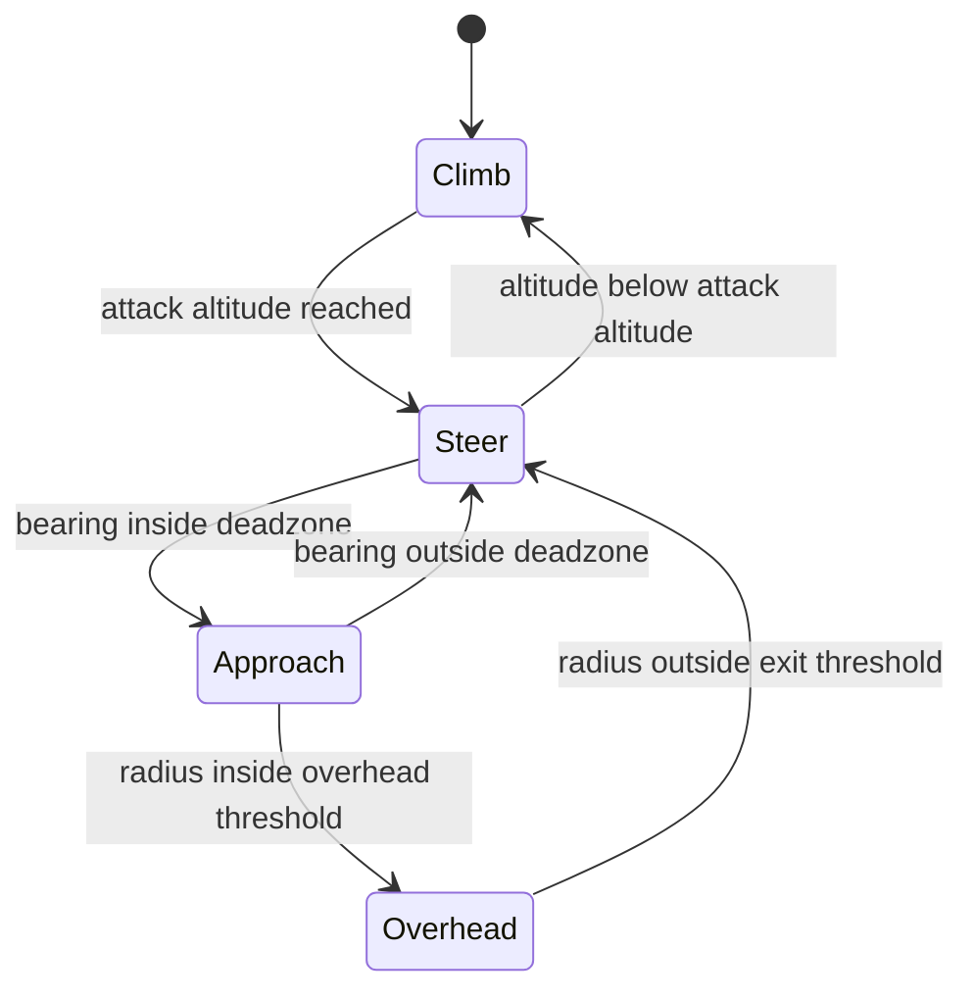
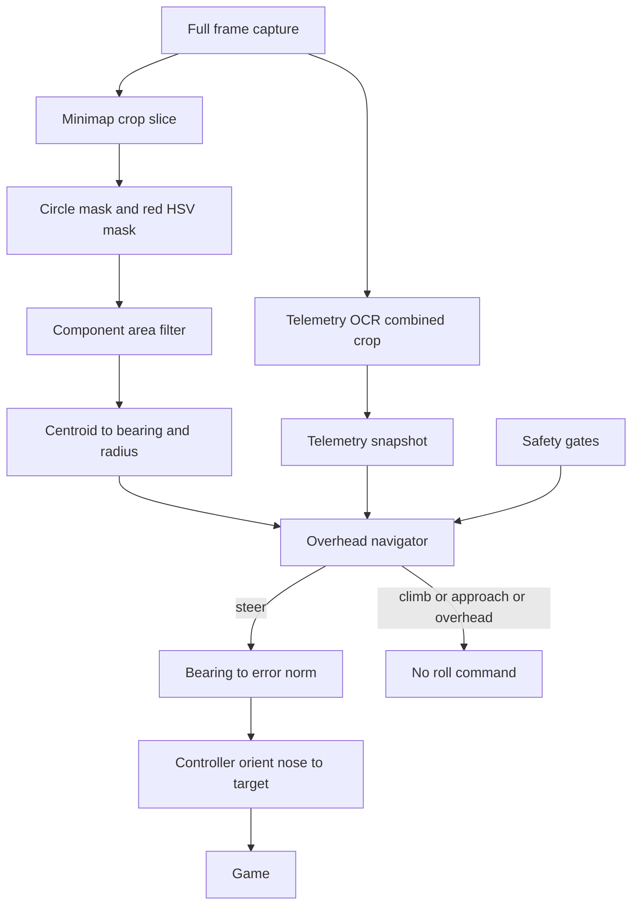

# Design 003 — Minimap Enemy Bearing and Overhead Attack Positioning

| Status | Date       | Wingman Version |
|--------|------------|-----------------|
| Draft  | 2026-08-08 | 1.7.1           |

> **Revision note (2026-08-08):** this Draft previously described a 3×3
> quadrant split of the `ENEMY_CLOSE_BY` crop with a fixed roll table. It is
> revised in place (the document never left `Draft`; none of the quadrant
> design was implemented) and the filename keeps its original slug. The
> previous revision's Altitude OCR section is superseded by ADR 038's combined
> `ALTITUDE_SPEED` crop and `get_telemetry()`. Companion decision record:
> [ADR 028](../adr/028-enemy-quadrant-detection-and-nose-orientation.md),
> revised together with this document.

## Overview

Goal (unchanged from ADR 027/028): in J20 attack mode, reach high altitude and
hold position directly above clustered enemy fighters. The near-vertical
engagement geometry forces defenders into high-AOA climbs — hard for most
airframes to sustain — while maximising target-painting buff uptime.

This revision replaces the quadrant grid with **one large `MINIMAP` crop**:
the full minimap circle is scanned once per battle tick, enemy icons are
reduced to a cluster centroid, and the centroid's polar position (relative
bearing + normalised distance) drives a phase-based overhead navigator.

**Division of labour with Design 005 (screen-space target tracking):**

- Design 003 (this document) — *coarse navigation*: whole-map, 360°, gets the
  aircraft above the cluster. Works regardless of where the nose points.
- Design 005 — *terminal alignment*: continuous screen-space error on visible
  target markers, frustum-limited, fine-grained.
- Both actuate through the same `Controller.orient_nose_to_target(error_norm)`
  helper (implemented; proportional gain, deadband, hold clamps, cooldown).

## Sensor — the Minimap

Properties verified on archived frames
`P1_040_BATTLE_HUD_MISSILES_0_HEALTH_ALIVE.png` and
`P1_060_BATTLE_HUD_HEALTH_ALIVE_MISSILES_4.png` (1920×1200):

- Circular map in the **top-right** HUD corner (top-left holds the kill feed).
  Confirm per-device HUD layout before calibrating.
- **Heading-up rotation**: compass letters occupy different rim positions in
  the two frames while the own-ship marker and view-cone wedge stay fixed at
  centre pointing up. Consequences:
  - icon angle from the up-axis = relative bearing to the nose;
  - map centre = own position, so icon distance from centre = horizontal
    separation, and icons converging on centre = directly overhead;
  - no compass reading or heading state is required.
- Red icons are enemies, blue are friendlies. Sharing the region: rim compass
  letters, capture-point ring badges (red or blue), wreck markers, green
  pickup crosses, route lines. These are filter targets, not signals.
- The existing `ENEMY_CLOSE_BY` crop (`0.8764–0.9521 × 0.0822–0.1856`) is a
  small box at the centre of this same minimap — today's "enemy close by"
  boolean already reads minimap icons near own position. The `MINIMAP` crop is
  a widening of a proven sensor, not a new kind of surface, and the
  `enemy_hsv` mask is already field-validated on it.

### Why one crop

ADR 038 measured the consolidation win for OCR crops (fixed per-call dispatch
dominates small crops; one combined crop roughly halved cost and removed an
overlap misread). For an HSV mask the cost scales with area instead, so the
mechanism differs — the single-region win here is:

- one calibrated region instead of five quadrant sub-regions;
- one detection pass whose output serves every consumer (bearing, distance,
  and eventually the close-by boolean);
- centroid post-processing in code: an icon straddling a sub-crop boundary
  splits its pixel mass across regions, while a centroid bins cleanly, and
  granularity changes (sectors, per-blob tracking) become code-only changes
  with no recalibration.

## Detection Pipeline — `detect_enemy_map_bearing` (analyzer.py)

Signature: `detect_enemy_map_bearing(frame) → dict`

Output: `{bearing_deg, radius_frac, blob_count, pixel_count}` —
`bearing_deg ∈ (−180, 180]` measured from the up-axis, positive clockwise;
`radius_frac ∈ [0, 1]` normalised to the mask radius. Fail-safe: missing crop
or any exception returns `bearing_deg=None, radius_frac=None` with zero
counts (consistent with the `detect_enemy_red` pattern).

Steps, all on the numpy slice of the already-captured frame:

1. Extract `MINIMAP` crop via `get_crop`.
2. Apply a circular mask of radius `minimap.mask_radius_frac` × half the
   crop's shorter side, centred on the crop — excludes the square corners and
   the rim compass letters.
3. Red HSV mask: `enemy_hsv` band plus the hue wrap-around range, exactly as
   `detect_enemy_red` does today.
4. Connected components with stats; keep components with area in
   `minimap.min_blob_px … minimap.max_blob_px` — rejects rim art, the larger
   ring badges, and the locked-target ring and route-line overlays the game
   draws in red on the map (both are large or elongated components — see
   `test_screenshots/MINIMAP.png`); wreck markers mostly fall outside the red
   band.
5. Pixel-mass centroid over surviving components → polar conversion.

v1 uses the pixel-mass centroid (simplest, matches "fly to the cluster"). If
live logs show lone stragglers dragging the centroid off the main cluster,
switch to the median of component centroids — a code-only change.

## Overhead Navigator (new module `wingman/overhead_nav.py`)

A small pure-logic class — no threads, no locks, no I/O — so it is fully unit
testable. `update(bearing_deg, radius_frac, telemetry, now) → command` is
called once per battle tick from the main loop; the main loop actuates.



| Phase    | Condition                                            | Behaviour                                        |
|----------|------------------------------------------------------|--------------------------------------------------|
| Climb    | altitude below `attack_altitude`                     | no steering; the existing mission profile climbs |
| Steer    | bearing outside `bearing_deadzone_deg`               | roll toward cluster via `orient_nose_to_target`  |
| Approach | bearing inside deadzone, radius above threshold      | fly straight, keep scanning                      |
| Overhead | `radius_frac` at or below `overhead_radius_frac`     | hold — no roll; padlock/tracking loop owns the terminal engagement |

Details:

- **Actuation mapping**: `error_norm = clamp(bearing_deg / 90, −1, 1)` fed to
  `orient_nose_to_target` with the coarse gains from config (deadband is
  `bearing_deadzone_deg / 90`). Bearings beyond ±90° saturate the correction —
  a cluster behind the aircraft produces successive max-hold rolls until it
  swings into the forward semicircle, which subsumes the old "South partial
  reversal" rule.
- **Arrival hysteresis**: enter Overhead at `overhead_radius_frac`, leave only
  above `overhead_exit_frac` (enter < exit). The own-ship marker occludes
  enemy icons exactly at arrival, so detection may momentarily drop out; a
  detection gap while in Overhead holds the state for `overhead_grace_s`
  rather than resetting.
- **No pitch control**: unchanged from the previous revision — only the roll
  axis is commanded. Climb is the mission profile's job; nose-down onto the
  cluster is intentionally excluded.

## Architecture



Conditions live in the phase table above, not in node labels (Mermaid
compatibility profile).

## Safety Gates

Steering is suppressed — navigator returns no command — when any of:

1. FSM state is not `GAME_BATTLE`, or is `GAME_BATTLE_MANUAL` (manual takeover
   always wins, consistent with ADR 027).
2. `j20_mission.attack_mode` is false.
3. Telemetry snapshot is `None` or stale, or altitude is below
   `j20_mission.min_safe_altitude` — the CFIT fail-safe carried over from the
   previous revision.
4. Terrain avoidance (Design 001) is mid-manoeuvre (`_terrain_avoiding`).
5. `orient_nose_to_target`'s own cooldown — one roll source, one rate limit.

`attack_mode_dry_run: true` computes and logs commands without key injection
(the Design 005 validation pattern) for live tuning.

## Feasibility

| Operation | Estimate per battle tick |
|---|---|
| Minimap slice + circle mask + HSV masks (about 250×250 px) | well under 1 ms |
| Connected components with stats | well under 1 ms |
| Navigator decision | negligible |

Same order as today's `detect_enemy_red`; no OCR is added, so the telemetry
cadence (`telemetry.ocr_every_n_ticks`) and tick budget are unaffected.
Actual timings must be recorded via `PerformanceTracker` before the ADR is
promoted — estimates are not acceptance evidence.

## Instrumentation and Success Metrics

- Per-cycle DEBUG log: `bearing / radius / phase / command`.
- Per-mission summary: percent of battle time per phase, mean `radius_frac`.
- Effectiveness A/B (`attack_mode` on vs off) — the acceptance evidence:
  - deaths and outcomes per mission via MissionStatsTracker (ADR 055);
  - incoming-detection rate per minute from PerformanceTracker histograms.

The overhead-position safety claim stays a hypothesis until these numbers
exist.

## Configuration Additions

```yaml
crops:
  MINIMAP:                # full minimap circle bounding box — tight fit: circle
    coords:               #   touching all four sides, margins symmetric (mask
    - [0.0, 0.0]          #   centre and radius derive from this rectangle);
    - [0.0, 0.0]          #   live values in config.yaml, calibrated 2026-08-08;
                          #   recalibrate with make calibrate-crop CROP=MINIMAP

j20_mission:
  attack_mode: false            # master switch for overhead navigation
  attack_mode_dry_run: false    # log-only mode: compute commands, inject nothing
  attack_altitude: 8000         # climb precondition, telemetry units (starting value)
  min_safe_altitude: 500        # CFIT floor - all steering suppressed below
  bearing_deadzone_deg: 12      # no roll inside this bearing error
  overhead_radius_frac: 0.12    # radius at or below this counts as overhead
  overhead_exit_frac: 0.25      # hysteresis exit threshold (must exceed enter)
  overhead_grace_s: 2.0         # detection-gap tolerance while in Overhead
  coarse_kp: 0.5                # gains passed to orient_nose_to_target
  coarse_min_hold_s: 0.15
  coarse_max_hold_s: 0.6
  coarse_cooldown_s: 2.0

minimap:
  mask_radius_frac: 0.93        # circle mask radius as a fraction of half the
                                #   crop's shorter side — excludes bounding-box
                                #   corners and rim compass letters
  min_blob_px: 4                # component area band for enemy icons
  max_blob_px: 120
  close_radius_frac: 0.3        # step 2 only: enemy-close-by equivalence radius
```

All values are starting points; tuning lives here, never in requirements.

## Integration Points

| Component | Change |
|---|---|
| `analyzer.py` | Add `detect_enemy_map_bearing(frame)`; reuse `enemy_hsv` mask constants |
| `wingman/overhead_nav.py` | New: pure-logic `OverheadNavigator` |
| `controller.py` | None — `orient_nose_to_target` is reused as-is |
| `main.py` | Battle tick: call detection + navigator, actuate, honour dry-run |
| `config.yaml` | `MINIMAP` crop, `j20_mission.attack_mode*` keys, `minimap` block |
| FSM | No changes — feature gated by config inside existing battle state |
| `ENEMY_CLOSE_BY` | Step 1: untouched. Step 2 (after logged equivalence): derive the close-by boolean from `radius_frac` and retire the crop |

## Validation Strategy

1. **Static frame regression**: run the pipeline on the `MINIMAP` region of
   `P1_040` and `P1_060`; assert nonzero enemy blobs and hand-labelled bearing
   sectors match. `test_screenshots/MINIMAP.png` adds the hard case: a
   locked-target ring and route line render red on the map — assert the area
   band rejects both while the enemy icons survive.
2. **Synthetic minimap unit tests**: blobs drawn at known angles/radii →
   bearing and radius within tolerance; badge-sized blobs rejected by the area
   band; empty map → fail-safe output; occlusion sequence → Overhead held
   through the grace window; hysteresis enter/exit ordering.
3. **Dry-run live session**: `attack_mode_dry_run` on; verify logged phases
   and commands against what a human would fly; tune deadzone and gains.
4. **Controlled live flight**: conservative gains; confirm climb → steer →
   overhead sequence and no CFIT-guard violations.
5. **A/B measurement**: per the instrumentation section, on vs off across
   missions; results recorded in the ADR before promotion.

## Open Questions

1. **Altitude units**: config and ADR 038 use feet; archived frames show the
   HUD in metres (`8248 m`). Confirm the live HUD unit setting and align
   `attack_altitude` / `min_safe_altitude` values with it.
2. **Minimap zoom/range**: is the map radius a fixed world distance across
   maps and altitudes? If not, `radius_frac` thresholds need per-map review.
3. **North-up option**: does the game offer a north-up minimap setting? The
   design requires heading-up; assert or document the required setting.
4. **Icon taxonomy**: enemy ground units and structures may also render red.
   v1 steers to the all-red centroid; distinguishing fighters (shape/size
   classification) is follow-on work once live crops are archived.
5. **Roll-only turning dynamics**: mapping bearing error to roll holds assumes
   the arcade flight model converts bank into heading change (same assumption
   as Design 005). Validate in the dry-run session.
6. **Handoff to Design 005**: when Overhead is reached, the padlock/tracking
   loop owns terminal alignment. Exact arbitration (who may roll, when) is an
   implementation decision — proposal: navigator suppresses itself in
   Overhead, so only one roll source is ever active.

## Related Documents

- [ADR 027 — J20 target painting mode](../adr/027-j20-target-painting-mode.md)
- [ADR 028 — Minimap enemy bearing and overhead attack positioning](../adr/028-enemy-quadrant-detection-and-nose-orientation.md)
- [ADR 038 — Battle altitude/speed telemetry](../adr/038-game-battle-altitude-speed-signals-for-phase3-and-eject-dive.md)
- [ADR 055 — MissionStatsTracker](../adr/055-mission-level-statistics-tracker.md)
- [Design 001 — Terrain avoidance](001-terrain-avoidance-hldd.md)
- [Design 005 — Screen-space target tracking](005-target-tracking-hldd.md)
- [architecture.md](../architecture.md)
