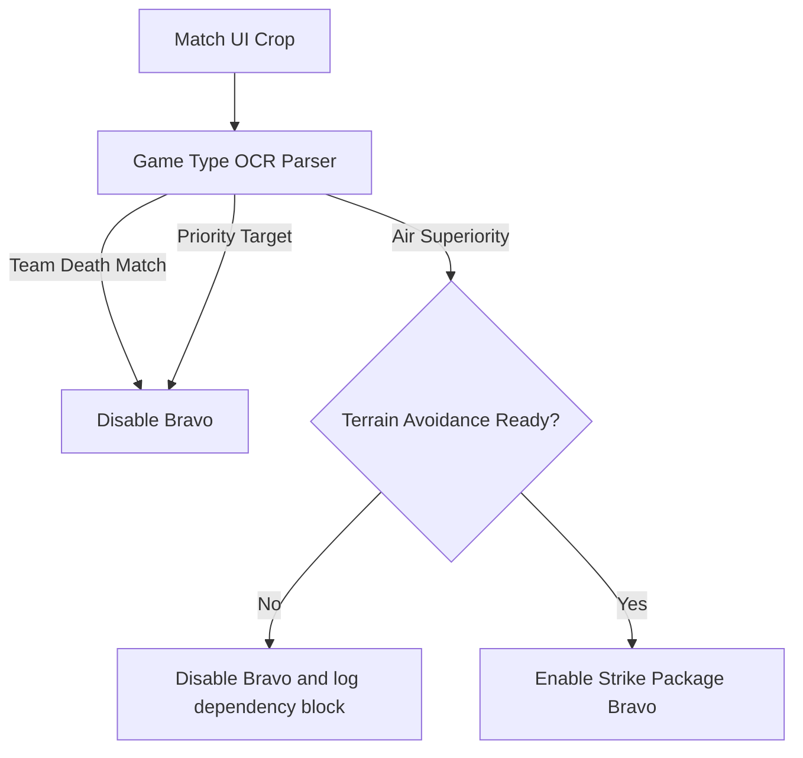
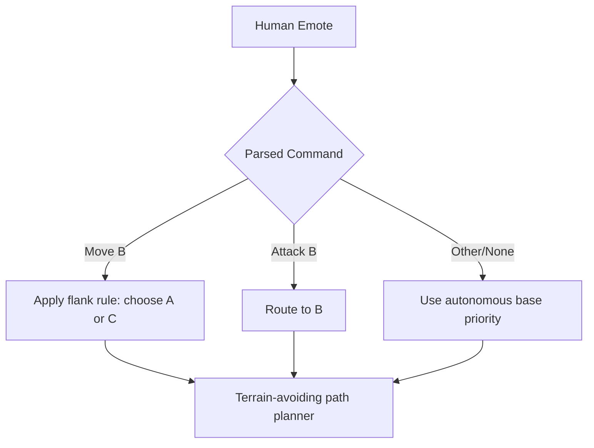
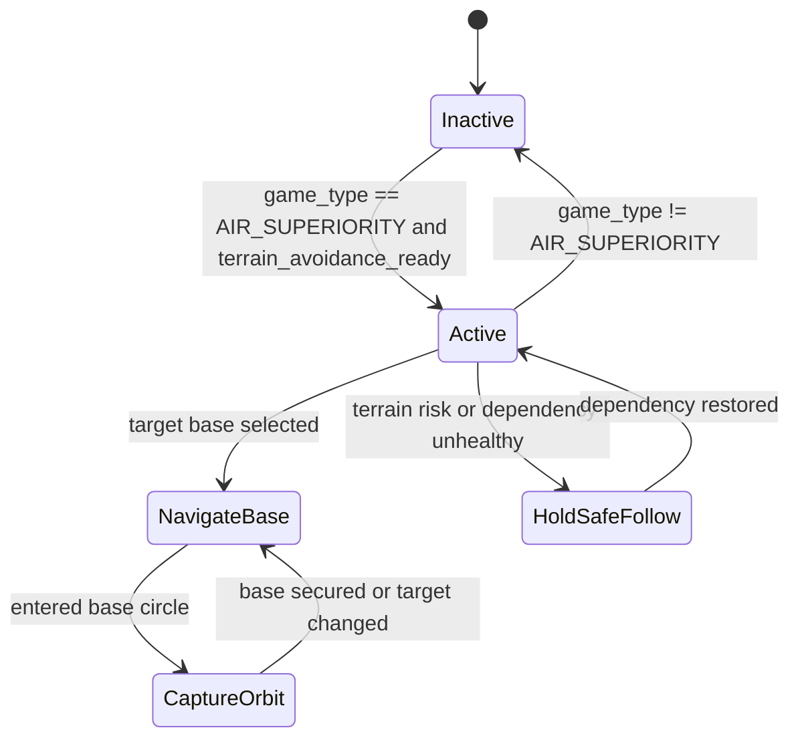
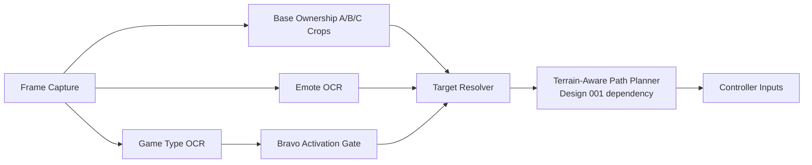

# Design 004 — Strike Package Bravo: Air Superiority Base-Capture Coordination

| Status | Date       | Wingman Version |
|--------|------------|-----------------|
| Draft  | 2026-05-06 | 1.6.5           |

## Overview

Strike Package Bravo is a coordinated squadron mode for Air Superiority missions where AI wingman instances capture or contest base circles A, B, and C while deconflicting from human squadron intent.

This mode is only active when:
- game type is detected as Air Superiority, and
- terrain avoidance from Design 001 is enabled and healthy.

If either condition is false, Wingman falls back to normal non-Bravo behavior.

---

## Mission Type Gating

Wingman must detect one of three game types from the match UI:
- Team Death Match
- Priority Target
- Air Superiority

Strike Package Bravo activation rule:
- Team Death Match: disabled
- Priority Target: disabled
- Air Superiority: enabled (subject to Design 001 dependency)



---

## Dependency: Design 001 Terrain Avoidance

Strike Package Bravo requires terrain-safe pathing behavior from Design 001:
- all waypointing toward base circles must pass through terrain-avoidance checks,
- collision-risk or low-altitude guard must preempt Bravo steering commands,
- if terrain-avoidance status becomes unhealthy at runtime, Bravo pauses and returns to safe follow behavior.

Fail-safe policy:
- Never issue aggressive base-capture steering without terrain-avoidance guard active.

---

## Base Ownership Detection

A new crop region family is required to detect base ownership for A, B, and C.

### New crop requirements

Add crops in configuration for:
- `BASE_A_STATUS`
- `BASE_B_STATUS`
- `BASE_C_STATUS`

Each crop reads ownership indicator state for a base circle and maps to:
- `OWNED_FRIENDLY`
- `OWNED_ENEMY`
- `NEUTRAL/CONTESTED`
- `UNKNOWN` (OCR/pixel-confidence failure)

Wingman target selection in Bravo mode prioritizes:
1. enemy-owned base (highest value),
2. then contested/neutral base,
3. avoid over-stacking all AI on the same base unless explicitly commanded.

---

## Emote-Driven Coordination Rules

Human squadron emotes steer Wingman intent with conflict-aware routing.

### Command semantics in Bravo mode

- Move to B emote:
  - AI wingman should not converge on B.
  - AI selects A or C to widen map control.
- Attack B emote:
  - AI wingman should move toward B (support focus fire / contest push).

### Deconfliction policy for Move to B

If multiple AI wingmen receive Move to B simultaneously:
- deterministic split policy assigns one AI to A and one AI to C,
- if only one AI is active, choose the currently non-friendly and higher-priority flank (A or C),
- if both A and C are equivalent, alternate by round number for load balancing.



---

## Bravo State Model



State notes:
- Inactive: all Bravo logic suppressed.
- Active: evaluates ownership + emotes + squad split policy.
- NavigateBase: issues movement objective through terrain-avoidance planner.
- CaptureOrbit: loiter/hold behavior to secure circle ownership.
- HoldSafeFollow: fallback safety state when dependency health degrades.

---

## Decision Priority Order

Per control tick in Air Superiority:
1. Verify Design 001 health gate.
2. Read base ownership from A/B/C status crops.
3. Parse latest squad emote command.
4. Apply command override rules:
   - Attack B overrides autonomous targeting.
   - Move B remaps AI objective to A/C.
5. Resolve final target base using ownership priority + anti-stack policy.
6. Send objective to terrain-aware movement layer.

---

## Architecture



---

## Configuration Additions

Add to configuration:

```yaml
strike_package_bravo:
  enabled: false
  require_terrain_avoidance: true
  game_type_crop:
    coords:
      - [0.36, 0.08]
      - [0.64, 0.14]
    text: [TEAM DEATH MATCH, PRIORITY TARGET, AIR SUPERIORITY]
  base_status_crops:
    BASE_A_STATUS:
      coords: [[0.18, 0.10], [0.28, 0.18]]
    BASE_B_STATUS:
      coords: [[0.45, 0.10], [0.55, 0.18]]
    BASE_C_STATUS:
      coords: [[0.72, 0.10], [0.82, 0.18]]
  emote_overrides:
    move_b_redirect: [A, C]
    attack_b_force_target: B
  anti_stack:
    enabled: true
    strategy: deterministic_split
```

Notes:
- crop coordinates are placeholders and require calibration by monitor/device.
- ownership detection may use OCR tokens, color classification, or hybrid confidence logic.

---

## Integration Points

| Component | Change |
|---|---|
| analyzer.py | Add game type detection for Team Death Match / Priority Target / Air Superiority |
| analyzer.py | Add base ownership parsing from BASE_A_STATUS / BASE_B_STATUS / BASE_C_STATUS |
| analyzer.py | Add emote command normalization for Move B and Attack B |
| controller.py | Add objective routing to target base A/B/C via terrain-aware movement commands |
| main.py | Gate Bravo activation by game type and terrain-avoidance readiness |
| config.yaml | Add strike_package_bravo keys and new crop regions |

---

## Failure Handling

- If game type is unknown: keep Bravo disabled.
- If base ownership confidence is low: keep previous stable target or default to defensive follow.
- If emote OCR is ambiguous: do not apply override; use autonomous resolver.
- If terrain-avoidance gate fails: immediately suspend Bravo and enter safe follow.

---

## Test Scenarios

1. Mode gating:
- Team Death Match detected -> Bravo remains disabled.
- Priority Target detected -> Bravo remains disabled.
- Air Superiority detected with dependency healthy -> Bravo enables.

2. Emote behavior:
- Move B while Bravo active -> AI routes to A/C (not B).
- Attack B while Bravo active -> AI routes to B.

3. Ownership targeting:
- B friendly, A enemy, C neutral -> AI selects A.
- All friendly -> AI patrols weakest-control flank using anti-stack policy.

4. Safety dependency:
- Terrain-avoidance unhealthy during NavigateBase -> immediate fallback to HoldSafeFollow.

---

## Open Questions

1. Which UI element is most stable for game type text across resolutions and locales?
2. For base ownership, should primary detector be color-state classification with OCR as fallback, or OCR-first?
3. Should Move B remap preference A/C be role-based (Overwatch favors A, AWACS favors C) or dynamic by ownership pressure?
4. Is emote command source shared with Design 002 logic or maintained as Bravo-specific parser with common normalization?

---

## References

- Design 001: `docs/hldd/001-terrain-avoidance-hldd.md`
- Design 002: `docs/hldd/002-alpha-strike-hldd.md`
- Design 003: `docs/hldd/003-enemy-quadrant-detection-hldd.md`
