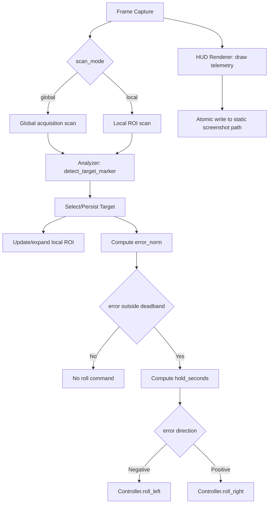
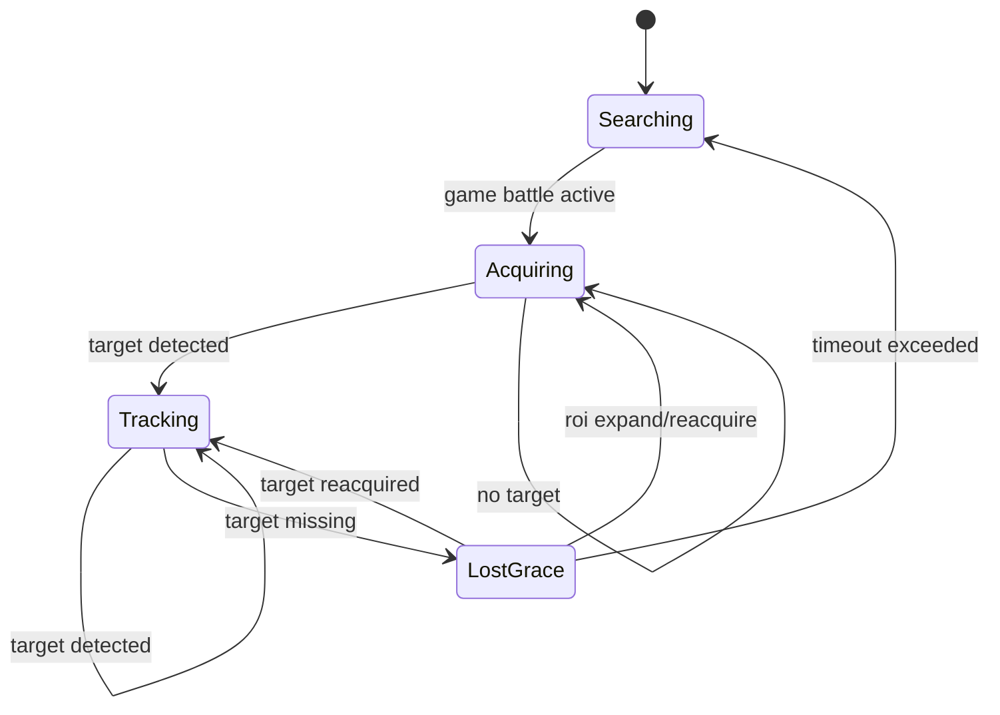

# Design 005 — Screen-Space Target Tracking and Nose Centering

| Status | Date       | Wingman Version |
|--------|------------|-----------------|
| Draft  | 2026-05-22 | 1.6.8           |

## Overview

This HLDD defines a closed-loop target tracking capability for J-20 attack behavior:

- detect a moving target marker in the HUD,
- estimate its position relative to screen center,
- apply roll input (`ROLL_LEFT_KEY` / `ROLL_RIGHT_KEY`) until the target is centered.

Unlike quadrant-only logic, this design uses continuous screen-space error and a feedback controller.

---

## Problem Statement

Current behavior can detect enemy presence and perform coarse directional responses, but it does not maintain continuous alignment with a moving target on-screen.

Desired behavior:

- if target drifts left of screen center, roll left,
- if target drifts right of screen center, roll right,
- stop rolling inside a center deadband,
- keep tracking as target moves frame-to-frame.

---

## Goals

1. Track one target marker continuously in screen space.
2. Convert target position into a normalized horizontal error signal.
3. Apply stable, non-jittery roll correction using existing controller key helpers.
4. Respect existing safety and manual-takeover constraints.
5. Provide low-overhead single-window visual telemetry via periodic annotated screenshots.

## Non-Goals

1. Full 3D interception guidance.
2. Pitch/yaw control loops.
3. Multi-target tactical prioritization beyond single-target lock persistence.

---

## Functional Design

### 1. Target Sensing

Source regions (two-phase):

1. **Global acquisition region**: `GAME_BATTLE`-anchored scan area using ADR023-style percentage coordinates and relative text offsets.
2. **Local tracking ROI**: a smaller dynamic window around the locked target, updated every cycle.

Acquisition to tracking flow:

1. Start in global acquisition mode to find an initial target marker/text anchor.
2. After lock, initialize local ROI centered on detected target location.
3. On each scan, compute new position from updated relative text location inside local ROI.
4. Expand ROI or fall back to global acquisition if confidence drops or target exits ROI bounds.

Marker extraction:

- HSV filter for target marker colors.
- Prefer locked-target color if available (red), fallback to non-locked target color (green).
- Extract contour centroids.

Relative-anchor method (ADR023-aligned):

- define crop bounds as percentages of `GAME_BATTLE` frame.
- define target text/marker expected location relative to the crop origin.
- track movement by comparing previous and current relative anchor coordinates.
- preserve screen-size independence by keeping all config in normalized coordinates.

Output per frame:

- `visible: bool`
- `centroid_x_px: float | None`
- `confidence: float` (optional heuristic from contour size/shape)
- `scan_mode: global | local`
- `roi_rect_px: [x, y, w, h] | None`

### 2. Target Selection and Persistence

When multiple centroids are present:

1. Prefer red target marker set over green marker set.
2. Pick centroid closest to previous tracked centroid (`last_x`) for temporal consistency.
3. If no previous target, pick centroid closest to crop center.

Lost-target behavior:

- keep last target for `lost_timeout_sec` (short grace window),
- if not reacquired within timeout, clear tracking state.

### 3. Error Signal

Horizontal error is measured relative to active scan center:

- `error_px = target_x - center_x`
- `error_norm = error_px / (active_width / 2)`

Where:

- `error_norm < 0` means target is left of center,
- `error_norm > 0` means target is right of center,
- `error_norm = 0` means centered.

### 4. Roll Controller

Use proportional control with deadband and clamped hold duration:

- if `abs(error_norm) <= deadband`: no roll,
- else compute `hold = clamp(kp * abs(error_norm), min_hold, max_hold)`.

Actuation mapping:

- `error_norm < -deadband` -> `roll_left(hold_seconds=hold)`
- `error_norm > +deadband` -> `roll_right(hold_seconds=hold)`

Rate limiting:

- enforce `command_cooldown_sec` between roll commands.

---

## Runtime Architecture



Integration points:

- Analyzer: new method returns tracking observation and normalized error.
- Main loop: calls tracking update in `GAME_BATTLE` only.
- Controller: add a thin `orient_nose_to_target(error_norm)` helper that translates error to `roll_left` / `roll_right` calls.
- Debug HUD: render an annotated frame every `hud.interval_sec` and overwrite one static file watched by VS Code/image preview.
- Tracking mode manager: switches between global acquisition and local ROI scan.

---

## Visualization Strategy (Primary)

To avoid split attention across game + terminal + secondary debug windows, this design
uses a **single static filename screenshot HUD** as the primary runtime visualization.

### Rationale

1. No in-game overlay injection and no anti-cheat-sensitive drawing path.
2. No extra live debug window that steals focus.
3. Persistent telemetry frame that does not scroll away like terminal logs.
4. Predictable resource usage at fixed update intervals (default 1.0s).

### Rendering model

1. Capture frame as usual.
2. Draw telemetry text/graphics directly onto a copy of that frame.
3. Write to a temp file, then atomically replace the static output filename.

Atomic write sequence:

- `live_hud.tmp.png` write complete
- `os.replace(live_hud.tmp.png, live_hud.png)`

This prevents preview tools from showing partially-written images.

### Minimum telemetry payload

1. Timestamp and loop FPS/interval.
2. FSM state (`GAME_LOBBY`, `GAME_BATTLE`, etc.).
3. Tracking values: `visible`, `centroid_x`, `error_norm`, `last_roll_cmd`.
4. Combat counters: health, missiles, flares (when available).
5. OCR timings/cycle metrics relevant to tracking responsiveness.

### Logging policy

The screenshot HUD becomes the primary high-frequency telemetry surface.

- Keep terminal logs for warnings/errors and significant state transitions.
- Reduce repetitive per-cycle info logs that are now visible on the HUD frame.

---

## State Model



State meanings:

- `Searching`: no active target.
- `Acquiring`: scanning global battle region for first lock.
- `Tracking`: active target and feedback control enabled.
- `LostGrace`: short persistence window to prevent oscillation on brief occlusion.

---

## Safety and Gating Rules

Tracking control is suppressed when any of the following is true:

1. game state is not `GAME_BATTLE`.
2. game state is `GAME_BATTLE_MANUAL`.
3. mission is not running.
4. target not visible and lost timeout exceeded.
5. optional altitude guard fails (if altitude source is available).

Manual takeover always wins over autonomous roll correction.

---

## Configuration Additions

```yaml
tracking:
  enabled: false
  crop_name: ENEMY_CLOSE_BY
  acquisition_region_basis: GAME_BATTLE
  acquisition_region_pct: [0.20, 0.18, 0.60, 0.50]  # x, y, w, h normalized
  use_relative_anchor: true
  anchor_text_offset_pct: [0.50, 0.50]
  deadband: 0.05
  kp: 0.30
  min_hold_sec: 0.08
  max_hold_sec: 0.35
  command_cooldown_sec: 0.15
  lost_timeout_sec: 0.70
  prefer_red_lock: true
  local_roi_enabled: true
  local_roi_scale: 0.22
  local_roi_min_px: [140, 90]
  local_roi_expand_factor: 1.25
  local_roi_max_scale: 0.45
  local_roi_reacquire_cycles: 3

hud:
  enabled: true
  output_path: tests/test-output/live_hud.png
  interval_sec: 1.0
  show_crops: true
  jpeg_quality: 90
```

Optional HSV tuning block (if separated from existing enemy HSV keys):

```yaml
tracking_hsv:
  red_lower: [0, 150, 150]
  red_upper: [10, 255, 255]
  green_lower: [40, 120, 120]
  green_upper: [80, 255, 255]
  min_contour_area: 12
```

---

## Implementation Plan

1. Analyzer
- add `detect_enemy_target_x(frame)` returning centroid and error.
- add short-lived tracking state (`last_x`, `last_seen_ts`) with lock protection.
- add `scan_mode` and dynamic ROI state (`roi_rect`, `miss_count`).
- implement ADR023-style relative anchor translation from `GAME_BATTLE` basis.

2. Controller
- add `orient_nose_to_target(error_norm: float)` helper.
- reuse `roll_left` / `roll_right` and enforce cooldown.

3. Main loop
- invoke tracking logic in `GAME_BATTLE` path.
- guard with manual mode and mission-running checks.
- start with global acquisition, then switch to local ROI scan after lock.
- fall back to global acquisition when local ROI confidence drops.

4. HUD renderer
- add periodic annotated screenshot writer (default 1.0s cadence).
- implement temp-write + atomic replace for static path output.
- include tracking/controller/ocr metrics overlays.

5. Tests
- unit tests for centroid selection and error normalization.
- unit tests for deadband and hold clamping.
- integration test with synthetic moving target across frames.
- unit test for atomic HUD writer path and filename replace behavior.
- unit tests for normalized acquisition-region to pixel-rect conversion.
- unit tests for local ROI expansion/fallback thresholds.

---

## Validation Strategy

1. Synthetic test frames:
- move marker from far-left -> center -> far-right,
- verify roll direction changes at zero crossing,
- verify no commands inside deadband.

1b. Acquisition/local-scan switching:
- detect target in global region and confirm mode switches to local ROI.
- move target gradually and verify local ROI follows without full-frame OCR.
- force target outside local ROI and confirm bounded expansion then global fallback.

2. Live dry-run logging mode:
- compute and log commands without sending key presses,
- tune `deadband`, `kp`, and hold bounds.

2b. Live HUD mode (recommended default):
- open `tests/test-output/live_hud.png` in VS Code/image preview,
- verify frame updates at configured interval,
- validate that telemetry values match flight behavior.

3. Controlled live flight:
- enable tracking with conservative bounds,
- verify reduced oscillation and improved center hold.

---

## Risks and Mitigations

| Risk | Impact | Mitigation |
|------|--------|------------|
| Marker jitter/noise | Roll thrash | EMA smoothing + deadband + cooldown |
| Wrong target selected | Misalignment | lock-priority + nearest-to-last-target policy |
| Lost target during clutter | Unstable switching | lost-grace timeout before reset |
| Over-aggressive gains | Oscillation | clamp hold and tune `kp` incrementally |
| Conflict with manual input | Bad UX | hard gate on `GAME_BATTLE_MANUAL` |
| Local ROI too small | Target escape, reacquire churn | min ROI size + expansion ladder + periodic global fallback |

---

## Adaptive Optimization (Future, Non-V1)

This capability is a follow-on optimization phase and is **not required** for initial delivery.
V1 remains deterministic:

1. global acquire,
2. local ROI tracking,
3. bounded expansion and fallback ladder.

Scope for adaptive methods (contextual bandit or RL policy):

1. tune ROI size and expansion factor,
2. tune scan cadence and OCR refresh interval,
3. tune fallback thresholds (`miss_count`, confidence cutoffs).

Out of scope for adaptive methods in this document:

1. direct roll-key actuation decisions,
2. replacement of deterministic safety gates,
3. uncontrolled online exploration in live runs.

Readiness criteria before enabling adaptive policy experiments:

1. stable deterministic baseline metrics captured from live sessions,
2. replay harness with recorded frames and expected tracking outcomes,
3. objective score balancing center-hold quality vs OCR/compute cost,
4. guardrails that clamp policy outputs to safe parameter ranges.

Suggested reward/objective components for future work:

- positive: target visible persistence, lower `abs(error_norm)`, reduced reacquire events,
- negative: OCR runtime cost, command jitter, target-loss events.

---

## Open Questions

1. Should red lock be mandatory for control, or allow green fallback by default?
2. Should tracking be active during all J-20 mission phases or only attack sub-phase?
3. Is altitude guard required in v1 or deferred behind a config flag?
4. Should target-tracking output feed future behavior-tree blackboard inputs directly?
5. Should adaptive optimization start as offline replay-only before any live tuning mode?

---

## Related Documents

- `docs/adr/027-j20-target-painting-mode.md`
- `docs/adr/028-enemy-quadrant-detection-and-nose-orientation.md`
- `docs/hldd/003-enemy-quadrant-detection-hldd.md`
- `docs/architecture.md`
