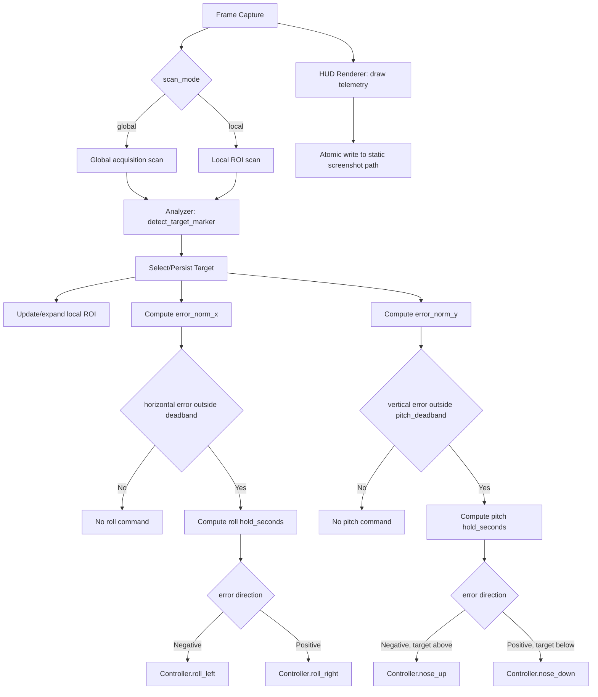
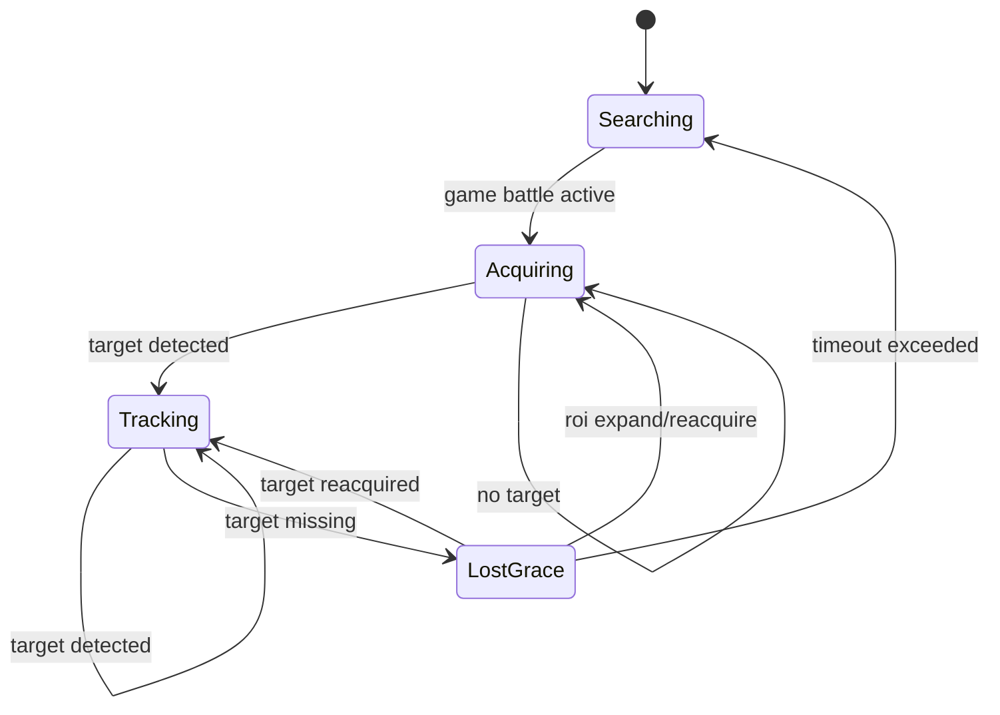
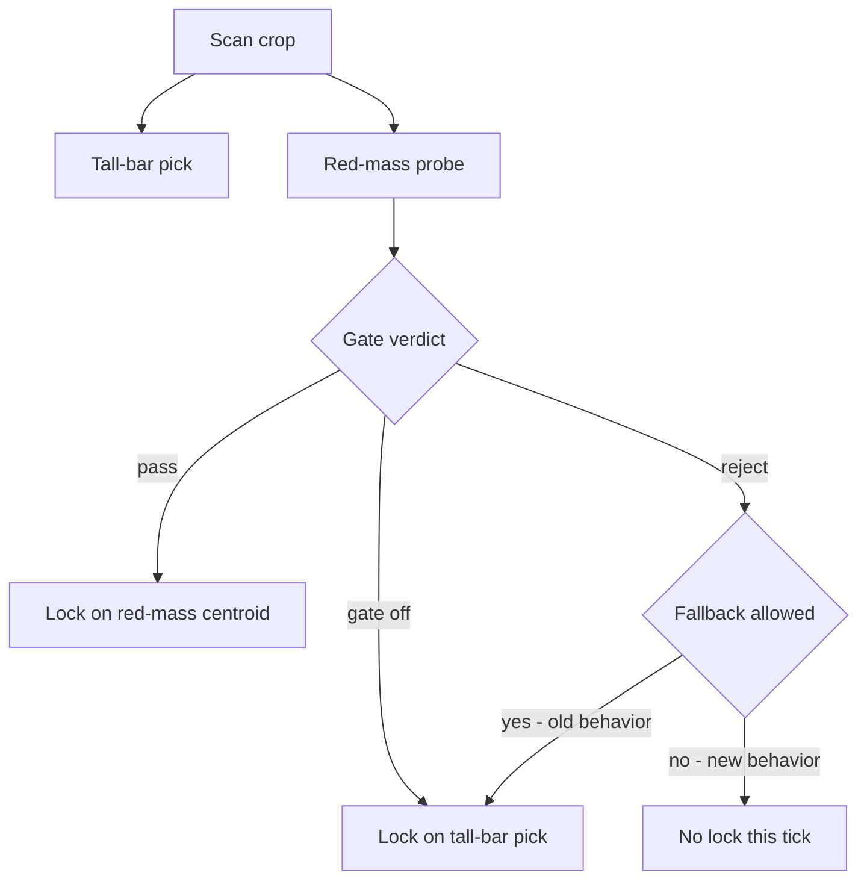
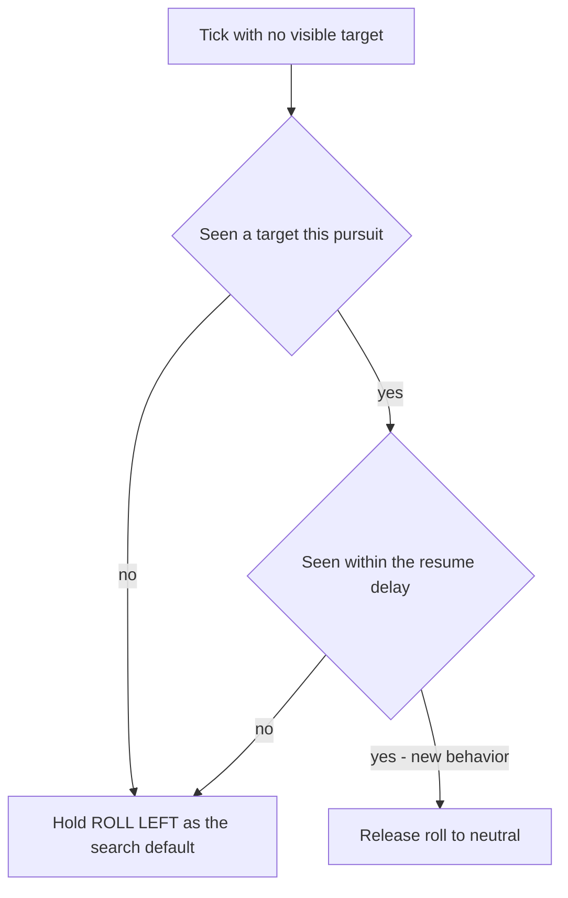

# Design 005 — Screen-Space Target Tracking and Nose Centering

| Status | Date       | Wingman Version |
|--------|------------|-----------------|
| Draft  | 2026-06-26 | 1.6.22          |

## Overview

This HLDD defines a closed-loop target tracking capability for J-20 attack behavior:

- detect a moving target marker in the HUD,
- estimate its position relative to screen center, both horizontally and vertically,
- apply roll input (`ROLL_LEFT_KEY` / `ROLL_RIGHT_KEY`) to close the horizontal error and pitch
  input (`NOSE_UP_KEY` / `NOSE_DOWN_KEY`) to close the vertical error, until the target is centered
  on both axes.

Unlike quadrant-only logic, this design uses continuous screen-space error and a feedback controller.

**Revision note (2026-09-21):** this design was originally roll-only, with pitch explicitly
out of scope (see the superseded Non-Goal text preserved as a comment below) and delegated to a
future consumer (HLDD-011's planned `BoresightEngage`). Operator direction: fold pitch into this
design directly — the tracker should be able to command "any flight control key," not just roll —
since the underlying goal (steer the nose onto whichever enemy is nearest screen center) is
inherently two-axis: the ALTITUDE_SPEED.png reference frame (Selection Hardening, below) shows a
target that is both left *and* above center, which a roll-only controller cannot close. See Two-Axis
Rollout (below) for how this is being validated, and Open Question 7 for the resulting overlap with
HLDD-011 that this change surfaces and does not itself resolve.

---

## Problem Statement

Current behavior can detect enemy presence and perform coarse directional responses, but it does not maintain continuous alignment with a moving target on-screen, and — before this revision — could only ever correct in one axis.

Desired behavior:

- if target drifts left of screen center, roll left,
- if target drifts right of screen center, roll right,
- if target drifts above screen center, pitch up,
- if target drifts below screen center, pitch down,
- stop correcting inside a center deadband, independently per axis,
- keep tracking as target moves frame-to-frame.

---

## Goals

1. Track one target marker continuously in screen space.
2. Convert target position into normalized horizontal **and vertical** error signals.
3. Apply stable, non-jittery roll **and pitch** correction using existing controller key helpers.
4. Respect existing safety and manual-takeover constraints.
5. Provide low-overhead single-window visual telemetry via periodic annotated screenshots.
6. Gate the new pitch axis independently from the already-validated roll axis, so extending this
   design cannot regress roll's own live-validation status (see Two-Axis Rollout, below).

## Non-Goals

1. Full 3D interception guidance (lead prediction, closing-rate compensation). Screen-space
   centering on both axes is not intercept geometry.
2. **Superseded 2026-09-21 — kept for history, not current guidance:** ~~Pitch/yaw control loops.
   Still true for *this* design — the roll controller stays roll-only. Where a consumer needs pitch
   alongside it (ADR 136's dive-and-track mode, HLDD-011's future `BoresightEngage`), pitch is driven
   by a separate, already-existing primitive (`eject_and_dive`'s `NOSE_DOWN` impulse rotation, ADR
   069) called alongside this tracker's roll controller, not folded into it.~~ Replaced by: this
   design now owns a pitch channel directly (Functional Design 5, below) — see the Revision note
   above for why, and Safety and Gating Rules for the one place the old separation still holds by
   necessity (the ADR 136 heatdive consumer, which must keep using the dive's own `NOSE_DOWN`
   primitive for pitch and must not also invoke this design's new pitch channel — two independent
   writers on the same key during the same dive is a correctness hazard, not a style choice; see
   below).
3. A symmetric yaw axis. `YAW_LEFT` (`wingman/keybindings.py:21`, ADR 070) is a one-directional
   rudder kick already owned by `MissileEvade`'s break-turn, with no `YAW_RIGHT` counterpart to pair
   it with — there is no continuous, bidirectional yaw control surface for this design to drive even
   if it wanted to.
4. Multi-target tactical prioritization beyond single-target lock persistence.

---

## Functional Design

### 1. Target Sensing

Source regions (two-phase):

1. **Global acquisition region**: `GAME_BATTLE`-anchored scan area using ADR023-style percentage coordinates and relative text offsets.
2. **Local tracking ROI**: a smaller dynamic window around the locked target, updated every cycle.

Acquisition to tracking flow:

1. Start in global acquisition mode to find an initial target marker/text anchor.
2. After lock, initialize local ROI centered on detected target location.
3. On each scan, compute new position from updated relative text location inside local ROI.
4. Expand ROI or fall back to global acquisition if confidence drops or target exits ROI bounds.

Marker extraction:

- HSV filter for target marker colors.
- Prefer locked-target color if available (red), fallback to non-locked target color (green).
- Extract contour centroids.

#### Target marker visual characteristics

From live gameplay frames (`P2_050_RESPAWN_CLEAR_HEALTH_ALIVE_MISSILES_4.png` and related):

- **Non-locked enemy marker**: tall, narrow, bright-green vertical bar. Typically 3–6% of frame height,
  width 1–4 px. One bar per visible enemy. Multiple bars present simultaneously at varying
  distances (near bars are taller; far bars are shorter and may resolve to near-point blobs).
- **Locked-target marker**: same vertical-bar shape, color shifts toward red/orange.
  When locked the dashed-circle reticle (see below) also appears.
- **Lock-on reticle**: a dashed white/green circle that tracks the locked target independently
  of the bar. The reticle is a separate HUD element — it is **not** the target marker and should
  not be used as the centroid source. Track the bar, not the reticle.
- **Yellow proximity dot**: a small solid yellow marker appears below/near the reticle when an
  enemy is very close (< ~500m). Can be used as a high-confidence "close target" signal.
- **Blue edge indicators**: thin blue horizontal lines at screen edges indicate enemies outside
  the FOV. Not useful for screen-space tracking but signal that reacquire should be attempted.

**Reference frame for the centrality principle** (`test_screenshots/ALTITUDE_SPEED.png`, 1920x1200):
captured at match end (`MATCH OVER` banner), so it shows the post-match nametag/health-bar overlay,
not the tall-bar marker system described above — it is not itself a frame the live tracker consumes.
It is kept here because it states this design's own ranking goal in the clearest available terms: of
the two visible contacts, `[TIG] ManuTheRed`'s Su-25 (0.25km, rendered roughly 250px left and 45px
above frame center) sits far closer to center than `[SD] demonslayer`'s F-14 (1.3km, rendered at the
right-edge indicator rail, 330-770px off-center depending on which of its two rendered elements is
measured). A tracker faithful to this design's selection goal should prefer the Su-25. See Selection
Hardening (below) for a code-level gap between that goal and the current implementation that this
frame motivated flagging.

Contour selection implications:
- Contour aspect ratio filter (tall/thin) eliminates the dashed circle and HUD noise.
  A contour with height >= 3x width and minimum area of 12 px² is characteristic of the bar.
- The nearest (tallest) bar is usually the highest-priority target. Nearest-to-last-centroid
  policy handles the case where multiple bars are present.

#### Respawn recovery

After a `respawn_detected` event (from `MissionStatsTracker`), the tracking state machine
must return to `Acquiring` regardless of prior state. The respawn blank-screen interval
(typically 2–4 s) means the local ROI will see no markers; this must not trigger a permanent
lost-target state. The `lost_timeout_sec` grace window should be long enough to survive the
respawn blanking without requiring a tuning change. The `Searching → Acquiring` transition
is gated on `GAME_BATTLE` being active, which handles respawn automatically as long as the
FSM is still in `GAME_BATTLE` throughout.

Relative-anchor method (ADR023-aligned):

- define crop bounds as percentages of `GAME_BATTLE` frame.
- define target text/marker expected location relative to the crop origin.
- track movement by comparing previous and current relative anchor coordinates.
- preserve screen-size independence by keeping all config in normalized coordinates.

Output per frame:

- `visible: bool`
- `centroid_x_px: float | None`
- `confidence: float` (optional heuristic from contour size/shape)
- `scan_mode: global | local`
- `roi_rect_px: [x, y, w, h] | None`

### 2. Target Selection and Persistence

When multiple centroids are present:

1. Prefer red target marker set over green marker set.
2. Pick centroid closest to previous tracked centroid (`last_x`) for temporal consistency.
3. If no previous target, pick centroid closest to crop center.

**Known gap (2026-09-21, see Selection Hardening below):** rule 1 is implemented as a mask-level
switch (`TargetTracker._detect_targets`, `wingman/tracker.py:317`), not a per-candidate tie-break —
any red pixel anywhere in the acquisition crop discards the *entire* green candidate set before rules
2/3 ever run. A locked contact far from center, or even at the frame edge, currently always outranks
an unlocked contact dead-center. Rules 2/3 only ever choose among candidates of whichever single color
survived rule 1, never across colors. Also worth stating plainly: "closest" in rules 2/3 is horizontal
pixel distance only (`abs(cx - ref)`, `wingman/tracker.py:339`), never full 2D distance to center —
consistent with this design's roll-only Non-Goal 2, but easy to misjudge from a screenshot where the
eye reads 2D closeness. Not yet changed — see the phased validation plan below for why.

Lost-target behavior:

- keep last target for `lost_timeout_sec` (short grace window),
- if not reacquired within timeout, clear tracking state.

### 3. Error Signals

Horizontal and vertical error are each measured relative to active scan center, independently:

- `error_px_x = target_x - center_x`
- `error_norm_x = error_px_x / (active_width / 2)`
- `error_px_y = target_y - center_y`
- `error_norm_y = error_px_y / (active_height / 2)`

Where:

- `error_norm_x < 0` means target is left of center, `> 0` means right, `= 0` means centered
  (this is the pre-2026-09-21 `error_norm`, unrenamed at the call sites that only ever wanted
  horizontal — `error_norm_x` is additive, not a breaking rename).
- `error_norm_y < 0` means target is above center, `> 0` means below, `= 0` means centered — sign
  follows screen-pixel-y convention (down is positive), matching how `centroid_y` already reports
  position (`wingman/tracker.py`'s `update()`).

`error_norm_y` is new: `centroid_y` was already computed and returned by `TargetTracker.update()`
(`wingman/tracker.py:198`) for local-ROI centering, but nothing before this revision turned it into
a control signal. No new sensing work is required for this — only the arithmetic above and a
second controller to act on it.

### 4. Roll Controller (horizontal axis)

Use proportional control with deadband and clamped hold duration:

- if `abs(error_norm_x) <= deadband`: no roll,
- else compute `hold = clamp(kp * abs(error_norm_x), min_hold, max_hold)`.

Actuation mapping:

- `error_norm_x < -deadband` -> `roll_left(hold_seconds=hold)`
- `error_norm_x > +deadband` -> `roll_right(hold_seconds=hold)`

Rate limiting:

- enforce `command_cooldown_sec` between roll commands.

This axis is unchanged by this revision — same law, same config keys, same
`Controller.orient_nose_to_target()` entry point. It is the axis with a live-validated track record
(ADR 136 D1-D3, D5); the pitch axis added below inherits its shape but not its validation status.

### 5. Pitch Controller (vertical axis, new 2026-09-21)

Identical control law, independent instance, independent tuning — this is a second copy of the
proportional-with-deadband controller, not a shared one, for the same reason `_actuate_seek_center`
(HLDD 013) carries its own commit/release state rather than sharing `EngageNavigator`'s: roll and
pitch dynamics are not required to share a gain just because the math is the same shape.

- if `abs(error_norm_y) <= pitch_deadband`: no pitch input,
- else compute `pitch_hold = clamp(pitch_kp * abs(error_norm_y), pitch_min_hold, pitch_max_hold)`.

Actuation mapping:

- `error_norm_y < -pitch_deadband` -> `nose_up(hold_seconds=pitch_hold)` (target above center)
- `error_norm_y > +pitch_deadband` -> `nose_down(hold_seconds=pitch_hold)` (target below center)

Rate limiting:

- enforce `pitch_command_cooldown_sec` between pitch commands — tracked independently from the roll
  axis's own `_last_orient_ts`, so a roll command in flight never delays a pitch command or vice
  versa (the two axes are commanded via different keys and can overlap in real time; the game
  accepts simultaneous key holds on independent controls, same as a human player holding two flight
  keys at once).

**`nose_up`/`nose_down` need one change to be usable here.** Both currently take only
`hold_seconds`/`block` (`controller.py:1177-1193`) — neither has the `ignore_cancel` parameter
`roll_left`/`roll_right`/`fire_active_weapon`/`switch_weapon`/`orient_nose_to_target` already gained
under ADR 136, for the exact reason ADR 136 documents: a caller running after
`self._mission_cancel` is already set for the call's duration (as any eject-adjacent caller would
be) gets its hold cut to near-zero on the first cancellation poll. Since this design's own ambient
path runs in `GAME_BATTLE` with `_mission_cancel` *not* pre-set, `ignore_cancel` defaults `False`
and changes nothing for that caller — the parameter only matters to a future caller inside an
already-cancelled sequence, and per Safety and Gating Rules (below) no such caller exists yet for
this axis.

A new `Controller.orient_pitch_to_target(error_norm_y, ...)` mirrors `orient_nose_to_target`'s
signature exactly (`deadband` → `pitch_deadband`, `kp` → `pitch_kp`, etc.), rather than overloading
`orient_nose_to_target` itself with a second error argument — keeping the two call sites independent
means either axis can be gated, tuned, or disabled without touching the other's signature or its
existing call sites (`_actuate_engage`, ADR 136's heatdive loop).

---

## Runtime Architecture



Roll and pitch are drawn as two independent branches off the same selected target, deliberately —
they share sensing (one `SEL` box) but not actuation gating, cooldown state, or config, matching
Functional Design 4/5's "independent instance, independent tuning" framing above.

Integration points:

- Analyzer: new method returns tracking observation and normalized error.
- Main loop: calls tracking update in `GAME_BATTLE` only.
- Controller: add a thin `orient_nose_to_target(error_norm)` helper that translates error to `roll_left` / `roll_right` calls.
- Debug HUD: render an annotated frame every `hud.interval_sec` and overwrite one static file watched by VS Code/image preview.
- Tracking mode manager: switches between global acquisition and local ROI scan.

---

## Visualization Strategy (Primary)

To avoid split attention across game + terminal + secondary debug windows, this design
uses a **single static filename screenshot HUD** as the primary runtime visualization.

### Rationale

1. No in-game overlay injection and no anti-cheat-sensitive drawing path.
2. No extra live debug window that steals focus.
3. Persistent telemetry frame that does not scroll away like terminal logs.
4. Predictable resource usage at fixed update intervals (default 1.0s).

### Rendering model

1. Capture frame as usual.
2. Draw telemetry text/graphics directly onto a copy of that frame.
3. Write to a temp file, then atomically replace the static output filename.

Atomic write sequence:

- `live_hud.tmp.png` write complete
- `os.replace(live_hud.tmp.png, live_hud.png)`

This prevents preview tools from showing partially-written images.

### Minimum telemetry payload

1. Timestamp and loop FPS/interval.
2. FSM state (`GAME_LOBBY`, `GAME_BATTLE`, etc.).
3. Tracking values: `visible`, `centroid_x`, `error_norm`, `last_roll_cmd`.
4. Combat counters: health, missiles, flares (when available).
5. OCR timings/cycle metrics relevant to tracking responsiveness.

### Logging policy

The screenshot HUD becomes the primary high-frequency telemetry surface.

- Keep terminal logs for warnings/errors and significant state transitions.
- Reduce repetitive per-cycle info logs that are now visible on the HUD frame.

---

## State Model



State meanings:

- `Searching`: no active target.
- `Acquiring`: scanning global battle region for first lock.
- `Tracking`: active target and feedback control enabled.
- `LostGrace`: short persistence window to prevent oscillation on brief occlusion.

---

## Safety and Gating Rules

This section originally described one combined gate on the whole tracking
capability. As of 2026-09-09 the implementation (already live in
`wingman/tick_handlers.py`'s `TrackingHudHandler`, ahead of this document —
see the note at the top of Implementation Plan) splits **sensing** from
**actuation**, and the two are gated differently:

- **Sensing** (`TargetTracker.update(frame)`, HUD rendering — no key press)
  runs in `GAME_BATTLE` **and** `GAME_BATTLE_MANUAL`. This is deliberate:
  sensing quality can be validated live while an operator flies manually and
  deliberately points at targets, with zero actuation risk — exactly the
  "Live dry-run logging mode" this document's own Validation Strategy step 2
  already called for, now generalized to run continuously rather than only
  during automated flight. A config flag, `tracking.actuate` (default
  `false`), gates whether detections are ever turned into roll commands at
  all — even in `GAME_BATTLE` — so enabling `tracking.enabled` for the first
  time can never silently start rolling the aircraft.
- **Actuation** (`Controller.orient_nose_to_target`) is suppressed unless
  *all* of the following hold:
  1. `tracking.actuate` is `true`.
  2. game state is `GAME_BATTLE` (never `GAME_BATTLE_MANUAL`).
  3. mission is running (`Controller.is_mission_running()`).
  4. target visible and lost timeout not exceeded.
  5. optional altitude guard passes (if altitude source is available).

Manual takeover always wins over autonomous roll correction — rule 2 above
is absolute, not merely a default.

**This split exists for a second consumer, not only for this document's own
validation.** ADR 136 (`docs/adr/136-heatseeker-dive-invokable-mode.md`)
calls `TargetTracker.update()` and `Controller.orient_nose_to_target()`
directly from inside `eject_and_dive`'s existing closed-loop thread, gated
by its own new flag (`telemetry.eject_closed_loop.heatdive_enabled`, default
`false`, currently shipped `true` — `wingman/config.yaml:845` — i.e. this is
the one consumer of this design's roll channel already actuating live today)
rather than a separate mode or mission. That caller does **not** go through
`tracking.enabled` / `tracking.actuate` at all — those flags gate only the
ambient, tick-driven path described in this document. Manual-takeover
cancellation is inherited for free: `eject_and_dive` is already covered by
`release_for_manual_takeover()`/`cancel_mission()`, and ADR 136's addition
shares `eject_and_dive`'s own `self._eject_stop` event as its stop signal
rather than adding a second one.

### Pitch actuation gate (new 2026-09-21) — independent of, and stricter than, roll's

The pitch channel (Functional Design 5, above) is gated by its own flag,
`tracking.actuate_pitch` (default `false`), checked in addition to every
existing roll gate above, not instead of them — enabling pitch can never
imply roll is also enabled, and vice versa. Rationale for a separate flag
rather than reusing `tracking.actuate`: roll already has a live-validated
track record (ADR 136 D1-D3, D5); pitch has none. Folding pitch under the
same flag would mean the *next* person who flips `tracking.actuate: true`
for roll — already-justified by roll's own history — silently also gets an
entirely unvalidated pitch channel with no independent decision point. See
Two-Axis Rollout (below) for the shadow plan this flag exists to support.

**The ADR 136 heatdive consumer must never set `tracking.actuate_pitch` —
this is a hard exclusion, not a default to revisit.** `eject_and_dive`'s own
`_eject_descent_control` (ADR 069) already holds exclusive ownership of
`NOSE_DOWN_KEY`/`NOSE_UP_KEY` for the whole dive: it alternates bounded
`NOSE_DOWN` pulses with a hands-off ballistic phase to reach and hold a
target dive angle, and ADR 058's dive-confirmation criterion depends on
`_eject_nose_held_total_s`, a *cumulative* real-hold-time measurement
(`controller.py:1582-1610`) that assumes it is the only thing pressing that
key. A second, uncoordinated writer — this design's new pitch channel,
correcting toward a target's vertical position rather than toward a dive
angle — pressing or releasing `NOSE_DOWN_KEY`/`NOSE_UP_KEY` mid-dive would:
corrupt that cumulative-hold accounting (a release this design issues while
the descent controller believes the key is still down desyncs
`_eject_nose_down_since`), fight the descent controller's own attitude
target with an unrelated one (aim vs. dive angle are different objectives
that do not average safely), and reproduce exactly the "second,
uncoordinated writer on an axis" failure class this codebase has already
paid to learn about on the roll axis (ADR 110's `TACTIC_CLIMB` loitering
fix, HLDD 013's explicit `survival_hold` exclusion citing that same
incident). ADR 136's own Non-Goal 2 already states pitch stays on
`eject_and_dive`'s existing `NOSE_DOWN` primitive "unmodified" — this
design's pitch addition does not change that; it only adds a channel for a
*different* consumer (the ambient path) to use. Enforcement: this design's
own actuation gate list for pitch above (game state `GAME_BATTLE`, never
inside an eject sequence) already excludes the heatdive caller by
construction, since `eject_and_dive` runs after `cancel_mission()` and
outside the ambient tick loop entirely — no additional code guard is
required *if* `tracking.actuate_pitch` is never wired into ADR 136's own
call sites, which is the discipline this note exists to name explicitly, not
something the config schema can enforce by itself.

---

## Configuration Additions

```yaml
tracking:
  enabled: false
  crop_name: ENEMY_CLOSE_BY
  acquisition_region_basis: GAME_BATTLE
  acquisition_region_pct: [0.20, 0.18, 0.60, 0.50]  # x, y, w, h normalized
  use_relative_anchor: true
  anchor_text_offset_pct: [0.50, 0.50]
  actuate: false               # roll axis — live-validated (ADR 136), still shadow by default here
  deadband: 0.05
  kp: 0.30
  min_hold_sec: 0.08
  max_hold_sec: 0.35
  command_cooldown_sec: 0.15
  # Pitch axis (new 2026-09-21) — own flag, own gains. Deliberately NOT reusing
  # tracking.actuate/deadband/kp/etc: pitch has zero live-validation history and
  # must be independently enable-able and independently tunable. Never wired
  # into ADR 136's heatdive consumer — see Safety and Gating Rules above.
  actuate_pitch: false
  pitch_deadband: 0.05
  pitch_kp: 0.30
  pitch_min_hold_sec: 0.08
  pitch_max_hold_sec: 0.35
  pitch_command_cooldown_sec: 0.15
  lost_timeout_sec: 0.70
  prefer_red_lock: true
  local_roi_enabled: true
  local_roi_scale: 0.22
  local_roi_min_px: [140, 90]
  local_roi_expand_factor: 1.25
  local_roi_max_scale: 0.45
  local_roi_reacquire_cycles: 3

hud:
  enabled: true
  output_path: tests/test-output/live_hud.png
  interval_sec: 1.0
  show_crops: true
  jpeg_quality: 90
```

Optional HSV tuning block (if separated from existing enemy HSV keys):

```yaml
tracking_hsv:
  # Locked target bar (red/orange).  Wrap-around hue: also check [170,150,150]-[179,255,255].
  red_lower: [0, 150, 150]
  red_upper: [10, 255, 255]
  # Non-locked enemy bar: saturated bright green observed in live frames.
  green_lower: [45, 150, 150]
  green_upper: [75, 255, 255]
  # Yellow close-proximity dot (bonus signal, not required for tracking).
  yellow_lower: [20, 150, 150]
  yellow_upper: [35, 255, 255]
  # Contour aspect ratio filter: reject blobs that aren't taller than wide.
  # Prevents reticle circle and HUD noise from matching as target markers.
  min_contour_area: 12
  min_aspect_ratio: 2.5   # height / width >= 2.5 for a valid target bar
```

Notes on HSV values:
- OpenCV HSV uses H: 0–179, S: 0–255, V: 0–255.
- The bright green bars in live frames land around H: 50–70, S: 180–255, V: 180–255.
- The `green_lower/upper` range above tightens the original draft (was `[40,120,120]`–`[80,255,255]`)
  to reduce false positives from green HUD text and foliage in game backgrounds.
- The `min_aspect_ratio` filter is new: contour height/width >= 2.5 accepts the tall bar,
  rejects the roughly-circular lock-on reticle and small background blobs.

---

## Implementation Plan

**Implementation status (2026-09-09):** this plan is implemented, not
speculative — `wingman/tracker.py`'s `TargetTracker` and
`TrackingHudHandler` in `wingman/tick_handlers.py` exist and are wired into
the main loop today, gated by `tracking.enabled` (sensing) and
`tracking.actuate` (actuation, see Safety and Gating Rules above). The
Status table above still says `Draft` because the live-validation steps
under Validation Strategy have not been run against a real match yet —
"implemented" and "validated" are tracked separately in this document.

1. Analyzer
- add `detect_enemy_target_x(frame)` returning centroid and error.
- add short-lived tracking state (`last_x`, `last_seen_ts`) with lock protection.
- add `scan_mode` and dynamic ROI state (`roi_rect`, `miss_count`).
- implement ADR023-style relative anchor translation from `GAME_BATTLE` basis.

2. Controller
- add `orient_nose_to_target(error_norm: float)` helper.
- reuse `roll_left` / `roll_right` and enforce cooldown.

3. Main loop
- invoke tracking logic in `GAME_BATTLE` path.
- guard with manual mode and mission-running checks.
- start with global acquisition, then switch to local ROI scan after lock.
- fall back to global acquisition when local ROI confidence drops.

4. HUD renderer
- add periodic annotated screenshot writer (default 1.0s cadence).
- implement temp-write + atomic replace for static path output.
- include tracking/controller/ocr metrics overlays.

5. Tests
- unit tests for centroid selection and error normalization.
- unit tests for deadband and hold clamping.
- integration test with synthetic moving target across frames.
- unit test for atomic HUD writer path and filename replace behavior.
- unit tests for normalized acquisition-region to pixel-rect conversion.
- unit tests for local ROI expansion/fallback thresholds.
- regression test on `P2_050_RESPAWN_CLEAR_HEALTH_ALIVE_MISSILES_4.png`: verify marker detected,
  reticle circle rejected by aspect-ratio filter, centroid outside reticle region.

---

## Validation Strategy

0. Reference frame regression (static, fast):
- use `test_screenshots/integration_test/P2_050_RESPAWN_CLEAR_HEALTH_ALIVE_MISSILES_4.png`
  as a known-good GAME_BATTLE respawn-cleared frame.
- verify `detect_enemy_target_x()` returns at least one centroid with confidence >= threshold.
- verify no centroid falls inside the lock-on reticle region (approx center-left of frame).
- verify aspect-ratio filter rejects the reticle circle and accepts the tall green bars.

1. Synthetic test frames:
- move marker from far-left -> center -> far-right,
- verify roll direction changes at zero crossing,
- verify no commands inside deadband.

1b. Acquisition/local-scan switching:
- detect target in global region and confirm mode switches to local ROI.
- move target gradually and verify local ROI follows without full-frame OCR.
- force target outside local ROI and confirm bounded expansion then global fallback.

2. Live dry-run logging mode:
- compute and log commands without sending key presses,
- tune `deadband`, `kp`, and hold bounds.

2b. Live HUD mode (recommended default):
- open `tests/test-output/live_hud.png` in VS Code/image preview,
- verify frame updates at configured interval,
- validate that telemetry values match flight behavior.

3. Controlled live flight:
- enable tracking with conservative bounds,
- verify reduced oscillation and improved center hold.

---

## Risks and Mitigations

| Risk | Impact | Mitigation |
|------|--------|------------|
| Marker jitter/noise | Roll thrash | EMA smoothing + deadband + cooldown |
| Wrong target selected | Misalignment | lock-priority + nearest-to-last-target policy |
| Lost target during clutter | Unstable switching | lost-grace timeout before reset |
| Over-aggressive gains | Oscillation | clamp hold and tune `kp` incrementally |
| Conflict with manual input | Bad UX | hard gate on `GAME_BATTLE_MANUAL` |
| Local ROI too small | Target escape, reacquire churn | min ROI size + expansion ladder + periodic global fallback |

---

## Selection Hardening — Color-Class Priority vs. Centrality (2026-09-21)

### Finding

`TargetTracker._detect_targets` (`wingman/tracker.py:295-329`) does not rank red and green candidates
against each other — it excludes one color class entirely before ranking begins:

```python
mask = mask_red if (self._prefer_red and bool(np.any(mask_red))) else mask_green
```

If any red pixel exists anywhere in the acquisition crop, every green contour is dropped before
`_select_target` (`tracker.py:331-340`) ever runs. `_select_target` then ranks the survivors by
horizontal distance only — `abs(cx - ref)`, where `ref` is `self._last_x` once a target has ever been
locked, or the frame's horizontal center on first acquisition (`tracker.py:338-339`). Both of these
are correct in isolation and match this design's own stated rules (Target Selection and Persistence,
above) — the gap is that color (rule 1) is evaluated as a hard pre-filter, never as one input alongside
distance (rules 2/3). A locked contact anywhere in frame, including at the extreme edge, always
outranks every unlocked contact, however close to center, as long as it produces even one qualifying
red pixel.

`test_screenshots/ALTITUDE_SPEED.png` prompted flagging this: it isn't itself a frame the tracker
consumes (see the note under Target marker visual characteristics, above), but its layout is exactly
the shape that would trigger this gap in a live frame — a distant, edge-adjacent contact (F-14, this
document's stand-in for "reads as locked/red") next to a much closer, more central contact (Su-25,
"reads as unlocked/green"). No live capture has yet confirmed this actually firing during a real
heatdive — this is a code-reading finding, not a reproduced live bug.

### Why this matters now, not hypothetically

This design's own sensing/actuation split (Safety and Gating Rules, above) keeps the *ambient* path
inert by default (`tracking.enabled: false`, `tracking.actuate: false`, `wingman/config.yaml:749,757`).
But ADR 136's heatdive addition bypasses that gate entirely and is live today:
`telemetry.eject_closed_loop.heatdive_enabled: true` (`wingman/config.yaml:845`) means this exact
selection code already steers a real airframe on every missiles-empty eject. This is precisely the
"throwaway aircraft, already committed to crashing" moment identified as a safe place to extend
tracking — which is also, unavoidably, the one path where this selection code is not shadow-only
today. A hardening change here changes live behavior on the very next dive it ships in, unlike a
change to the ambient path (which would ship inert by default). That asymmetry is the reason for the
phased plan below rather than a direct fix.

### Phased Rollout — Shadow Session Validation

Matching this codebase's standing convention (ADR 070's missile-evade shadow trial, HLDD 013 Phase 1's
shadow-first bring-up, ADR 136 D4's own hard lesson from toggling a real key against an unverified
signal): no ranking change reaches the live heatdive path without a shadow session confirming it first.

**Phase 1 — measure, change nothing.** Add rationale logging to `_detect_targets`/`_select_target`:
whenever red pixels are present *and* at least one green contour would otherwise have qualified, log
the mask that won, the discarded green candidate(s)' position and horizontal distance from `ref`, and
the eventually-selected target's own distance from `ref` — rate-limited the same way ADR 117 D9's
`_blind_no_boundary_line_skips` logs (1st, 10th, 100th occurrence, then every 500th), not once per
qualifying tick. This is a pure logging addition — no behavior change, safe to ship immediately on the
already-live heatdive path, since it touches neither `mask` nor `_select_target`'s return value.
Purpose: learn, from real dive sessions, how often color-exclusion actually overrides a materially
more central or closer-to-last-position green candidate, and by how much — the Su-25/F-14 contrast is
a plausible shape, not yet a measured frequency.

**Phase 2 — shadow the candidate fix, still without acting on it.** Only if Phase 1's logs show the
gap firing often enough to matter: replace the hard mask exclusion with a single ranked candidate pool
(red and green contours merged, each carrying its color) and a bounded preference for red — e.g. red
wins ties within a configurable centrality tolerance, but a green candidate meaningfully closer to
`ref` still wins outright — gated behind a new flag defaulted `false` (e.g.
`tracking.ranked_lock_priority`, alongside the existing `tracking`/`tracking_hsv` blocks). While the
flag is `false`, run the new ranking function in parallel with the existing one and log wherever they
would disagree (`"SELECT[shadow]: old=... new=... would change"`), without changing `_select_target`'s
actual return value — the same "compute both, log the difference, act on neither yet" shape Phase 1
already establishes, one level up.

**Phase 3 — enable live, on the heatdive path first.** Flip `tracking.ranked_lock_priority: true` only
after a live session's Phase 2 shadow log shows the new ranking agrees with the old one whenever they
would pick the same target, and demonstrably prefers the nearer/more-central candidate in every
disagreement case observed — the same bar ADR 136 D5 already set for its own fix ("live-measured...
not a guess"). Validate specifically through the heatdive path first, since it is the only consumer
currently actuating on this code at all; only extend to the ambient `tracking.enabled`/
`tracking.actuate` path afterward, once both the sensing-quality and the ranking-quality questions have
independent live evidence. Record the outcome as a dated revision inside ADR 136 (its heatdive
consumer owns the live-trial history for this code path), cross-referenced from here — not by
rewriting this section after the fact.

### Testing plan

- Unit: once Phase 2's ranked pool replaces the hard mask switch, `_detect_targets` returns the full
  merged, color-tagged candidate list; a synthetic frame with one red contour at the edge and one
  green contour at center exercises exactly the disagreement case this section exists to catch.
- Unit: with `tracking.ranked_lock_priority: false` (default), confirm the new ranking function's
  output is computed and logged but `_select_target`'s actual return value is provably unchanged from
  today's mask-switch behavior, across both the agreement and disagreement cases above.
- Shadow live trial (required before Phase 2 ships as anything but inert logging): one full session
  with real dives, reading the rate-limited Phase 1 log to answer "how often, and by how much" before
  writing Phase 2's ranking function at all — if the gap essentially never fires in practice, Phase 2
  may not be worth building.
- Live trial (required before Phase 3): compare selected-target identity and resulting roll direction,
  Phase 2 shadow log vs. actual `_select_target` output, across a full heatdive session, before
  flipping `tracking.ranked_lock_priority` to `true`.

---

## Two-Axis Rollout — Shadow Session Validation (2026-09-21)

Folding pitch into this design (see the Revision note under Overview) is a bigger behavioral change
than Selection Hardening above — it's a brand-new actuation axis with zero live history, added to a
design whose roll axis already has one (ADR 136 D1-D3, D5). It gets the same shadow-first treatment,
scoped to just this axis so roll's existing validated status is never put at risk by it.

**Phase 0 (today).** Roll axis: sensing live in `GAME_BATTLE`/`GAME_BATTLE_MANUAL`, actuation gated
by `tracking.actuate` (ambient, default `false`) and separately live via ADR 136's heatdive consumer
(`telemetry.eject_closed_loop.heatdive_enabled: true` today). Pitch axis: does not exist yet.

**Phase 1 — sense and log, actuate nothing.** Ship `error_norm_y` (Functional Design 3) and the
`orient_pitch_to_target` computation (Functional Design 5) with `tracking.actuate_pitch: false`. While
disabled, log what pitch command *would* fire — direction and hold-seconds — every qualifying tick,
rate-limited the same way HLDD 013 Phase 1 and Selection Hardening Phase 1 both already log (1st,
10th, 100th occurrence, then every 500th):

```python
logger.info("PITCH[shadow]: would %s hold=%.2fs err_y=%.2f (%d so far)",
            "nose_up" if error_norm_y < 0 else "nose_down", pitch_hold, error_norm_y,
            self._pitch_shadow_count)
```

This is pure sensing/logging — no key press, so it is safe to enable in the exact same sessions
already flying with `tracking.enabled: true` for horizontal shadow validation, at zero incremental
actuation risk. Purpose: confirm `centroid_y`/`error_norm_y` tracks real vertical target motion
sensibly (not just that the horizontal signal already does) before any key is ever pressed on this
axis.

**Phase 2 — controlled live flight, roll and pitch together, ambient path only.** Enable
`tracking.actuate_pitch: true` only after Phase 1's shadow log shows sensible vertical tracking,
and only ever on the ambient `tracking.enabled`/`tracking.actuate` path — never for the ADR 136
heatdive consumer (Safety and Gating Rules, above, is the hard rule; this phase does not revisit
it). Start with conservative gains (the defaults above are named guesses, same status as Selection
Hardening's `seek_center_*` starting values — the live trial corrects them, not this document).
Validate the same way Validation Strategy step 3 already validates roll: reduced oscillation,
improved two-axis center hold, no fighting between the two independent controllers (they should
never need to, since they act on different keys, but a live session is what actually confirms that
rather than the reasoning above).

**Phase 3 — revisit HLDD-011's `BoresightEngage` overlap.** HLDD-011's Refinement Backlog item 4 and
its `acs_mode.boresight.pitch_deadband`/`pitch_kp`/`pitch_min_hold_sec`/`pitch_max_hold_sec` config
(`docs/hldd/011-acs-mode-hldd.md:415-418`) were written on the premise that Design 005 stays
roll-only and `BoresightEngage`'s own `NoseTrack` state would add pitch itself. That premise no
longer holds once Phase 2 above ships. Once this design's pitch channel is live-validated,
`BoresightEngage.NoseTrack` should consume `TargetTracker`'s `error_norm_x`/`error_norm_y` and
`Controller.orient_nose_to_target`/`orient_pitch_to_target` directly instead of building a second,
parallel pitch loop — but that is HLDD-011's own document to update, not decided here (see Open
Question 7). Nothing in HLDD-011's separate concerns (lock cone, `ToneWait`/`LockConfirmed`, target
prioritization) depends on which document owns the pitch math, so this reconciliation is additive
cleanup, not a redesign of either document.

---

## Sustained-Hold Actuation — Tap-vs-Hold Correction (2026-09-23)

### Finding

`orient_nose_to_target`/`orient_pitch_to_target` (Functional Design 4/5, above) compute a bounded
tap — `hold = clamp(kp * abs(error_norm), min_hold_sec, max_hold_sec)`, 0.08-0.35s by default —
press the key for that duration, release, then wait out `command_cooldown_sec` before evaluating
again next tick. This is a fundamentally different, and weaker, mechanism than the one this
codebase's own flight-control tactics already use for turning the aircraft:
`Controller.boundary_turn_mode`/`climb_mode` press a key **once** and hold it continuously for the
whole maneuver, releasing only when the maneuver ends:

```python
self._climb_key(roll_key, press=True, action="boundary")
self._climb_key(NOSE_UP_KEY, press=True, action="boundary")
while not self._boundary_turn_stop.wait(timeout=0.25):
    ...  # key stays held the whole time; nothing re-presses it
finally:
    self._climb_key(roll_key, press=False, action="boundary")   # released once, at the end
```

`boundary_turn_mode`'s own docstring names the reason this codebase moved to that shape: ADR 101's
briefer, roll-only actuation was "measured inert... a full 8s of held roll left the aircraft at its
closest approach," and ADR 107 V9 separately found commanded turns that did not move the aircraft
at all. Target-tracking's roll/pitch controllers were designed independently of that lesson and
still use the older tap-and-release shape.

### Why this matters now, not hypothetically

This session's own data shows the same symptom that motivated `boundary_turn_mode`'s redesign,
on this design's controllers specifically:

- The `pursuit_mode_20260923_1849*.png` run (18:49:01-21, `pursue_and_engage`, both axes
  live) showed `roll_left`/`nose_down` firing continuously and in the correct direction every
  tick, while the measured error barely moved where the tracked position held steady
  (error_norm_x crept from -0.127 to -0.109 over 7 seconds of continuous, correctly-directed
  taps) — consistent with 80ms taps having too little authority to move the flight path, not with
  the direction or cadence being wrong.
- The unresolved "roll_right convergence weakness" finding from earlier this session (frames 75/77
  and before) — roll firing correctly every tick while `HEATDIVE[roll]`'s own telemetry logs
  "diverging" far more often than "converging" — was investigated for a detection-side or
  vertical-error explanation each time. It was never checked against the possibility that the
  *roll axis's own actuation model* is the same "measured inert" shape ADR 101 already found and
  ADR 107 replaced. That possibility was not available before this section named it.

### Mechanism: hold until the condition changes, not for a computed duration

Replace the compute-a-tap-then-cooldown model with a small state machine per axis, mirroring
`boundary_turn_mode`'s press-once/release-once shape but driven by the tracker's own per-tick
error instead of a fixed-duration maneuver:

- New per-axis state: `self._roll_held: "str | None"` (`None`/`"left"`/`"right"`),
  `self._pitch_held` likewise — own instance each, same reasoning Functional Design 5 already
  gives for not sharing roll's and pitch's config: independent axes, independent state.
- A second piece of roll-axis state, `self._roll_hold_reason: "search" | "target" | None`,
  records *why* the key is held, not just which key — needed so reacquisition (below) can tell
  "already holding left because that's the search default" apart from "already holding left
  because that's where the last target was," which the key state alone cannot distinguish.
- Each call with a fresh `error_norm` (target visible this tick):
  - `abs(error_norm) <= deadband` → if a key is currently held for this axis, release it once,
    clear the held state, return `None`. Target is centered; hold nothing.
  - otherwise, `desired = "left" if error_norm < 0 else "right"` (unchanged sign convention):
    - `self._roll_held == desired and self._roll_hold_reason == "target"` → already holding the
      correct key *for this reason*; press nothing new, return `desired`. This is the case that
      used to re-tap every `cooldown_sec` and now does nothing, because the key never let go.
    - anything else — different key held, nothing held, or the right key held but for
      `"search"` — release the old key if one was held, press `desired` once, set
      `self._roll_hold_reason = "target"`, record it as held, return `desired`. This is what makes
      reacquisition (search → tracking) a fresh decision even when the physical key does not
      change: the reason flips from `"search"` to `"target"` and the release-then-press happens
      regardless, so the transition is never silently skipped as a no-op.
- Key press/release goes through the same low-level primitive `boundary_turn_mode` uses
  (`_climb_key`, bracketed with `_inc_programmatic_key`/`_arm_release_grace`/
  `_dec_programmatic_key`, exactly as that method already does it) rather than through
  `roll_left`/`roll_right`'s own `hold_seconds`-and-block shape, which is built around a bounded
  tap and has no "hold indefinitely" mode.
- `deadband`/`kp`/`min_hold_sec`/`max_hold_sec`/`cooldown_sec` stop applying to this path entirely
  — there is no computed hold duration or cooldown once a key is simply held until told
  otherwise. `deadband` is the only survivor, now gating release instead of gating a tap.

### Explicit release paths (the new hazard this model introduces)

A tap-and-release controller could never leave a key stuck down — the old code released
unconditionally after `hold_seconds`. A hold-until-told-otherwise controller can, if the code path
that would tell it otherwise never runs. Every caller must release on:

1. **Target not visible — corrected 2026-09-23: hold `ROLL_LEFT_KEY` as a search pattern, not
   neutral.** Both call sites already gate the call itself on `if visible and err is not None:` —
   under the old tap model that was enough (the previous tap had already self-released, so a miss
   tick coasted straight and level). Under this model that would leave the airframe flying straight
   with nothing scanning for a new contact to reacquire. Operator directive: on a miss, hold
   `ROLL_LEFT_KEY` continuously (a fixed, deliberate default — not "whatever was last held") so the
   nose keeps sweeping until `TargetTracker` reports `visible` again, the same reason a search
   pattern beats flying straight when nothing is currently in view. Concretely: press
   `ROLL_LEFT_KEY` if not already held, and set `self._roll_hold_reason = "search"` regardless of
   whether a press was needed — the reason must read `"search"` on every miss tick, not just the
   first one, or the mechanism above cannot tell a search-hold apart from a target-hold once one
   happens to match the other. This is roll-axis only, by direct instruction — pitch's own
   miss-tick behavior stays release-to-neutral pending a comparable instruction, and is flagged as
   an open question below rather than assumed symmetric.
   **Reacquisition must not seamlessly continue the search hold.** The moment `visible` goes back
   to `True`, `self._roll_hold_reason == "search"` forces the mechanism above to release-then-press
   even when the newly-acquired target's own desired direction also happens to be left — a fresh
   decision, never a silent continuation across the boundary between "searching" and "tracking a
   specific target."
2. **Loop exit, for any reason.** `pursue_and_engage`'s `finally:` block and
   `_eject_heatdive_loop`'s own cleanup must release both axes' held keys unconditionally, the same
   way `boundary_turn_mode`'s `finally:` releases regardless of which break condition fired.
3. **`cancel_mission()`/`release_for_manual_takeover()`.** These already-existing global
   "let go of everything" paths must also clear `_roll_held`/`_pitch_held` and physically release
   the keys — a manual takeover or cancellation mid-hold must not leave a tracking-commanded key
   pinned down under the operator's own input.

### Open question this design does not resolve

Hysteresis at the deadband boundary. A tap naturally self-terminated regardless of jitter; a held
key does not. An error oscillating across the deadband edge, or across zero, could now toggle
held/released or left/right every tick instead of settling. This needs either a small dwell
requirement before switching, or live data showing it is not a problem in practice — not decided
here, and not something to guess a threshold for without measurement, the same discipline this
document has already applied to `red_mass_hue_max`/`red_mass_value_min` elsewhere in this
codebase.

### Phased Rollout — Shadow Session Validation

Same convention as every other change in this document and this codebase: land gated off, shadow
before switching, validate the least-already-relied-on consumer first.

**Phase 1 — implement, gate off, change nothing live.** New `tracking.sustained_hold_enabled`
(default `false`). Both `orient_nose_to_target` and `orient_pitch_to_target` keep their current
tap-and-cooldown behavior when the flag is false — this section's mechanism exists behind the flag,
not in place of the old path yet. The explicit release paths above ship in this phase too, since
they are a correctness requirement of the new code, not a behavior change to the old path.

**Phase 2 — shadow on `pursue_and_engage` only.** Enable `sustained_hold_enabled` for pursuit mode
specifically before touching the heatdive roll axis, since pursuit mode has no "already validated"
history to protect and is already gated behind its own precondition. The heatdive consumer
(`_eject_heatdive_loop`) stays on the old tap model through this phase — its roll axis is the one
path in this document with a live track record (ADR 136 D1-D3, D5), and this redesign must not put
that at risk while it is still unvalidated itself. Validate the same way the `pursuit_mode_*`
frame trace above was read: does the tracked position's error actually shrink over a multi-second
hold, not just fire in the correct direction.

**Phase 3 — heatdive roll axis, only after Phase 2 shows real convergence.** Only once sustained
holds are shown live to out-perform the tap model on pursuit mode's own data does this extend to
`_eject_heatdive_loop`. Record the outcome as a dated note in ADR 136 (its own consumer owns that
history), cross-referenced from here — not by rewriting this section after the fact.

### Testing plan

- Unit: a synthetic error held constant and outside the deadband across several consecutive calls
  presses the key once, not once per call — the direct behavioral difference from the old model.
- Unit: error crossing into the deadband releases the held key exactly once; error flipping sign
  releases the old key and presses the new one, never both held at once.
- Unit: a miss tick (`visible=False`) on the roll axis presses/holds `ROLL_LEFT_KEY` and sets
  `_roll_hold_reason = "search"` — corrected 2026-09-23 from an earlier release-to-neutral design;
  this replaces the "releases any held key" version of this test.
  Repeated miss ticks must not re-press `ROLL_LEFT_KEY` once already held.
- Unit: reacquisition after a search hold — `visible=False` (search hold engages, holding left)
  then `visible=True` with an error whose own desired direction is also `"left"` — must still
  release and re-press (observable as two separate press intents, or a released-then-pressed
  intent pair, not zero new intents), and `_roll_hold_reason` must read `"target"` afterward. This
  is the one case a naive "already holding the right key, no-op" check would get wrong.
- Unit: reacquisition with a desired direction of `"right"` after a left search hold releases left
  and presses right, same as any other direction change.
- Unit: `cancel_mission()`/`release_for_manual_takeover()` clear both axes' held state and
  physically release the keys, exercised with a key already held going in — including the search
  hold specifically, not only a target hold.
- Regression: `sustained_hold_enabled: false` (default) reproduces the exact old tap/cooldown
  behavior bit-for-bit — every existing `orient_nose_to_target`/`orient_pitch_to_target` test in
  `tests/test_target_tracking.py` and `tests/test_pursuit_mode.py` must keep passing unchanged.
- Live trial (required before Phase 3): a `pursuit_mode_*` frame trace, read the same way this
  section's own evidence was, showing error genuinely converging over consecutive seconds of a
  held key — not just correct-direction commands firing.

---

## Nameplate Gate Authority — Fallback Suppression (2026-09-23, action item 001)

Wingman 1.8.11. Game UI version not recorded (no in-game version string was
captured; treat any later game update as a separate column, not a footnote).

### Finding: the gate could never reject a lock

`TargetTracker.update` overrode the tall-bar pick with the red-mass centroid
only when `_red_mass_centroid` returned a point. A nameplate-gate rejection
returns `None`, so `selected` kept the tall-bar result. Enabling
`red_mass_nameplate_gate_enabled` therefore narrowed the override and nothing
else — which is why the live trial that enabled it "did not fix the problem".
The existing gate tests only rejected in scenes containing no tall-bar
candidate, so this was never exercised.



### Evidence (labels follow the iterate skill: measured / inferred)

Archived frames are annotated copies: the PURSUING marker is drawn on the exact
pixels that produced the lock, so replaying them is **inferred**, never
measured. That overwrite is also the mechanism behind the earlier
"hand-reconstructed crop logged 0 hits where the live log said `hits=1`"
contradiction — in `pursue_and_engage` the same `frame` object feeds
`update()` and the HUD, so the frames are pixel-identical apart from the
overlay.

| Claim | Label | Basis |
|-------|-------|-------|
| Every gate-accepted lock sits on a real enemy nameplate: 22 of 22 | inferred | Real `_red_mass_centroid` replayed on the overlay ROI/acq crop of the 66 archived frames that carry a marker; centroid matched the marker within 12-18 px in all 22; contact sheet classified by eye |
| Gate-rejected locks are mostly false: about 36 false, 4 real, 4 coasting ("lost") of 44 | inferred | Same 66 frames, same eye classification (single reviewer) |
| INCOMING banner is fixed chrome at (710-1210, 318-358) of 1920x1200, identical in two frames | measured | `pursuit_mode_20260923_211420_60.png`, `..._211425_64.png` |
| Banner shards qualify as tall bars | measured | Real `_detect_targets` on banner pixels of frame 60 returned a 6x18, area-41, aspect-3.0 contour; banner HSV H165-178, S139-165, V109-238 (below the red-mass V floor of 245, so red-mass never sees it) |
| Three acquisitions on the banner row in 5 s | measured | Log 2026-09-23 21:14:19-21:14:23: (957,336), (862,332), (896,336) |
| Banner locks are historical, not new | measured | 15 days of logs (42,698 acquisitions): within 4 s of an INCOMING detection 812 of 3,297 (24.6%) land in the banner row vs 1,315 of 39,401 (3.3%) otherwise; 779 of 812 inside x 710-1210, 492 at x 900-999 |
| The tall-bar path does find "NO LOCK" text, contrary to the comment on `red_mass_exclude_pct` | measured | 339 historical acquisitions in one 8 px cell at (952,920) |
| Fixed chrome is not the whole story | measured | Today's 2,083 acquisitions: 519 in the own-aircraft box, 193 on the two gauge bars, 59 on the banner |

**Do not add a fixed own-aircraft exclusion zone.** The 519 own-aircraft-box
acquisitions overstate the false rate: in the frames viewed, locks there were
frequently real nameplates ("[HARD] Manaconda … F-15",
"[PG≡] FermundaCh … F-22") that happen to overlap the player's exhaust.

### Change (one behavior change)

`tracking.red_mass_tallbar_fallback` (default `true` in code = old behavior;
shipped `false`). With the gate enabled, a rejection is final. It applies only
while `red_mass_steering` and the gate are both on. `n_detections` still
reports the raw tall-bar count.

Instrumentation (behavior-neutral, both shipped on):

- `TRACKPICK: path=<redmass|tallbar|suppressed|none> sel=… tall=(x,y,R|G)
  n_tall=… red_won=… gate=<off|pass|reject> glyphs=… rm_px=…` — one DEBUG line
  per tick; a suppressed pick is also logged at INFO on the 1st/10th/100th,
  then every 500th occurrence.
- `hud.target_tracking_archive.save_raw_scan` — saves the exact unannotated
  crop the tracker scanned as `*_raw_ox<x>_oy<y>_fw<W>_fh<H>.png`; replay with
  the real methods, passing those four numbers.

### Live-trial verdict criteria (not yet run — see status below)

- `path=tallbar` must be **absent**: with the gate on and the fallback off it
  is unreachable, so a single line is a bug, not a result.
- `path=suppressed` lines are the locks removed. `path=redmass` frames, read
  from the raw crops, should have the marker on a nameplate.
- A false lock with `path=redmass` would mean the gate passed on something
  that is not a nameplate. Known weakness to look at first (inferred from the
  code, not yet observed): the gate counts glyphs *anywhere in the crop* while
  the centroid averages *every* narrow-red pixel in the crop, so a real
  nameplate elsewhere in the ROI plus flame near the exhaust would produce a
  centroid between them.

### Open findings, deliberately not acted on

1. **Gate threshold (20) is probably too high.** Scanned-crop glyph counts over
   all 137 archived frames: 0-3: 93, 4-7: 18, 8-11: 0, 12-19: 4, 20+: 22. The
   four in 12-19 (`game_battle_eject_20260923_211245_42`,
   `pursuit_mode_20260923_195449_82`, `..._205510_4`, `..._205512_6`) are all
   real nameplates; junk never exceeded 7 here (the earlier HLDD measurement
   found 8-9 on two other frames). With the fallback gone those four are now
   dropped rather than rescued. A threshold near 10-11 fits this corpus, but
   that is 137 frames from one day — wait for the live `glyphs=` values.
2. **Lock-retention gap (Open Question 4), one data point.** 21:12:20-21:12:41
   (22 archived frames): the shipped gate would have passed in 1 (frame 20:
   22 glyphs, nameplate at (1376,329) inside the acquisition region, while
   the ROI sat on the right fuel-gauge bar at (1099,550,422x264) — a false
   lock that went stale). Frame 28: a nameplate straddles the acquisition
   region's bottom edge (y=816), 7 glyphs seen. Frame 29: the JF-17 nameplate
   is fully outside the region (y≈990). The remaining 19 frames show 0-6
   glyphs, i.e. no nameplate in the region. Reading: the gap is mostly the
   target genuinely absent, plus two near-misses caused by the region's
   bottom edge and one stale-ROI tick. One gap is not a rate — count gaps per
   mission from the live log before touching `lost_timeout_sec` or the ROI
   ladder.
3. **The local ROI is not clipped to the acquisition region.** Frame 64's ROI
   spans y 667-930 against an acquisition bottom of 816, so a lock can walk to
   the exhaust area and stay there.
4. The post-gap acquisition at 21:12:41 (980,790) had 0 glyphs in frame 39 —
   another own-aircraft false lock that the fallback removal would have
   prevented.

### Status

Code, tests and config are in the working tree (uncommitted). `make lint` is
clean; `make test` shows 1,782 passed and 6 failures in
`tests/test_input_linux.py`, which fail identically at a clean HEAD worktree in
the same full-suite order and pass in isolation (order-dependent, unrelated to
this change). One unrelated lint error at HEAD
(`tests/test_tick_handlers.py:3114`, SIM115) was fixed to let the gate run.
The live trial has **not** run: `make r1` stopped at `nested-setup` because a
stale `Xwayland :3` (pid 1837131, started 21:44:45, no clients) accepts
connections but does not answer; SIGTERM was ignored and SIGKILL was declined.

---

## Search-Resume Delay — Grace-Window Rotation (2026-09-24, action item 001)

Wingman 1.8.11. Game UI version not recorded.

### Finding: a one-tick dropout after a lock restarted the left spin

`pursue_and_engage` called `engage_roll_search()` on every tick where
`obs["visible"]` was false. `visible` is false on every `LOST_GRACE` tick too,
and the tracker's own grace window is about 0.4 s, so a lock that dropped for
one or two scans re-pressed ROLL_LEFT at once — the operator's "it found the
target but kept rotating past it".



### Evidence (labels: measured / inferred)

Run 2026-09-24 06:01:47-06:08:32 (`su30` mission, pursuit via step 4, frames
`pursuit_mode_20260924_0603*`). The log was copied out of `wingman.log` before
the next launch.

| Claim | Label | Basis |
|-------|-------|-------|
| Pursuit ran 06:03:21.2-06:03:41.4 (the 20 s cap) and had no lock until 06:03:38.25, about 17 s | measured | 46 consecutive `TRACKPICK path=none` lines, then `pursue_and_engage - max duration (20s) reached` |
| First lock (1068,779), err +0.113, then two ROI-scan rejects (`glyphs=9`, `glyphs=9`), grace timeout after 0.73 s | measured | `TRACKPICK` and `TargetTracker` lines 06:03:38.251-38.971 |
| Re-lock 06:03:39.319 at err +0.256, peak +0.366 at 39.681, back to +0.12 by 40.727 | measured | `sel` x converted with (x-960)/960 |
| The target was at screen centre while the lock was lost | inferred | Nameplate x about 960 read by eye in `pursuit_mode_20260924_060338_16.png`; the stale marker sat at (1067,778) |
| The two miss ticks re-pressed ROLL_LEFT | inferred | From the code path; a successful press logs nothing, so the log could not show it |
| The aircraft kept rotating left for about one tick after the RIGHT command | inferred | err grew +0.256 to +0.366 after the first correct-direction tick; actuation lag is the assumed cause |
| 11 of 18 acquisitions were followed by an ROI-mode gate reject on the very next scored tick | measured | `TRACKPICK` pairing over 657 scored ticks; reject glyph counts 9, 18, 0, 10, 9, 0, 7, 0, 0, 12, 0 |
| ROI-mode ticks with a red mass: 27 pass, 24 reject (9 of the rejects at 9-19 glyphs) | measured | same pairing |

The persistent 560-620 px red mass with `glyphs=0` at 06:03:30-37 is the game's
off-screen-enemy aircraft icon over the player's tail (frame `..._060335_13.png`,
inferred by eye). The gate refusing it is the gate working as designed.

### Change (one behavior change)

`pursuit_mode.search_resume_delay_s` (default 2.0 in code and shipped; 0
restores the old immediate resume). New `Controller.roll_on_miss(last_seen_ts,
resume_delay_s)`: within the delay of the last visible tick a miss releases the
roll axis to neutral; otherwise, or if nothing was ever seen, it calls
`engage_roll_search()` as before. First used only by `pursue_and_engage`;
`_eject_heatdive_loop` was left on the immediate resume, deliberately, one change
at a time. Neutral rather than "keep the last direction": a target that has
vanished would otherwise be chased open-loop for the whole delay.

**Extended the same day (operator request, 2026-09-24).** The operator watched the
next session and reported "it had more than enough time locked onto target but
kept forcing left turn, it should have stopped left turn and focused on target".
Two further changes, both in `roll_on_miss`'s callers:

- The dive's heatdive loop now uses the same rule (the delay is shared; the config
  key stays under `pursuit_mode`). Measured basis: in the 06:51-07:06 session all 13
  target holds in that loop ended `-> left/search` the instant the lock dropped,
  including with the target last seen on the right (err +0.2 to +0.5), i.e. turning
  away from it.
- **Near-centre extension.** If the last visible error was within
  `search_resume_centre_err` (0.15), the neutral hold is
  `search_resume_centre_delay_s` (6.0) instead, when longer. Measured on the
  07:34-08:24 session with the 2.0 s delay in place: search still resumed with the
  target last seen within +-0.15 of centre in 6 of 10 pursuit cases and 23 of 41 dive
  cases. Both values are named guesses.

Instrumentation (behavior-neutral): `HOLD[roll]: <held>/<reason> -> <held>/<reason>
(<why>)`, one DEBUG line per roll-hold state change, never per tick.

### Live-trial verdict criteria (verdict in the next section)

- After a `TargetTracker: acquired target` line, a miss shows
  `HOLD[roll]: ... -> None/None (miss within 2.0s of last lock)`. A
  `-> left/search` line within 2 s of a `/target` hold is a bug, not a result.
- Peak error growth in the second after a lock, compared with the +0.11 measured
  above (one case, so not a rate).
- Falsified if overshoot after a lock is unchanged with the delay working: then
  the lag between command and rotation, not the resumed search, dominates.

### Open findings, deliberately not acted on

1. **The bigger cause: locks are dropped one scan after they are made.** The
   selected point is the mean of every red pixel in the crop, so with several
   red items it lands on none of them; the next ROI is centred there, clips the
   nameplate, and the glyph gate (threshold 20) rejects it. Six of the eleven
   immediate losses had 7-18 glyphs, i.e. a clipped real nameplate. This agrees
   with the earlier open finding that the threshold is probably too high, and
   adds that the ROI geometry, not only the threshold, is at fault. Next cycle.
2. **The 20 s pursuit budget is mostly spent searching.** About 17 s here with
   no lock. A roll-only search only brings targets within the roll cone into the
   acquisition region; not addressed.
3. **The operator's 5-second interval search was not adopted.** The measured
   loss is the grace-window resume and the dropped locks, not continuous rotation
   itself. Revisit if overshoot persists with this fix in place.
4. **`mission_su30` weapon switching** (do not switch until the current weapon
   runs out) was made the same day, ADR 144 D4; its live result is in ADR 144.

### Live trial 1 (2026-09-24 06:51-07:06, wingman 1.8.11)

One 15 m 27 s session, `mission_su30`, both this change and the su30
weapon-switch change (ADR 144 D4) live — two independent changes with distinct
log signatures, recorded as separate columns. Full log copy kept outside the
repo; archived frames under `tests/test-output/target_tracking/`.

| Question | Verdict | Basis |
|----------|---------|-------|
| Does a miss after a pursuit lock now hold the roll axis neutral for 2 s? | **no evidence** | Zero locks in all 5 pursuits (06:54:36, 06:56:06, 06:57:09, 07:02:24, 07:04:56), so the miss-after-lock path never ran in pursuit. No `miss within` line and no `left/search` within 2 s of a `/target` hold, in pursuit |
| Does `HOLD[roll]` show what the roll axis did? | **confirmed** | Search, release, deadband (`deadband err=+0.026`), target and search-to-target relabel transitions all logged with reasons; no per-tick spam |
| Any errors? | none | 0 `Traceback` / `[ERROR]` |

Measured context for the next cycle:

- **Pursuit found nobody.** 0 locks in 5 pursuits; the scanned crops held at
  most 4 glyphs (no nameplate in the acquisition region), and 16 tall-bar picks
  were vetoed in one pursuit. So this run could not show the failure this section
  targets, only that the search phase rarely sees a target at all. A roll-only
  search brings targets into the acquisition region only if they are within the
  roll cone.
- **Locks are dropped almost at once.** In the dive loop (unchanged behavior:
  immediate search resume) all 13 target holds ended by the lock being dropped:
  median 0.36 s, maximum 1.32 s, 11 of 13 under 1 s. None reached the deadband.
  Together with 11 of 18 acquisitions lost on the very next scan (previous
  section), this is the dominant defect and the next cycle's target.
- **Two of five pursuits ended in death**, at 06:54:55 and 06:56:20, with 3 and 4
  incoming-missile detections in their windows; the three that ran to the 20 s cap
  had none. The session summary classifies both deaths as enemy fire. Five
  pursuits, one co-occurrence: not acted on, and not evidence that pursuit's
  lack of evasion is the cause.

### Live trial 2 (2026-09-24 07:34-08:24+, operator-run, wingman 1.8.11)

A long session the operator ran themselves while this section was being extended;
log copy taken at 08:23:58 (57,435 lines). It contains the first pursuit locks, so it
answers what live trial 1 could not. It also ran the dive-loop change below, which
was in the working tree, unit-untested and uncommitted at launch — a co-change,
recorded as a column of its own.

| Question | Verdict | Basis |
|----------|---------|-------|
| After a pursuit lock, does a miss hold the roll axis neutral for 2 s instead of resuming the left search? | **confirmed** | 22 pursuits, 8 with at least one lock (26 acquisitions in pursuit). 15 `left/target -> None/None (miss within 2.0s of last lock)` lines in pursuit; 10 search resumes after a target hold, the shortest 2.08 s after it began, none under 2.0 s |
| Does the dive's heatdive loop obey the same rule (the co-change)? | **confirmed** | 85 `miss within` lines in dive windows; 41 search resumes after a target hold, shortest 2.00 s, none under 2.0 s |
| Is the operator's "still forcing left turn" gone? | **partly** | Not gone: search resumed with the target last seen within +-0.15 of centre in 6 of 10 pursuit cases and 23 of 41 dive cases, i.e. the aircraft was already on the target and turned away 2 s later. That is what the near-centre extension addresses; it is unit-tested, not yet run live |
| Did any early weapon switch remain? | see ADR 144 | 16 `switch_weapon` presses, all 16 within 1 s after a pursuit cap, none anywhere else (22 caps) |

Other measured points: 0 of 22 pursuits ended in death (all ran to the 20 s cap),
against 2 of 5 in trial 1; incoming-missile warnings appeared in 2 of the 22 and the
aircraft survived both, so trial 1's death co-occurrence is not repeated here.

### Live trial 3 (2026-09-24 08:41-08:56, wingman 1.8.11, 14 m 18 s)

One session after the near-centre extension, the dive-loop delay and the deferred dive
switch were added: 6 pursuits (all ran to the 20 s cap) and 6 dives, 4 respawns, 0
errors. Co-change, recorded as its own column: another session's uncommitted
capture-budget work (`capture_budget.py`, `hud.py`, `main.py`, `tick_handlers.py`) was in
the tree and ran too; it is unrelated to roll or weapon logic.

| Question | Verdict | Basis |
|----------|---------|-------|
| After a lock lost near centre, does the roll axis stay neutral 6 s before the search resumes? | **confirmed** (small n) | 3 search resumes followed a lock last seen within +-0.15 of centre: gaps 6.01 s minimum, 6.31 s median, none under 6.0 s. 8 resumes after a far lock: minimum 2.01 s, none under 2.0 s. The log line reads `miss within 6.0s of last lock, target was near centre`: 3 in pursuit, 7 in the dive loop |
| Does a capped pursuit still press `SWITCH_WEAPON`? | **no, confirmed** | 6 `PURSUIT CAP ... switch deferred until it is empty` lines, 0 `switch_weapon` presses in the whole run, 0 old-style `MISSILES EMPTY` eject lines (the 07:34-08:24 session: 16 presses at 22 caps) |
| Does the dive fire the primary? | **yes** | the ammo reading went 6 to 5 in the dive at 08:45:59 and stayed on the 6-rack otherwise |
| Does the deferred switch fire once the primary empties? | **no evidence** | 0 `selected weapon empty` lines; the primary never emptied (one launch in the run). Unit-tested only |

Operational note for the next session: the finish-round key `z` was **not** acknowledged
when sent as a synthetic press to `:3` (twice, and a `v` probe was not acknowledged
either), unlike 07:02 the same day; wingman's key observer registered both keys at
start-up. The run was stopped with SIGTERM (clean exit in about 4 s, summary written) and
the game and nested display were then closed with `game_shutdown.close_game` and
`close_nested_display`. Cause not investigated.

### Status

Code, tests and config for the delay and the su30 weapon switch were committed by the
operator (06:47). The dive-loop use of the delay, the near-centre extension and the
deferred dive switch are in the working tree (uncommitted), unit-tested and `make lint`
is clean. Full `make test` on that change set: 1,939 passed, 28 skipped, 6 failed — the
same six order-dependent `tests/test_input_linux.py` failures recorded earlier (identical
at a clean HEAD, pass in isolation). Live status: the delay is **confirmed live** in
pursuit and the dive (trial 2); the near-centre extension and the no-switch-at-the-cap
behavior are **confirmed live** on small samples (trial 3); the switch-when-empty step was
**unverified live** at that point and is **confirmed live** in the 10:51 run (see "Deferred
weapon switch, verified live" under Cycle 6 below).

---

## Clipped-Nameplate ROI Follow (2026-09-24, action item 001, Cycle 5)

### Finding: most dropped locks are a real nameplate cut by the scan window

Operator hypothesis under test: rotate in 5-second intervals, stop once a target is
acquired. Stop-on-acquire already exists (the hold releases inside the deadband, and the
search waits 2 s or 6 s after a lock). The interval part needs a reason to think a paused
view finds or keeps targets better than a rolling one; the log gives none:

| Measured (labels: measured / inferred) | Result |
|----------------------------------------|--------|
| Next-tick lock survival by `|err|`, pursuit and dive together, 538 lock ticks in three logs | 77% at `<=0.05` (roll released), 72% at 0.05-0.10, 65% at 0.10-0.20, 36% at 0.20-0.40, 44% above 0.40. Smooth, no step at the deadband edge, so the turn is not what loses locks (measured). The drop past 0.20 is consistent with targets near the frame edge, not proven |
| Reacquisition per tick by roll state | 20% in the neutral grace window, 1.5% while searching. Confounded: grace ticks follow a target that was just seen, so this shows a just-lost target tends to return, not that a paused view searches better (inferred) |
| Overshoot while locked and rolling toward the target, 151 tick pairs | 14 (9%) crossed to the far side beyond the deadband; the target moved 0.039-0.044 of half-width per tick toward centre under the roll against 0.016 with the roll released (measured). Small, not the "still over rotating" the operator reported, which was the search resuming after a lock |

The interval search was **not adopted**: nothing measured supports it, and the effect it
would have is already produced by the grace hold.

While checking this a first version of the survival script printed 100% in every band. It
was wrong: the log parser required `sel=(x,y)`, so every scan that found nothing was
skipped and only survivors were paired. That output was discarded and the numbers above
come from the corrected parser (7,599 ticks parsed, all `sel=-` ticks included).

What the drops are, from `TRACKPICK` fields (measured, 182 drops after a lock in
pursuit and dive windows):

| `|err|` of the last lock | drops | red present and gate rejected | no red at all |
|--------------------------|-------|-------------------------------|---------------|
| up to 0.10 | 82 | 64 (78%) | 17 (21%) |
| 0.10-0.30 | 68 | 48 (71%) | 20 (29%) |
| above 0.30 | 32 | 13 (41%) | 19 (59%) |

Of the 125 drops with red present, glyph counts were 0-5 on 40, 6-9 on 16, 10-14 on 33
and 15-19 on 36, and only 19 (15%) saw a lock return within 120 px inside four ticks.
Lock ticks themselves sit at 20 or more glyphs (median 25, 90th percentile 31, 46% within 4
of the threshold; the floor is by construction, since the gate selects them).

Pixel evidence (measured): four drop ticks had their raw crop archived and reproduced the
logged glyph count exactly when replayed through the real `_red_mass_probe`:

| Crop | glyphs | red px | what the pixels show |
|------|--------|--------|----------------------|
| `pursuit_mode_20260924_073603_16` | 14 | 272 | `[T/G] ZeroPing` cut by the bottom edge, distance and type lines outside |
| `game_battle_eject_20260924_073615_26` | 19 | 998 | `[AAce] myr...` / `3.3km` / `F-100` cut by the right edge |
| `game_battle_eject_20260924_085152_43` | 19 | 1241 | `BamBam` / `5.8km` / `A-6` cut by the left edge, red aircraft below |
| `game_battle_eject_20260924_073747_76` | 6 | 209 | `[SH]...` cut by the right edge |

In all four the red mask touches a crop edge and its mean sits 82-173 px from the crop
centre toward that edge. Four of four, no counter-example, but the archive samples about
one frame per second, so this is a small sample.

**Correction to the 07:34 session analysis above.** That analysis recorded "dropped locks
come from the ROI clipping the nameplate" as disproved. It rested on the exact raw crops of
8 gate-pass acquisitions (97% predicted survival against 39% observed) and on the median
red-pixel count of lost acquisitions. Those 8 crops were length-biased (locks that lasted),
so they could not show a drop, and the per-drop breakdown above, with 4 pixel-verified
drops, contradicts the verdict. The dive's hard pitching remains a plausible cause of the
56 drops with no red at all (31% of the 182, 59% of the edge band; inferred, no crop was
archived for them), so the earlier conclusion was half right; the gate-rejected drops with
red present are the larger share (125 of 182, measured).

### Mechanism (from the code, not inferred)

`update()` sets `_roi_rect` only on a lock or in the miss ladder, so a gate rejection left
the ROI where it was. The label and the aircraft it belongs to fill much of the 422 x 264
ROI (the label text is about 90 px tall in the crops above and sits above or beside the
aircraft), so a target 80-170 px off the crop centre pushes the label across the border,
the glyph count falls under 20, and the lock is dropped with the target still in view. The
next scan reads the same window. With `lost_timeout_sec: 0.4` and the pursuit loop's 0.33 s
scan cadence LOST_GRACE lasts about one further tick before the wide acquisition scan takes
over. That scan's steering point is the mean of every red pixel in the wide region, which
would explain why many relocks land far from the old lock (inferred, not checked).

### Change (one behavior change)

`TargetTracker._follow_clipped_nameplate`, behind `tracking.local_roi_follow_on_clip`
(default false in code, true in `config.yaml`): on a missed tick that scanned the local
ROI, where the gate positively rejected the red mask, at least
`local_roi_follow_min_px` (150) red pixels were present, and the red touches a crop
border, the ROI is re-centred on that red mass for the next scan. The miss ladder's
expansion re-centres there too (`_roi_centre_hint`) instead of on the stale lock. The
probe now reports `mass_centroid` and `clipped_edges` whether or not the gate passes.

Unchanged by design: the gate's threshold and its strictness, what counts as a lock, the
steering point, `_last_x/_last_y`, and the 0.4 s grace clock. A lock still needs a full
nameplate, so the change cannot admit a false positive; the worst case is a window that
looks at debris for at most the remaining grace.

### Live-trial verdict criteria

The metric is **time to relock after an eligible drop**: a lock tick followed by a tick
with `gate=reject` and at least 150 red pixels (the follow's precondition, less the
edge test, which the old logs did not record), then how many ticks until `path=redmass`
returns. Per-tick lock survival is *not* the metric: the follow acts after a drop and cannot
prevent one, so survival is expected to stay at 66%.

Baseline, the three old logs, pursuit and dive windows, 112 eligible drops (measured):
relock at +1 tick 9%, +2 ticks 46%, +3-4 ticks 3%, not within four ticks 42%. The +2
peak is the wide acquisition scan taking over after the 0.4 s grace timeout, while a static
clipped window almost never relocks by itself.

- `grep ROIFOLLOW wingman.log` shows the follow firing (DEBUG line per move, INFO at the
  1st, 10th and 100th).
- Confirmed if the +1-tick share rises well above 9% and the not-within-four share falls
  below 42%.
- Falsified if `ROIFOLLOW` fires and the +1-tick share stays near 9%: the label is then not
  the reason, or the window moves the wrong way.
- Any `path=redmass` tick with `glyphs` under 20 would mean the gate was loosened; the
  design says that cannot happen, so it is a bug if seen.

**Correction, 09:38.** The first version of these criteria and a chat comment on the first
four follows compared "3 of 4 relocked within two ticks" with a 15% baseline. That baseline
was a stricter definition (relock within 120 px of the old lock inside four ticks) and not
comparable: on the live definition the old logs already relocked within two ticks 55% of the
time (62 of 112). The comparison was not like-for-like and is withdrawn.

### Live trial 4 (2026-09-24 09:26-10:12+, wingman 1.8.11, analysed on a 10:08 snapshot)

One session with the follow on, stopped with the finish-round key at 10:09 and exited cleanly
at the lobby (47 m 15 s, 7 missions, 14 respawns, 21 pursuit caps with 0 `switch_weapon`
presses, 0 errors, 52 `ROIFOLLOW` moves in all). The analysis below is on a 10:08 snapshot: 44
`ROIFOLLOW` moves in 27 independent episodes (follows within 3 s of each other counted as one; 8 episodes held
2-6 follows, the 09:36 burst on consecutive ticks). Co-change, recorded as its own column: the
other session's uncommitted capture-budget work was in the tree and ran too, unrelated to the
tracker.

Time to relock after an eligible drop (gate reject, at least 150 red px), same definition on
both sides (measured):

| | n | +1 tick | +2 ticks | +3-4 ticks | not within four |
|---|---|---------|----------|------------|-----------------|
| Baseline, three old logs, no follow | 112 | 10 (9%) | 52 (46%) | 3 (3%) | 47 (42%) |
| Live, follow on | 62 | 21 (34%) | 16 (26%) | 2 (3%) | 23 (37%) |

| Verdict question | Result |
|------------------|--------|
| Does the follow shorten the gap? | **Yes, by one scan.** +1-tick relocks rose 9% to 34%, and the +2 share fell 46% to 26%. Within two ticks: 55% to 60%. By follow: 20 of 44 (45%) at +1; by episode (first follow of each): 12 of 27 (44%) |
| Does it cut the drops that never come back? | **Not shown.** Not within four ticks 42% to 37%, inside the noise at n=62. An interim read at n=15 showed 27%; it regressed to 37% with more data, which is why interim numbers were not called |
| Per-tick lock survival | 242 of 339 (71%) against 66%. Not the metric (the follow acts after a drop) and not attributed to it |
| Was the gate loosened? | **No.** 388 `path=redmass` ticks, 0 with fewer than 20 glyphs |
| Errors | 0 |

Why the gain is one scan and not more (partly inferred): after a drop the miss handler moves
to ACQUIRING at the next miss because `lost_timeout_sec` (0.4 s) is shorter than two scan
periods, so the wide scan takes over on the same tick whether or not the follow helped. A
failed follow therefore costs nothing against baseline (read from `_handle_miss`, not
separately measured), and a successful one turns a +2 relock into a +1 relock, keeping the
steering point from the local ROI instead of the mean of the whole wide region (whether that
steering point is better was **not measured**).

What the 15 follows that never relocked look like (measured on the four ticks after each): 12
saw red with almost no label throughout (glyphs under 8), 2 a partly visible label, 1 lost
the red. So most failures were not a cut nameplate at all, which is the same gap the baseline
shows. The glyph count at follow time only weakly separates the two groups (successes 5 to
19, failures 0 to 19), and since a failed follow is free, the precondition was left alone.

By edge cut, relocked within four ticks: left 7 of 7, bottom 5 of 6, right 10 of 13, top 12 of
23. Top-edge follows do worst and are half of all follows; a post-hoc split on small counts, so
a lead and not a finding. For follows that relocked at +1, the relocked point sat a further
80 px (top, n=4), 116 px (left, n=6) and 83 px (right, n=9) beyond the new ROI centre in the cut
direction, and 19 px back for the bottom (n=5), so the mean of the visible red undershoots the
needed shift on three axes. Measured on successes only and therefore survivor-biased, and on
small counts, so not acted on.

Checked and **retracted** during this analysis (kept so it is not repeated): a raw crop that
looked like a fully visible F-14 label with only 4 glyphs counted was another tick in the same
second (the real gate counted 30 and passed), and a crop that looked like a HUD bar chased by
the follow did not reproduce the logged pixel count either (replay 0 px against 462). Only
crops whose replayed glyph count and pixel count both equal the logged tick are evidence; one
qualified (`game_battle_eject_20260924_100458_190`: an F-106 label cut by the top of the wide
acquisition region, 6 glyphs, 564 px), which shows the same cut-label mechanism in the wide
scan. A frame-top explanation for the top-edge failures was tested and not supported: 1 of 23
top-edge follows had the ROI at the top of the frame.

### Replication in a second session (10:51 run, analysed on an 11:18 snapshot)

Same definition, an independent session with the follow on (42 `ROIFOLLOW` moves, 56 eligible
drops; 297 `path=redmass` ticks, none under 20 glyphs, so the gate was again not loosened):

| After an eligible drop | Baseline (n=112) | Session 1 (n=62) | Session 2 (n=56) | Pooled live (n=118) |
|------------------------|------------------|------------------|------------------|---------------------|
| Relock at +1 tick | 9% | 34% | 43% | 45 (38%) |
| Relock at +2 ticks | 46% | 26% | 27% | 31 (26%) |
| Not within four ticks | 42% | 37% | 27% | 38 (32%) |

The +1-tick gain replicates (9% to 38% pooled, both sessions well above baseline). The drop in
"never comes back" points the same way in both sessions (42% to 32% pooled) but is about z=1.5
(p about 0.12), so it is **not established**. Per-tick survival 70% against 66%, again not the
metric.

### Status

Implemented in the working tree (uncommitted), 15 unit tests in `tests/test_roi_follow.py`,
`TRACKPICK` gained an `edges=` field for the next run. Live status: **confirmed for what it was
built to do (one scan sooner relock on gate-rejected cut labels, gate unchanged), not shown to
reduce the drops that never come back**. Kept on: the measured effect is positive and the
worst case is neutral.

---

## Unlabelled Red Icons — What "Red Present, No Label" Is (2026-09-24, action item 001, Cycle 6)

### Finding: one constant-size icon, present on most search ticks

Cycle 5 left 12 of 15 non-relocking follows described as "red present, no label". Cycle 6
looked at what that red is, using the 200 raw crops the 09:26-10:13 session archived,
replayed through the real `_red_mass_probe`:

| Measured on the archived crops | Result |
|--------------------------------|--------|
| Crops with gate reject, at least 150 red px, under 8 glyphs | 129 of 200 (32 had no red, 21 passed the gate, the rest were partial labels) |
| Components of at least 150 px per such crop | exactly one in 117 of 129 (two in 9, none in 3) |
| Size of those components (135) | area median 433 px (10th to 90th percentile 318 to 610), bounding box median 39 x 35 px, fill median 0.34; 126 of 135 are 300-2500 px with both sides 20-70 px |
| What a contact sheet of 12 shows | red jet-silhouette icons (one crop has two) and one red arrowhead, none with a nameplate; a zoom of one crop shows two red jets and a yellow crossed-circle marker on terrain |

Prevalence on the `TRACKPICK` logs of four sessions (measured): an unlabelled icon-like
mass (at least 150 px, under 8 glyphs) sat on 2,456 of 3,224 non-locked pursuit ticks (76%,
22% had no red) and on 4,162 of 6,804 non-locked dive ticks (61%, 36% no red).

It is **not** a precursor of the labelled locks that do happen (measured): of 128
acquisitions (a lock after at least three non-lock ticks, pursuit and dive), 43 (34%) had
such a mass on the tick just before, with a median of 0.0 s of continuous presence before the
lock (75th percentile 1.0 s, longest 9.9 s).

What this suggests, labelled as inference: the icons look like enemy contacts drawn without
a nameplate, presumably beyond the range where the game renders one (the labels seen in the
crops read 3.3 to 5.8 km). The nameplate gate's premise, that every real contact renders a
nameplate nearby (written into "Nameplate Gate Authority" above), would then be false for
distant contacts: the search would see a contact on three ticks in four and ignore it, which
would explain the earlier open finding that the search rarely sees a target. **Not
established:** that every such icon is an enemy aircraft, how far away they are, whether they
are the same aircraft that later gets a label (the 34% and 0.0 s figures point the other
way), and whether steering toward one brings a nameplate into range. None of these can be
read from the current log, because a gate-rejected tick records no position.

This also weakens a line in the Cycle 5 write-up: the failures were called "red present, no
label" with the implication that the target had left. The icon may be the same target, still
in view, beyond nameplate range. That is unproven either way.

### Change (instrumentation only, no behavior change)

`TRACKPICK` gains `blob=(x,y,aAREA,WxH)`: the largest connected red component in the scanned
crop, centre in absolute frame coordinates, `-` when there is no red. Computed only while
DEBUG logging is on, never read by anything but the log, no effect on a pick or the gate. Six
tests in `tests/test_roi_follow.py` (`TestBlobLogging`).

### Correction (Cycle 12, 2026-09-24)

The inference above that the unlabelled icons are contacts too far to render a nameplate is at least
partly wrong. `pursuit_mode_20260924_164821_48.png` shows a complete nameplate at 10.5 km, drawn about
170 px below its marker, outside the acquisition box, while the tracker saw only the icon (glyphs 0).
So some "icon, no label" ticks are an icon inside the box whose label fell below the crop. See action
item 001, Cycle 12, for the measurements (41% of nameplates shown lie outside the box).

### Decision for the operator (not made here)

Whether the tracker should ever steer toward an unlabelled icon is a design change, not a
tuning step, and it sits against the operator's earlier direction to prefer the real,
labelled aircraft and against the false positives the gate was added for (a solid red
triangle, own exhaust, an enemy flare effect). The operator can also answer the questions
above directly, which the logs cannot: what the small red jets are, and at what distance they
gain a nameplate.

### Verdict criteria for the next run

- `grep "blob=" wingman.log` on rejected ticks; the blob position should be stable from tick
  to tick if it is a persistent contact.
- Compare each gate-passing lock's position with the blob position from the ticks in the
  preceding 3 s: a lock appearing at an icon's location would say the icon was the same
  aircraft before its nameplate rendered.
- The icon-like share of search ticks should reproduce near 76% (pursuit).

### Live result (10:51 run, analysed on an 11:18 snapshot; 2,436 `TRACKPICK` ticks with the field, 1,969 with a blob)

The field flowed from the first tick (sizes 285-395 px, about 31-47 px wide, matching the
icons measured on the archived crops).

| Question | Result (measured) |
|----------|-------------------|
| Is the icon-like blob a persistent object? | **Yes.** Over 1,150 consecutive pairs of icon-like non-locked ticks the centre moved a median 12 px (75th percentile 27, 90th 54), 92% within 60 px, area ratio median 1.00 |
| Does the icon-like share of search ticks reproduce? | **Yes.** 458 of 562 non-locked pursuit ticks (81%, against 76% before) and 788 of 1,154 dive ticks (68%, against 61%); 41% of acquisitions had one on the tick just before (34% before) |
| Does a labelled lock appear where an icon was? | **Above chance, not tightly.** 32 acquisitions (a lock after at least three non-lock ticks), 26 with an icon-like blob in the preceding 3 s. The lock point lay within 200 px of that icon in 46% (shuffled null 16%) and within 300 px in 65% (null 29%); median distance 216 px against a null median of 395 |

How far to read it: the lock point is the mean of every red pixel in the crop, label included,
and the label sits roughly 100-200 px from the aircraft, so a lock on the *same* aircraft is
expected 100-200 px from its icon. That fits about half or more of the acquisitions, and 35%
landed more than 300 px away (another target, or an icon that moved in those 3 s; not
separable). This is **consistent with the icon being the same aircraft before its nameplate
renders, for a good share of acquisitions, not proof**. The earlier figure "34% of acquisitions
had such a mass on the tick just before" used a one-tick window; on a 3 s window it is 26 of 32
(81%); both stand, they answer different questions. What still cannot be read from the log:
the distance to those aircraft, and whether steering toward an icon brings the nameplate in,
which only an experiment answers, and whether to run one is the operator's decision (above).

### Deferred weapon switch, verified live (side result, 11:07)

The step never exercised before (`pursue_and_engage` and the dive deferring the switch until
the selected rack is empty) ran end to end in the 10:51 run, on one life (measured from
`wingman.log`): `Ammo missiles: 6` at 11:05:53; 5, 4, 3, 2 in pursuit (11:06:50 to 11:06:55);
`PURSUIT CAP ... switch deferred until it is empty` at 11:07:01 with no key press; the dive
fired 2 to 1 (11:07:20) and 1 to 0 (11:07:22.03); `eject heatdive - selected weapon empty (3
consecutive zero reads)` at 11:07:22.47, one `switch_weapon` press, and the reading was 2 (the
secondary) at 11:07:23.5. A second life repeated it: cap at 11:17:36 with no press, the dive
read 5, 4, 3, 2, 1, 0 (11:17:51 to 11:18:02.25), and one press followed at 11:18:02.86. The
run ended at 11:20 (28 m 02 s, 5 missions, 12 pursuit caps, 2 presses, both the empty-rack press). The operator's
rule, not to switch until all six primary missiles are used, held on both lives. Two lives are
still a small sample of the empty-then-switch path; both readings were steady countdowns, not
single dropouts. Recorded also in ADR 144 D4.

### Status

Instrumentation only, unit-tested, validated live (the field flows and was used above).
Behavior unchanged; the operator decision above is open.

---

## Wider Acquisition Region, HUD Zones and Cluster Steering (2026-09-24, action item 001, Cycle 12)

### Trigger and finding

The operator flagged `pursuit_mode_20260924_164821_48.png` (16:48:21): tracker `ACQUIRING`, `det=0`,
with two complete enemy nameplates ("[LiWo] happylife 10.3km F-5", "[BoP] sillyfella 10.5km A-4") on
screen at y about 940 to 1050 of 1200, below the acquisition box (`[0.2, 0.18, 0.8, 0.68]`, y 216 to
816), and asked whether the region should be the full screen.

Measured over 300 archived full-screen frames (11:00 to 16:51 sessions; glyph-sized red components of
the tracker's own mask, clustered in 300 x 170 px windows, at least 20 per cluster):

| Measured | Result |
|----------|--------|
| Frames carrying a nameplate-like cluster | 57 of 300 |
| Clusters inside the old box / in open screen outside it / in the top HUD strip | 40 / 28 / 3 |
| Outside clusters by side | 11 below, 7 above, 3 left, 2 right, 5 in corners |
| Visual check (12 outside clusters) | real enemy nameplates in all 12 (1.6 to 9.3 km; 10.3 and 10.5 km in the trigger frame) |

So about 41% of the nameplates the game draws lay where the tracker did not look.

Run through the real `_red_mass_probe`, three ways, the answer to "full screen" was **not as-is**:

| Region | Frames passing the gate | Steering-point shift on the 36 frames the old box already locks |
|--------|-------------------------|---------------------------------------------------------------|
| Old box | 36 | none |
| Full screen | 88 (about 29 are HUD text) | median 331 px, max 686 |
| Full screen, HUD zones masked | 59 (23 more than the old box, none lost) | median 134 px, p75 200, max 393 |

The shift is the old rule (the mean of every red pixel in the crop) averaging in other nameplates,
so a wider box aims between two targets.

### Change (operator go-ahead via /proceed)

1. `tracking.acquisition_region_pct` from `[0.2, 0.18, 0.8, 0.68]` to `[0.0, 0.09, 1.0, 0.95]`.
2. `tracking.red_mass_exclude_zones_pct`, a list of rectangles masked out of the red mask like the
   existing `red_mass_exclude_pct`: scoreboard and rosters, minimap, weapons panel, squad logo.
3. `tracking.red_mass_cluster_select` (code default false, shipped true): the nameplate gate is counted
   per glyph cluster, and the steering point is the mean of the red pixels within +-150 px sideways,
   300 up and 100 down of the chosen cluster (the label, its bar and the marker above it). The chosen
   cluster is the one nearest the previous lock (`TRACKING` or `LOST_GRACE`), else the screen centre.
   `TRACKPICK` gains `clu=`, the number of clusters that passed the gate. This overrides the 2026-09-23
   "centroid of every red pixel" instruction, with the operator's go-ahead.

Unchanged: the gate's threshold (20 glyphs) and shape bounds, the local ROI, the ROI follow, the
tall-bar fallback (off). In the local ROI (422 x 264) the pixel window covers the whole crop, so a
single nameplate gives the same point as before (unit-tested).

### Validation before the change went live (measured; real tracker, real config, 300 archived frames)

Old settings against the new ones through `TargetTracker.update()`, one fresh tracker per frame:

| | Old | New |
|--|-----|-----|
| Frames locked | 36 | **54** (none lost, 18 gained) |
| Steering-point shift on the 36 locked by both | | median 1 px, 75th percentile 81, max 302; 64% within 40 px |
| Locks whose steering point is within 320 px of an independently found nameplate cluster | | 54 of 54 (no HUD lock) |
| `update()` time per frame | 3.7 ms | 9.5 ms |

The trigger frame now locks, steering at (1033, 883): the "[LiWo] happylife" label and the marker
above it. Drawn on a sample of gained and moved frames, the new steering points sit on nameplates; the
old ones in the moved frames floated between an aircraft and a distant label or off to one side. The
36% that move more than 40 px are the frames with several nameplates, which is the intended change.

Caveats: the frames are annotated captures (overlay drawings are not red, so contamination is small,
not zero) taken during encounters, so they are not a random sample of every tick; the cluster
window sizes and the zone edges are named guesses; tracking continuity (the nearest cluster to the
previous lock keeps it) is unit-tested but was not exercised on real frame sequences; raw scan crops
in the archive are now up to full width, so each is larger (the capture budget caps the folder).

### Live-trial verdict criteria (not yet run)

- `grep "clu=" wingman.log` shows the field; `path=redmass` locks appear with `sel` outside the old
  box (x under 384 or over 1536, y under 216 or over 816).
- No lock whose `sel` lies inside an excluded zone; no new errors.
- Locked-scan share per `PURSUIT SUMMARY` and `DIVE SUMMARY` line. The baseline is 5.8% (pursuit) and
  11.5% (dive), but the same code has shown 5% to 15% between sessions, so only a large change is
  visible in one session.
- Falsified if locks land on the wrong thing (a lock followed by no nameplate at that point), or if
  steering visibly worsens (`HEATDIVE[roll]` diverging streaks rise).

### Live check 1 (17:13 to 17:20, wingman 1.8.11; ended by the operator's Backspace after 6.5 minutes)

633 `TRACKPICK` ticks, 0 errors, 3 pursuits and 3 dives (measured from the archived log):

| Question | Result |
|----------|--------|
| Are locks acquired outside the old box? | **Yes.** 10 of 14 acquisitions (a lock after at least three non-lock ticks) had a steering point outside `[0.2, 0.18, 0.8, 0.68]`: 7 below, 1 above, 2 to the left. 35 of the 105 lock ticks (33%) were outside it |
| Any lock in an excluded HUD zone? | **No** (0 of 105) |
| Was the cluster choice exercised? | Barely: `clu=1` on 100 lock ticks, `clu=2` on 5 |
| Pursuit outcome | 3 of 3 pursuits locked; locked scans 66 of 173 (38%), against the pooled 5.8% before the change; first locks at 10.5, 7.8 and 7.8 s; all three fired (rack 4 to 3, 4 to 3, 4 to 2) |
| Dive outcome | locked scans 29 of 359 (8.1%), against the pooled 11.5% |
| Errors | 0 |

How far to read it: the mechanism evidence is direct (most acquisitions were in places the old box
could not see), but the outcome evidence is three pursuits. Sessions have shown 27% to 58% of
pursuits with any lock and 5% to 15% locked-scan share with unchanged code, so "3 of 3" and 38% are
suggestive, not a measured improvement. The dive share did not rise. The operator restarted their own
session at 17:26 with the same settings; its archived log is the next evidence.

### Status

Implemented, 13 unit tests (`tests/test_acquisition_clusters.py`), validated offline as above,
config on, one short live check as above. Live status: mechanism confirmed, outcome not yet measured.

---

## Adaptive Optimization (Future, Non-V1)

This capability is a follow-on optimization phase and is **not required** for initial delivery.
V1 remains deterministic:

1. global acquire,
2. local ROI tracking,
3. bounded expansion and fallback ladder.

Scope for adaptive methods (contextual bandit or RL policy):

1. tune ROI size and expansion factor,
2. tune scan cadence and OCR refresh interval,
3. tune fallback thresholds (`miss_count`, confidence cutoffs).

Out of scope for adaptive methods in this document:

1. direct roll-key actuation decisions,
2. replacement of deterministic safety gates,
3. uncontrolled online exploration in live runs.

Readiness criteria before enabling adaptive policy experiments:

1. stable deterministic baseline metrics captured from live sessions,
2. replay harness with recorded frames and expected tracking outcomes,
3. objective score balancing center-hold quality vs OCR/compute cost,
4. guardrails that clamp policy outputs to safe parameter ranges.

Suggested reward/objective components for future work:

- positive: target visible persistence, lower `abs(error_norm)`, reduced reacquire events,
- negative: OCR runtime cost, command jitter, target-loss events.

---

## Open Questions

1. Should red lock be mandatory for control, or allow green fallback by default? See Selection
   Hardening (above) for a concrete related gap: today red lock isn't just preferred, it hard-excludes
   green candidates regardless of position.
2. Should tracking be active during all J-20 mission phases or only attack sub-phase?
3. Is altitude guard required in v1 or deferred behind a config flag?
4. Should target-tracking output feed future behavior-tree blackboard inputs directly?
5. Should adaptive optimization start as offline replay-only before any live tuning mode?
6. Should color priority (Selection Hardening, above) be capped to a maximum off-center/off-last-
   position distance, or dropped entirely in favor of ranking red and green candidates in one pool
   with only a soft tie-break preference for red? Deferred to that section's Phase 1 shadow log
   rather than decided here.
7. **Resolved 2026-09-21 (operator go-ahead).** Now that this design owns a pitch channel directly,
   HLDD-011's `BoresightEngage.NoseTrack` has been updated to consume it directly
   (`error_norm_x`/`error_norm_y`, `orient_nose_to_target`/`orient_pitch_to_target`) instead of
   building its own separate pitch loop — HLDD-011's `acs_mode.boresight.pitch_*` config keys were
   removed in the same pass; only `lock_cone_x`/`lock_cone_y` (its own concept) remain there. See
   `docs/hldd/011-acs-mode-hldd.md`'s Relationship table and Refinement Backlog item 4 for the
   reconciled text. Note this only settles *who owns the pitch math* — Two-Axis Rollout's own Phase
   1/2/3 live-validation sequence above is unaffected and still gates when pitch may actuate at all.

---

## Related Documents

- `docs/adr/027-j20-target-painting-mode.md`
- `docs/adr/028-enemy-quadrant-detection-and-nose-orientation.md`
- `docs/adr/069-eject-impulse-rotation-and-ballistic-descent.md` — the
  `NOSE_DOWN` pitch primitive `eject_and_dive`'s own descent control uses
  and continues to use exclusively during the dive, unmodified by this
  design's new pitch channel (see Safety and Gating Rules' pitch gate).
- `docs/adr/136-heatseeker-dive-invokable-mode.md` — second, direct
  consumer of this tracker's sensing and roll controller, outside the
  `tracking.enabled`/`tracking.actuate` ambient path (see Safety and
  Gating Rules); must never enable this design's pitch channel (same
  section).
- `docs/hldd/003-enemy-quadrant-detection-hldd.md`
- `docs/hldd/011-acs-mode-hldd.md` — planned, ahead of this revision, to add
  its own pitch channel on top of this design's then-roll-only sensing/roll
  core for `BoresightEngage.NoseTrack`. That premise is now stale (this
  design owns pitch directly as of 2026-09-21) — see Two-Axis Rollout Phase
  3 and Open Question 7 for the reconciliation this surfaces but does not
  itself make.
- `docs/hldd/013-minimap-center-seeking-navigation-hldd.md` — source of the shadow-first,
  phase-gated rollout style Selection Hardening (above) follows.
- `docs/adr/101-boundary-aware-climb.md`, `docs/adr/107-boundary-turn-tactic.md` — source of the
  "measured inert" / commanded-turns-that-do-not-move-the-aircraft lessons Sustained-Hold Actuation
  (above) is built on; `Controller.boundary_turn_mode`/`climb_mode` are this codebase's own working
  example of the hold-until-condition-changes shape that section adopts.
- `wingman/tracker.py` — `TargetTracker._detect_targets`/`_select_target`, the color-exclusion-
  before-centrality gap Selection Hardening documents.
- `test_screenshots/ALTITUDE_SPEED.png` — reference frame motivating Selection Hardening (see
  Target marker visual characteristics and Selection Hardening, above); a post-match nametag
  overlay, not a frame the live tracker consumes.
- `docs/architecture.md`
