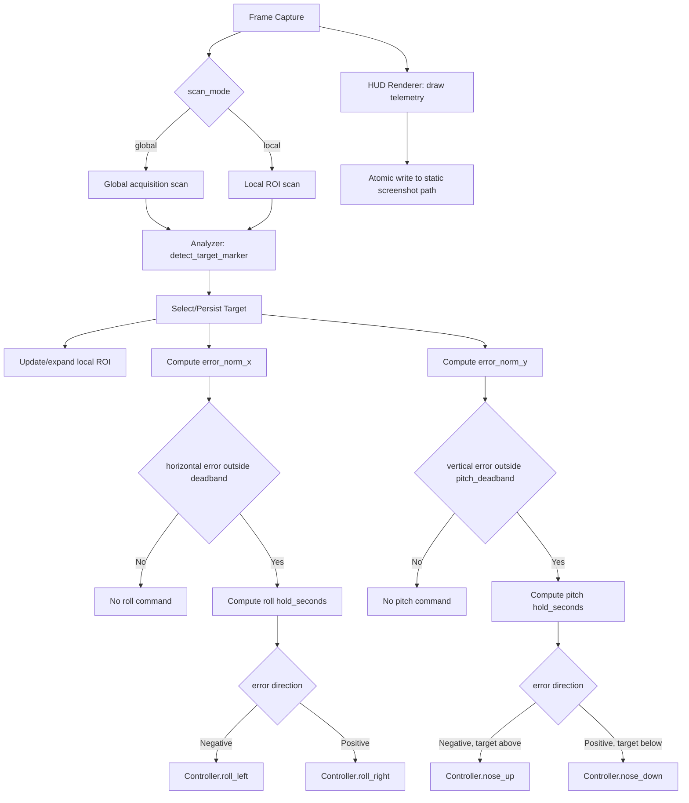
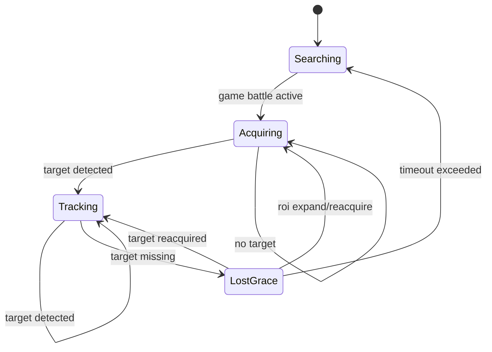

# Design 005 — Screen-Space Target Tracking and Nose Centering

| Status | Date       | Wingman Version |
|--------|------------|-----------------|
| Draft  | 2026-06-26 | 1.6.22          |

## Overview

This HLDD defines a closed-loop target tracking capability for J-20 attack behavior:

- detect a moving target marker in the HUD,
- estimate its position relative to screen center, both horizontally and vertically,
- apply roll input (`ROLL_LEFT_KEY` / `ROLL_RIGHT_KEY`) to close the horizontal error and pitch
  input (`NOSE_UP_KEY` / `NOSE_DOWN_KEY`) to close the vertical error, until the target is centered
  on both axes.

Unlike quadrant-only logic, this design uses continuous screen-space error and a feedback controller.

**Revision note (2026-09-21):** this design was originally roll-only, with pitch explicitly
out of scope (see the superseded Non-Goal text preserved as a comment below) and delegated to a
future consumer (HLDD-011's planned `BoresightEngage`). Operator direction: fold pitch into this
design directly — the tracker should be able to command "any flight control key," not just roll —
since the underlying goal (steer the nose onto whichever enemy is nearest screen center) is
inherently two-axis: the ALTITUDE_SPEED.png reference frame (Selection Hardening, below) shows a
target that is both left *and* above center, which a roll-only controller cannot close. See Two-Axis
Rollout (below) for how this is being validated, and Open Question 7 for the resulting overlap with
HLDD-011 that this change surfaces and does not itself resolve.

---

## Problem Statement

Current behavior can detect enemy presence and perform coarse directional responses, but it does not maintain continuous alignment with a moving target on-screen, and — before this revision — could only ever correct in one axis.

Desired behavior:

- if target drifts left of screen center, roll left,
- if target drifts right of screen center, roll right,
- if target drifts above screen center, pitch up,
- if target drifts below screen center, pitch down,
- stop correcting inside a center deadband, independently per axis,
- keep tracking as target moves frame-to-frame.

---

## Goals

1. Track one target marker continuously in screen space.
2. Convert target position into normalized horizontal **and vertical** error signals.
3. Apply stable, non-jittery roll **and pitch** correction using existing controller key helpers.
4. Respect existing safety and manual-takeover constraints.
5. Provide low-overhead single-window visual telemetry via periodic annotated screenshots.
6. Gate the new pitch axis independently from the already-validated roll axis, so extending this
   design cannot regress roll's own live-validation status (see Two-Axis Rollout, below).

## Non-Goals

1. Full 3D interception guidance (lead prediction, closing-rate compensation). Screen-space
   centering on both axes is not intercept geometry.
2. **Superseded 2026-09-21 — kept for history, not current guidance:** ~~Pitch/yaw control loops.
   Still true for *this* design — the roll controller stays roll-only. Where a consumer needs pitch
   alongside it (ADR 136's dive-and-track mode, HLDD-011's future `BoresightEngage`), pitch is driven
   by a separate, already-existing primitive (`eject_and_dive`'s `NOSE_DOWN` impulse rotation, ADR
   069) called alongside this tracker's roll controller, not folded into it.~~ Replaced by: this
   design now owns a pitch channel directly (Functional Design 5, below) — see the Revision note
   above for why, and Safety and Gating Rules for the one place the old separation still holds by
   necessity (the ADR 136 heatdive consumer, which must keep using the dive's own `NOSE_DOWN`
   primitive for pitch and must not also invoke this design's new pitch channel — two independent
   writers on the same key during the same dive is a correctness hazard, not a style choice; see
   below).
3. A symmetric yaw axis. `YAW_LEFT` (`wingman/keybindings.py:21`, ADR 070) is a one-directional
   rudder kick already owned by `MissileEvade`'s break-turn, with no `YAW_RIGHT` counterpart to pair
   it with — there is no continuous, bidirectional yaw control surface for this design to drive even
   if it wanted to.
4. Multi-target tactical prioritization beyond single-target lock persistence.

---

## Functional Design

### 1. Target Sensing

Source regions (two-phase):

1. **Global acquisition region**: `GAME_BATTLE`-anchored scan area using ADR023-style percentage coordinates and relative text offsets.
2. **Local tracking ROI**: a smaller dynamic window around the locked target, updated every cycle.

Acquisition to tracking flow:

1. Start in global acquisition mode to find an initial target marker/text anchor.
2. After lock, initialize local ROI centered on detected target location.
3. On each scan, compute new position from updated relative text location inside local ROI.
4. Expand ROI or fall back to global acquisition if confidence drops or target exits ROI bounds.

Marker extraction:

- HSV filter for target marker colors.
- Prefer locked-target color if available (red), fallback to non-locked target color (green).
- Extract contour centroids.

#### Target marker visual characteristics

From live gameplay frames (`P2_050_RESPAWN_CLEAR_HEALTH_ALIVE_MISSILES_4.png` and related):

- **Non-locked enemy marker**: tall, narrow, bright-green vertical bar. Typically 3–6% of frame height,
  width 1–4 px. One bar per visible enemy. Multiple bars present simultaneously at varying
  distances (near bars are taller; far bars are shorter and may resolve to near-point blobs).
- **Locked-target marker**: same vertical-bar shape, color shifts toward red/orange.
  When locked the dashed-circle reticle (see below) also appears.
- **Lock-on reticle**: a dashed white/green circle that tracks the locked target independently
  of the bar. The reticle is a separate HUD element — it is **not** the target marker and should
  not be used as the centroid source. Track the bar, not the reticle.
- **Yellow proximity dot**: a small solid yellow marker appears below/near the reticle when an
  enemy is very close (< ~500m). Can be used as a high-confidence "close target" signal.
- **Blue edge indicators**: thin blue horizontal lines at screen edges indicate enemies outside
  the FOV. Not useful for screen-space tracking but signal that reacquire should be attempted.

**Reference frame for the centrality principle** (`test_screenshots/ALTITUDE_SPEED.png`, 1920x1200):
captured at match end (`MATCH OVER` banner), so it shows the post-match nametag/health-bar overlay,
not the tall-bar marker system described above — it is not itself a frame the live tracker consumes.
It is kept here because it states this design's own ranking goal in the clearest available terms: of
the two visible contacts, `[TIG] ManuTheRed`'s Su-25 (0.25km, rendered roughly 250px left and 45px
above frame center) sits far closer to center than `[SD] demonslayer`'s F-14 (1.3km, rendered at the
right-edge indicator rail, 330-770px off-center depending on which of its two rendered elements is
measured). A tracker faithful to this design's selection goal should prefer the Su-25. See Selection
Hardening (below) for a code-level gap between that goal and the current implementation that this
frame motivated flagging.

Contour selection implications:
- Contour aspect ratio filter (tall/thin) eliminates the dashed circle and HUD noise.
  A contour with height >= 3x width and minimum area of 12 px² is characteristic of the bar.
- The nearest (tallest) bar is usually the highest-priority target. Nearest-to-last-centroid
  policy handles the case where multiple bars are present.

#### Respawn recovery

After a `respawn_detected` event (from `MissionStatsTracker`), the tracking state machine
must return to `Acquiring` regardless of prior state. The respawn blank-screen interval
(typically 2–4 s) means the local ROI will see no markers; this must not trigger a permanent
lost-target state. The `lost_timeout_sec` grace window should be long enough to survive the
respawn blanking without requiring a tuning change. The `Searching → Acquiring` transition
is gated on `GAME_BATTLE` being active, which handles respawn automatically as long as the
FSM is still in `GAME_BATTLE` throughout.

Relative-anchor method (ADR023-aligned):

- define crop bounds as percentages of `GAME_BATTLE` frame.
- define target text/marker expected location relative to the crop origin.
- track movement by comparing previous and current relative anchor coordinates.
- preserve screen-size independence by keeping all config in normalized coordinates.

Output per frame:

- `visible: bool`
- `centroid_x_px: float | None`
- `confidence: float` (optional heuristic from contour size/shape)
- `scan_mode: global | local`
- `roi_rect_px: [x, y, w, h] | None`

### 2. Target Selection and Persistence

When multiple centroids are present:

1. Prefer red target marker set over green marker set.
2. Pick centroid closest to previous tracked centroid (`last_x`) for temporal consistency.
3. If no previous target, pick centroid closest to crop center.

**Known gap (2026-09-21, see Selection Hardening below):** rule 1 is implemented as a mask-level
switch (`TargetTracker._detect_targets`, `wingman/tracker.py:317`), not a per-candidate tie-break —
any red pixel anywhere in the acquisition crop discards the *entire* green candidate set before rules
2/3 ever run. A locked contact far from center, or even at the frame edge, currently always outranks
an unlocked contact dead-center. Rules 2/3 only ever choose among candidates of whichever single color
survived rule 1, never across colors. Also worth stating plainly: "closest" in rules 2/3 is horizontal
pixel distance only (`abs(cx - ref)`, `wingman/tracker.py:339`), never full 2D distance to center —
consistent with this design's roll-only Non-Goal 2, but easy to misjudge from a screenshot where the
eye reads 2D closeness. Not yet changed — see the phased validation plan below for why.

Lost-target behavior:

- keep last target for `lost_timeout_sec` (short grace window),
- if not reacquired within timeout, clear tracking state.

### 3. Error Signals

Horizontal and vertical error are each measured relative to active scan center, independently:

- `error_px_x = target_x - center_x`
- `error_norm_x = error_px_x / (active_width / 2)`
- `error_px_y = target_y - center_y`
- `error_norm_y = error_px_y / (active_height / 2)`

Where:

- `error_norm_x < 0` means target is left of center, `> 0` means right, `= 0` means centered
  (this is the pre-2026-09-21 `error_norm`, unrenamed at the call sites that only ever wanted
  horizontal — `error_norm_x` is additive, not a breaking rename).
- `error_norm_y < 0` means target is above center, `> 0` means below, `= 0` means centered — sign
  follows screen-pixel-y convention (down is positive), matching how `centroid_y` already reports
  position (`wingman/tracker.py`'s `update()`).

`error_norm_y` is new: `centroid_y` was already computed and returned by `TargetTracker.update()`
(`wingman/tracker.py:198`) for local-ROI centering, but nothing before this revision turned it into
a control signal. No new sensing work is required for this — only the arithmetic above and a
second controller to act on it.

### 4. Roll Controller (horizontal axis)

Use proportional control with deadband and clamped hold duration:

- if `abs(error_norm_x) <= deadband`: no roll,
- else compute `hold = clamp(kp * abs(error_norm_x), min_hold, max_hold)`.

Actuation mapping:

- `error_norm_x < -deadband` -> `roll_left(hold_seconds=hold)`
- `error_norm_x > +deadband` -> `roll_right(hold_seconds=hold)`

Rate limiting:

- enforce `command_cooldown_sec` between roll commands.

This axis is unchanged by this revision — same law, same config keys, same
`Controller.orient_nose_to_target()` entry point. It is the axis with a live-validated track record
(ADR 136 D1-D3, D5); the pitch axis added below inherits its shape but not its validation status.

### 5. Pitch Controller (vertical axis, new 2026-09-21)

Identical control law, independent instance, independent tuning — this is a second copy of the
proportional-with-deadband controller, not a shared one, for the same reason `_actuate_seek_center`
(HLDD 013) carries its own commit/release state rather than sharing `EngageNavigator`'s: roll and
pitch dynamics are not required to share a gain just because the math is the same shape.

- if `abs(error_norm_y) <= pitch_deadband`: no pitch input,
- else compute `pitch_hold = clamp(pitch_kp * abs(error_norm_y), pitch_min_hold, pitch_max_hold)`.

Actuation mapping:

- `error_norm_y < -pitch_deadband` -> `nose_up(hold_seconds=pitch_hold)` (target above center)
- `error_norm_y > +pitch_deadband` -> `nose_down(hold_seconds=pitch_hold)` (target below center)

Rate limiting:

- enforce `pitch_command_cooldown_sec` between pitch commands — tracked independently from the roll
  axis's own `_last_orient_ts`, so a roll command in flight never delays a pitch command or vice
  versa (the two axes are commanded via different keys and can overlap in real time; the game
  accepts simultaneous key holds on independent controls, same as a human player holding two flight
  keys at once).

**`nose_up`/`nose_down` need one change to be usable here.** Both currently take only
`hold_seconds`/`block` (`controller.py:1177-1193`) — neither has the `ignore_cancel` parameter
`roll_left`/`roll_right`/`fire_active_weapon`/`switch_weapon`/`orient_nose_to_target` already gained
under ADR 136, for the exact reason ADR 136 documents: a caller running after
`self._mission_cancel` is already set for the call's duration (as any eject-adjacent caller would
be) gets its hold cut to near-zero on the first cancellation poll. Since this design's own ambient
path runs in `GAME_BATTLE` with `_mission_cancel` *not* pre-set, `ignore_cancel` defaults `False`
and changes nothing for that caller — the parameter only matters to a future caller inside an
already-cancelled sequence, and per Safety and Gating Rules (below) no such caller exists yet for
this axis.

A new `Controller.orient_pitch_to_target(error_norm_y, ...)` mirrors `orient_nose_to_target`'s
signature exactly (`deadband` → `pitch_deadband`, `kp` → `pitch_kp`, etc.), rather than overloading
`orient_nose_to_target` itself with a second error argument — keeping the two call sites independent
means either axis can be gated, tuned, or disabled without touching the other's signature or its
existing call sites (`_actuate_engage`, ADR 136's heatdive loop).

---

## Runtime Architecture



Roll and pitch are drawn as two independent branches off the same selected target, deliberately —
they share sensing (one `SEL` box) but not actuation gating, cooldown state, or config, matching
Functional Design 4/5's "independent instance, independent tuning" framing above.

Integration points:

- Analyzer: new method returns tracking observation and normalized error.
- Main loop: calls tracking update in `GAME_BATTLE` only.
- Controller: add a thin `orient_nose_to_target(error_norm)` helper that translates error to `roll_left` / `roll_right` calls.
- Debug HUD: render an annotated frame every `hud.interval_sec` and overwrite one static file watched by VS Code/image preview.
- Tracking mode manager: switches between global acquisition and local ROI scan.

---

## Visualization Strategy (Primary)

To avoid split attention across game + terminal + secondary debug windows, this design
uses a **single static filename screenshot HUD** as the primary runtime visualization.

### Rationale

1. No in-game overlay injection and no anti-cheat-sensitive drawing path.
2. No extra live debug window that steals focus.
3. Persistent telemetry frame that does not scroll away like terminal logs.
4. Predictable resource usage at fixed update intervals (default 1.0s).

### Rendering model

1. Capture frame as usual.
2. Draw telemetry text/graphics directly onto a copy of that frame.
3. Write to a temp file, then atomically replace the static output filename.

Atomic write sequence:

- `live_hud.tmp.png` write complete
- `os.replace(live_hud.tmp.png, live_hud.png)`

This prevents preview tools from showing partially-written images.

### Minimum telemetry payload

1. Timestamp and loop FPS/interval.
2. FSM state (`GAME_LOBBY`, `GAME_BATTLE`, etc.).
3. Tracking values: `visible`, `centroid_x`, `error_norm`, `last_roll_cmd`.
4. Combat counters: health, missiles, flares (when available).
5. OCR timings/cycle metrics relevant to tracking responsiveness.

### Logging policy

The screenshot HUD becomes the primary high-frequency telemetry surface.

- Keep terminal logs for warnings/errors and significant state transitions.
- Reduce repetitive per-cycle info logs that are now visible on the HUD frame.

---

## State Model



State meanings:

- `Searching`: no active target.
- `Acquiring`: scanning global battle region for first lock.
- `Tracking`: active target and feedback control enabled.
- `LostGrace`: short persistence window to prevent oscillation on brief occlusion.

---

## Safety and Gating Rules

This section originally described one combined gate on the whole tracking
capability. As of 2026-09-09 the implementation (already live in
`wingman/tick_handlers.py`'s `TrackingHudHandler`, ahead of this document —
see the note at the top of Implementation Plan) splits **sensing** from
**actuation**, and the two are gated differently:

- **Sensing** (`TargetTracker.update(frame)`, HUD rendering — no key press)
  runs in `GAME_BATTLE` **and** `GAME_BATTLE_MANUAL`. This is deliberate:
  sensing quality can be validated live while an operator flies manually and
  deliberately points at targets, with zero actuation risk — exactly the
  "Live dry-run logging mode" this document's own Validation Strategy step 2
  already called for, now generalized to run continuously rather than only
  during automated flight. A config flag, `tracking.actuate` (default
  `false`), gates whether detections are ever turned into roll commands at
  all — even in `GAME_BATTLE` — so enabling `tracking.enabled` for the first
  time can never silently start rolling the aircraft.
- **Actuation** (`Controller.orient_nose_to_target`) is suppressed unless
  *all* of the following hold:
  1. `tracking.actuate` is `true`.
  2. game state is `GAME_BATTLE` (never `GAME_BATTLE_MANUAL`).
  3. mission is running (`Controller.is_mission_running()`).
  4. target visible and lost timeout not exceeded.
  5. optional altitude guard passes (if altitude source is available).

Manual takeover always wins over autonomous roll correction — rule 2 above
is absolute, not merely a default.

**This split exists for a second consumer, not only for this document's own
validation.** ADR 136 (`docs/adr/136-heatseeker-dive-invokable-mode.md`)
calls `TargetTracker.update()` and `Controller.orient_nose_to_target()`
directly from inside `eject_and_dive`'s existing closed-loop thread, gated
by its own new flag (`telemetry.eject_closed_loop.heatdive_enabled`, default
`false`, currently shipped `true` — `wingman/config.yaml:845` — i.e. this is
the one consumer of this design's roll channel already actuating live today)
rather than a separate mode or mission. That caller does **not** go through
`tracking.enabled` / `tracking.actuate` at all — those flags gate only the
ambient, tick-driven path described in this document. Manual-takeover
cancellation is inherited for free: `eject_and_dive` is already covered by
`release_for_manual_takeover()`/`cancel_mission()`, and ADR 136's addition
shares `eject_and_dive`'s own `self._eject_stop` event as its stop signal
rather than adding a second one.

### Pitch actuation gate (new 2026-09-21) — independent of, and stricter than, roll's

The pitch channel (Functional Design 5, above) is gated by its own flag,
`tracking.actuate_pitch` (default `false`), checked in addition to every
existing roll gate above, not instead of them — enabling pitch can never
imply roll is also enabled, and vice versa. Rationale for a separate flag
rather than reusing `tracking.actuate`: roll already has a live-validated
track record (ADR 136 D1-D3, D5); pitch has none. Folding pitch under the
same flag would mean the *next* person who flips `tracking.actuate: true`
for roll — already-justified by roll's own history — silently also gets an
entirely unvalidated pitch channel with no independent decision point. See
Two-Axis Rollout (below) for the shadow plan this flag exists to support.

**The ADR 136 heatdive consumer must never set `tracking.actuate_pitch` —
this is a hard exclusion, not a default to revisit.** `eject_and_dive`'s own
`_eject_descent_control` (ADR 069) already holds exclusive ownership of
`NOSE_DOWN_KEY`/`NOSE_UP_KEY` for the whole dive: it alternates bounded
`NOSE_DOWN` pulses with a hands-off ballistic phase to reach and hold a
target dive angle, and ADR 058's dive-confirmation criterion depends on
`_eject_nose_held_total_s`, a *cumulative* real-hold-time measurement
(`controller.py:1582-1610`) that assumes it is the only thing pressing that
key. A second, uncoordinated writer — this design's new pitch channel,
correcting toward a target's vertical position rather than toward a dive
angle — pressing or releasing `NOSE_DOWN_KEY`/`NOSE_UP_KEY` mid-dive would:
corrupt that cumulative-hold accounting (a release this design issues while
the descent controller believes the key is still down desyncs
`_eject_nose_down_since`), fight the descent controller's own attitude
target with an unrelated one (aim vs. dive angle are different objectives
that do not average safely), and reproduce exactly the "second,
uncoordinated writer on an axis" failure class this codebase has already
paid to learn about on the roll axis (ADR 110's `TACTIC_CLIMB` loitering
fix, HLDD 013's explicit `survival_hold` exclusion citing that same
incident). ADR 136's own Non-Goal 2 already states pitch stays on
`eject_and_dive`'s existing `NOSE_DOWN` primitive "unmodified" — this
design's pitch addition does not change that; it only adds a channel for a
*different* consumer (the ambient path) to use. Enforcement: this design's
own actuation gate list for pitch above (game state `GAME_BATTLE`, never
inside an eject sequence) already excludes the heatdive caller by
construction, since `eject_and_dive` runs after `cancel_mission()` and
outside the ambient tick loop entirely — no additional code guard is
required *if* `tracking.actuate_pitch` is never wired into ADR 136's own
call sites, which is the discipline this note exists to name explicitly, not
something the config schema can enforce by itself.

---

## Configuration Additions

```yaml
tracking:
  enabled: false
  crop_name: ENEMY_CLOSE_BY
  acquisition_region_basis: GAME_BATTLE
  acquisition_region_pct: [0.20, 0.18, 0.60, 0.50]  # x, y, w, h normalized
  use_relative_anchor: true
  anchor_text_offset_pct: [0.50, 0.50]
  actuate: false               # roll axis — live-validated (ADR 136), still shadow by default here
  deadband: 0.05
  kp: 0.30
  min_hold_sec: 0.08
  max_hold_sec: 0.35
  command_cooldown_sec: 0.15
  # Pitch axis (new 2026-09-21) — own flag, own gains. Deliberately NOT reusing
  # tracking.actuate/deadband/kp/etc: pitch has zero live-validation history and
  # must be independently enable-able and independently tunable. Never wired
  # into ADR 136's heatdive consumer — see Safety and Gating Rules above.
  actuate_pitch: false
  pitch_deadband: 0.05
  pitch_kp: 0.30
  pitch_min_hold_sec: 0.08
  pitch_max_hold_sec: 0.35
  pitch_command_cooldown_sec: 0.15
  lost_timeout_sec: 0.70
  prefer_red_lock: true
  local_roi_enabled: true
  local_roi_scale: 0.22
  local_roi_min_px: [140, 90]
  local_roi_expand_factor: 1.25
  local_roi_max_scale: 0.45
  local_roi_reacquire_cycles: 3

hud:
  enabled: true
  output_path: tests/test-output/live_hud.png
  interval_sec: 1.0
  show_crops: true
  jpeg_quality: 90
```

Optional HSV tuning block (if separated from existing enemy HSV keys):

```yaml
tracking_hsv:
  # Locked target bar (red/orange).  Wrap-around hue: also check [170,150,150]-[179,255,255].
  red_lower: [0, 150, 150]
  red_upper: [10, 255, 255]
  # Non-locked enemy bar: saturated bright green observed in live frames.
  green_lower: [45, 150, 150]
  green_upper: [75, 255, 255]
  # Yellow close-proximity dot (bonus signal, not required for tracking).
  yellow_lower: [20, 150, 150]
  yellow_upper: [35, 255, 255]
  # Contour aspect ratio filter: reject blobs that aren't taller than wide.
  # Prevents reticle circle and HUD noise from matching as target markers.
  min_contour_area: 12
  min_aspect_ratio: 2.5   # height / width >= 2.5 for a valid target bar
```

Notes on HSV values:
- OpenCV HSV uses H: 0–179, S: 0–255, V: 0–255.
- The bright green bars in live frames land around H: 50–70, S: 180–255, V: 180–255.
- The `green_lower/upper` range above tightens the original draft (was `[40,120,120]`–`[80,255,255]`)
  to reduce false positives from green HUD text and foliage in game backgrounds.
- The `min_aspect_ratio` filter is new: contour height/width >= 2.5 accepts the tall bar,
  rejects the roughly-circular lock-on reticle and small background blobs.

---

## Implementation Plan

**Implementation status (2026-09-09):** this plan is implemented, not
speculative — `wingman/tracker.py`'s `TargetTracker` and
`TrackingHudHandler` in `wingman/tick_handlers.py` exist and are wired into
the main loop today, gated by `tracking.enabled` (sensing) and
`tracking.actuate` (actuation, see Safety and Gating Rules above). The
Status table above still says `Draft` because the live-validation steps
under Validation Strategy have not been run against a real match yet —
"implemented" and "validated" are tracked separately in this document.

1. Analyzer
- add `detect_enemy_target_x(frame)` returning centroid and error.
- add short-lived tracking state (`last_x`, `last_seen_ts`) with lock protection.
- add `scan_mode` and dynamic ROI state (`roi_rect`, `miss_count`).
- implement ADR023-style relative anchor translation from `GAME_BATTLE` basis.

2. Controller
- add `orient_nose_to_target(error_norm: float)` helper.
- reuse `roll_left` / `roll_right` and enforce cooldown.

3. Main loop
- invoke tracking logic in `GAME_BATTLE` path.
- guard with manual mode and mission-running checks.
- start with global acquisition, then switch to local ROI scan after lock.
- fall back to global acquisition when local ROI confidence drops.

4. HUD renderer
- add periodic annotated screenshot writer (default 1.0s cadence).
- implement temp-write + atomic replace for static path output.
- include tracking/controller/ocr metrics overlays.

5. Tests
- unit tests for centroid selection and error normalization.
- unit tests for deadband and hold clamping.
- integration test with synthetic moving target across frames.
- unit test for atomic HUD writer path and filename replace behavior.
- unit tests for normalized acquisition-region to pixel-rect conversion.
- unit tests for local ROI expansion/fallback thresholds.
- regression test on `P2_050_RESPAWN_CLEAR_HEALTH_ALIVE_MISSILES_4.png`: verify marker detected,
  reticle circle rejected by aspect-ratio filter, centroid outside reticle region.

---

## Validation Strategy

0. Reference frame regression (static, fast):
- use `test_screenshots/integration_test/P2_050_RESPAWN_CLEAR_HEALTH_ALIVE_MISSILES_4.png`
  as a known-good GAME_BATTLE respawn-cleared frame.
- verify `detect_enemy_target_x()` returns at least one centroid with confidence >= threshold.
- verify no centroid falls inside the lock-on reticle region (approx center-left of frame).
- verify aspect-ratio filter rejects the reticle circle and accepts the tall green bars.

1. Synthetic test frames:
- move marker from far-left -> center -> far-right,
- verify roll direction changes at zero crossing,
- verify no commands inside deadband.

1b. Acquisition/local-scan switching:
- detect target in global region and confirm mode switches to local ROI.
- move target gradually and verify local ROI follows without full-frame OCR.
- force target outside local ROI and confirm bounded expansion then global fallback.

2. Live dry-run logging mode:
- compute and log commands without sending key presses,
- tune `deadband`, `kp`, and hold bounds.

2b. Live HUD mode (recommended default):
- open `tests/test-output/live_hud.png` in VS Code/image preview,
- verify frame updates at configured interval,
- validate that telemetry values match flight behavior.

3. Controlled live flight:
- enable tracking with conservative bounds,
- verify reduced oscillation and improved center hold.

---

## Risks and Mitigations

| Risk | Impact | Mitigation |
|------|--------|------------|
| Marker jitter/noise | Roll thrash | EMA smoothing + deadband + cooldown |
| Wrong target selected | Misalignment | lock-priority + nearest-to-last-target policy |
| Lost target during clutter | Unstable switching | lost-grace timeout before reset |
| Over-aggressive gains | Oscillation | clamp hold and tune `kp` incrementally |
| Conflict with manual input | Bad UX | hard gate on `GAME_BATTLE_MANUAL` |
| Local ROI too small | Target escape, reacquire churn | min ROI size + expansion ladder + periodic global fallback |

---

## Selection Hardening — Color-Class Priority vs. Centrality (2026-09-21)

### Finding

`TargetTracker._detect_targets` (`wingman/tracker.py:295-329`) does not rank red and green candidates
against each other — it excludes one color class entirely before ranking begins:

```python
mask = mask_red if (self._prefer_red and bool(np.any(mask_red))) else mask_green
```

If any red pixel exists anywhere in the acquisition crop, every green contour is dropped before
`_select_target` (`tracker.py:331-340`) ever runs. `_select_target` then ranks the survivors by
horizontal distance only — `abs(cx - ref)`, where `ref` is `self._last_x` once a target has ever been
locked, or the frame's horizontal center on first acquisition (`tracker.py:338-339`). Both of these
are correct in isolation and match this design's own stated rules (Target Selection and Persistence,
above) — the gap is that color (rule 1) is evaluated as a hard pre-filter, never as one input alongside
distance (rules 2/3). A locked contact anywhere in frame, including at the extreme edge, always
outranks every unlocked contact, however close to center, as long as it produces even one qualifying
red pixel.

`test_screenshots/ALTITUDE_SPEED.png` prompted flagging this: it isn't itself a frame the tracker
consumes (see the note under Target marker visual characteristics, above), but its layout is exactly
the shape that would trigger this gap in a live frame — a distant, edge-adjacent contact (F-14, this
document's stand-in for "reads as locked/red") next to a much closer, more central contact (Su-25,
"reads as unlocked/green"). No live capture has yet confirmed this actually firing during a real
heatdive — this is a code-reading finding, not a reproduced live bug.

### Why this matters now, not hypothetically

This design's own sensing/actuation split (Safety and Gating Rules, above) keeps the *ambient* path
inert by default (`tracking.enabled: false`, `tracking.actuate: false`, `wingman/config.yaml:749,757`).
But ADR 136's heatdive addition bypasses that gate entirely and is live today:
`telemetry.eject_closed_loop.heatdive_enabled: true` (`wingman/config.yaml:845`) means this exact
selection code already steers a real airframe on every missiles-empty eject. This is precisely the
"throwaway aircraft, already committed to crashing" moment identified as a safe place to extend
tracking — which is also, unavoidably, the one path where this selection code is not shadow-only
today. A hardening change here changes live behavior on the very next dive it ships in, unlike a
change to the ambient path (which would ship inert by default). That asymmetry is the reason for the
phased plan below rather than a direct fix.

### Phased Rollout — Shadow Session Validation

Matching this codebase's standing convention (ADR 070's missile-evade shadow trial, HLDD 013 Phase 1's
shadow-first bring-up, ADR 136 D4's own hard lesson from toggling a real key against an unverified
signal): no ranking change reaches the live heatdive path without a shadow session confirming it first.

**Phase 1 — measure, change nothing.** Add rationale logging to `_detect_targets`/`_select_target`:
whenever red pixels are present *and* at least one green contour would otherwise have qualified, log
the mask that won, the discarded green candidate(s)' position and horizontal distance from `ref`, and
the eventually-selected target's own distance from `ref` — rate-limited the same way ADR 117 D9's
`_blind_no_boundary_line_skips` logs (1st, 10th, 100th occurrence, then every 500th), not once per
qualifying tick. This is a pure logging addition — no behavior change, safe to ship immediately on the
already-live heatdive path, since it touches neither `mask` nor `_select_target`'s return value.
Purpose: learn, from real dive sessions, how often color-exclusion actually overrides a materially
more central or closer-to-last-position green candidate, and by how much — the Su-25/F-14 contrast is
a plausible shape, not yet a measured frequency.

**Phase 2 — shadow the candidate fix, still without acting on it.** Only if Phase 1's logs show the
gap firing often enough to matter: replace the hard mask exclusion with a single ranked candidate pool
(red and green contours merged, each carrying its color) and a bounded preference for red — e.g. red
wins ties within a configurable centrality tolerance, but a green candidate meaningfully closer to
`ref` still wins outright — gated behind a new flag defaulted `false` (e.g.
`tracking.ranked_lock_priority`, alongside the existing `tracking`/`tracking_hsv` blocks). While the
flag is `false`, run the new ranking function in parallel with the existing one and log wherever they
would disagree (`"SELECT[shadow]: old=... new=... would change"`), without changing `_select_target`'s
actual return value — the same "compute both, log the difference, act on neither yet" shape Phase 1
already establishes, one level up.

**Phase 3 — enable live, on the heatdive path first.** Flip `tracking.ranked_lock_priority: true` only
after a live session's Phase 2 shadow log shows the new ranking agrees with the old one whenever they
would pick the same target, and demonstrably prefers the nearer/more-central candidate in every
disagreement case observed — the same bar ADR 136 D5 already set for its own fix ("live-measured...
not a guess"). Validate specifically through the heatdive path first, since it is the only consumer
currently actuating on this code at all; only extend to the ambient `tracking.enabled`/
`tracking.actuate` path afterward, once both the sensing-quality and the ranking-quality questions have
independent live evidence. Record the outcome as a dated revision inside ADR 136 (its heatdive
consumer owns the live-trial history for this code path), cross-referenced from here — not by
rewriting this section after the fact.

### Testing plan

- Unit: once Phase 2's ranked pool replaces the hard mask switch, `_detect_targets` returns the full
  merged, color-tagged candidate list; a synthetic frame with one red contour at the edge and one
  green contour at center exercises exactly the disagreement case this section exists to catch.
- Unit: with `tracking.ranked_lock_priority: false` (default), confirm the new ranking function's
  output is computed and logged but `_select_target`'s actual return value is provably unchanged from
  today's mask-switch behavior, across both the agreement and disagreement cases above.
- Shadow live trial (required before Phase 2 ships as anything but inert logging): one full session
  with real dives, reading the rate-limited Phase 1 log to answer "how often, and by how much" before
  writing Phase 2's ranking function at all — if the gap essentially never fires in practice, Phase 2
  may not be worth building.
- Live trial (required before Phase 3): compare selected-target identity and resulting roll direction,
  Phase 2 shadow log vs. actual `_select_target` output, across a full heatdive session, before
  flipping `tracking.ranked_lock_priority` to `true`.

---

## Two-Axis Rollout — Shadow Session Validation (2026-09-21)

Folding pitch into this design (see the Revision note under Overview) is a bigger behavioral change
than Selection Hardening above — it's a brand-new actuation axis with zero live history, added to a
design whose roll axis already has one (ADR 136 D1-D3, D5). It gets the same shadow-first treatment,
scoped to just this axis so roll's existing validated status is never put at risk by it.

**Phase 0 (today).** Roll axis: sensing live in `GAME_BATTLE`/`GAME_BATTLE_MANUAL`, actuation gated
by `tracking.actuate` (ambient, default `false`) and separately live via ADR 136's heatdive consumer
(`telemetry.eject_closed_loop.heatdive_enabled: true` today). Pitch axis: does not exist yet.

**Phase 1 — sense and log, actuate nothing.** Ship `error_norm_y` (Functional Design 3) and the
`orient_pitch_to_target` computation (Functional Design 5) with `tracking.actuate_pitch: false`. While
disabled, log what pitch command *would* fire — direction and hold-seconds — every qualifying tick,
rate-limited the same way HLDD 013 Phase 1 and Selection Hardening Phase 1 both already log (1st,
10th, 100th occurrence, then every 500th):

```python
logger.info("PITCH[shadow]: would %s hold=%.2fs err_y=%.2f (%d so far)",
            "nose_up" if error_norm_y < 0 else "nose_down", pitch_hold, error_norm_y,
            self._pitch_shadow_count)
```

This is pure sensing/logging — no key press, so it is safe to enable in the exact same sessions
already flying with `tracking.enabled: true` for horizontal shadow validation, at zero incremental
actuation risk. Purpose: confirm `centroid_y`/`error_norm_y` tracks real vertical target motion
sensibly (not just that the horizontal signal already does) before any key is ever pressed on this
axis.

**Phase 2 — controlled live flight, roll and pitch together, ambient path only.** Enable
`tracking.actuate_pitch: true` only after Phase 1's shadow log shows sensible vertical tracking,
and only ever on the ambient `tracking.enabled`/`tracking.actuate` path — never for the ADR 136
heatdive consumer (Safety and Gating Rules, above, is the hard rule; this phase does not revisit
it). Start with conservative gains (the defaults above are named guesses, same status as Selection
Hardening's `seek_center_*` starting values — the live trial corrects them, not this document).
Validate the same way Validation Strategy step 3 already validates roll: reduced oscillation,
improved two-axis center hold, no fighting between the two independent controllers (they should
never need to, since they act on different keys, but a live session is what actually confirms that
rather than the reasoning above).

**Phase 3 — revisit HLDD-011's `BoresightEngage` overlap.** HLDD-011's Refinement Backlog item 4 and
its `acs_mode.boresight.pitch_deadband`/`pitch_kp`/`pitch_min_hold_sec`/`pitch_max_hold_sec` config
(`docs/hldd/011-acs-mode-hldd.md:415-418`) were written on the premise that Design 005 stays
roll-only and `BoresightEngage`'s own `NoseTrack` state would add pitch itself. That premise no
longer holds once Phase 2 above ships. Once this design's pitch channel is live-validated,
`BoresightEngage.NoseTrack` should consume `TargetTracker`'s `error_norm_x`/`error_norm_y` and
`Controller.orient_nose_to_target`/`orient_pitch_to_target` directly instead of building a second,
parallel pitch loop — but that is HLDD-011's own document to update, not decided here (see Open
Question 7). Nothing in HLDD-011's separate concerns (lock cone, `ToneWait`/`LockConfirmed`, target
prioritization) depends on which document owns the pitch math, so this reconciliation is additive
cleanup, not a redesign of either document.

---

## Adaptive Optimization (Future, Non-V1)

This capability is a follow-on optimization phase and is **not required** for initial delivery.
V1 remains deterministic:

1. global acquire,
2. local ROI tracking,
3. bounded expansion and fallback ladder.

Scope for adaptive methods (contextual bandit or RL policy):

1. tune ROI size and expansion factor,
2. tune scan cadence and OCR refresh interval,
3. tune fallback thresholds (`miss_count`, confidence cutoffs).

Out of scope for adaptive methods in this document:

1. direct roll-key actuation decisions,
2. replacement of deterministic safety gates,
3. uncontrolled online exploration in live runs.

Readiness criteria before enabling adaptive policy experiments:

1. stable deterministic baseline metrics captured from live sessions,
2. replay harness with recorded frames and expected tracking outcomes,
3. objective score balancing center-hold quality vs OCR/compute cost,
4. guardrails that clamp policy outputs to safe parameter ranges.

Suggested reward/objective components for future work:

- positive: target visible persistence, lower `abs(error_norm)`, reduced reacquire events,
- negative: OCR runtime cost, command jitter, target-loss events.

---

## Open Questions

1. Should red lock be mandatory for control, or allow green fallback by default? See Selection
   Hardening (above) for a concrete related gap: today red lock isn't just preferred, it hard-excludes
   green candidates regardless of position.
2. Should tracking be active during all J-20 mission phases or only attack sub-phase?
3. Is altitude guard required in v1 or deferred behind a config flag?
4. Should target-tracking output feed future behavior-tree blackboard inputs directly?
5. Should adaptive optimization start as offline replay-only before any live tuning mode?
6. Should color priority (Selection Hardening, above) be capped to a maximum off-center/off-last-
   position distance, or dropped entirely in favor of ranking red and green candidates in one pool
   with only a soft tie-break preference for red? Deferred to that section's Phase 1 shadow log
   rather than decided here.
7. **Resolved 2026-09-21 (operator go-ahead).** Now that this design owns a pitch channel directly,
   HLDD-011's `BoresightEngage.NoseTrack` has been updated to consume it directly
   (`error_norm_x`/`error_norm_y`, `orient_nose_to_target`/`orient_pitch_to_target`) instead of
   building its own separate pitch loop — HLDD-011's `acs_mode.boresight.pitch_*` config keys were
   removed in the same pass; only `lock_cone_x`/`lock_cone_y` (its own concept) remain there. See
   `docs/hldd/011-acs-mode-hldd.md`'s Relationship table and Refinement Backlog item 4 for the
   reconciled text. Note this only settles *who owns the pitch math* — Two-Axis Rollout's own Phase
   1/2/3 live-validation sequence above is unaffected and still gates when pitch may actuate at all.

---

## Related Documents

- `docs/adr/027-j20-target-painting-mode.md`
- `docs/adr/028-enemy-quadrant-detection-and-nose-orientation.md`
- `docs/adr/069-eject-impulse-rotation-and-ballistic-descent.md` — the
  `NOSE_DOWN` pitch primitive `eject_and_dive`'s own descent control uses
  and continues to use exclusively during the dive, unmodified by this
  design's new pitch channel (see Safety and Gating Rules' pitch gate).
- `docs/adr/136-heatseeker-dive-invokable-mode.md` — second, direct
  consumer of this tracker's sensing and roll controller, outside the
  `tracking.enabled`/`tracking.actuate` ambient path (see Safety and
  Gating Rules); must never enable this design's pitch channel (same
  section).
- `docs/hldd/003-enemy-quadrant-detection-hldd.md`
- `docs/hldd/011-acs-mode-hldd.md` — planned, ahead of this revision, to add
  its own pitch channel on top of this design's then-roll-only sensing/roll
  core for `BoresightEngage.NoseTrack`. That premise is now stale (this
  design owns pitch directly as of 2026-09-21) — see Two-Axis Rollout Phase
  3 and Open Question 7 for the reconciliation this surfaces but does not
  itself make.
- `docs/hldd/013-minimap-center-seeking-navigation-hldd.md` — source of the shadow-first,
  phase-gated rollout style Selection Hardening (above) follows.
- `wingman/tracker.py` — `TargetTracker._detect_targets`/`_select_target`, the color-exclusion-
  before-centrality gap Selection Hardening documents.
- `test_screenshots/ALTITUDE_SPEED.png` — reference frame motivating Selection Hardening (see
  Target marker visual characteristics and Selection Hardening, above); a post-match nametag
  overlay, not a frame the live tracker consumes.
- `docs/architecture.md`
