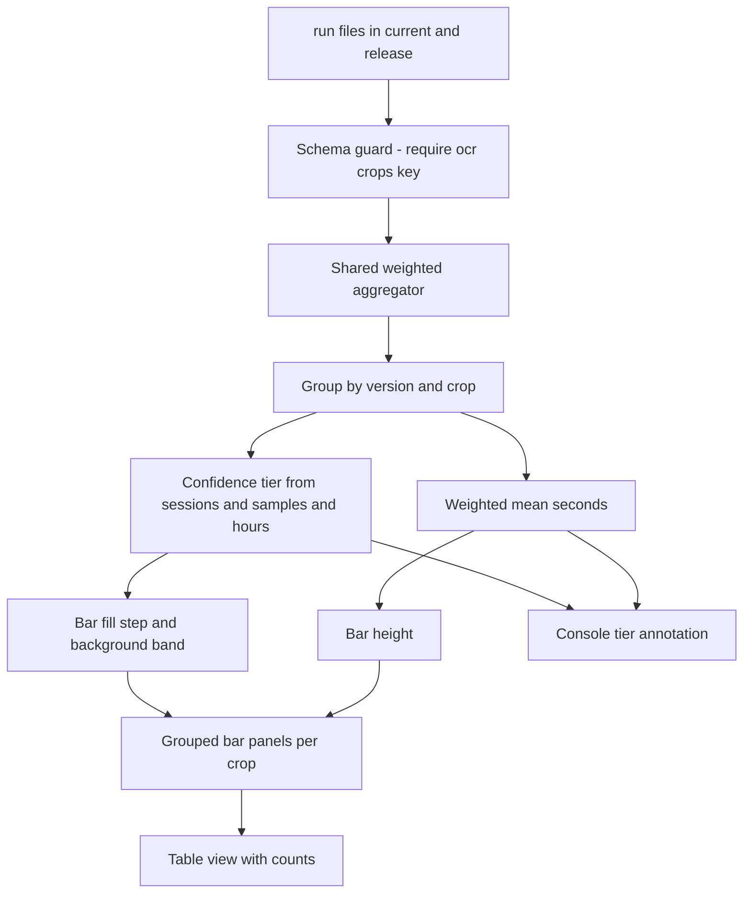

# Design 006 — Performance Confidence Visualization

| Status | Date       | Wingman Version |
|--------|------------|-----------------|
| Draft  | 2026-08-20 | 1.8.4           |

## Context

The end-of-session performance report compares the current session against the
accumulated period, and the period against the release baseline. Both
comparisons print a percentage delta of two means and a verdict
(`⚠️ REGRESSION` / `✅ IMPROVEMENT`). A live session on 2026-08-20 produced this,
verbatim:

```
[PERIOD vs RELEASE (all + version baseline v1.8.3) | current: 49 sessions 50532 cycles
                                                   | release-all: 851 sessions 414920 cycles
                                                   | release-v1.8.3: 5 sessions 2649 cycles]
  incoming   0.61s  0.43s  0.24s  +43%↑  +155%↑  ⚠️ REGRESSION
```

The `+155%` against v1.8.3 rests on 5 sessions. The `+43%` against all releases
rests on a session count that is itself wrong. Nothing in the output conveys
either fact, and no chart encodes sample size at all.

The suspicion motivating this design — that the comparison ignores dataset size
and offers no way to see it — is correct, and the investigation found the
problem is broader than presentation.

## Current Behavior

### Sample size is not weighted into any verdict

`_emit_comparison()` (`wingman/performance.py:308`) computes a percentage delta
of two means and thresholds it at `threshold_pct` (20). There is no variance,
standard deviation, confidence interval, or significance test anywhere in the
repository. "Confidence" means only a raw sample-count threshold.

The two comparison blocks apply that threshold inconsistently:

| Block | Sample gate |
|-------|-------------|
| Session vs current period (`performance.py:325-346`) | **None at all** — a 27-cycle session is verdicted against the period identically to a 5000-cycle one |
| Period vs release (`performance.py:414-438`) | `min_crop_samples` (1000) per crop, annotated `low confidence(v n=X/Y)` |

The block with no gate is the one printed every session.

### Session counts are inflated by 45 percent

`_aggregate_folder` globs `run_*.json` (`performance.py:77`). That pattern also
matches `run_<id>_stats.json`, the mission-stats files written by
`wingman/mission_stats.py:495`, which have a different schema — no `ocr_crops`,
no `version` field. They are counted by `len(run_data)` but contribute zero
samples.

Measured on 2026-08-20:

| Folder | Files matching `run_*.json` | Mission-stats files | Real performance runs |
|--------|------------------------------|---------------------|------------------------|
| `docs/performance/release/` | 851 | 266 | **585** |
| `docs/performance/current/` | 50 | 19 | **31** |

The "851 sessions" in the log header is really 585. The same glob appears in
`tests/runtime_performance_tracking.py:290`, so the generated CSV carries a
phantom first row, and the `min_sessions` gate is evaluated against an inflated
count.

### Per-version depth varies by two orders of magnitude, invisibly

Real per-version totals in the release baseline:

| Version | Sessions | Incoming cycles |
|---------|----------|-----------------|
| 1.7.1 | 66 | 48819 |
| 1.7.2 | 32 | 29903 |
| 1.8.2 | 25 | 31649 |
| 1.8.3 | 5 | 2649 |
| 1.8.1 | **1** | **373** |

The existing chart (`runtime_performance_tracking.py:252-274`) plots every
version as one marker on a line, identical in weight. A version backed by a
single 373-cycle session is drawn exactly like one backed by 66 sessions.
Sample counts appear only in hover text. Across 29 versions this reads as a
trend line when much of it is noise.

### Secondary defects found

- **Percentiles are not aggregated.** `p50/p95/p99` in a period aggregate are
  copied verbatim from the most recently named file (`performance.py:84`,
  `104-106`). The printed `p95` is one session's p95, not the period's.
- **The version baseline is arbitrary.** `rel-v` filters on
  `release_agg_all["version"]` (`performance.py:374`), which is the `version`
  field of the lexicographically last filename — not the running build. A
  mission-stats file sorting last yields `"?"`.
- **`telemetry` is absent from all charts.** The chart script's `CROPS` tuple
  (`runtime_performance_tracking.py:24`) omits it, though `performance.py:11`
  includes it.
- **`period_n` is one crop.** The "cycles" figure gating everything is the
  `incoming` crop's sample count alone (`performance.py:126`).
- **Two independent implementations** of the same weighted mean exist
  (`performance.py:88-99` and `runtime_performance_tracking.py:68-72`).
- **Thresholds are duplicated, not shared.** The chart script hard-codes 5/1000
  (`runtime_performance_tracking.py:191-199`) rather than reading config;
  `min_crop_samples` and `min_reaction_events` are not in `config.yaml` at all.

## Goals

1. Make dataset size a visible property of every comparison, in both the chart
   and the console report.
2. Correct the session and cycle counts the confidence signal derives from.
3. Let a reader distinguish "this version is genuinely slower" from "this
   version has barely any data" at a glance.

## Non-Goals

- Statistical significance testing. Adding confidence intervals is a larger
  change with its own design; this work makes sample size *legible* first. The
  data model below is deliberately shaped so intervals can be added later
  without reworking the visual encoding.
- Changing any threshold value or regression verdict logic.
- Re-baselining the existing release history.

## Design

### Layer 1 — Data integrity (prerequisite)

The confidence encoding is only meaningful if the counts feeding it are real.

- **Schema-guard the loader.** Replace the `run_*.json` glob filter with an
  explicit content check: a file counts as a performance run only if it parses
  and contains an `ocr_crops` key. This catches mission-stats files by shape
  rather than by filename, so a future sibling artifact cannot reintroduce the
  bug. Applied in both `_aggregate_folder` and the chart script.
- **Single shared aggregator.** Promote one weighted-mean implementation to a
  module both callers import, removing the duplicate.
- **Derive session duration.** `end_ts - start_ts` is present in every run file
  and currently unused. Exposing it enables hours-run as a confidence input.

### Layer 2 — Confidence model

Confidence is computed per crop, per version, from three inputs already present
in the data:

| Input | Source |
|-------|--------|
| Session count | number of schema-valid run files for that version |
| Sample count | sum of `ocr_crops.<crop>.n` across those files |
| Hours run | sum of `end_ts - start_ts` across those files |

These map to four ordered tiers. Boundaries derive from the existing gates
(`min_sessions: 5`, `min_cycles: 1000`) so the visualization agrees with the
verdict logic rather than inventing a second standard:

| Tier | Meaning | Condition |
|------|---------|-----------|
| T0 | Below gate | fewer than 5 sessions or fewer than 1000 samples |
| T1 | Thin | meets the gate, under 3x it |
| T2 | Adequate | 3x to 10x the gate |
| T3 | Deep | over 10x the gate |

Tier is a property of the *data*, never of the measured value. A fast version
and a slow version with identical sample depth receive the same tier.

### Layer 3 — Visual encoding

**Form.** Grouped bar chart, one small-multiple panel per crop. X is version
(ordered, categorical), bar height is mean seconds. Bars replace the current
line: a line implies continuity between adjacent versions that does not exist,
and 29 versions of wildly unequal depth are not a trend.

**Confidence encoding — a validated one-hue ordinal ramp.**

The originating idea was opacity: lighter for low session count, darker for
high. That reading direction is correct and is preserved exactly. The mechanism
changes from continuous alpha to discrete steps of a validated single-hue ramp,
for three reasons:

1. **Alpha over a surface produces unpredictable contrast.** A candidate pale
   step at `#9ec5f4` measured 1.74:1 against the light chart surface — below the
   2:1 floor, meaning low-confidence bars would have been nearly invisible. That
   is the exact failure this encoding must avoid: the bars most in need of a
   caveat would be the hardest to see.
2. **Alpha is discarded in forced-colors mode and in print.** A ramp step
   survives both.
3. **Discrete tiers are readable; continuous alpha is not.** A reader can map
   four steps to a legend. Nobody reads 63 percent alpha off a bar.

Both ramps below were checked with the palette validator in ordinal mode and
pass all four checks (monotone lightness, adjacent delta-L at or above 0.06,
light-end contrast, single hue):

| Tier | Light surface | Dark surface |
|------|---------------|--------------|
| T0 Below gate | `#86b6ef` | `#256abf` |
| T1 Thin | `#5598e7` | `#3987e5` |
| T2 Adequate | `#256abf` | `#6da7ec` |
| T3 Deep | `#104281` | `#9ec5f4` |

The dark ramp is re-stepped rather than inverted: on a dark surface the step at
risk is the darkest one, and a naive flip of the light ramp fails at 1.76:1.

**Why this is not the value-ramp anti-pattern.** Coloring bars
darker-where-taller is forbidden because it double-encodes the bar length. Here
the ramp encodes sample depth, which is independent of the plotted mean — it is
information the bar length cannot carry. A future reader should not "correct"
this to a flat fill.

**Background banding.** The plot area carries a recessive tint behind any
version in T0, marking the below-gate region directly on the axis. This gives
the sub-gate boundary a position on the chart rather than only a color, and it
survives a greyscale print.

**Redundant encodings.** Confidence is never carried by color alone:

- Each bar is direct-labeled with its session count when the panel has room.
- T0 bars carry the texture fill at 45 degrees.
- A table view lists version, mean, sessions, samples, hours, and tier.
- The legend names all four tiers with their conditions.

### Layer 4 — Console report

The same tier is printed in the end-of-session block, replacing the current
binary `low confidence(...)` annotation with the tier name and its three counts.
The session-vs-period block gains the sample gate it currently lacks.

### Pipeline



- The schema guard runs before any count is taken, so every downstream number
  reflects real performance runs only.
- Tier and mean are computed from the same grouped data but never influence each
  other.

## Implementation Phases

| Phase | Scope | Verifiable by |
|-------|-------|---------------|
| 1 | Schema guard and shared aggregator | Session and cycle counts drop to 585 and 31; CSV phantom row disappears |
| 2 | Confidence tier computation and console annotation | Tier printed per crop; session-vs-period block gated |
| 3 | Bar chart with ordinal ramp, banding, legend | Chart renders; 1.8.1 visibly distinct from 1.7.1 |
| 4 | Table view and texture fill | Greyscale print remains readable |

Phase 1 stands alone and is worth landing regardless of whether the
visualization proceeds — it corrects numbers that are currently wrong in the
release-gate path.

## Risks and Open Questions

- **Phase 1 changes published numbers.** Session counts in the console report
  will drop by roughly 45 percent. This is a correction, not a regression, but
  it will look like one against any record of previous output. Worth a note in
  the commit that lands it.
- **Tier boundaries at 3x and 10x are a first proposal.** They place 1.8.3
  (5 sessions, 2649 samples) at T1 and 1.7.1 (66 sessions, 48819) at T3, which
  matches intuition, but the multipliers are not derived from anything. They
  should be config-driven so they can be tuned without a code change.
- **Hours-run is proposed as a third input but is not used in the tier
  boundaries above,** which are session- and sample-based only. Whether wall
  time adds signal beyond sample count is unresolved — a long idle lobby session
  produces hours with few battle-crop samples.
- **29 versions is already past comfortable bar-chart density.** Panels may need
  a version-count limit or a rolling window; this design does not yet specify
  one.
- **Percentile aggregation is identified but not designed here.** Aggregating
  percentiles correctly requires either storing histograms or accepting an
  approximation; until then the copy-from-last-file behavior should at minimum
  be labeled in the output.

## Related

- ADR 019 — the reference for performance changes carrying real log excerpts.
- `wingman/performance.py` — `PerformanceTracker`, both comparison blocks.
- `tests/runtime_performance_tracking.py` — existing plotly chart generation.
- `docs/performance/` — the run file corpus this design consumes.
