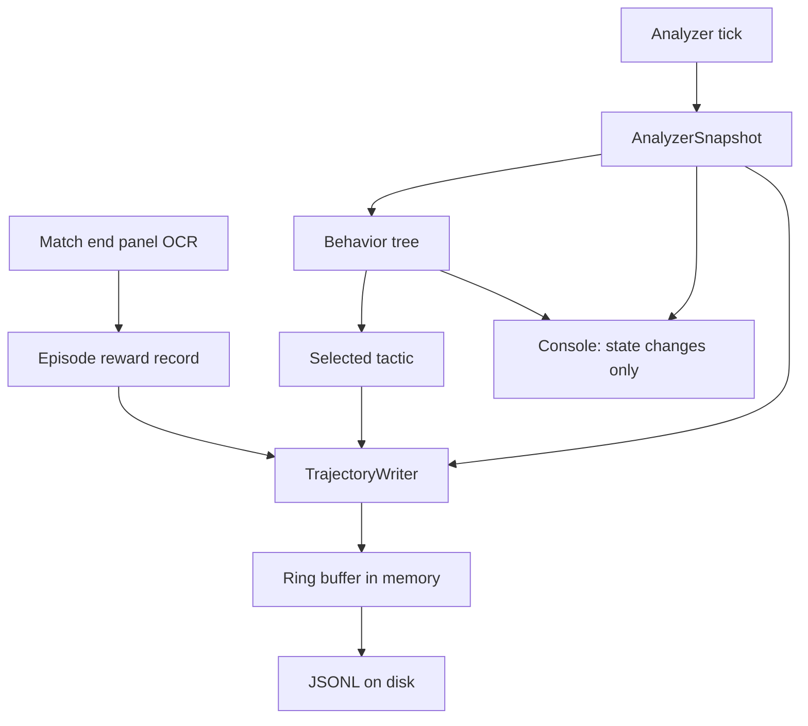

# Design 007 — Telemetry and Data Collection: High-Level Design Document

| Status | Date       | Wingman Version |
|--------|------------|-----------------|
| Draft  | 2026-08-22 | 1.8.5           |

## Problem

Wingman computes a complete decision record every tick and destroys it.

`AnalyzerSnapshot` is a frozen dataclass holding the full perceived state —
health, missiles, flares, three minimap ring counts, enemy-absent seconds,
altitude, altitude rate, respawn, incoming, mission-running, fuel, game state.
The behaviour tree consumes it and produces a selected tactic. That pair is an
*observation and an action*. It is formatted into a prose log line and dropped.

Three consequences, in increasing order of cost:

**1. Every analysis re-derives structure from prose.** The 2026-08-22 review
session alone required six throwaway regex parsers — to extract `ttg`/`alt_rate`
trends, missile counts at death, dive-recovery classification, OCR percentiles,
`anon` versus `rss` growth, and evade survival rates. Each reconstructed, badly
and after the fact, data that had existed as typed fields in memory.

**2. The console is unreadable.** Measured over the 3h 18m session of
2026-08-22: 15,456 INFO lines, about 1.3 per second. The top entries are
machine telemetry — 1,213 OCR reader initialisations, 1,138 health probes, 639
altitude readings, 597 ammo counts. No operator reads that in real time, and
important lines are buried in it.

**3. Phase 4 has no dataset.** `PROJECT_AI_ROADMAP.md` Phase 4 specifies
`learn_from_mission(self, trajectory, reward)` over "1000+ mission iterations".
The trajectory is computed and discarded, and the reward is not captured at all:
session statistics record deaths, evades and mission outcomes, but no kills, no
assists, and no score. Those exist — the post-match PERFORMANCE panel shows
`SCORE` and `KDA` — and wingman clicks past the screen without reading it.

Every mission flown before this is fixed is a permanently unlabelled trajectory
that cannot be recovered later.

## Design principle

**Separate streams by consumer, not by verbosity.**

The current design has one axis — log level — serving three unrelated
audiences. Splitting them is what makes each one correct independently.

| Stream | Consumer | Format | Volume | Retention |
|--------|----------|--------|--------|-----------|
| Console | operator, live | prose, sparse | ~10 lines/min | none (terminal) |
| Human log | operator, after the fact | prose, DEBUG | ~3 MB/h | byte-bounded, prunable |
| **Trajectory** | analysis, Phase 4 | JSONL, one record per tick | ~1 MB/h | **complete, never pruned** |
| Session artifacts | regression gates | JSON aggregates | per session | as today |

The retention column is the load-bearing part. ADR 089 proposes pruning logs
against a byte budget, which is correct for the human log and **destructive for
trajectories** — pruning a training set to stay under a disk quota is a defect
that would only surface when training began. The streams must be separable so
that policy applies to one and not the other.

## Architecture

### TrajectoryWriter

A new consumer of data the tick loop already assembles. It does not touch
perception, tactics, or control — it observes and records.

- **One record per tick**: episode id, tick index, monotonic timestamp,
  observation fields, selected tactic, and any controller commands issued.
- **Bounded ring buffer, timer flush.** Flush on 1,000 records or 5 seconds,
  whichever comes first.
- **JSONL, append-only.**

Sizing: at the 1.5 s tick, roughly 400 bytes per record is 0.27 records/sec and
about **1 MB/hour** — a third of the prose log. A thousand missions at five
minutes each is roughly 83 hours, or **~83 MB** for the entire Phase 4 dataset.

### Episode boundaries and reward

An episode is one life: spawn to death or mission end. Episode records carry
the terminal outcome so a trajectory is self-contained.

Reward material, in increasing order of availability:

| Signal | Source | Status |
|--------|--------|--------|
| Death | respawn detection | available |
| Survival time | episode duration | derivable |
| Missile evaded / hit | ADR 088 engagement tracking | available |
| **Score, kills, deaths, assists** | post-match PERFORMANCE panel | **not captured** |

A `MATCH_SCORE` crop reads the panel at match end, reusing the existing crop
and OCR machinery. The capture must run **before** the click-to-continue
dismisses the screen, so it hooks the existing click-to path rather than polling
independently — the panel is visible for seconds, and a missed read is an
unlabelled mission.

Note the panel reports the whole match, not the individual life, so it labels a
group of episodes rather than one. That is a real limitation of the available
signal and should be recorded in the data rather than papered over.

### Console policy

The console shows **state changes and decisions an operator would act on**:
FSM transitions, tactic changes, warnings and errors, mission start and end,
and session summary. Everything else moves to the trajectory or the human log.

Applying that to the measured top offenders: reader initialisations, health
probe results, per-tick altitude, and ammo counts all leave the console. Target
is roughly ten lines per minute — readable in real time, which 1.3 lines per
second is not.

This is a change in *where* data goes, never in whether it is recorded. Nothing
is deleted; the human log keeps DEBUG in full.

## What this design deliberately avoids

**RAM-conditional flushing.** Buffering until memory is available couples the
diagnostic subsystem to the resource that is currently pathological
(Performance 008: unresolved growth of 1,000–1,600 MB/h). It would buffer
hardest during exactly the long sessions whose data matters most, and buffered
records are lost on a crash — which is when a trajectory is most valuable. A
bounded buffer with a timer flush gives predictable memory and bounded loss
regardless of what RSS is doing.

**A database.** JSONL is append-only and crash-safe — a torn final line is
recoverable — needs no schema migration while RL feature sets are still
changing, and loads directly into pandas or polars. SQLite would add schema
management for no benefit at this volume. Parquet becomes worth considering
when training reads dominate writes, and is a conversion step, not a change
here.

**Deriving the trajectory from the prose log.** Parsing the human log back into
structure is what this design exists to end.

## Relationship to other work

- **ADR 089** should be rescoped to the human log only. Its byte-budget pruning
  is correct there and must not apply to trajectories.
- **ADR 088 / ADR 086 / ADR 087 / Performance 008** all rest on evidence
  extracted from prose after the fact; each would have been a direct query.
- **Research 008 Lesson 6** — "do not let a metric answer a question it cannot
  distinguish" — is the same failure in a different guise: prose lines conflate
  fields that a record separates.
- **Phase 4** consumes the trajectory directly. Starting the stream now means
  Phase 4 begins with thousands of banked missions rather than at zero.

## Open questions

1. **Episode labelling granularity.** The PERFORMANCE panel scores a match, not
   a life. Whether per-life reward can be inferred from kill-feed or score
   deltas is unknown and needs a spike.
2. **Observation schema stability.** RL features will churn. JSONL tolerates
   added fields; whether records should carry a schema version is worth
   deciding before the first long run rather than after.
3. **Trajectory volume at higher tick rates.** The 1 MB/h estimate assumes the
   current 1.5 s tick. Phase 5 vision work may want finer granularity, and the
   ring buffer sizing should be revisited then, not now.
4. **The EasyOCR reader anomaly.** 1,213 reader initialisations in one session
   against a single 13-worker pool, up to 78 on one thread id. Unexplained, and
   a strong candidate for the Performance 008 residual. It is not part of this
   design, but it is the reason the console policy above is not merely cosmetic:
   the clue sat in plain sight for weeks.

## Validation

**V1 — a trajectory reproduces a past analysis.** Re-derive the ADR 088
finding (dives completing with missiles aboard) as a query over trajectory
records rather than a regex over prose, and confirm the same count.

**V2 — console is readable.** INFO output on a live session is at or below
roughly ten lines per minute, and every line is a state change, decision,
warning, or summary.

**V3 — no data loss on crash.** Killing wingman mid-session leaves a valid
JSONL file whose last complete record is within the flush interval of the kill.

**V4 — episodes are labelled.** After a session, the fraction of episodes
carrying a terminal reward record is reported; the target is every completed
match.

**V5 — volume matches the estimate.** Trajectory growth is within the same
order as the 1 MB/h projection, measured over a session of at least four hours
(Performance 008's method rule).
