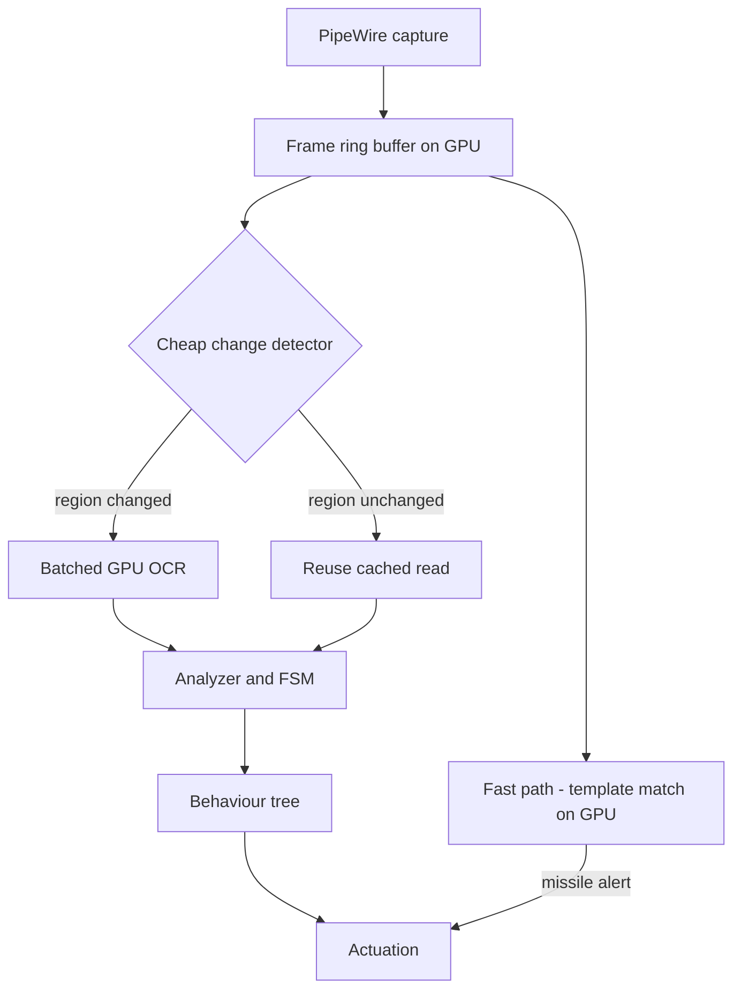

# Design 008 — GPU-Accelerated Real-Time Wingman

| Status | Date       | Wingman Version |
|--------|------------|-----------------|
| Draft  | 2026-08-26 | 1.8.7           |

## Purpose

Wingman today is deliberately CPU-only. `respawn_detection.use_gpu` exists and
defaults to `false`, and every measurement, calibration and regression baseline
in the project was taken that way.

That was the right call while the foundation was being built, and this document
does not argue otherwise. It describes what a **high-performance profile**
would look like once the foundation is trusted: GPU-resident OCR, a tick driven
by events rather than a fixed interval, and reaction latencies bounded by the
game rather than by the loop.

This is a design, not a plan. Nothing here is scheduled.

## Where the current design spends its time

From the release baseline — **725 sessions, 604,263 OCR samples**:

| crop | mean | p95 |
|------|------|-----|
| incoming | 0.460 s | 0.373 s |
| respawn | 0.423 s | 0.228 s |
| health | 0.432 s | 0.380 s |
| ammo_flares | 0.375 s | 0.207 s |
| ammo_missiles | 0.384 s | 0.195 s |
| telemetry | 0.666 s | 0.374 s |
| **incoming to flare** | **0.486 s** | — |

Structure of the loop as built:

- **Fixed 1.5 s tick** (`loop_interval_sec`). Everything is sampled on that beat.
- **13-worker `ThreadPoolExecutor`**, one thread-local EasyOCR reader each,
  CPU inference.
- **33 calibrated crops**, a subset scanned per tick depending on FSM state.
- One full-frame capture per tick via PipeWire.

The headline number is the last row: **~0.49 s from an incoming-missile
detection to flares away.** A missile that needs a response inside half a second
is a coin flip, and the current missile-evade result (82% survival with evade
against 67% without) is achieved *despite* that latency, not because it is
small.

### The three costs, separated

Worth being precise, because only one of them is OCR:

1. **Detection latency** — the crop is only read on a tick boundary, so a
   missile alert appearing just after a tick waits up to 1.5 s to be seen. This
   is the largest term and **GPU does not help it at all.**
2. **Inference latency** — ~0.2–0.4 s per crop batch on CPU. This is what GPU
   addresses.
3. **Actuation latency** — key injection, now sub-millisecond after ADR 091.
   Already negligible.

A design that only accelerates (2) would move ~0.49 s to perhaps ~0.35 s. The
interesting version attacks (1), and GPU is what makes attacking (1) affordable.

## Design

### 1. GPU-resident OCR, batched

One reader per process on the GPU instead of 13 thread-local CPU readers. Crops
for a tick are uploaded once and inferred as a **single batch** rather than 13
independent calls. Batching is where GPU wins; per-crop calls would spend the
gain on transfer overhead.

This also removes the 13-reader warm-up that currently costs ~1.3 GB and roughly
five minutes at session start, and it removes the thread-local reader model that
ADR 091's investigation had to reason around.

### 2. Decouple detection from the tick

The 1.5 s tick exists because CPU OCR could not go faster. With inference cheap,
the loop can be split:

- **Fast path**, every frame: GPU template match on the small number of regions
  where latency is safety-critical — incoming-missile alert above all. Template
  matching is already used for `incoming` (`incoming_template_matching_enabled`)
  and is far cheaper than OCR.
- **Slow path**, on the existing beat: OCR for everything where a 1.5 s
  granularity is fine — ammo counts, hangar state, lobby buttons.

That is the change that matters. Flare latency becomes bounded by frame rate
rather than by tick interval.

### 3. Change detection before inference

Most crops are identical between consecutive frames. A cheap GPU-side hash or
mean-absolute-difference per crop region, compared against the previous frame,
skips inference entirely for unchanged regions. Ammo counts change on firing;
the lobby PLAY button does not change at all while the lobby is up.

This is what keeps a per-frame loop affordable rather than merely possible.

## What must not regress

The foundation this builds on is the point, and a performance profile that
breaks it is not worth having.

- **Calibration is resolution-relative, not device-relative.** Crops are
  fractions of the capture frame. GPU inference must not change what a crop
  *means*, or every calibration and every archived screenshot becomes invalid.
- **The CPU path stays the default and stays supported.** The stated hardware
  range — low-end laptop to desktop — is a feature. The GPU profile is an
  opt-in, not a replacement.
- **Performance baselines are not comparable across profiles.** 725 sessions of
  CPU timings cannot be mixed with GPU timings; ADR 092's leak gate and the
  regression comparison would both read a profile switch as a step change. The
  profile has to be recorded in `run_*.json` and segregated, exactly as
  `WINGMAN_ACCOUNT` was for multi-account runs.
- **The determinism the test lanes rely on.** ADR 044's replay gate and ADR 037's
  real-OCR lane assert on OCR output. GPU inference is not bit-identical to CPU;
  those lanes need either a CPU pin or tolerance bands, decided deliberately
  rather than discovered when they start flapping.

## Risks

- **Non-determinism.** The single largest risk, and it is not a performance
  question. Two profiles that read a crop differently mean two behaviour trees.
- **A second hardware class to support.** CUDA versions, driver mismatches, and
  the VRAM budget alongside MetalStorm — which itself grows ~165 MB/h
  (Anomaly 002) and will be competing for the same GPU.
- **The game and wingman contend for one GPU.** Unlike CPU OCR, this profile
  takes resources from the thing being played. A wingman that costs the game
  frames has made the aircraft harder to fly, not easier.
- **Warm-up and memory shape change.** The leak instrumentation, the ADR 090
  memory guard limits and the ADR 092 gate thresholds are all calibrated against
  the CPU profile's ~2.9 GB steady state. All three need re-baselining, and none
  of them measure VRAM today.

## Open questions

1. **What is the actual frame-to-flare floor?** Unknown, and it bounds the whole
   design. Worth measuring before anything is built: capture timestamp to
   injection timestamp with the OCR removed entirely.
2. **Is template matching on GPU enough for the fast path**, or does the
   incoming alert need OCR confirmation to hold its current false-positive rate?
3. **How much VRAM is left** while MetalStorm is running, on the lowest GPU
   worth supporting?
4. **Does per-frame processing change the leak picture?** Six sessions proved
   the CPU profile flat at −4 to +3 MB/h. That result does not transfer.
5. **Which crops genuinely need sub-tick latency?** Probably only `incoming`.
   If it is only one, a much smaller change than this document describes may
   capture most of the benefit.

## Prerequisites

Not scheduling this, but these are the honest gates:

- ADR 093's recovery paths validated live — the livelock protections have never
  actually fired.
- A frame-to-actuation latency measurement (open question 1), because without it
  the benefit is speculation.
- Profile tagging in `run_*.json`, so the two baselines cannot silently mix.

## References

- `docs/TODO-enable-gpu-ocr.md` — the existing CUDA/EasyOCR setup notes
- ADR 091 — key injection latency, now sub-millisecond
- ADR 092 — the leak gate whose thresholds are CPU-profile calibrated
- Anomaly 002 — the game's own GPU/memory footprint
- Research 005 — the `WINGMAN_ACCOUNT` precedent for segregating baselines
- `docs/performance/release/` — the 725-session CPU baseline quoted above
