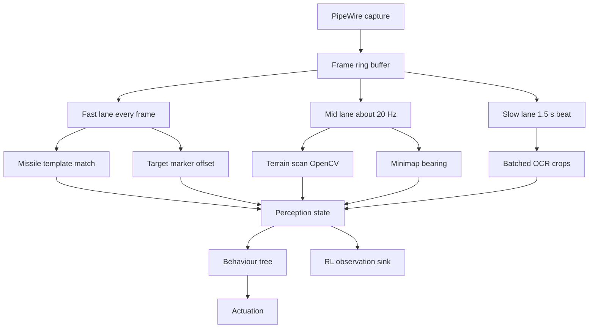

# Design 008 — GPU-Accelerated Real-Time Wingman

| Status | Date       | Wingman Version |
|--------|------------|-----------------|
| Draft  | 2026-08-26 | 1.8.7           |

## Purpose

Wingman today is deliberately CPU-only. `respawn_detection.use_gpu` exists and
defaults to `false`, and every measurement, calibration and regression baseline
in the project was taken that way.

That was the right call while the foundation was being built, and this document
does not argue otherwise. It describes what a **high-performance profile**
would look like once the foundation is trusted: GPU-resident OCR, a tick driven
by events rather than a fixed interval, and reaction latencies bounded by the
game rather than by the loop.

This is a design, not a plan. Nothing here is scheduled.

## The workload this is really for

OCR is the smallest part of it. Three existing designs each need perception that
the current 1.5 s tick cannot deliver, and they compound:

| design | demand |
|--------|--------|
| **HLDD 001 — terrain avoidance** | States outright that the OCR pipeline is unsuitable: it "runs at 0.8–1.5 s per cycle" and needs "a dedicated fast-scan loop running at **10–20 Hz** using pure OpenCV operations" |
| **HLDD 003 — enemy quadrant detection** | Continuous minimap-derived navigation, course-correcting toward contacts rather than sampling occasionally |
| **HLDD 005 — target tracking** | Closed-loop roll input to centre a *moving* HUD marker — a control loop whose stability depends on sample rate |

HLDD 001 is the important one: it independently arrived at a **10–20 Hz fast
scan** before this document existed, and live sessions show why. The 2026-08-25
session logged **73 `DIVE RECOVERY` events over 9.2 hours**, the worst of them
at **2 seconds to ground**. At a 1.5 s tick that is roughly *one sample* of
warning before impact, which is why terrain handling today is a reactive forced
climb rather than avoidance. The count varies widely by session — another logged
zero — but a capability cannot become an avoidance loop until the perception
feeding it runs faster than the thing it is avoiding. That is a 15–30x increase in perception
rate over today's tick, specified by a design that predates it, for a capability
that is about not flying into a mountain.

Add to that what Phase 4–5 implies — a behaviour tree evaluating richer state
every cycle, and reinforcement learning consuming per-frame observations — and
the shape of the demand becomes clear. It is not "OCR, but faster." It is
**several concurrent perception loops at different rates, feeding a decision
layer that also grows**, all inside one process that today runs 13 OCR threads
and a single 1.5 s beat.

GPU acceleration matters here less because OCR is slow and more because it is
the only way to buy back the CPU that these loops will need — and because a
process running terrain scan at 20 Hz, target tracking at frame rate, OCR on a
slower beat, a behaviour tree, and an RL policy is a **thread and scheduling
problem** before it is a compute problem.

## Where the current design spends its time

From the release baseline — **725 sessions, 604,263 OCR samples**:

| crop | mean | p95 |
|------|------|-----|
| incoming | 0.460 s | 0.373 s |
| respawn | 0.423 s | 0.228 s |
| health | 0.432 s | 0.380 s |
| ammo_flares | 0.375 s | 0.207 s |
| ammo_missiles | 0.384 s | 0.195 s |
| telemetry | 0.666 s | 0.374 s |
| **incoming to flare** | **0.486 s** | — |

Structure of the loop as built:

- **Fixed 1.5 s tick** (`loop_interval_sec`). Everything is sampled on that beat.
- **13-worker `ThreadPoolExecutor`**, one thread-local EasyOCR reader each,
  CPU inference.
- **33 calibrated crops**, a subset scanned per tick depending on FSM state.
- One full-frame capture per tick via PipeWire.

The headline number is the last row: **~0.49 s from an incoming-missile
detection to flares away.** A missile that needs a response inside half a second
is a coin flip, and the current missile-evade result (82% survival with evade
against 67% without) is achieved *despite* that latency, not because it is
small.

### The three costs, separated

Worth being precise, because only one of them is OCR:

1. **Detection latency** — the crop is only read on a tick boundary, so a
   missile alert appearing just after a tick waits up to 1.5 s to be seen. This
   is the largest term and **GPU does not help it at all.**
2. **Inference latency** — ~0.2–0.4 s per crop batch on CPU. This is what GPU
   addresses.
3. **Actuation latency** — key injection, now sub-millisecond after ADR 091.
   Already negligible.

A design that only accelerates (2) would move ~0.49 s to perhaps ~0.35 s. The
interesting version attacks (1), and GPU is what makes attacking (1) affordable.

## The restructure is separable from the GPU — test it first

The most important property of this design is that its central claim is
**testable for free, before any hardware arrives.**

The claim is that the *tick*, not OCR, is the constraint. If that is true, then
splitting the loop into lanes should recover most of the reaction latency on
**CPU alone**, because the missile fast path is not OCR at all:

```python
# analyzer.py:168 — the incoming detector
response = cv2.matchTemplate(incoming_binary, template_binary, cv2.TM_CCOEFF_NORMED)
```

Template matching one small crop is cheap on CPU. Nothing about running that
lane at a high rate requires a GPU. So the single largest latency win available
— reaction time on incoming missiles, currently **0.486 s mean** — is very
likely reachable today with a refactor and no purchase.

**Do that first.** Implement the fast lane on CPU, measure incoming-to-flare,
and see how much of the 0.486 s falls out. Three outcomes, all useful:

- **Most of it falls out.** The premise is confirmed, the highest-value win is
  already banked, and the GPU's remaining job is narrowed to terrain and
  headroom — a much better-specified purchase.
- **Little of it falls out.** Something other than the tick dominates, and this
  document's central assumption is wrong. Better to learn that for the cost of a
  refactor than after buying hardware.
- **It falls out but costs too much CPU.** That is the case that genuinely
  justifies the GPU, and it arrives with a measurement attached.

This overlaps open question 1 (the frame-to-actuation floor) and should be
treated as the same piece of work.

### What still needs the GPU

Being precise about this, because "GPU makes it faster" is too coarse to
justify a purchase:

| workload | needs GPU? |
|----------|-----------|
| Missile fast path | **No** — one small template match, cheap on CPU |
| Target marker offset | Probably not — small region, simple operation |
| **Terrain avoidance at 10–20 Hz** | **Yes** — a large forward-view region, heavy OpenCV, 15–30x today's rate |
| Minimap bearing at ~5 Hz | Marginal — small region, already implemented |
| OCR batching | Yes, but low value — OCR is on the slow lane where 1.5 s is fine |
| RL training (Phase 4–5) | Yes, and it is the one that wants a card of its own |

The honest reading: the GPU is bought for **terrain avoidance and future
headroom**, not for missile reaction latency. That is still a good reason — but
it is a different reason from the one this document opened with.

## Design

The organising idea is **loops at different rates sharing one machine**, not
"OCR, but on the GPU". OCR becomes one tenant among several, and the slowest.

### The loops

| loop | work | rate wanted | today |
|------|------|-------------|-------|
| Missile alert | template match on `incoming` | as fast as frames arrive | 1.5 s tick |
| Terrain avoidance (HLDD 001) | **pure OpenCV** on the forward view | **10–20 Hz** | does not exist |
| Target tracking (HLDD 005) | HUD marker offset, closed-loop roll | frame rate — it is a control loop | does not exist |
| Minimap navigation (HLDD 003) | red-blob scan, bearing estimate | continuous, ~5 Hz | 1.5 s tick |
| OCR crops | ammo, health, telemetry, lobby | 1.5 s is fine | 1.5 s tick |
| Behaviour tree | tactic selection | rate of its fastest input | 1.5 s tick |
| RL observation sink (Phase 4–5) | per-frame state capture | frame rate | does not exist |

Two things fall out of the table. Most of the demand is **not OCR**, and the
behaviour tree cannot keep a 1.5 s tick if it consumes a 20 Hz terrain signal —
the decision layer's rate is set by its fastest meaningful input.

### Two GPU stacks, not one

This is the part most likely to be underestimated. The workload needs **two
different acceleration paths**, and they do not share a runtime:

| | stack | current state |
|---|---|---|
| OCR | EasyOCR to PyTorch to CUDA (or converted to OpenVINO) | `use_gpu` flag exists, defaults false; `docs/TODO-enable-gpu-ocr.md` covers the CUDA install |
| OpenCV | `cv2.cuda`, or VPI, or OpenVINO | **not available** |

The analyzer already runs substantial OpenCV every tick — `cvtColor` x12,
`resize` x10, `inRange` x6, `threshold` x5, plus `matchTemplate` and `minMaxLoc`
— all on CPU. Terrain avoidance would add far more, at 10-20x the rate.

**The installed `opencv-python` wheel has no CUDA support.** Verified
2026-08-26: `cv2.cuda.getCudaEnabledDeviceCount()` returns `0` on OpenCV 4.11.0.
The `cv2.cuda` namespace exists in the wheel, so the failure is a silent zero
rather than an import error — exactly the shape that gets discovered late. GPU
OpenCV means building OpenCV from source with CUDA, switching to NVIDIA VPI, or
routing the operations through OpenVINO.

Deciding this is a prerequisite, not an implementation detail: it determines
whether the terrain loop — the one with the hardest rate requirement — can be
accelerated at all.

### Scheduling



Three lanes rather than one tick, each with its own budget, all writing into a
single perception state the behaviour tree reads. Design constraints:

- **One capture, many consumers.** Frames are captured once into a ring buffer
  and shared. Today every consumer would re-capture; at 20 Hz that is wasteful
  and introduces skew between loops reading different frames.
- **A lane that overruns drops its frame rather than delaying others.** A slow
  OCR batch must not stall the terrain loop — that inverts the priority the
  whole design exists to establish.
- **The behaviour tree reads a snapshot, not live state.** It already does this
  (ADR 024 freezes an analyzer snapshot per tick), which is the property that
  makes multi-rate input tractable: the tree sees one coherent picture, whatever
  rates produced it.
- **Bounded threads.** Today's 13 OCR workers plus three lanes plus a BT plus an
  RL sink, on a machine also running a game, is a scheduling problem before it
  is a compute problem. Lane count and worker count need to be explicit and
  capped, not emergent.

### Change detection before inference

Most regions are identical between consecutive frames. A cheap per-region hash
or mean-absolute-difference against the previous frame skips work entirely when
nothing moved — ammo changes on firing, the lobby PLAY button does not change at
all while the lobby is up. This is what makes the fast and mid lanes affordable
rather than merely possible, and it applies to every lane.

### Why this raises the ceiling, not just the speed

The argument for this profile is usually made as latency, but the stronger form
is about **what can be expressed at all**.

At a 1.5 s tick, a behaviour tree cannot implement any tactic requiring a
reaction inside a second — not slowly, but not at all. The tick is a hard floor
on the class of behaviours the decision layer can represent. A tree fed 20 Hz
terrain data and frame-rate target offsets can express manoeuvres that a 1.5 s
tree structurally cannot, regardless of how good its logic is.

That is the sense in which this is an AI capability change rather than a
performance change: it removes a ceiling on tactic design, and every tactic
added afterwards inherits the higher ceiling.

### Reinforcement learning: inference and training are different problems

Phase 4-5 puts RL on this platform, and the two halves have opposite profiles:

- **Inference** — a policy evaluated per decision. Small, latency-sensitive,
  belongs alongside the other lanes.
- **Training** — sustained, throughput-hungry, and in direct competition with
  the game for the same GPU.

Training during live play is not obviously viable and should be assumed
**offline** until measured: collect observations during sessions, train between
them.

**Faster perception is enabling for RL, not sufficient.** The hard parts here
are unrelated to frame rate: a live multiplayer match has no environment reset,
the reward is essentially the match outcome, opponents are non-stationary, and
credit assignment spans a four-minute mission. More observations per second
improves sample *count*, not sample *efficiency*. This profile removes a
perception bottleneck; it does not deliver Phase 4, and should not be expected
to. That also fits the existing shadow-first pipeline (ADR 073), where a
candidate runs selection-only against live data before it gets actuation.

### One instance per host, not one host serving many

The README places multi-agent squad coordination in **Phase 3**, not a distant
end phase — several wingman instances flying complementary roles (aggressive,
loiter, target-painting, support).

The deployment shape is **a full stack per machine**: each host runs its own
MetalStorm client and its own wingman, with perception entirely local. VEDA is
one agent; Ptolemy, once purchased with its RTX 5060 Ti (foundry ADR 022), is a
second.

That settles the question this document previously left open about splitting
perception across hosts. It never happens — **perception never crosses the
network.** What crosses is coordination: target priority, role assignment,
who-is-engaging-what. Those messages are small and latency-tolerant relative to
a 20 Hz terrain loop, so the network requirement is ordinary rather than
demanding. A design that shipped frames between machines would have inherited a
latency budget it could not meet; this one does not.

Consequences that follow:

- **GPU sizing is per host, for one instance.** Not N instances sharing a card.
  That makes an RTX 5060 Ti a reasonable unit of provisioning rather than an
  open-ended question.
- **Each instance needs its own MetalStorm account.** Research 005 established
  that a Wine prefix *is* an account, with the `r1`/`r2` targets and
  `WINGMAN_ACCOUNT` tagging already built for exactly this. Two machines means
  two accounts, and foundry's `metalstorm-config` module already exists to
  deploy a prefix and its settings onto a new host.
- **Ptolemy is not only a server.** It runs a game client under Proton, which is
  part of why ADR 022 specifies Ubuntu Desktop rather than the headless server
  ADR 011 originally planned.
- **Per-account performance segregation matters more.** ADR 092's leak gate and
  the regression baselines already segregate by `WINGMAN_ACCOUNT`; with two
  hosts they must also segregate by host, since a 5060 Ti and an iGPU produce
  different timings for identical code.

## Hardware — what the fleet actually has

Recorded because this design cannot be built on assumption, and the obvious
assumption is wrong.

| machine | GPU | status |
|---------|-----|--------|
| **VEDA** (today's host) | Intel Arrow Lake-U iGPU. No `nvidia-smi` | in use; a discrete GPU could be added |
| **Ptolemy** | Arrow Lake-S **iGPU** (Xe-LPG) — *not* a discrete GPU | **not yet provisioned** (foundry ADR 011, Draft) |
| **Workhorse2** | **RTX 4070 Ti 12 GB** | the only discrete GPU in the fleet; Windows 11 |

Two consequences that change the design space:

**Ptolemy is not a high-end-GPU host.** foundry ADR 011 deliberately chose
**OpenVINO on the Arrow Lake-S iGPU** for Frigate's object detection, explicitly
rejecting a Coral TPU, and ADR 015 puts Jellyfin's QSV transcoding on that same
iGPU. Frigate detection and Jellyfin transcode are already two tenants on it,
and ADR 015 already flags that they can contend. Wingman would be a third — and
unlike the other two, wingman's usefulness is bounded by *latency*, which is
exactly what contention costs.

**The fleet is Intel.** `docs/TODO-enable-gpu-ocr.md` documents the CUDA path
(`cu121`, `nvidia-smi`), which fits Workhorse2 and nothing else currently
running. On Intel silicon the native path is **OpenVINO** — the same runtime
foundry already chose for Frigate. That is worth evaluating before assuming
CUDA, because it is the option that works on hardware the lab already has.

**foundry ADR 022 changes this picture.** Ptolemy is now specified as a Dell
ECT1250 Tower Plus with a discrete **RTX 5060 Ti**, quoted at $2,060 on
2026-08-26, running Ubuntu Desktop with TRANSAM/TRIAL mode switching (foundry
ADR 021). That gives the lab a GPU-capable host for the first time and moves
Frigate detection off the iGPU.

**Ptolemy runs its own MetalStorm client and its own wingman instance** — it is
a second agent, not a perception server for VEDA. So the GPU is used where the
frames are produced, and the profile can be developed on Ptolemy while VEDA
keeps the CPU profile as the control. VEDA would still want its own discrete GPU
eventually to run the profile itself; that is a second purchase, not a
precondition for this one.

## What must not regress

The foundation this builds on is the point, and a performance profile that
breaks it is not worth having.

- **Calibration is resolution-relative, not device-relative.** Crops are
  fractions of the capture frame. GPU inference must not change what a crop
  *means*, or every calibration and every archived screenshot becomes invalid.
- **The CPU path stays the default and stays supported.** The stated hardware
  range — low-end laptop to desktop — is a feature. The GPU profile is an
  opt-in, not a replacement.
- **Performance baselines are not comparable across profiles.** 725 sessions of
  CPU timings cannot be mixed with GPU timings; ADR 092's leak gate and the
  regression comparison would both read a profile switch as a step change. The
  profile has to be recorded in `run_*.json` and segregated, exactly as
  `WINGMAN_ACCOUNT` was for multi-account runs.
- **The determinism the test lanes rely on.** ADR 044's replay gate and ADR 037's
  real-OCR lane assert on OCR output. GPU inference is not bit-identical to CPU;
  those lanes need either a CPU pin or tolerance bands, decided deliberately
  rather than discovered when they start flapping.

## Risks

- **Non-determinism.** The single largest risk, and it is not a performance
  question. Two profiles that read a crop differently mean two behaviour trees.
- **A second hardware class to support.** CUDA versions, driver mismatches, and
  the VRAM budget alongside MetalStorm — which itself grows ~165 MB/h
  (Anomaly 002) and will be competing for the same GPU.
- **The game and wingman contend for one GPU.** Unlike CPU OCR, this profile
  takes resources from the thing being played. A wingman that costs the game
  frames has made the aircraft harder to fly, not easier. On an **integrated**
  GPU this is worse, not better: the iGPU shares system RAM and memory bandwidth
  with the compositor and the game, so there is no separate pool to draw from.
- **Thread count and scheduling, not just compute.** Several perception loops at
  different rates plus a behaviour tree plus an RL policy in one process is a
  contention problem in its own right. Today's 13 OCR workers already sit inside
  a 20-core machine that also runs a game; adding loops without a scheduling
  design would spend the GPU gain on context switching.
- **Host contention becomes visible.** Today's 1.5 s tick has enough slack that a
  loaded machine does not show up in the results — measured 2026-08-26, a
  session at load average 9.4 still finished 8/8 missions with OCR at 0.25 s. A
  frame-bounded design has no such slack, which is what makes foundry ADR 021's
  TRIAL stand-down and ADR 095's host-contention recording prerequisites rather
  than conveniences.
- **Warm-up and memory shape change.** The leak instrumentation, the ADR 090
  memory guard limits and the ADR 092 gate thresholds are all calibrated against
  the CPU profile's ~2.9 GB steady state. All three need re-baselining, and none
  of them measure VRAM today.

## Open questions

1. **What is the actual frame-to-flare floor?** Unknown, and it bounds the whole
   design. Worth measuring before anything is built: capture timestamp to
   injection timestamp with the OCR removed entirely. **This is now the first
   piece of work** — see "The restructure is separable from the GPU".
2. **Is template matching on GPU enough for the fast path**, or does the
   incoming alert need OCR confirmation to hold its current false-positive rate?
3. **How much VRAM is left** while MetalStorm is running, on the lowest GPU
   worth supporting?
4. **Does per-frame processing change the leak picture?** Six sessions proved
   the CPU profile flat at −4 to +3 MB/h. That result does not transfer.
5. **Which crops genuinely need sub-tick latency?** For OCR, probably only
   `incoming`. But HLDD 001's terrain scan, HLDD 003's minimap navigation and
   HLDD 005's target tracking are not OCR at all — they are OpenCV on the frame,
   and all three want rates the current tick cannot give. The right question is
   which *loops* need which rates, not which crops.
6. **CUDA or OpenVINO?** The fleet is Intel; foundry already runs OpenVINO for
   Frigate. `docs/TODO-enable-gpu-ocr.md` assumes CUDA. Deciding this determines
   which machines can host the profile at all.
7. ~~One host or two?~~ **Resolved: each host runs its own game and wingman.**
   Perception never crosses the network; only coordination does. See "One
   instance per host". What remains open is the coordination protocol itself —
   what is exchanged, how often, and what happens when a peer is absent — which
   is squad-coordination design rather than a perception-profile question.

## Prerequisites

Not scheduling this, but these are the honest gates:

- **Hardware that can run it.** A discrete GPU in VEDA, or Ptolemy's RTX 5060 Ti
  (foundry ADR 022) with the host question in open question 7 settled. Neither
  exists today.
- **A decided OpenCV acceleration stack.** The terrain loop has the hardest rate
  requirement in the design and is pure OpenCV, and the installed
  `opencv-python` wheel reports zero CUDA devices. Building OpenCV with CUDA,
  NVIDIA VPI, and OpenVINO are the candidates; until one is chosen and measured,
  the loop that most needs acceleration has no path to it.
- **A stand-down lever for co-tenants** — foundry ADR 021 (TRIAL), plus ADR 095
  so a session records the conditions it ran under.
- ADR 093's recovery paths validated live — the livelock protections have never
  actually fired.
- **The CPU-only lane split, measured** (open question 1). It is the cheapest
  way to confirm or refute this document's central claim, and it re-specifies
  what the GPU is actually for.
- Profile tagging in `run_*.json`, so the two baselines cannot silently mix.

## References

- `docs/TODO-enable-gpu-ocr.md` — the existing CUDA/EasyOCR setup notes
- ADR 091 — key injection latency, now sub-millisecond
- ADR 092 — the leak gate whose thresholds are CPU-profile calibrated
- Anomaly 002 — the game's own GPU/memory footprint
- Research 005 — the `WINGMAN_ACCOUNT` precedent for segregating baselines
- `docs/performance/release/` — the 725-session CPU baseline quoted above
- HLDD 001 / 003 / 005 — the terrain, minimap-navigation and target-tracking
  designs whose perception rates this profile exists to serve
- foundry ADR 011 / ADR 015 — Ptolemy's iGPU and its existing Frigate and
  Jellyfin tenants
- foundry ADR 021 — TRANSAM up, TRIAL down: the co-tenant stand-down lever
- foundry ADR 022 — Ptolemy's RTX 5060 Ti, the second agent host
- Research 005 — one Wine prefix per account, and the `r1`/`r2` targets a
  second instance needs
- foundry `metalstorm-config/` — deploying a MetalStorm account onto a new host
- ADR 095 — recording host contention, so a profile change is measurable
