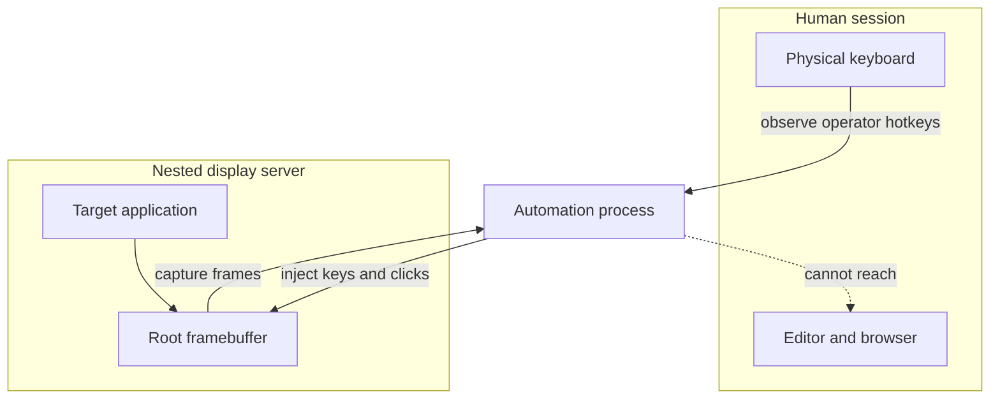
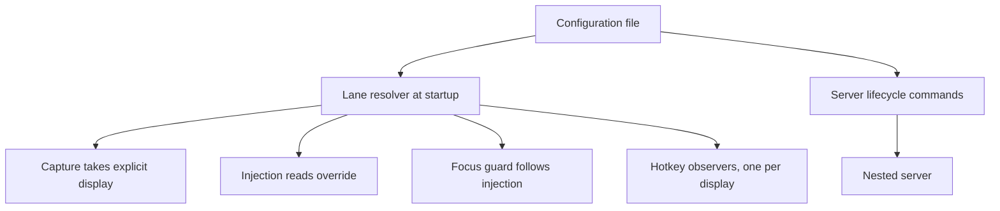
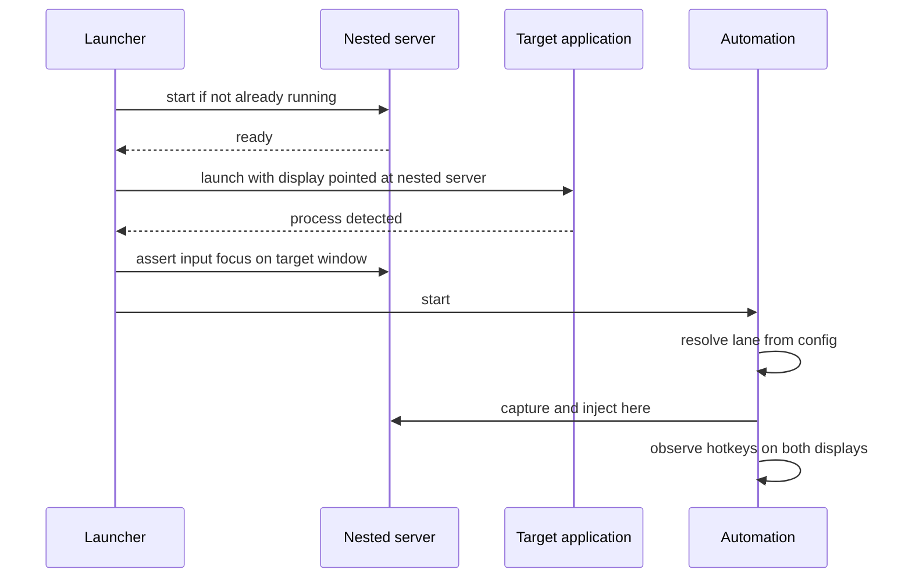

# Design 009 — Nested Display Isolation for Concurrent Human and Automation Use

| Status | Date       | Wingman Version |
|--------|------------|-----------------|
| Draft  | 2026-08-29 | 1.8.7           |

## Purpose

This document describes how MetalStorm Wingman runs a full automation session —
screen capture, OCR, keyboard and mouse injection — while the operator uses the
same physical machine for unrelated work, and how to reproduce that design in any
other system with the same shape.

It is written to be portable. The MetalStorm specifics are examples; the
mechanism is not specific to games, to Wine, or to this codebase.

## The class of problem

Any automation that **observes a screen and injects input** shares two global,
positional resources with the human operator:

- **The screen.** Capture reads whatever is currently composited and visible.
- **The input focus.** Injected keys and clicks are delivered to whatever window
  currently has focus, or to whatever sits under the pointer.

Neither is addressed to the target application. Both follow the human's
attention. The moment the operator switches windows, the automation is reading
the wrong pixels and typing into the wrong application.

This is not a rare edge case; it is the normal state of affairs the instant the
machine is used for anything else. In this project it produced corrupted text in
the operator's editor: a message typed as `tryi auganw` because automation
keystrokes interleaved with human ones (ADR 098).

### Why the obvious fixes are insufficient

| Approach | What it fixes | Why it is not enough |
|---|---|---|
| Suppress injection when the target lacks focus | Corruption | The automation stops. It trades a broken document for a dead session |
| Address input to a window instead of the focus | Key delivery | Synthetic events are widely ignored, and pointer-driven clicks remain positional. Capture is untouched |
| Capture the window instead of the screen | Reading a covered window | A minimised or unmapped window renders nothing to capture. Many renderers stop drawing entirely when not visible |
| Run the target on another virtual desktop | Visibility to the human | The compositor still owns one focus and one visible framebuffer; capture reads the active desktop |

The recurring failure is that all four treat **focus** as the coupling. It is
not. The coupling is the **shared display server**: one framebuffer, one focus,
one pointer, shared between the human and the automation.

## The mechanism

**Give the automated application its own display server.**

A second, independent display server is created for the sole use of the target
application. On that server the target is the only client, so it permanently
holds focus, and the server owns a framebuffer whose contents are determined by
the target alone and are not affected by what the human is doing or looking at.

The automation process straddles both worlds deliberately. This is the crux of
the design and the part most likely to be got wrong.

## The central invariant

> **Every consumer of "which display?" must be asked the question separately.**

In a single-display system one environment variable answers it for everything.
The moment a second display exists, that variable is ambiguous, and code that
reads it implicitly will silently pick the wrong one. The failure is silent
because each consumer is individually behaving correctly.

In this implementation there are four consumers. **Three of the four were wrong
at some point during development**, each failing differently and none of them
raising an error:

| Consumer | Belongs on | Symptom when pointed at the wrong display |
|---|---|---|
| Frame capture | Nested | Perception reads the operator's desktop. OCR classifies nothing, or worse, classifies the operator's screen |
| Key and mouse injection | Nested | Keystrokes land in the operator's application. The original corruption |
| Operator hotkey observation | **Human AND target** — see below | Stop, pause and manual-takeover keys are dead, silently |
| Focus/safety guard | Nested | Guard finds no target window, concludes "not the target", and suppresses all injection. The safety mechanism silently disables the system it protects |

Note the third row inverts, and then refuses to be a single answer at all.

It is easy to reason "the automation now lives on the nested display" and move
everything; hotkey observation exists to watch the human's keyboard, so moving
it kills every hotkey. That much is the obvious half. **The non-obvious half is
that pinning it to the human's display can kill them too.**

Where a display server is *rootless* — its windows are surfaces owned by a host
compositor rather than a framebuffer it owns — it only receives input while one
of its own clients holds focus. The target application was very often that
client. Move the target to its own server and the human's server may have no
focused client left at all, so it observes nothing. Both choices produce the
same silent, total loss of operator control.

The rule that survives contact:

> **Observe every display the operator's keys can reach**, which includes the
> display the target runs on — because when the operator looks at the target,
> their keys go there and are visible nowhere else.

Run one listener per display. This means the automation observes its own
injected input on the target's display, which must be discounted explicitly:
count outgoing synthetic presses per-key and debit them on observation, with a
grace window for auto-repeat. Do not rely on a "synthetic event" flag — on X11
the `send_event` bit is not set by `XTest`, so injected keys are
indistinguishable from human ones by that route.

**This is the error to expect.** In this implementation observation was got
wrong twice in succession — first by moving it with the target, then by pinning
it to the human — and neither failure logged anything. A startup banner naming
the chosen display is not evidence: verify by pressing a key and observing the
effect.

Note also the fourth row. A guard that gates injection on "does the target have
focus?" must evaluate that question **on the display injection actually
targets**. Left on the human's display it answers correctly and suppresses
everything — a guard that disables the automation completely while reporting
only routine warnings.

### Design rule

Do not express the lane as an ambient environment variable. Make each consumer
take its display explicitly, from configuration, and default only the one
consumer that genuinely belongs to the human. A single environment variable is
structurally incapable of encoding the table above.

## Selecting the nested server

The nested server is the load-bearing choice. It must satisfy **four**
requirements simultaneously, and servers that satisfy three are common enough to
waste real time.

| Requirement | Why | Failure if missing |
|---|---|---|
| Hardware-accelerated presentation for the target's graphics API | Real applications use GPU rendering paths | The application refuses to start or falls back to unusable software rendering |
| A real root framebuffer that a capture API can read | Capture must see composited output | Capture returns blank or stale frames |
| Programmatic focus control | The target must be focusable without a human | Input routes by pointer position, which is not a stable target |
| Support for the injection and capture primitives already in use | Reuse the existing automation code unchanged | A rewrite of the injection path |

In this implementation, on Linux with X11:

- **Xephyr was rejected.** It provides 2D acceleration and a real framebuffer,
  but implements no DRI3. The target's Vulkan layer requires DRI3 to present and
  exits at startup with `vulkan: No DRI3 support detected`. The application never
  runs at all. There is no flag that enables it.
- **Rootful Xwayland was selected.** It provides DRI3, because it is the same
  server that already hosts GPU applications in the host session, and — run
  *rootful* rather than rootless — it maintains a real root framebuffer that
  `XGetImage` can read. Rootless Xwayland does not: its windows are individual
  compositor surfaces, invisible to a root-window capture. **Rootful versus
  rootless is the deciding property**, and it is a launch flag, not a different
  program.

The general lesson: prefer a nested server that is *the same implementation* the
host already uses for accelerated clients, and check the rootful/rooted mode
specifically. Novel or minimal nested servers tend to fail the acceleration
requirement.

## Component design

Five parts:

1. **Configuration** is the single source of truth for whether the lane is
   active and which display it uses. Both the launcher and the automation read
   the same key, so they cannot disagree. A per-run override escapes the global
   setting when two instances must run in different lanes.
2. **A lane resolver** runs once at startup, before any display consumer is
   constructed, and hands each consumer its display explicitly. Ordering matters:
   anything constructed before the resolver silently captures the default.
3. **Capture** accepts an explicit display rather than inferring one from the
   session environment. Inferring is how the wrong backend gets chosen.
4. **Injection** consults a process-wide override; observation does not.
5. **Server lifecycle** — idempotent start, explicit focus assertion, status and
   teardown — is separate from the automation and safe to invoke on every run.

### Startup sequence

Two ordering constraints are easy to violate:

- **Start the server before launching the target.** The target resolves its
  display once, at startup, and cannot be moved afterwards.
- **Assert focus after the target's window exists**, not before.

### Focus without a window manager

A bare nested server has no window manager. Consequences, all of which are
advantages here:

- Nothing repositions the target, so it maps at the origin and the capture
  offset is exactly zero rather than something to detect.
- No window decorations exist, so there is no drag handle and no accidental
  resize.
- Input focus defaults to "follows pointer", which is **not** stable. Focus must
  be asserted explicitly once the target window exists.

Identify the window to focus by **process ownership, not by title**. Title
matching is actively dangerous: during development, an editor window whose title
contained the game's name satisfied a substring test while the game was not even
running. Resolve the target's process tree, then match windows by their reported
owning process id.

## Failure modes and their handling

| Failure | Detection | Handling |
|---|---|---|
| Nested server absent or died | Display does not answer | Idempotent start on every run; the server dying takes the lane down and is visible in status |
| Target window never appears | Focus assertion times out | Report and fail rather than run blind |
| Focus lost mid-session | Not currently detected | **Open.** Focus is asserted at launch only; a target that restarts itself drops it |
| Guard evaluating the wrong display | All injection suppressed | Guard is handed the injection display at construction |
| Configuration missing or malformed | Parse failure | Fail closed — lane disabled. A half-applied lane is worse than no lane, because capture and injection would target different displays |

The fail-closed rule deserves emphasis. **A partially applied lane is more
dangerous than no lane at all**: capture on the nested display and injection on
the human's reproduces the original corruption while appearing correctly
configured.

## Reapplying this design

A checklist, ordered so that the cheapest disqualifying question comes first.

1. **Confirm the problem shape.** Does the automation capture a screen region
   and inject input positionally? If it uses an application-level API instead,
   none of this is needed.
2. **Enumerate every consumer of "which display".** Grep for the ambient display
   handle. Classify each hit as *target-side* or *human-side*. Expect to be
   surprised — observation and safety-guard paths are the ones that get
   misclassified.
3. **Choose the nested server against the four requirements table.** Verify
   accelerated presentation *first*, by launching the real target — it is the
   requirement most likely to fail and the cheapest to test decisively.
4. **Verify capture reads real, changing pixels** before building anything else.
   Grab two frames a second apart and confirm they differ. A static or blank
   frame here invalidates the whole approach.
5. **Make the lane a configuration property**, read by both launcher and
   automation, with a per-run override.
6. **Resolve the lane before constructing any display consumer.**
7. **Assert focus by process ownership after the target window exists.**
8. **Point the safety guard at the injection display.**
9. **Observe every display the operator's keys can reach** — the human's *and*
   the target's — and discount the automation's own injected input per-key.
   Then **test it by pressing a key**, not by reading a startup banner. This is
   a safety property, its failure is silent, and it is the step most likely to
   be got wrong: both single-display answers are wrong for different reasons.

### Mapping to other platforms

| Platform | Nested server analogue | Notes |
|---|---|---|
| Linux X11 or Xwayland | Rootful `Xwayland`, or a nested compositor with a rooted X server | Verify accelerated presentation and rootful mode |
| Linux, headless | Nested compositor with headless backend plus a rooted X server | Same rootful requirement for the X layer |
| Windows | Separate session or desktop object | Injection and capture APIs must accept a desktop handle; many do not |
| macOS | No true equivalent | Per-display isolation is not generally available; a separate machine or VM is the practical answer |
| Any | Virtual machine or container with its own display | Heaviest, most complete isolation. Costs GPU passthrough complexity |

The pattern degrades gracefully: where a nested display is unavailable, the
fallback is the focus-guard approach — suppress injection when the target lacks
focus — which preserves correctness at the cost of throughput.

## What this design does and does not provide

**Provides.** The operator can use the machine — type, browse, switch windows —
while a session runs. Automation keystrokes cannot reach the operator's
applications, by construction rather than by policy. Operator stop and takeover
keys keep working. The target keeps rendering because it is not competing for
visibility.

**Does not provide.** Isolation of anything other than display and input: the
automation still shares CPU, memory and GPU, and a heavy session is still felt.
Protection against a target that restarts and drops focus. Protection against
the operator closing the nested server window, which takes the lane down.

**Not established.** Whether the nested server window can be *minimised* while
the target keeps rendering. Everything validated so far concerns the window
being merely unfocused, which is a weaker claim. The risk is that a compositor
withholds frame callbacks from an unmapped surface and the target throttles to a
stop.

## Validation approach

Reusable evidence for any port of this design:

| Check | Method | Threshold |
|---|---|---|
| Target renders on the nested display | Application's own frame counter, or frame-to-frame difference | Frames differ over time |
| Capture reads the target | Sample the pixel statistics of a grab | Non-blank, plausible distribution |
| Injection reaches the target | Drive a state change only the target can produce | Observed state transition |
| Operator control survives | Press each operator hotkey with the target focused, and again with a human window focused | The automation acts on the press |
| Guard does not suppress | Count suppression events over a session | Zero |
| No throughput regression | Compare perception timings against the on-screen lane | Within existing budget |

The last row needs a like-for-like baseline with comparable sample sizes; a
favourable number from a tiny baseline is not evidence.

## References

- ADR 099 — Nested display lane for unattended operation: the decisions, the
  rejected Xephyr experiment, and the two silent failures recorded with logs
- ADR 098 — Focus guard for key injection: the fallback strategy, and the origin
  of the corruption this design eliminates
- ADR 091 — Shared XTest display, the other consumer of injection-side state
- ADR 094 — Process-tree identification of the target, reused for window
  ownership
- `docs/architecture.md` — Display Topology section, with the concrete
  four-consumer table for this codebase
- `docs/job-aids/010-run-metalstorm-on-linux.md` — operating the lane
