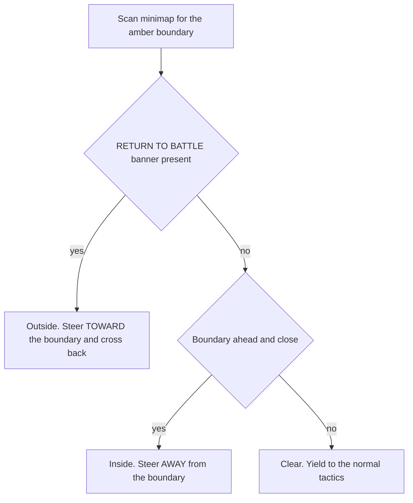

# Design 010 — Map Boundary Guard

| Status | Date       | Wingman Version |
|--------|------------|-----------------|
| Draft  | 2026-08-30 | 1.8.7           |

> `StepN` refers to the PNG files beside this document, e.g. Step0 is
> `docs/hldd/010-mini-map-detection/Step0_FLYING_AWAY_FROM_EDGE.png`.
>
> **The four frames are from different maps**, and Step1 is a night map. The
> minimap background therefore changes from frame to frame. This is not
> incidental to the design — it is what makes the evidence below worth
> anything, and it is what rules out the obvious alternative.

## Problem

Wingman flies out of the playable area and is ejected.

The current minimap logic (Design 003 / ADR 028, `engage_nav.py`) steers toward
enemy contacts on the assumption that *flying toward enemies keeps you inside
the map*.

**That assumption is sound as far as it goes.** Battle clusters near the centre,
so tracking contacts does bias the aircraft inward, and a working navigator
prevents a real share of edge approaches. The problem is not that the idea is
wrong — it is that the navigator is silent exactly when the aircraft needs it.

ADR 028's mode table, row 4: *no enemies detected — Idle, no command.* With no
contacts the navigator issues nothing and the aircraft holds its heading
indefinitely. Counting enemy blobs on each frame with the configured
`enemy_hsv` bounds inside the minimap mask:

| Frame | enemy blobs | navigator mode |
|-------|------------:|----------------|
| Step0 (flying away) | 0 | Idle — no command |
| Step1 (**at the boundary**) | **0** | **Idle — no command** |
| Step2 (already outside) | 3 | would steer, too late |

At Step1 — the last moment a turn could have saved the aircraft — there is
nothing on the minimap to track, so no amount of fixing ADR 028 produces a
command. The failure happens in the navigator's blind spot, not in its logic.

Step2 is the mirror image: three contacts appear, and they lie back toward the
map, so the navigator would steer inward — correctly, but with five seconds left
on the countdown.

Two consequences follow. Contacts near the edge actively pull the aircraft
outward, since the navigator has no term opposing them. And "battle is typically
central" is a statement about the common case, while ejection is a tail event; a
guard exists for the tail.

When this was written there was no boundary signal anywhere in the codebase —
no crop, no detector, no tactic; `grep` for `RETURN TO BATTLE` returned nothing.
The detectors described under *Implementation status* below have since been
added, but they only **measure**: no tactic in the selector takes horizontal
position as an input, so nothing yet steers on the boundary. Climb (ADR 073)
keys on altitude alone, Engage on enemy contacts, and Regroup (ADR 028 rev 4) on
friendly icons — a proxy for the battle's location, not for the map edge.

### The sequence

| Step | State | What is on screen |
|------|-------|-------------------|
| Step0 | Flying away from the edge | Boundary line visible on the minimap, behind the aircraft |
| Step1 | Flying toward the edge | Boundary line directly under the aircraft icon — the last moment to act |
| Step2 | Crossed the edge | `RETURN TO BATTLE: 5` banner; five seconds left |
| Step3 | Did not return | `EJECTED`; the aircraft is destroyed |

By Step2 the round is effectively lost: five seconds is not enough to turn a
jet at 1866 km/h around and re-cross. **The guard has to act at Step1 or
earlier**, which means it must run off the minimap, not off the banner.

*(Step3's filename says `RETURN_TO_BATTLE`, but the frame actually shows
`EJECTED` — it is the consequence, not another warning frame.)*

## The rotation question, resolved

The draft asked whether minimap rotation interferes with orientation detection.
It does not — it is the reason this is tractable.

The minimap is **heading-up**: the own-ship icon is fixed at the centre pointing
up, and the compass letters rotate around the rim (N left in Step0, N top-right
in Step1, N bottom in Step2). So *up on the minimap is always where the aircraft
is going*.

That removes the hard part. The guard never needs absolute heading, never needs
to read the compass, and never needs to know which way is north. It needs one
number: **where is the boundary relative to straight ahead?** Rotation delivers
that for free on every frame.

## Signals, measured

Three candidate signals were measured against the four frames before any design
was committed. Two survive, one does not.

### 1. The boundary polyline — works, and is the primary signal

The boundary is drawn as a thin amber polyline. Masking HSV
`(8,120,120)-(28,255,255)` inside the minimap circle, then taking the amber
pixel nearest the centre, with forward measured as `-y` and distances in units
of the minimap radius `R`:

| Frame | amber px | nearest distance | forward offset | reading |
|-------|---------:|-----------------:|---------------:|---------|
| Step0 | 589 | 0.59 R | **−0.59 R** (behind) | safe |
| Step1 | 623 | **0.10 R** | +0.09 R (ahead) | act now |
| Step2 | 439 | 0.62 R | +0.61 R (ahead) | already outside |

Step0 and Step1 separate cleanly on the sign of the forward offset, and again on
distance. This is the measurement the guard is built on.

**The mask survives the map change**, which is the property that matters most.
Measuring the masked pixels' own colour against the minimap background they sit
on, across three different maps including a night one:

| Frame | background V | background S | line H | line S | line V |
|-------|-------------:|-------------:|-------:|-------:|-------:|
| Step0 | 113.0 | 51.9 | 16.9 | 132.6 | 145.8 |
| Step1 (night) | **66.6** | 46.1 | 18.5 | 179.5 | 141.2 |
| Step2 | 118.4 | 53.7 | 17.6 | 138.6 | 146.5 |

The background brightness spans 66.6 to 118.4 — a factor of 1.8, day to night,
sea to forest — while the line holds hue 16.9 to 18.5 (a spread of 1.6 out of
180) and value 141 to 147. The boundary is a HUD overlay drawn at a constant
colour, not part of the terrain, so it does not care what the map looks like.

Step3 is a useful negative: its background is both the brightest and by far the
most saturated of the four (V 137.4, S 113.8) and the mask returns **one pixel**.
Bright, colourful terrain does not trip it.

### 2. Terrain shading — tested and rejected

The region beyond the boundary *looks* darker by eye, which suggested a cheap
brightness proxy for inside-versus-outside. Measured over an annulus of the
minimap interior, it does not hold:

| Frame | mean V, whole | mean V, forward | mean V, rear | forward minus rear |
|-------|--------------:|----------------:|-------------:|-------------------:|
| Step0 (inside) | 113.4 | 118.7 | 108.2 | +10.5 |
| Step1 (inside, at edge) | 66.5 | 70.9 | 62.0 | +8.9 |
| Step2 (**outside**) | 118.1 | 113.3 | 122.9 | −9.6 |

Step2 is *outside* and reads **brighter** than Step1, which is inside. The
forward-minus-rear differences are ±10 counts and do not separate the cases
either.

The reason is structural, not a matter of tuning: **these are different maps, and
Step1 is at night.** Absolute brightness encodes which map you are on and what
time of day it is, and the boundary contributes far less than either. No
threshold over a quantity dominated by map and lighting can answer a question
about geometry.

**Do not use brightness.** It is recorded here because it is the obvious idea
and it is wrong; the next person to look at these frames will have the same
hypothesis.

### 3. The `RETURN TO BATTLE` banner — works, but only as a backstop

A saturated red plate at approximately `x 0.36-0.64`, `y 0.32-0.378`:

| Frame | red plate fraction |
|-------|-------------------:|
| Step0 | 0.007 |
| Step1 | 0.000 |
| Step2 | **0.390** |
| Step3 (`EJECTED`) | 0.000 |

Unambiguous when present. But it appears only *after* the crossing, with the
countdown already running, so it cannot prevent anything. It has two real uses:
as the **inside/outside gate** (below), and as ground truth for validating
signal 1.

`EJECTED` occupies the same screen position with a dark plate rather than a red
one, so the crops collide. Distinguish by OCR text, as the rest of wingman does,
not by plate colour alone.

## The sign hazard

Signal 1 alone is not enough, and getting this wrong makes things worse.

In Step1 the boundary is **ahead at 0.10 R** and the aircraft is inside: the
correct response is *turn away from it*. In Step2 the boundary is also **ahead**,
at 0.61 R, but the aircraft is outside: the correct response is the exact
opposite — *fly toward it and cross back*.

A naive "boundary ahead, turn away" rule flies a Step2 aircraft further out and
guarantees the ejection it was meant to prevent. The response sign must be
gated on whether the aircraft is inside, and the only reliable inside/outside
signal measured here is the banner.



## Implementation status

The **instrumentation is built and running**; the guard is not. Nothing steers
on the boundary yet. This split was deliberate: the question "did the ADR 028
change reduce boundary crossings?" was unanswerable at any soak length because
nothing counted them, so counting came first.

| Component | State | Cost |
|-----------|-------|------|
| `analyzer.detect_map_boundary` | Built | 0.24 ms per tick |
| `analyzer.detect_return_to_battle` | Built, colour trigger | 0.07 ms per tick |
| `analyzer.confirm_return_to_battle_async` | Built, OCR arbiter | 63 ms, once per crossing, off-thread |
| Pre-crossing trace buffer | Built, 20 ticks | negligible |
| Boundary **guard** (steering) | **Not built** | — |

Reproduced on the four frames exactly as measured above, including `EJECTED`
correctly not matching the banner.

### Why the banner is colour-triggered and OCR-arbitrated

The obvious alternative — OCR the banner every tick, sharing the `incoming`
crop — was measured and rejected. The regions do not overlap: `incoming` is
`x 0.4521-0.5486, y 0.2667-0.2967`, the banner is `x 0.36-0.64, y 0.32-0.378`,
about 28 px apart at 1200p with the banner three times wider.

Merging them is possible but costly, and narrowing the merge to make it cheap
breaks the detection that keeps the aircraft alive:

| Crop | Size | OCR | INCOMING detected |
|------|------|----:|-------------------|
| `incoming` alone | 185x36 | 41 ms | yes |
| merged at incoming width | 185x133 | 131 ms | yes |
| merged, narrowed to 115 px | 115x133 | 106 ms | **no** |

"INCOMING" is wider than 115 px, so the narrow merge clips it. Preserving it
costs 41 to 131 ms **on every tick, permanently**, on the missile-to-flare path,
to catch an event that happens about once per mission. Over a 200-tick mission
that is ~18 s of extra OCR on the critical path against ~0.4 s for the colour
trigger plus one confirmation.

So: colour decides in 0.07 ms and drives the counting; OCR confirms once per
crossing and **arbitrates the count**, retracting a crossing it cannot confirm.

### Partial tokens are required, not an optimisation

The confirmation reads a narrower slice than the colour test (63 ms against
123 ms for the full banner). Narrowing degrades edge characters — measured
reads include `ETURNTOBATTLE:` and, at 153 px, `JRNTOBATTE`. Full-string
matching would reject banners that are plainly present, so the tokens are
partial, as the `incoming` crop already does with `MING` / `ARNING`.

A 115 px slice reads `RNTOBAT` in 36 ms and is **not** adopted: the countdown
digit shifts the centring and there is one banner frame to validate against.

### What the instrumentation caught immediately

The first live crossing was a **false positive**, and the trace buffer diagnosed
it in one read:

```
t=199.9  Climb   alt 5430  alt_rate -450.9
t=201.4  Eject   alt 4030  alt_rate -716.0
t=202.9  Idle    outside: true   <- "crossing"
```

The aircraft had ejected with no missiles, and the colour test fired one tick
later on the **fireball** — bright red, centre screen, exactly where the banner
sits. `EJECTED`'s dark plate does not match; an explosion does.

Two fixes followed. Detection is gated on actually flying (`GAME_BATTLE`, not
`Eject` or `RespawnWait`, not respawning) rather than chasing a red-fraction
threshold a fireball would eventually beat. And the OCR arbitrates the count, so
an unconfirmed crossing is retracted instead of inflating the figure the tuning
depends on.

Without the trace this would have been a silent `+1` in the baseline.

### Known gap: misses are invisible

The OCR only runs **when colour has already fired**, so it catches
over-counting and cannot catch under-counting. If a real banner ever renders
below the red-fraction threshold — a different countdown state, a variant
plate, heavy overlay — nothing reports it. The threshold is calibrated on a
single banner frame.

Closing it needs either more banner samples or a low-rate periodic OCR sweep
while in battle, which costs one read every N seconds rather than every tick.

## Design

A `BoundaryGuard`, mirroring `engage_nav.py`: pure decision logic, no threads, no
I/O. The tick loop feeds it the minimap crop and the telemetry speed; it returns
an intent that the tick handler and `Controller` actuate.

### Measurement, per tick

1. Mask amber inside the minimap circle at `mask_radius_frac`, reusing the
   existing `_minimap_circle_mask` helper.
2. Take the nearest masked pixel to the centre. Record its distance `d/R` and
   its bearing relative to straight ahead.
3. Convert to a **time to edge** using the OCR'd speed, so the trigger is a
   duration rather than a pixel count. A fixed pixel threshold means something
   different at 400 km/h and 1900 km/h; Step2 was taken at 1866 km/h.
4. Smooth the vector the way `MinimapEma` already does for contacts — smooth the
   `(x, y)` offset, never the bearing angle, which cannot be averaged across the
   ±180° wrap.

### Response

- **Inside, time-to-edge below the threshold**: roll and pull toward the half of
  the minimap the boundary is *not* in, hold until the boundary's forward offset
  is negative with a hysteresis margin.
- **Outside** (banner present): steer to put the boundary dead ahead and hold
  until the banner clears.
- **Clear**: return `none` and let the normal tactic selection run.

Hysteresis on both edges. Without it the guard chatters against `Engage`, which
is pulling the other way by construction.

### Where it sits in the tactic order

Current selector, highest first: `Idle`, `RespawnWait`, `Eject`, `MissileEvade`,
`Evade`, `Disengage`, `Engage`, `AttackSupport`.

Proposed: **immediately after `MissileEvade`**.

- Above `Engage` and `AttackSupport` necessarily — those are what fly it out of
  the map.
- Above `Evade` and `Disengage`: both are health-driven and run for a bounded
  hold, and an aircraft that evades across the boundary is ejected anyway.
- Below `MissileEvade`: a missile kills in a couple of seconds, the boundary
  gives a countdown. Losing the aircraft to a missile while dodging the edge is
  the worse trade.

This ordering is a judgement call and should be revisited against live data.

## Configuration

Proposed additions under the existing `minimap:` section:

| Key | Meaning |
|-----|---------|
| `boundary_hsv_lower` / `boundary_hsv_upper` | Amber mask bounds; defaults from the measurement above |
| `boundary_warn_s` | Time-to-edge that arms the guard |
| `boundary_clear_s` | Time-to-edge that disarms it — must exceed the warn value |
| `boundary_min_px` | Minimum masked pixels to trust a reading |
| `enabled` | Off by default until validated live, following ADR 098 D6 |

No tuning values in this document — they belong in `config.yaml`.

## Failure modes

| Failure | Consequence | Handling |
|---------|-------------|----------|
| Boundary occluded by icons or the FOV cone | Missed detection, late turn | Require `boundary_min_px`; fall back to the banner |
| Amber matched on terrain or an icon | Spurious turns away from nothing | Restrict to the minimap circle; require a spatially coherent run of pixels, not a scattered count |
| Map with no boundary in view | No reading at all | Absent signal is not "safe"; hold the previous state until EMA reset |
| Banner missed while outside | Guard turns the wrong way | The sign hazard above. Prefer no action to a wrong-signed action |
| Guard fights `Engage` | Oscillation, no progress | Hysteresis plus a minimum hold, as `MinimumHold` already does for evade |

## Validation

- **V1** Unit: the three measured frames classify as safe / act-now / outside.
- **V1b** Unit: the same HSV bounds detect the line on all three, which are
  different maps — the night frame is the one that would break a mask tuned
  to daylight.
- **V2** Unit: with the banner present, the intent steers *toward* the boundary.
- **V3** Unit: a scattered amber count below `boundary_min_px` yields no reading.
- **V4** Unit: hysteresis — a reading oscillating around the threshold produces
  one arm and one disarm, not a stream.
- **V5** Live: a session that previously ejected on boundary crossings completes
  with zero `RETURN TO BATTLE` banners observed. **Blocked on a baseline** —
  the only crossing counted so far was the eject false positive, so there is
  no trustworthy before-figure yet.
- **V6** Live: no regression in engage behaviour — contacts are still pursued
  when the boundary is not close.
- **V7** Telemetry: log every arm and disarm with distance, speed and computed
  time-to-edge, so the thresholds can be tuned from real sessions rather than
  from these four frames. **Done** for approaches and crossings, including a
  20-tick pre-crossing trace; the guard's own arm/disarm awaits the guard.
- **V8** The count is trustworthy: every crossing is OCR-confirmed, and an
  unconfirmed one is retracted and counted separately as a false positive.
  **Done, 2026-08-30.**
- **V9** Detection does not fire during eject, respawn, or outside
  `GAME_BATTLE`. **Done, 2026-08-30** — the fireball case above.

## Open questions

1. **Turn radius.** The trigger threshold needs the aircraft's turn performance
   at speed. Unknown; measure before choosing `boundary_warn_s`.
2. **Is the boundary always amber?** Largely answered: it held across three
   different maps including a night one, at hue 16.9 to 18.5. That is strong but
   not exhaustive — confirm on any map with an amber or orange terrain palette,
   such as desert, where the background could approach the mask bounds.
3. **Countdown duration.** Step2 shows 5 at the moment of capture; the starting
   value is unknown and bounds any recovery attempt.
4. **Does the boundary curve significantly within the minimap?** Nearest-pixel
   treats it as locally straight, which the frames support but do not prove.
5. **Altitude ceiling.** The same eject mechanic may apply vertically; out of
   scope here, but the guard is the natural home if so. This matters beyond
   this document: a proposal to hold sustained vertical climbs as a combat
   tactic would trade a horizontal ejection for a vertical one if a ceiling
   exists. Cheap to settle — climb until the banner appears, or confirm it
   does not.
6. **How much does a working ADR 028 cover?** The navigator and this guard are
   complementary, not alternatives. ADR 028 revision 4 gave the no-contact
   ticks a command via Regroup, which is now reachable and selected in
   production. What remains unmeasured is whether that is *sufficient* — the
   crossings-per-mission figure with Regroup on versus off. The instrumentation
   above exists to answer exactly that, and until it has run, building the
   guard would be building against an unmeasured need.
7. **Does Regroup help when it is most needed?** Step2 — already outside — had
   **4 enemy icons and 0 friendly**. Regroup would have had no signal there.
   The guard's blind spot and Regroup's are not the same shape, which is the
   argument for eventually having both.

## References

- Design 003 / ADR 028 — ring-engage navigation, the logic this constrains
- `wingman/engage_nav.py` — the module this mirrors in shape
- `wingman/analyzer.py` — `_minimap_circle_mask`, `_scan_minimap_components`
- ADR 073 — climb tactic, the most recent example of adding a tactic to the tree
- ADR 098 D6 — the precedent for shipping a new guard disabled until validated
