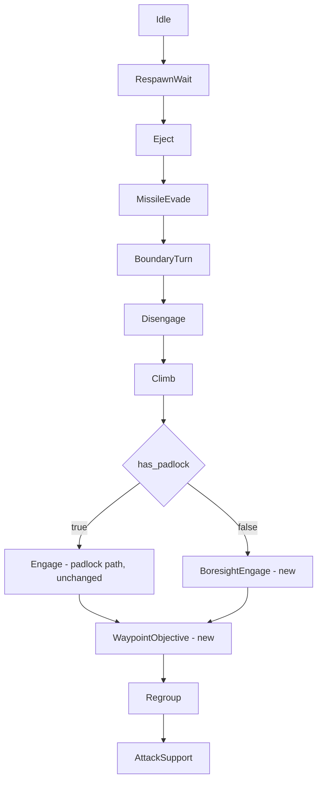
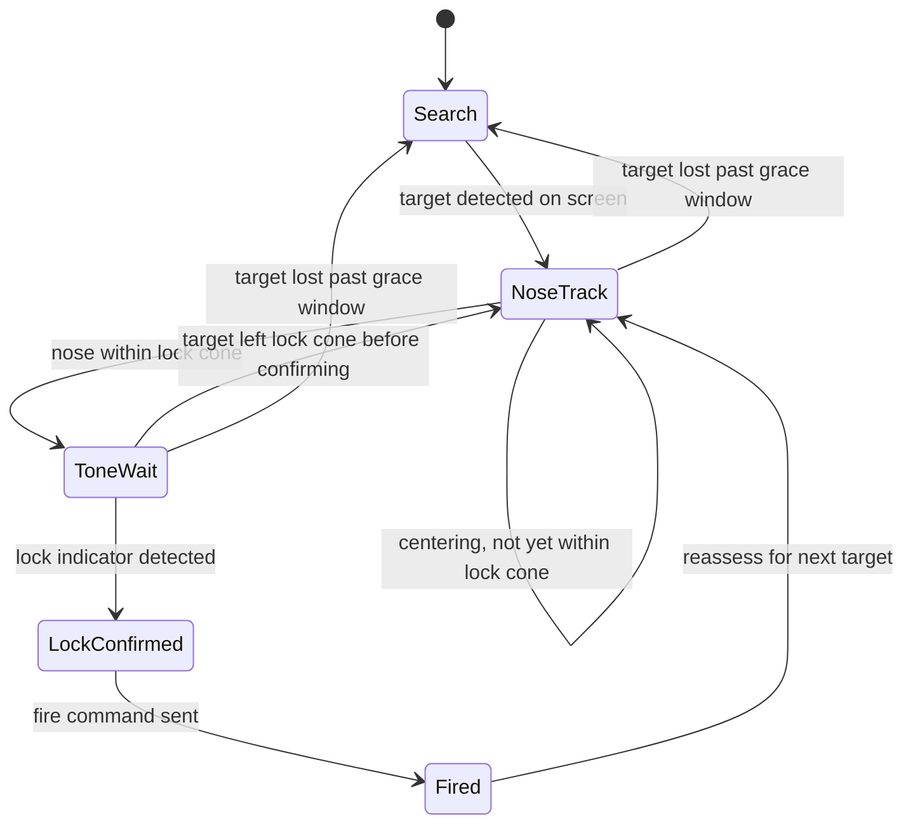
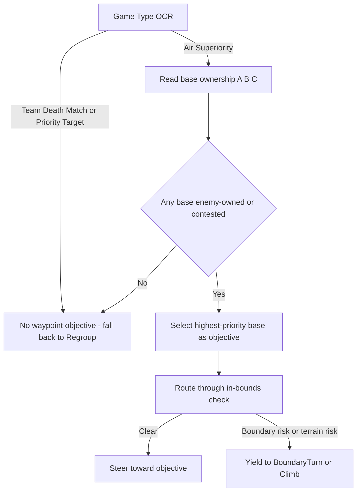

# Design 011 — ACS Mode: Boresight-Class Autonomy Core

| Status | Date       | Wingman Version |
|--------|------------|-----------------|
| Draft  | 2026-09-05 | 1.8.8           |

## Overview

Every combat capability Wingman has today assumes the J-20's padlock camera: a
single key press keeps the camera (and, functionally, the weapon-lock cue)
pointed at whatever target the game itself has chosen, and `search_and_destroy_loop`
just has to keep pressing padlock and pulling the trigger. Most other airframes
in the game have no padlock-equivalent all-aspect lock. They require the pilot
to point the aircraft's own nose at the target, hold it there until a
tone/reticle confirms a weapon lock, and only then fire.

**ACS Mode** (Autonomy Core System mode — named after the decision-making core
of the real-world "Loyal Wingman" autonomous escort programs) is the
generalized, jet-class-aware decision layer that makes boresight-only
airframes flyable by Wingman. It is not a new autonomy stack built alongside
the existing one — it is three missing behaviors plumbed into the ADR 024
behavior tree that already runs every tick, plus one flag that tells the tree
which weapon-employment tactic a given airframe supports:

1. **Boresight engagement** — point the nose at a target, wait for lock, fire.
   New.
2. **Target prioritization from live game events** — decide *which* contact
   to point at. Partially exists (`engage_nav.py` minimap ring logic).
3. **Waypoint/objective selection** — decide where to fly when not actively
   engaging (air-superiority base capture, capture-the-flag routing). Design
   exists on paper (Design 004) but was never implemented and predates the
   current tactic-tree architecture.
4. **Terrain avoidance** — must remain true throughout 1–3. Design exists on
   paper (Design 001) but was never implemented; today's actual terrain/altitude
   safety net is a different, later mechanism (SAF-011/012 ground-collision
   plus the `BoundaryTurn` tactic), which itself has known, currently-unsolved
   effectiveness problems (ADR 107, ADR 126).

This document defines how those four pieces fit together, which existing
designs each one supersedes or extends, and — per the user's explicit ask —
calls out exactly what is unfinished or unproven in each and must be refined
before ACS Mode can fly live.

---

## Problem Statement

The behavior tree (`wingman/behavior_tree.py`, ADR 024/070/073) already
generalizes flight-safety decision-making across tactics (`MissileEvade`,
`BoundaryTurn`, `Climb`, `Disengage`, `Regroup`) via a shared
`AnalyzerSnapshot` and a priority selector. Only one tactic in that tree,
`Engage`, is combat-specific, and it is not really a tactic at all in the
same sense — it is a thin wrapper around `search_and_destroy_loop`, which
hard-codes the padlock assumption two layers down (`padlock_camera()`,
`padlock_target_switch()`).

Nothing in the current design distinguishes "the airframe I'm flying" from
"the airframe the whole codebase was written for." There is no config flag,
no `AnalyzerSnapshot` field, and no branch anywhere that asks "does this jet
have all-aspect lock." Adding a boresight-capable jet today would mean
forking `search_and_destroy_loop` rather than extending a policy.

Symmetrically, there is no existing concept of "where should I fly when
nothing is in weapons range." `EngageNavigator` (Design 003) closes toward
whatever red blob appears on the minimap — which happens to keep the
aircraft roughly inside the arena (FR-005) but is not waypoint selection in
any game-mode-aware sense, and it is documented as measurably contributing
to the boundary-turn's ineffectiveness (ADR 107: `Engage`'s long-ring pursuit
chases contacts toward the edge). Design 004's base-ownership/game-type
objective logic was drafted for exactly this gap and never built.

## Goals

1. Introduce a per-airframe **weapon-lock capability flag** so the tree can
   select `BoresightEngage` instead of the padlock-based `Engage`/`search_and_destroy_loop`
   path without touching jet-agnostic tactics (`MissileEvade`, `BoundaryTurn`,
   `Climb`, `Eject`).
2. Define a **boresight lock-and-fire sequence**: acquire a target in screen
   space, roll/pitch the nose onto it, hold through a lock-confirmation
   signal, fire, reassess.
3. Extend target **prioritization** to react to live game events (new
   incoming threat, teammate under attack, base contested) rather than
   always steering at the nearest minimap blob.
4. Define **waypoint/objective selection** for air-superiority (base capture)
   and capture-the-flag game modes, reusing Design 004's mission-type gating
   but as a single-instance tactic rather than a squad-coordination feature.
5. State plainly what terrain-avoidance guarantee ACS Mode can actually rely
   on today, and what must change before waypoint-driven flight (which, unlike
   reactive combat, deliberately points the aircraft at chosen ground
   coordinates for extended periods) can trust it.
6. Follow the project's established rollout discipline (ADR 070/073 template):
   shadow-selection logging before any new key is ever pressed.

## Non-Goals

1. Full 3D missile-guidance modeling or a physics-based intercept solution.
   Boresight targeting here is the same class of screen-space, proportional
   controller already used elsewhere in the codebase (Design 005's roll
   controller, `EngageNavigator`'s bearing controller) — not a new control
   theory.
2. Multi-instance squadron coordination. Design 004's emote-driven
   deconfliction (Captain commands, anti-stack policy across multiple AI
   instances) is out of scope here; ACS Mode's waypoint tactic is written for
   **one** instance choosing its own objective. Squad coordination remains a
   separate, later design that could sit on top of this one (see Open
   Questions).
3. Rebuilding terrain avoidance from scratch in this document. This design
   states the dependency and the current gap; the actual sensing/actuation
   redesign (if forward-scan terrain avoidance per Design 001 is still the
   right approach, versus doubling down on fixing `BoundaryTurn`) is its own
   follow-on ADR.
4. Support for every airframe in the game. V1 targets one representative
   boresight-only jet to validate the mechanism, mirroring how `MissileEvade`
   and `Climb` were each validated on one condition before generalizing.

---

## Relationship to Existing Work

ACS Mode is an assembly of mostly-existing parts. This table is the key
design decision in this document: what to reuse untouched, what to extend,
and what is genuinely new.

| ACS capability | Existing design | Status found | Disposition |
|---|---|---|---|
| Screen-space target detection and centering | Design 005 (`005-target-tracking-hldd.md`) | Drafted 2026-06-26, `tracking.enabled: false` in config, never validated live | **Extend.** This is the sensing and roll-controller core of boresight engagement. Needs pitch added (Design 005 was roll-only, "Non-Goals: pitch/yaw control loops") and a lock-confirmation signal added (see below). |
| Coarse target selection / steering toward contacts | Design 003 (`003-enemy-quadrant-detection-hldd.md`, now "ring-engage navigation") + `wingman/engage_nav.py` | Implemented, live-validated, backs FR-005 | **Reuse as coarse layer.** Keeps its role: get the nose roughly toward a contact from long range. Boresight's fine tracker (Design 005) takes over once a target is in-frame, exactly as Design 003's doc already states ("both actuate through the same `orient_nose_to_target`... the terminal loop wins"). |
| Weapon employment / fire discipline | `search_and_destroy_loop`, `padlock_camera()`, `target_painting_mode` | Implemented, padlock-only | **New parallel path**, not a modification. `BoresightEngage` fires only on a confirmed lock signal; padlock jets keep their existing path unchanged. |
| Waypoint / objective selection (air superiority, base capture) | Design 004 (`004-strike-package-bravo-hldd.md`) | Drafted 2026-05-06, never implemented, written for multi-instance squad play | **Extend, single-instance subset.** Reuse the game-type detection, base-ownership crops, and priority-of-targets logic; drop the emote-command layer (Non-Goal above). |
| Terrain avoidance | Design 001 (`001-terrain-avoidance-hldd.md`) | Drafted 2026-05-03, never implemented | **Gap — see "Terrain Avoidance" below.** Neither adopted nor formally superseded; the codebase evolved a different mechanism instead. |
| Tactic-selection architecture | ADR 024 behavior tree, `AnalyzerSnapshot`, `ConditionTactic`/`MinimumHold`, ADR 070/073 rollout template | Implemented, actively used, the load-bearing pattern for every tactic added since | **Reuse as-is.** ACS Mode adds tactics and snapshot fields to this tree; it does not introduce a second decision framework. |
| In-bounds flight while pursuing objectives | `BoundaryTurn` (ADR 107/113/120/122/125/126) | Implemented, but measured **zero net range gain over 61+ turns** (ADR 107) and found to rotate ~294 degrees per turn — nearly a full circle — with no reliable distance improvement (ADR 126) | **Load-bearing risk.** Waypoint flight leans on this far harder than reactive combat does; see Refinement Backlog. |

---

## Architecture

### Jet profile flag

A single new config concept lets the tree branch on airframe capability
without special-casing any jet-agnostic tactic:

```yaml
jet_profile:
  active: j20
  profiles:
    j20:
      has_padlock: true
    generic_boresight:
      has_padlock: false
```

`has_padlock` is read once at mission start and stored on the snapshot
(`AnalyzerSnapshot.has_padlock: bool`), the same way `mission_running` or
`survival_hold` already gate tactics at the actuation layer per ADR 110's
precedent (condition stays evaluated for diagnostics; actuation is what's
gated). `MissileEvade`, `BoundaryTurn`, `Climb`, `Eject`, `RespawnWait` read
nothing new — they are correct for any airframe today and stay untouched.

### New and changed tactics



Priority order is otherwise the existing ADR 107/109-114 ladder, unchanged.
`BoresightEngage` occupies the same priority slot `Engage` holds today,
selected instead of it purely on `has_padlock`. `WaypointObjective` is new
and sits where `Regroup` used to be the only "nothing to shoot" behavior;
`Regroup`'s existing no-enemy steer-to-friendly-icon behavior becomes a
fallback for when `WaypointObjective` has no objective to offer (game type
not recognized, or objective crops unreadable).

---

## Functional Design

### 1. Boresight lock-and-fire sequence (new)



- **Search / NoseTrack**: directly Design 005's sensing and roll controller,
  extended with a **pitch** channel using the same proportional-with-deadband
  law against vertical screen-space error, so the nose closes on the target
  in both axes instead of roll-only.
- **Lock cone**: a config'd `abs(error_norm_x) <= lock_cone_x` and
  `abs(error_norm_y) <= lock_cone_y` band, tighter than the tracking
  deadband — the aircraft must be pointed at the target, not merely rolling
  toward it, before the design waits for a lock.
- **ToneWait / LockConfirmed**: this is the one piece with **no existing
  detection at all** in the codebase. It requires identifying whatever
  on-screen lock indicator this airframe's HUD shows (a reticle color
  change, a lock box, a tone-equivalent HUD glyph — needs a reference
  screenshot pass the same way Design 005's marker colors were derived from
  `P2_050_RESPAWN_CLEAR_HEALTH_ALIVE_MISSILES_4.png`). Until that signal
  exists, `BoresightEngage` cannot fire safely — see Refinement Backlog.
- **Fired**: reuses the existing `fire_active_weapon()` / ammo-reserve gating
  from `_start_search_and_destroy_locked()`'s weapon loop rather than a new
  firing primitive; only the *decision to fire* (lock-confirmed vs.
  padlock-active) differs between the two engagement tactics.
- Every actuating state that presses a maneuver key must bracket it with the
  project's programmatic-key convention
  (`_inc_programmatic_key`/`_arm_release_grace`/`_dec_programmatic_key`) so
  SAF-001 manual-takeover detection is never confused by the nose-tracker's
  own key echoes — the same requirement Design 005 already calls out and
  that every tactic since ADR 070 has had to satisfy.

### 2. Target prioritization from live game events

Today's target selection is purely geometric: `EngageNavigator` picks
whichever ring (short/mid/long) is occupied. ACS Mode needs prioritization
that reacts to *events*, not just position:

- **Threat response**: `incoming_detected` (already on the snapshot, feeding
  `MissileEvade`) should also bias target selection — a contact that just
  fired should outrank a passive one at the same range. This is a new read
  of an existing signal, not a new sensor.
- **Objective relevance**: in air-superiority/CTF modes, a contact near the
  currently-selected waypoint objective (see below) should outrank an
  equidistant contact elsewhere, so `BoresightEngage` doesn't pull the
  aircraft away from the base it's trying to hold.
- **Reuse, not replacement**: `EngageNavigator`'s ring/bearing plumbing stays
  as the coarse layer (per the Relationship table above); prioritization
  changes *which* contact feeds that pipeline, not how the pipeline steers.

### 3. Waypoint / objective selection

Single-instance subset of Design 004:



Reused from Design 004 unchanged: game-type OCR gating, `BASE_A_STATUS` /
`BASE_B_STATUS` / `BASE_C_STATUS` crop family, ownership-priority resolution
(enemy-owned before contested before neutral). Dropped from Design 004:
emote parsing and the anti-stack squad-split policy — both are meaningless
with one instance and reintroducing them is future multi-instance work, not
this design.

Capture-the-flag routing is the same shape (an objective marker to route
toward, read from whatever CTF-mode UI element indicates flag/carrier
status) but needs its own crop-family definition; no prior HLDD covers CTF
specifically, so that detection work is net-new, not an extension.

### 4. Terrain avoidance — current gap

This is the one capability where "extend an existing design" is not
actually true today, and ACS Mode should not paper over that.

Design 001 proposed a dedicated 15 Hz forward-view HSV terrain scanner
setting a `_terrain_avoiding` flag that other loops check. **It was never
implemented.** What the codebase actually built instead, later and for a
different reason (ground-collision, not terrain-masking-ahead), is:

- **SAF-011 / SAF-012**: predicted-time-to-ground recovery based on altitude
  and descent rate — reactive, not a forward terrain scan.
- **`BoundaryTurn`** (ADR 101/107/108/113/120/122/125/126): keeps the
  aircraft inside the arena edge, not away from terrain features inside it.

Neither mechanism does what Design 001 set out to do (see ahead and steer
around terrain before it becomes a ground-collision emergency), and Design
004 explicitly lists Design 001 as a **hard gate** ("this mode is only
active when... terrain avoidance from Design 001 is enabled and healthy").
That gate has never been satisfiable. ACS Mode inherits the same problem one
level up: `WaypointObjective` deliberately points the aircraft at chosen
ground coordinates for extended periods (loitering over a base circle,
routing toward a flag), which is exactly the flight profile terrain-masking
was meant to protect. Reactive ground-collision recovery (SAF-011/012) can
catch a dive; it cannot prevent flying into a ridge while banked toward an
objective.

**This design does not resolve that gap.** It records it as the single
highest-priority item in the Refinement Backlog below, and states plainly:
`WaypointObjective` must not be enabled outside terrain-flat map regions (if
any are known) until either Design 001 is implemented, or an explicit
follow-up ADR accepts the current SAF-011/012 + `BoundaryTurn` combination
as sufficient and formally supersedes Design 001's gate.

---

## Refinement Backlog

Ordered by what blocks ACS Mode from being safe to try live at all, not by
effort:

1. **Terrain avoidance has no forward-looking mechanism.** (See above.) This
   blocks `WaypointObjective` specifically — reactive combat tactics
   (`MissileEvade`, `Climb`, `BoundaryTurn`) don't newly depend on it, but
   deliberately routing toward a fixed ground objective does.
2. **`BoundaryTurn` does not reliably increase distance from the edge.**
   ADR 107 measured +0.000R median gain over 61 turns; ADR 126 found the
   turn rotates ~294 degrees — nearly a full circle — rather than
   converting rotation into a real course change. `WaypointObjective`
   routes the aircraft toward chosen coordinates for longer, uninterrupted
   stretches than reactive `Engage` ever did, so it will drive more boundary
   encounters, not fewer. This should be re-verified fixed (or explicitly
   accepted as a known limitation with a mitigation, e.g. keeping objective
   points conservatively inland) before `WaypointObjective` ships.
3. **No lock-confirmation signal exists.** `ToneWait`/`LockConfirmed` above
   is the one piece of `BoresightEngage` with zero prior art in this
   codebase — it needs a reference-screenshot pass (same method as Design
   005's marker-color derivation) against the target boresight-only
   airframe to find whatever visual lock cue its HUD shows.
4. **Design 005's tracker has never been enabled or live-validated.**
   `tracking.enabled: false` in shipped config; it is roll-only (no pitch);
   its own Open Questions are unanswered ("should tracking output feed
   behavior-tree blackboard inputs directly?" — yes, now, via
   `AnalyzerSnapshot`, which didn't exist in its current form when Design
   005 was drafted). Bringing it up to a validated baseline is a
   precondition for `BoresightEngage`, not something ACS Mode can assume
   already works.
5. **No game-mode or per-jet config exists yet.** `jet_profile` and the
   air-superiority/CTF objective crops above are all new config surface,
   none calibrated. Standard calibration-tooling work
   (`make calibrate-crop`), not a design risk, but real effort before any
   of this runs against a live match.
6. **Design 004's base-ownership crops were placeholders.** ("crop
   coordinates are placeholders and require calibration by monitor/device" —
   Design 004 itself.) Never calibrated against a real Air Superiority
   match.

---

## Configuration Additions

```yaml
jet_profile:
  active: j20
  profiles:
    j20:
      has_padlock: true
    generic_boresight:
      has_padlock: false

acs_mode:
  enabled: false
  boresight:
    lock_cone_x: 0.08
    lock_cone_y: 0.08
    lock_confirm_frames: 3
    lock_lost_grace_sec: 0.5
    pitch_deadband: 0.05
    pitch_kp: 0.30
    pitch_min_hold_sec: 0.08
    pitch_max_hold_sec: 0.35
  target_priority:
    incoming_threat_bonus: 2.0
    objective_proximity_bonus: 1.0
  waypoint:
    game_type_crop:
      coords:
        - [0.36, 0.08]
        - [0.64, 0.14]
      text: [TEAM DEATH MATCH, PRIORITY TARGET, AIR SUPERIORITY]
    base_status_crops:
      BASE_A_STATUS:
        coords: [[0.18, 0.10], [0.28, 0.18]]
      BASE_B_STATUS:
        coords: [[0.45, 0.10], [0.55, 0.18]]
      BASE_C_STATUS:
        coords: [[0.72, 0.10], [0.82, 0.18]]
    require_terrain_avoidance: true
```

`require_terrain_avoidance: true` is a deliberate default, not a placeholder
— it encodes the Refinement Backlog item 1 gate directly in config so the
tactic cannot be turned on live by accident while that dependency is open.

---

## Safety and Requirements Impact

New requirements this design implies (drafted here, to be authored formally
in `docs/requirements/` per the project's StrictDoc process once
implementation begins):

- **A boresight fire-discipline requirement**, parallel in spirit to how
  FR-006/FR-007 formalized `MissileEvade`/`Climb`: wingman shall not fire a
  boresight-locked weapon unless `LockConfirmed` has been true for at least
  `lock_confirm_frames` consecutive reads, so that a fleeting reticle-color
  false-positive cannot trigger a shot with no lock.
- **An extension to SAF-001's manual-takeover scope**: today's programmatic-key
  bracketing covers roll and existing pitch tactics (`Climb`); boresight
  nose-tracking adds continuous, higher-frequency pitch *and* roll
  actuation together, and must not weaken manual-takeover responsiveness
  during that combined actuation.
- **`require_terrain_avoidance` as a formal safety gate** for
  `WaypointObjective`, the same role Design 004 already assigned Design 001
  — this should become a SAF requirement once Design 001's fate (implement
  vs. formally supersede, per the Terrain Avoidance section) is decided,
  not left as config-only enforcement.

No existing SAF/FR requirement is weakened by this design: `has_padlock: true`
airframes take zero code-path changes, and every jet-agnostic safety tactic
(`MissileEvade`, `Climb`, `Eject`, `BoundaryTurn`) is reused unmodified.

---

## Rollout Plan

Follows the ADR 070/073 template exactly, since that template is the
project's proven method for landing a new tactic without a live regression:

1. **Shadow first.** Add `BoresightEngage` and `WaypointObjective` as
   selection-only `ConditionTactic` entries (no `actuators` entry) so their
   selection is logged every tick against real matches before any key is
   ever pressed. Validates target-detection and objective-detection
   reliability independent of control-loop tuning.
2. **Dry-run the control loop.** Enable Design 005's tracker (pitch added)
   in log-only mode — compute and log roll/pitch commands without sending
   them — exactly as Design 005's own Validation Strategy step 2 already
   specifies.
3. **Actuate in isolation** against one boresight-capable airframe, with
   `lock_confirm_frames` and lock-cone sizes deliberately conservative, and
   `WaypointObjective` still disabled (`acs_mode.waypoint` gated separately
   from `acs_mode.boresight` so the two new capabilities can be validated
   independently).
4. **Enable waypoint routing** only after Refinement Backlog items 1 and 2
   are closed or explicitly accepted with a mitigation.
5. Capture before/after evidence the way ADR 070 did (A/B survival or
   engagement-rate comparison with n reported), not estimates.

---

## Open Questions

1. Should `has_padlock` be detected automatically (from which mission-start
   key/UI the game shows) or configured manually per session? Automatic
   detection avoids operator error but adds another OCR dependency to an
   already OCR-heavy startup path.
2. Is a single boresight lock-cone sufficient for the first target airframe,
   or does its HUD expose distinct "in range" vs. "tone" cues that should be
   modeled as separate states rather than one `ToneWait`?
3. Should `WaypointObjective`'s target-base selection share the priority
   scoring function with `target_priority`'s air-to-air scoring, or are
   base-selection and enemy-selection different enough problems to warrant
   separate, independently-tunable policies?
4. If Design 001's terrain scanner is built to unblock `WaypointObjective`,
   does it get promoted to a jet-agnostic safety tactic in the main
   priority ladder (benefiting `Engage`/`BoresightEngage` too), or does it
   stay scoped as an `acs_mode`-only gate?
5. Multi-instance squadron coordination (Design 004's original emote-driven
   scope) was declared out of scope here — should it be revisited as a
   layer on top of this design once single-instance `WaypointObjective` is
   validated, per the roadmap's already-stated "Multi-Agent Track"?

---

## Related Documents

- `docs/hldd/001-terrain-avoidance-hldd.md` — undelivered forward-terrain
  scan; gap analyzed above.
- `docs/hldd/003-enemy-quadrant-detection-hldd.md` — implemented coarse
  target-steering layer this design reuses.
- `docs/hldd/004-strike-package-bravo-hldd.md` — source of the waypoint/base
  ownership design this document takes a single-instance subset of.
- `docs/hldd/005-target-tracking-hldd.md` — source of the screen-space
  tracking and roll-controller design this document extends with pitch and
  a lock-confirmation state.
- `docs/adr/024-phase3-behavior-tree-architecture.md` — priority selector
  this design adds tactics to.
- `docs/adr/027-j20-target-painting-mode.md`,
  `docs/adr/028-enemy-quadrant-detection-and-nose-orientation.md` — prior
  nose-orientation and weapon-mode work Design 005 also cites.
- `docs/adr/070-missile-evade-tactic.md`, `docs/adr/073-*-climb-tactic*.md` —
  rollout template this design's Rollout Plan follows.
- `docs/adr/107-boundary-turn-tactic.md`,
  `docs/adr/122-turn-away-from-the-edge-not-always-right.md`,
  `docs/adr/125-measure-whether-the-turn-turns.md`,
  `docs/adr/126-the-turn-was-flying-a-circle.md` — evidence behind the
  `BoundaryTurn` risk cited in the Refinement Backlog.
- `docs/requirements/001-safety.sdoc` (SAF-001, SAF-010, SAF-011, SAF-012),
  `docs/requirements/002-functional.sdoc` (FR-005, FR-006, FR-007).
- `docs/PROJECT_AI_ROADMAP.md` — "Multi-Agent Track: Squad and Swarm
  Tactics" section, relevant to Open Question 5.
