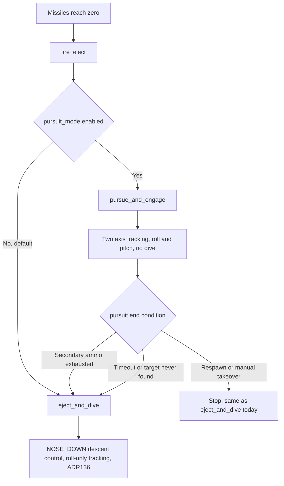

# Design 015 — Target-Tracking Pursuit Mode: A Switchable Alternative to Eject-and-Dive

| Status | Date       | Wingman Version |
|--------|------------|-----------------|
| Draft  | 2026-09-21 | 1.8.11          |

## Overview

Today, the moment primary missiles hit zero, `AmmoEventsHandler.fire_eject()`
(`wingman/tick_handlers.py:1019-1033`) unconditionally calls
`Controller.eject_and_dive()`: switch to secondary weapons (ADR 136), dive
the airframe into the ground, and trade it for a rearmed respawn. This
design adds a second strategy for that same trigger — **pursuit mode**:
switch to secondary weapons, then use Design 005's full two-axis tracker
(roll and pitch, `wingman/hldd/005-target-tracking-hldd.md`'s 2026-09-21
revision) to actively aim the nose at the nearest enemy and fire, without
diving. The two strategies are mutually exclusive and selected by one
config flag at the same trigger point, so a session can run either one, and
later sessions can compare them, without an operator choosing per-dive.

This document does not claim pursuit mode is better than eject-and-dive. It
exists to make that an answerable, measured question instead of an assumed
one — see Validation Strategy.

---

## Problem Statement

Eject-and-dive's rationale is explicit and load-bearing, not incidental.
ADR 106: *"Eject exists to trade an empty airframe for a rearmed one, and
dying is the point."* ADR 109: *"an aircraft with no missiles is worth
trading for a rearmed one, and the dive is how the trade is made."* ADR 136
extracts extra value from that dive — switch to two heat-seekers, roll
toward whatever the tracker selects, fire — but it does so **inside** a
maneuver whose pitch axis is already spoken for: `_eject_descent_control`
(ADR 069) holds `NOSE_UP_KEY`/`NOSE_DOWN_KEY` for the whole dive to reach
and hold a target dive angle (65°), and ADR 058's dive-confirmation
criterion depends on a cumulative real-hold-time measurement that assumes
it is the only thing pressing that key. ADR 136 D1 step 2 is explicit that
this is deliberate: the heatdive addition "never touches pitch." So today,
the tracker's aim during a missiles-empty event is permanently one-axis —
it can roll toward a target but can never point the nose up or down at one,
because the axis that would do that is committed to a different, unrelated
job (dive-angle hold) for the entire encounter.

The operator's proposal is to stop trying to run both jobs on the same axis
at once, and instead make them alternatives: an aircraft that pursues
targets with both axes free, or an aircraft that dives with both axes
committed to the descent — never both, per encounter, by construction. That
sidesteps the axis conflict without a coordination protocol, but it trades
away ADR 106/109's own strategy (fast, deliberate loss for a fast rearm) for
a different one (extend the empty airframe's life, unarmed of anything but
two heat-seekers, in the hope of landing a kill first) — a real strategic
bet, not a strict improvement, and one this document does not resolve by
assertion.

---

## Goals

1. Add a second, config-selectable strategy for the missiles-empty trigger:
   pursue and engage with both tracking axes, instead of diving.
2. Make the two strategies mutually exclusive at the exact point they
   already share (`fire_eject()`), so there is exactly one branch to keep
   in sync, not two independent trigger paths that could race.
3. Reuse Design 005's sensing and both controllers (`orient_nose_to_target`,
   `orient_pitch_to_target`) as-is — no new control law.
4. Give pursuit mode an explicit termination condition, since unlike a dive
   it has no natural endpoint ("reaches the ground").
5. Emit comparable telemetry to eject-and-dive (HUD, log lines, outcome
   counters) so session-over-session comparison needs no new tooling.
6. Ship shadow-first, exactly like every other addition in this codebase
   (ADR 070, ADR 073, ADR 136, HLDD 013) — off by default, measured before
   trusted.

## Non-Goals

1. **Not a replacement for eject-and-dive.** Both remain selectable; nothing
   about `eject_and_dive()`'s own trigger, termination, or descent-control
   logic changes.
2. **Not a fix or successor to Two-Axis Rollout's own validation ladder**
   (`005-target-tracking-hldd.md`). Pursuit mode is a *consumer* of that
   ladder reaching a validated pitch channel, not a shortcut around it — see
   Safety and Gating Rules. It cannot ship enabled before that does.
3. **Not boresight lock-confirmation.** Fires the same continuous-hold,
   no-lock-needed way ADR 136 D1 step 4 already established for the
   secondary loadout — no `ToneWait`/`LockConfirmed` state, same reasoning
   HLDD-011 already gives for why heat-seekers don't need it.
4. **Not HLDD-011's `BoresightEngage`.** That is the general, jet-agnostic,
   event-prioritized boresight-engagement design. This is a narrow,
   single-purpose extension of one J-20 trigger event, the same relationship
   ADR 136 already has to HLDD-011 (an earlier, narrower proof point, not a
   substitute).
5. **Not an automatic decision between the two strategies.** V1 is one
   static config flag, not a policy that picks per-encounter based on
   context (enemy count, altitude, ammo). A dynamic chooser is a later,
   separate design if the data ever supports building one.

---

## Relationship to Eject-and-Dive



The one new decision point is `SEL`, inside `fire_eject()`. Both branches
are still gated by everything `handle_no_missiles` already gates on (mission
running, `GAME_BATTLE`, not mid-respawn, post-spawn/post-respawn grace
windows) — none of that changes.

**Pursuit mode's own end condition always falls through to eject-and-dive,
not to idle flight.** This preserves ADR 106/109's core guarantee — an
empty airframe never keeps flying indefinitely defenseless — while still
giving pursuit mode its shot first. See Decision D3 below for why this is
the default rather than "resume normal flight."

---

## Functional Design

### D1. Trigger and selection

`fire_eject()` (`tick_handlers.py:1019`) branches on a new flag,
`pursuit_mode.enabled` (default `false`), instead of unconditionally calling
`eject_and_dive`:

```python
def fire_eject(self) -> None:
    self._emit_capture_event("missiles_empty")
    self._analyzer.trigger_event("eject_started")
    if self._pursuit_mode_enabled:
        self._ctrl.pursue_and_engage(on_complete=...)
    else:
        self._ctrl.eject_and_dive(on_complete=...)
```

Both still transition through `GAME_BATTLE_EJECT` via the same
`eject_started`/`eject_complete` triggers (`analyzer.py:806-807`) — pursuit
mode is a different *behavior* inside that state, not a different FSM
state. This means it inherits, for free, every place that already gates on
`GAME_BATTLE_EJECT`: the HUD-blackout fix (HLDD 005, 2026-09-21) applies
identically once wired the same way (D5 below), and nothing that currently
special-cases "the aircraft is diving" needs a second special case for "the
aircraft is pursuing" — both read as the same state to the rest of the
system.

### D2. New Controller method: `pursue_and_engage`

Structurally mirrors `eject_and_dive`'s init (`cancel_mission()`,
`_eject_weapon_switched` reset, the same `switch_weapon()` call bracketed
with the programmatic-key convention) but **does not** start
`_eject_descent_control` — no `NOSE_DOWN` pulses, no dive-angle target, no
ADR 058 confirmation logic. Instead, one loop (same shape as
`_eject_heatdive_loop`, `controller.py:2191-2233`, reused conventions, new
method) that every cycle:

1. Captures a frame, calls `TargetTracker.update(frame)`.
2. Calls **both** controllers — `orient_nose_to_target(obs["error_norm"])`
   *and* `orient_pitch_to_target(obs["error_norm_y"])` — the one caller in
   the whole codebase allowed to use the pitch channel unconditionally,
   because nothing else is contesting `NOSE_UP_KEY`/`NOSE_DOWN_KEY` here
   (see Safety and Gating Rules).
3. Fires on the same fixed cadence, same fail-open ammo read, same
   stop-when-`get_ammo_missiles()`-reads-0 rule ADR 136 D1 step 4 already
   established — reused exactly, not reimplemented.
4. Renders HUD via the same `self._hud_renderer` reference the eject
   heatdive loop now uses (HLDD 005, 2026-09-21 fix) — `state_name` is a
   distinct literal, `"PURSUIT_MODE"`, so the two are distinguishable in the
   log and on the HUD.

All key presses use `ignore_cancel=True`, same reasoning as
`_eject_heatdive_loop`: `cancel_mission()` has already set
`self._mission_cancel` for the whole call before this loop starts.

### D3. Termination

Unlike a dive, pursuit mode has no physical endpoint. Three conditions end
it, each mapped to what happens next:

| Condition | Detection | Next action |
|---|---|---|
| Secondary ammo exhausted | `get_ammo_missiles() == 0`, same debounced read `_eject_heatdive_loop` already uses | **Fall through to `eject_and_dive`** — the airframe is now in exactly the state ADR 106/109 designed for (empty, no upside left in staying up), so the existing, validated trade-for-rearm strategy takes over rather than leaving the aircraft to fly on unarmed. |
| `pursuit_max_duration_s` elapsed with no kill confirmed | wall-clock timer, own config key | Same fall-through to `eject_and_dive` — a bounded worst case, so a target-never-found session cannot fly the empty, exposed airframe indefinitely. **Off since 2026-09-24 (shipped value 0 = no cap, operator: "after a 20 second chase do not dive, continue searching and pursuing").** Only a positive value restores it; see "No time cap" below. |
| Respawn detected / manual takeover / shutdown | same `self._eject_stop` event every other eject-adjacent loop already watches | Stop immediately, identical to `eject_and_dive`'s own external-cancellation path — no fall-through, since the aircraft is already gone or the operator already has it. |

The ammo-exhausted and timeout paths **do not** skip eject-and-dive's own
gating — falling through calls `eject_and_dive` the normal way, so if a
respawn or manual takeover raced in during pursuit mode, the fall-through
call simply finds itself already cancelled and no-ops, the same as any
other `eject_and_dive` call would.

### D4. Padlock

Reuses `Controller.ensure_padlock_off`/`detect_padlock_off` exactly as
ADR 136 D4 left them: available, unit-tested, **disabled by default**
(`heatdive_padlock_verify`-equivalent flag for pursuit mode) because the
underlying detector was found to track flight-attitude drift rather than
padlock state (ADR 136 D4's own recalibration write-up). Not re-solved
here — inherits the same open item.

### D5. HUD wiring

`Controller.set_hud_renderer()` (added for the eject heatdive loop, HLDD
005 2026-09-21) is reused directly — no new setter, no new reference to
wire from `main.py`. `pursue_and_engage`'s loop calls
`self._hud_renderer.maybe_render(frame, obs, "PURSUIT_MODE", health, ammo,
flares)` the same way `_eject_heatdive_loop` calls it with
`"GAME_BATTLE_EJECT"`.

---

## Safety and Gating Rules

**Hard precondition: this cannot ship enabled before Design 005's Two-Axis
Rollout reaches at least Phase 2 (live pitch actuation validated on the
ambient path).** Pursuit mode is an *extended*, *primary* live consumer of
the pitch channel — not a brief shadow check. Shipping it before pitch has
any live-actuation history at all would mean the first real pitch actuation
this codebase ever performs happens inside a new, unvalidated mission
behavior, compounding two unknowns (does pitch actuation behave sensibly at
all; does pursuit mode as a strategy work) into one trial with no way to
separate them if it goes wrong. `pursuit_mode.enabled` must stay `false` in
shipped config until that precondition is met and recorded (a dated note in
this document, not a silent flip).

**2026-09-23 — enabled anyway, precondition not met.** `pursuit_mode.enabled`
was flipped `true` in shipped config by explicit, repeated direct operator
instruction, given after this precondition and the specific risk above were
raised in conversation. Two-Axis Rollout was, at the time, still at Phase 1:
`tracking.actuate_pitch` remained `false`, and no session log to date
contained a single `nose_up`/`nose_down`/`orient_pitch` call from tracking.
This note exists so that fact stays visible here rather than being implied
false by a silent flag flip — the precondition itself is unchanged and still
describes the risk this decision accepted, not a standard that was met.

**Pursuit mode is the one caller allowed to use the pitch channel without
restriction — this is not a special case, it is why the axis conflict
disappears.** `orient_pitch_to_target` is barred from `eject_and_dive`
specifically because `_eject_descent_control` already owns
`NOSE_UP_KEY`/`NOSE_DOWN_KEY` there. `pursue_and_engage` never starts
`_eject_descent_control` at all, so there is no second owner to conflict
with. If a future change ever made pursuit mode call into any part of
`eject_and_dive`'s descent machinery, this exclusivity argument would need
re-examining — it does not today, since D2 is a clean, separate method.

**Manual takeover, survival hold, and shutdown all pre-empt pursuit mode**
via the same `self._eject_stop` event and `cancel_mission()` path every
other eject-adjacent loop already uses (D3, external-cancellation row) — no
new interrupt mechanism, per the precedent ADR 135 already established
against parallel, ungated key-press paths.

**Turn guard and boundary safety are unaffected.** Pursuit mode only ever
runs from inside `fire_eject()`'s call graph, same as eject-and-dive today
— it does not touch `_PRIORITY_ORDER`, `BoundaryTurn`, or any behavior-tree
tactic. An open question (below) is whether a *long-running* pursuit
(bounded by `pursuit_max_duration_s`) could drift toward the arena edge with
nothing watching for it, the way HLDD 013 found `TACTIC_ATTACK_SUPPORT`
already could.

**A dive recovery flies through the chase (ADR 148, operator, 2026-09-25).** The two-writer case above was fatal in the
00:03 session: both chases ended in the ground. A climb hold used to release on any game state other than `GAME_BATTLE`, and a
pursuit lives in `GAME_BATTLE_EJECT`, so the tree's emergency recovery (24 airbrake holds started, 38 holds released after 0.3 s
in five minutes) was a nudge every 1.5 s while the chase kept writing pitch and roll. Now a hard emergency (time to ground or
terrain, not the altitude floor) flies through the state for up to `pursuit_mode.recovery_max_s` (30 s), and the chase releases
both axes, including the search roll, until it ends, then steers again. The weapon switch that preceded the first crash was
unrelated: the target had just been destroyed. Not yet verified live.

**Altitude in the chase (ADR 147, operator, 2026-09-24).** Nothing in pursuit steers altitude except the behavior
tree's hard altitude floor, and a floor climb is only a nudge in this state: a climb hold releases itself in
`GAME_BATTLE_EJECT` (136 `state_exit` releases in the 18:57 session, 52 of them after 0.3 s). So the chase settles on
the floor and bounces there: median chase altitude 3544 to 4609 m across the four sessions of 2026-09-24, with all 31
`ALTITUDE FLOOR` events citing 4000 m. For `mission_su30` the floor is now 3000 m (`su30_mission.alt_floor_m`) and the armed
sustain climb stands aside, so the chase is expected to search near 3000 m; every other mission keeps 4000 m. Not yet
measured after the change: `make sr` prints the chase altitude, the floor values cited and how often the script's
-10 degree step was not confirmed (24 of 26 hand-offs before).

---

## Configuration Additions

```yaml
pursuit_mode:
  enabled: false                 # hard-gated — see Safety and Gating Rules
  pursuit_max_duration_s: 20.0   # named guess; shadow trial should correct it
  pursuit_padlock_verify: false  # inherits ADR 136 D4's disabled default
  # Roll/pitch gains are NOT duplicated here — pursue_and_engage reads
  # tracking.deadband/kp/... and tracking.pitch_deadband/pitch_kp/... directly,
  # the same config Design 005 already owns, for the same reason HLDD 011's
  # acs_mode.boresight stopped duplicating them (2026-09-21 reconciliation):
  # a second copy of the same numbers would drift from the one Design 005's
  # own shadow trial tunes.
```

`config_schema.py` additions: a new `pursuit_mode` Section with `enabled:
BOOL`, `pursuit_max_duration_s: SECONDS`, `pursuit_padlock_verify: BOOL` —
no new `Leaf` patterns needed, all three types already exist for sibling
keys elsewhere in the schema.

### Later additions (2026-09-23 and 2026-09-24)

Four keys were added after this design was written, each documented where its
evidence lives rather than here (the extra one is `search_resume_centre_err` /
`search_resume_centre_delay_s`, a two-key extension of `search_resume_delay_s`):

- `ammo_zero_grace_s` (12.0): the HUD ammo count lags a weapon switch by seconds,
  so a 0 read soon after the switch is not an empty secondary.
- `search_resume_delay_s` (2.0): how long a miss after a lock holds the roll axis
  neutral before the ROLL_LEFT search resumes; see Design 005, "Search-Resume
  Delay".
- `empty_confirm_reads` (3): consecutive ammo==0 reads before the deferred weapon
  switch (below) presses the toggle key.

**Deferred weapon switch.** `pursue_and_engage(defer_switch_until_empty=True)` is
the form `mission_su30` uses (ADR 144 D4, revised 2026-09-24). It presses no
`SWITCH_WEAPON` at its start and leaves `_eject_weapon_switched` alone, pursues
with whichever weapon is selected, and switches once when that weapon has read
empty for `empty_confirm_reads` cycles. Only after that switch does the
ammo-zero fall-through apply, with `ammo_zero_grace_s` measured from the switch.
If `pursuit_max_duration_s` ends the encounter first, the fall-through calls
`eject_and_dive(defer_switch_until_empty=True)`: the dive presses no switch and its
heatdive loop switches once when the selected weapon is empty (the same rule, the
same confirmation). This replaced a first version that let the dive make its own
switch, which switched away from a loaded rack on every capped pursuit (operator,
2026-09-24). The default form, used by the missiles-empty trigger, is unchanged.

**No time cap (operator decision, 2026-09-24).** `pursuit_mode.pursuit_max_duration_s` ships as `0`,
which means no cap: the pursuit keeps searching (roll, and pitch once it has a lock) and firing until the
ammo is exhausted, when it still falls through to `eject_and_dive` to trade for a rearmed airframe, or
until a respawn, takeover or shutdown stops it. Until then every life ended its pursuit at 20 s and dived
whether or not a target had been found. Consequences found while making the change:

- **The Anomaly 003 detector would have ended recording sessions.** It treats GAME_BATTLE_EJECT with no
  descent running for 40 s as stuck, and a pursuit has no descent. `Controller.eject_flight_active()`
  (descent or pursuit) is now what `main.py` passes it.
- **Nothing time-limits the eject state otherwise:** an alive-health event ends it only after an observed
  death (`_alive_transition_disposition`).
- **Exposure, now open (question 3 below):** no behavior-tree tactic acts inside GAME_BATTLE_EJECT
  except Climb's terrain emergency, so a long search is guarded against terrain but not against the arena
  edge, and a search that only rolls flies straight. Measured over 50 pursuits with boundary readings:
  they started a median 0.37 minimap radii from the boundary (minimum 0.06), 13 of 50 showed the
  boundary ahead and under 0.3 away at some point, and the worst closing rate (-0.010 per second) would
  reach a boundary 0.5 away in about 50 s. An out-of-bounds warning has not been seen in a pursuit (the
  one on record, 17:32 on 2026-09-24, was at a life's start in normal battle, where the boundary turn
  handled it), but pursuits were at most 20 s.
- **Recorded numbers change meaning.** The pooled 5.8% (pursuit) and 11.5% (dive) locked-scan baselines
  were measured with 20 s pursuits; `end=cap` no longer appears in `PURSUIT SUMMARY` lines.

**Engagement summary line (Cycle 7, 2026-09-24).** Each pursuit, and each dive's heatdive
loop, ends with one INFO line, `PURSUIT SUMMARY:` or `DIVE SUMMARY:`, for example
`PURSUIT SUMMARY: end=cap dur=20.1s scans=61 locked=9 (15%) first_lock=8.4s ammo=6->2
switched=no`. `end` is `cap`, `ammo`, `external:<reason>` (pursuit) or `dive-end` or
`external:<reason>` (dive); `locked` counts scans on which the tracker reported a lock;
`first_lock` is the time to the first one (`-` for none); `ammo` is the first and last raw
HUD reading, so across a rack switch the last figure belongs to the other rack, and
`switched=yes` says this loop pressed the switch. Logging only, nothing reads it. It exists
because the pursuit's outcome could otherwise only be rebuilt from DEBUG `TRACKPICK` lines
and `Ammo missiles:` transitions, and that rebuild counts a rack switch as a 6-to-2
"launch"; the same tracker gave 5% locked scans in one session and 15% in the next, so a
per-engagement denominator has to be logged, not reconstructed. Tests:
`tests/test_engagement_summary.py` and the `summary` tests in `test_pursuit_mode.py` and
`test_eject_heatdive.py`.

Live check (12:05-12:46 run, wingman 1.8.11): the lines appear at INFO from the first
engagement (12:09:48 pursuit, 12:11:17 dive), with `end=` seen as `cap`, `external:match_ended`
(4 pursuits, a round ending during the pursuit), `dive-end` and `external:respawn_detected` (10
dives). Over the run's 20 pursuits and 16 dives: pursuits with any lock 2 (10%), locked scans
25 of 1,046 (2%), 2 launches by first-to-last raw reading; dives with any lock 13 (81%), locked
scans 256 of 1,968 (13%), 12 launches by the same measure. No weapon-switch press: no rack emptied.

**A pursuit-versus-dive contrast the lines make visible (measured, cause not established).**
Pooled over the four sessions since 08:42, locked scans are 200 of 3,454 in pursuit (5.8%) and
820 of 7,102 in the dive (11.5%). Altitude does not explain it: at equal altitude the dive still
locks more often (2,500-3,500 m: pursuit 46 of 538, 8.6%, dive 238 of 1,585, 15.0%; 3,500-5,000
m: pursuit 154 of 2,749, 5.6%, dive 415 of 2,885, 14.4%; scans with an altitude reading within
4 s). What is left untested: time in the life (the pursuit starts soon after the climb, the dive
20 s or more later, when fights may have come closer) and attitude (the dive is nose-down with
afterburner, the pursuit rolls left with no pitch while searching). The two cannot be separated
from these logs. Launches per 100 locked scans were not clearly different (pursuit 12 launches in
189 locked scans, dive 25 in 584, in the four sessions), so a lock in the dive is not less useful.

---

## Validation Strategy

Shadow-first, matching this codebase's standing convention, with one
addition specific to comparing two live strategies rather than validating
one:

1. **Unit.** `fire_eject()`'s branch selects the right method for each flag
   value; `pursue_and_engage` never starts `_eject_descent_control`; all
   three termination paths (ammo, timeout, external cancel) call the right
   next action; HUD renders with `"PURSUIT_MODE"` and the eject heatdive
   loop's own tests are unaffected (regression, not new behavior for it).
2. **Shadow.** With `pursuit_mode.enabled: false` (shipped default), no
   behavior changes at all — this section exists so a reviewer can confirm
   that claim directly rather than infer it.
3. **Gate check.** Before `pursuit_mode.enabled` is ever flipped `true` in a
   real session, confirm Two-Axis Rollout Phase 2 has already been reached
   and recorded (Safety and Gating Rules' hard precondition) — this is a
   go/no-go read of a *different* document's status, not something this
   design's own tests can enforce automatically.
4. **A/B measurement, once the gate above is met.** Alternate
   `pursuit_mode.enabled` across sessions (or halves of a session, if
   session length allows) and compare, using metrics this codebase already
   tracks — no new instrumentation needed:
   - kills-per-life and kills-per-hour (`MissionStatsTracker`, ADR 055),
   - time from missiles-empty to next `respawn_detected`,
   - `total_rtb_with_missiles`/boundary-turn frequency, in case an extended
     pursuit drifts toward the edge more than a short dive does (Open
     Question 3).
   The success criterion is a session-over-session comparison with a
   reported sample size, the same bar ADR 070's evade trial and HLDD 013's
   Phase 1 both already set — not a single anecdotal kill.

---

## Open Questions

1. Should the ammo-exhausted and timeout fall-through both go to
   `eject_and_dive`, or should the timeout case instead just resume normal
   `mission_j20` flight (still unarmed) on the theory that a target-never-
   found timeout means no enemies were nearby, so diving gains less than it
   costs? Decided here as "always fall through" (D3) for safety-first
   symmetry with ADR 106/109; revisit if data suggests otherwise.
2. Is 20 seconds a reasonable `pursuit_max_duration_s`, or does that need
   tuning against how long the two secondary heat-seekers actually take to
   both fire in practice? Named as a guess in Configuration Additions, not
   measured. **Answered by the operator, 2026-09-24: no cap (0).**
3. Does an extended, both-axes-committed pursuit drift toward the arena
   boundary more than a brief dive would, given nothing in `pursue_and_engage`
   watches `BoundaryTurn`'s own signal? HLDD 013 already found
   `TACTIC_ATTACK_SUPPORT` idle in exactly this kind of gap; pursuit mode is
   a different code path but a similar shape of risk. Flagged, not answered
   — the A/B measurement's boundary-turn-frequency metric (Validation
   Strategy item 4) is what should answer it. **Now live (2026-09-24):** with
   the time cap removed nothing bounds a pursuit's duration; see "No time
   cap" in Configuration Additions for the measured exposure and what
   guards exist.
4. Should target selection during pursuit mode reuse Design 005's existing
   nearest-to-last/nearest-to-center persistence rule as-is, or would the
   extra time (versus a brief dive window) justify more willingness to
   switch targets? Deferred to live data, same as Design 005's own Open
   Question 4 (ADR 136) already deferred this for the dive case.
5. Should Selection Hardening's Phase 2/3 ranked-candidate fix
   (`005-target-tracking-hldd.md`) land before or independently of pursuit
   mode? They touch the same selection code but are otherwise unrelated;
   no ordering dependency is assumed here, but shipping both around the
   same time makes it harder to attribute a session's outcome change to
   either one individually — a reason to sequence them, not a technical
   blocker.

---

## Related Documents

- `docs/hldd/005-target-tracking-hldd.md` — sensing and both controllers
  this design consumes directly; its Two-Axis Rollout section is this
  design's own hard precondition (Safety and Gating Rules).
- `docs/adr/106-return-to-battle-rate-tracking.md`,
  `docs/adr/109-eject-yields-to-the-survival-hold.md` — source of the
  "trade an empty airframe for a rearmed one" rationale this design
  weighs against, not replaces.
- `docs/adr/136-heatseeker-dive-invokable-mode.md` — the existing
  roll-only, dive-concurrent extraction of value from the same trigger;
  `eject_and_dive` and its `_eject_heatdive_loop` are reused/mirrored by,
  not modified by, this design.
- `docs/adr/069-eject-impulse-rotation-and-ballistic-descent.md`,
  `docs/adr/058-eject-dive-confirmation-via-raw-descent-rate.md` — source
  of the pitch-axis ownership `pursue_and_engage` avoids conflicting with
  by never starting descent control at all.
- `docs/adr/135-disengage-roll-ignored-manual-takeover.md` — precedent for
  reusing a single shared stop event rather than inventing a parallel
  interrupt path.
- `docs/hldd/011-acs-mode-hldd.md` — the general, jet-agnostic boresight
  design this remains a narrower, earlier proof point for, same
  relationship ADR 136 already has to it.
- `docs/hldd/013-minimap-center-seeking-navigation-hldd.md` — source of the
  shadow-first phased-rollout convention and the `TACTIC_ATTACK_SUPPORT`
  idle-gap precedent cited in Open Question 3.
- `docs/adr/055-mission-level-statistics-tracker.md` — source of the
  kills-per-life/kills-per-hour metrics this design's A/B measurement
  reuses.
