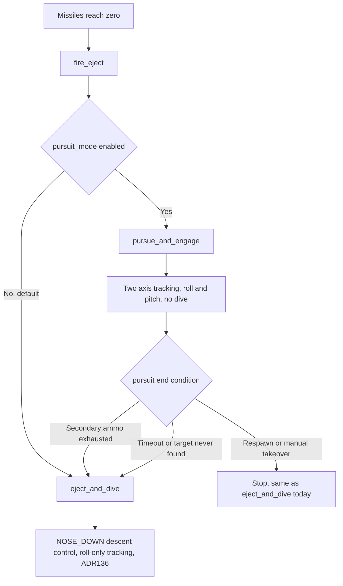
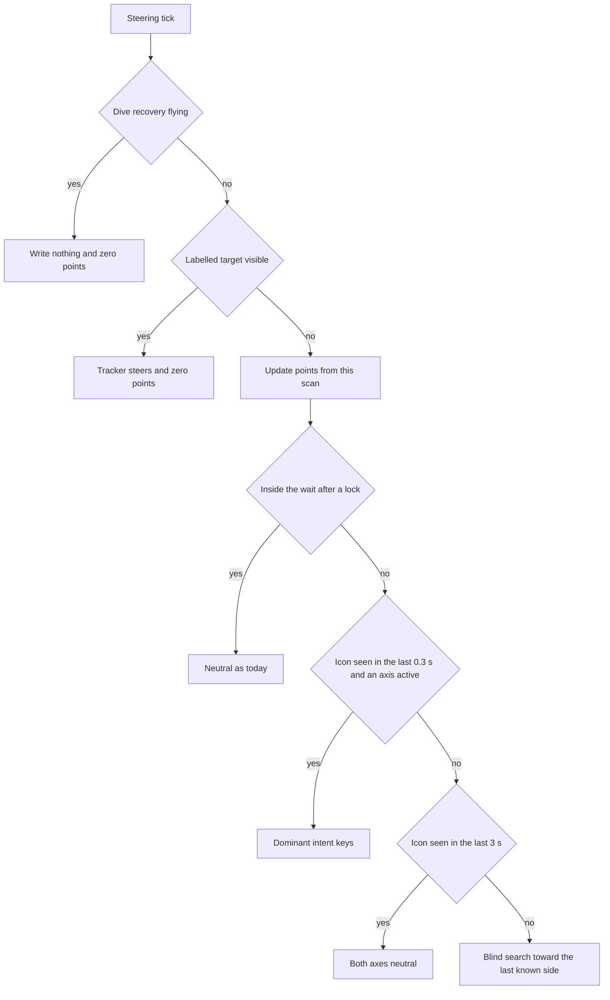

# Design 015 — Target-Tracking Pursuit Mode: A Switchable Alternative to Eject-and-Dive

| Status | Date       | Wingman Version |
|--------|------------|-----------------|
| Draft  | 2026-09-21 | 1.8.11          |

## Overview

Today, the moment primary missiles hit zero, `AmmoEventsHandler.fire_eject()`
(`wingman/tick_handlers.py:1019-1033`) unconditionally calls
`Controller.eject_and_dive()`: switch to secondary weapons (ADR 136), dive
the airframe into the ground, and trade it for a rearmed respawn. This
design adds a second strategy for that same trigger — **pursuit mode**:
switch to secondary weapons, then use Design 005's full two-axis tracker
(roll and pitch, `wingman/hldd/005-target-tracking-hldd.md`'s 2026-09-21
revision) to actively aim the nose at the nearest enemy and fire, without
diving. The two strategies are mutually exclusive and selected by one
config flag at the same trigger point, so a session can run either one, and
later sessions can compare them, without an operator choosing per-dive.

This document does not claim pursuit mode is better than eject-and-dive. It
exists to make that an answerable, measured question instead of an assumed
one — see Validation Strategy.

---

## Problem Statement

Eject-and-dive's rationale is explicit and load-bearing, not incidental.
ADR 106: *"Eject exists to trade an empty airframe for a rearmed one, and
dying is the point."* ADR 109: *"an aircraft with no missiles is worth
trading for a rearmed one, and the dive is how the trade is made."* ADR 136
extracts extra value from that dive — switch to two heat-seekers, roll
toward whatever the tracker selects, fire — but it does so **inside** a
maneuver whose pitch axis is already spoken for: `_eject_descent_control`
(ADR 069) holds `NOSE_UP_KEY`/`NOSE_DOWN_KEY` for the whole dive to reach
and hold a target dive angle (65°), and ADR 058's dive-confirmation
criterion depends on a cumulative real-hold-time measurement that assumes
it is the only thing pressing that key. ADR 136 D1 step 2 is explicit that
this is deliberate: the heatdive addition "never touches pitch." So today,
the tracker's aim during a missiles-empty event is permanently one-axis —
it can roll toward a target but can never point the nose up or down at one,
because the axis that would do that is committed to a different, unrelated
job (dive-angle hold) for the entire encounter.

The operator's proposal is to stop trying to run both jobs on the same axis
at once, and instead make them alternatives: an aircraft that pursues
targets with both axes free, or an aircraft that dives with both axes
committed to the descent — never both, per encounter, by construction. That
sidesteps the axis conflict without a coordination protocol, but it trades
away ADR 106/109's own strategy (fast, deliberate loss for a fast rearm) for
a different one (extend the empty airframe's life, unarmed of anything but
two heat-seekers, in the hope of landing a kill first) — a real strategic
bet, not a strict improvement, and one this document does not resolve by
assertion.

---

## Goals

1. Add a second, config-selectable strategy for the missiles-empty trigger:
   pursue and engage with both tracking axes, instead of diving.
2. Make the two strategies mutually exclusive at the exact point they
   already share (`fire_eject()`), so there is exactly one branch to keep
   in sync, not two independent trigger paths that could race.
3. Reuse Design 005's sensing and both controllers (`orient_nose_to_target`,
   `orient_pitch_to_target`) as-is — no new control law.
4. Give pursuit mode an explicit termination condition, since unlike a dive
   it has no natural endpoint ("reaches the ground").
5. Emit comparable telemetry to eject-and-dive (HUD, log lines, outcome
   counters) so session-over-session comparison needs no new tooling.
6. Ship shadow-first, exactly like every other addition in this codebase
   (ADR 070, ADR 073, ADR 136, HLDD 013) — off by default, measured before
   trusted.
7. (Added 2026-09-26.) While nothing is locked, steer toward the direction the game's red ring icon
   shows instead of holding a fixed left roll. See "Icon-Directed Search".

## Non-Goals

1. **Not a replacement for eject-and-dive.** Both remain selectable; nothing
   about `eject_and_dive()`'s own trigger, termination, or descent-control
   logic changes.
2. **Not a fix or successor to Two-Axis Rollout's own validation ladder**
   (`005-target-tracking-hldd.md`). Pursuit mode is a *consumer* of that
   ladder reaching a validated pitch channel, not a shortcut around it — see
   Safety and Gating Rules. It cannot ship enabled before that does.
3. **Not boresight lock-confirmation.** Fires the same continuous-hold,
   no-lock-needed way ADR 136 D1 step 4 already established for the
   secondary loadout — no `ToneWait`/`LockConfirmed` state, same reasoning
   HLDD-011 already gives for why heat-seekers don't need it.
4. **Not HLDD-011's `BoresightEngage`.** That is the general, jet-agnostic,
   event-prioritized boresight-engagement design. This is a narrow,
   single-purpose extension of one J-20 trigger event, the same relationship
   ADR 136 already has to HLDD-011 (an earlier, narrower proof point, not a
   substitute).
5. **Not an automatic decision between the two strategies.** V1 is one
   static config flag, not a policy that picks per-encounter based on
   context (enemy count, altitude, ammo). A dynamic chooser is a later,
   separate design if the data ever supports building one.

---

## Relationship to Eject-and-Dive



The one new decision point is `SEL`, inside `fire_eject()`. Both branches
are still gated by everything `handle_no_missiles` already gates on (mission
running, `GAME_BATTLE`, not mid-respawn, post-spawn/post-respawn grace
windows) — none of that changes.

**Pursuit mode's own end condition always falls through to eject-and-dive,
not to idle flight.** This preserves ADR 106/109's core guarantee — an
empty airframe never keeps flying indefinitely defenseless — while still
giving pursuit mode its shot first. See Decision D3 below for why this is
the default rather than "resume normal flight."

---

## Functional Design

### D1. Trigger and selection

`fire_eject()` (`tick_handlers.py:1019`) branches on a new flag,
`pursuit_mode.enabled` (default `false`), instead of unconditionally calling
`eject_and_dive`:

```python
def fire_eject(self) -> None:
    self._emit_capture_event("missiles_empty")
    self._analyzer.trigger_event("eject_started")
    if self._pursuit_mode_enabled:
        self._ctrl.pursue_and_engage(on_complete=...)
    else:
        self._ctrl.eject_and_dive(on_complete=...)
```

Both still transition through `GAME_BATTLE_EJECT` via the same
`eject_started`/`eject_complete` triggers (`analyzer.py:806-807`) — pursuit
mode is a different *behavior* inside that state, not a different FSM
state. This means it inherits, for free, every place that already gates on
`GAME_BATTLE_EJECT`: the HUD-blackout fix (HLDD 005, 2026-09-21) applies
identically once wired the same way (D5 below), and nothing that currently
special-cases "the aircraft is diving" needs a second special case for "the
aircraft is pursuing" — both read as the same state to the rest of the
system.

### D2. New Controller method: `pursue_and_engage`

Structurally mirrors `eject_and_dive`'s init (`cancel_mission()`,
`_eject_weapon_switched` reset, the same `switch_weapon()` call bracketed
with the programmatic-key convention) but **does not** start
`_eject_descent_control` — no `NOSE_DOWN` pulses, no dive-angle target, no
ADR 058 confirmation logic. Instead, one loop (same shape as
`_eject_heatdive_loop`, `controller.py:2191-2233`, reused conventions, new
method) that every cycle:

1. Captures a frame, calls `TargetTracker.update(frame)`.
2. Calls **both** controllers — `orient_nose_to_target(obs["error_norm"])`
   *and* `orient_pitch_to_target(obs["error_norm_y"])` — the one caller in
   the whole codebase allowed to use the pitch channel unconditionally,
   because nothing else is contesting `NOSE_UP_KEY`/`NOSE_DOWN_KEY` here
   (see Safety and Gating Rules).
3. Fires on the same fixed cadence, same fail-open ammo read, same
   stop-when-`get_ammo_missiles()`-reads-0 rule ADR 136 D1 step 4 already
   established — reused exactly, not reimplemented.
4. Renders HUD via the same `self._hud_renderer` reference the eject
   heatdive loop now uses (HLDD 005, 2026-09-21 fix) — `state_name` is a
   distinct literal, `"PURSUIT_MODE"`, so the two are distinguishable in the
   log and on the HUD.

All key presses use `ignore_cancel=True`, same reasoning as
`_eject_heatdive_loop`: `cancel_mission()` has already set
`self._mission_cancel` for the whole call before this loop starts.

### D3. Termination

Unlike a dive, pursuit mode has no physical endpoint. Three conditions end
it, each mapped to what happens next:

| Condition | Detection | Next action |
|---|---|---|
| Secondary ammo exhausted | `get_ammo_missiles() == 0`, same debounced read `_eject_heatdive_loop` already uses | **Fall through to `eject_and_dive`** — the airframe is now in exactly the state ADR 106/109 designed for (empty, no upside left in staying up), so the existing, validated trade-for-rearm strategy takes over rather than leaving the aircraft to fly on unarmed. |
| `pursuit_max_duration_s` elapsed with no kill confirmed | wall-clock timer, own config key | Same fall-through to `eject_and_dive` — a bounded worst case, so a target-never-found session cannot fly the empty, exposed airframe indefinitely. **Off since 2026-09-24 (shipped value 0 = no cap, operator: "after a 20 second chase do not dive, continue searching and pursuing").** Only a positive value restores it; see "No time cap" below. |
| Respawn detected / manual takeover / shutdown | same `self._eject_stop` event every other eject-adjacent loop already watches | Stop immediately, identical to `eject_and_dive`'s own external-cancellation path — no fall-through, since the aircraft is already gone or the operator already has it. |

The ammo-exhausted and timeout paths **do not** skip eject-and-dive's own
gating — falling through calls `eject_and_dive` the normal way, so if a
respawn or manual takeover raced in during pursuit mode, the fall-through
call simply finds itself already cancelled and no-ops, the same as any
other `eject_and_dive` call would.

### D4. Padlock

Reuses `Controller.ensure_padlock_off`/`detect_padlock_off` exactly as
ADR 136 D4 left them: available, unit-tested, **disabled by default**
(`heatdive_padlock_verify`-equivalent flag for pursuit mode) because the
underlying detector was found to track flight-attitude drift rather than
padlock state (ADR 136 D4's own recalibration write-up). Not re-solved
here — inherits the same open item.

### D5. HUD wiring

`Controller.set_hud_renderer()` (added for the eject heatdive loop, HLDD
005 2026-09-21) is reused directly — no new setter, no new reference to
wire from `main.py`. `pursue_and_engage`'s loop calls
`self._hud_renderer.maybe_render(frame, obs, "PURSUIT_MODE", health, ammo,
flares)` the same way `_eject_heatdive_loop` calls it with
`"GAME_BATTLE_EJECT"`.

---

## Safety and Gating Rules

**Hard precondition: this cannot ship enabled before Design 005's Two-Axis
Rollout reaches at least Phase 2 (live pitch actuation validated on the
ambient path).** Pursuit mode is an *extended*, *primary* live consumer of
the pitch channel — not a brief shadow check. Shipping it before pitch has
any live-actuation history at all would mean the first real pitch actuation
this codebase ever performs happens inside a new, unvalidated mission
behavior, compounding two unknowns (does pitch actuation behave sensibly at
all; does pursuit mode as a strategy work) into one trial with no way to
separate them if it goes wrong. `pursuit_mode.enabled` must stay `false` in
shipped config until that precondition is met and recorded (a dated note in
this document, not a silent flip).

**2026-09-23 — enabled anyway, precondition not met.** `pursuit_mode.enabled`
was flipped `true` in shipped config by explicit, repeated direct operator
instruction, given after this precondition and the specific risk above were
raised in conversation. Two-Axis Rollout was, at the time, still at Phase 1:
`tracking.actuate_pitch` remained `false`, and no session log to date
contained a single `nose_up`/`nose_down`/`orient_pitch` call from tracking.
This note exists so that fact stays visible here rather than being implied
false by a silent flag flip — the precondition itself is unchanged and still
describes the risk this decision accepted, not a standard that was met.

**Pursuit mode is the one caller allowed to use the pitch channel without
restriction — this is not a special case, it is why the axis conflict
disappears.** `orient_pitch_to_target` is barred from `eject_and_dive`
specifically because `_eject_descent_control` already owns
`NOSE_UP_KEY`/`NOSE_DOWN_KEY` there. `pursue_and_engage` never starts
`_eject_descent_control` at all, so there is no second owner to conflict
with. If a future change ever made pursuit mode call into any part of
`eject_and_dive`'s descent machinery, this exclusivity argument would need
re-examining — it does not today, since D2 is a clean, separate method.

**Manual takeover, survival hold, and shutdown all pre-empt pursuit mode**
via the same `self._eject_stop` event and `cancel_mission()` path every
other eject-adjacent loop already uses (D3, external-cancellation row) — no
new interrupt mechanism, per the precedent ADR 135 already established
against parallel, ungated key-press paths.

**Turn guard and boundary safety are unaffected.** Pursuit mode only ever
runs from inside `fire_eject()`'s call graph, same as eject-and-dive today
— it does not touch `_PRIORITY_ORDER`, `BoundaryTurn`, or any behavior-tree
tactic. An open question (below) is whether a *long-running* pursuit
(bounded by `pursuit_max_duration_s`) could drift toward the arena edge with
nothing watching for it, the way HLDD 013 found `TACTIC_ATTACK_SUPPORT`
already could.

**A dive recovery flies through the chase (ADR 148, operator, 2026-09-25).** The two-writer case above was fatal in the
00:03 session: both chases ended in the ground. A climb hold used to release on any game state other than `GAME_BATTLE`, and a
pursuit lives in `GAME_BATTLE_EJECT`, so the tree's emergency recovery (24 airbrake holds started, 38 holds released after 0.3 s
in five minutes) was a nudge every 1.5 s while the chase kept writing pitch and roll. Now a hard emergency (time to ground or
terrain, not the altitude floor) flies through the state for up to `pursuit_mode.recovery_max_s` (30 s), and the chase releases
both axes, including the search roll, until it ends, then steers again. The weapon switch that preceded the first crash was
unrelated: the target had just been destroyed. Not yet verified live.

**Altitude in the chase (ADR 147, operator, 2026-09-24).** Nothing in pursuit steers altitude except the behavior
tree's hard altitude floor, and a floor climb is only a nudge in this state: a climb hold releases itself in
`GAME_BATTLE_EJECT` (136 `state_exit` releases in the 18:57 session, 52 of them after 0.3 s). So the chase settles on
the floor and bounces there: median chase altitude 3544 to 4609 m across the four sessions of 2026-09-24, with all 31
`ALTITUDE FLOOR` events citing 4000 m. For `mission_su30` the floor is now 3000 m (`su30_mission.alt_floor_m`) and the armed
sustain climb stands aside, so the chase is expected to search near 3000 m; every other mission keeps 4000 m. Not yet
measured after the change: `make sr` prints the chase altitude, the floor values cited and how often the script's
-10 degree step was not confirmed (24 of 26 hand-offs before).

---

## Configuration Additions

```yaml
pursuit_mode:
  enabled: false                 # hard-gated — see Safety and Gating Rules
  pursuit_max_duration_s: 20.0   # named guess; shadow trial should correct it
  pursuit_padlock_verify: false  # inherits ADR 136 D4's disabled default
  # Roll/pitch gains are NOT duplicated here — pursue_and_engage reads
  # tracking.deadband/kp/... and tracking.pitch_deadband/pitch_kp/... directly,
  # the same config Design 005 already owns, for the same reason HLDD 011's
  # acs_mode.boresight stopped duplicating them (2026-09-21 reconciliation):
  # a second copy of the same numbers would drift from the one Design 005's
  # own shadow trial tunes.
```

`config_schema.py` additions: a new `pursuit_mode` Section with `enabled:
BOOL`, `pursuit_max_duration_s: SECONDS`, `pursuit_padlock_verify: BOOL` —
no new `Leaf` patterns needed, all three types already exist for sibling
keys elsewhere in the schema.

### Later additions (2026-09-23 and 2026-09-24)

Four keys were added after this design was written, each documented where its
evidence lives rather than here (the extra one is `search_resume_centre_err` /
`search_resume_centre_delay_s`, a two-key extension of `search_resume_delay_s`):

- `ammo_zero_grace_s` (12.0): the HUD ammo count lags a weapon switch by seconds,
  so a 0 read soon after the switch is not an empty secondary.
- `search_resume_delay_s` (2.0): how long a miss after a lock holds the roll axis
  neutral before the ROLL_LEFT search resumes; see Design 005, "Search-Resume
  Delay".
- `empty_confirm_reads` (3): consecutive ammo==0 reads before the deferred weapon
  switch (below) presses the toggle key.

**Icon-Directed Search, shadow stage (added 2026-09-26).** `pursuit_mode.icon_steering` in
`wingman/config.yaml`, validated by `config_schema.py`. Shipped `enabled: true`: it logs, and presses
nothing. The ring geometry is measured and the colour rules come from a 293-frame corpus; the rest are
named guesses. `actuate` / `actuate_turn` do not exist yet; they arrive with rollout step 2:

```yaml
pursuit_mode:
  icon_steering:
    enabled: true             # shadow: detect, score and log ICONPTS
    ring_centre_pct: [0.5, 0.5]        # measured centre 959.7, 599.8 of 1920 x 1200
    ring_radius_pct: [0.14, 0.18]      # of frame height; measured 193.9 px, about 4 px spread
    area_px: [150, 2500]
    side_px: [15, 70]
    red_hue_max: 4            # red icons hue 2-3; hue 5-10 was afterburner, sunset, flare
    orange_hue: [11, 15]      # orange icons hue 12-13 (count as red, operator), solid only
    orange_min_uniform: 0.6
    sat_min: 110
    val_min: 200
    points_scale: 5           # reference frame gives down 5, left 1
    points_half_life_s: 1.0
    points_cap: 25
    act_pts: 10
    release_pts: 4
    icon_coast_s: 0.3         # keys release this long after the last icon; scores stay as memory
    icon_min_path_deg: -45    # no nose-down at or past this flight-path angle (operator)
    blind_search_after_s: 3.0 # no lock and no icon for this long: search toward the last known side
```

When actuation arrives it will need `tracking.sustained_hold_enabled` (it uses the held-key
primitives); the shadow stage does not.

**Deferred weapon switch.** `pursue_and_engage(defer_switch_until_empty=True)` is
the form `mission_su30` uses (ADR 144 D4, revised 2026-09-24). It presses no
`SWITCH_WEAPON` at its start and leaves `_eject_weapon_switched` alone, pursues
with whichever weapon is selected, and switches once when that weapon has read
empty for `empty_confirm_reads` cycles. Only after that switch does the
ammo-zero fall-through apply, with `ammo_zero_grace_s` measured from the switch.
If `pursuit_max_duration_s` ends the encounter first, the fall-through calls
`eject_and_dive(defer_switch_until_empty=True)`: the dive presses no switch and its
heatdive loop switches once when the selected weapon is empty (the same rule, the
same confirmation). This replaced a first version that let the dive make its own
switch, which switched away from a loaded rack on every capped pursuit (operator,
2026-09-24). The default form, used by the missiles-empty trigger, is unchanged.

**No time cap (operator decision, 2026-09-24).** `pursuit_mode.pursuit_max_duration_s` ships as `0`,
which means no cap: the pursuit keeps searching (roll, and pitch once it has a lock) and firing until the
ammo is exhausted, when it still falls through to `eject_and_dive` to trade for a rearmed airframe, or
until a respawn, takeover or shutdown stops it. Until then every life ended its pursuit at 20 s and dived
whether or not a target had been found. Consequences found while making the change:

- **The Anomaly 003 detector would have ended recording sessions.** It treats GAME_BATTLE_EJECT with no
  descent running for 40 s as stuck, and a pursuit has no descent. `Controller.eject_flight_active()`
  (descent or pursuit) is now what `main.py` passes it.
- **Nothing time-limits the eject state otherwise:** an alive-health event ends it only after an observed
  death (`_alive_transition_disposition`).
- **Exposure, now open (question 3 below):** no behavior-tree tactic acts inside GAME_BATTLE_EJECT
  except Climb's terrain emergency, so a long search is guarded against terrain but not against the arena
  edge, and a search that only rolls flies straight. Measured over 50 pursuits with boundary readings:
  they started a median 0.37 minimap radii from the boundary (minimum 0.06), 13 of 50 showed the
  boundary ahead and under 0.3 away at some point, and the worst closing rate (-0.010 per second) would
  reach a boundary 0.5 away in about 50 s. An out-of-bounds warning has not been seen in a pursuit (the
  one on record, 17:32 on 2026-09-24, was at a life's start in normal battle, where the boundary turn
  handled it), but pursuits were at most 20 s.
- **Recorded numbers change meaning.** The pooled 5.8% (pursuit) and 11.5% (dive) locked-scan baselines
  were measured with 20 s pursuits; `end=cap` no longer appears in `PURSUIT SUMMARY` lines.

**Engagement summary line (Cycle 7, 2026-09-24).** Each pursuit, and each dive's heatdive
loop, ends with one INFO line, `PURSUIT SUMMARY:` or `DIVE SUMMARY:`, for example
`PURSUIT SUMMARY: end=cap dur=20.1s scans=61 locked=9 (15%) first_lock=8.4s ammo=6->2
switched=no`. `end` is `cap`, `ammo`, `external:<reason>` (pursuit) or `dive-end` or
`external:<reason>` (dive); `locked` counts scans on which the tracker reported a lock;
`first_lock` is the time to the first one (`-` for none); `ammo` is the first and last raw
HUD reading, so across a rack switch the last figure belongs to the other rack, and
`switched=yes` says this loop pressed the switch. Logging only, nothing reads it. It exists
because the pursuit's outcome could otherwise only be rebuilt from DEBUG `TRACKPICK` lines
and `Ammo missiles:` transitions, and that rebuild counts a rack switch as a 6-to-2
"launch"; the same tracker gave 5% locked scans in one session and 15% in the next, so a
per-engagement denominator has to be logged, not reconstructed. Tests:
`tests/test_engagement_summary.py` and the `summary` tests in `test_pursuit_mode.py` and
`test_eject_heatdive.py`.

Live check (12:05-12:46 run, wingman 1.8.11): the lines appear at INFO from the first
engagement (12:09:48 pursuit, 12:11:17 dive), with `end=` seen as `cap`, `external:match_ended`
(4 pursuits, a round ending during the pursuit), `dive-end` and `external:respawn_detected` (10
dives). Over the run's 20 pursuits and 16 dives: pursuits with any lock 2 (10%), locked scans
25 of 1,046 (2%), 2 launches by first-to-last raw reading; dives with any lock 13 (81%), locked
scans 256 of 1,968 (13%), 12 launches by the same measure. No weapon-switch press: no rack emptied.

**A pursuit-versus-dive contrast the lines make visible (measured, cause not established).**
Pooled over the four sessions since 08:42, locked scans are 200 of 3,454 in pursuit (5.8%) and
820 of 7,102 in the dive (11.5%). Altitude does not explain it: at equal altitude the dive still
locks more often (2,500-3,500 m: pursuit 46 of 538, 8.6%, dive 238 of 1,585, 15.0%; 3,500-5,000
m: pursuit 154 of 2,749, 5.6%, dive 415 of 2,885, 14.4%; scans with an altitude reading within
4 s). What is left untested: time in the life (the pursuit starts soon after the climb, the dive
20 s or more later, when fights may have come closer) and attitude (the dive is nose-down with
afterburner, the pursuit rolls left with no pitch while searching). The two cannot be separated
from these logs. Launches per 100 locked scans were not clearly different (pursuit 12 launches in
189 locked scans, dive 25 in 584, in the four sessions), so a lock in the dive is not less useful.

---

## Icon-Directed Search: Replacing the Fixed Left Roll (2026-09-26)

Wingman 1.8.11. Status: design only. Nothing below is implemented. Revised the same day after a review
against the logs ("Review, 2026-09-26" at the end of this section lists what changed and why). Four
operator decisions were taken the same day; they are recorded under "Open questions for this section"
and marked **Operator** where they apply.

### Problem

When the tracker has no labelled target, `pursue_and_engage` falls back to `roll_on_miss`. That holds
the roll axis neutral for `search_resume_delay_s` after a lock, then `engage_roll_search()` holds
ROLL_LEFT with no end, adding a `_search_look_down()` nose-down pulse once a second. The roll direction
is fixed and ignores where the enemy is. It also does not turn the aircraft: ADR 101 measured that "a
bank without a pull does not turn the flight path", which is why ADR 107's BoundaryTurn holds ROLL_RIGHT
and NOSE_UP together. The fixed roll banks the jet and sweeps the view, and the flight path goes roughly
straight on. Most of the pursuit budget is spent searching; one pursuit went 17 s of 20 without a lock
(Design 005, Search-Resume Delay, open finding 2).

The game already shows where the enemy is. When an enemy is off the nose, a red arrowhead sits on a
fixed ring around the screen centre and points toward it. `test_screenshots/GAME_BATTLE_ENEMY_AT_NOSE_DOWN.png`
shows it directly below centre and a little to the left. The enemy there is below the nose.

**This reverses an operator decision.** On 2026-09-24 (Design 005, "Unlabelled Red Icons",
"Decision (operator): ignore the icons") the operator closed the question with "the icons are showing
the general direction of the enemy aircraft, we can ignore it". On 2026-09-26 the operator asked for
exactly that general direction to steer the search. The 2026-09-24 decision was about locking onto an
icon, which this design still does not do. The tracker never aims at an icon or fires at one. The
icon only chooses which way to turn while nothing is locked.

### Evidence (labels: measured / inferred)

| Claim | Label | Basis |
|-------|-------|-------|
| The reference icon is one red component, 26 x 44 px, area 398 px, centre (934.6, 789.4) in a 1920 x 1200 frame, hue 3, saturation 158-167, value 249-255 | measured | Connected components of a hue 0-6, saturation 120 or more, value 180 or more mask on the reference frame, with the tracker's HUD exclusion zones applied |
| Icons sit on a fixed ring centred on the frame centre, radius 193.9 px | measured | Circle fit over the `TRACKPICK blob=` positions logged on unlocked ticks (209 logs, 113,918 icon-sized blobs of 150-2,500 px with sides of 15-70 px). Of these, 102,436 lie 150-250 px from centre. The fitted centre is (959.7, 599.8). The 10th to 90th percentile radius residual is -3.7 to +4.3 px |
| The icon's position therefore encodes direction only (its angle), not distance, and gives no measure of how far the nose still has to move | inferred | The radius does not vary (above) |
| Most icons are in the lower half of the ring | measured | Same 102,436 ticks: 76% lie between 0 and 180 degrees (right, through down, to left) |
| The icon is usually gone while a labelled target is locked | measured, with a caveat | A ring-band icon on 14,070 of 43,490 lock ticks (32.4%) against 103,362 of 162,077 unlocked ticks (63.8%). `blob=` logs only the largest red component, so a lock's own marker can hide an icon, and a third of lock ticks still show one, probably another enemy's |
| The ring does not appear to mark incoming missiles | inferred, weak | Within 4 s after an `INCOMING MISSILE DETECTED` line (13,820 of them), 55.9% of unlocked ticks show a ring icon, against 64.3% otherwise. A missile marker would raise the share, not lower it |
| Ring icons also come in orange | measured, one case | Archived frame `pursuit_mode_20260926_034355_110.png`: ring icon at radius 193 px, angle 172 degrees, hue 12-13. The same place 6 s later (`..._034401_111.png`) is red, hue 3. Three other archived ring icons measured are hue 3 |
| A held ROLL_LEFT does not rotate the ring icon in a consistent direction, anywhere on the ring | measured | 44,853 pairs of consecutive ring-icon ticks under `HOLD[roll]: left/search`, 0.35 s apart or less and under 40 px apart. Split into eight 45-degree position bins, the median angular rate is 0.0 deg/s in six and -1.9 and -3.0 deg/s in the two sparse upper bins (974 pairs). The clockwise share of moving pairs is 0.36-0.65 |
| The camera does not roll with the jet | inferred, by eye, three frames | `pursuit_mode_20260926_031826_23.png`: the jet is drawn banked about 35 degrees while the HUD and screen stay upright. The frames at 03:43:55 and 03:44:01, 6 and 12 s into a logged ROLL_LEFT search hold, show the jet wings-level against a level horizon with the icon at 9 o'clock in both. This fits the measured rotation result: rolling moves the jet, not the picture |
| The game binds only a left rudder key | measured | `wingman/keybindings.py`: `YAW_LEFT = ';'`, no right-yaw constant |

### The points model (unchanged from the operator's design)

Each scan of the screen adds points to a flight direction, based on where the icon sits relative to the
centre. The reference frame adds **nose down +5, left +1**. The points build up over consecutive scans,
and the points, not any single scan, decide which keys are held.

Each axis has one signed score:

- `pitch_pts`: positive means nose down, negative means nose up.
- `turn_pts`: positive means right, negative means left.

**Per-scan contribution.** From the chosen icon's centre, take the unit vector from the ring centre,
`(ux, uy)`, in screen convention (x right, y down, the same signs as the tracker's `error_norm` and
`error_norm_y`). The contribution per axis is `round(points_scale * u)`, with halves rounded away
from zero, and `points_scale` = 5. The unit vector, not the pixel offset, is used because the ring
radius is constant. Reference frame: `u` = (-0.133, +0.991), which gives (-0.66, +4.96) and rounds to
**left 1, down 5**, as the operator specified. The rounding gives each axis a natural dead zone: an
icon within 5.7 degrees of straight down adds no turn points at all.

**Per-scan update.** A scan is one steering tick of `pursue_and_engage` (`steer_interval_s`, 0.1 s
shipped). On every scan, in this order:

1. **Decay.** Both scores are multiplied by `0.5 ** (dt / points_half_life_s)`, where `dt` is the
   measured time since the previous scan (factor 0.933 at 0.1 s and a 1.0 s half-life). Decay runs on
   every scan, with or without an icon.
2. **Crossing reset.** If this scan's contribution on an axis has the opposite sign to that axis's
   score, the axis is zeroed before the contribution is added. An icon that crosses the centre line
   means the nose has gone past the enemy on that axis.
3. **Add** the contribution to each axis.
4. **Clamp** each axis to plus or minus `points_cap` (25).

**Choosing one icon.** Only components that pass all of these count as icons:

- inside the ring band, 0.14 to 0.18 of the frame height from the ring centre (168-216 px at 1200 px);
- 150 to 2,500 px in area, both sides 15 to 70 px;
- saturation 110 or more and value 200 or more, and either
  - **red**: median hue 0-4 or 170-180, or
  - **orange**: median hue 11-15 *and* solid, with at least 60% of its pixels within 10 of the
    component's median saturation and at value 240 or more. **Operator (question 1):** orange counts
    exactly as red, with no preference between them.

The ring band alone keeps out the kill feed, the INCOMING banner and the other fixed chrome. The colour
rule was set on the 293 archived pursuit and eject frames of 2026-09-26 (revised from a plain hue 0-15
while implementing, see "Shadow stage" below). Every ring-band detection at median hue 5-10 was the own
afterburner, sunset sky, cloud or a flare (8 of 9; the ninth was two overlapping icons), so red stops at
hue 4. Orange shares its hue with sunset and glare, which never come flat and bright (uniform share 0.00,
value medians 201-223, against 0.71-0.92 and 255 for the orange icons). A uniformity test cannot be used
for red: many red ring icons are hollow jet outlines, whose anti-aliased edges score 0.25-0.49.

The first draft also required fewer than 8 nameplate glyphs near the icon, to keep labelled contacts out.
It was dropped: when a labelled contact is visible the tracker has it and the icon rung does not run, and
an unlocked labelled contact on the ring is still an enemy in that direction.

If more than one icon passes, the one whose angle is closest to the current score vector's angle is chosen
when that vector is at least `release_pts` long. Otherwise the one nearest 6 o'clock or 12 o'clock is
chosen, because a vertical move is the only one the aircraft can make without turning (below). Two icons
are never averaged: the mean of two enemies' directions points at neither (the tracker's 2026-09-24
mean-of-red lesson).

The detector scans only the ring's bounding square (432 x 432 px at 1920 x 1200), not the full frame.

### How the points reset

| Event | Effect on the scores | Why |
|-------|----------------------|-----|
| Every scan | Decay by the half-life | Evidence fades unless the icon keeps confirming it |
| Contribution opposite in sign to the axis score | That axis is zeroed, then the contribution is added | The nose has gone past the enemy on that axis |
| The tracker reports a labelled target (`visible`) | Both zeroed, icon-held keys handed to the tracker | The tracker's error is better information |
| ADR 148 dive recovery starts | Both zeroed, icon-held keys released | The recovery owns both axes |
| Pursuit starts or ends, for any reason | Both zeroed, icon-held keys released | Points never carry over from one engagement or life to the next |

**The points are memory; acting needs a current icon.** Icon steering holds keys only while an icon has
been seen within `icon_coast_s` (0.3 s, three scans, enough to ride out a one-scan dropout). After that
the icon-held keys are released at once, whatever the scores are. The scores keep decaying, and they are
still used: an icon that reappears continues from them, and the blind search (below) turns toward the
side they last pointed. The first draft let a saturated score keep the key held for 2.7 s after the icon
vanished. Since the icon usually disappears when the enemy comes into view (evidence table), that coast
would have pushed the nose past the enemy it had just found.

### How the points drive the keys: the dominant-intent law

Each axis first goes through a hysteresis switch on its score: **active** once the absolute score reaches
`act_pts` (10), and stays active while it is at or above `release_pts` (4) with the same sign. A sign
change deactivates it. The key presses then depend on which active axis is larger, because the two axes
do not combine freely:

- **A bank without a pull does not turn** (ADR 101, measured). So a horizontal move needs roll and pitch
  together.
- **Bank plus a push turns the wrong way** (inferred from flight mechanics, same basis). Nose-down in a
  left bank moves the nose toward the jet's belly, which is down and to the right. The first draft's
  direct mapping would hold ROLL_LEFT and NOSE_DOWN together for the reference icon after 1.6 s, and
  steer away from the enemy it was chasing.
- **Bank plus a pull turns toward the bank.** This is BoundaryTurn's combination, validated live
  (ADR 107).

| Active axes, dominant first | Keys held | Effect |
|-----------------------------|-----------|--------|
| Pitch down, dominant or alone | NOSE_DOWN, roll released so the wings level | Nose straight down toward the enemy. The turn points wait (**Operator, question 2**: no rudder nudge) |
| Pitch up, dominant or alone | NOSE_UP, plus ROLL toward the turn side if turn is also active | Pull, curving toward the enemy's side |
| Turn dominant (larger absolute score than pitch) | ROLL toward the turn side and NOSE_UP, as BoundaryTurn does | A real turn toward the enemy (**Operator, question 2**) |
| Neither | None | Wait while the points build |

Ties go to pitch. Magnitude above `act_pts` is not used: the keys are on or off, as everywhere else in
this controller.

Worked example, the reference icon seen on every scan with the shipped values:

| Scan | Time | `pitch_pts` | `turn_pts` | Keys |
|------|------|-------------|------------|------|
| 1 | 0.1 s | +5.0 | -1.0 | none |
| 2 | 0.2 s | +9.7 | -1.9 | none |
| 3 | 0.3 s | +14.0 | -2.8 | NOSE_DOWN |
| 6 | 0.6 s | +25 (cap) | -5.1 | NOSE_DOWN |
| 16 | 1.6 s | +25 | -10.0 | NOSE_DOWN (turn is active but pitch dominates) |

As the nose comes down, the icon slides toward the side the enemy is on, or it leaves the ring as the
enemy comes into view and the tracker takes over. If it slides past 45 degrees from vertical, turn
becomes dominant and the aircraft banks and pulls toward it. This departs from the literal example: the
"left +1" is not acted on while "down +5" dominates. **Operator (question 2):** accepted, bank-and-pull
rather than a rudder nudge or roll alone.

**Dive limits for icon pitch-down.** Every icon scan is an unlocked scan, so
`_pursuit_dive_guard(target_visible=False)` runs with both of its terms: the floor plus
`dive_guard_margin_m`, and the time to ground. If it trips, NOSE_DOWN is released (logged as `dive guard
icon`) and `_dive_guard_pullout()` runs as it does today. 76% of icons are in the lower half, so this
design will mostly command nose-down, and the icon gives no measure of how far down the enemy is. A
flight-path-angle limit, `icon_min_path_deg`, sits on top of the guard, using the same fresh-angle
reading as the look-down's `search_look_down_min_deg` (-20 degrees): no nose-down once the path is at
or steeper than the limit, and none without a fresh angle. **Operator (question 3):** -45 degrees. A long held push also mushes (ADR 069), which the limit
also bounds.

### Where it sits in the steering tick



- **The wait after a lock keeps priority over icon steering** (changed from the first draft). That wait
  (`search_resume_delay_s`, or `search_resume_centre_delay_s` near centre) exists because a lock often
  drops for a scan or two with the target still on screen. A third of lock ticks show a ring icon, most
  likely another enemy's, so letting the icon pre-empt the wait would often steer away from the target
  just lost toward a different one. The points still update during the wait, so the icon steers at once
  when it ends.
- **The blind search turns toward the last known side.** When no lock and no icon has been seen for
  `blind_search_after_s` (3.0 s), the search runs as today, but it holds ROLL_RIGHT instead of ROLL_LEFT
  when `turn_pts` is still positive (left when it is zero or negative, and when nothing has been seen).
  The look-down pulse is unchanged. **Operator (question 4):** the blind search stays bank only for
  now, one change at a time. Making it pull (an orbit) is a separate later decision, to be measured on
  its own once icon steering has been.
- `eject_and_dive`'s heatdive loop is unchanged. It stays roll-only by construction (D2, Safety and
  Gating Rules).

### Sensing and instrumentation

`wingman/icon_steering.py` holds all of it, with no key access: `find_ring_icons(frame, cfg)` returns a
`RingIcon(x, y, area, w, h, angle_deg, hue)` for each icon in the ring's bounding square, largest first,
and `IconPoints` holds the scores, the switches and the dominant-intent law. The pursuit loop calls them
from `Controller._icon_shadow_tick` on every steering tick, after the dive guard has run, using the frame
it already captured. The tracker is not involved (the design's first placement, a `TargetTracker`
method, would have put the scan under the tracker's lock for nothing).

- `ICONPTS`, one DEBUG line per steering tick: `rung=<recovery|track|wait|icon|hold|blind>
  icon=(x,y,ANGLEdeg,hHUE)|- n=<icons> add=(T,P) pts=(T,P) intent=<down|up|turn|none> keys=<held>
  withheld=<-|guard|angle|angle-none> side=<left|right>`.
- `PURSUIT SUMMARY` gains `icon=<ticks with an icon>/<unlocked ticks> icon_steer=<s>` (seconds on the
  icon rung), only while icon steering is enabled, so the line is unchanged otherwise. These are the
  denominators the rollout compares. They count steering ticks (0.1 s), not the line's own `scans=`
  (engage ticks, 0.3 s).
- **Deferred:** the HUD overlay. The shadow stage is one change; the overlay follows with actuation.

### Rollout

1. **Shadow** (`icon_steering.enabled: true`, `actuate: false`). Detect, score and log what the law
   *would* hold. Press nothing new: the existing search flies. Read from the log:
   - **Key response.** For each existing `HOLD[pitch]` down hold and look-down pulse, whether the icon
     moves toward the horizontal or leaves the ring. The law's pitch rung depends on it. The roll
     result above shows the roll key alone does not move the icon, which matches the camera finding.
   - **Handover.** How often a labelled lock appears within 5 s on the side the icon pointed to. This is
     the direct test that the icon is the same enemy.
   - **Hue.** The distribution of accepted-icon hues, in particular any at 7-10 (afterburner).
   - The rung distribution: share of unlocked scans on `wait`, `icon`, `hold` and `blind`.
2. **Pitch live** (`actuate: true`, `actuate_turn: false`). Only the vertical rungs act. The turn-dominant
   rung stays in shadow. Pitch is where 76% of the icons point, and the dive guard and angle limit sit
   in front of it.
3. **Turn live.** Only after step 2 shows time to the first lock does not get worse. Measured with
   `PURSUIT SUMMARY`'s `first_lock=` and lock share, against the pooled 5.8% locked-scan baseline
   (measured with the fixed left roll and 20 s pursuits, now uncapped), with a sample size reported for
   every figure.

Falsified if, with actuation on, `first_lock` does not improve and the icon does not move toward the
horizontal while NOSE_DOWN is held for a lower-half icon. That would mean the keys do not move the icon
the way the law assumes, and the mapping, not the thresholds, is what needs changing.

### Open questions for this section

Operator decisions, asked and answered 2026-09-26 (each took the recommended option):

1. **Orange ring icons:** count exactly as red, with no preference between them. What orange means in
   the game was not established; the shadow phase logs hue, so the two can still be separated later.
2. **Turn method:** bank-and-pull when the turn points dominate; wings level and push while down
   dominates, with no rudder nudge (no right-yaw key needs binding). Rejected: a rudder nudge, and roll
   alone (the operator's first mapping, which ADR 101 says does not turn).
3. **Icon-led dive limit:** -45 degrees flight-path angle (`icon_min_path_deg`), on top of the dive
   guard. Rejected: -20 degrees (the look-down's limit), and no angle limit.
4. **Blind search:** bank only for now, toward the last known side. An orbit (bank and pull) is a
   later, separate change.

For the shadow phase to answer:

5. **Answered (2026-09-26, 293 archived frames): one ring icon per enemy.** With the final colour rule,
   124 frames show no icon, 155 one and 20 two. Five of the six two-icon frames viewed show two red jet
   silhouettes on the ring (the sixth, before the colour rule changed, was a glare). This is why the
   chooser picks one icon and never averages.
6. The half-life, thresholds, scale, cap and coast are named guesses, chosen to reproduce the operator's
   example (5 and 1 points), make the major axis act in 0.3 s, and release within 0.3 s of losing the
   icon.
7. **Kill feed and the tracker (not acted on).** 10,319 icon-sized kill-feed blobs were logged by the
   tracker's `blob=` field, because the kill feed's second row reaches below the scoreboard exclusion
   zone (y 110 px): the reference frame has a red jet icon at (270, 120). The ring band keeps them out of
   this design, but the kill feed also carries red name text, which the nameplate gate could read as a
   label. Not measured here; it goes to the tracker's own open findings.

### Review, 2026-09-26

The first draft (written earlier the same day) was reviewed against the logs, archived frames, key
bindings and ADRs 069, 101, 107 and 148. What changed:

| First draft | Revised | Why |
|-------------|---------|-----|
| Turn points held the roll key toward their side, together with any pitch key | Dominant-intent law: roll only with a pull, never with a push | A bank without a pull does not turn (ADR 101, measured); a bank with a push turns away from the bank. The first draft would have steered away from the reference icon's enemy after 1.6 s |
| A saturated score kept its key held for up to 2.7 s after the icon vanished | Keys release 0.3 s after the last icon; the scores stay as memory | The icon is mostly absent when a target is on screen (32% of lock ticks against 64% unlocked), so the coast would overshoot the enemy just found |
| Icon steering pre-empted the wait after a lock | The wait keeps priority | A third of lock ticks show an icon, probably another enemy's |
| The blind fallback kept the fixed left roll | It turns toward the side the points last showed | The fixed left roll was the thing to replace, and the scores already hold the last known side |
| Hue 0-6 | Hue 0-15, hue logged | An orange ring icon was measured at hue 12-13 |
| Full-frame scan | The ring's bounding square only | The band is the only place an icon can be |
| Roll-left results read as "unknown key response" | Explained by a camera that does not roll with the jet | Three archived frames (inferred by eye), consistent with the measured absence of rotation at every ring position |
| No flight-path-angle limit on icon pitch-down | -45 degrees (operator) | 76% of icons point down, and the icon gives no measure of how far |
| Nothing new in the summary line or HUD | `icon=` and `icon_steer=` on the summary line; HUD overlay deferred to actuation | The rollout needs a per-engagement denominator |

### Shadow stage (2026-09-26, iterate cycle)

Wingman 1.8.11, game UI version not recorded. Implemented in the working tree, uncommitted:
`wingman/icon_steering.py` (new), `Controller._icon_shadow_tick` and `_resume_delay` (shared with
`roll_on_miss`, no behavior change), two `_EngagementTally` fields, `pursuit_mode.icon_steering` in
config and schema. Shipped on, pressing nothing.

**Found while implementing (measured on the 293 archived frames, labelled by eye on contact sheets):**

- A plain hue 0-15 mask let in 9 detections at hue 5-11 and a glare at hue 14. 8 of the 9 were the own
  afterburner (hue 6 and 9, at 6 o'clock), sunset sky or cloud (hue 6-11) or a flare (hue 6). Hence the
  red and orange rules above.
- Ring icons come in three looks: solid arrowheads (the reference frame), solid jet silhouettes (most
  common) and hollow jet outlines. Outlines rule out a uniformity test for red.
- With the final rule, a random 40 of the 195 accepted detections were all ring icons (38 red, 2 orange).
  One in the sample sat partly under HUD text, and one inside an orange bracket.
- The four fixtures (`tests/fixtures/icon_ring_*.png`: the ring band of the reference frame and of three
  archived frames, the rest blacked out) give exactly their one icon each, the same as the full frames.

**Baseline from the session running at the time (04:12 start, ADR 150 code, measured):** four
pursuits, `first_lock` 83.8 s, none in 83.4 s, 106.8 s and 0.6 s. A ring icon (from `TRACKPICK blob=`,
which uses the nameplate mask and so misses hollow outlines: a lower bound) was on screen for 65%, 64%,
50% and 73% of their unlocked ticks. The fixed left roll searched for up to 107 s with a direction on
screen most of that time. Two more pursuits before the operator stopped that session at 04:31:
`first_lock=19.4s`, 59% locked, ammo 4->0 (04:29:35), and 5.2 s with no lock ended by the match
(04:31:10). Archived as `logs/wingman_20260926_043128.log`.

**Gate:** `make lint` clean; `make test` 2,273 passed, 1 failed, 35 skipped. The failure is
`test_lobby_ready_squad_layout.py::test_the_ready_crop_covers_the_button_it_is_meant_to_read`, the
known READY-crop failure recorded in Design 005 (03:09 entry), untouched by this change.

**Live run:** `make r1`, wingman pid 633671, started 04:37:06 (1.8.11 plus this working tree), log
`wingman.log`. The first launch attempt at 04:34 was refused by `nested-setup`: a `Xwayland :3
-decorate` started at 04:33:59 (by another launch, not this cycle's) had wedged. Its log shows a server
reset followed by `GLib-GObject-CRITICAL: cannot register existing type 'GdkDisplayManager'` at
04:34:03, then the process sat in `futex_do_wait` and ignored SIGTERM; SIGKILL cleared it. The same
signature appears 5 times in `/tmp/wingman-nested-display.log`, including pid 1837131 at 21:44:49 on
2026-09-23, the wedged display that blocked an earlier cycle (Design 005, Nameplate Gate Authority,
Status). Inferred, not tested: the nested server has no `-noreset`, so when its last client disconnects
it regenerates, and re-initialising the `-decorate` GTK decoration plugin can deadlock. Not acted on
here (one change at a time); it belongs to Design 009.

**First live pursuit with the shadow (04:39:04-04:43:45, measured from the log):** `PURSUIT SUMMARY:
end=external:match_ended dur=280.8s scans=719 locked=167 (23%) first_lock=15.9s ammo=6->1 switched=yes
icon=631/695 icon_steer=84.9s`. One pursuit, so every rate here is an anecdote, not a baseline.

| Reading | Result |
|---------|--------|
| `ICONPTS` lines, `icon shadow tick failed` | 2,094 lines (one per `TRACKPICK`), 0 failures |
| Steering tick interval, pursuit | median 0.131 s, p90 0.149 s; the same as before the change (0.131 and 0.130 s over the two previous logs, 13,550 intervals), so the shadow costs no measurable steering time |
| Rungs | recovery 932 (44%), track 467 (22%), icon 628 (30%), wait 34, hold 33, **blind 0** |
| Icon present on unlocked, non-recovery ticks | 631 of 695 (91%): the fixed left roll would never have been the fallback |
| Intents on the icon rung | down 591, turn 37, up 0 |
| Nose-down withheld | guard 19 of 591; `angle` 0, `angle-none` 0. A fresh flight-path angle was available every time, so "no fresh angle, no push" did not bite |
| Accepted icon hues | 2-3 on 629, 170-171 on 2: no orange, nothing at afterburner hues |
| Icons per tick | 1 on 581, 2 on 50 |
| Icon angles | all in the lower half: 0-45 deg 16, 45-90 218, 90-135 324, 135-180 73 |

**What it changes for rollout step 2 (inferred):** the dive recovery (ADR 148) flew the airframe for
44% of this pursuit. The first recovery (04:39:33, `26s to ground (alt=3329m rate=-129m/s)`) followed a
locked chase, not the icon, whose pitch-down was never pressed. Every icon here pointed down, and the
pitch rung would have held NOSE_DOWN on 572 ticks, so turning it on adds dives to an airframe that
already spends much of its pursuit recovering from them. Step 2 needs the per-pursuit recovery share
read before and after, beside `first_lock`.

**Handover (measured, 04:37 run to 04:45, two pursuits):** 5 lock acquisitions (a `redmass` pick after
at least three unlocked ticks). All 5 had an icon within the previous 0.2 s, and all 5 locks appeared
within 60 deg of the icon's direction from the screen centre (differences 10, 18, 34, 45 and 47 deg).
This supports the icon being the same enemy the tracker then locks, but weakly: 76% of icons sit in the
lower half and so do most locks, so agreement by chance is common. By chance alone, five agreements
would come roughly 3% of the time if each were a coin flip, and more often than that if agreement is
likelier than a coin flip.

**Rungs per pursuit (measured, same run; the baseline step 2 is compared against):**

| Start | Ticks | recovery | track | icon | wait | hold | blind | Ended |
|-------|-------|----------|-------|------|------|------|-------|-------|
| 04:39:04 | 2,094 | 45% | 22% | 30% | 2% | 2% | 0 | match ended, 281 s, first lock 15.9 s |
| 04:45:07 | 25 | 0 | 0 | 0 | 0 | 64% | 36% | shot down after 3.5 s |
| 04:46:24 | 875 | 32% | 59% | 5% | 4% | 0% | 0 | ammo 6->0, 117 s, first lock 0.1 s |

The dive recovery flew 32-45% of both long pursuits, from locked chases (the icon presses nothing).
Nose-down on the icon rung was withheld by the guard 19 times in 607 and never by the angle rule.

**Tests:** `tests/test_icon_steering.py` (detector on the four real frames and on synthetic shapes,
including afterburner hue and a dim orange patch; the operator's example scan by scan; crossing reset,
cap, coast, hysteresis, each rung of the law; summary fields) and four pursuit-loop tests in
`tests/test_pursuit_mode.py`: the shadow scores the real reference frame (`add=(-1,+5)`, `intent=down
keys=NOSE_DOWN`) and presses no steering key; points stay zero while the tracker has a target; the
`wait` rung follows `roll_on_miss`'s delay; off means no `ICONPTS` and an unchanged summary line.

**Verdict criteria for the first live run:**

- `ICONPTS` appears on every steering tick of a pursuit, and no `icon shadow tick failed` line.
- `grep -o "icon=([^)]*)" | grep -o "h[0-9]*"`: hues 2-4, 11-15 and 170-179 only (by construction), and a
  sample of archived frames at the logged `icon=` positions should show ring icons.
- The rung split per pursuit: how much of today's `blind` roll-left time would have been `icon`.
- `withheld=angle-none` share on `intent=down` ticks. If it is most of them, "no fresh angle, no push"
  would block the pitch rung, and the angle rule needs rethinking before step 2.
- Handover: after an `intent=down` or `turn` run, how often `rung=track` follows within 5 s.

---

## Validation Strategy

Shadow-first, matching this codebase's standing convention, with one
addition specific to comparing two live strategies rather than validating
one:

1. **Unit.** `fire_eject()`'s branch selects the right method for each flag
   value; `pursue_and_engage` never starts `_eject_descent_control`; all
   three termination paths (ammo, timeout, external cancel) call the right
   next action; HUD renders with `"PURSUIT_MODE"` and the eject heatdive
   loop's own tests are unaffected (regression, not new behavior for it).
2. **Shadow.** With `pursuit_mode.enabled: false` (shipped default), no
   behavior changes at all — this section exists so a reviewer can confirm
   that claim directly rather than infer it.
3. **Gate check.** Before `pursuit_mode.enabled` is ever flipped `true` in a
   real session, confirm Two-Axis Rollout Phase 2 has already been reached
   and recorded (Safety and Gating Rules' hard precondition) — this is a
   go/no-go read of a *different* document's status, not something this
   design's own tests can enforce automatically.
4. **A/B measurement, once the gate above is met.** Alternate
   `pursuit_mode.enabled` across sessions (or halves of a session, if
   session length allows) and compare, using metrics this codebase already
   tracks — no new instrumentation needed:
   - kills-per-life and kills-per-hour (`MissionStatsTracker`, ADR 055),
   - time from missiles-empty to next `respawn_detected`,
   - `total_rtb_with_missiles`/boundary-turn frequency, in case an extended
     pursuit drifts toward the edge more than a short dive does (Open
     Question 3).
   The success criterion is a session-over-session comparison with a
   reported sample size, the same bar ADR 070's evade trial and HLDD 013's
   Phase 1 both already set — not a single anecdotal kill.

---

## Open Questions

1. Should the ammo-exhausted and timeout fall-through both go to
   `eject_and_dive`, or should the timeout case instead just resume normal
   `mission_j20` flight (still unarmed) on the theory that a target-never-
   found timeout means no enemies were nearby, so diving gains less than it
   costs? Decided here as "always fall through" (D3) for safety-first
   symmetry with ADR 106/109; revisit if data suggests otherwise.
2. Is 20 seconds a reasonable `pursuit_max_duration_s`, or does that need
   tuning against how long the two secondary heat-seekers actually take to
   both fire in practice? Named as a guess in Configuration Additions, not
   measured. **Answered by the operator, 2026-09-24: no cap (0).**
3. Does an extended, both-axes-committed pursuit drift toward the arena
   boundary more than a brief dive would, given nothing in `pursue_and_engage`
   watches `BoundaryTurn`'s own signal? HLDD 013 already found
   `TACTIC_ATTACK_SUPPORT` idle in exactly this kind of gap; pursuit mode is
   a different code path but a similar shape of risk. Flagged, not answered
   — the A/B measurement's boundary-turn-frequency metric (Validation
   Strategy item 4) is what should answer it. **Now live (2026-09-24):** with
   the time cap removed nothing bounds a pursuit's duration; see "No time
   cap" in Configuration Additions for the measured exposure and what
   guards exist.
4. Should target selection during pursuit mode reuse Design 005's existing
   nearest-to-last/nearest-to-center persistence rule as-is, or would the
   extra time (versus a brief dive window) justify more willingness to
   switch targets? Deferred to live data, same as Design 005's own Open
   Question 4 (ADR 136) already deferred this for the dive case.
5. Should Selection Hardening's Phase 2/3 ranked-candidate fix
   (`005-target-tracking-hldd.md`) land before or independently of pursuit
   mode? They touch the same selection code but are otherwise unrelated;
   no ordering dependency is assumed here, but shipping both around the
   same time makes it harder to attribute a session's outcome change to
   either one individually — a reason to sequence them, not a technical
   blocker.

---

## Related Documents

- `docs/hldd/005-target-tracking-hldd.md` — sensing and both controllers
  this design consumes directly; its Two-Axis Rollout section is this
  design's own hard precondition (Safety and Gating Rules). Its "Unlabelled
  Red Icons" section holds the 2026-09-24 decision to ignore the icons,
  which Icon-Directed Search reverses for steering only.
- `test_screenshots/GAME_BATTLE_ENEMY_AT_NOSE_DOWN.png` — reference frame
  for the ring icon and the points example.
- `docs/adr/106-return-to-battle-rate-tracking.md`,
  `docs/adr/109-eject-yields-to-the-survival-hold.md` — source of the
  "trade an empty airframe for a rearmed one" rationale this design
  weighs against, not replaces.
- `docs/adr/136-heatseeker-dive-invokable-mode.md` — the existing
  roll-only, dive-concurrent extraction of value from the same trigger;
  `eject_and_dive` and its `_eject_heatdive_loop` are reused/mirrored by,
  not modified by, this design.
- `docs/adr/069-eject-impulse-rotation-and-ballistic-descent.md`,
  `docs/adr/058-eject-dive-confirmation-via-raw-descent-rate.md` — source
  of the pitch-axis ownership `pursue_and_engage` avoids conflicting with
  by never starting descent control at all.
- `docs/adr/135-disengage-roll-ignored-manual-takeover.md` — precedent for
  reusing a single shared stop event rather than inventing a parallel
  interrupt path.
- `docs/hldd/011-acs-mode-hldd.md` — the general, jet-agnostic boresight
  design this remains a narrower, earlier proof point for, same
  relationship ADR 136 already has to it.
- `docs/hldd/013-minimap-center-seeking-navigation-hldd.md` — source of the
  shadow-first phased-rollout convention and the `TACTIC_ATTACK_SUPPORT`
  idle-gap precedent cited in Open Question 3.
- `docs/adr/055-mission-level-statistics-tracker.md` — source of the
  kills-per-life/kills-per-hour metrics this design's A/B measurement
  reuses.
