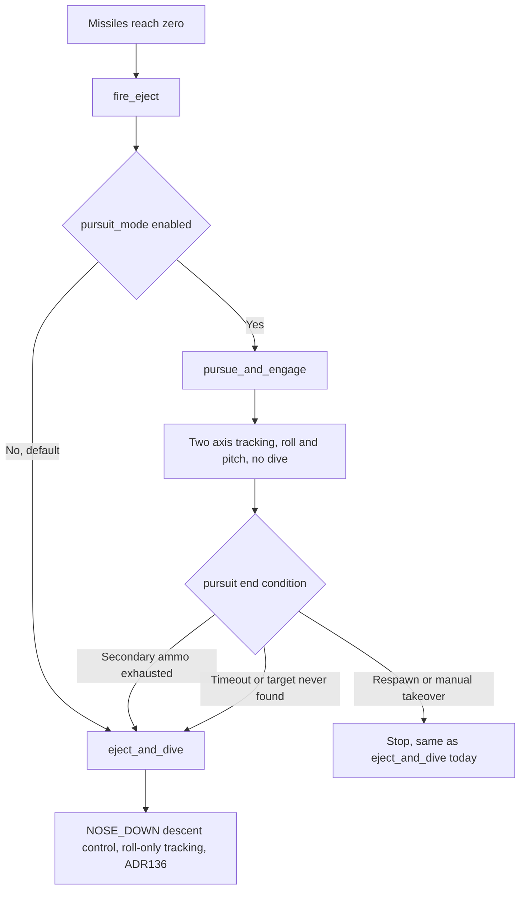
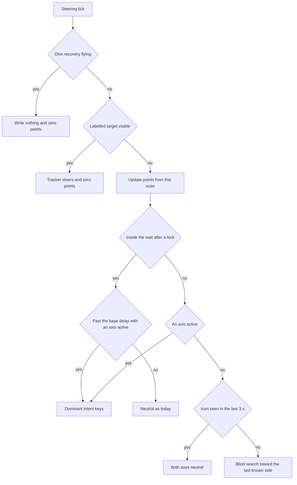
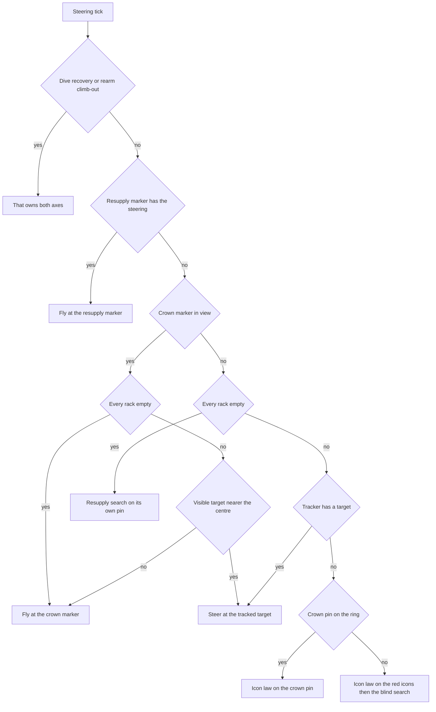

# Design 015 — Target-Tracking Pursuit Mode: A Switchable Alternative to Eject-and-Dive

| Status | Date       | Wingman Version |
|--------|------------|-----------------|
| Draft  | 2026-09-21 | 1.8.11          |

## Overview

Today, the moment primary missiles hit zero, `AmmoEventsHandler.fire_eject()`
(`wingman/tick_handlers.py:1019-1033`) unconditionally calls
`Controller.eject_and_dive()`: switch to secondary weapons (ADR 136), dive
the airframe into the ground, and trade it for a rearmed respawn. This
design adds a second strategy for that same trigger — **pursuit mode**:
switch to secondary weapons, then use Design 005's full two-axis tracker
(roll and pitch, `wingman/hldd/005-target-tracking-hldd.md`'s 2026-09-21
revision) to actively aim the nose at the nearest enemy and fire, without
diving. The two strategies are mutually exclusive and selected by one
config flag at the same trigger point, so a session can run either one, and
later sessions can compare them, without an operator choosing per-dive.

This document does not claim pursuit mode is better than eject-and-dive. It
exists to make that an answerable, measured question instead of an assumed
one — see Validation Strategy.

---

## Problem Statement

Eject-and-dive's rationale is explicit and load-bearing, not incidental.
ADR 106: *"Eject exists to trade an empty airframe for a rearmed one, and
dying is the point."* ADR 109: *"an aircraft with no missiles is worth
trading for a rearmed one, and the dive is how the trade is made."* ADR 136
extracts extra value from that dive — switch to two heat-seekers, roll
toward whatever the tracker selects, fire — but it does so **inside** a
maneuver whose pitch axis is already spoken for: `_eject_descent_control`
(ADR 069) holds `NOSE_UP_KEY`/`NOSE_DOWN_KEY` for the whole dive to reach
and hold a target dive angle (65°), and ADR 058's dive-confirmation
criterion depends on a cumulative real-hold-time measurement that assumes
it is the only thing pressing that key. ADR 136 D1 step 2 is explicit that
this is deliberate: the heatdive addition "never touches pitch." So today,
the tracker's aim during a missiles-empty event is permanently one-axis —
it can roll toward a target but can never point the nose up or down at one,
because the axis that would do that is committed to a different, unrelated
job (dive-angle hold) for the entire encounter.

The operator's proposal is to stop trying to run both jobs on the same axis
at once, and instead make them alternatives: an aircraft that pursues
targets with both axes free, or an aircraft that dives with both axes
committed to the descent — never both, per encounter, by construction. That
sidesteps the axis conflict without a coordination protocol, but it trades
away ADR 106/109's own strategy (fast, deliberate loss for a fast rearm) for
a different one (extend the empty airframe's life, unarmed of anything but
two heat-seekers, in the hope of landing a kill first) — a real strategic
bet, not a strict improvement, and one this document does not resolve by
assertion.

---

## Goals

1. Add a second, config-selectable strategy for the missiles-empty trigger:
   pursue and engage with both tracking axes, instead of diving.
2. Make the two strategies mutually exclusive at the exact point they
   already share (`fire_eject()`), so there is exactly one branch to keep
   in sync, not two independent trigger paths that could race.
3. Reuse Design 005's sensing and both controllers (`orient_nose_to_target`,
   `orient_pitch_to_target`) as-is — no new control law.
4. Give pursuit mode an explicit termination condition, since unlike a dive
   it has no natural endpoint ("reaches the ground").
5. Emit comparable telemetry to eject-and-dive (HUD, log lines, outcome
   counters) so session-over-session comparison needs no new tooling.
6. Ship shadow-first, exactly like every other addition in this codebase
   (ADR 070, ADR 073, ADR 136, HLDD 013) — off by default, measured before
   trusted.
7. (Added 2026-09-26.) While nothing is locked, steer toward the direction the game's red ring icon
   shows instead of holding a fixed left roll. See "Icon-Directed Search".

## Non-Goals

1. **Not a replacement for eject-and-dive.** Both remain selectable; nothing
   about `eject_and_dive()`'s own trigger, termination, or descent-control
   logic changes.
2. **Not a fix or successor to Two-Axis Rollout's own validation ladder**
   (`005-target-tracking-hldd.md`). Pursuit mode is a *consumer* of that
   ladder reaching a validated pitch channel, not a shortcut around it — see
   Safety and Gating Rules. It cannot ship enabled before that does.
3. **Not boresight lock-confirmation.** Fires the same continuous-hold,
   no-lock-needed way ADR 136 D1 step 4 already established for the
   secondary loadout — no `ToneWait`/`LockConfirmed` state, same reasoning
   HLDD-011 already gives for why heat-seekers don't need it.
4. **Not HLDD-011's `BoresightEngage`.** That is the general, jet-agnostic,
   event-prioritized boresight-engagement design. This is a narrow,
   single-purpose extension of one J-20 trigger event, the same relationship
   ADR 136 already has to HLDD-011 (an earlier, narrower proof point, not a
   substitute).
5. **Not an automatic decision between the two strategies.** V1 is one
   static config flag, not a policy that picks per-encounter based on
   context (enemy count, altitude, ammo). A dynamic chooser is a later,
   separate design if the data ever supports building one.

---

## Relationship to Eject-and-Dive


```mermaid
flowchart TD
    TRIG[Missiles reach zero] --> FE[fire_eject]
    FE --> SEL{pursuit_mode enabled}
    SEL -->|No, default| EAD[eject_and_dive]
    SEL -->|Yes| PM[pursue_and_engage]
    EAD --> DIVE[NOSE_DOWN descent control, roll-only tracking, ADR136]
    PM --> BOTH[Two axis tracking, roll and pitch, no dive]
    BOTH --> END{pursuit end condition}
    END -->|Secondary ammo exhausted| EAD
    END -->|Timeout or target never found| EAD
    END -->|Respawn or manual takeover| STOP[Stop, same as eject_and_dive today]
```

The one new decision point is `SEL`, inside `fire_eject()`. Both branches
are still gated by everything `handle_no_missiles` already gates on (mission
running, `GAME_BATTLE`, not mid-respawn, post-spawn/post-respawn grace
windows) — none of that changes.

**Pursuit mode's own end condition always falls through to eject-and-dive,
not to idle flight.** This preserves ADR 106/109's core guarantee — an
empty airframe never keeps flying indefinitely defenseless — while still
giving pursuit mode its shot first. See Decision D3 below for why this is
the default rather than "resume normal flight."

---

## Functional Design

### D1. Trigger and selection

`fire_eject()` (`tick_handlers.py:1019`) branches on a new flag,
`pursuit_mode.enabled` (default `false`), instead of unconditionally calling
`eject_and_dive`:

```python
def fire_eject(self) -> None:
    self._emit_capture_event("missiles_empty")
    self._analyzer.trigger_event("eject_started")
    if self._pursuit_mode_enabled:
        self._ctrl.pursue_and_engage(on_complete=...)
    else:
        self._ctrl.eject_and_dive(on_complete=...)
```

Both still transition through `GAME_BATTLE_EJECT` via the same
`eject_started`/`eject_complete` triggers (`analyzer.py:806-807`) — pursuit
mode is a different *behavior* inside that state, not a different FSM
state. This means it inherits, for free, every place that already gates on
`GAME_BATTLE_EJECT`: the HUD-blackout fix (HLDD 005, 2026-09-21) applies
identically once wired the same way (D5 below), and nothing that currently
special-cases "the aircraft is diving" needs a second special case for "the
aircraft is pursuing" — both read as the same state to the rest of the
system.

### D2. New Controller method: `pursue_and_engage`

Structurally mirrors `eject_and_dive`'s init (`cancel_mission()`,
`_eject_weapon_switched` reset, the same `switch_weapon()` call bracketed
with the programmatic-key convention) but **does not** start
`_eject_descent_control` — no `NOSE_DOWN` pulses, no dive-angle target, no
ADR 058 confirmation logic. Instead, one loop (same shape as
`_eject_heatdive_loop`, `controller.py:2191-2233`, reused conventions, new
method) that every cycle:

1. Captures a frame, calls `TargetTracker.update(frame)`.
2. Calls **both** controllers — `orient_nose_to_target(obs["error_norm"])`
   *and* `orient_pitch_to_target(obs["error_norm_y"])` — the one caller in
   the whole codebase allowed to use the pitch channel unconditionally,
   because nothing else is contesting `NOSE_UP_KEY`/`NOSE_DOWN_KEY` here
   (see Safety and Gating Rules).
3. Fires on the same fixed cadence, same fail-open ammo read, same
   stop-when-`get_ammo_missiles()`-reads-0 rule ADR 136 D1 step 4 already
   established — reused exactly, not reimplemented.
4. Renders HUD via the same `self._hud_renderer` reference the eject
   heatdive loop now uses (HLDD 005, 2026-09-21 fix) — `state_name` is a
   distinct literal, `"PURSUIT_MODE"`, so the two are distinguishable in the
   log and on the HUD.

All key presses use `ignore_cancel=True`, same reasoning as
`_eject_heatdive_loop`: `cancel_mission()` has already set
`self._mission_cancel` for the whole call before this loop starts.

### D3. Termination

Unlike a dive, pursuit mode has no physical endpoint. Three conditions end
it, each mapped to what happens next:

| Condition | Detection | Next action |
|---|---|---|
| Secondary ammo exhausted | `get_ammo_missiles() == 0`, same debounced read `_eject_heatdive_loop` already uses | **Fall through to `eject_and_dive`** — the airframe is now in exactly the state ADR 106/109 designed for (empty, no upside left in staying up), so the existing, validated trade-for-rearm strategy takes over rather than leaving the aircraft to fly on unarmed. |
| `pursuit_max_duration_s` elapsed with no kill confirmed | wall-clock timer, own config key | Same fall-through to `eject_and_dive` — a bounded worst case, so a target-never-found session cannot fly the empty, exposed airframe indefinitely. **Off since 2026-09-24 (shipped value 0 = no cap, operator: "after a 20 second chase do not dive, continue searching and pursuing").** Only a positive value restores it; see "No time cap" below. |
| Respawn detected / manual takeover / shutdown | same `self._eject_stop` event every other eject-adjacent loop already watches | Stop immediately, identical to `eject_and_dive`'s own external-cancellation path — no fall-through, since the aircraft is already gone or the operator already has it. |

The ammo-exhausted and timeout paths **do not** skip eject-and-dive's own
gating — falling through calls `eject_and_dive` the normal way, so if a
respawn or manual takeover raced in during pursuit mode, the fall-through
call simply finds itself already cancelled and no-ops, the same as any
other `eject_and_dive` call would.

### D4. Padlock

Reuses `Controller.ensure_padlock_off`/`detect_padlock_off` exactly as
ADR 136 D4 left them: available, unit-tested, **disabled by default**
(`heatdive_padlock_verify`-equivalent flag for pursuit mode) because the
underlying detector was found to track flight-attitude drift rather than
padlock state (ADR 136 D4's own recalibration write-up). Not re-solved
here — inherits the same open item.

### D5. HUD wiring

`Controller.set_hud_renderer()` (added for the eject heatdive loop, HLDD
005 2026-09-21) is reused directly — no new setter, no new reference to
wire from `main.py`. `pursue_and_engage`'s loop calls
`self._hud_renderer.maybe_render(frame, obs, "PURSUIT_MODE", health, ammo,
flares)` the same way `_eject_heatdive_loop` calls it with
`"GAME_BATTLE_EJECT"`.

---

## Safety and Gating Rules

**Hard precondition: this cannot ship enabled before Design 005's Two-Axis
Rollout reaches at least Phase 2 (live pitch actuation validated on the
ambient path).** Pursuit mode is an *extended*, *primary* live consumer of
the pitch channel — not a brief shadow check. Shipping it before pitch has
any live-actuation history at all would mean the first real pitch actuation
this codebase ever performs happens inside a new, unvalidated mission
behavior, compounding two unknowns (does pitch actuation behave sensibly at
all; does pursuit mode as a strategy work) into one trial with no way to
separate them if it goes wrong. `pursuit_mode.enabled` must stay `false` in
shipped config until that precondition is met and recorded (a dated note in
this document, not a silent flip).

**2026-09-23 — enabled anyway, precondition not met.** `pursuit_mode.enabled`
was flipped `true` in shipped config by explicit, repeated direct operator
instruction, given after this precondition and the specific risk above were
raised in conversation. Two-Axis Rollout was, at the time, still at Phase 1:
`tracking.actuate_pitch` remained `false`, and no session log to date
contained a single `nose_up`/`nose_down`/`orient_pitch` call from tracking.
This note exists so that fact stays visible here rather than being implied
false by a silent flag flip — the precondition itself is unchanged and still
describes the risk this decision accepted, not a standard that was met.

**Pursuit mode is the one caller allowed to use the pitch channel without
restriction — this is not a special case, it is why the axis conflict
disappears.** `orient_pitch_to_target` is barred from `eject_and_dive`
specifically because `_eject_descent_control` already owns
`NOSE_UP_KEY`/`NOSE_DOWN_KEY` there. `pursue_and_engage` never starts
`_eject_descent_control` at all, so there is no second owner to conflict
with. If a future change ever made pursuit mode call into any part of
`eject_and_dive`'s descent machinery, this exclusivity argument would need
re-examining — it does not today, since D2 is a clean, separate method.

**Manual takeover, survival hold, and shutdown all pre-empt pursuit mode**
via the same `self._eject_stop` event and `cancel_mission()` path every
other eject-adjacent loop already uses (D3, external-cancellation row) — no
new interrupt mechanism, per the precedent ADR 135 already established
against parallel, ungated key-press paths.

**Turn guard and boundary safety are unaffected.** Pursuit mode only ever
runs from inside `fire_eject()`'s call graph, same as eject-and-dive today
— it does not touch `_PRIORITY_ORDER`, `BoundaryTurn`, or any behavior-tree
tactic. An open question (below) is whether a *long-running* pursuit
(bounded by `pursuit_max_duration_s`) could drift toward the arena edge with
nothing watching for it, the way HLDD 013 found `TACTIC_ATTACK_SUPPORT`
already could.

**A dive recovery flies through the chase (ADR 148, operator, 2026-09-25).** The two-writer case above was fatal in the
00:03 session: both chases ended in the ground. A climb hold used to release on any game state other than `GAME_BATTLE`, and a
pursuit lives in `GAME_BATTLE_EJECT`, so the tree's emergency recovery (24 airbrake holds started, 38 holds released after 0.3 s
in five minutes) was a nudge every 1.5 s while the chase kept writing pitch and roll. Now a hard emergency (time to ground or
terrain, not the altitude floor) flies through the state for up to `pursuit_mode.recovery_max_s` (30 s), and the chase releases
both axes, including the search roll, until it ends, then steers again. The weapon switch that preceded the first crash was
unrelated: the target had just been destroyed. Not yet verified live.

**Altitude in the chase (ADR 147, operator, 2026-09-24).** Nothing in pursuit steers altitude except the behavior
tree's hard altitude floor, and a floor climb is only a nudge in this state: a climb hold releases itself in
`GAME_BATTLE_EJECT` (136 `state_exit` releases in the 18:57 session, 52 of them after 0.3 s). So the chase settles on
the floor and bounces there: median chase altitude 3544 to 4609 m across the four sessions of 2026-09-24, with all 31
`ALTITUDE FLOOR` events citing 4000 m. For `mission_su30` the floor is now 3000 m (`su30_mission.alt_floor_m`) and the armed
sustain climb stands aside, so the chase is expected to search near 3000 m; every other mission keeps 4000 m. Not yet
measured after the change: `make sr` prints the chase altitude, the floor values cited and how often the script's
-10 degree step was not confirmed (24 of 26 hand-offs before).

---

## Configuration Additions

```yaml
pursuit_mode:
  enabled: false                 # hard-gated — see Safety and Gating Rules
  pursuit_max_duration_s: 20.0   # named guess; shadow trial should correct it
  pursuit_padlock_verify: false  # inherits ADR 136 D4's disabled default
  # Roll/pitch gains are NOT duplicated here — pursue_and_engage reads
  # tracking.deadband/kp/... and tracking.pitch_deadband/pitch_kp/... directly,
  # the same config Design 005 already owns, for the same reason HLDD 011's
  # acs_mode.boresight stopped duplicating them (2026-09-21 reconciliation):
  # a second copy of the same numbers would drift from the one Design 005's
  # own shadow trial tunes.
```

`config_schema.py` additions: a new `pursuit_mode` Section with `enabled:
BOOL`, `pursuit_max_duration_s: SECONDS`, `pursuit_padlock_verify: BOOL` —
no new `Leaf` patterns needed, all three types already exist for sibling
keys elsewhere in the schema.

### Later additions (2026-09-23 and 2026-09-24)

Four keys were added after this design was written, each documented where its
evidence lives rather than here (the extra one is `search_resume_centre_err` /
`search_resume_centre_delay_s`, a two-key extension of `search_resume_delay_s`):

- `ammo_zero_grace_s` (12.0): the HUD ammo count lags a weapon switch by seconds,
  so a 0 read soon after the switch is not an empty secondary.
- `search_resume_delay_s` (2.0): how long a miss after a lock holds the roll axis
  neutral before the ROLL_LEFT search resumes; see Design 005, "Search-Resume
  Delay".
- `empty_confirm_reads` (3): consecutive ammo==0 reads before the deferred weapon
  switch (below) presses the toggle key.

**Icon-Directed Search, shadow stage (added 2026-09-26).** `pursuit_mode.icon_steering` in
`wingman/config.yaml`, validated by `config_schema.py`. Shipped `enabled: true`: it logs, and presses
nothing. The ring geometry is measured and the colour rules come from a 293-frame corpus; the rest are
named guesses. `actuate` / `actuate_turn` do not exist yet; they arrive with rollout step 2:

```yaml
pursuit_mode:
  icon_steering:
    enabled: true             # shadow: detect, score and log ICONPTS
    wings_level: true         # step 2a: no fixed left roll on the icon and hold rungs
    actuate_pitch: true       # step 2b: the law's vertical intent holds pitch there
    ring_centre_pct: [0.5, 0.5]        # measured centre 959.7, 599.8 of 1920 x 1200
    ring_radius_pct: [0.14, 0.18]      # of frame height; measured 193.9 px, about 4 px spread
    area_px: [150, 2500]
    side_px: [15, 70]
    red_hue_max: 4            # red icons hue 2-3; hue 5-10 was afterburner, sunset, flare
    orange_hue: [11, 15]      # orange icons hue 12-13 (count as red, operator), solid only
    orange_min_uniform: 0.6
    sat_min: 110
    val_min: 200
    points_scale: 5           # reference frame gives down 5, left 1
    points_half_life_s: 1.0   # fades only while icons keep coming; holds when none is seen
    points_cap: 25
    act_pts: 10
    release_pts: 4
    icon_min_path_deg: -45    # no nose-down at or past this flight-path angle (operator)
    blind_search_after_s: 3.0 # no lock and no icon for this long: search toward the last known side
```

When actuation arrives it will need `tracking.sustained_hold_enabled` (it uses the held-key
primitives); the shadow stage does not.

**Deferred weapon switch.** `pursue_and_engage(defer_switch_until_empty=True)` is
the form `mission_su30` uses (ADR 144 D4, revised 2026-09-24). It presses no
`SWITCH_WEAPON` at its start and leaves `_eject_weapon_switched` alone, pursues
with whichever weapon is selected, and switches once when that weapon has read
empty for `empty_confirm_reads` cycles. Only after that switch does the
ammo-zero fall-through apply, with `ammo_zero_grace_s` measured from the switch.
If `pursuit_max_duration_s` ends the encounter first, the fall-through calls
`eject_and_dive(defer_switch_until_empty=True)`: the dive presses no switch and its
heatdive loop switches once when the selected weapon is empty (the same rule, the
same confirmation). This replaced a first version that let the dive make its own
switch, which switched away from a loaded rack on every capped pursuit (operator,
2026-09-24). The default form, used by the missiles-empty trigger, is unchanged.

**Every rack that runs out presses the switch (operator, 2026-10-05).** In both
forms, after the first switch the pursuit presses `SWITCH_WEAPON` again each time
the selected rack goes from a count to `empty_confirm_reads` zero reads. A
resupply refills both racks and the HUD shows only the selected one. On
2026-10-05 11:18:45 the pursuit switched to a full secondary (2 of 2) and flew
through the resupply point, no count changed, and when the secondary ran out at
11:19:18 the reloaded primary stayed unselected for the 39 s to the respawn. A
rack that shows no count after it is selected presses nothing, so the stale 0
the HUD holds after a switch and two empty racks do not toggle; the ammo-zero
handling then applies to that rack, its grace measured from the last switch.
This replaces the single switch back that a rearm seen in the count used to arm.

**No time cap (operator decision, 2026-09-24).** `pursuit_mode.pursuit_max_duration_s` ships as `0`,
which means no cap: the pursuit keeps searching (roll, and pitch once it has a lock) and firing until the
ammo is exhausted, when it still falls through to `eject_and_dive` to trade for a rearmed airframe, or
until a respawn, takeover or shutdown stops it. Until then every life ended its pursuit at 20 s and dived
whether or not a target had been found. Consequences found while making the change:

- **The Anomaly 003 detector would have ended recording sessions.** It treats GAME_BATTLE_EJECT with no
  descent running for 40 s as stuck, and a pursuit has no descent. `Controller.eject_flight_active()`
  (descent or pursuit) is now what `main.py` passes it.
- **Nothing time-limits the eject state otherwise:** an alive-health event ends it only after an observed
  death (`_alive_transition_disposition`).
- **Exposure, now open (question 3 below):** no behavior-tree tactic acts inside GAME_BATTLE_EJECT
  except Climb's terrain emergency, so a long search is guarded against terrain but not against the arena
  edge, and a search that only rolls flies straight. Measured over 50 pursuits with boundary readings:
  they started a median 0.37 minimap radii from the boundary (minimum 0.06), 13 of 50 showed the
  boundary ahead and under 0.3 away at some point, and the worst closing rate (-0.010 per second) would
  reach a boundary 0.5 away in about 50 s. An out-of-bounds warning has not been seen in a pursuit (the
  one on record, 17:32 on 2026-09-24, was at a life's start in normal battle, where the boundary turn
  handled it), but pursuits were at most 20 s.
- **Recorded numbers change meaning.** The pooled 5.8% (pursuit) and 11.5% (dive) locked-scan baselines
  were measured with 20 s pursuits; `end=cap` no longer appears in `PURSUIT SUMMARY` lines.

**Engagement summary line (Cycle 7, 2026-09-24).** Each pursuit, and each dive's heatdive
loop, ends with one INFO line, `PURSUIT SUMMARY:` or `DIVE SUMMARY:`, for example
`PURSUIT SUMMARY: end=cap dur=20.1s scans=61 locked=9 (15%) first_lock=8.4s ammo=6->2
switched=no`. `end` is `cap`, `ammo`, `external:<reason>` (pursuit) or `dive-end` or
`external:<reason>` (dive); `locked` counts scans on which the tracker reported a lock;
`first_lock` is the time to the first one (`-` for none); `ammo` is the first and last raw
HUD reading, so across a rack switch the last figure belongs to the other rack, and
`switched=yes` says this loop pressed the switch. Logging only, nothing reads it. It exists
because the pursuit's outcome could otherwise only be rebuilt from DEBUG `TRACKPICK` lines
and `Ammo missiles:` transitions, and that rebuild counts a rack switch as a 6-to-2
"launch"; the same tracker gave 5% locked scans in one session and 15% in the next, so a
per-engagement denominator has to be logged, not reconstructed. Tests:
`tests/test_engagement_summary.py` and the `summary` tests in `test_pursuit_mode.py` and
`test_eject_heatdive.py`.

Live check (12:05-12:46 run, wingman 1.8.11): the lines appear at INFO from the first
engagement (12:09:48 pursuit, 12:11:17 dive), with `end=` seen as `cap`, `external:match_ended`
(4 pursuits, a round ending during the pursuit), `dive-end` and `external:respawn_detected` (10
dives). Over the run's 20 pursuits and 16 dives: pursuits with any lock 2 (10%), locked scans
25 of 1,046 (2%), 2 launches by first-to-last raw reading; dives with any lock 13 (81%), locked
scans 256 of 1,968 (13%), 12 launches by the same measure. No weapon-switch press: no rack emptied.

**A pursuit-versus-dive contrast the lines make visible (measured, cause not established).**
Pooled over the four sessions since 08:42, locked scans are 200 of 3,454 in pursuit (5.8%) and
820 of 7,102 in the dive (11.5%). Altitude does not explain it: at equal altitude the dive still
locks more often (2,500-3,500 m: pursuit 46 of 538, 8.6%, dive 238 of 1,585, 15.0%; 3,500-5,000
m: pursuit 154 of 2,749, 5.6%, dive 415 of 2,885, 14.4%; scans with an altitude reading within
4 s). What is left untested: time in the life (the pursuit starts soon after the climb, the dive
20 s or more later, when fights may have come closer) and attitude (the dive is nose-down with
afterburner, the pursuit rolls left with no pitch while searching). The two cannot be separated
from these logs. Launches per 100 locked scans were not clearly different (pursuit 12 launches in
189 locked scans, dive 25 in 584, in the four sessions), so a lock in the dive is not less useful.

---

## Icon-Directed Search: Replacing the Fixed Left Roll (2026-09-26)

Wingman 1.8.11. Status: design only. Nothing below is implemented. Revised the same day after a review
against the logs ("Review, 2026-09-26" at the end of this section lists what changed and why). Four
operator decisions were taken the same day; they are recorded under "Open questions for this section"
and marked **Operator** where they apply.

### Problem

When the tracker has no labelled target, `pursue_and_engage` falls back to `roll_on_miss`. That holds
the roll axis neutral for `search_resume_delay_s` after a lock, then `engage_roll_search()` holds
ROLL_LEFT with no end, adding a `_search_look_down()` nose-down pulse once a second. The roll direction
is fixed and ignores where the enemy is. It also does not turn the aircraft: ADR 101 measured that "a
bank without a pull does not turn the flight path", which is why ADR 107's BoundaryTurn holds ROLL_RIGHT
and NOSE_UP together. The fixed roll banks the jet and sweeps the view, and the flight path goes roughly
straight on. Most of the pursuit budget is spent searching; one pursuit went 17 s of 20 without a lock
(Design 005, Search-Resume Delay, open finding 2).

The game already shows where the enemy is. When an enemy is off the nose, a red arrowhead sits on a
fixed ring around the screen centre and points toward it. `test_screenshots/GAME_BATTLE_ENEMY_AT_NOSE_DOWN.png`
shows it directly below centre and a little to the left. The enemy there is below the nose.

**This reverses an operator decision.** On 2026-09-24 (Design 005, "Unlabelled Red Icons",
"Decision (operator): ignore the icons") the operator closed the question with "the icons are showing
the general direction of the enemy aircraft, we can ignore it". On 2026-09-26 the operator asked for
exactly that general direction to steer the search. The 2026-09-24 decision was about locking onto an
icon, which this design still does not do. The tracker never aims at an icon or fires at one. The
icon only chooses which way to turn while nothing is locked.

### Evidence (labels: measured / inferred)

| Claim | Label | Basis |
|-------|-------|-------|
| The reference icon is one red component, 26 x 44 px, area 398 px, centre (934.6, 789.4) in a 1920 x 1200 frame, hue 3, saturation 158-167, value 249-255 | measured | Connected components of a hue 0-6, saturation 120 or more, value 180 or more mask on the reference frame, with the tracker's HUD exclusion zones applied |
| Icons sit on a fixed ring centred on the frame centre, radius 193.9 px | measured | Circle fit over the `TRACKPICK blob=` positions logged on unlocked ticks (209 logs, 113,918 icon-sized blobs of 150-2,500 px with sides of 15-70 px). Of these, 102,436 lie 150-250 px from centre. The fitted centre is (959.7, 599.8). The 10th to 90th percentile radius residual is -3.7 to +4.3 px |
| The icon's position therefore encodes direction only (its angle), not distance, and gives no measure of how far the nose still has to move | inferred | The radius does not vary (above) |
| Most icons are in the lower half of the ring | measured | Same 102,436 ticks: 76% lie between 0 and 180 degrees (right, through down, to left) |
| The icon is usually gone while a labelled target is locked | measured, with a caveat | A ring-band icon on 14,070 of 43,490 lock ticks (32.4%) against 103,362 of 162,077 unlocked ticks (63.8%). `blob=` logs only the largest red component, so a lock's own marker can hide an icon, and a third of lock ticks still show one, probably another enemy's |
| The ring does not appear to mark incoming missiles | inferred, weak | Within 4 s after an `INCOMING MISSILE DETECTED` line (13,820 of them), 55.9% of unlocked ticks show a ring icon, against 64.3% otherwise. A missile marker would raise the share, not lower it |
| Ring icons also come in orange | measured, one case | Archived frame `pursuit_mode_20260926_034355_110.png`: ring icon at radius 193 px, angle 172 degrees, hue 12-13. The same place 6 s later (`..._034401_111.png`) is red, hue 3. Three other archived ring icons measured are hue 3 |
| A held ROLL_LEFT does not rotate the ring icon in a consistent direction, anywhere on the ring | measured | 44,853 pairs of consecutive ring-icon ticks under `HOLD[roll]: left/search`, 0.35 s apart or less and under 40 px apart. Split into eight 45-degree position bins, the median angular rate is 0.0 deg/s in six and -1.9 and -3.0 deg/s in the two sparse upper bins (974 pairs). The clockwise share of moving pairs is 0.36-0.65 |
| The camera does not roll with the jet | inferred, by eye, three frames | `pursuit_mode_20260926_031826_23.png`: the jet is drawn banked about 35 degrees while the HUD and screen stay upright. The frames at 03:43:55 and 03:44:01, 6 and 12 s into a logged ROLL_LEFT search hold, show the jet wings-level against a level horizon with the icon at 9 o'clock in both. This fits the measured rotation result: rolling moves the jet, not the picture |
| The game binds only a left rudder key | measured | `wingman/keybindings.py`: `YAW_LEFT = ';'`, no right-yaw constant |

### The points model (unchanged from the operator's design)

Each scan of the screen adds points to a flight direction, based on where the icon sits relative to the
centre. The reference frame adds **nose down +5, left +1**. The points build up over consecutive scans,
and the points, not any single scan, decide which keys are held.

Each axis has one signed score:

- `pitch_pts`: positive means nose down, negative means nose up.
- `turn_pts`: positive means right, negative means left.

**Per-scan contribution.** From the chosen icon's centre, take the unit vector from the ring centre,
`(ux, uy)`, in screen convention (x right, y down, the same signs as the tracker's `error_norm` and
`error_norm_y`). The contribution per axis is `round(points_scale * u)`, with halves rounded away
from zero, and `points_scale` = 5. The unit vector, not the pixel offset, is used because the ring
radius is constant. Reference frame: `u` = (-0.133, +0.991), which gives (-0.66, +4.96) and rounds to
**left 1, down 5**, as the operator specified. The rounding gives each axis a natural dead zone: an
icon within 5.7 degrees of straight down adds no turn points at all.

**Per-scan update.** A scan is one steering tick of `pursue_and_engage` (`steer_interval_s`, 0.1 s
shipped). On every scan, in this order:

1. **Decay, only on a scan that has an icon.** Both scores are multiplied by
   `0.5 ** (dt / points_half_life_s)`, where `dt` is the measured time since the previous scan (factor
   0.933 at 0.1 s and a 1.0 s half-life), so they follow the latest direction instead of piling up. A scan
   with no icon changes nothing (below).
2. **Crossing reset.** If this scan's contribution on an axis has the opposite sign to that axis's
   score, the axis is zeroed before the contribution is added. An icon that crosses the centre line
   means the nose has gone past the enemy on that axis.
3. **Add** the contribution to each axis.
4. **Clamp** each axis to plus or minus `points_cap` (25).

**Choosing one icon.** Only components that pass all of these count as icons:

- inside the ring band, 0.14 to 0.18 of the frame height from the ring centre (168-216 px at 1200 px);
- 150 to 2,500 px in area, both sides 15 to 70 px;
- saturation 110 or more and value 200 or more, and either
  - **red**: median hue 0-4 or 170-180, or
  - **orange**: median hue 11-15 *and* solid, with at least 60% of its pixels within 10 of the
    component's median saturation and at value 240 or more. **Operator (question 1):** orange counts
    exactly as red, with no preference between them.

The ring band alone keeps out the kill feed, the INCOMING banner and the other fixed chrome. The colour
rule was set on the 293 archived pursuit and eject frames of 2026-09-26 (revised from a plain hue 0-15
while implementing, see "Shadow stage" below). Every ring-band detection at median hue 5-10 was the own
afterburner, sunset sky, cloud or a flare (8 of 9; the ninth was two overlapping icons), so red stops at
hue 4. Orange shares its hue with sunset and glare, which never come flat and bright (uniform share 0.00,
value medians 201-223, against 0.71-0.92 and 255 for the orange icons). A uniformity test cannot be used
for red: many red ring icons are hollow jet outlines, whose anti-aliased edges score 0.25-0.49.

The first draft also required fewer than 8 nameplate glyphs near the icon, to keep labelled contacts out.
It was dropped: when a labelled contact is visible the tracker has it and the icon rung does not run, and
an unlocked labelled contact on the ring is still an enemy in that direction.

If more than one icon passes, the one whose angle is closest to the current score vector's angle is chosen
when that vector is at least `release_pts` long. Otherwise the one nearest 6 o'clock or 12 o'clock is
chosen, because a vertical move is the only one the aircraft can make without turning (below). Two icons
are never averaged: the mean of two enemies' directions points at neither (the tracker's 2026-09-24
mean-of-red lesson).

The detector scans only the ring's bounding square (432 x 432 px at 1920 x 1200), not the full frame.

### How the points reset

| Event | Effect on the scores | Why |
|-------|----------------------|-----|
| A scan with an icon | Decay by the half-life, then the icon's points are added | The scores follow the latest direction |
| A scan with no icon | Nothing: the scores hold | The aircraft keeps flying the direction the icons gave until the target appears (operator) |
| Contribution opposite in sign to the axis score | That axis is zeroed, then the contribution is added | The nose has gone past the enemy on that axis |
| The tracker reports a labelled target (`visible`) | Both zeroed, icon-held keys handed to the tracker | The tracker's error is better information |
| ADR 148 dive recovery starts | Both zeroed, icon-held keys released | The recovery owns both axes |
| Pursuit starts or ends, for any reason | Both zeroed, icon-held keys released | Points never carry over from one engagement or life to the next |

**The points keep steering after the icon disappears, until the lock takes over (operator,
2026-09-26).** "The icons are pointing to the general direction of where the target is, this is why the
point system exists so it continues flying the direction of the icon until target appears on screen even
when icon disappears. So, fly the direction icons indicated, then once locked on prioritize the locked-on
target rather than using icons to dictate flight control and breaking the lock." So a scan with no icon
neither fades nor clears the scores, and the keys they select stay held. What ends it is the tracker
locking (the scores are zeroed and the tracker steers), a new icon (which updates them), the icon crossing
the centre line, a dive recovery, or the pursuit ending. There is no timer.

This reverses the review's "keys release 0.3 s after the last icon" (`icon_coast_s`, now removed). That
rule assumed the jet would push past an enemy that had just come into view. In the operator's model the
lock takes over at that point, and the first live pursuits agree: every one of 5 locks came 0.1-0.2 s
after an icon pointing that way (Handover, below). What remains is the case where the target is in view
but the tracker cannot lock it (no nameplate yet, or the gate rejects it): then the held direction keeps
being flown. The dive guard and the -45 deg limit still bound a held nose-down.

### How the points drive the keys: the dominant-intent law

Each axis first goes through a hysteresis switch on its score: **active** once the absolute score reaches
`act_pts` (10), and stays active while it is at or above `release_pts` (4) with the same sign. A sign
change deactivates it. The key presses then depend on which active axis is larger, because the two axes
do not combine freely:

- **A bank without a pull does not turn** (ADR 101, measured). So a horizontal move needs roll and pitch
  together.
- **Bank plus a push turns the wrong way** (inferred from flight mechanics, same basis). Nose-down in a
  left bank moves the nose toward the jet's belly, which is down and to the right. The first draft's
  direct mapping would hold ROLL_LEFT and NOSE_DOWN together for the reference icon after 1.6 s, and
  steer away from the enemy it was chasing.
- **Bank plus a pull turns toward the bank.** This is BoundaryTurn's combination, validated live
  (ADR 107).

| Active axes, dominant first | Keys held | Effect |
|-----------------------------|-----------|--------|
| Pitch down, dominant or alone | NOSE_DOWN, roll released so the wings level | Nose straight down toward the enemy. The turn points wait (**Operator, question 2**: no rudder nudge) |
| Pitch up, dominant or alone | NOSE_UP, plus ROLL toward the turn side if turn is also active | Pull, curving toward the enemy's side |
| Turn dominant (larger absolute score than pitch) | ROLL toward the turn side and NOSE_UP, as BoundaryTurn does | A real turn toward the enemy (**Operator, question 2**) |
| Neither | None | Wait while the points build |

Ties go to pitch. Magnitude above `act_pts` is not used: the keys are on or off, as everywhere else in
this controller.

Worked example, the reference icon seen on every scan with the shipped values:

| Scan | Time | `pitch_pts` | `turn_pts` | Keys |
|------|------|-------------|------------|------|
| 1 | 0.1 s | +5.0 | -1.0 | none |
| 2 | 0.2 s | +9.7 | -1.9 | none |
| 3 | 0.3 s | +14.0 | -2.8 | NOSE_DOWN |
| 6 | 0.6 s | +25 (cap) | -5.1 | NOSE_DOWN |
| 16 | 1.6 s | +25 | -10.0 | NOSE_DOWN (turn is active but pitch dominates) |

As the nose comes down, the icon slides toward the side the enemy is on, or it leaves the ring as the
enemy comes into view and the tracker takes over. If it slides past 45 degrees from vertical, turn
becomes dominant and the aircraft banks and pulls toward it. This departs from the literal example: the
"left +1" is not acted on while "down +5" dominates. **Operator (question 2):** accepted, bank-and-pull
rather than a rudder nudge or roll alone.

**Dive limits for icon pitch-down.** Every icon scan is an unlocked scan, so
`_pursuit_dive_guard(target_visible=False)` runs with both of its terms: the floor plus
`dive_guard_margin_m`, and the time to ground. If it trips, NOSE_DOWN is released (logged as `dive guard
icon`) and `_dive_guard_pullout()` runs as it does today. 76% of icons are in the lower half, so this
design will mostly command nose-down, and the icon gives no measure of how far down the enemy is. A
flight-path-angle limit, `icon_min_path_deg`, sits on top of the guard, using the same fresh-angle
reading as the look-down's `search_look_down_min_deg` (-20 degrees): no nose-down once the path is at
or steeper than the limit, and none without a fresh angle. **Operator (question 3):** -45 degrees. A long held push also mushes (ADR 069), which the limit
also bounds.

### Where it sits in the steering tick


```mermaid
flowchart TD
    T[Steering tick] --> Y{Dive recovery flying}
    Y -->|yes| YR[Write nothing and zero points]
    Y -->|no| V{Labelled target visible}
    V -->|yes| TR[Tracker steers and zero points]
    V -->|no| U[Update points from this scan]
    U --> W{Inside the wait after a lock}
    W -->|yes| WX{Past the base delay with an axis active}
    WX -->|yes| IS
    WX -->|no| WN[Neutral as today]
    W -->|no| A{An axis active}
    A -->|yes| IS[Dominant intent keys]
    A -->|no| R{Icon seen in the last 3 s}
    R -->|yes| N[Both axes neutral]
    R -->|no| B[Blind search toward the last known side]
```

- **The wait after a lock keeps priority over icon steering** (changed from the first draft). That wait
  (`search_resume_delay_s`, or `search_resume_centre_delay_s` near centre) exists because a lock often
  drops for a scan or two with the target still on screen. A third of lock ticks show a ring icon, most
  likely another enemy's, so letting the icon pre-empt the wait would often steer away from the target
  just lost toward a different one. The points still update during the wait, so the icon steers at once
  when it ends. **Narrowed 2026-09-27 (cycle 11):** only the base delay (`search_resume_delay_s`) keeps
  priority. Active points end the near-centre extension, which measured over 30 logs recovered few
  targets and flew neutral past a visible icon (see "Iterate cycle 11" below).
- **The blind search turns toward the last known side.** When no lock and no icon has been seen for
  `blind_search_after_s` (3.0 s), the search runs as today, but it holds ROLL_RIGHT instead of ROLL_LEFT
  when `turn_pts` is still positive (left when it is zero or negative, and when nothing has been seen).
  The look-down pulse is unchanged. **Operator (question 4):** the blind search stays bank only for
  now, one change at a time. Making it pull (an orbit) is a separate later decision, to be measured on
  its own once icon steering has been.
- `eject_and_dive`'s heatdive loop is unchanged. It stays roll-only by construction (D2, Safety and
  Gating Rules).

### Sensing and instrumentation

`wingman/icon_steering.py` holds all of it, with no key access: `find_ring_icons(frame, cfg)` returns a
`RingIcon(x, y, area, w, h, angle_deg, hue)` for each icon in the ring's bounding square, largest first,
and `IconPoints` holds the scores, the switches and the dominant-intent law. The pursuit loop calls them
from `Controller._icon_rung` (before the roll decision) and `_icon_report` (after the dive guard) on every
steering tick, using the frame
it already captured. The tracker is not involved (the design's first placement, a `TargetTracker`
method, would have put the scan under the tracker's lock for nothing).

- `ICONPTS`, one DEBUG line per steering tick: `rung=<recovery|track|wait|icon|hold|blind>
  icon=(x,y,ANGLEdeg,hHUE)|- n=<icons> add=(T,P) pts=(T,P) intent=<down|up|turn|none> keys=<held>
  withheld=<-|guard|angle|angle-none> side=<left|right>`.
- `PURSUIT SUMMARY` gains `icon=<ticks with an icon>/<unlocked ticks> icon_steer=<s>` (seconds on the
  icon rung), only while icon steering is enabled, so the line is unchanged otherwise. These are the
  denominators the rollout compares. They count steering ticks (0.1 s), not the line's own `scans=`
  (engage ticks, 0.3 s).
- **Deferred:** the HUD overlay. The shadow stage is one change; the overlay follows with actuation.

### Rollout

1. **Shadow** (`icon_steering.enabled: true`, `actuate: false`). Detect, score and log what the law
   *would* hold. Press nothing new: the existing search flies. Read from the log:
   - **Key response.** For each existing `HOLD[pitch]` down hold and look-down pulse, whether the icon
     moves toward the horizontal or leaves the ring. The law's pitch rung depends on it. The roll
     result above shows the roll key alone does not move the icon, which matches the camera finding.
   - **Handover.** How often a labelled lock appears within 5 s on the side the icon pointed to. This is
     the direct test that the icon is the same enemy.
   - **Hue.** The distribution of accepted-icon hues, in particular any at 7-10 (afterburner).
   - The rung distribution: share of unlocked scans on `wait`, `icon`, `hold` and `blind`.
2. **Step 2a, wings level (added 2026-09-26, operator go-ahead).** `icon_steering.wings_level: true`: on
   the `icon` and `hold` rungs the fixed left search roll is released and the wings stay level. Nothing
   new is pressed, and the look-down taps run where the search roll would have run them, so a change in
   `first_lock` or the recovery share can be put down to the roll alone. `wait` and `blind` keep
   `roll_on_miss` unchanged. `ICONPTS` says `act=level` on each such tick.
3. **Step 2b, pitch live** (`icon_steering.actuate_pitch: true`, added 2026-09-26 on the operator's
   go-ahead after two 2a pursuits, so 2a's own effect was not measured). On the `icon` and `hold`
   rungs the law's vertical intent holds pitch through `Controller.hold_pitch_for_icon`: `down` holds
   NOSE_DOWN unless withheld (dive guard, a flight path at or past `icon_min_path_deg`, or no fresh
   angle), `up` holds NOSE_UP, and `turn` or no intent leaves pitch neutral. The roll stays level (the
   turn-dominant rung stays in shadow). **The look-down taps stop on those rungs** (operator: the icons
   dictate the direction of flight, so the older look-down is not needed there) and run only on the
   blind rung, the one vertical search when nothing gives a direction. `ICONPTS` says `act=level+down`
   or `act=level+up` when a pitch key is held. Shipped with the length cap below.
   **Length cap (same change):** `points_cap` now limits the length of the (turn, pitch) vector,
   scaling both axes together, instead of each axis, which read every lower-left icon as 135 deg
   (05:27 finding above). A consequence: the operator's example's slight left settles near -3 and never
   switches on; the direction held is the icon's.
4. **Turn live.** Only after step 2b shows time to the first lock does not get worse. Measured with
   `PURSUIT SUMMARY`'s `first_lock=` and lock share, against the pooled 5.8% locked-scan baseline
   (measured with the fixed left roll and 20 s pursuits, now uncapped), with a sample size reported for
   every figure.

Falsified if, with actuation on, `first_lock` does not improve and the icon does not move toward the
horizontal while NOSE_DOWN is held for a lower-half icon. That would mean the keys do not move the icon
the way the law assumes, and the mapping, not the thresholds, is what needs changing.

**Normal-battle shadow verdict (09:42 and 09:59 sessions, about 25 minutes of battle, measured):** 60
navigation rolls. With a lock on screen: 3, all toward the target (`agree=yes`). With a ring icon and no
lock: 28, 20 toward the icon's side, 8 against it (5 with the icon straight below, where the icon rule
would keep the wings level; 3 on the opposite side). Neither: 29. **The minimap navigation is not what
rolls past locked targets.** Per tactic (1.5 s ticks, 08:51 to 10:08): BoundaryTurn 17-19% of battle ticks
with a lock on screen on about 5% of them, turning left and right about equally (36 left and 46 right
07:05-08:31); Idle 33-37% and Climb 39-42%, with a lock on screen on 8-30% and 14-17% of their ticks and
nothing steering toward it. So in normal battle the gap is not a roll the wrong way but no roll at all
toward a lock during Idle and Climb; the normal-battle live step (handing those rolls to the tracker) is
not supported by the data as designed, and is parked.

**Where the left rotation comes from (measured, 07:05-08:31 and 08:51-09:42):** the fixed left search
roll: 15 and 8 holds (68 s and 43 s) in the pursuit's blind rung, 10 and 2 (67 s and 11 s) in the dive's
own search loop, which still searches left by design. During those holds the tracker's `blob=` shows an
icon-sized red contact off the ring on 7% and 19% of ticks and a partial nameplate (8+ glyphs, not passed
by the gate) on 8% and 6%: the search rolled left past something on screen. And the blind rung never
turned toward "the last known side" as this design said it would: `roll_on_miss` still holds ROLL_LEFT
whatever `side=` says, and a lock resets the points, so the side defaults to left after every lock.

**Change (iterate cycle 2, 2026-09-26 10:2x):** the search turns toward the last known side, in both
places. `engage_roll_search(side)` holds ROLL_RIGHT or ROLL_LEFT; `roll_on_miss(..., side=)` passes it
through. The dive's loop gives the side of the last lock (`_side_of(last_visible_err)`); the pursuit
gives whichever was seen last, the lock or the ring icon's points (`_last_known_side`). Left only when
nothing gave a side. `HOLD[roll]` reasons read `search left` / `search right`. Tests: a lock on the right
then a miss searches right, a lock on the left searches left, the far-lock tests of both loops check a
`-> right/search` transition instead of a left key press (the old assertion was the left default the
change removes), and the side rule itself. Gate: `make lint` clean; `make test` 2,308 passed, 2 failed
(the READY-crop test and the operator's `accept_invite` test, both unrelated), 35 skipped. `make rd`,
wingman pid 1028881, started 10:23:48. Read: `HOLD[roll]: ... -> right/search` should now appear, and
left-search holds after a lock on the right should be gone.

**Why pursuits were slow to lock (measured, 07:05-10:28, 74 pursuits of 20 s or more):** of the icon-rung
ticks before each first lock, 62% had the `turn` intent (the icon off to the side), 34% `down` and 3%
`up`; in the 34 pursuits with no lock or a first lock of 20 s or more, 67% `turn`. Step 2b does nothing on
`turn` (wings level, pitch neutral), so an enemy to the side stayed to the side while the jet flew
straight: the 10:26 pursuit spent 67 s on the icon rung before its first lock. The cycle 2 search-side fix
rarely comes into play for the same reason: with the icon rung covering almost every unlocked tick, the
blind search hardly runs (none in the first two pursuits after 10:23).

**Change (iterate cycle 3): rollout step 3, turn live** (`icon_steering.actuate_turn: true`), the
operator's chosen bank-and-pull: on the icon rung, `turn` holds the roll toward the icon's side
(`Controller.hold_roll_for_icon`, hold reason `icon`) and NOSE_UP; `up` with the turn switch on rolls
toward its side while pulling; `down` keeps the wings level and pushes as before; the hold rung stays
wings-level. No new nose-down. `ICONPTS` shows `act=bankleft+up` etc. Tests: the archived left icon
(172 deg) holds ROLL_LEFT and NOSE_UP and no nose-down; with `actuate_turn: false` the same frame
presses neither; a downward icon still pushes with the wings level. Gate: `make lint` clean; `make test` 2,311 passed, 2
failed (the same two unrelated), 35 skipped. The 10:23 session (cycle 2 build) was stopped with `z` at the
lobby (10:40:11). `make rd`, wingman pid 1049971, started 10:40:45. Measure: the share of long pursuits with
a lock and the mean `first_lock`, against the 09:59 and 10:23 sessions (step 2b without the turn).
Baseline (measured): 09:59 session, 11 long pursuits, 64% with a lock, mean first lock 8.7 s; 10:23
session, 5, 80%, 27.5 s.

First step 3 pursuits (10:41-10:48, measured): the bank-and-pull fired (169 ticks `bankright+up`, 7
`bankleft+up`, 53 `level+down` in the first). Icon bank holds lasted up to 9.8 s, and during the long
ones the altitude rate swung between -186 and +214 m/s rather than holding steady. Archived frames during
right-bank holds (10:42:35, 10:42:41) show the jet knife-edge, about 90 deg of bank, in both; frames 5-6 s
into other holds (10:43:16, 10:44:49) show about 60 deg. So a held roll key gives a steep bank of 60-90
deg or more, not a limited one; the rate swings suggest it sometimes goes past 90 deg, where the pull
points below the horizon (inferred; frames 6 s apart cannot separate a held 90 deg from a full roll). A
bank-angle limit would need a bank measurement the codebase does not have. First lock times 18.3, 2.9
and 0.1 s in the first three pursuits.

**Step 3 after eight long pursuits (10:40-10:59, measured):** 8 of 8 reached a lock (against 64% and
80% in the 09:59 and 10:23 sessions without the turn), mean first lock 9.3 s (8.7 and 27.5 s). But 8 of 8
ended in a death, 7 with no incoming missile in the 15 s before (6 of 11 and 4 of 9 before). Every one of
the seven came 5-23 s after the last lock, in a steep descent (-80 to -356 m/s, from 900 to 3,500 m),
and in several the last pitch input was the icon's bank-and-pull NOSE_UP while falling at up to
356 m/s (10:43:35, 10:56:29, 10:59:06). Inferred: past 90 deg of bank the pull points the nose below the
horizon, so the turn becomes a dive, and with `dive_safety` off nothing pulls out. Locks up, deaths up;
the operator's call.

**Operator decision (2026-09-26 ~11:20): limit the bank.** **Change (iterate cycle 4):** the turn's roll is
held in bursts, `turn_roll_on_s` (1.0 s) held, then `turn_roll_off_s` (1.0 s) released so the game levels
the wings, repeated while the turn lasts; NOSE_UP is one continuous hold throughout
(`Controller.bank_burst_for_icon`). A new side starts a fresh "on" phase; the cycle resets at the start of
a pursuit and whenever the tracker or the search has the roll. `ICONPTS` shows `act=bankleft+up` in an
"on" phase and `act=bankleft-off+up` in an "off" one. Test: over 2.2 s with 0.4 s phases the roll is
pressed and released at least twice while NOSE_UP is pressed once. Measure against step 3's first eight
pursuits: deaths with no incoming per pursuit (7 of 8), and whether locks stay near 8 of 8.

**Correction (15:30, measured on the whole step 3 session, 10:40-15:30, 152 pursuits, 130 of them 20 s or
more):** 121 of 130 long pursuits reached a lock (93%), mean first lock 7.5 s; 65 of 152 pursuits died with
no incoming missile in the 15 s before (43%), against 44% over the 64 pursuits of the 06:20 and 07:05
sessions without the turn (and 6 of 11, 4 of 9 in the two short sessions just before). **The "7 of 8" that
motivated the bank limit was a small-sample fluke: the turn raised the lock rate and did not raise the
no-incoming death rate.** The bank-burst change (cycle 4) was built on that fluke; whether to ship it is
put back to the operator. (`DIED ARMED` in the session: 15 `terrain`, 20 `enemy_fire`.) The wingman side
of this conversation was suspended from about 11:30 to 15:26 while the step 3 session kept running,
which is why the sample is five hours long. **Operator decision (15:37): keep step 3 as is.** The bank-burst change
was removed from the working tree before it ever ran (so `turn_roll_on_s` / `turn_roll_off_s` and
`Controller.bank_burst_for_icon` do not exist); the working tree again matches the step 3 build flying since
10:40 (pid 1049971). Lint clean, pursuit, icon and tick-handler tests 335 passed, config valid.

**What precedes the no-incoming deaths under step 3 (iterate cycle 5, measured, 10:40-15:38, 66 deaths
in pursuits with no incoming missile in the 15 s before; inputs in the last 12 s):** the icon's
bank-and-pull in 48 (73%), the tracker's nose-down chase in 34 (52%), the icon's push in 18 (27%), a lock
on screen in 44 (67%), none of these in 6 (9%). At the last altitude reading 94% were descending faster
than 100 m/s (median -246 m/s), at a median 1,990 m (quartiles 1,356 and 2,501 m). Inferred: most are a
steep descent with the bank-and-pull running, the held bank past 90 deg so the pull points down, often
right after a locked chase pushed the nose down; with `dive_safety` off nothing levels the wings or pulls
out. Step 3 did not raise the overall no-incoming death rate (43% of pursuits against 44% before), but it
is now the input most often present before one.

**Operator decision: level the wings in a fast dive. Change (iterate cycle 5):** while a fresh altitude
rate says the jet is descending faster than `icon_steering.turn_level_descent_mps` (150 m/s), the icon's
turn keeps pulling (NOSE_UP) but releases the roll so the wings level and the pull points up; it banks
again once the descent eases (`Controller._icon_fast_descent`). No reading, no change (the turn is not held
back on missing data). The icon's push and the tracker's lock are untouched, and nothing takes the airframe
from the pursuit. `ICONPTS` shows `act=divelevel+up`. Tests: at -200 m/s the left icon holds NOSE_UP and no
ROLL_LEFT; at -80 m/s it still banks. Measure: no-enemy deaths per pursuit (43% under step 3) and the
share of them with the bank-and-pull running (73%), plus locks (93%). Gate: `make lint` clean; `make test` 2,313 passed, 2
failed (the same two unrelated), 35 skipped. The step 3 session (10:40-15:46, 5 h) was stopped by the
operator with `z` at the lobby (15:46:45) and copied. `make rd`, wingman pid 1324392, started 15:53:06.

**Two operator decisions (2026-09-26, about 17:40), iterate cycle 7:**

- **Icons below the horizon push.** Report: "why did it just nose up when there was targets on screen?"
  Measured, 17:37:46-55: the icon sat lower-left (130-147 deg), each scan added about (-4, +3), so the turn
  score (-19.9) beat the pitch score (+15.1) and the law banked and pulled (`HOLD[pitch]: down -> up (icon
  turn)` at 17:37:54): an enemy below got a nose-up before the bank developed. Change: in
  `IconPoints.intent`, a score vector below the horizon (`pitch_pts > 0`) with either axis active is always
  a push with the wings level; bank-and-pull stays for icons on or above the horizon. Consequence: an icon
  just below the horizon to one side (the archived orange icon, 172 deg) now pushes instead of turning.
  Tests: 110, 145, 172 and 30 deg give `down`; -170 deg still turns; the loop pushes on the 172 deg icon
  with no roll and no pull; the step 3 tests use a synthetic icon at -170 deg.
- **mission_su30 yields to a lock or an icon** (`su30_mission.yield_to_target: true`). Report: "there were
  targets visible on screen but it executed nose up" (frame `pursuit_mode_20260926_173733_89`). Measured:
  that nose-up was not the pursuit (it began at 17:37:33) but the su30 script after the 17:37:00 respawn:
  step 1 climbed nose-up to 3000 m (17:37:03-12), step 3 held -10 deg with nose-up pulses at 17:37:21 and
  :24, and the tree's dive recovery climbed at 17:37:25.9, while the tracker had acquired targets at
  17:37:10.9 and 17:37:22.9 (the tracker only senses outside the pursuit). Change: with `yield_to_target`,
  the shared script waits (`_scripted_wait_for_altitude`, `_scripted_set_nose_angle`) take an `interrupt`;
  su30 passes `Controller._target_in_view` (the tracker's last scan had a target, via the new
  `TargetTracker.last_observation()`, or a fresh frame has a ring icon), and on a reason the script stops
  the climb, skips the nose-angle step and starts the pursuit. mission_f111 is unchanged. Tests in
  `tests/test_mission_su30.py`: a lock during the climb and during the nose-angle step, a ring icon, and
  no yield with the flag off.

Both change flight behaviour together, so their effects on locks and deaths cannot be separated in the
next session's numbers.

Gate: `make lint` clean; `make test` 2,311 passed, 2 failed (the same two unrelated), 35 skipped. The
cycle 6 session was stopped with `z` (lobby, 18:08:19) and its log rotated to
`logs/wingman_20260926_180819.log`. `make rd`, wingman pid 1461946, started 18:08:50.

First five minutes (measured, 18:08:50-18:13:26): the su30 script yielded on 5 of 5 starts, all to an icon
(`target in view (icon) during the climb`), the first 6.7 s after spawn at about 1150 m of the 3000 m
climb. Icon ticks: 399 `level+down`, 44 `bankleft+up`, 41 `level`. The listener hears the display (`XKey[:3]`
297 and 260 per minute), no `listener is deaf`. Four pursuits, three deaths, all with an incoming missile.

**Correction: another tactic's key release did cancel the push (measured, 18:15).** At 18:13 this section
said a routine climb inside a pursuit never touches pitch. That was wrong: it counted only `climb pitch
pulse` lines and missed the climb's exit push, which logs as `climb exit — ...`.

- The tree selects `Climb` inside pursuits: 173 starts in 35 pursuits (17:12 log), 141 in 25 (18:08 log).
  Every one leaves at its first state check (`state_exit`, 173 of 173), because the pursuit runs in
  `GAME_BATTLE_EJECT` and the ADR 148 exemption is off with `dive_safety` off. It never pulls up.
- It still runs `_climb_exit_push` (up to 3 NOSE_DOWN pulses, pressed and released) and then releases
  NOSE_DOWN. So does a boundary turn's closing handback. `_climb_key` calls the keyboard library
  directly, which keeps one state per key, not one per tactic, so these releases drop a NOSE_DOWN (or
  roll) the pursuit is holding. The pursuit's `_pitch_held` still says `down` and it never presses again.
- Exit pushes inside pursuits: 186 (17:12 log), 128 (18:08 log), 51 in this session's first 10 minutes;
  61, 52 and 20 of them while the pursuit held a pitch key.
- Boundary turns never start inside a pursuit (0 in all three logs), but 16 were already running when
  one began and finished inside it. The su30 yield makes that more likely: the pursuit can now start
  at any point in the script.

The case that showed it, 18:14:37-18:15:40: a boundary turn began at 18:14:37.1 (roll left and NOSE_UP,
cap 12 s); the su30 yield started the pursuit at 18:14:38.1; the icon rung began holding NOSE_DOWN at
18:14:40.1 (icon at 14-24 deg, lower right), while the boundary turn went on holding NOSE_UP. A routine
climb started at 18:14:40.1, left at 18:14:40.4 and ran its exit push. The boundary turn's handback
(18:14:46.13) and the climb's (18:14:46.38) both released NOSE_DOWN. From then until 18:15:40 the log
showed `act=level+down` on 445 ticks and `HOLD[pitch]` never changed, while the frames show wings-level
flight at 3430-3490 m with the flight path within -2 to +5 deg. Frame 38 (18:15:25) shows `RETURN TO
BATTLE: 8`, and the death at 18:15:40 (`cause=unclassified`, no incoming) matches the out-of-bounds timer.

Change (iterate cycle 8), all only with `dive_safety` off:

- `climb_mode` refuses every climb while a pursuit flies, not only the emergency one (`climb suppressed
  — the pursuit owns the airframe`). Inside a pursuit the floor climb never flew, so no flying decision
  changes; this supersedes the earlier scope line that the floor climb stays on.
- `_climb_exit_push` returns `pursuit` without pressing anything while a pursuit flies.
- At start, before its first key, the pursuit stops a running boundary turn or climb and waits up to
  1.5 s for its handback (`pursuit took the airframe — <tactic> stopped`).

Tests in `tests/test_pursuit_mode.py`: the floor climb is refused with `dive_safety` off and still starts
with it on; the exit push presses nothing inside a pursuit; and a boundary turn running when the pursuit
starts makes no flight-key press or release after the pursuit's first push. With the last two parts
reverted, that test fails with `('key_release', 'j', 'boundary'), ('key_release', 'i', 'boundary'),
('key_release', 'k', 'boundary')`, the live signature.

Gate: `make lint` clean; `make test` 2,335 passed, 2 failed (the same two unrelated), 35 skipped. `make rd`,
wingman pid 1488493, started 18:32:42. Expected in the log: `pursuit took the airframe — <tactic>
stopped` when a pursuit starts over a running climb or boundary turn, and no `climb exit —`, `CLIMB —
holding` or `BOUNDARY TURN — banking` line between a pursuit's start and its summary.

First three minutes (measured, 18:33-18:36): `climb suppressed — the pursuit owns the airframe` at
18:33:34, no climb or boundary line inside a pursuit, no `pursuit took the airframe` yet (no pursuit has
started over a running tactic). Four deaths with no enemy missile close by, three of them led by the
`wait` rung, a pattern to watch rather than a rate:

- 18:35:42: the tracker, locked on a target below, held short NOSE_DOWN holds (`err_y` +0.05) while the
  path went -17 to -24 deg and 1719 to 1323 m. At 18:35:31.4 it lost the target near the centre, and
  the `wait` rung (the resume delay after a near-centre miss, 6 s) held nothing while the path went to
  -30 deg and 763 m. The stored icon points then pulled up (`divelevel+up`, 18:35:37.3) at about 300 m,
  too late.
- The dominant rung in the 8 s before each no-incoming death, by session: 17:12 log icon 8, wait 2,
  track 1; 18:08 log icon 5; this session so far wait 3, track 1. Too few to call a shift. Inferred,
  not shown: with the key drop gone, pushes that used to go limp now dive, and a dive begun under the
  tracker carries on through the hands-off wait.

This is the terrain risk the operator deferred with `dive_safety: false` (a predictive redesign later),
so no change is made here; the numbers go to the operator.

By 18:38 (measured): 5 pursuits, 5 terrain deaths, 4 with no missile within 10 s. The last pitch input
before each:

| Death | Last pitch input | Telemetry before impact |
|---|---|---|
| 18:34:01 | `wait` (hands off) | about -10 deg, 1671 to 1206 m |
| 18:34:47 | icon pull (`divelevel+up`) after a `wait` | -18 to -39 deg, 1181 to 629 m |
| 18:35:42 | tracker push, then 6 s `wait`, then icon pull at about 300 m | -24 to -32 deg, 1323 to 92 m |
| 18:36:32 | 6 s `wait`, then icon push (below-horizon icon) from about 1200 m | -10 to -13 deg, 1454 to 1226 m |
| 18:37:31 | icon push (below-horizon icon) from about 700 m | -22 to -74 deg, 702 to 431 m |

Inferred, not shown: the operator's `dive_safety: false` choice (06:20) and the cycle 7 below-horizon push
were judged on sessions where the key drop above released an unknown share of holds (the exit push ran
61 times under a held pitch key in the 17:12 session alone). Five pursuits is far too few for a rate,
but 5 of 5 against 43% is unlikely by chance (about 1.5% at 0.43 each). Put to the operator: an
altitude floor for the icon push, the -45 deg path limit back on the push, `dive_safety` back on, or
more data first.

The cycle 8 session as a whole (measured, 18:32:42-18:50:41, stopped with `z` at the lobby, log copied):
17 pursuits, still too few for a rate. Long pursuits with a lock: 16 of 16 (93% under step 3, 69% in the
cycle 7 session). Mean first lock 5.1 s over 16 (7.3 s, 8.8 s). Deaths: 12 terrain (10 with no missile
within 10 s) and 1 enemy fire, so 10 of 17 with no missile close (59%, against 43% and 36%). No climb,
boundary-turn or climb-exit line inside a pursuit (monitor, 0 events); `climb suppressed — the pursuit
owns the airframe` 46 times; `pursuit took the airframe` 0 times, so the start-of-pursuit stop is still
unexercised live. Inferred: with the holds no longer dropped, steering does what it logs, so locks come
sooner and dives go deeper.

**Operator decision (2026-09-26, about 18:45), iterate cycle 9: a height floor for the icon push.** Dive
recovery stays off. The icon rung never holds NOSE_DOWN below `icon_steering.push_floor_m` (1500 m, a
named guess), nor when there is no fresh altitude. `_icon_down_withheld` returns `alt` or `alt-none`,
which releases the push exactly as the angle rule does, and `ICONPTS` logs it as `withheld=alt`. The
tracker's pitch, the icon pull and bank-and-pull are untouched. It would have withheld the pushes at
18:36:27 (about 1200 m) and 18:37:21 (about 700 m). It does nothing for the tracker-dive-then-`wait`
deaths (18:34:47, 18:35:42).

`alt-none` adds little on its own: a fresh path angle needs a fresh altitude, so a missing altitude is
already `angle-none` (55 of 551 push ticks this session). `null` switches the floor off.

Tests: `push_floor_m` reads as off unless set (`tests/test_icon_steering.py`). In
`tests/test_pursuit_mode.py`, the reference icon at 1200 m under a 1500 m floor presses no NOSE_DOWN and
logs `withheld=alt`, at 2000 m it still holds, and with no telemetry the withhold is `alt-none`. With the
floor check disabled, the first and third fail.

Gate: `make lint` clean; `make test` 2,339 passed, 2 failed (the same two unrelated), 35 skipped. The cycle 8
session was stopped with `z` (lobby, 18:50:39) and rotated to `logs/wingman_20260926_185041.log`. `make rd`,
wingman pid 1515234, started 18:57:58. Measure against the cycle 8 session: no-missile terrain deaths per
pursuit (59%), the share of those led by an icon push, and locks (16 of 16), which the floor should not cost.

The cycle 7 session as a whole (measured, 18:08:50-18:27:48, stopped with `z` at the lobby, log copied):
14 pursuits, too few to call a rate. Long pursuits (20 s or more) with a lock: 9 of 13 (69%, against 93%
under step 3). Mean first lock 8.8 s over the 10 that locked (7.3 s). Deaths: 3 enemy fire, 4 terrain, 1
unclassified (the out-of-bounds case above), so 5 of 14 with no incoming (36%, against 43%). The su30
script yielded on 14 of 14 starts, 13 to an icon and 1 to a lock (18:26:58, the first live lock yield).
No `listener is deaf`. The key-drop defect above was live for all of it.

Not changed, for the operator: with the pitch score +5 to +10 and the turn score +23, the cycle 7 rule
still chose a wings-level push for an enemy mostly to the right. With the push working, the nose should
come down and the pitch score cross zero and reset, handing over to bank-and-pull. Whether that is quick
enough is for the next session's frames to show.

**Operator report (2026-09-27, 18:51:55), iterate cycle 10: a refused push turns toward the icon.** "It just
destroyed a target but then just flew straight instead of steering towards the icon." The frame
(`pursuit_mode_20260927_185155_43`) shows `+288`, `Track: ACQUIRING`, an enemy icon left of centre and the jet at
822 m heading at a cliff. Measured in that session (`logs/wingman_20260927_185306.log`, 2,260 `ICONPTS` ticks):

- 18:51:45.4-51.4, `rung=wait` for 6 s: the target was lost near the centre (it had just been shot), so the
  neutral wait was `search_resume_centre_delay_s` (6 s), not `search_resume_delay_s` (2 s). The next icon, at
  (771, 631), was scored and not flown toward.
- 18:51:51-52:08, `rung=icon intent=down withheld=alt act=level`: the cycle 7 rule chose a wings-level push
  for an icon left and just below the horizon (158-171 deg, points -23/+9), cycle 9's `push_floor_m` (1500)
  refused it at 822 m, and nothing took its place. The wings were held level and the pitch neutral, so the
  jet flew straight with the enemy to its left.
- Over the session: of 916 ticks where the icon rung's law chose down, 686 (75%) were refused (552 `alt`, 134
  `alt-none`), in 9 straight stretches totalling 95 s, the longest 32 s (18:45:05). The law chose a turn 3
  times in the session.

The cycle 9 entry above expected a working push to bring the pitch score through zero and hand over to
bank-and-pull. Below the floor the push never works, so that hand-over never came.

Change: `IconPoints.intent(down_allowed=...)`. When the push is refused (below `push_floor_m`, no fresh
altitude, the dive guard or the angle rule) and the turn score is active, the law returns the turn instead,
bank toward the icon's side and pull (`ROLL_LEFT`/`ROLL_RIGHT` + `NOSE_UP`), as for an icon on the horizon.
Pulling is also the right move when too low to push. With no active turn (an icon nearly straight below) it
is still `none`. The steering tick decides the dive guard and the law's move once, before the roll, so the
roll and pitch act on the same answer. `ICONPTS` still logs the law's own `intent=down` and the `withheld`
reason; `act=bankleft+up` shows the turn taken.

Not changed: the 6 s `wait` after a kill (a separate change), and the push itself above the floor.

Tests: `tests/test_icon_steering.py` (a refused push turns toward a left or right icon, not for one straight
below, and icons above the horizon are unaffected); `tests/test_pursuit_mode.py` (the archived 172 deg left
icon at 1200 m under a 1500 m floor presses ROLL_LEFT and NOSE_UP, no NOSE_DOWN, and logs `intent=down`,
`withheld=alt`, `act=bankleft+up`; at 2000 m it still pushes). On the old code the pursuit test fails: the
only key pressed was the fire key.

Gate: `make lint` clean; `make test` 2,475 passed, 35 skipped, and one failure fixed in the test: the
operator's 18:53 commit moved the manual-handback branch of `_on_auto_mission_hotkey` past a fixed
1400-character source window, so the test now reads the whole handler. Ruff also flagged a loop-variable
closure (B023) in that commit's new test, fixed by binding the list. `make rd`, wingman pid 3045224, started
19:39:42.

Measure: straight flight (push refused, wings level) per battle-minute, against 95 s in 6.7 battle-minutes
(about 14 s per battle-minute, 2 rounds, so a small sample) in the 18:42 session; how often the fallback turn
engages; and whether turning below the floor costs terrain deaths.

Cycle 10 session (measured, 19:39:42-19:45:29, stopped by the operator's `z` in `GAME_WAITING`, 1 round,
4.0 battle-minutes, 291 icon-rung ticks, so far too small to call a rate). The fallback turn engaged once
live, at 19:43:18.8: scores -20.9/+4.0 (left and just below), push refused for no fresh altitude,
`act=bankleft+up` for 21 ticks (2.8 s) until the death, the 18:51:51 geometry that flew straight before
the change. The only straight stretch
with a refused push lasted 4 s (19:41:37.8-41.7), for an icon at 100 deg with a turn score of -2.8, below
`act_pts`: no side to turn to, as designed. A second one logged a single tick at 19:42:13.2 as the aircraft
died. 0 errors. Deaths: 3. Two were classified terrain (19:41:33, 19:42:13; no incoming alert in the
session, so the classifier's default). The third, 19:43:21.8, came 2.9 s after the fallback turn, but the
dive was already under way: nose -47 deg, HUD altitude 1322 m and -187 m/s at 19:43:14.3. The BT logged
`ttg=10s` from its smoothed 1840 m; the HUD reading gives about 7 s, which puts impact near 19:43:21. No
altitude was read after 19:43:14 (`alt=None` from 19:43:18.8). The dive fell inside a full 5.7 s neutral
`wait` (19:43:10.8-16.5, an icon on screen for 37 of its ticks), then the ordinary turn pulling with the wings level (`divelevel+up`) from 19:43:16.6. A respawn was first
detected at 19:43:20.9. Inferred: the dive and the neutral `wait` caused it, the tracker-dive-then-wait pattern the
cycle 9 entry names; the fallback turn was pulling up when it engaged. The post-loss `wait` is the next
change.

**Iterate cycle 11 (2026-09-27): active icon points end the near-centre wait.** The operator's 18:51 report
had two parts, and cycle 10 fixed only the second. The first was 18:51:45.4-51.4: a full 6 s neutral `wait`
after the kill, with the next enemy's icon on the ring for 42 of its ticks.

Measured over the 30 logs with `ICONPTS` lines (2026-09-26 to 19:45 today; several code states, so a
diagnosis, not a rate for one build). 2,075 `wait` episodes:

| Measure | Count |
|---------|------:|
| Episodes ended by the tracker finding a target again | 798 |
| of those, within the base 2 s delay | 696 (87%) |
| of those, after 2 s (only the near-centre extension waits that long) | 102 |
| of those 102, with the icon points active before the lock came back | 48 |
| Waits that ran past 2.2 s (the near-centre extension) | 864 |
| of those, ended by a lock | 97 (11%) |
| of those, ended by the timer and then flown by the icon rung | 378 |
| of those, ended by a death (respawn detected) | 216 (25%) |
| Full waits (5 s or more) with the points active before the end | 411 of 688 |
| Neutral seconds in those 411 after both 2 s and the points going active | 1,439 s |

The deaths inside waits mostly had no active points (12 of the 139 in full waits), so this change is not a
fix for them. They are the tracker-dive-then-wait pattern, a separate question.

Change: in `Controller._icon_rung`, once the base delay (`search_resume_delay_s`, 2 s) has passed, active
points (`IconPoints.intent()` not `none`) end the near-centre extension and the tick goes to the `icon` rung.
The base delay is unchanged, as is the extension when no axis is active. The tracker's own memory of the
lost target (`LOST_GRACE`, still the full 6 s) is unchanged, so a target that comes back during the turn is
locked as before. One DEBUG line per lost lock: `ICONWAIT: centre wait cut at <s>s of <s>s, pts=(T,P)`.

Not done: the operator's "away from where the target was lost" test. The extension applies only to a lock
lost within `search_resume_centre_err` (0.15) of the centre, and every ring icon sits 168-216 px out on the
ring. The cost of turning is measured instead: at most 48 late reacquisitions over the 30 logs had points
active first.

Tests: `tests/test_pursuit_mode.py`, 5 new: active points end the extension after the base delay (ICONPTS goes
`track`, `wait`, then `icon`; one `ICONWAIT`); active points do not end the base delay; with no icon the
extension runs its course; and, end to end with the archived left icon at 1200 m under the 1500 m floor, a
near-centre loss banks left and pulls within the run (`act=bankleft+up`). With the change disabled, the first
and the last fail and the three guards pass.

Gate: `make lint` clean; `make test` 2,480 passed, 35 skipped. `make rd`, wingman pid 3072611, started
20:10:40.

Measure: `ICONWAIT` lines per battle-minute and the seconds each one saves (the wait's length minus the cut
time); how many cuts are followed by a lock inside the old 6 s (the turn did not lose the target) or by none;
deaths within 6 s of a cut.

Cycle 11 session, live findings (measured, `wingman.log` from 20:10:40):

- First cut, 20:19:25.6: `centre wait cut at 2.1s of 6.0s, pts=(+0.0,+25.0)`. The lock had been lost at
  20:19:23.5 near the centre with the tracker already pushing (err_y +0.05 to +0.11); a ring icon straight
  below (85-93 deg) appeared on the next tick. The icon rung pushed with the wings level from 1929 m at -20
  deg and 1274 KPH, still pushing at 1403 m (20:19:28.6); 389 m at 20:19:31.6; terrain death at 20:19:36.
  Inferred: the cut started a push about 4 s earlier than the old wait would have, in a dive already under
  way; the floor below should have stopped it at 1500 m and did not.
- **Defect in the cycle 9 push floor: it reads the smoothed altitude.** `_icon_down_withheld` compares
  `push_floor_m` with `snap.altitude.stable_value`, the mean of the last three accepted readings (about 9 s).
  At 20:19:28.7 the accepted readings were 2287, 1929 and 1403, so the floor saw 1873 m while the HUD read
  1403 m; at 20:19:31.6 it still saw 1873 m with the HUD at 389 m. At 19:43:14 it saw 1840 m against 1322 m.
  `altitude.value`, the last accepted reading, is in the same snapshot; ADR 069 d6 made the same point about
  speed (the smoothed value is the wrong input once the value changes fast).
- Pushes pressed while the latest HUD altitude (within 6 s) was below 1500 m: 0 of 230 ticks in the 18:42
  session, 30 of 104 in 3 episodes in the 19:39 session, 26 of 214 in 2 episodes so far in this one. Of those
  5 episodes, 3 ended in a terrain death within 5 s: 19:42:13 (push from 1098 m), 19:43:21 (1322 m, 0.4 s of
  push before `alt-none` switched it to the fallback turn), 20:19:36 (1403 m).
- Correction to the cycle 10 session paragraph above: the 19:42:13 death followed a leaked push from
  19:42:10 at 1098 m, and the 19:43:21 death followed 0.4 s of leaked push (19:43:18.28-18.69) before the
  fallback turn. Both were read there as "straight" or "dive then wait" deaths.

- Cuts 2 and 3: 20:21:07 (icon straight above, 1475 m at -18 deg: pulled up with the wings level, +7 deg at
  1596 m 0.7 s later, a lock 5.6 s after the cut, pursuit ended on ammo); 20:24:30.8 (icon up and right:
  bank right and pull; shot down 2.1 s later, incoming alert about 6 s before the death, so already under way).
- Cut 4, 20:31:29.7: `pts=(+24.9,+1.6)`, an icon almost level on the right. The cycle 7 below-horizon rule
  (any active axis with the pitch score above zero pushes with the wings level) pushed instead of turning
  right: 1825 m at -4 deg, 1665 m at -10 deg (20:31:32.5), 972 m at -48 deg (20:31:35.5), when the angle rule
  finally withheld it. The floor saw 1868 m, 1791 m, then 1487 m only at 20:31:35.6. Death 20:31:43.
- After 4 rounds (20:10:40-20:32): 4 cuts; 2 ended in a push the lagging floor did not stop and a terrain
  death (20:19:36, 20:31:43), 1 in a lock, 1 in an enemy kill already under way. Too few for a rate, but the
  failure watched for (deaths after a cut) is confirmed twice by the same measured mechanism, so the run was
  stopped with `z` at 20:32:10: further evidence on this build mixes the cut with the floor defect.
- Session totals (`Wingman Session Summary`): 21 m 58 s, 4 missions, 14 respawns; died armed 9 (enemy
  fire 5, terrain 3, unclassified 1). Exited at the lobby at 20:32:39, game and `:3` closed normally.

Next change (cycle 12, not made in this cycle): the floor reads the last accepted altitude, projected to now
by the measured rate (`value + rate * age`), not `stable_value`. The dive guard's own altitude terms should be
checked for the same input. Separately, for the operator: the below-horizon push for an icon that is nearly
level and far to one side (cut 4, and the cycle 7 note "an enemy mostly to the right").

### Lock rate by session (measured, 2026-09-26)

Pursuits of 20 s or more that reached any lock, and the mean `first_lock` of those that did:

| Session | Build | Long pursuits | With a lock | Mean first lock |
|---------|-------|---------------|-------------|-----------------|
| 04:37 | shadow | 6 | 6 (100%) | 11.6 s |
| 05:04 | shadow, hold rule | 7 | 6 (86%) | 22.0 s |
| 05:30 | 2a | 9 | 7 (78%) | 4.5 s |
| 05:55 | 2b, recovery on | 4 | 3 (75%) | 7.6 s |
| 06:20 | 2b, `dive_safety` off | 12 | 11 (92%) | 5.3 s |
| 07:05 | same (operator's session) | 36 | 23 (64%) | 6.8 s |
| 08:51 | same (operator's session, to 09:10) | 7 | 3 (43%) | 4.3 s |

When a live pursuit finds a target it finds it sooner than in shadow, but later in the day more of them
find none. The four no-lock pursuits of the 08:51 session flew toward an on-screen icon 43-84% of their
ticks and on held points the rest, never on the blind rung, and three ended in a death with no recent
incoming missile. Inferred: chasing an icon (mostly downward) toward an enemy that never comes into lock
range ends in the ground first. Small samples, and matches, maps and opponents differ between sessions.

### Normal battle: a lock and the icons before the minimap navigation (2026-09-26, shadow stage)

**Report (operator, 08:48):** "its still rotating left past targets, it just happened." **Diagnosis
(measured, session started 08:33):** not the pursuit (its left search ran once, 1.3 s at 08:46:16). Two
behavior-tree tactics that steer in normal battle, before any pursuit, rolled left with a target on
screen:

- **Engage/Regroup navigation** (minimap-driven, `EngageNav`): at 08:46:59.9 the tracker acquired a target
  at (938, 585), screen centre, and in the same tick the navigation, flipping Engage and Regroup every
  1.5 s, rolled left (`err=-0.30`); again at 08:47:02 and 08:47:05 (`err=-0.34`, `-0.67`).
- **Boundary turn**, 08:47:53 onward: 0.227 R from the arena edge and closing (0.057 R at 08:47:59), it
  banked and pulled left away from it; the tracker acquired targets at 08:47:57, 08:48:14 and 08:48:26 and
  nothing steered to them. The pursuit began at 08:48:39.

The cause: in GAME_BATTLE `tracking.actuate` is false, so a lock is sensed and never flown; the icon
steering exists only inside `pursue_and_engage`. **Decision (operator go-ahead on the recommendation):**
the same priority as the pursuit in normal battle: the boundary turn first (leaving the arena costs the
airframe outright), then a lock, then the icons, then the minimap navigation. Shadow first.

**Shadow (`tracking.battle_priority_shadow: true`):** `BehaviorTreeHandler._actuate_engage` records each
roll the navigation commands (`last_nav_roll`: steer or orbit, direction, error, mode);
`TrackingHudHandler` reads it later in the same main tick, after the tracker has scanned the same frame,
and logs `BATTLEPRI: nav=<kind>:<dir> err=... mode=... lock=<err|-> icon=<angle|-> would=<track|icon|nav>:
<left|right|hold|level> agree=<yes|no>`. A lock within the tracker's deadband is `track:hold`; an icon
within 5.7 deg of vertical is `icon:level`. The boundary turn is not compared (it keeps priority).
Presses nothing. Tests in `tests/test_tick_handlers.py` (`TestBattlePriorityShadow`, and the tree records
its roll).

**Verdict criteria for the first run:** the share of navigation rolls with `agree=no` while a lock is on
screen (`would=track:...`) is the direct count of "rolling past targets"; the same for `would=icon:...`;
and how many navigation rolls there are per battle minute. Going live would hand those ticks' roll to
the tracker's `orient_nose_to_target` (and the icon's side) instead of the navigation's.

Gate: `make lint` clean; `make test` 2,306 passed, 2 failed, 35 skipped: the known READY-crop test, and
`test_invite_policy.py::test_shipped_config_declines_by_default`, which fails at the committed HEAD (the
operator's 08:32 commit set `accept_invite: true` and added a test expecting `false`), unrelated. The
operator's 08:51 session (previous code) was stopped by the operator with `z` at 09:36 and exited at
09:42:11. `make r1`, wingman pid 983820, started 09:42:51.

### Open questions for this section

Operator decisions, asked and answered 2026-09-26 (each took the recommended option):

1. **Orange ring icons:** count exactly as red, with no preference between them. What orange means in
   the game was not established; the shadow phase logs hue, so the two can still be separated later.
2. **Turn method:** bank-and-pull when the turn points dominate; wings level and push while down
   dominates, with no rudder nudge (no right-yaw key needs binding). Rejected: a rudder nudge, and roll
   alone (the operator's first mapping, which ADR 101 says does not turn).
3. **Icon-led dive limit:** -45 degrees flight-path angle (`icon_min_path_deg`), on top of the dive
   guard. Rejected: -20 degrees (the look-down's limit), and no angle limit.
4. **Blind search:** bank only for now, toward the last known side. An orbit (bank and pull) is a
   later, separate change.

For the shadow phase to answer:

5. **Answered (2026-09-26, 293 archived frames): one ring icon per enemy.** With the final colour rule,
   124 frames show no icon, 155 one and 20 two. Five of the six two-icon frames viewed show two red jet
   silhouettes on the ring (the sixth, before the colour rule changed, was a glare). This is why the
   chooser picks one icon and never averages.
6. The half-life, thresholds, scale and cap are named guesses, chosen to reproduce the operator's
   example (5 and 1 points) and make the major axis act in 0.3 s.
7. **How often is the target in view but unlockable while the held direction is flown?** That is the one
   case where holding the points pushes past the enemy. Read it from runs of `rung=icon` with no icon on
   screen, and what ended each (a lock, a new icon, a recovery).
8. **Kill feed and the tracker (not acted on).** 10,319 icon-sized kill-feed blobs were logged by the
   tracker's `blob=` field, because the kill feed's second row reaches below the scoreboard exclusion
   zone (y 110 px): the reference frame has a red jet icon at (270, 120). The ring band keeps them out of
   this design, but the kill feed also carries red name text, which the nameplate gate could read as a
   label. Not measured here; it goes to the tracker's own open findings.

### Review, 2026-09-26

The first draft (written earlier the same day) was reviewed against the logs, archived frames, key
bindings and ADRs 069, 101, 107 and 148. What changed:

| First draft | Revised | Why |
|-------------|---------|-----|
| Turn points held the roll key toward their side, together with any pitch key | Dominant-intent law: roll only with a pull, never with a push | A bank without a pull does not turn (ADR 101, measured); a bank with a push turns away from the bank. The first draft would have steered away from the reference icon's enemy after 1.6 s |
| A saturated score kept its key held for up to 2.7 s after the icon vanished | Keys release 0.3 s after the last icon; the scores stay as memory. **Reversed the same day by the operator:** the scores hold with no icon and keep steering until a lock (see "How the points reset") | The icon is mostly absent when a target is on screen (32% of lock ticks against 64% unlocked), so the coast would overshoot the enemy just found |
| Icon steering pre-empted the wait after a lock | The wait keeps priority. **Narrowed 2026-09-27 (cycle 11):** the base delay keeps it; active points end the near-centre extension | A third of lock ticks show an icon, probably another enemy's. Over 30 logs, 87% of reacquisitions came inside the base delay; the extension recovered 97 of 864 |
| The blind fallback kept the fixed left roll | It turns toward the side the points last showed | The fixed left roll was the thing to replace, and the scores already hold the last known side |
| Hue 0-6 | Hue 0-15, hue logged | An orange ring icon was measured at hue 12-13 |
| Full-frame scan | The ring's bounding square only | The band is the only place an icon can be |
| Roll-left results read as "unknown key response" | Explained by a camera that does not roll with the jet | Three archived frames (inferred by eye), consistent with the measured absence of rotation at every ring position |
| No flight-path-angle limit on icon pitch-down | -45 degrees (operator) | 76% of icons point down, and the icon gives no measure of how far |
| Nothing new in the summary line or HUD | `icon=` and `icon_steer=` on the summary line; HUD overlay deferred to actuation | The rollout needs a per-engagement denominator |

### Shadow stage (2026-09-26, iterate cycle)

Wingman 1.8.11, game UI version not recorded. Implemented in the working tree, uncommitted:
`wingman/icon_steering.py` (new), `Controller._icon_rung` / `_icon_report` (then one method,
`_icon_shadow_tick`) and `_resume_delay` (shared with
`roll_on_miss`, no behavior change), two `_EngagementTally` fields, `pursuit_mode.icon_steering` in
config and schema. Shipped on, pressing nothing.

**Found while implementing (measured on the 293 archived frames, labelled by eye on contact sheets):**

- A plain hue 0-15 mask let in 9 detections at hue 5-11 and a glare at hue 14. 8 of the 9 were the own
  afterburner (hue 6 and 9, at 6 o'clock), sunset sky or cloud (hue 6-11) or a flare (hue 6). Hence the
  red and orange rules above.
- Ring icons come in three looks: solid arrowheads (the reference frame), solid jet silhouettes (most
  common) and hollow jet outlines. Outlines rule out a uniformity test for red.
- With the final rule, a random 40 of the 195 accepted detections were all ring icons (38 red, 2 orange).
  One in the sample sat partly under HUD text, and one inside an orange bracket.
- The four fixtures (`tests/fixtures/icon_ring_*.png`: the ring band of the reference frame and of three
  archived frames, the rest blacked out) give exactly their one icon each, the same as the full frames.

**Baseline from the session running at the time (04:12 start, ADR 150 code, measured):** four
pursuits, `first_lock` 83.8 s, none in 83.4 s, 106.8 s and 0.6 s. A ring icon (from `TRACKPICK blob=`,
which uses the nameplate mask and so misses hollow outlines: a lower bound) was on screen for 65%, 64%,
50% and 73% of their unlocked ticks. The fixed left roll searched for up to 107 s with a direction on
screen most of that time. Two more pursuits before the operator stopped that session at 04:31:
`first_lock=19.4s`, 59% locked, ammo 4->0 (04:29:35), and 5.2 s with no lock ended by the match
(04:31:10). Archived as `logs/wingman_20260926_043128.log`.

**Gate:** `make lint` clean; `make test` 2,273 passed, 1 failed, 35 skipped. The failure is
`test_lobby_ready_squad_layout.py::test_the_ready_crop_covers_the_button_it_is_meant_to_read`, the
known READY-crop failure recorded in Design 005 (03:09 entry), untouched by this change.

**Live run:** `make r1`, wingman pid 633671, started 04:37:06 (1.8.11 plus this working tree), log
`wingman.log`. The first launch attempt at 04:34 was refused by `nested-setup`: a `Xwayland :3
-decorate` started at 04:33:59 (by another launch, not this cycle's) had wedged. Its log shows a server
reset followed by `GLib-GObject-CRITICAL: cannot register existing type 'GdkDisplayManager'` at
04:34:03, then the process sat in `futex_do_wait` and ignored SIGTERM; SIGKILL cleared it. The same
signature appears 5 times in `/tmp/wingman-nested-display.log`, including pid 1837131 at 21:44:49 on
2026-09-23, the wedged display that blocked an earlier cycle (Design 005, Nameplate Gate Authority,
Status). Inferred, not tested: the nested server has no `-noreset`, so when its last client disconnects
it regenerates, and re-initialising the `-decorate` GTK decoration plugin can deadlock. Not acted on
here (one change at a time); it belongs to Design 009.

**First live pursuit with the shadow (04:39:04-04:43:45, measured from the log):** `PURSUIT SUMMARY:
end=external:match_ended dur=280.8s scans=719 locked=167 (23%) first_lock=15.9s ammo=6->1 switched=yes
icon=631/695 icon_steer=84.9s`. One pursuit, so every rate here is an anecdote, not a baseline.

| Reading | Result |
|---------|--------|
| `ICONPTS` lines, `icon shadow tick failed` | 2,094 lines (one per `TRACKPICK`), 0 failures |
| Steering tick interval, pursuit | median 0.131 s, p90 0.149 s; the same as before the change (0.131 and 0.130 s over the two previous logs, 13,550 intervals), so the shadow costs no measurable steering time |
| Rungs | recovery 932 (44%), track 467 (22%), icon 628 (30%), wait 34, hold 33, **blind 0** |
| Icon present on unlocked, non-recovery ticks | 631 of 695 (91%): the fixed left roll would never have been the fallback |
| Intents on the icon rung | down 591, turn 37, up 0 |
| Nose-down withheld | guard 19 of 591; `angle` 0, `angle-none` 0. A fresh flight-path angle was available every time, so "no fresh angle, no push" did not bite |
| Accepted icon hues | 2-3 on 629, 170-171 on 2: no orange, nothing at afterburner hues |
| Icons per tick | 1 on 581, 2 on 50 |
| Icon angles | all in the lower half: 0-45 deg 16, 45-90 218, 90-135 324, 135-180 73 |

**What it changes for rollout step 2 (inferred):** the dive recovery (ADR 148) flew the airframe for
44% of this pursuit. The first recovery (04:39:33, `26s to ground (alt=3329m rate=-129m/s)`) followed a
locked chase, not the icon, whose pitch-down was never pressed. Every icon here pointed down, and the
pitch rung would have held NOSE_DOWN on 572 ticks, so turning it on adds dives to an airframe that
already spends much of its pursuit recovering from them. Step 2 needs the per-pursuit recovery share
read before and after, beside `first_lock`.

**Handover (measured, 04:37 run to 04:45, two pursuits):** 5 lock acquisitions (a `redmass` pick after
at least three unlocked ticks). All 5 had an icon within the previous 0.2 s, and all 5 locks appeared
within 60 deg of the icon's direction from the screen centre (differences 10, 18, 34, 45 and 47 deg).
This supports the icon being the same enemy the tracker then locks, but weakly: 76% of icons sit in the
lower half and so do most locks, so agreement by chance is common. By chance alone, five agreements
would come roughly 3% of the time if each were a coin flip, and more often than that if agreement is
likelier than a coin flip.

**Rungs per pursuit (measured, same run; the baseline step 2 is compared against):**

| Start | Ticks | recovery | track | icon | wait | hold | blind | Ended |
|-------|-------|----------|-------|------|------|------|-------|-------|
| 04:39:04 | 2,094 | 45% | 22% | 30% | 2% | 2% | 0 | match ended, 281 s, first lock 15.9 s |
| 04:45:07 | 25 | 0 | 0 | 0 | 0 | 64% | 36% | shot down after 3.5 s |
| 04:46:24 | 875 | 32% | 59% | 5% | 4% | 0% | 0 | ammo 6->0, 117 s, first lock 0.1 s |
| 04:50:57 | 697 | 44% | 26% | 26% | 4% | 1% | 0 | ammo 6->0, 94 s, first lock 1.8 s |
| 04:54:12 | 631 | 0 | 38% | 29% | 11% | 5% | 18% | match ended, 92 s, first lock 15.9 s |
| 04:57:08 | 1,218 | 22% | 34% | 43% | 0% | 1% | 0 | ammo 6->0, 173 s, first lock 10.9 s |
| 05:02:26 | 432 | 0 | 57% | 33% | 3% | 7% | 0 | ammo 6->0, 59 s, first lock 24.8 s |

The dive recovery flew 32-45% of both long pursuits, from locked chases (the icon presses nothing).
Nose-down on the icon rung was withheld by the guard 19 times in 607 and never by the angle rule over
the first three; in the fourth, 25 of 73 were withheld as `angle-none` (no fresh flight-path angle), the
first sign that "no angle, no push" can bite. Handover after four pursuits: 8 of 8 acquisitions within
60 deg of the icon's direction (3, 10, 18, 19, 34, 45, 47 and 51 deg). After all seven pursuits of the 04:37 session
(`logs/`, rotated at the next start; copy kept): **15 of 15** acquisitions within 60 deg of the icon's
direction, each 0.1-0.2 s after an icon. The blind rung appeared once (04:54:12, 111 ticks, 18%): the
only stretch of 3 s or more with no icon and no active points.

**Session 04:37-05:04 (26 min 53 s, 5 missions, 7 pursuits).** Stopped with SIGTERM, not `z`: two synthetic
`z` presses (05:02:19, 05:02:46) were never acknowledged, and wingman's key listener on `:3` logged
`0 KeyPress events` in all 26 one-minute windows of the session, including wingman's own presses. The
04:12 session (another launch) shows the same: 0 in all 18 windows. The 02:41 and 03:09 sessions counted
presses in all 64 of theirs (59-171 a minute). So since the 04:12 launch the `:3` listener has heard
nothing (measured). Inferred, not tested: the same listener detects manual takeover keys on `:3`
(Enter, i/j/k/l, arrows), so a takeover typed into the game window would not have registered in either
session. Cause not found; the relaunch below checks whether a fresh start clears it.

**Relaunch 05:04:52 (pid 666486, hold-direction rule):** the `:3` listener counted 162 key presses in its
first minute (05:05:56), so it hears again. It is intermittent, not cured: this start had a fresh `:3`
(Xwayland started 05:04:28) and a fresh wingman, but so did the deaf 04:37 session (fresh Xwayland after
the wedge). In that deaf session the `:0` listener still heard the operator's typing (`'y'`, `'o'`,
`'enter'` at 04:45), and its startup lines match this session's exactly, so it fails silently. The
per-minute `XKey[:3]` count is the only tell; a separate investigation (Design 009 / SAF-001), not this
design's. The hold-direction rule is live in the shadow: from 05:05:35, `rung=icon icon=-` lines keep
`intent=down keys=NOSE_DOWN` with the points held at +25.

First pursuit on the hold rule (05:05:30-05:07:06, `end=external:match_ended dur=96.3s locked=58 (24%)
first_lock=39.9s icon=158/327 icon_steer=39.3s`), open question 7 (measured): 8 stretches of flying the
held direction with no icon on screen, 17.4 s in all (median 1.0 s, longest 8.4 s), every one nose-down,
and **every one ended by the icon coming back, none by a lock**. So far a vanishing icon has been a
dropout, not the enemy coming into view. Rungs: icon 281, recovery 232, track 139, blind 44, hold 2.

**Whole 05:04 session on the hold rule (05:04:52-05:30:00, 10 pursuits, stopped with `z` at the lobby;
log copy kept), measured:** 60 held-direction stretches, 82.4 s in all, median 0.4 s, longest 22.2 s;
58 ended by the icon coming back, 1 by a lock, 1 by the pursuit ending. The `:3` key listener heard keys
throughout (the 0-count alert never fired, and the synthetic `z` was acknowledged at once).

The 05:27:56 pursuit is the case to design step 2b around: 75.6 s, **no lock at all**, 536 of 538 ticks
on the icon rung, an icon on only 186 of them, held-direction stretches up to 22 s, and a death with
2 missiles aboard (cause unclassified; the existing search and chase were flying, the shadow pressed
nothing). Two things it shows:

- **The per-axis cap loses the direction (measured, a design flaw for 2b).** A lower-left icon at
  130-159 deg adds about (-4, +3) per scan; each axis settles at 15 times its addition, so both hit the
  +-25 cap and the scores read (-25, +25) whatever the angle. The law then falls to "ties go to pitch"
  and flips between `down` and `turn` on differences of a point or two (277 down, 202 turn, 57 up in this
  pursuit). Fix before 2b: clamp the length of the (turn, pitch) vector to `points_cap`, scaling both
  axes together, so the held direction stays the icon's direction. Not done in 2a, which does not use
  intent.
- **A held direction can outlast any icon for 20 s or more with no lock.** For 2a that is just level
  wings. For 2b it would be a blind push or bank-and-pull that long, bounded only by the dive guard (which
  withheld nose-down on 84 ticks here) and the -45 deg limit.

**Step 2a live:** gate `make lint` clean, `make test` 2,279 passed, 1 failed (the known READY-crop test),
35 skipped. Four new pursuit-loop tests: no ROLL_LEFT and no other steering press with the reference
icon on screen, `act=level` on every tick; the look-down still runs; with a blank frame the blind rung
still rolls left; with `wings_level: false` the icon frame still rolls left, so the tests tell the two
settings apart. `make r1`, wingman pid 694139, started 05:30:33. Verdict for 2a, over enough pursuits
to mean anything (dozens, given `first_lock` ranged 0.1-39.9 s): `first_lock` and the per-pursuit
recovery share against the shadow sessions above, plus the share of unlocked ticks with `act=level`.

First 2a pursuit (05:32:23-05:34:36, `dur=132.3s locked=78 (23%) first_lock=5.2s`, measured): no
`left/search` roll hold in the whole session so far; 215 ticks at `act=level`; **recovery 56% of ticks**
(563 of 1,004), above the 22-47% of the long shadow pursuits. One pursuit, so possibly noise. A
mechanism to test rather than assume (inferred): with the wings level the look-down taps push the nose
straight down instead of into a bank, so they may start more of the dives the recovery then flies.
Read `LOOKDOWN` taps against the dive-recovery starts over the next pursuits.

Second 2a pursuit (05:35:21-05:37:45, `dur=143.3s locked=87 (24%) first_lock=5.9s`): **recovery 0%**,
icon rung 75%, track 23%; nose-down withheld as `angle-none` on 77 of 581 intent-down ticks and by the
guard on 19. So 56% then 0%: no pattern yet. The look-down mechanism has no support so far (measured):
of the session's three recovery starts, one had no look-down tap in the 15 s before, and the other two
had their nearest tap 7.8 and 8.0 s earlier.

All four 2a pursuits (05:30 session, measured; too few for a verdict): recovery share 56%, 0%, 0% and
1%; `first_lock` 5.2, 5.9, 0.1 and 6.3 s; icon rung 21%, 75%, 66% and 21%. The long shadow pursuits ran
22-47% recovery with `first_lock` 0.1-39.9 s. Step 2b replaced 2a after these four, on the operator's
go-ahead, so 2a's effect stays unmeasured beyond them.

**Terrain death under 2a (05:49:43-05:51:38, measured from the log):** 115 s, no lock, icon rung 552
of 813 ticks with the icon mostly at 9 o'clock (158-178 deg, intent `turn`, so under 2b pitch would
have stayed neutral). The nose-down inputs were the look-down taps: five from 05:49:43 to 05:49:53
(path +15 to -17 deg), then the guard (ttg 57 s) pulled out at 70-73 m/s; more taps after 05:50:05;
a 148 m/s descent at 3,719 m handed to the dive recovery at 05:50:37 for its 30 s; five more taps from
05:51:07 (+19 to -14 deg); below the 3,000 m floor at 05:51:26; the guard read **36 s to ground** at
05:51:29 and pulled out while the descent grew from 78 to 203 m/s; digits gone about 05:51:34; logged
`cause=terrain`. The guard's time to ground counts from 0 m, and the terrain was far higher, the same
gap Design 005 recorded for the 03:21 death (its recommendation, a hard chase minimum, is still an
operator decision). What this says about 2b (inferred): 2b removes the look-down taps on the icon and
hold rungs, which were the only nose-down inputs before both dives here, and adds icon nose-down only
for a `down` intent with the guard clear and the path above -45 deg; the terrain gap bounds 2b exactly
as it bounds the tracker's own chase. Not observable in this log: why the descent steepened to 203 m/s
with no nose-down key held (no attitude trace).

**Step 2b live:** gate `make lint` clean, `make test` 2,289 passed, 1 failed (the known READY-crop test),
35 skipped. New tests: the length cap keeps a held direction on the icon's angle (100, 130, 144 and 159
deg); in the pursuit loop the reference icon holds NOSE_DOWN with no left roll and no look-down tap,
a -50 deg path, no fresh angle and a tripped guard each withhold it, the blind rung keeps the left roll
and the look-down, and `actuate_pitch: false` presses no icon pitch. The 05:30 session (10 pursuits on
2a) was stopped with `z` at the lobby (acknowledged at once) and copied. `make r1`, wingman pid 723979,
started 05:55:25. Read per pursuit: `first_lock`, recovery share, `act=level+down` time, dive-recovery
starts that follow an icon nose-down hold within 10 s, and `DIED ARMED ... cause=terrain`.

**First 2b pursuit (05:56:40-05:58:54), measured:** the icon handover worked under control: from
05:56:43.7 the icon pointed up and NOSE_UP was held 9.7 s, the target came into view and the tracker
locked at 05:56:53.6 with its own first correction also nose-up (`err_y=-0.487`); `first_lock=12.8s`.
**But held nose-down started dives.** Of the four icon NOSE_DOWN holds, two ran into the dive recovery:

| Hold start | Held | At start | When the guard released it | Then | Recovery |
|------------|------|----------|----------------------------|------|----------|
| 05:57:47.3 | 6.2 s | 3,049 m, climbing +57 m/s | -146 m/s, ttg 21 s | -289 m/s at 2,698 m, below the floor | 05:57:55 |
| 05:58:41.5 | 3.1 s | 4,002 m, -53 m/s | -110 m/s, ttg 35 s | -209 m/s at 3,493 m despite pull-out pulses | 05:58:49 |

The -45 deg limit never tripped: the flight-path angle lags about 3 s, so the descent had built before a
reading showed it. This is the lesson the look-down already records (ADR 068/069, "a held key overshoots
on a lagging reading"). **Change (same cycle, reverted by the operator before it ran, see below):** icon nose-down is now one `down_pulse_s` (0.3 s) tap per
new altitude sample, at most every `down_interval_s` (1.0 s), still behind the guard and the -45 deg
limit; nose-up stays a hold. `ICONPTS` shows `act=level+downtap` on a tapped tick; `ICONDOWN:` logs each
tap. Tests: nose-down is tapped and never held (`HOLD[pitch]: ... -> down` absent), and one altitude
sample gets one tap at most.

A third held push while the tap version was on the gate (measured): NOSE_DOWN held **14.3 s**
(06:01:08.9-06:01:23.2, released only because no fresh angle arrived), -217 m/s at 3,508 m and the dive
recovery at 06:01:26 with 16 s to ground, then `DIED ARMED ... cause=unclassified (no incoming alert this
session)` at 06:01:42, 16 s later. Inferred: the held push caused the death (the log has no impact
reading). Three of five held pushes in the session ended in the dive recovery. The session was given `z`
at 06:01:45 so the held build stops at the next lobby.

**Operator decision (2026-09-26 ~06:06): hold, not tap; pursuit over dive safety.** "You're attempting to tap
nose down instead of holding? That won't work, tapping doesn't do anything meaningful ... wingman requires
holding down the flight control keys. The dive recovery should be abandoned instead since it's preventing
pursuit of the direction indicated by icons. We should prioritize pursuit via icons over dive recovery. Dive
recovery should be redesigned in the future where predictive physics indicate at the planned trajectory we'll
hit the ground; this is not something to tackle right now." The tap version was never run and is reverted:
icon nose-down is a hold again. Asked what to switch off, the operator chose, for the whole pursuit: the dive
recovery (ADR 148, amended), the dive guard, and the -45 deg limit (`icon_min_path_deg: null`); the
no-fresh-angle rule stays (`require_fresh_angle: true`). New key `pursuit_mode.dive_safety: false` switches
off the three pursuit-side mechanisms at once; the altitude-floor climb is unchanged. Consequence to watch
(inferred from the measurements above): the held pushes that the recovery caught at 146-289 m/s will now run
until a lock, an icon change, a missing angle reading, or the ground. Terrain deaths per pursuit are the
number that says whether the trade pays.

Gate: `make lint` clean; `make test` 2,294 passed, 1 failed (the known READY-crop test), 35 skipped. New
tests: the icon holds nose-down (`HOLD[pitch]: None -> down (icon down`); with `dive_safety` off the guard
never trips at 1,000 m falling 200 m/s (and does with it on); an emergency climb does not start inside a
pursuit while a floor climb still does; with no path limit, no fresh angle still withholds the push and
-80 deg does not. `make r1`, wingman pid 752193, started 06:20:16. Expected in the log: no `yielding pitch
and roll` line, `dive recovery suppressed` where the recovery would have started, and `DIED ARMED` lines to
count per pursuit.

First two pursuits with `dive_safety` off (measured): no `yielding` line; `dive recovery suppressed` 5 and 2
times.

- 06:21:38, 101 s, `locked=108 (42%) first_lock=0.1s`, ended in a death (respawn, no `DIED ARMED` line, no
  incoming missile detected). The pursuit fought down from 3,191 m to 728 m and back up. Then the icon
  pointed down (64 deg) and **held NOSE_DOWN 4.6 s from about 1,000 m** (06:23:07.9-06:23:12.5). The icon
  swung right, the intent became `turn` and pitch went neutral (turn is still shadow), and with nothing
  pulling out the descent reached 270 m/s at 928 m, 3 s to ground by the 0 m count, before the respawn.
  Inferred: a terrain death started by the icon's nose-down hold. It is the case a trajectory prediction
  against real terrain would catch.
- 06:24:09, 46 s, `locked=50 (42%) first_lock=23.9s ammo=2->0`: all missiles fired, alive.
- 06:26:00 (about), 14 s, match ended, no icon.
- 06:27:50, 37 s, `locked=25 (26%) first_lock=3.7s`, ended in a death (no incoming missile detected). The
  icon **held NOSE_DOWN 6.1 s from about 1,940 m** (06:28:04.4-06:28:10.5): 169-197 m/s down to 1,105 m.
  Then the icon pulled up 2 s, the tracker locked, and the jet was climbing at +43 m/s at 773 m about
  06:28:21. The altitude went unreadable at 06:28:25. Inferred: terrain, after the icon-started dive.

**Tally so far with `dive_safety` off:** of three pursuits long enough to count, two ended in a likely
terrain death, each after an icon nose-down hold of 4.6-6.1 s started below about 2,000 m. The
pursuit was already low in both because nothing climbs it back above the floor (the floor climb is only a
nudge in a pursuit, ADR 147), and the icon keeps pointing down because the fight is below. Too few for a
rate; the operator's call whether to keep collecting.

- 06:29:10 (about), 93 s, `locked=55 (23%) first_lock=1.0s`, ended in a death at about 06:30:40 at 2,100 m
  descending 34-52 m/s, after `INCOMING MISSILE DETECTED` at 06:30:22-25: enemy fire (inferred), not
  terrain.
- 06:31:44 and 06:34:49: 11 s each, `DIED ARMED ... cause=enemy_fire`. 06:33:04: match ended, 30 s.
  06:36:46: 65 s, `locked=139 (84%) first_lock=4.0s ammo=2->0`, all fired, alive.
- 06:37:57 (about), 55 s, `locked=99 (72%) first_lock=0.1s`, ended in a death at about 06:38:50 with no
  incoming missile and no icon nose-down: **the tracker's locked chase** held nose-down on a target below
  (`err_y` +0.07 to +0.16, 06:38:31-36), lost it, and the descent carried on at 106-117 m/s from 2,036 m to
  613 m into the ground. Before `dive_safety` went off, ADR 148's recovery would have taken this one.

**Tally at 06:39 with `dive_safety` off:** ten pursuits; three likely terrain deaths (two started by an
icon nose-down hold, one by the tracker's locked chase), three enemy kills, two emptied the rack alive,
two ended with the match.

- 06:41:00 (about), 189 s, `locked=164 (34%) first_lock=0.1s`, death about 06:44:04 with no incoming
  missile: icon NOSE_DOWN holds from 06:43:33, 06:43:40 and 06:43:57 and a tracker push at 06:43:47, and
  the jet fell from 3,275 m to 540 m at 190-241 m/s (06:43:47-06:44:02). Inferred: terrain. **Four likely
  terrain deaths in eleven pursuits** (three icon-started or icon-fed, one the tracker's chase).
- 06:47:06 (about), 50 s, `locked=71 (55%) first_lock=0.5s`, death about 06:47:55, no incoming: the
  tracker's chase held nose-down on a target below from 3,010 m and the jet fell to 886 m at 255-267 m/s.

**Across the day's sessions (measured; `PURSUIT SUMMARY end=external:respawn_detected` with no
`INCOMING MISSILE DETECTED` in the 15 s before, a proxy for terrain):**

| Session | Build | Pursuits (20 s or more) | Deaths | With no incoming |
|---------|-------|--------------------------|--------|------------------|
| 04:37 | shadow, recovery on | 7 (6) | 1 | 0 |
| 05:04 | shadow, hold rule, recovery on | 9 (7) | 6 | 1 |
| 05:30 | step 2a, recovery on | 9 (9) | 5 | 4 |
| 05:55 | step 2b held push, recovery on | 4 (4) | 3 | 3 |
| 06:20 | step 2b held push, `dive_safety` off | 13 (10) | 8 | 6 |

The rise comes with the first live step, not with `dive_safety`: 1 no-incoming death in 16 shadow pursuits
against 13 in 26 since. Step 2a changed only the roll (level wings instead of the fixed left roll; the
look-down taps kept running), and it already shows 4 in 9. Inferred, not shown: the fixed left roll kept
the aircraft banked, so the look-down taps and the chase's pushes turned the flight path less steeply down
than they do with the wings level. Small samples, and the proxy counts any undetected enemy kill as
terrain.

**Tests:** `tests/test_icon_steering.py` (detector on the four real frames and on synthetic shapes,
including afterburner hue and a dim orange patch; the operator's example scan by scan; crossing reset,
cap, coast, hysteresis, each rung of the law; summary fields) and four pursuit-loop tests in
`tests/test_pursuit_mode.py`: the shadow scores the real reference frame (`add=(-1,+5)`, `intent=down
keys=NOSE_DOWN`) and presses no steering key; points stay zero while the tracker has a target; the
`wait` rung follows `roll_on_miss`'s delay; off means no `ICONPTS` and an unchanged summary line.

**Verdict criteria for the first live run:**

- `ICONPTS` appears on every steering tick of a pursuit, and no `icon shadow tick failed` line.
- `grep -o "icon=([^)]*)" | grep -o "h[0-9]*"`: hues 2-4, 11-15 and 170-179 only (by construction), and a
  sample of archived frames at the logged `icon=` positions should show ring icons.
- The rung split per pursuit: how much of today's `blind` roll-left time would have been `icon`.
- `withheld=angle-none` share on `intent=down` ticks. If it is most of them, "no fresh angle, no push"
  would block the pitch rung, and the angle rule needs rethinking before step 2.
- Handover: after an `intent=down` or `turn` run, how often `rung=track` follows within 5 s.

---

## Priority Target: Steering to the Crown Objective (2026-10-09)

Operator, 2026-10-09: "similar to the resupply icon ... implement steering
towards prioritytarget defined by the yellow icon, where the small icon near the
center of the screen indicates direction to steer towards."

### What the game draws

Seven screenshots of that day (`tests/test-output/priority-target/`) and the
crown crops of 2026-10-02 show two things, the same two the resupply point has:

- **In view:** a dark disc with a yellow outline and a yellow crown inside,
  ringed by four arcs with arrowheads. The disc measured 15 to 39 px across.
- **Off screen:** a yellow pin on the ring the red aircraft icons use, about
  203 px from the screen centre. It is the resupply pin with a crown in place of
  the crossed missiles. Its place on the ring is the direction.

The game also draws one or two solid yellow arrowheads that travel from the
screen centre toward the objective. They are not used: the marker and the pin
give the same direction, and whether the arrowheads belong to this objective
alone is not known.

### Telling the crown from the resupply point

Both have the same disc and the same pin. The glyph decides (measured):

| | Crown | Crossed missiles |
|---|---|---|
| Marker: glyph share of the disc's box | 12% to 14% | 6% to 9% |
| Marker: glyph width over height | 1.3 to 1.6 | 1.0 to 1.1 |
| Marker: glyph fill of its own box | 63% to 80% | 18% to 28% |
| Pin: share of the glyph in the corners of the hole | 11% to 16% | 47% to 59% |

`find_priority_marker` and `find_priority_ring_icons` (`wingman/priority_target.py`)
apply these. `resupply.ring_pins` finds the pins for both objectives. On 2,225
archived frames the marker was found in 22 and the pin in 95; all 22 markers and
44 of 44 sampled pins were the crown. Together the two scans cost 3.3 ms a
frame.

### Where it sits in the steering tick


```mermaid
flowchart TD
    A[Steering tick] --> B{Dive recovery or rearm climb-out}
    B -->|yes| R[That owns both axes]
    B -->|no| C{Resupply marker has the steering}
    C -->|yes| S[Fly at the resupply marker]
    C -->|no| D{Crown marker in view}
    D -->|yes| K{Every rack empty}
    K -->|yes| P[Fly at the crown marker]
    K -->|no| E{Visible target nearer the centre}
    E -->|yes| T[Steer at the tracked target]
    E -->|no| P
    D -->|no| J{Every rack empty}
    J -->|yes| Q[Resupply search on its own pin]
    J -->|no| F{Tracker has a target}
    F -->|yes| T
    F -->|no| G{Crown pin on the ring}
    G -->|yes| H[Icon law on the crown pin]
    G -->|no| I[Icon law on the red icons then the blind search]
```

- The marker against a visible target follows the resupply marker's rule
  (operator, 2026-10-02): whichever is nearer the screen centre. Firing carries
  on either way.
- The pin steers only while the tracker has no target. Its points are its own,
  as the resupply pin's are, and reset on a lock or a dive recovery.
- The resupply marker comes first: in view and with the steering, it is flown
  at whatever the crown's marker does.
- With every rack empty (2026-10-10) the crown's marker in view is still flown
  at. Flying through the crown takes no missile. No target is weighed against
  it, because none is steered at then, and the gun stays off. Its pin is not
  looked for: the resupply pin keeps the icon law until the rearm. Before that
  day nothing of the crown was looked for with the racks empty.

That rule came from one pass on 2026-10-10 (`wingman.log`, the round that began
05:42):

| Time | Log |
|---|---|
| 05:43:52.14 | Primary rack empty, switched to the secondary, which read 0. The 12 s ammo grace starts. |
| 05:44:05.09 | `PRIORITY TARGET: marker in view at (738,695) (steering to it)`, `control=True` |
| 05:44:06.47 | `PRIORITY: marker=(1012,562)`, 55 px across and 65 px off the centre. On the same engage cycle: `RESUPPLY: missiles exhausted … targets ignored until rearm` |
| 05:44:06.60 | `HOLD[roll]: right/target -> left/search`, and a 0.15 s nose-down pulse. The marker was above and right of the centre. |
| 05:44:07.62 | `OBJECTIVE: flew through the priority target, 55 px across and 65 px off the centre at last sight` |
| 05:44:07.72 | The emergency climb takes the airframe (918 to 1,006 m read, 940 to 1,058 KPH). |

The crown's minimap icon was still drawn in the operator's screenshot at
05:44:15, behind and to the right of the aircraft. Whether the aircraft would
have reached the crown with the steering kept is not known: the emergency
climb came 1.1 s after the search took the roll. Not flown live since the
change.

### Configuration

`pursuit_mode.priority_target`: `enabled` scans and logs, `actuate` steers. The
schema default is off for both; the shipped config has both on.

### Logging

- `PRIORITY TARGET: marker in view at (1400,800) (steering to it)`, or
  `pin on the ring at +110 deg`, when one is first followed, and
  `PRIORITY TARGET: out of view for 2.0s` when it is lost.
- `PRIORITY: marker=… stale=… pin=… proposed=… control=… search=… mode=…` at
  DEBUG on every engage cycle with a marker or a pin in view.
- The HUD labels the marker `PRIORITY TARGET` while it has the steering.

### Not done

- A live session.
- Who holds the crown is not read. The marker and the pin are followed whether
  the objective is neutral, held by an enemy or held by a teammate. The score
  bar's middle box changes color with the holder and could say which.
- The crash recovery waits for a target or a resupply marker in view
  ([Action Item 002](../action-item/002-emergency-climb-abandons-resupply.md)),
  not for the priority target, so it can still take the airframe during an
  approach to the crown.
- One archived frame shows the crown's disc drawn in red beside an enemy's name
  tag. Only the yellow one is looked for.

## Air Superiority: Steering to the Enemy's Control Points (2026-10-09)

Operator, 2026-10-09: "similar to prioritytarget ... implement steering towards
air superiority icons A, B, or C, if the icons are red, the small icons indicates
the direction to steer towards, see `prioritize_direct_target.png`: in this case
it flies towards the A mark because it is a target on screen and closer rather
than steer towards B, it should fly through A then proceed with B."

### What the game draws

Eight screenshots of that day (`tests/test-output/air-superiority/`). The mode
has three control points, A, B and C. Each is drawn in the color of the team
that holds it, red for the enemy and blue for the own team, in three places:

- **The score bar:** the three circled letters, above the acquisition region.
- **In view:** a dark disc with an outline and the letter, ringed by four arcs
  with arrowheads. The red discs measured 22 to 56 px across. A nearer point is
  drawn larger.
- **Off screen:** a pin on the ring the red aircraft icons use: a circle around
  the letter with a pointer, the resupply pin's shape in the holder's color.

A point is taken by flying through it; the score bar then announces it
(`C SECURED`) and its letter turns blue.

### Finding the red ones

`wingman/air_superiority.py`. Red here is hue 2 to 3 at full value (the 4 discs
and 6 pins measured); the dark red inside a disc and the blue of an own point do
not pass.

- **`find_control_point_marker`:** the red at the rim of a square box has to go
  all the way round, the red in the middle has to be the letter's share of the
  box (14% to 16% measured) and no wider than it is tall, the corners of the box
  have to be empty and the rest of the disc dark. Of several discs it returns
  the largest. The four arcs fail the first test, a squad tag's boxed letter the
  corners, and an enemy's red crown the letter's shape.
- **`find_control_point_ring_icons`:** `resupply.ring_pins` with the red mask.
  A solid aircraft icon encloses no hole and an outlined one is twice the pin's
  size, so neither is a pin.

On 2,232 archived frames the disc was found in 37 and a pin in 245; all 37 discs
and 60 of 60 sampled pins were control points. The two scans cost 4.2 ms a frame.

Not read: a pin that lies under another pin or touches an aircraft icon. Five
of the eleven red pins in the screenshots are like that, B's in
`prioritize_direct_target.png` among them; the other six are all found. The aircraft icon over such a pin
points the same way, and the icon law keeps the last direction it had.

### Where it sits in the steering tick

The same place as the priority target, through the same code
(`Controller._scan_marked_objective`). The diagram in the section above holds
with "crown" read as "crown or red control point". What the operator's sentence
adds is already its order:

- **A disc in view comes before any pin.** With A on screen the pins are not
  read at all, so B's pin cannot pull the aircraft off A.
- **Fly through, then the next.** A taken turns blue and is no longer found.
  What is left is the next red disc in view, or the red pins. With two red pins
  the icon law picks one and keeps to the direction it has.
- The crown is looked for before the control points. They are different game
  modes, so the order only matters for the cost of the scan.
- The diagram's "Every rack empty" branch to the crown's marker is the crown's
  alone (2026-10-10). With every rack empty neither a control point's disc nor
  its pin is looked for, as before.

### Configuration and logging

`pursuit_mode.air_superiority`: `enabled` and `actuate`, as for the priority
target; off in the schema, on as shipped. The log lines are the priority
target's under another name: `AIR SUPERIORITY: marker in view at (936,602)
(steering to it)`, `AIR SUPERIORITY: pin on the ring at -170 deg`, and `AIRSUP:
marker=… pin=… control=… search=…` at DEBUG. The HUD label is `CONTROL POINT`.

### Not done

- A live session.
- Which letter a disc or a pin carries is not read, so the log cannot say "A
  then B", and nothing chooses between two red pins by letter.
- A point nobody holds was not in the screenshots. If the game draws it in a
  third color it is not found.
- Control points sit low among terrain in these frames (A at 1,800 m between
  rock pillars). The crash recovery does not wait for them, as it does not for
  the crown.

## Objectives Flown Through: The Round's Count (2026-10-09)

Operator, 2026-10-09: "at round end it prints how many air superiority targets,
resupply, and priority targets are captured", and then: "it should not read the
score bar, only track when wingman flies through the targets." Later the same
day, after a 4.5 h session whose summary showed none of it: "i only want it to
print total counts during wingman session summary."

### The rule

`wingman/objective_tally.py`. The count uses only what the pursuit already
sees. Each of the three objectives has its own evidence.

**An air superiority point.** Operator, 2026-10-09: "the evidence for
airsuperiority marker fly through should be based on if the marker reached
large size then disappeared." The game draws a marker larger the nearer the
aircraft is. The point counts when:

- its marker was seen on three scans or more over half a second or more,
- it reached `near_px` across at some point of that, and
- it was then gone for a second.

Where on the screen the marker went does not matter. A point that is taken
turns blue and stops being found wherever it is, and one flown through leaves
by the edge. A marker that never reached the size was turned away from or
hidden, and does not count.

**The priority target.** The same three conditions, with the size judged at
the last sighting, and one more: the marker was within `centre_px` of the
screen centre that last time. A crown lost at close range out at the side of
the screen was passed beside (added after the first live round, see the live
trial below).

For both, a marker still in view when the pursuit ends does not count: that is
a death at the point. After a count the same kind does not count again for
5 s, because the disc can show once more as the aircraft passes.

Gone means looked for and not found (2026-10-10). With every rack empty the
control points are no longer scanned for, and an approach to one that is open
then is dropped, not counted. The crown's marker is scanned for throughout, so
its rule is unchanged. Before that day the scan for both stopped with the racks
empty, and the count at 05:44:07.62 in the table above was made a second later
with the marker never seen to leave.

**The resupply point.** Counted by the rearm the pursuit confirms from the
ammo count, which only flying through the point gives, and by nothing else.
Its marker was tried first, with a `near_px` of 48, and was wrong both
ways in the first two live sessions (2026-10-09, live trial below):

| Marker at last sight | Counted by the marker | Rearm |
|---|---|---|
| 05:55:43, 53 px across, 61 px off the centre | yes | confirmed 3.5 s later |
| 05:56:44, 48 px, 95 px off | yes | none read, death 6 s later |
| 06:00:22, 49 px, 603 px off | yes (before `centre_px`) | none |
| 06:03:57, 25 px, 60 px off | no | confirmed 3.7 s later |
| 06:13:20, 56 px, 46 px off | yes | none; the marker was followed again 6 s later |
| 06:15:10, 51 px, 8 px off | yes | none; the aircraft died within a second (HUD digits gone at 06:15:10.3, a missile inbound) |

One of the two rearms was counted, and of five counts one was a rearm. The
rearm's own line says where the marker was last, so the table can grow.

### The sizes

`pursuit_mode.objective_tally.near_px`, in px at 1200 px of frame height:

| Objective | Disc at the usual distances | Largest caught | `near_px` |
|---|---|---|---|
| Air superiority point | 19 to 25 px | 56 px | 40 |
| Priority target | 14 to 20 px | 39 px | 30 |

Measured on 2,240 archived frames (41 and 27 discs). The two values are named
guesses between the two columns: no frame of the moment of passing through was
at hand. The resupply point has no size (above).

`pursuit_mode.objective_tally.centre_px` is 300, in the same px. In the first
live session the two crowns the aircraft passed were last seen 562 and 761 px
out, and two it flew at were last seen 55 and 220 px out. A named guess
between the two.

### What is printed

The session's totals, in the Wingman Session Summary at exit
(`MissionStatsTracker.print_summary`):

```
Objectives flown  : 67  (flown through in pursuit; Design 015)
  air superiority : 29
  resupply        : 23
  priority target : 15
```

The block is printed at zero too, and is left out only when the tally could
not be read at shutdown. The totals include a round that was still in progress.
They are not written to the `run_*_stats.json` file.

The same block is printed in green each time a fly-through is counted, with
the session's totals so far (operator, 2026-10-10: "when one of the objectives
are flown I want it to print a block of green text, this will allow me to
visually see if wingman registered it or wrongly registered it while it
scrolls"). It follows the count's own `OBJECTIVE: flew through` line, at INFO,
from `ObjectiveTally`. One formatter makes both blocks
(`mission_stats.objectives_flown_lines`). Each line carries its own color
codes. A marker lost without a count prints no block. Not seen on a live
console yet.

The round's own line is kept at DEBUG, for checking a count against the log.
It is written when the main loop enters `GAME_END_B`, or the lobby for a round
whose end screen was never read: `ROUND OBJECTIVES — flown through: air
superiority points 2, resupply 1, priority targets 0`.

Each fly-through also logs its own line when it is counted: `OBJECTIVE: flew
through an air superiority point: its marker reached 58 px across and was gone,
last seen at 58 px and 310 px off the centre (2 this round)`, and `OBJECTIVE:
flew through the priority target, 35 px across and 55 px off the centre at last
sight (1 this round)`. A marker that was lost without counting says why at
DEBUG, with its last size and place and the largest it was seen at.

The resupply count is the pursuit's existing reading of the ammo count going
up, the same event as `RESUPPLY: confirmed ammo=`. Its line: `OBJECTIVE: flew
through the resupply point, rearm confirmed, its marker last seen 3.7 s before,
25 px across and 60 px off the centre (1 this round)`.

### Limits

- Flown through is not the game's "captured". A point can need holding, and a
  teammate can take it: at 06:35:36 on 2026-10-09 the game announced "A
  SECURED" while A was a pin at 3 o'clock on the ring, off the screen. The air
  superiority rule also counts a point approached to the size and then turned
  away from while still in view, and a point whose marker went because the
  aircraft died there in the second before the HUD went (seen once on the
  resupply marker, 06:15:10).
- `near_px` for the air superiority point (40) is still the guess from the
  archived frames. In the first live air superiority round (06:32:40) the
  largest marker lost was 36 px, after 5.2 s of following, and the rest were
  19 to 24 px.
- In the first live round the crown's marker crossed the screen and went
  by at close range twice, which a marker fixed in the world does not do, so
  the crown appears to be carried by an aircraft once it is taken (inferred,
  not seen). For the priority target a count then means the aircraft flew at
  the carrier to close range, not that it took the crown.
- Only a pursuit counts. A round with no pursuit prints no line.
- A resupply point flown through with full racks gives no rearm and is not
  counted. Nor is one flown through just before a death, when the new count is
  never read.
- A marker hidden at close range for more than a second, and then seen again
  within 5 s, is one count, not two.

### Live trial: the priority target, air superiority and the round's count

Which mode a round is in is the matchmaker's choice, so a session shows the
crown or the control points only in the rounds that happen to be those modes.

| Session | Code state | Game UI | Rounds | `PRIORITY TARGET` lines | `AIR SUPERIORITY` lines | `ROUND OBJECTIVES` lines | Failures | Verdict |
|---------|------------|---------|-------:|------:|------:|------:|----------|---------|
| 2026-10-09 03:38-05:22, four operator sessions, 14.0 min of battle | priority target from the 04:36 session (f893a38), air superiority in the 05:15 session only, no round count | post-update | 3 | 0 | 0 | none (not written yet) | none: no `loop cycle failed`, no traceback | No evidence. No `PRIORITY TARGET` line in the two rounds flown with the crown code, and the 05:17 round, the one flown with the air superiority code, was not that mode (one stale control-point marker on two DEBUG lines while a nearer target kept the steering, and no pin in 4.3 min). |
| 2026-10-09 05:52-06:05, `make r1`, 13.1 min, stopped with `z` | air superiority and the round count without `centre_px` (4560806 less that rule) | post-update | 2 | 47 | 0 | 2 | none: no `loop cycle failed`, no `scan failed`, no traceback | Priority target steering works live; the round count was wrong in both directions. Both rounds were crown rounds: 14 pin episodes and 10 marker episodes (measured). Round 1 (05:53:44) is a crown round and the first live evidence for the priority target: at 05:54:33 the pin was read at +148 deg and the icon law pushed nose-down on it for 29 ticks (`rung=icon act=level+down`); at 05:54:38 a tracked target took the steering with the pin still read; at 05:54:39 the crown's marker came into view and at 05:54:40 it had the steering for the scans in which it was nearer the centre than the target. First check of the fly-through rule against a rearm, 1 for 1: the resupply marker was followed from 05:55:31 for 12 s, was 53 px across when last seen, and `OBJECTIVE: flew through the resupply point` was logged at 05:55:43.98; the ammo count read 2 at 05:55:44.3 and the rearm was confirmed at 05:55:47.5. Two earlier losses of that marker in the same approach, at 26 px and at 38 px, were not counted and no rearm followed either. The approach was a 32 to 36 deg dive from 2,776 m with the crash recovery held off twice (05:55:30, 05:55:41); the recovery took over at 05:55:45.8, 1.8 s after the count, and the lowest read was 403 m at 1,431 KPH. The round lines: `resupply 2 (1 rearm confirmed), priority targets 2` at 05:58:42 and `resupply 1 (1 rearm confirmed), priority targets 4` at 06:05:21. All 9 counts checked against the marker's last place in the log (measured). Resupply, 3 counted: 05:55:43 was the rearm above (61 px off the centre); 05:56:44 was 95 px off the centre with no rearm read and a death 6 s later (unconfirmed); 06:00:22 was 603 px off the centre with no rearm, a pass beside. Priority target, 6 counted, last seen 562, 761, 55, 399, 315 and 220 px off the centre: the first two crossed the screen and were passes beside. That is what `centre_px` (300) was added for. Applied to these 9 it keeps 4: the resupply counts at 61 and 95 px and the priority target counts at 55 and 220 px (worked out from the log; the next row is the measurement). One fly-through was missed: the rearm confirmed at 06:04:01 had no count. Its marker was followed for 8.5 s over 55 sightings, was last seen 60 px off the centre and 25 px across at 06:03:57.3, under `near_px` (48), and the rearm came 3.7 s later. So the size at last sight does not separate a resupply fly-through from a turn away (53 px and 25 px for the two confirmed ones); the rearm does. Open: count a confirmed rearm with no count just before it as the fly-through. Also seen, not acted on: at 06:03:30 the resupply marker was reported at (963,789) for two scans while the crown's marker, 60 px across, was at (972,770) and (952,820), larger than any crown on the archived frames (39 px), so the crown's disc appears to pass as the resupply disc at that size (inferred, no frame kept). It was one sighting and was not counted. |
| 2026-10-09 06:11-06:50, `make r1`, 38.7 min, stopped by the operator's `z` | 4560806: the same with `centre_px` | post-update | 7 | 8 | 66 | 7 | none: no `loop cycle failed`, no `scan failed`, no traceback | First live air superiority rounds (06:32:40, 06:40:23, 06:45:27; a frame at 06:35:36 shows A, B and C in the score bar). In the first, 5.7 min, a red pin was read on 253 of 399 scans and steered the search on 211, and a control-point marker was read on 97 and had the steering on 47 (measured). The aircraft did not reach a point in it: 17 marker approaches ended, the largest at 36 px, 15 of them at 19 to 24 px. The third counted two, at 56 px and 41 px. `centre_px` rejected 3 close passes beside. The marker's rule on the resupply point: 7 counts, 2 of them followed by a rearm, and 4 rearms, 2 of them counted, which is why the rearm became the count. In the four rounds with no objective (deathmatch by the score bar) the pin readers fired on single scans: an air superiority pin twice, a priority target pin four times, the last steering the search for about 3 s each, and a control-point marker once for two scans (06:30:47). Open: a pin read on one scan should not steer. |
| 2026-10-09 10:49-15:18, operator session, 4 h 30 min | ce51a5e: air superiority by "reached large size, then gone", resupply by rearm, the round line at INFO | post-update | 41 | 250 | 236 | 41 | none: no `loop cycle failed`, no `scan failed`, no traceback | The count worked every round and the operator did not see it: the session summary had no line for it, which is what moved the totals there. Totals from the 41 round lines: air superiority 29 in 8 rounds, resupply 23 in 16, priority target 15 in 7. Resupply equals the 23 `RESUPPLY: confirmed ammo` lines. The air superiority markers had reached 40 to 86 px when they went; 9 of the 29 reached only 40 to 44 px against the `near_px` of 40, and one round counted 7. None is checked against a frame or the game's own count. |

## Validation Strategy

Shadow-first, matching this codebase's standing convention, with one
addition specific to comparing two live strategies rather than validating
one:

1. **Unit.** `fire_eject()`'s branch selects the right method for each flag
   value; `pursue_and_engage` never starts `_eject_descent_control`; all
   three termination paths (ammo, timeout, external cancel) call the right
   next action; HUD renders with `"PURSUIT_MODE"` and the eject heatdive
   loop's own tests are unaffected (regression, not new behavior for it).
2. **Shadow.** With `pursuit_mode.enabled: false` (shipped default), no
   behavior changes at all — this section exists so a reviewer can confirm
   that claim directly rather than infer it.
3. **Gate check.** Before `pursuit_mode.enabled` is ever flipped `true` in a
   real session, confirm Two-Axis Rollout Phase 2 has already been reached
   and recorded (Safety and Gating Rules' hard precondition) — this is a
   go/no-go read of a *different* document's status, not something this
   design's own tests can enforce automatically.
4. **A/B measurement, once the gate above is met.** Alternate
   `pursuit_mode.enabled` across sessions (or halves of a session, if
   session length allows) and compare, using metrics this codebase already
   tracks — no new instrumentation needed:
   - kills-per-life and kills-per-hour (`MissionStatsTracker`, ADR 055),
   - time from missiles-empty to next `respawn_detected`,
   - `total_rtb_with_missiles`/boundary-turn frequency, in case an extended
     pursuit drifts toward the edge more than a short dive does (Open
     Question 3).
   The success criterion is a session-over-session comparison with a
   reported sample size, the same bar ADR 070's evade trial and HLDD 013's
   Phase 1 both already set — not a single anecdotal kill.

---

## Open Questions

1. Should the ammo-exhausted and timeout fall-through both go to
   `eject_and_dive`, or should the timeout case instead just resume normal
   `mission_j20` flight (still unarmed) on the theory that a target-never-
   found timeout means no enemies were nearby, so diving gains less than it
   costs? Decided here as "always fall through" (D3) for safety-first
   symmetry with ADR 106/109; revisit if data suggests otherwise.
2. Is 20 seconds a reasonable `pursuit_max_duration_s`, or does that need
   tuning against how long the two secondary heat-seekers actually take to
   both fire in practice? Named as a guess in Configuration Additions, not
   measured. **Answered by the operator, 2026-09-24: no cap (0).**
3. Does an extended, both-axes-committed pursuit drift toward the arena
   boundary more than a brief dive would, given nothing in `pursue_and_engage`
   watches `BoundaryTurn`'s own signal? HLDD 013 already found
   `TACTIC_ATTACK_SUPPORT` idle in exactly this kind of gap; pursuit mode is
   a different code path but a similar shape of risk. Flagged, not answered
   — the A/B measurement's boundary-turn-frequency metric (Validation
   Strategy item 4) is what should answer it. **Now live (2026-09-24):** with
   the time cap removed nothing bounds a pursuit's duration; see "No time
   cap" in Configuration Additions for the measured exposure and what
   guards exist.
4. Should target selection during pursuit mode reuse Design 005's existing
   nearest-to-last/nearest-to-center persistence rule as-is, or would the
   extra time (versus a brief dive window) justify more willingness to
   switch targets? Deferred to live data, same as Design 005's own Open
   Question 4 (ADR 136) already deferred this for the dive case.
5. Should Selection Hardening's Phase 2/3 ranked-candidate fix
   (`005-target-tracking-hldd.md`) land before or independently of pursuit
   mode? They touch the same selection code but are otherwise unrelated;
   no ordering dependency is assumed here, but shipping both around the
   same time makes it harder to attribute a session's outcome change to
   either one individually — a reason to sequence them, not a technical
   blocker.

---

## Related Documents

- `docs/hldd/005-target-tracking-hldd.md` — sensing and both controllers
  this design consumes directly; its Two-Axis Rollout section is this
  design's own hard precondition (Safety and Gating Rules). Its "Unlabelled
  Red Icons" section holds the 2026-09-24 decision to ignore the icons,
  which Icon-Directed Search reverses for steering only.
- `test_screenshots/GAME_BATTLE_ENEMY_AT_NOSE_DOWN.png` — reference frame
  for the ring icon and the points example.
- `docs/adr/106-return-to-battle-rate-tracking.md`,
  `docs/adr/109-eject-yields-to-the-survival-hold.md` — source of the
  "trade an empty airframe for a rearmed one" rationale this design
  weighs against, not replaces.
- `docs/adr/136-heatseeker-dive-invokable-mode.md` — the existing
  roll-only, dive-concurrent extraction of value from the same trigger;
  `eject_and_dive` and its `_eject_heatdive_loop` are reused/mirrored by,
  not modified by, this design.
- `docs/adr/069-eject-impulse-rotation-and-ballistic-descent.md`,
  `docs/adr/058-eject-dive-confirmation-via-raw-descent-rate.md` — source
  of the pitch-axis ownership `pursue_and_engage` avoids conflicting with
  by never starting descent control at all.
- `docs/adr/135-disengage-roll-ignored-manual-takeover.md` — precedent for
  reusing a single shared stop event rather than inventing a parallel
  interrupt path.
- `docs/hldd/011-acs-mode-hldd.md` — the general, jet-agnostic boresight
  design this remains a narrower, earlier proof point for, same
  relationship ADR 136 already has to it.
- `docs/hldd/013-minimap-center-seeking-navigation-hldd.md` — source of the
  shadow-first phased-rollout convention and the `TACTIC_ATTACK_SUPPORT`
  idle-gap precedent cited in Open Question 3.
- `docs/adr/055-mission-level-statistics-tracker.md` — source of the
  kills-per-life/kills-per-hour metrics this design's A/B measurement
  reuses.
