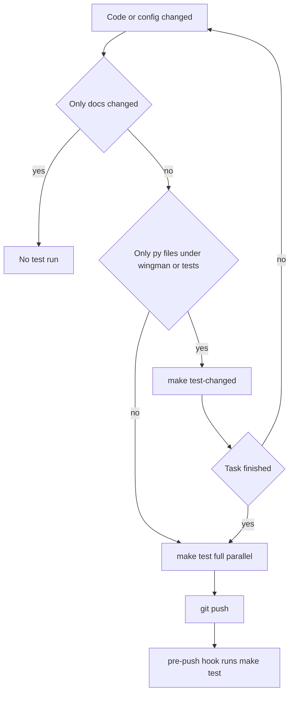

# Design 016 — Faster Test Feedback: Parallel Suite, Change-Scoped Runs and a Run Policy

| Status | Date       | Wingman Version |
|--------|------------|-----------------|
| Draft  | 2026-09-25 | 1.8.11          |

## Overview

`make test` runs the whole unit and integration suite serially in about seven minutes. A
change that touches one module waits as long as one that touches everything, so the choice
is between running the full suite after every edit, which is slow, and skipping it, which
misses the failures only a full run finds.

This design removes most of that trade-off in four parts:

1. **Run the full suite in parallel** (`pytest-xdist`), so a full run costs a minute or two.
2. **Run only the affected tests while iterating** (`pytest-testmon`, `make test-changed`),
   falling back to the full suite when a change is one testmon cannot see.
3. **Enforce one full run before code leaves the machine** (a versioned git pre-push hook).
4. **Write down when each kind of run is required** (a rule in `CLAUDE.md`), so people and
   Claude sessions apply the same policy.

The operator-owned gates (`make tp`, `make tp-full`, the replay and live-screen lanes) are out
of scope. They take over the display and write performance files, and stay manual.

## Context

### Measurements

Figures are **measured** unless labelled. The per-test durations come from the pytest-html
report of the 2026-09-25 20:10 run (`tests/test-output/report.html`).

| Quantity | Value |
|----------|-------|
| Tests collected by `make test` | 2,225 in 96 files (2,189 passed, 35 skipped, 1 failed) |
| Sum of per-test durations | 402 s |
| Wall time, six full runs on 2026-09-25 | 6 min 47 s to 7 min 57 s |
| Tests of 1 s or more | 102, holding 72% of the time |
| Tests of 5 s or more | 13 |
| Share of time in the 15 slowest files | 87% |
| Host | 20 cores, 30 GB RAM (17 GB available with the game running), EasyOCR on CPU |

The slowest files:

| File | Time | Tests |
|------|------|-------|
| `tests/test_pursuit_mode.py` | 66.0 s | 40 |
| `tests/test_analyzer_lifecycle.py` | 49.1 s | 6 |
| `tests/test_climb_mode.py` | 47.9 s | 59 |
| `tests/test_analyzer.py` | 37.0 s | 50 |
| `tests/test_eject_heatdive.py` | 32.8 s | 31 |
| `tests/test_automated_levels.py` | 24.1 s | 10 |

The slowest single tests are analyzer lifecycle and respawn OCR tests at 11 to 13 s each
(for example `test_analyzer_lifecycle.py::test_cleanup_signals_click_to_thread`), which
construct a `GameStateAnalyzer` and so an EasyOCR reader. Much of the rest is fixed sleeps:
28 test files call `time.sleep`, 76 times in `test_climb_mode.py` alone.

### What the full suite caught in one session

On 2026-09-25 one Claude session ran the full suite six times (about 40 minutes). Five runs
reported nothing the targeted runs had not already shown. One found a real regression
outside the files being changed: the squad-lobby READY crop had been shrunk in a merge commit,
and `tests/test_lobby_ready_squad_layout.py` failed. No targeted selection would have found
it. That run is the argument for keeping the full suite; the other five are the argument for
making it cheap.

### Constraints

- **Memory, not cores, bounds parallelism.** Each worker that touches OCR loads its own
  EasyOCR model and torch on CPU. The live wingman process reached 2.7 GB RSS on 2026-09-25;
  a test worker is assumed to need 1 to 2 GB when it loads OCR (**assumed**, measured in
  Phase 1). Twenty such workers would not fit alongside the game.
- **Some tests share state outside the process:** files under `tests/test-output/`, the X
  display and tkinter, module globals such as `analyzer._use_gpu`, and the known
  `test_input_linux` ordering leak (a `KeyPress` mock that only fails in a full run).
- **No CI service.** Everything runs on the operator's machine, the Docker lane
  (`make docker-test`) or a Claude Code cloud session.
- `uv` owns dependencies (`uv add --dev`), and the `Makefile` is the entry point for every run.

## Goals

- **G1.** A full `make test` in under 2 minutes on the operator's machine, with the game
  running, and no new failures or flakes.
- **G2.** An iteration run that selects only affected tests, finishes in seconds for a
  one-module change, and never silently skips a test a change could break.
- **G3.** A full run happens at least once before code is pushed, without anyone having to
  remember it.
- **G4.** One written policy for when each run is required, used by people and Claude sessions.

Non-goals: speeding up the operator lanes (`tp`, `tp-full`, `rr-*`, `ocr`), rewriting the slow
tests (listed as a later phase), and adding a hosted CI service.

## Design

### Which run, when

In words: while iterating, `make test-changed` runs the tests affected by the change. When the
change includes a non-Python input (`wingman/config.yaml`, fixtures, replay YAML) or
`wingman/config_schema.py` (Python, but read by nearly every test that loads a config), or when
the task is finished, run the full parallel suite. The pre-push hook repeats the full run as the backstop.

### Part 1 — Parallel full suite (`pytest-xdist`)

`make test` gains `-n $(TEST_WORKERS) --dist loadgroup`:

- **Distribution.** `--dist loadfile` would keep each file on one worker, which is simplest
  for isolation but sets a floor of 66 s (`test_pursuit_mode.py`). `loadgroup` distributes
  individual tests like `load`, except that tests marked
  `@pytest.mark.xdist_group(name=...)` stay together on one worker. The expected floor is then
  the slowest single test, about 13 s.
- **Workers.** `TEST_WORKERS` defaults to 8 and can be overridden (`make test TEST_WORKERS=4`).
  The default is chosen for memory (see Constraints), not for the 20 cores, and is revisited
  with the Phase 1 measurement.
- **OCR groups.** Tests that build a real `GameStateAnalyzer` or EasyOCR reader get an
  `xdist_group` per file (`ocr-analyzer`, `ocr-lifecycle`, and so on), so each group's worker
  loads the model once and the remaining workers never do. This is the main memory control. A
  single `ocr` group would load the model only once, but its queue would set the floor: the
  three heaviest OCR files alone sum to about 110 s (`test_analyzer_lifecycle.py` 49 s,
  `test_analyzer.py` 37 s, `test_automated_levels.py` 24 s). With one group per file the floor
  is the largest group, about 49 s, and at most a handful of workers hold a model.
- **Serial lane.** Tests that need a resource no two processes can share (the X display, a
  fixed path under `tests/test-output/`) get a `serial` marker. `make test` runs
  `-m "not serial"` in parallel, then `-m serial` without xdist. Where a shared path is the only
  problem, the fix is `tmp_path` rather than the marker.
- **Report.** pytest-html supports xdist, so `tests/test-output/report.html` stays. The serial
  pass writes `report-serial.html` beside it.
- **Escape hatch.** `make test-serial` keeps today's single-process behaviour
  (`-p no:xdist`) for debugging a failure that only shows in parallel, or the reverse.

Expected wall time (**inferred**): the larger of the work spread over the workers (402 s over
8 is about 50 s) and the largest OCR group (about 49 s), plus worker start-up (each worker
imports torch, a few seconds) and the serial lane. The estimate is 1 to 1.5 minutes, confirmed
or corrected in Phase 1.

### Part 2 — Change-scoped runs (`pytest-testmon`)

A new `make test-changed` target runs `scripts/test-changed.sh`:

1. List the files changed against `HEAD` (`git diff --name-only HEAD`, plus untracked files).
2. If only docs changed, run nothing and say so.
3. If any changed file is not a `.py` file under `wingman/` or `tests/` (config YAML,
   fixtures, replay paths, `pyproject.toml`, `uv.lock`), or is `wingman/config_schema.py`,
   run the full parallel suite and say why. testmon tracks which Python lines each test
   executes; it cannot see a YAML value a test reads.
4. Otherwise run `pytest --testmon`, which selects the tests whose recorded code changed.

testmon keeps its record in `.testmondata` (gitignored). The first run is a full run that
builds it, and every later run updates it. A full `make test` does not update it (it runs
without `--testmon` so that its timing is not inflated by coverage recording), so the record
can age; `make test-changed` rebuilds it when it is older than a day or missing.

Whether testmon works under xdist is not assumed either way; Phase 2 checks it. The design
does not depend on it: a change-scoped selection is small enough to run serially.

### Part 3 — Pre-push hook

A versioned hook in `.githooks/pre-push` runs `make lint` and `make test`, and blocks the push
on failure. `make hooks` installs it (`git config core.hooksPath .githooks`); nothing installs
itself. `git push --no-verify` skips it. It never runs the operator lanes.

The operator's `make p` and `make q` flows push, so they pick the hook up automatically. With
the parallel suite a push costs about the Phase 1 wall time; if that proves too slow for the
frequent `wip` pushes, the hook can run `make test-changed` instead (open question 3).

### Part 4 — Run policy in `CLAUDE.md`

A short section under `## Commands`:

- While iterating: `make test-changed`, or the specific test files of the code being changed.
- Once per task, before reporting it finished: `make test`. One run for the task, not one per
  edit.
- Always a full `make test` after a change to `wingman/config.yaml`, `wingman/config_schema.py`,
  code defaults, or a module imported widely (`analyzer.py`, `controller.py`,
  `tick_handlers.py`, `main.py`).
- Docs-only changes: no test run.
- Never `make tp` or `make tp-full` unprompted (they belong to the operator).

A Claude Code hook that runs tests after every turn was considered and rejected (see
Alternatives).

## Rollout

| Phase | Work | Done when |
|-------|------|-----------|
| 1 | `uv add --dev pytest-xdist`; `TEST_WORKERS`; `loadgroup`; per-file OCR groups and the `serial` marker; `make test-serial`. Run the suite 5 times in parallel with the game running. | Median wall time under 2 min; peak memory recorded; 5 of 5 runs with the same failures as a serial run; every new failure traced to a shared resource and fixed or marked. |
| 2 | `uv add --dev pytest-testmon`; `scripts/test-changed.sh`; `make test-changed`; `.testmondata` gitignored. | Mutation check: editing a function in `tracker.py` selects its tests and not unrelated ones; editing `config.yaml` falls back to the full run; a docs-only change runs nothing. |
| 3 | `.githooks/pre-push`, `make hooks`. | A push with a failing test is blocked; `--no-verify` bypasses it. |
| 4 | The `CLAUDE.md` section. | One Claude session run under the policy uses one full run per task. |
| 5 (later) | Replace fixed sleeps in the slowest files with event waits or an injected clock, starting with `test_pursuit_mode.py`, `test_climb_mode.py` and `test_eject_heatdive.py`. | Summed duration of those files cut by half; no loss of coverage. |

Each phase is independent and reversible: removing the flags from `make test` restores serial
runs, and `make test-changed` and the hook are additive.

## Risks

| Risk | Mitigation |
|------|------------|
| Hidden order dependencies surface as parallel-only failures (the `test_input_linux` leak is one known case). | Phase 1's five-run check; `make test-serial` to compare; fix the leak rather than mark it where the cause is known. |
| Workers exhaust memory while the game runs. | `TEST_WORKERS` default 8, the per-file OCR groups, peak memory measured in Phase 1. |
| testmon misses a dependency it cannot trace (YAML, images, subprocesses, dynamic imports). | The non-`.py` fallback in `test-changed.sh`, and the full run at task end and on push. |
| The pre-push hook is slow enough that it gets bypassed by habit. | Measure in Phase 1; open question 3 allows a lighter hook. |
| Parallel runs interleave output, making failures harder to read. | The HTML report is per test; `make test-serial` for a readable re-run. |

## Alternatives considered

- **Keep the suite serial and run it less often.** This is the current informal practice. It
  keeps the seven-minute cost whenever the full run is needed, and depends on judging when that
  is. Rejected as the only measure; kept as the policy in Part 4.
- **`--dist loadfile` instead of `loadgroup`.** Simpler isolation, but the 66 s file sets the
  floor. Kept as the fallback if `loadgroup` shows isolation problems in Phase 1.
- **A Claude Code hook that runs tests after each turn.** It would fire on turns that change
  nothing, and would run the wrong scope on turns that do. Rejected in favour of the written
  policy.
- **A hosted CI service.** Useful for pushes from other machines, but it does not shorten the
  local loop, which is the problem here. Out of scope.
- **Rewrite the slow tests first.** The largest structural gain, but the most work. Phase 5,
  after the cheap wins.

## Open questions

1. The worker count: 8 is a memory-based guess. Phase 1 measures peak memory with the game
   running and sets the default.
2. Should `make docker-test` also run in parallel? The container has its own memory limit, and
   the cloud-session guidance in `CLAUDE.md` already warns about disk and memory.
3. Should the pre-push hook run the full suite or `make test-changed`, given how often the
   operator pushes `wip` commits?
4. Does testmon's record stay correct across branch switches and merges, or does it need a
   rebuild after each? Checked in Phase 2.

## References

- `Makefile`: `test`, `PYTEST_RUN`, `TEST_EXCLUDED_FILES`, `docker-test`
- `pyproject.toml`: `[tool.pytest.ini_options]`, the `slow` marker
- `tests/conftest.py`: session-level setup (warning filters and other hooks), which each xdist worker runs
- `CLAUDE.md`: `## Commands`, `## Command Execution`, `## Python Environment`
- pytest-xdist: `--dist loadgroup` and `xdist_group`
- pytest-testmon: `--testmon` and `.testmondata`
