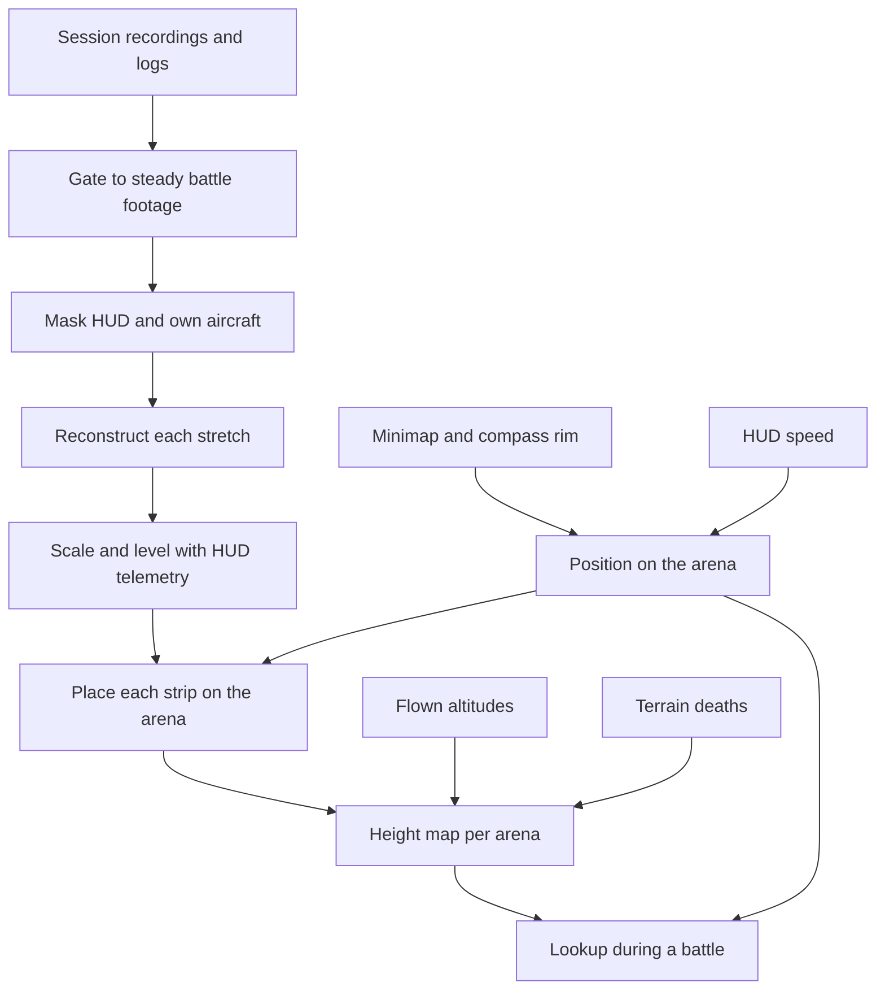

# Design 017 — Terrain Map From Flight Footage

| Status | Date       | Wingman Version |
|--------|------------|-----------------|
| Draft  | 2026-10-03 | 1.9.0           |

## Overview

MetalStorm plays on a small set of maps that repeat. Wingman has so far treated every flight as if the terrain
were unknown and tried to detect it in the forward view as it comes ([Design 001](001-terrain-avoidance-hldd.md)).
This design does the opposite: build a model of each map once, offline, from the pictures and telemetry wingman
already produces, and during a battle look up the terrain around the aircraft instead of rediscovering it.

Nothing here is implemented in wingman. A spike on existing footage shows the central step works ("Spike").

## Why

Measured on 2026-10-03, in the sessions recorded in Design 001:

- **Detection is not what kills the aircraft.** In a 51-mission session the existing descent trigger
  ([ADR 086](../adr/086-climb-exit-attitude-and-time-to-ground-recovery.md)) fired before all 17 deaths
  labelled terrain, a median 12.5 s ahead, and the aircraft died anyway.
- **The aircraft lives where the terrain is.** Terrain deaths happened at a median 1,507 m; during pursuit
  the aircraft flew at a median 1,984 m. Time to ground is computed against zero altitude, so it read 18 s
  where the terrain was 1.3 s away.
- **A recovery needs room it often does not have.** Survivors of an emergency climb lost a median 485 to
  860 m, and the worst tenth 1,500 to 1,900 m.
- **The forward view has limits no tuning removes.** It goes unreadable when the ground is closest, it cannot
  see ground below a raised nose, and by the time a mesa is flagged it fills the view and there is no way out
  to offer.

A map answers the questions the forward view cannot: how high is the ground here, how high is it ahead, and
which way is lower.

## Goals

1. The aircraft's position on the arena, with a stated error, on every battle tick while it is alive. This comes
   first: a height map is no use to an aircraft that does not know where on it it is, and the strips of
   reconstructed terrain cannot be joined without it.
2. A height map for each arena: for a place on the map, the terrain's height, or "not known".
3. Both built from data wingman already has: session recordings, HUD telemetry, the minimap, and its own
   deaths.
4. Built offline, improved by every flight, and checked against the flights themselves.

## Non-goals

- **Not reinforcement learning.** Building a map is a measurement problem and the measurements exist. Learning
  how to fly given the map may be a later question; it is not this one.
- **No actuation.** This design ends at "wingman knows the terrain height around it". What the tactics do with
  that is a separate decision, and the plan for the spawn nose-up in Design 001 still applies.
- **No full 3D mesh.** A height per place is enough for terrain avoidance and far easier to build, store and
  check.
- **No change to the forward-view detectors.** They stay in shadow as they are.

## Design

### Position

Reconstruction gives the shape of the terrain in each strip's own frame. It does not say where the aircraft is.
Position comes from the minimap, which is on screen for the whole battle and does not depend on the forward
camera, so it still reads in hard turns and with the padlock on, when the footage gate rejects every frame.

[Design 010](010-mini-map-detection/010-mini-map-detection-hldd.md) established how the minimap behaves: it is
heading-up, the own aircraft is fixed at its centre pointing up, the compass letters rotate round the rim, and
it shows a window round the aircraft, not the whole arena.

No single source gives a position on every tick, so position is an estimate kept from tick to tick and fed by
five parts:

1. **Heading from the compass rim.** The angle of the compass letters gives the aircraft's heading. Wingman does
   not read it today; Design 010 was built so that it would not have to. This is new work.
2. **A fix from the minimap's terrain.** Turn the window north-up with the heading, then match its terrain
   against a picture of the whole arena stitched from earlier windows. The match gives a position.
3. **A fix from the boundary arc.** When the arena edge is in the window, the circle fitted to it
   ([ADR 107](../adr/107-boundary-turn-tactic.md)) has its centre at the arena's centre, which with the heading
   gives a position. This holds only if the arena edge is a circle, which has not been checked.
4. **Dead reckoning between fixes.** HUD speed and heading carry the position forward over featureless ground
   (water, snow), under contact icons, and whenever a match fails.
5. **A "lost" state.** The estimate carries an error that grows on every tick without a fix and shrinks on a
   fix. Past a limit the position is reported as lost and the height lookup answers "not known". After a respawn
   or a kill-cam, where the minimap is off screen, the estimate starts lost and waits for a fix.

None of this is measured. Whether the minimap match is accurate enough is the largest risk in this design.

### Which map

The lobby shows the next map's name beside the mode before every match ("CRIMSON CANYON", "ICEBOUND SNOW").
Reading it there identifies the arena without recognising terrain. Day and night versions of an arena share
their geometry; whether they share a name is not yet known.

### Four sources of height

| Source | What it gives | Coverage | Status |
|---|---|---|---|
| Reconstruction from footage | Terrain points wherever the camera has looked | Wide, uneven | Spike done |
| Flown altitude | "The terrain here is lower than this" at every place flown | Along every flight path | Not started |
| Terrain deaths | The terrain's height at the place of impact | Sparse | Not started |
| Blob range | Time to contact times speed is a distance to a piece of terrain | Wherever Design 001's shapes read | Not started |

They check each other. Every altitude the aircraft has flown at must be above the map at that place, and every
terrain death must lie on it. That is validation without any ground truth.

### Gate: which footage is used

Mapping uses only frames where all of these hold:

- the game state is a battle state. That includes `GAME_BATTLE_EJECT`, which despite its name is where
  pursuit runs (Design 015) and holds 83 to 89 percent of battle time in the sessions of 2026-10-03;
- the padlock camera is confirmed off, so the camera looks forward;
- the aircraft is alive (no respawn, no kill-cam);
- the health reading is good on that tick, which is the proof that the battle HUD is on screen;
- the picture moves from frame to frame and its rotation between frames is small.
- for the forward-view reconstruction only: terrain is in the view. A nose-up climb at height shows sky and
  nothing else, so there is nothing to reconstruct (operator, 2026-10-03, on a frame at 3,802 m with the nose
  up). The test is the view, not the altitude: a level frame at height still sees terrain, far off. The sky
  fraction wingman already logs (`sky=`) or the climb angle from altitude rate and speed can decide it.

The minimap stitching and the position fix do not take that last condition, or the padlock and steadiness
ones: the minimap reads the same whatever the nose and the camera are doing. A nose-up frame is a good position
sample and a useless reconstruction frame.

The health condition was added by the operator on 2026-10-03, after a round-end screen was read as battle: at
19:27:01 the MVP card was up for 20 s while the state still said `GAME_BATTLE_EJECT`, and the shape detector ran
on it. The state alone is not enough, because it lags the screen. On that screen no HUD value reads (altitude
was `None` on every tick), so a good health reading rejects it. The same condition applies to the minimap
stitching and to any run-time lookup.

The state, padlock and alive conditions are already on wingman's per-tick log line; health is logged
separately and has to be joined to it. The last comes from the frames themselves. The
motion condition matters: a gate without it selects the hangar lobby, which is steady because nothing moves.

On the 51-mission session, "in battle, alive, padlock off" held on 81 percent of battle ticks (186 minutes),
and a stricter gate (climb or descent under 60 m/s, view trackable) on 27 percent, in 123 unbroken stretches of
9 s or more totalling 31 minutes. That is about 6 minutes an hour of survey-grade footage with no change to how
wingman flies.

### Masking

The HUD and the own aircraft sit at the same pixels throughout a session. Offline they are found once per
session, from edges that persist across hundreds of frames, with the scoreboard, minimap and bottom strip
excluded outright. Nothing in it depends on the airframe, which ACS requires
([Design 011](011-acs-mode-hldd.md)).

### Reconstruction

Structure from motion on each gated stretch: match features between overlapping frames, solve for the camera's
positions, triangulate the terrain. The tool is COLMAP through its Python package.

Forward flight is the hard case for this method: the aircraft flies at what it looks at, so terrain shifts
little sideways between frames. COLMAP's defaults reject that geometry as a starting pair. The settings that
work are in "Spike".

### Scale and level

A reconstruction comes out in arbitrary units with no sense of up.

- **Scale** from HUD speed: the distance the camera moved between two frames is speed times the frame interval.
- **Up** from HUD altitude: fit the vertical so the camera's height over the stretch follows the altitude
  readout. Taking up from the camera's own orientation is about 2 degrees out (spike).
- **Height above the map's zero** from the HUD altitude at any frame.

### Placing strips on the arena

Each stretch yields a strip of terrain in its own frame. Strips are joined by the aircraft's position and
heading at each of the strip's frames, from "Position" above. A strip is only as well placed as that estimate,
so the joining step inherits its risk.

### The height map

A grid over the arena. Each cell holds the highest terrain height seen there, a count of how many times it was
seen, and whether it is known at all. "Not known" must never be read as "clear": a cell nobody has looked at is
treated as terrain up to the arena's highest known point.

### At run time

Out of scope for building, but it shapes the map's form: wingman finds its place on the arena from the minimap,
looks up the height under and ahead of the aircraft, and has a true time to ground and a known lower direction.
A cheap lookup in a table, no vision in the loop.

## Spike (2026-10-03)

Run offline in a scratch uv environment outside the repository, on an existing recording.

- **Footage**: `logs/session_20260916_021132_acct1.mp4`, 960 by 600, one frame per 0.506 s.
- **Stretch**: 18 frames, 9 s of level flight over Crimson Canyon at about 1,690 m.
- **Settings needed**: `init_max_forward_motion` 1.0, `init_min_tri_angle` 1.5, `filter_min_tri_angle` 0.5,
  `triangulation.min_angle` 0.5, one shared `SIMPLE_RADIAL` camera, exhaustive matching, per-image masks.

| Measure | Result |
|---|---|
| Frames placed, default settings | 3 of 18 |
| Frames placed, forward-flight settings | 18 of 18 |
| Terrain points | about 4,000 |
| Mean reprojection error | 0.58 px |
| Focal length | 573 to 584 px from starting guesses of 450, 600 and 800 (field of view about 79 degrees) |
| Time | 7 s on the CPU |
| Scale from HUD speed | 1 model unit is 290 m |

Two checks the model was not told the answer to:

- **Acceleration.** The HUD shows 1,166 rising to 1,506 KPH over the stretch, a ratio of 1.29. The camera's
  steps in the model grow by 1.36 from the first half to the second.
- **Heights.** Mesa tops within 3 km ahead: median 963 m, highest about 1,170 m, with the aircraft at 1,690 m.
  Spires further ahead reach about 2,200 m, above the aircraft, as they are in the frames.

What it did not show, or showed to be wrong:

- **Up is about 2 degrees out** when taken from the camera: the model has the aircraft climbing 81 m where the
  HUD shows it descending 38 m.
- **Terrain beyond about 6 km scatters by hundreds of metres.** Flying straight at something gives little
  depth information; views from other directions are what fix it.
- **Stretches are short at two frames a second.** The recording is 44 minutes and three stretches passed the
  gate, 30 s in all.
- **One stretch, one map.** Nothing here shows that strips join.

The scripts are in `scripts/mapping-spike/` (`gate_extract.py`, `reconstruct.py`, `analyse.py`).

## Phase 1, first measurements (2026-10-03)

Offline, on the same recording (5,223 frames, 44 minutes, several arenas), with HUD speed and altitude read from
the frames by OCR. **Phase 1 is not finished and its pass mark has not been evaluated**: nothing is stitched and
no position fix has been attempted. What was measured is whether the minimap's raw signals are usable.

| Question | Result | Kind |
|---|---|---|
| Is the minimap on screen? | 3,560 of 5,223 frames (68 percent); the rest are lobby, loading and respawn | measured |
| Is the own icon at its centre? | 96 percent of those frames | measured |
| Can heading be read from the orange N? | 78 percent of own-icon frames with a strict rule; a loose rule reads 97 percent but picks rock-coloured blobs when the backdrop is orange | measured |
| Does the minimap show terrain that can be matched frame to frame? | Yes. Turned north-up, frames 2 s apart match with a median score of 0.92 (tenth percentile 0.79) | measured |
| Does the terrain's movement agree with the compass? | In straight flight with clear movement: median 0.9 degrees apart, 88 percent within 10 degrees (153 pairs) | measured |
| Is the minimap's scale fixed? | In level flight, 59 to 65 m per recording pixel, median 64 (7 pairs). That is about 32 m per pixel at full resolution, and a window radius of about 4 km | measured, small sample |
| Why does the scale look unstable over all pairs (62 to 332 m per pixel)? | HUD speed includes climb and dive; the minimap shows ground movement only. 55 of 153 pairs were steep | inferred |

What this changes in the design:

- **The terrain match is the strong signal, not the compass.** Movement over the ground can be measured from
  the minimap alone, in direction and distance, without HUD speed.
- **Dead reckoning cannot use HUD speed as it stands.** It needs ground speed, so it needs pitch or the
  altitude rate as well. The minimap's own movement is the better source while the terrain matches.
- **The minimap is not always heading-up.** In several frames the own icon is tilted and the view cone points
  elsewhere, and the heading read changes by more than 60 degrees in half a second on 4 percent of steps. Some
  of these are spawns; the rest are not explained. Design 010's statement holds for steady flight only.
- **Open water has almost nothing to match.** On the island arena the terrain share of the window falls below
  a tenth. Position there will rest on dead reckoning between islands.

## Phase 1, stitching and placing (2026-10-03)

Same recording. It holds eight battles: four on the canyon arena and four on the island arena. For each test,
three battles of an arena were stitched into one picture and every frame of the fourth was placed on it by a
search of the whole picture, with no knowledge of where the frame before it was.

**Stitching.** Each battle after the first joined the picture from a single frame, with a clear margin over the
next-best place (scores 0.81 to 0.98 against 0.24 to 0.81). Three canyon battles cover 241 to 337 sq km. The
rings of the minimap's grid come out concentric, so the grid is fixed to the arena, not to the screen.

**Placing the held-out battle.** A fix counts when its match score is over 0.7 and at least 0.15 above the
next-best place.

| Arena | Held out | Alive frames | Fix, share of alive frames | Fix, share of frames with a heading | Fix to fix against the step between them, median | Within 2 px |
|---|---|---|---|---|---|---|
| Canyon | battle 0 | 381 | 75 percent | 93 percent | 0.5 px | 100 percent of 269 |
| Canyon | battle 1 | 457 | 76 percent | 100 percent | 0.4 px | 100 percent of 321 |
| Canyon | battle 2 | 407 | 53 percent | 68 percent | 0.5 px | 99 percent of 198 |
| Canyon | battle 3 | 441 | 79 percent | 92 percent | 0.4 px | 100 percent of 328 |
| Island | battle 4 | 534 | 67 percent | 87 percent | 0.6 px | 98 percent of 324 |
| Island | battle 7 | 443 | 63 percent | 83 percent | 0.5 px | 99 percent of 251 |

One pixel is about 64 m. No pair of consecutive fixes disagreed with the step between them by more than 10 px.

Against the pass mark:

- **Error: met.** Independent fixes half a second apart agree with the measured step to about half a pixel
  (about 30 m), and 98 to 100 percent agree within 130 m. The mark was written as a share of the distance
  flown, which cannot be judged at steps of one to seven pixels; at the pixel level there is nothing to fault.
  Both sides of this comparison come from the minimap. A check against something else is still missing.
- **Coverage: not met by fixes alone.** 53 to 79 percent of alive frames, against 90. The frames lost are
  mostly ones where the heading was not read, not ones where the map failed: with a heading, 68 to 100 percent
  of frames are placed. Carrying the position between fixes ("not lost") is not built, so the mark as written
  is not yet evaluated.

What else it showed:

- **The minimap turns with the camera, not the aircraft** (inferred). Frame after frame the terrain matches
  well while the direction of movement is far from the top of the minimap, and the heading read swings widely
  during padlock. That explains the tilted own icon and the "jumps" above. It does not affect position: the
  frames are turned north-up before anything is matched. Aircraft heading would need the own icon's angle too.
- **A death and respawn is a jump to somewhere else.** The tracker re-fixes against the map after each one
  (2 to 6 times a battle), and before the map covers that place it has nothing to go on.
- **One island battle could not be joined at all.** It was flown over open water by the arena edge, and no
  frame gave a confident starting fix.
- **Battle 2's low coverage is not explained.**

**Without the N letter (later the same day).** The frame's rotation is found by trying every rotation
against the stitched picture and keeping the one that fits (`mm_rotfix.py`). On canyon battle 3, held out:

| Measure | N letter | Rotation search |
|---|---|---|
| Alive frames placed | 79 percent | 89 percent (391 of 441) |
| Rotation, against the N letter where both exist | | median 0.4 degrees apart, all 339 within 5 |
| Position, against the N-letter fix where both exist | | median 0.4 px apart, all 311 within 2 |
| Jumps between consecutive fixes (over 12 px) | | 0 of 361 |
| Longest run of alive frames with no fix | | 21 frames (about 10 s) |

**All four canyon battles, and carrying the position between fixes.** Each battle held out in turn and placed
by rotation search. Between fixes the position is carried in a straight line at the speed of the last fixes
(`mm_coast.py`). How long that can be trusted was measured on the fixes themselves, by predicting each one from
a fix some seconds earlier as if those between had been lost:

| Carried for | Cases | Error, median | Error, 9 in 10 under |
|---|---|---|---|
| 1 s | 1,318 | 45 m | 123 m |
| 2 s | 1,274 | 94 m | 282 m |
| 4 s | 1,190 | 236 m | 723 m |
| 6 s | 1,112 | 425 m | 1,278 m |
| 10 s | 972 | 880 m | 2,409 m |

A carried position is trusted for 2 s (9 in 10 within 500 m, a limit chosen here and not yet agreed) and counted
lost after that. Wingman turns too often for a straight line to last longer.

| Canyon battle held out | Alive frames | Fixed | Carried | Not lost | Rotation against the N letter | Jumps |
|---|---|---|---|---|---|---|
| 0 | 381 | 95 percent | 3 percent | 97 percent | all 293 within 5 degrees | 0 of 351 |
| 1 | 457 | 89 percent | 10 percent | 99 percent | all 315 within 5 degrees | 0 of 374 |
| 2 | 407 | 74 percent | 6 percent | 81 percent | all 238 within 5 degrees | 0 of 286 |
| 3 | 441 | 89 percent | 9 percent | 98 percent | all 339 within 5 degrees | 0 of 361 |

**Against the pass mark: three of four canyon battles meet "not lost on 90 percent of ticks"; battle 2 does not
(81 percent, 79 frames lost, the longest run 34).** Battle 2's lost frames sit in six stretches of 9 to 36 frames, all with a full, readable minimap. Two of them begin where only a third of the window is on the stitched picture, that is, where the other three battles never flew; the other four begin with 87 to 98 percent of the window on the picture and are not explained. The island arena is scored below. The search is slow as written (about a second a frame); most fixes are found next to
the previous one, which is the cheap case.

**The island arena fails the mark.** Same method, the map built from the other island battles (one of which
could not be joined at all):

| Island battle held out | Alive frames | Fixed | Carried | Not lost | Rotation against the N letter | Jumps |
|---|---|---|---|---|---|---|
| 4 | 534 | 57 percent | 16 percent | 73 percent | 97 percent of 238 within 5 degrees | 12 of 265 |
| 7 | 443 | 55 percent | 8 percent | 64 percent | 97 percent of 185 within 5 degrees | 2 of 227 |

Three things are worse here than on the canyon. Fewer frames are placed than with the N letter (57 and 55
percent against 67 and 63), so on open water the rotation search loses frames the letter would have kept. Some
fixes are wrong: 14 jumps of more than 12 px between consecutive fixes, where the canyon had none. And the map
itself is thinner, built from two battles with half their frames placed by step and not against the map. A
carried position also drifts faster (9 in 10 within 448 m after 2 s, against 282 m).

So the position fix is good enough on an arena with terrain everywhere and not yet on one that is mostly
water. Using the N letter where it reads and the rotation search where it does not has not been tried.

Next for phase 1: on the island arena, use the N letter where it reads and the rotation search only where it
does not, and reject a fix that jumps; find what loses the rest of battle 2; and check a position against
something other than the minimap. The scripts are in `scripts/mapping-spike/`, a small uv project of its own: `mm_scan.py`,
`mm_runs.py`, `mm_stitch.py`, then `mm_rotfix.py`, run from a working folder that holds an `mm/` folder for their output.

## Phases

Each phase is offline until phase 5, and each has a check that can fail.

1. **Position from the minimap.** Read heading from the compass rim, stitch one arena's minimap from a
   recording, and run the position estimate over held-out battles of the same arena. Two measures, per alive
   battle tick:
   - **Coverage**: the share of ticks where the position is not lost.
   - **Error**: between two consecutive fixes, the distance the fixes say the aircraft moved against the
     distance HUD speed and heading say it moved.

   Proposed pass mark, for the operator to confirm: not lost on 90 percent of ticks, and the two distances
   within 10 percent of each other on 90 percent of fix pairs. A fail here stops the design before any more
   reconstruction work.
2. **Join strips.** Reconstruct several stretches of one arena, level them with HUD altitude, place them with
   phase 1. Check: where two strips overlap, their heights agree.
3. **Add the other sources.** Flown altitudes and terrain deaths from the logs, placed the same way. Check: no
   flown altitude is below the map; deaths lie on it.
4. **Capture for it.** Raise `session_recording.fps` and `scale` for mapping sessions, and move the spike
   scripts into `scripts/`. Check: gated footage per hour, and coverage of each arena.
5. **Lookup in shadow.** Wingman logs the map's terrain height under and ahead of the aircraft each tick, beside
   the existing `ttg=`. Check: before terrain deaths, the map's time to ground is short where the existing one
   was long.

Actuation comes after phase 5 and is not designed here.

## Open questions

1. Mostly answered: position can be recovered from the minimap, to about a pixel (64 m at half resolution), on
   the two arenas tried. Open: coverage between fixes, and a check against something other than the minimap.
2. Closed: the minimap shows a heading-up window round the aircraft, not the whole arena
   ([Design 010](010-mini-map-detection/010-mini-map-detection-hldd.md)). Still open: whether the window's
   scale is fixed, how many metres its radius covers, and whether the arena edge is a circle.
3. Do day and night versions of an arena share a lobby name?
4. What does the HUD's altitude measure from? The spike's heights assume one zero for the whole arena.
5. How much does 960 by 600 limit height accuracy, and is full resolution worth the disk?
6. How should cells that are water be recorded? They never reconstruct, and they are never a hazard.
7. Does the reconstruction package join the project's dependencies, or stay a separate offline tool? It is a
   scratch environment today, by the operator's decision of 2026-10-03.

## Risks

- **Wingman flies where the fighting is.** Coverage will be uneven, and some of each arena may never be seen.
  The "not known" rule is what keeps that safe.
- **The death label over-counts terrain.** It misled in three ways on 2026-10-03
  ([ADR 143](../adr/143-classify-died-armed-deaths-enemy-fire-vs-terrain.md), and Design 001's 16:40 row). A death is a height sample only when the flight state supports it.
- **The nested display throttles to one picture a second when its window is hidden** (Design 001, 16:10 row;
  [Design 009](009-nested-display-isolation-hldd.md) lists it as not established). Footage recorded in that
  state is useless and the gate must reject it.
- **Game updates can change a map.** The checks in phases 2 and 3 run on every new session, so a changed arena
  shows up as disagreement.

## References

- [Design 001](001-terrain-avoidance-hldd.md): forward-view terrain detection, and every measurement quoted in
  "Why".
- [Design 009](009-nested-display-isolation-hldd.md): the nested display.
- [Design 010](010-mini-map-detection/010-mini-map-detection-hldd.md) and [Design 013](013-minimap-center-seeking-navigation-hldd.md): existing
  minimap work.
- [Design 011](011-acs-mode-hldd.md): any airframe.
- [Design 012](012-session-recording-and-bt-trace-hldd.md): the session recorder.
- [ADR 086](../adr/086-climb-exit-attitude-and-time-to-ground-recovery.md): time to ground.
- [ADR 107](../adr/107-boundary-turn-tactic.md): the arena boundary on the minimap.
- [ADR 143](../adr/143-classify-died-armed-deaths-enemy-fire-vs-terrain.md): the death labels.
