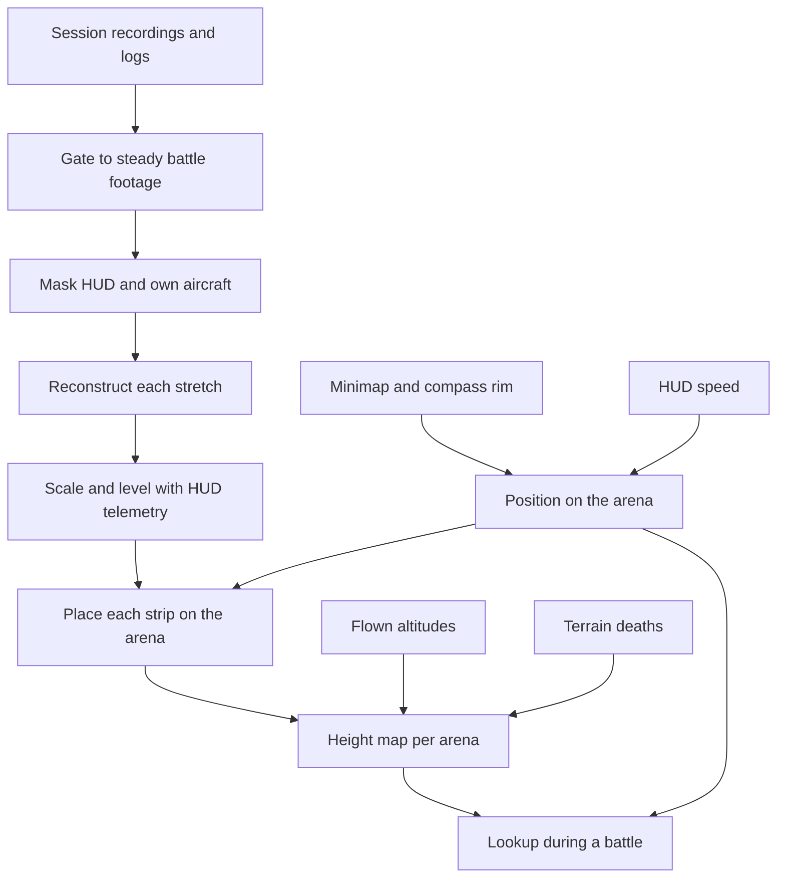
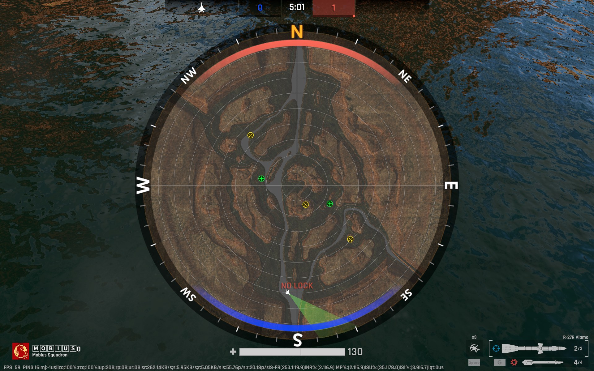
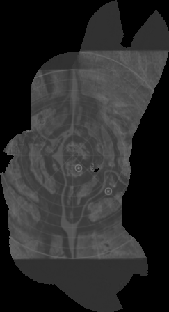
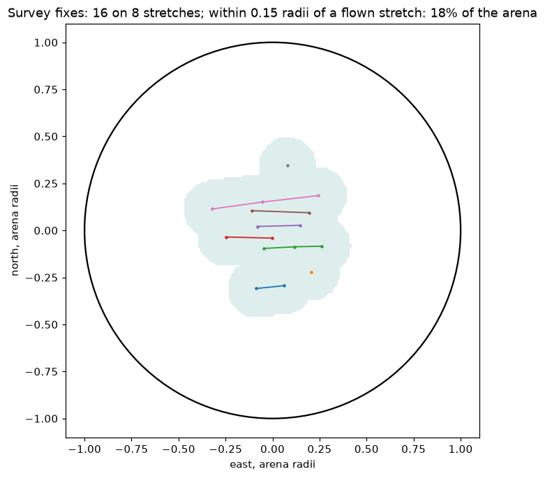
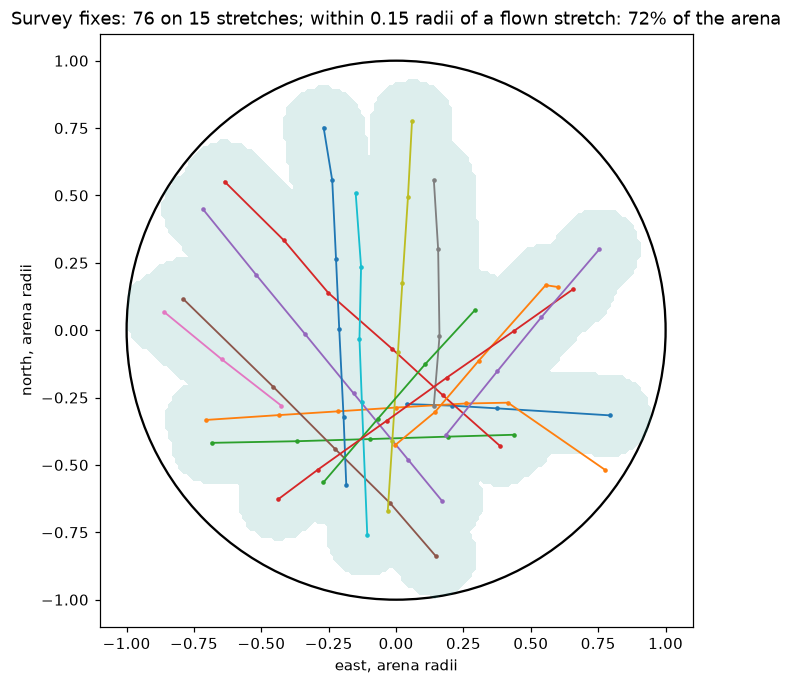
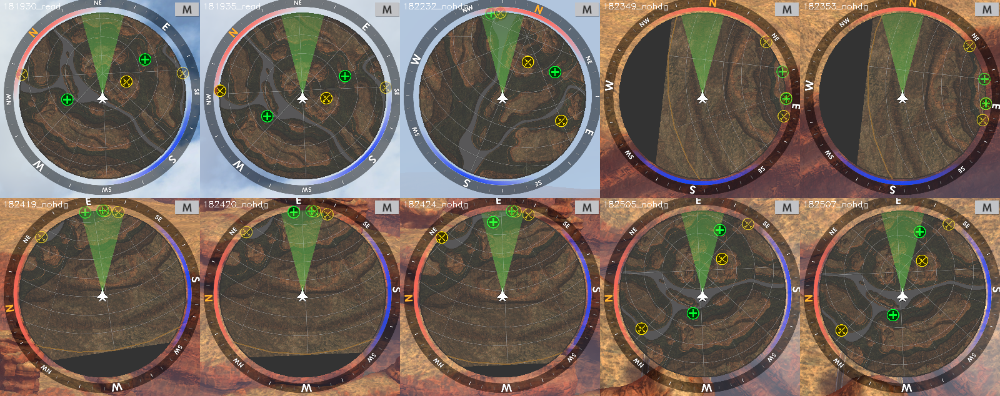

# Design 017 — Terrain Map From Flight Footage

| Status | Date       | Wingman Version |
|--------|------------|-----------------|
| Draft  | 2026-10-03 | 1.9.0           |

## Overview

MetalStorm plays on a small set of maps that repeat. Wingman has so far treated every flight as if the terrain
were unknown and tried to detect it in the forward view as it comes ([Design 001](001-terrain-avoidance-hldd.md)).
This design does the opposite: build a model of each map once, offline, from the pictures and telemetry wingman
already produces, and during a battle look up the terrain around the aircraft instead of rediscovering it.

As of 2026-10-04 three pieces of it run in wingman: a compass heading read from the minimap, a position
read from the game's full map, and a survey mission that flies an arena in straight passes using both. The
map itself is not built: no strips have been joined, and nothing looks terrain up in flight. "Where this
stands" below is the place to start reading when this work is picked up again.

## Where this stands (2026-10-04, end of the day)

Work stopped here on 2026-10-04 at 19:00, to be resumed the following week. Nothing since commit `88a29b3`
is committed: the compass, the full-map reader, the survey mission, `make survey`, the desktop extension's
version 4 and every document change of the day are in the working tree.

### The setup the survey flights need

From the operator, 2026-10-04. Every survey flight in this document was flown this way, and every figure
measured on them (turn rates, the pitch response, the arena's size, what the minimap's rim shows) belongs to
this setup. Nothing has been tried on another aircraft, mode or arena.

| | |
|---|---|
| Aircraft | MiG-29 |
| Match | A custom 1 on 1 match with "Fill with bots" turned off, so that there is no opponent |
| Mode and map | Team Deathmatch on Crimson Canyon |
| Survey mode | `make survey` switches it on and off for this machine. It writes `mission.default_mission: survey` to the untracked `wingman/config.local.yaml`; off goes back to the shipped mission |
| Launch | `make r1 v`. The `v` records the session, and the recording is the footage |
| Desktop | Version 4 of the `wingman-window-left` extension loaded (it loads at login). Without it the game falls to one frame a second whenever its window is behind another ([ADR 155](../adr/155-window-left-extension-for-the-nested-display.md), D5) |

The survey carries no weapons and no defence. It is only for a match with nobody else in it.

### What is built

| Piece | Where | State |
|---|---|---|
| Compass heading from the minimap's orange N | `wingman/compass.py`, `GameStateAnalyzer.read_compass_heading` | Flown all day. Agrees with the full map's view cone to a median 2 to 4 degrees (over 200 pairs). Its letter-size limits were changed at 18:35 and have not flown |
| Position from the full map (`m`) | `wingman/full_map.py`, `Controller._survey_look_at_map` | Flown: about 230 looks. With the reader that asks for the N alone, 101 looks on the fourteenth flight and no map left open |
| Survey mission | `wingman/survey.py` (`SurveyPlan`, decisions only), `Controller.mission_survey` (the loop), `survey_mission` in `wingman/config.yaml` | Flown on fifteen flights. See the table below |
| Survey mode on and off | `make survey`, `scripts/toggle-survey.py` | Done, tested |
| Game drawn at full rate behind other windows | `scripts/gnome-extension/wingman-window-left@wingman.local`, version 4 | Confirmed for a covered window. Minimised, other workspace, lock screen and monitor off are untested ([ADR 099](../adr/099-nested-display-lane-for-unattended-operation.md), V3) |
| Offline tools | `scripts/mapping-spike/` | `survey_track.py` (track and coverage from a log), `survey_swing.sh` (altitude swing per pass), `survey_watch.py` (saves pictures when a look or the compass fails), `check_pass.py` and `extract_range.py` (test a reconstructed stretch against the HUD), and the phase 1 and spike scripts |

### The flights, in one table

Coverage is the share of the arena within 0.15 radii (about 1.4 km) of a flown stretch, from the full-map
fixes. Before the eleventh flight there were no fixes, so there is no figure.

| Flight | Time | What was new | Battles | Coverage | Deaths |
|---|---|---|---|---|---|
| 1 to 7 | 09:22 to 11:34 | The mission itself, a fault at a time | | | |
| 8 | 13:12 to 16:03 | Nothing: the baseline. Passes on 000 and 180 only | 24 | not measured | 3 |
| 9 | 16:12 to 16:34 | Each battle 45 degrees further round | 3 | not measured | 0 |
| 10 | 16:34 to 17:02 | Altitude hold on the newest reading, half the gap per press | 4 | not measured | 1 |
| 11 | 17:02 to 17:10 | The look at the full map, logged only | 1 | 18 percent | 0 |
| 12 | 17:17 to 17:38 | The look watches the picture after each key | 3 | 29 percent | 1 |
| 13 | 17:38 to 18:07 | Turn back on the position, not on the minimap's rim | 4 | 72 percent | 0 |
| 14 | 18:13 to 18:48 | A lane's width between passes, an earlier first look, the map known by its N alone | 5 | 84 percent | 2 |
| 15 | 18:48 to 18:59 | Cycle 6 (below) | 1, of which 45 s flown | | 0 |

What that adds up to: the survey now crosses the whole arena and covers most of it in half an hour, where
at midday it was flying the middle third without anyone knowing. It does not yet fly well enough for the
footage: the altitude swings by hundreds of metres, and on the tenth to fourteenth flights it died four
times in seventeen battles.

### In the tree and not yet flown

These were built after the fourteenth flight. The fifteenth carried most of them and was over in 45 s, so
none has been seen working:

- the compass letter's size limits (0.002 to 0.005 of the radius squared), so that pieces of rim markers are
  not counted as letters;
- the step across made to the side that has room (`lane_limit_frac`);
- no pull in the survey's turns unless the turn is sinking faster than 30 m/s (`turn_climb_max_ms: -30`);
- the step cut short at 0.85 radii and the tree's boundary turn refused inside 0.97;
- a look at the map only on a tick whose compass was read, which is the rule the 18:50 exit showed is needed
  (see the fifteenth flight under phase 4b).

The tree as left passes the gate: `make lint` clean and `make test` 2,864 passed, 33 skipped (2026-10-04
19:10). `tests/test_input_linux.py::test_a_deaf_listener_is_restarted` failed in four of the day's full runs
and passed in this one and whenever its file ran alone on a quiet machine; it is sensitive to load and
untouched by this work.

### Open problems, in the order to take them

1. **Who opened the scoreboard menu at 18:50:24.** The match was exited two seconds after wingman pressed `m`
   into that menu. Wingman's log shows only roll presses in the second before the menu appeared, so either
   the operator opened it or a key wingman presses opens it in some state that is not understood. This is
   settled before the next flight, because the answer decides whether the same-tick compass rule is enough.
2. **Fly what is unflown** (the list above) and measure it: unread-compass spells, height gained in turns,
   where the lanes fall, deaths.
3. **The altitude hold.** The swing was about 350 m from 35 s into a pass on the tenth and thirteenth
   flights, down from 500. Near a stall the hold keeps pressing and overshoots into a dive (18:31). Its
   press should be sized with the speed, and it should know the nose angle sooner than the climb rate
   tells it.
4. **Deaths in the first minute after a spawn** (13:21, 13:48, 18:43): low, an emergency climb in
   progress, a dive it does not come out of. That is the emergency climb's fault and belongs to
   [Design 001](001-terrain-avoidance-hldd.md), but the survey meets it every few battles.
5. **What the minimap's rim reader sees near the middle of the arena.** It reports an edge 0.3 to 0.7
   minimap radii away when the real edge is 6 to 9 km off. The survey now ignores it when it has a position.
   The tree's boundary turn does not, on any mission.
6. **Where the passes go across battles.** Each battle starts its lanes from wherever it spawned. Nothing
   remembers which parts of the arena earlier battles covered.
7. **Before strips can be joined** (phase 2): a gate that uses the survey's logged state and a test for
   terrain in view, a mask for the own aircraft, the HUD check on every strip, and frames with the map open
   dropped. All offline, none started.

### Left for the operator to decide

- Committing: nothing has been committed all day.
- Removing the one-pixel guard that did not work (`wingman/present_copy_guard.py`,
  `tests/test_present_copy_guard.py`, `nested.block_page_flips`). It is still switched on in this machine's
  `wingman/config.local.yaml`, where it does nothing.
- Deleting `scripts/mapping-spike/survey_capture.py`, written on 2026-10-04 and never run.
- Survey mode is still switched on in `wingman/config.local.yaml`. `make survey` turns it off.

### Where the evidence is

- Logs: `wingman.log` (the fifteenth flight) and `logs/wingman_20261004_*.log`. Recordings:
  `logs/session_20261004_*_acct1.mp4`, eight of them from 13:12 on, 1.5 GB, half size at two frames a second.
- Pictures kept with this document, in `017-terrain-map-from-flight-footage/`: the full map, the two track
  pictures, and the minimaps with the compass unread.
- The day's working pictures (the map-look probe, the frames round failed looks) were in the session's
  scratch folder under `/tmp` and are not kept.

## Why

Measured on 2026-10-03, in the sessions recorded in Design 001:

- **Detection is not what kills the aircraft.** In a 51-mission session the existing descent trigger
  ([ADR 086](../adr/086-climb-exit-attitude-and-time-to-ground-recovery.md)) fired before all 17 deaths
  labelled terrain, a median 12.5 s ahead, and the aircraft died anyway.
- **The aircraft lives where the terrain is.** Terrain deaths happened at a median 1,507 m; during pursuit
  the aircraft flew at a median 1,984 m. Time to ground is computed against zero altitude, so it read 18 s
  where the terrain was 1.3 s away.
- **A recovery needs room it often does not have.** Survivors of an emergency climb lost a median 485 to
  860 m, and the worst tenth 1,500 to 1,900 m.
- **The forward view has limits no tuning removes.** It goes unreadable when the ground is closest, it cannot
  see ground below a raised nose, and by the time a mesa is flagged it fills the view and there is no way out
  to offer.

A map answers the questions the forward view cannot: how high is the ground here, how high is it ahead, and
which way is lower.

## Goals

1. The aircraft's position on the arena, with a stated error, on every battle tick while it is alive. This comes
   first: a height map is no use to an aircraft that does not know where on it it is, and the strips of
   reconstructed terrain cannot be joined without it.
2. A height map for each arena: for a place on the map, the terrain's height, or "not known".
3. Both built from data wingman already has: session recordings, HUD telemetry, the minimap, and its own
   deaths.
4. Built offline, improved by every flight, and checked against the flights themselves.

## Non-goals

- **Not reinforcement learning.** Building a map is a measurement problem and the measurements exist. Learning
  how to fly given the map may be a later question; it is not this one.
- **No actuation.** This design ends at "wingman knows the terrain height around it". What the tactics do with
  that is a separate decision, and the plan for the spawn nose-up in Design 001 still applies.
- **No full 3D mesh for wingman.** A height per place is enough for terrain avoidance and far easier to build,
  store and check. A mesh to look at is an export of that height map, or of the dense reconstruction once a GPU
  machine is set up; wingman does not need it.
- **No change to the forward-view detectors.** They stay in shadow as they are.

## Design

### Position

Reconstruction gives the shape of the terrain in each strip's own frame. It does not say where the aircraft is.
Position comes from the minimap, which is on screen for the whole battle and does not depend on the forward
camera, so it still reads in hard turns and with the padlock on, when the footage gate rejects every frame.

[Design 010](010-mini-map-detection/010-mini-map-detection-hldd.md) established how the minimap behaves: it is
heading-up, the own aircraft is fixed at its centre pointing up, the compass letters rotate round the rim, and
it shows a window round the aircraft, not the whole arena.

No single source gives a position on every tick, so position is an estimate kept from tick to tick and fed by
five parts:

1. **Heading from the compass rim.** The angle of the compass letters gives the aircraft's heading. Design 010
   was built so that wingman would not have to read it. Since 2026-10-04 wingman reads it in shadow and logs it
   as `hdg=` on its per-tick line (`wingman/compass.py`).
2. **A fix from the minimap's terrain.** Turn the window north-up with the heading, then match its terrain
   against a picture of the whole arena stitched from earlier windows. The match gives a position.
3. **A fix from the boundary arc.** When the arena edge is in the window, the circle fitted to it
   ([ADR 107](../adr/107-boundary-turn-tactic.md)) has its centre at the arena's centre, which with the heading
   gives a position. The arena edge is a circle (see "The full map" below).
4. **Dead reckoning between fixes.** HUD speed and heading carry the position forward over featureless ground
   (water, snow), under contact icons, and whenever a match fails.
5. **A "lost" state.** The estimate carries an error that grows on every tick without a fix and shrinks on a
   fix. Past a limit the position is reported as lost and the height lookup answers "not known". After a respawn
   or a kill-cam, where the minimap is off screen, the estimate starts lost and waits for a fix.

None of this was measured when it was written; the sections on phase 1 below measure parts 1, 2, 4 and 5.

### The full map

Pressing `m` in battle puts the whole arena on screen (operator, 2026-10-04):

It is north-up and does not turn. The arena is a circle, with the grid's rings centred on it, and the aircraft's
own icon and view cone are drawn at its true place. Measured on this one picture (1920 by 1200):

| What | Result |
|---|---|
| Arena circle | centre (960, 600), the middle of the screen; radius 473 px |
| Own icon | the only pure-white blob inside the circle, at (929, 946) |
| Position | 0.064 radii west and 0.732 radii south of the arena's centre |
| Heading, from the direction of the view cone | 129 degrees |

That is an absolute position and heading from a single picture, with no stitching and no search over
rotation, on any arena, including the ones that are mostly water. It changes three things in this design:

- **It is the position fix of first resort.** The minimap methods in the phase 1 sections stay as the way to
  carry the position between looks at the full map, since the full map cannot stay open.
- **It is the picture of the arena.** One screenshot replaces the picture stitched from minimap windows, and
  is the top-down image to lay over a height map.
- **It is the check the minimap fix has lacked.** A minimap fix and a full-map fix taken a tick apart are two
  different readings of the same position.

What it costs, and what is not yet known:

- **It covers the forward view and the speed and altitude readouts** while it is open (health and weapons stay
  visible). So it is a look of a tick or two, not something to fly with, and a frame with it open is no use for
  reconstruction.
- **`m` is also one of wingman's own hotkeys, and the clash is real.** It is the auto-mission key: outside a
  battle state it forces `GAME_LOBBY` and clicks PLAY, and in a battle state one press is refused and a second
  within 2 s forces it. `m` toggles the map (operator, 2026-10-04), so opening and closing it is two presses.
  On 2026-10-04 at 03:18:47 the operator's own presses, made to look at the map, had wingman force
  `GAME_LOBBY` from `GAME_UNKNOWN` and click PLAY five times in six seconds. The operator moved the hotkey to
  `n` the same day (`AUTO_MISSION_KEY`), and `m` is now listed as a game key (`FULL_MAP_KEY`) so that a test
  keeps wingman's hotkeys off it.
- Whether the cone shows the nose or the camera is not checked; with the padlock off they are the same.

Since then (all 2026-10-04, detail under phase 4b):

- **Wingman presses `m`.** The survey opens the map for about a second every 15 s, reads it and closes it
  (`wingman/full_map.py`, `Controller._survey_look_at_map`). The map is drawn 0.3 to 0.6 s after the key
  and gone 0.3 s after the second press.
- **The scale is measured.** The arena is about 9.4 km in radius (8.8 to 10.3 km on eight pairs of fixes
  against HUD speed), so the full map is about 20 m a pixel at 1920 by 1200, not the 30 guessed from the
  stitched picture.
- **The cone and the compass agree** to a median 2 to 4 degrees with the padlock off, on over 200 pairs. In
  the climb just after a spawn they have been seen 24 and 131 degrees apart, so a heading from either is
  not to be used there.
- **The ring round the disc is see-through** and cannot be used to tell that the map is open. The orange N,
  alone at the top of the rim, can.
- **`m` is only safe on the flight HUD.** At 18:50:24 it was pressed with the game's scoreboard menu on
  screen, and the match was exited two seconds later. The look is now made only on a tick whose compass was
  read. What `m` does on other screens has not been tried on purpose.

### Which map

The lobby shows the next map's name beside the mode before every match ("CRIMSON CANYON", "ICEBOUND SNOW").
Reading it there identifies the arena without recognising terrain. Day and night versions of an arena share
their geometry; whether they share a name is not yet known.

### Four sources of height

| Source | What it gives | Coverage | Status |
|---|---|---|---|
| Reconstruction from footage | Terrain points wherever the camera has looked | Wide, uneven | Spike done |
| Flown altitude | "The terrain here is lower than this" at every place flown | Along every flight path | Not started |
| Terrain deaths | The terrain's height at the place of impact | Sparse | Not started |
| Blob range | Time to contact times speed is a distance to a piece of terrain | Wherever Design 001's shapes read | Not started |

They check each other. Every altitude the aircraft has flown at must be above the map at that place, and every
terrain death must lie on it. That is validation without any ground truth.

### Gate: which footage is used

Mapping uses only frames where all of these hold:

- the game state is a battle state. That includes `GAME_BATTLE_EJECT`, which despite its name is where
  pursuit runs (Design 015) and holds 83 to 89 percent of battle time in the sessions of 2026-10-03;
- the padlock camera is confirmed off, so the camera looks forward;
- the aircraft is alive (no respawn, no kill-cam);
- the health reading is good on that tick, which is the proof that the battle HUD is on screen;
- the picture moves from frame to frame and its rotation between frames is small.
- for the forward-view reconstruction only: terrain is in the view. A nose-up climb at height shows sky and
  nothing else, so there is nothing to reconstruct (operator, 2026-10-03, on a frame at 3,802 m with the nose
  up). The test is the view, not the altitude: a level frame at height still sees terrain, far off. The sky
  fraction wingman already logs (`sky=`) or the climb angle from altitude rate and speed can decide it.

The minimap stitching and the position fix do not take that last condition, or the padlock and steadiness
ones: the minimap reads the same whatever the nose and the camera are doing. A nose-up frame is a good position
sample and a useless reconstruction frame.

The health condition was added by the operator on 2026-10-03, after a round-end screen was read as battle: at
19:27:01 the MVP card was up for 20 s while the state still said `GAME_BATTLE_EJECT`, and the shape detector ran
on it. The state alone is not enough, because it lags the screen. On that screen no HUD value reads (altitude
was `None` on every tick), so a good health reading rejects it. The same condition applies to the minimap
stitching and to any run-time lookup.

The state, padlock and alive conditions are already on wingman's per-tick log line; health is logged
separately and has to be joined to it. The last comes from the frames themselves. The
motion condition matters: a gate without it selects the hangar lobby, which is steady because nothing moves.

On the 51-mission session, "in battle, alive, padlock off" held on 81 percent of battle ticks (186 minutes),
and a stricter gate (climb or descent under 60 m/s, view trackable) on 27 percent, in 123 unbroken stretches of
9 s or more totalling 31 minutes. That is about 6 minutes an hour of survey-grade footage with no change to how
wingman flies.

### Masking

The HUD and the own aircraft sit at the same pixels throughout a session. Offline they are found once per
session, from edges that persist across hundreds of frames, with the scoreboard, minimap and bottom strip
excluded outright. Nothing in it depends on the airframe, which ACS requires
([Design 011](011-acs-mode-hldd.md)).

### Reconstruction

Structure from motion on each gated stretch: match features between overlapping frames, solve for the camera's
positions, triangulate the terrain. The tool is COLMAP through its Python package.

Forward flight is the hard case for this method: the aircraft flies at what it looks at, so terrain shifts
little sideways between frames. COLMAP's defaults reject that geometry as a starting pair. The settings that
work are in "Spike".

### Scale and level

A reconstruction comes out in arbitrary units with no sense of up.

- **Scale** from HUD speed: the distance the camera moved between two frames is speed times the frame interval.
- **Up** from HUD altitude: fit the vertical so the camera's height over the stretch follows the altitude
  readout. Taking up from the camera's own orientation is about 2 degrees out (spike).
- **Height above the map's zero** from the HUD altitude at any frame.

### Placing strips on the arena

Each stretch yields a strip of terrain in its own frame. Strips are joined by the aircraft's position and
heading at each of the strip's frames, from "Position" above. A strip is only as well placed as that estimate,
so the joining step inherits its risk.

### The height map

A grid over the arena. Each cell holds the highest terrain height seen there, a count of how many times it was
seen, and whether it is known at all. "Not known" must never be read as "clear": a cell nobody has looked at is
treated as terrain up to the arena's highest known point.

### At run time

Out of scope for building, but it shapes the map's form: wingman finds its place on the arena from the minimap,
looks up the height under and ahead of the aircraft, and has a true time to ground and a known lower direction.
A cheap lookup in a table, no vision in the loop.

## Spike (2026-10-03)

Run offline in a scratch uv environment outside the repository, on an existing recording.

- **Footage**: `logs/session_20260916_021132_acct1.mp4`, 960 by 600, one frame per 0.506 s.
- **Stretch**: 18 frames, 9 s of level flight over Crimson Canyon at about 1,690 m.
- **Settings needed**: `init_max_forward_motion` 1.0, `init_min_tri_angle` 1.5, `filter_min_tri_angle` 0.5,
  `triangulation.min_angle` 0.5, one shared `SIMPLE_RADIAL` camera, exhaustive matching, per-image masks.

| Measure | Result |
|---|---|
| Frames placed, default settings | 3 of 18 |
| Frames placed, forward-flight settings | 18 of 18 |
| Terrain points | about 4,000 |
| Mean reprojection error | 0.58 px |
| Focal length | 573 to 584 px from starting guesses of 450, 600 and 800 (field of view about 79 degrees) |
| Time | 7 s on the CPU |
| Scale from HUD speed | 1 model unit is 290 m |

Two checks the model was not told the answer to:

- **Acceleration.** The HUD shows 1,166 rising to 1,506 KPH over the stretch, a ratio of 1.29. The camera's
  steps in the model grow by 1.36 from the first half to the second.
- **Heights.** Mesa tops within 3 km ahead: median 963 m, highest about 1,170 m, with the aircraft at 1,690 m.
  Spires further ahead reach about 2,200 m, above the aircraft, as they are in the frames.

What it did not show, or showed to be wrong:

- **Up is about 2 degrees out** when taken from the camera: the model has the aircraft climbing 81 m where the
  HUD shows it descending 38 m.
- **Terrain beyond about 6 km scatters by hundreds of metres.** Flying straight at something gives little
  depth information; views from other directions are what fix it.
- **Stretches are short at two frames a second.** The recording is 44 minutes and three stretches passed the
  gate, 30 s in all.
- **One stretch, one map.** Nothing here shows that strips join.

The scripts are in `scripts/mapping-spike/` (`gate_extract.py`, `reconstruct.py`, `analyse.py`).

## Phase 1, first measurements (2026-10-03)

Offline, on the same recording (5,223 frames, 44 minutes, several arenas), with HUD speed and altitude read from
the frames by OCR. **Phase 1 is not finished and its pass mark has not been evaluated**: nothing is stitched and
no position fix has been attempted. What was measured is whether the minimap's raw signals are usable.

| Question | Result | Kind |
|---|---|---|
| Is the minimap on screen? | 3,560 of 5,223 frames (68 percent); the rest are lobby, loading and respawn | measured |
| Is the own icon at its centre? | 96 percent of those frames | measured |
| Can heading be read from the orange N? | 78 percent of own-icon frames with a strict rule; a loose rule reads 97 percent but picks rock-coloured blobs when the backdrop is orange | measured |
| Does the minimap show terrain that can be matched frame to frame? | Yes. Turned north-up, frames 2 s apart match with a median score of 0.92 (tenth percentile 0.79) | measured |
| Does the terrain's movement agree with the compass? | In straight flight with clear movement: median 0.9 degrees apart, 88 percent within 10 degrees (153 pairs) | measured |
| Is the minimap's scale fixed? | In level flight, 59 to 65 m per recording pixel, median 64 (7 pairs). That is about 32 m per pixel at full resolution, and a window radius of about 4 km | measured, small sample |
| Why does the scale look unstable over all pairs (62 to 332 m per pixel)? | HUD speed includes climb and dive; the minimap shows ground movement only. 55 of 153 pairs were steep | inferred |

What this changes in the design:

- **The terrain match is the strong signal, not the compass.** Movement over the ground can be measured from
  the minimap alone, in direction and distance, without HUD speed.
- **Dead reckoning cannot use HUD speed as it stands.** It needs ground speed, so it needs pitch or the
  altitude rate as well. The minimap's own movement is the better source while the terrain matches.
- **The minimap is not always heading-up.** In several frames the own icon is tilted and the view cone points
  elsewhere, and the heading read changes by more than 60 degrees in half a second on 4 percent of steps. Some
  of these are spawns; the rest are not explained. Design 010's statement holds for steady flight only.
- **Open water has almost nothing to match.** On the island arena the terrain share of the window falls below
  a tenth. Position there will rest on dead reckoning between islands.

## Phase 1, stitching and placing (2026-10-03)

Same recording. It holds eight battles: four on the canyon arena and four on the island arena. For each test,
three battles of an arena were stitched into one picture and every frame of the fourth was placed on it by a
search of the whole picture, with no knowledge of where the frame before it was.

**Stitching.** Each battle after the first joined the picture from a single frame, with a clear margin over the
next-best place (scores 0.81 to 0.98 against 0.24 to 0.81). Three canyon battles cover 241 to 337 sq km. The
rings of the minimap's grid come out concentric, so the grid is fixed to the arena, not to the screen.

**Placing the held-out battle.** A fix counts when its match score is over 0.7 and at least 0.15 above the
next-best place.

| Arena | Held out | Alive frames | Fix, share of alive frames | Fix, share of frames with a heading | Fix to fix against the step between them, median | Within 2 px |
|---|---|---|---|---|---|---|
| Canyon | battle 0 | 381 | 75 percent | 93 percent | 0.5 px | 100 percent of 269 |
| Canyon | battle 1 | 457 | 76 percent | 100 percent | 0.4 px | 100 percent of 321 |
| Canyon | battle 2 | 407 | 53 percent | 68 percent | 0.5 px | 99 percent of 198 |
| Canyon | battle 3 | 441 | 79 percent | 92 percent | 0.4 px | 100 percent of 328 |
| Island | battle 4 | 534 | 67 percent | 87 percent | 0.6 px | 98 percent of 324 |
| Island | battle 7 | 443 | 63 percent | 83 percent | 0.5 px | 99 percent of 251 |

One pixel is about 64 m. No pair of consecutive fixes disagreed with the step between them by more than 10 px.

Against the pass mark:

- **Error: met.** Independent fixes half a second apart agree with the measured step to about half a pixel
  (about 30 m), and 98 to 100 percent agree within 130 m. The mark was written as a share of the distance
  flown, which cannot be judged at steps of one to seven pixels; at the pixel level there is nothing to fault.
  Both sides of this comparison come from the minimap. A check against something else is still missing.
- **Coverage: not met by fixes alone.** 53 to 79 percent of alive frames, against 90. The frames lost are
  mostly ones where the heading was not read, not ones where the map failed: with a heading, 68 to 100 percent
  of frames are placed. Carrying the position between fixes ("not lost") is not built, so the mark as written
  is not yet evaluated.

What else it showed:

- **The minimap turns with the camera, not the aircraft** (inferred). Frame after frame the terrain matches
  well while the direction of movement is far from the top of the minimap, and the heading read swings widely
  during padlock. That explains the tilted own icon and the "jumps" above. It does not affect position: the
  frames are turned north-up before anything is matched. Aircraft heading would need the own icon's angle too.
- **A death and respawn is a jump to somewhere else.** The tracker re-fixes against the map after each one
  (2 to 6 times a battle), and before the map covers that place it has nothing to go on.
- **One island battle could not be joined at all.** It was flown over open water by the arena edge, and no
  frame gave a confident starting fix.
- **Battle 2's low coverage is not explained.**

**Without the N letter (later the same day).** The frame's rotation is found by trying every rotation
against the stitched picture and keeping the one that fits (`mm_rotfix.py`). On canyon battle 3, held out:

| Measure | N letter | Rotation search |
|---|---|---|
| Alive frames placed | 79 percent | 89 percent (391 of 441) |
| Rotation, against the N letter where both exist | | median 0.4 degrees apart, all 339 within 5 |
| Position, against the N-letter fix where both exist | | median 0.4 px apart, all 311 within 2 |
| Jumps between consecutive fixes (over 12 px) | | 0 of 361 |
| Longest run of alive frames with no fix | | 21 frames (about 10 s) |

**All four canyon battles, and carrying the position between fixes.** Each battle held out in turn and placed
by rotation search. Between fixes the position is carried in a straight line at the speed of the last fixes
(`mm_coast.py`). How long that can be trusted was measured on the fixes themselves, by predicting each one from
a fix some seconds earlier as if those between had been lost:

| Carried for | Cases | Error, median | Error, 9 in 10 under |
|---|---|---|---|
| 1 s | 1,318 | 45 m | 123 m |
| 2 s | 1,274 | 94 m | 282 m |
| 4 s | 1,190 | 236 m | 723 m |
| 6 s | 1,112 | 425 m | 1,278 m |
| 10 s | 972 | 880 m | 2,409 m |

A carried position is trusted for 2 s (9 in 10 within 500 m, a limit chosen here and not yet agreed) and counted
lost after that. Wingman turns too often for a straight line to last longer.

| Canyon battle held out | Alive frames | Fixed | Carried | Not lost | Rotation against the N letter | Jumps |
|---|---|---|---|---|---|---|
| 0 | 381 | 95 percent | 3 percent | 97 percent | all 293 within 5 degrees | 0 of 351 |
| 1 | 457 | 89 percent | 10 percent | 99 percent | all 315 within 5 degrees | 0 of 374 |
| 2 | 407 | 74 percent | 6 percent | 81 percent | all 238 within 5 degrees | 0 of 286 |
| 3 | 441 | 89 percent | 9 percent | 98 percent | all 339 within 5 degrees | 0 of 361 |

**Against the pass mark: three of four canyon battles meet "not lost on 90 percent of ticks"; battle 2 does not
(81 percent, 79 frames lost, the longest run 34).** Battle 2's lost frames sit in six stretches of 9 to 36 frames, all with a full, readable minimap. Two of them begin where only a third of the window is on the stitched picture, that is, where the other three battles never flew; the other four begin with 87 to 98 percent of the window on the picture and are not explained. The island arena is scored below. The search is slow as written (about a second a frame); most fixes are found next to
the previous one, which is the cheap case.

**The island arena fails the mark.** Same method, the map built from the other island battles (one of which
could not be joined at all):

| Island battle held out | Alive frames | Fixed | Carried | Not lost | Rotation against the N letter | Jumps |
|---|---|---|---|---|---|---|
| 4 | 534 | 57 percent | 16 percent | 73 percent | 97 percent of 238 within 5 degrees | 12 of 265 |
| 7 | 443 | 55 percent | 8 percent | 64 percent | 97 percent of 185 within 5 degrees | 2 of 227 |

Three things are worse here than on the canyon. Fewer frames are placed than with the N letter (57 and 55
percent against 67 and 63), so on open water the rotation search loses frames the letter would have kept. Some
fixes are wrong: 14 jumps of more than 12 px between consecutive fixes, where the canyon had none. And the map
itself is thinner, built from two battles with half their frames placed by step and not against the map. A
carried position also drifts faster (9 in 10 within 448 m after 2 s, against 282 m).

So the position fix is good enough on an arena with terrain everywhere and not yet on one that is mostly
water. Using the N letter where it reads and the rotation search where it does not has not been tried.

Next for phase 1: on the island arena, use the N letter where it reads and the rotation search only where it
does not, and reject a fix that jumps; find what loses the rest of battle 2; and check a position against
something other than the minimap. The scripts are in `scripts/mapping-spike/`, a small uv project of its own: `mm_scan.py`,
`mm_runs.py`, `mm_stitch.py`, then `mm_rotfix.py`, run from a working folder that holds an `mm/` folder for their output.

## Phases

Each phase is offline until phase 5, and each has a check that can fail.

1. **Position from the minimap.** Read heading from the compass rim, stitch one arena's minimap from a
   recording, and run the position estimate over held-out battles of the same arena. Two measures, per alive
   battle tick:
   - **Coverage**: the share of ticks where the position is not lost.
   - **Error**: between two consecutive fixes, the distance the fixes say the aircraft moved against the
     distance HUD speed and heading say it moved.

   Proposed pass mark, for the operator to confirm: not lost on 90 percent of ticks, and the two distances
   within 10 percent of each other on 90 percent of fix pairs. A fail here stops the design before any more
   reconstruction work.
2. **Join strips.** Reconstruct several stretches of one arena, level them with HUD altitude, place them with
   phase 1. Check: where two strips overlap, their heights agree.

   **Survey footage tried, 2026-10-04: not ready, and not for the reasons expected.** The existing gate and
   reconstruction were run over two survey recordings from that morning (canyon arena, 960 by 600, one frame
   per 0.522 s). Two stretches were then tested against HUD speed and altitude read off the frames, which the
   model is not given (`extract_range.py` cuts a pass out by frame number, `check_pass.py` runs the test).

   | | 14 s of one pass, terrain in view throughout | One whole pass, 71 s, every second frame |
   |---|---|---|
   | Frames placed | 28 of 28 | 69 of 69 |
   | Points, reprojection error, focal | 4,348, 0.43 px, 610 px | 14,065, 0.97 px, 581 px |
   | Time on the CPU | 24 s | 92 s |
   | Steps against HUD speed, correlation | 0.68 | 0.10 |
   | Height change over the stretch | model -182 m, HUD -210 m | each HUD altitude predicted from the others: median error 139 m, worst 658 m, in a span of 689 m |
   | Metres per model unit | 174 to 183 from speed | 912 from speed, 167 from altitude |
   | Terrain heights | quartiles 1,181, 1,609 and 1,942 m with the aircraft at 3,540 m | median 3,310 m: not terrain |
   | Verdict | sound | wrong, though every frame was placed |

   What it showed:

   - **Height and frame rate are not the problem.** From about 3,500 m, at two frames a second and half size, a
     stretch with terrain in view reconstructs, and its descent and terrain heights come out right. The CPU is
     enough: a whole pass takes a minute and a half.
   - **The survey does not fly level.** In the pass tested the HUD read 3,875 m at 443 KPH, then 3,186 m at
     823 KPH twelve seconds later, then 3,747 m at 481 KPH, and went on like that: the speed swung between
     about 450 and 820 KPH three times in 71 s. Canyon rock fills a median of 25 percent of the picture outside
     the mask. In 8 of the 69 frames it is under 5 percent (the nose is up in the sky for about eight seconds)
     and in 15 it is under 20 percent. Frames with no terrain cannot be placed by the terrain, and the model
     placed them anyway.
   - **The own aircraft is not masked** (measured on the 14 s stretch: 54 points sit at the aircraft's own
     altitude, right at the camera). `gate_extract.py` masks what stays still across the whole recording; in
     survey footage the aircraft banks and pitches, so it is left in. Over terrain it is 54 points among
     4,348. Over sky it is most of what there is to match.
   - **The gate does not fit this footage.** It kept 0.5 of 14 minutes and 1.3 of 21. Half the frame pairs in
     cruise (151 of 310) fail its floor of 2.5 px of movement between frames: at this height and speed the
     picture moves 2.3 px. And what it did keep from the second recording was two boundary turns, of which one
     gave a wrong lens (984 px) and one gave no model.
   - **A placed frame is not a checked frame.** Frames placed, reprojection error and focal length all looked
     fine on the wrong model. The HUD check is what told the two apart, so every strip gets it before it is
     used.

   So before strips can be joined: the gate takes the survey's own state from the log and a test for terrain
   in view, in place of the movement floor; the own aircraft is masked frame by frame without knowing its shape
   ("Masking"); and the survey's pitch hold is steadied, because a pass that swings up through the sky is cut
   into pieces whatever the gate does. The scripts hard-code 0.506 s per frame, which was the first recording's;
   this one is 0.522.
3. **Add the other sources.** Flown altitudes and terrain deaths from the logs, placed the same way. Check: no
   flown altitude is below the map; deaths lie on it.
4. **Survey flights.** Combat footage is poor survey footage: 30 s of a 44-minute recording passed the gate.
   Wingman flies each arena on purpose instead, in a mode with no opponents (the operator can set one up), with
   its own mission, because the existing missions are built to fight and none of them steers by the map.
   - **4a. Compass heading in shadow.** Done 2026-10-04: `hdg=` on the per-tick line, read from the orange N,
     only in a battle state with health being read and the padlock off. On canyon battle 2 it agrees with the
     offline reader on every frame both read, 2.3 degrees apart at most; the 1.8 degree median gap is the
     minimap crop's centre sitting a few pixels from the true one. Live check, 2026-10-04 03:36 to 04:06, five missions: with the padlock off, the aircraft moving
     and not turning, the heading was within 5 degrees of the direction the minimap's terrain moved on 99.5
     percent of 644 looks (median 0.5, 99 in 100 within 3.5). Two looks were more than 20 degrees out, the worst
     32; they are not yet looked at. Wingman read a heading on 867 of the 1,001 battle ticks where it tried (87
     percent), and the reader raised no error. Which arenas those five missions were on is not recorded.
   - **4b. `mission_survey`.** Built 2026-10-04 and flying passes by its seventh flight the same day. Chosen with `mission.default_mission: survey`, which `make survey` switches on and off for one machine (it writes the untracked `wingman/config.local.yaml`; off goes back to the shipped mission);
     its numbers are in `survey_mission:` and its decisions in `wingman/survey.py`, apart from the keys. Three
     loops: hold 3,500 m (short nose-up presses of its own below the band, a trim inside it), hold a compass heading
     with a bank and a pull, and turn back when the arena edge is ahead, closing, and nearer than 0.7 of a minimap radius.
     Passes alternate between `heading_deg` and its opposite. Every turn back goes towards the same compass
     side, which is right at one end and left at the other, so each pass lies beside the last; turning the
     same hand at both ends would fly a racetrack over the same two lanes. When two passes in a row are short
     the arena has run out on that side and the passes move back. A second flight with `heading_deg: 90`
     gives the crossing views that far terrain needs. It reads the heading from a frame of its own several
     times a second, because the tick loop's reading every 1.5 s is too slow to stop a turn on. While it
     flies, everything else that turns the aircraft is refused: the navigators' rolls, the boundary turn and
     the no-enemy roll, which would also have cancelled it. It starts no weapon loop and no pursuit, and
     defends nothing, so it is for a mode with no opponents.

     **First flight, 2026-10-04 09:22 to 09:25: it never surveyed, and it flew out of the arena.** Two faults,
     both in the mission as first written:
     - It could not reach its altitude. The target was 5,000 m. The nose-up climb passed about 4,000 m, ran out
       of afterburner fuel, stalled and fell back to about 3,500 m, five times in three minutes, with a peak of
       4,321 m (the operator saw the stalls live). Below its band the mission only climbs, so it never steered.
     - It had disabled the one thing that would have saved it. The edge was checked only in level flight, and
       the mission also refused the tree's boundary turn. The tree asked for that turn from 09:23:56 and was
       refused 66 times; the aircraft crossed the edge at about 09:24:48 and died at 09:25:03.

     Changed the same morning: the altitude is 3,500 m, reached in half a minute on that flight and 1,300 m
     above the highest terrain measured; while a survey flies, the tree's climb to 5,000 m is refused (a hard
     emergency and the low-altitude climb at spawn are not); the edge turns the pass round in every state;
     and the tree's boundary turn is no longer refused, with the survey standing off while it runs.

     **Second flight, 09:43 to 09:50: it reached its altitude, steered, and then dived itself.** It was at
     3,172 m in 25 s and cruising on its heading. It then steered a full turn back to its heading at 6.7
     degrees a second (271 to 358 in 13 s), which is the first measurement of how this aircraft turns. Faults:
     - The altitude trim pressed nose-down on every tick, nine presses in three seconds, and put the aircraft
       into a 74 degree dive. Now one short press, then a wait of 3 s.
     - A bank with a pull climbs: 3,717 m to 4,426 m through the turns, into the height where it stalls. Now
       it banks without the pull while it is above its band.
     - Single heading reads jumped 15 to 20 degrees and back, and a correction started on each. Now two reads
       in a row start one, and it is flown until the heading is within 3 degrees.
     - An emergency climb that cleared after four seconds carried on, nose up, for seventy more. Now a climb
       with no emergency behind it is stopped above 1,200 m.
     - The pass was turned round again 17 s after the last time. Now the edge is not looked at for 30 s after a
       turn back, and the survey turns at 0.7 of a minimap radius, ahead of the tree's turn at 0.5.

     **Third flight, 09:59 to 10:05: the shared climb is the root of it.** That climb holds the nose up in
     1.5 s pulses. From a level start at 550 m the nose read 38, 49 and then 90 degrees up inside ten seconds,
     the aircraft went over the top, and its heading flipped from 358 to 179. That set off the boundary turn
     and the emergency recovery in turn, and the flight was a chain of those. This is the same climb that
     stalled the first flight, and the same over-the-top that Design 001 records for the emergency climb.
     Two changes: the survey climbs with short presses of its own, 0.4 s at most every 1.2 s, and only while
     the climb is slower than 70 m/s and the nose is under 20 degrees; and at the edge the new pass points
     away from the way the aircraft is actually flying, because turning the pass round blindly had set it to
     the heading it was already on. Not yet flown.

     **Fourth flight, 10:15 on: the climb and the first turn back work; the edge does not.** With its own
     climb the aircraft did not go over the top. It spawned at 550 m heading 358 with the edge ahead, turned
     back to the right through 160 degrees in 15 s (about 10 degrees a second), and levelled at 3,612 m on a
     heading of 178 to 180 against a target of 180. Then, twenty seconds after turning away from the edge to
     the north, the boundary detector read an edge 0.38 radii AHEAD to the south, the tree's boundary turn
     fired, and it swung the aircraft through north again. From there the tree's turns and the survey's
     alternated near the edge, and the height crept from 3,600 m to 4,280 m through them. No death in the
     first two and a half minutes. Not understood: why an edge is read ahead while flying away from one. The
     recording's minimap at 10:16:40 is the next thing to look at.

     **Fifth and sixth flights, 10:41 to 11:18: pitch by climb rate works; the edge rule was wrong.** What the
     fourth flight's live pictures showed is that this aircraft keeps its nose where a press leaves it, and
     that both of the tree's manoeuvres that hold the nose up take it over the top: its boundary turn pulls
     for 12 s (nose to 84 degrees up), and the emergency recovery that follows zooms it to a stall (207 KPH at
     4,000 m). So the survey now controls pitch by the measured climb rate, one press sized to the gap and
     then a wait; a turn pulls only while it is not already climbing; and the tree's boundary turn is allowed
     only as a last resort, inside 0.3 of a minimap radius, and never while the survey is turning. The two
     flights held 3,300 to 4,200 m and a heading within about 2 degrees, with one death between them (a turn
     back flown at 550 m just after a spawn, since held off until 1,200 m). But the passes were short: the
     edge rule turned back whenever the rim was close and forward of abeam, and at a spawn the forward part of
     the reading flickered between -0.2 and +0.27 while the rim was in fact receding. Five of six turns back
     on the fifth flight were made with the rim beside the aircraft. On the sixth there were 20 turn-backs and
     21 boundary turns in 17 minutes. The rule now needs the rim to be getting nearer over three readings, and
     either within 45 degrees of the nose inside 0.7 radii or closer than 0.35.

     **Seventh flight, 11:21 on: it flies a survey.** First match, five minutes: a climb from the spawn to
     3,500 m in 40 s, then five passes alternating north and south, with a turn back every 72 to 87 s, to the
     right at the north end and to the left at the south, which moves each pass east of the last. No death.
     In cruise the altitude was 3,363 to 3,994 m (median 3,586) and the heading a median 5 degrees from the
     pass heading, 9 in 10 within 8. One tree boundary turn fired, 15 s after the first turn back, with the rim
     behind; it cost 20 s. One match on one arena.

     **Eighth flight, 13:12 to 16:03: nearly three hours, and what it showed is what the passes are not.**
     24 battles, about 95 minutes in cruise, 153 turn-backs and three deaths: two in the first minute after a
     spawn, low, with an emergency climb in progress (13:21, 13:48), and one at 4,600 m in a turn-back that
     had not come round after 35 s (15:59). Every one of its 27 mission starts flew passes on 000 and 180:
     one set of lanes, seen from one direction, and no pass crossing another. In cruise the logged altitude
     swung by a median of 660 m within a pass (101 passes; the middle half 464 to 795 m), which the footage
     check under phase 2 found is what breaks a whole pass. The session was left flying for the whole of that
     time when the first hour had already shown both things.

     Changed after it: each battle now starts its passes `heading_step_deg` further round than the last
     (45: 000, 045, 090 and so on), so one session flies four pass axes, each from both ends, over eight
     battles. A respawn inside a battle keeps that battle's heading, and a session starts part-way round the
     headings, by the clock, so that sessions stopped after a few battles do not all fly the first one.

     **Why the altitude swings, measured on the eighth flight's log.** It is not only the turn. From 35 s
     into a pass on, long after the turn back, the altitude still swings by a median 499 m (99 passes; 453 m in
     the 12 to 35 s just after the turn). What feeds it:

     - The altitude hold corrected the whole gap on old readings. The readings land every 3 s, and the hold
       flew on the mean of the last three, about nine seconds of them, which `TelemetrySnapshot` itself says
       trails a climb or a dive by hundreds of metres. The press timer is also 3 s, so one reading could be
       acted on twice.
     - A turn back adds a median 356 m in its first 20 s (144 turn-backs), but not because it pulls. Grouped
       by how much of the turn was pulled, the turns pulled least gained most: +613 m (under 10 percent of the
       turn pulled, 10 turns) and +709 m (10 to 30 percent, 12) against +91 m (over 60 percent, 42). The pull
       is withheld while the aircraft is already climbing, so the turns with little pull are the ones entered
       in a climb, and nothing holds the altitude during a turn: the climb carries on through it. The turns
       inherit the swing. They are not its source. (The first reading of these numbers, that the pulls cause
       the climb, was wrong; the grouping is what showed it.)
     - Pulling does not make the turn faster either: 7.0 s to come round with almost no pull, 6.5 s with a
       pull for most of it. Earlier flights were read as "a bank alone does not turn the flight path"; at full
       bank it does.

     One idea was tested and dropped: the sky share logged on every tick does not predict the climb that
     follows (mean climb rate four seconds later is +9 to +13 m/s whether the share is 0.1 or over 0.6), so it
     cannot stand in for a quick nose-up reading.

     Changed for the hold: it flies on the last reading carried to now at the last measured rate, one reading
     gets one press, and a press corrects half the gap (`rate_gain`). The turns are left as they are. Whether
     a turn needs its own altitude control is judged after this change has been measured.

     **Ninth and tenth flights, 16:12 and 16:34: the headings turn, the swing is smaller, the edge still
     kills.** The ninth (heading change only) flew three battles on 000, 045 and 090 with no death, and its
     swing was the old one: a median 541 m from 35 s into a pass on (11 passes). The tenth (the hold's change)
     started on 090 by the clock and went on to 135, 180 and 225; a respawn kept its battle's heading. Its
     swing over the same window was a median 351 m (14 passes; the middle half 215 to 561 m). That is about
     three tenths less on fourteen passes: a sign, not a result, and still far from level. One death on the tenth, at 16:44:54, not
     the hold's doing: after the tree's boundary turn and the survey's own turn back had each had the aircraft
     in turn, the pass heading it was given (135) pointed back at the rim it was on, and it stalled there at
     200 KPH, 0.04 radii from the edge, in a second boundary turn. Both the survey and the tree are guessing
     where the edge is from the minimap's rim. A position would settle it.

     **The look at the full map, built 2026-10-04 (cycle 3).** Tried by hand in the tenth flight at 16:43:12,
     during a cruise: the map is fully drawn 0.35 s after the key and gone 0.33 s after the second press;
     0.29 s after the first press the disc is up but the N is not yet drawn and the own icon is still moving
     to its place. Read from that picture: 0.33 radii west and 0.69 south of the arena's centre, 0.76 from
     it, the view cone on 134 degrees with the compass reader saying 137. Wingman's own reaction to 1.6 s of
     covered view was one tick with the heading unread and nothing else. From the icon's movement while the
     map was open, the disc is roughly 9 km in radius (one reading, within about 15 percent).

     `wingman/full_map.py` reads it: the dark compass ring and the orange N at its top say the map is open and
     has finished drawing; the one pure-white mark inside the disc is the aircraft; the green cone gives a
     heading. It reads the operator's picture of 03:19 to within 0.001 radii and one degree of the figures
     measured by hand above. In cruise, on heading, with nothing to press, the survey now opens the map every
     15 s (`map_look_every_s`), reads it and closes it, and logs `SURVEY POS: east=... north=... r=...
     cone=...`. `m` toggles, so the closing press is made only once the map is seen open, and is repeated
     while it is still seen. Nothing steers on the position yet: the first flights with it are to see where
     the passes actually go and how much of the arena they cover. A recorded frame with the map open is no use
     for reconstruction and has to be dropped by the gate, which can use the same ring and N.

     **Eleventh flight, 17:02 on: the look works in flight.** First two looks, on a pass heading 270:
     `east=+0.059 north=-0.294 r=0.30 cone=265 hdg=268` at 17:03:56 and `east=-0.087 north=-0.309 r=0.32
     cone=266 hdg=265` fifteen seconds later, so the fixes move west along the pass, as they should. From the
     opening press to the closing press took 0.47 s and the whole look 0.9 s; the map was seen open at the
     first check and gone after one closing press.

     Then it went wrong twice, and both were this code's fault. At 17:04:36 the check 0.72 s after the key
     found no map and gave up; the map came up after that and stayed open for 28 s, with the heading unread,
     the altitude stale and the survey commanding nothing, until it was closed by hand. At 17:05:09 the map
     was still up 0.35 s after the closing press, so the key was pressed again, which opened it again, and a
     third press closed it. The game answers the key in anything from 0.2 s to more than 0.7 s. The look now
     watches the picture after every key, for up to 2 s (`map_wait_s`), and presses again only if the map is
     still there at the end of that; and the loop closes a map it sees open on two looks in a row when no
     look is in progress. The session was stopped at the end of its round, one battle, no death.

     **What sixteen fixes from that one battle showed: the survey has been flying the middle third.**

     

     - Every fix was within 0.35 radii of the arena's centre (median 0.23). The passes lie side by side as
       designed, each a little north of the last, but each is only 0.3 to 0.5 radii long. Counting what lies
       within 0.15 radii of a flown stretch, the battle covered 18 percent of the arena.
     - The turn back is being made on a rim that is not there. With the aircraft 0.68 to 0.96 radii from the
       arena's edge, the minimap's rim reading said the edge was 0.3 to 0.7 minimap radii away, and the pass
       was turned round. The arena's edge cannot be on the minimap from there: the minimap shows about 4 km
       and the edge was 6 to 9 km off. What the reader takes for the rim near the middle of the canyon arena
       is not yet identified. The tree's own boundary turn reads the same thing, and was the selected tactic
       on every tick of the battle.
     - The arena is about 9.4 km in radius: eight pairs of fixes on one pass, against the HUD speed between
       them, gave 8.8 to 10.3 km. (The 30 m a pixel guessed under "The full map" was too large; this makes it
       about 20 m.)
     - The view cone's heading and the compass reader agree: a median 2 degrees apart, 9 in 10 within 4, on
       16 pairs. That is the first check of the compass reader against something that is not the minimap.

     So "fly more passes" was never going to map the arena: more passes were more of the same middle. The next
     change is to turn back on the position, near the real edge, and to keep the tree's boundary turn out of
     it while the position says the edge is far (`survey_track.py` draws the picture above from a log).

     **Twelfth flight, 17:17 on: the corrected look.** Ten looks in its first six minutes, each closed with
     one press, none left open and none that failed to open; the closing press came 0.39 to 0.71 s after the
     opening one, which is the game taking 0.3 to 0.6 s to draw the map. The looks came 15 to 66 s apart,
     because they were only made in level cruise and the aircraft is often not level.

     **Turning back on the position (cycle 4, built 2026-10-04).** Between looks the survey carries its
     position along its compass heading at the HUD speed, over an arena of 9.4 km radius (`carry_position`).
     With a position no more than 90 s from its fix:

     - a pass is turned back when it is 0.8 radii from the arena's centre and still heading out
       (`edge_radius_frac`), and the minimap's rim reading is not consulted at all;
     - the tree's boundary turn is refused while the position is inside 0.92 radii
       (`edge_backstop_radius_frac`), and allowed beyond it as the last resort it was meant to be.

     Without a position, at the start of a battle or when no look has succeeded for 90 s, the old rule on the
     minimap's rim still applies. Looks are now also made with the nose off level, so that the position
     lasts from one to the next. The status line carries the position's distance from the centre (`r=`), and
     each turn back says which rule made it.

     What this should show in flight: passes that run from one side of the arena to the other, fixes out to
     0.8 radii, and a battle's coverage well above the 18 percent measured before. What it does not do yet:
     choose where the next pass goes. The passes still step sideways by the width of a turn, about a tenth
     of a radius, from wherever the aircraft spawned.

     **Twelfth flight, complete (17:17 to 17:38), the baseline for that change.** Three battles on 225, 270
     and 315, 32 looks, every one closed with a single press. Fixes out to 0.76 radii (median 0.45), 2.5 radii
     flown between fixes, and 29 percent of the arena within 0.15 radii of a flown stretch. One death.

     **Thirteenth flight, 17:38 on: passes cross the arena.** In its first battle, on 090 and 270, all three
     turn-backs were made by position, at 0.85, 0.80 and 0.80 radii. The second pass ran from 0.78 radii east
     of the centre to 0.71 west of it: a crossing of about 14 km in two and a half minutes, where the passes
     before were 0.3 to 0.5 radii long. Three radii were flown between fixes in six minutes, against 1.8 in a
     whole battle of the eleventh flight. Coverage after those six minutes was 21 percent, not much more than
     before, because the three passes lie almost on top of each other: a turn back moves the next pass over
     by only 0.05 to 0.2 radii. The passes are now long enough; they are too close together. Spacing them is
     the next change.

     One look went wrong on this flight in a new way: at 17:40:36 no map was seen in the 2 s after the key,
     and at 17:40:48 the loop's own check found a map open and closed it. Twelve seconds of covered view. It
     is not known whether the map came up late or was up and not recognised; a recorder now keeps the last
     seconds of the picture and saves them when a look goes wrong, so the next one can be seen.

     **A lane's width between passes (cycle 5, built 2026-10-04).** With a position, a turn back at the edge
     is flown in three parts: half the turn, onto the heading across the passes towards the sweep side; a
     step along it until the position has moved 0.3 radii across (`lane_spacing_frac`); then the other half
     of the turn, the same way round, onto the new pass. The step is given up after 40 s, and cut short if it
     reaches 0.9 radii while still heading out, which also sends the lanes back the other way: the arena has
     run out on that side. The edge rule is not applied during the step, which runs along the edge and has
     that limit of its own. Without a position the turn goes straight round as before. The status line says
     `state=cross` on the step.

     With it goes an earlier first look. On the thirteenth flight's second battle the first two passes were
     turned back on the minimap's rim, 10 and 40 s in, before there was any fix. While there is no position
     a look is now tried every 5 s (`map_first_look_s`) and in the climb too.

     **Thirteenth flight, complete (17:38 to 18:07): 72 percent of the arena in four battles.**

     

     | | Twelfth flight, turn back on the minimap's rim | Thirteenth, turn back on the position |
     |---|---|---|
     | Battles, minutes | 3, 21 | 4, 29 |
     | Fixes | 32 | 76 |
     | Flown between fixes | 2.5 radii | 16.5 radii |
     | Furthest fix from the centre | 0.76 radii | 0.93 radii |
     | Arena within 0.15 radii of a flown stretch | 29 percent | 72 percent (63 after its third battle) |
     | Deaths | 1 | 0 |

     Twelve of its sixteen turn-backs were made on the position; the other four were made on the minimap's
     rim at the start of a battle, before the first fix, which is what the earlier first look is for. The
     passes of one battle still lie close together, which the lane spacing is for. What is not covered is the
     north-east and parts of the rim. The altitude swing was unchanged: a median 352 m from 35 s into a pass
     on (15 passes).

     **Why some looks were not recognised: the ring is see-through.** Three times on that flight the look
     gave up after 2 s with no map seen, and the loop's own check found the map open 8 to 12 s later. The
     recorder's pictures of the third (18:01:11) show the map up and complete 0.4 s after the key. The reader
     asked for 0.6 of the compass ring to be dark, as a second sign beside the N. The ring is see-through:
     over a dark scene 0.80 to 0.92 of it is dark, and over white cloud, low down just after a spawn, 0.64 to
     0.66 in the recorder's compressed pictures and evidently under 0.6 in the picture wingman took. The N
     did not change: 0.0036 of the radius squared, with no other orange near it. The reader now asks only for
     the N, alone: an N-sized orange patch at that spot with no more than a quarter as much orange around it.
     Checked on every picture kept: the map is recognised on 75 of 75 with it open, including the 54 over
     bright cloud, and on none of 322 with it closed. A fourth look "failed" for a different and harmless
     reason: the match had ended a second before the key (17:52:50).

     **Fourteenth flight, 18:13 on: lane spacing, the earlier first look and the corrected reader.** In the
     first battle the first look came 12 s after the start, and all three turn-backs were flown with a step
     across. Two things showed at once:

     - **The compass went unread for 56 s** (18:15:19 to 18:16:15), in level flight at 3,200 to 3,700 m. The
       survey commands no roll without a heading, so the aircraft flew on unsteered, from near the centre to
       the north-west rim, and no look was made in that time because a look waited for a heading too. The
       position carried through it was carried on a heading that was no longer true. The same thing was seen
       for 87 s on the fifth flight and never explained; on the thirteenth there were spells of 11 and 21 s.
       The recording is too small to show why the letter is not read (it is 1 to 3 px there). A recorder now
       saves the minimap at full size whenever the compass is unread.
     - **A step across can start a pass along the rim.** The first turn back came at the north-west rim with
       the sweep side pointing further out. The step was cut short at 0.9 radii as designed, but the pass it
       led onto lay along the rim, 0.87 radii out at its nearest, and was turned back again 30 s later. The
       tree's boundary turn also ran once, at 0.94 radii. The step should be made to the side that has room,
       which the position can say before the step begins.

     After two battles of that flight (18:13 to 18:29): 53 percent of the arena covered, 38 fixes, six of
     seven turn-backs flown with a step across, no death. No map was left open on any of 43 looks, which is
     the corrected reader at work; two looks found no map because the match had just ended.

     

     **Why the compass goes unread: pieces of markers counted as letters.** The recorder caught nine
     minimaps with the compass unread, at full size. In every one the N is there, 68 to 90 px, and beside it
     in the letters' ring are one to three smaller orange patches of 14 to 37 px: pieces of the yellow
     markers that sit on the rim, seen against orange rock behind the see-through rim. The reader allowed a
     letter of 15 to 100 px and refuses when it finds more than one, so each piece made the heading
     unreadable. The letter's size limits are now 0.002 to 0.005 of the radius squared (51 to 128 px), above
     the pieces. With them most of the unread crops read, and the crops that read before read the same.

     **Cycle 6, built 2026-10-04.** Three changes that belong together, since each came out of that 56 s:

     - the compass letter's size limits, above;
     - while the compass is unread the looks at the full map go on at their usual time, and the position is
       carried on the heading of the map's view cone until the compass is back;
     - a step across is made to the side that has room: if a lane's width towards the sweep side would put
       the next pass more than 0.6 radii from the arena's centre line (`lane_limit_frac`), the lanes go the
       other way first.

     **Fourteenth flight after four battles (18:13 to 18:42): 78 percent, and a death that the turn's pull
     began.** Coverage was 78 percent against the thirteenth's 72 on the same number of battles: one flight
     each, so about the same. Ten of twelve turn-backs were flown with a step across. On 83 looks no map was
     left open; nine gave no fix.

     The death, at 18:31:08, labelled `terrain`: the second half of a lane change and the heading correction
     after it pulled while the wings were rolling level, and the aircraft went up 970 m in 8 s (3,334 to
     4,305 m), nose 49 degrees up, speed falling from 362 to 229 KPH. The altitude hold then pressed nose
     down five times in twelve seconds, 1.33 s in all, each press sized to a climb rate that was falling by
     itself as the aircraft stalled. The nose went through level to 27 degrees down, then 47, 57 and 78 with
     the emergency climb holding nose up, at up to 194 m/s down. It recovered once at 2,500 m and not the
     second time.

     Two things follow, and one more is noted:

     - The survey's turns no longer pull unless the turn is sinking faster than 30 m/s
       (`turn_climb_max_ms: -30`). At full bank the aircraft turns without it, and no faster with it (7.0 s
       against 6.5 s to come round). The pull was holding height in a turn at the cost of a zoom at its end.
     - The step across is cut short at 0.85 radii, not 0.9, and the tree's boundary turn is refused inside
       0.97, not 0.92. The step had been reaching 0.94, where the tree's turn, a 12 s pull, was let in.
     - Noted, not changed: the altitude hold sizes its press to the climb rate, and one second of press
       turns the nose by about the same angle at any speed, so the same press changes the climb rate three
       times as much at 700 KPH as at 230. Near a stall it keeps pressing and overshoots. And the emergency
       climb did not recover a 57 degree dive from 3,700 m, which belongs to Design 001.

     **Fourteenth flight, complete (18:13 to 18:48).** Five battles, 84 percent of the arena, 90 fixes on
     101 looks with no map left open, twelve of fourteen turn-backs flown with a step across, two deaths.
     The second death, at 18:43:41, was the one seen before: half a minute after a spawn, at 2,050 m, an
     emergency climb began with the aircraft in a 60 degree dive at 1,230 KPH; it bottomed at about 380 m,
     came up to 1,200 m at 250 KPH, and went in on the next dive. The altitude-swing measure is not
     comparable on this flight: it counts from each turn back, and a turn back is now a turn, a step and a
     turn. It read a median 909 m from 35 s on (16 passes), part of which is that and part the zooms that
     the turn's pull produced.

     **Fifteenth flight, 18:48 to 18:59: the match was exited 45 s into its first battle.** The recording
     shows it frame by frame. At 18:50:24 the game's scoreboard menu, the one with EXIT MATCH on it, is on
     screen. At 18:50:25 and 18:50:26 a CONFIRM box with EXIT MATCH picked. By 18:50:29 the lobby. In
     wingman's log the compass went unread at 18:50:24.03, which is the menu covering the minimap; the look
     that cycle 6 had just allowed without a compass pressed `m` at 18:50:24.07 and again at 18:50:26.23.
     In the second before the menu appeared wingman pressed nothing but roll. So the menu was opened by
     something else (the operator was stopping the work at that moment), and `m` went into it twice. Whether
     those two presses are what exited the match is not established, and it is the first thing to settle
     next time. Wingman then sat at the lobby for eight minutes believing it was in a battle, the stop key's
     wait for the lobby never ended, and the session was stopped with a signal.

     The look without a compass was taken out the same evening: a look is made only on a tick whose compass
     was read, which is the proof that the flight HUD is on screen. With it went the idea of carrying the
     position on the map's cone while the compass is out.

     Measured over the day: at full bank the aircraft turns through a turn back in 6.5 to 9.6 s, pull or no
     pull; the compass was unread for 87 s on the fifth flight and 56 s on the fourteenth, in level flight,
     because pieces of rim markers were counted as letters; a look at the full map takes 0.75 to 0.9 s; the
     arena is 9.4 km in radius.

     Known and not yet fixed: the altitude hold near a stall; deaths in the first minute after a spawn; the
     heading settles up to 8 degrees off, inside its deadband; nothing remembers what earlier battles
     covered; the stop key's wait for the lobby does not end when wingman has missed the end of a battle. The
     key listener on the nested display, which had gone deaf on the morning's flights, heard every stop key
     from the eighth flight on, though it died once at a start (17:17) and came back.
   - **4c. Capture.** Full-size pictures at a higher rate than the session recorder's 2 a second at half size,
     either by raising `session_recording.fps` and `scale` for these sessions or with
     `scripts/mapping-spike/survey_capture.py` (written, not yet run).

   Wingman's altitude rules stand in the way of a low survey: below 4,000 m the tree forces a climb and it
   holds a band of 4,000 to 5,000 m. The survey flies at 3,500 m with the tree's sustain climb refused above
   1,200 m (the shared climb stalled the aircraft above about 4,000 m, first flight), at the cost of detail:
   the terrain's tops are at 1,000 to 2,200 m. The survey's own loop runs at 0.3 s, so the heading hold is
   not limited by the 1.5 s decision tick; the altitude readings land every 3 s, and that is what limits the
   altitude hold.

   Check: gated footage per flight, and the share of each arena covered.
5. **Lookup in shadow.** Wingman logs the map's terrain height under and ahead of the aircraft each tick, beside
   the existing `ttg=`. Check: before terrain deaths, the map's time to ground is short where the existing one
   was long.

Actuation comes after phase 5 and is not designed here.

## Open questions

1. Mostly answered: position can be recovered from the minimap, to about a pixel (64 m at half resolution), on
   the two arenas tried. Open: coverage between fixes, and a check against something other than the minimap.
   The full map now gives a position in flight (2026-10-04), which is that something else: a minimap fix and
   a full-map fix have not yet been compared.
2. Closed: the minimap shows a heading-up window round the aircraft, not the whole arena
   ([Design 010](010-mini-map-detection/010-mini-map-detection-hldd.md)), and the arena edge is a circle (the
   full map shows it). The arena is about 9.4 km in radius (measured 2026-10-04). Still open: whether the
   minimap window's scale is fixed and how many metres its radius covers; about 4 km was estimated in phase 1.
3. Do day and night versions of an arena share a lobby name?
4. What does the HUD's altitude measure from? The spike's heights assume one zero for the whole arena.
5. How much does 960 by 600 limit height accuracy, and is full resolution worth the disk?
6. How should cells that are water be recorded? They never reconstruct, and they are never a hazard.
7. Does the reconstruction package join the project's dependencies, or stay a separate offline tool? It is a
   scratch environment today, by the operator's decision of 2026-10-03. This machine has no GPU for the dense
   step of the reconstruction; the operator can set one up on another computer (2026-10-04), so that step
   would run there on pictures copied across.
8. `m` toggles the full map (operator, 2026-10-04). It is readable 0.3 to 0.6 s after the key (measured the
   same day). Open: what `m` does on the game's other screens, the scoreboard menu above all.
9. What does the minimap's rim reader take for the arena's edge near the middle of Crimson Canyon?
10. Does the survey fly the same way on another aircraft or another arena? Only the MiG-29 on Crimson Canyon
    has been flown.

## Risks

- **Wingman flies where the fighting is.** Coverage will be uneven, and some of each arena may never be seen.
  The "not known" rule is what keeps that safe.
- **The death label over-counts terrain.** It misled in three ways on 2026-10-03
  ([ADR 143](../adr/143-classify-died-armed-deaths-enemy-fire-vs-terrain.md), and Design 001's 16:40 row). A death is a height sample only when the flight state supports it.
- **The nested display throttles to one picture a second when its window is hidden** (Design 001, 16:10 row).
  Fixed for a window covered by another, by version 4 of the desktop extension
  ([ADR 155](../adr/155-window-left-extension-for-the-nested-display.md), D5; confirmed 2026-10-04). Not
  tested for a window that is minimised, on another workspace, behind the lock screen or on a monitor that
  is off. Footage recorded in the throttled state is useless and the gate must reject it.
- **The survey presses a game key that is not a flight control.** `m` on the wrong screen may do something
  other than open the map (the fifteenth flight). It is pressed only with the flight HUD confirmed on the
  same tick.
- **Game updates can change a map.** The checks in phases 2 and 3 run on every new session, so a changed arena
  shows up as disagreement.

## References

- [Design 001](001-terrain-avoidance-hldd.md): forward-view terrain detection, and every measurement quoted in
  "Why".
- [Design 009](009-nested-display-isolation-hldd.md): the nested display.
- [Design 010](010-mini-map-detection/010-mini-map-detection-hldd.md) and [Design 013](013-minimap-center-seeking-navigation-hldd.md): existing
  minimap work.
- [Design 011](011-acs-mode-hldd.md): any airframe.
- [Design 012](012-session-recording-and-bt-trace-hldd.md): the session recorder.
- [ADR 086](../adr/086-climb-exit-attitude-and-time-to-ground-recovery.md): time to ground.
- [ADR 107](../adr/107-boundary-turn-tactic.md): the arena boundary on the minimap.
- [ADR 143](../adr/143-classify-died-armed-deaths-enemy-fire-vs-terrain.md): the death labels.
- [ADR 155](../adr/155-window-left-extension-for-the-nested-display.md) and
  [ADR 099](../adr/099-nested-display-lane-for-unattended-operation.md), V3: the game drawn at full rate
  while its window is hidden.
