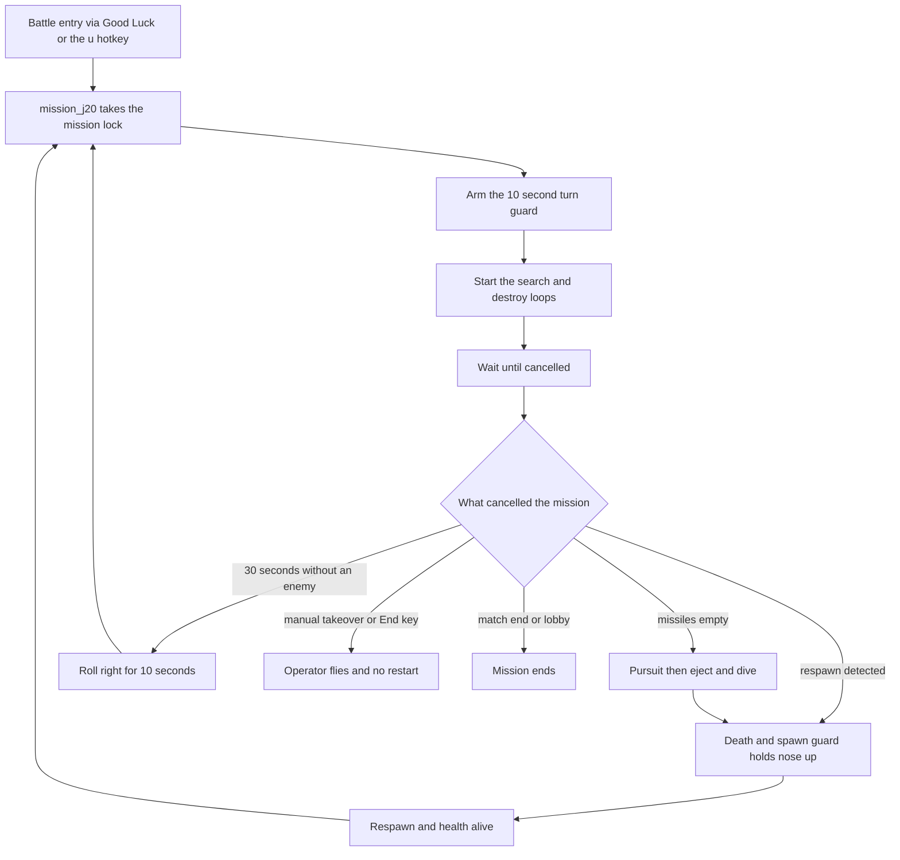

# Mission — J20 (mission_j20)

| Status | Date       | Wingman Version |
|--------|------------|-----------------|
| Draft  | 2026-09-24 | 1.8.11          |

This is `_template.md` filled in for `mission_j20`, followed by how J20 works
today. It is the worked example. To make a new mission, copy `_template.md`,
not this file. The contract is in `README.md`.

Implement per `docs/missions/README.md`.

## name

mission_j20

## sequence

* on battle start or respawn, fly the spawn heading for 10 seconds with no left or right turns
* engage with search_and_destroy
* run until cancelled

Everything else J20 does (climbing, engaging, evading, turning from the edge,
disengaging, the missiles-empty response, the respawn restart) is shared
behavior and comes from `README.md` section 3 unchanged. J20's hotkey is `u`
and, unlike the default in section 2.2, it skips instead of preempting when a
mission is already running.

---

# Appendix: how mission_j20 works today

Source: `Controller.mission_j20` in `wingman/controller.py`.

## A.1 Life cycle

Fallback if the diagram does not render: a life starts at battle entry or a
respawn restart, runs until something cancels it, and every cancel except
manual takeover, the End key and match end leads back to a fresh
`mission_j20`. The causes are in README section 3.4.

FSM states involved: `GAME_STARTING` then `GAME_BATTLE` (mission runs), then
`GAME_BATTLE_EJECT` for the missiles-empty response, `GAME_BATTLE_MANUAL` for a
takeover. The tree only decides inside `GAME_BATTLE`.

## A.2 What the mission thread does

In order, as coded:

1. `_mission_lock.acquire(blocking=False)`. If it is held, log "already in progress, skipping" and return. There is no preempt.
2. `arm_turn_guard()` (ADR 132). Battle entry and every respawn restart come through here, which is why the guard is armed at the mission and not at a respawn event.
3. `_mission_complete.clear()` and `_mission_cancel.clear()`.
4. Start a runner thread. It calls `start_search_and_destroy_loop()`, then loops on `_mission_cancel.wait(timeout=0.5)`, breaking if `_mission_exit_requested()`.
5. On exit, `stop_search_and_destroy_loop()`.
6. `finally`: set `_mission_complete`, release the lock only `if self._mission_lock.locked()`.
7. The calling thread polls `_mission_complete.wait(0.05)` (calling `cancel_mission()` on an exit request), joins the runner for 2 s, sleeps 0.2 s.

`start_search_and_destroy_loop()` starts two daemon threads that stop on their
own stop event or on `_mission_cancel`:

| Thread | Does | Cadence |
|--------|------|---------|
| padlock | `padlock_camera()`, a toggle, skipped while `_padlock_cooldown_until` is in the future | every 6 s |
| weapon | `fire_active_weapon()`; with `target_painting_mode` on, skipped when one missile is left | every `mission.weapon_loop_interval` (1.0 s) |

Start and stop are serialised by a lifecycle lock with a timeout (ADR 118).

## A.3 Configuration that shapes a J20 life

All in `wingman/config.yaml`. Shipped values as of 1.8.11; the file is
authoritative. Shared keys (tree, watchdogs, spawn guard, pursuit) are named in
README section 3.

| Key | Shipped | Meaning |
|-----|---------|---------|
| `mission.default_mission` | `su30` | mission that battle entry launches (`j20` selects this mission) |
| `mission.j20_turn_guard_s` | 10.0 | turn guard span, 0 disables |
| `mission.weapon_loop_interval` | 1.0 | fire cadence in seconds |
| `mission.good_luck_wait_s` | 13.0 | wait after "Good Luck" before launching |
| `j20_mission.target_painting_mode` | false | hold the last missile (ADR 027); read only by the search-and-destroy weapon loop |

**Naming trap.** The rest of the `j20_mission` block (`bearing_deadzone_deg`,
`coarse_kp`, `orbit_direction` and so on) is not J20's. `BehaviorTreeHandler`
passes it to `EngageNavigator`, so it tunes the shared Engage tactic and
changing it changes every mission.

## A.4 Related documents

* `docs/adr/075-afterburner-fuel-perception-and-fully-adaptive-j20-mission.md`: why J20 is adaptive
* `docs/adr/027-j20-target-painting-mode.md`: `target_painting_mode`
* `docs/adr/132-fly-the-spawn-heading-first.md`: the turn guard
* `docs/missions/README.md`: the contract, and the other related documents
