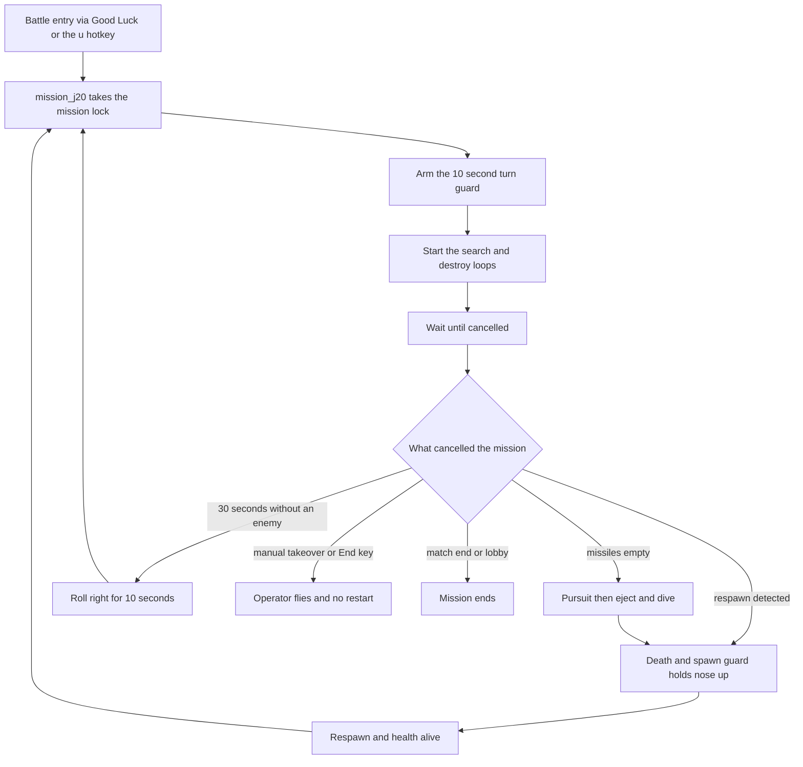

# Mission — J20 (mission_j20)

| Status | Date       | Wingman Version |
|--------|------------|-----------------|
| Draft  | 2026-09-24 | 1.8.11          |

This is `_template.md` filled in for `mission_j20`, followed by how J20 works
today. It is the worked example. To make a new mission, copy `_template.md`,
not this file. The contract is in `README.md`.

Implement per `docs/missions/README.md`.

## Parameters

| Parameter | Value | Unit | Config key |
|-----------|-------|------|------------|
| Turn guard span | 10 | s | `mission.j20_turn_guard_s` |
| Padlock press interval | 6 | s | hard-coded (`_padlock_loop`, 60 waits of 0.1 s) |
| Fire press interval | 1.0 | s | `mission.weapon_loop_interval` |
| Hold the last missile for painting | false | | `j20_mission.target_painting_mode` |

## Decisions

| Decision | Value |
|----------|-------|
| Jet | J20 (`jet_profile.active: j20`, `has_padlock: true`) |
| Hotkey | `u` |
| Doctrine | adaptive: the tree owns tactics; the thread holds the lock and the fire loops |
| Engagement mode | `search_and_destroy` |
| Loadout | primary rack; the secondary appears only in the inherited missiles-empty hand-off |
| Hotkey while a mission runs | skip: the new thread sees the lock and returns |
| Selectable as `default_mission` | yes, and it is the shipped default |
| Ends by | cancelled; J20 has no end condition of its own |

## Steps

Lock handling and the cancel and complete flags are contract boilerplate
(README section 5), not steps.

| # | Trigger | Action | Parameters | On timeout or failure | Log evidence |
|---|---------|--------|------------|-----------------------|--------------|
| 1 | mission start: battle entry, respawn restart or `u` | `arm_turn_guard()` | 10 s | a span of 0 disables it; nothing to fail | `TURN GUARD: left/right turns suppressed for 10s` |
| 2 | after step 1 | `start_search_and_destroy_loop()` | padlock every 6 s, fire every 1.0 s | if the lifecycle lock is busy it logs a warning and the mission holds without the loops | `search_and_destroy_loop started` |
| 3 | after step 2 | wait on `_mission_cancel` in 0.5 s ticks | none | an exception is logged as `mission_j20 failed`, the loops stop and the lock is released | `mission_j20 - adaptive mission running (S&D loops up, behavior tree owns tactics)` |
| 4 | cancel or exit request | `stop_search_and_destroy_loop()`, then release the lock | none | the lock is released in `finally` on every path | `mission_j20 - cancelled, stopping loops`, then `mission_j20 - lock released` |

## Inherited behavior

All shared behavior in `docs/missions/README.md` section 3 applies unchanged.
Everything J20 does beyond the four steps above (climbing, engaging, evading,
turning from the edge, disengaging, the missiles-empty response, the respawn
restart) comes from there.

## Shared changes

None.

## Acceptance

A J20 life, as it reads in `wingman.log`:

* `mission_j20 - starting mission sequence (lock acquired)`
* `TURN GUARD: left/right turns suppressed for 10s`
* `search_and_destroy_loop started`
* `mission_j20 - adaptive mission running (S&D loops up, behavior tree owns tactics)`
* on a respawn: `RESPAWN DETECTED`, then `HEALTH ALIVE — restarting mission immediately`, then the lines above again
* on a cancel: `mission_j20 - cancelled, stopping loops`, then `mission_j20 - lock released`

`tests/test_mission_cancel.py` and `tests/test_turn_guard.py` cover the lock,
cancel and guard behavior.

---

# Appendix: how mission_j20 works today

Source: `Controller.mission_j20` in `wingman/controller.py`.

## A.1 Life cycle

Fallback if the diagram does not render: a life starts at battle entry or a
respawn restart, runs until something cancels it, and every cancel except
manual takeover, the End key and match end leads back to a fresh
`mission_j20`. The causes are in README section 3.4.

FSM states involved: `GAME_STARTING` then `GAME_BATTLE` (mission runs), then
`GAME_BATTLE_EJECT` for the missiles-empty response, `GAME_BATTLE_MANUAL` for a
takeover. The tree only decides inside `GAME_BATTLE`.

## A.2 What the mission thread does

In order, as coded:

1. `_mission_lock.acquire(blocking=False)`. If it is held, log "already in progress, skipping" and return. There is no preempt.
2. `arm_turn_guard()` (ADR 132). Battle entry and every respawn restart come through here, which is why the guard is armed at the mission and not at a respawn event.
3. `_mission_complete.clear()` and `_mission_cancel.clear()`.
4. Start a runner thread. It calls `start_search_and_destroy_loop()`, then loops on `_mission_cancel.wait(timeout=0.5)`, breaking if `_mission_exit_requested()`.
5. On exit, `stop_search_and_destroy_loop()`.
6. `finally`: set `_mission_complete`, release the lock only `if self._mission_lock.locked()`.
7. The calling thread polls `_mission_complete.wait(0.05)` (calling `cancel_mission()` on an exit request), joins the runner for 2 s, sleeps 0.2 s.

`start_search_and_destroy_loop()` starts two daemon threads that stop on their
own stop event or on `_mission_cancel`:

| Thread | Does | Cadence |
|--------|------|---------|
| padlock | `padlock_camera()`, a toggle, skipped while `_padlock_cooldown_until` is in the future | every 6 s |
| weapon | `fire_active_weapon()`; with `target_painting_mode` on, skipped when one missile is left | every `mission.weapon_loop_interval` (1.0 s) |

Start and stop are serialised by a lifecycle lock with a timeout (ADR 118).

## A.3 Configuration that shapes a J20 life

All in `wingman/config.yaml`. Shipped values as of 1.8.11; the file is
authoritative. Shared keys (tree, watchdogs, spawn guard, pursuit) are named in
README section 3.

| Key | Shipped | Meaning |
|-----|---------|---------|
| `mission.default_mission` | `j20` | mission that battle entry launches |
| `mission.j20_turn_guard_s` | 10.0 | turn guard span, 0 disables |
| `mission.weapon_loop_interval` | 1.0 | fire cadence in seconds |
| `mission.good_luck_wait_s` | 13.0 | wait after "Good Luck" before launching |
| `j20_mission.target_painting_mode` | false | hold the last missile (ADR 027); read only by the search-and-destroy weapon loop |

**Naming trap.** The rest of the `j20_mission` block (`bearing_deadzone_deg`,
`coarse_kp`, `orbit_direction` and so on) is not J20's. `BehaviorTreeHandler`
passes it to `EngageNavigator`, so it tunes the shared Engage tactic and
changing it changes every mission.

## A.4 Related documents

* `docs/adr/075-afterburner-fuel-perception-and-fully-adaptive-j20-mission.md`: why J20 is adaptive
* `docs/adr/027-j20-target-painting-mode.md`: `target_painting_mode`
* `docs/adr/132-fly-the-spawn-heading-first.md`: the turn guard
* `docs/missions/README.md`: the contract, and the other related documents
