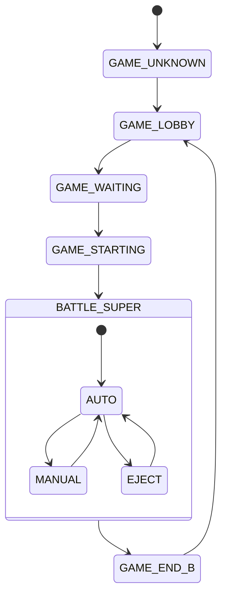

# Research 001 — HSM / QP-Style Architecture Applicability to Wingman

| Status   | Date       | Wingman Version |
|----------|------------|-----------------|
| Draft    | 2026-07-27 | 1.6.24          |

## Question

The picard firmware project (`c:/dev-tools/github/picard`) adopted the QP (Quantum
Platform) framework — hierarchical state machines (HSM) plus active objects — on top of
Zephyr (picard ADR 025, executed in picard ADR 032). Would a similar HSM architecture be
useful for wingman, which currently runs a flat FSM built on the Python `transitions`
library?

## Summary of Findings

**Partially.** The *hierarchical* part of QP's design maps directly onto a real and
growing problem in wingman's FSM. The *active-object runtime* — the part that actually
justifies adopting QP in picard — solves an embedded-concurrency problem wingman does not
have, and adopting it would be a high-risk migration for no functional gain. Wingman can
get the useful part (state nesting) incrementally via `transitions.extensions.HierarchicalMachine`
without changing frameworks. Recommendation: defer until Phase 3 / eject-dive work forces
battle sub-modes to become states.

## What Picard Actually Adopted

QP bundles two distinct ideas:

1. **Hierarchical state machines** — nested states with entry and exit actions, where
   substates inherit transitions from their superstate. A transition defined once on the
   superstate covers every child.
2. **Active-object runtime** — each subsystem is a `QActive` with its own thread and
   event queue; events are processed run-to-completion; state handlers never block; a
   framework tick drives time events. In picard, each active object maps to a Zephyr
   `k_thread` with a `k_msgq` (picard ADR 032 §3).

Picard's motivation is the second item: replacing ad-hoc threads-and-queues firmware
subsystems with deterministic run-to-completion event processing on an RTOS, as a
controlled comparison against its QP-free sibling (kobayashi_maru). The HSM part comes
along because QP state machines are hierarchical by construction.

## Wingman's Current FSM

Defined in `wingman/analyzer.py` (`_FSM_TRANSITIONS`, ~line 565): 9 states, ~22
transitions, dispatched via `_trigger()` from a single 1.5 s polling main loop. Sub-state
inside battle is handled two ways today:

- Promoted top-level states: `GAME_BATTLE_MANUAL`, `GAME_BATTLE_EJECT`
- Instance flags and windows: `_game_battle_alive`, health window, eject timers

### Flat-FSM symptom already present

The transition table repeats the same trigger across a family of states — the classic
state-explosion signature HSMs exist to remove:

| Trigger | Sources | Dest |
|---------|---------|------|
| `click_to_detected` | `GAME_BATTLE`, `GAME_BATTLE_MANUAL`, `GAME_BATTLE_EJECT` | `GAME_END_B` |
| `manual_takeover` | `GAME_BATTLE`, `GAME_BATTLE_EJECT` | `GAME_BATTLE_MANUAL` |
| `manual_force_battle` | `*` (wildcard) | `GAME_BATTLE` |
| `manual_reset` | `*` (wildcard) | `GAME_LOBBY` |

The three battle variants are semantically substates of one "in battle" superstate;
`click_to_detected` is a single superstate-level exit transition written three times.

### Pressure is growing

ADR 038 adds altitude/speed telemetry to serve Phase 3 behavior policies and a
closed-loop eject-and-dive sequence. The eject sequence has an internal progression
(nose-down verification, dive, impact wait) currently expressed as timers and flags.
These are sub-modes accumulating inside `GAME_BATTLE` without a structural home. ADR 038
explicitly scopes out FSM rework, so this pressure is deferred, not resolved.

## Why the Active-Object Runtime Does Not Fit

| QP/AO premise | Wingman reality |
|---------------|-----------------|
| Many concurrent subsystems needing deterministic event serialization | One authoritative FSM driven by a single polling loop that already serializes dispatch |
| State handlers must never block; work is event-driven | Dominant cost is OCR latency (hundreds of ms per `readtext`), inherently blocking, already isolated in a thread pool |
| Framework tick and time events replace ad-hoc timers | The 1.5 s capture tick is the natural clock; timeouts are checked per tick |
| Per-object threads and queues replace shared-state locking | Locks exist to protect OCR caches and health windows shared with worker threads — an AO layer would not remove them |

Additional migration risks specific to wingman:

- The ADR 044/045 replay and live-capture gates validate exact FSM transition behavior.
  Rewriting the FSM on a new eventing architecture puts the project's primary regression
  gates at risk.
- A Python AO framework (e.g. miros) or a hand-rolled equivalent adds a dependency and a
  concurrency model to a codebase whose threading rules (lock timeouts, stoppable
  daemons, finally-block guards) are already tuned and documented in CLAUDE.md.
- mss capture is thread-local; the main-loop-owns-capture constraint conflicts with
  distributing work across per-object threads.

## The Useful Subset: Hierarchy via the Existing Library

The `transitions` library already ships `HierarchicalMachine`
(`transitions.extensions`). Adopting it is an incremental refactor, not an architecture
swap: same trigger API, same `_trigger()` thread-safe dispatch, same entry-hook mechanism
already used at `analyzer.py:1033`, same replay-gate semantics.

Target shape:

- `BATTLE_SUPER` is the superstate; `AUTO`, `MANUAL`, `EJECT` are children (today's
  `GAME_BATTLE`, `GAME_BATTLE_MANUAL`, `GAME_BATTLE_EJECT`).
- `click_to_detected` to `GAME_END_B` is defined once on `BATTLE_SUPER` and covers all
  children.
- Future eject-dive stages (nose-down pending, diving, impact wait) become children of
  `EJECT` rather than new flags.
- Phase 3 behavior modes, if they become stateful, nest under `AUTO`.

Diagram note (compatibility fallback): the diagram shows the current lobby, waiting,
starting, battle, and end states with the three battle variants folded into one battle
superstate containing AUTO, MANUAL, and EJECT children. Stalled-matchmaking and
manual-reset wildcard paths are omitted for clarity; the wildcard resets become two
transitions defined at the top level.

## Recommendation

1. **Do not adopt** QP-style active objects or any AO framework for wingman.
2. **Do not refactor yet.** With three battle substates the flat table remains readable,
   and ADR 038 keeps FSM rework out of scope.
3. **Trigger condition for adopting `HierarchicalMachine`:** when eject-dive stages or
   Phase 3 policies need to become states — i.e. when the next feature would add a
   trigger with four or more source states, or a second layer of flag-based sub-modes
   inside battle. At that point, introduce a battle superstate as a contained refactor
   and re-validate through the ADR 044/045 gates.
4. When that refactor happens, record it as a new ADR referencing this research doc.

## References

- Picard ADR 025 — picard forks kobayashi_maru for QP (the adoption decision)
- Picard ADR 032 — QP/C-on-Zephyr integration architecture (how QP was executed)
- Wingman `wingman/analyzer.py` — `_FSM_TRANSITIONS` (~line 565), FSM entry hooks
  (~line 1033)
- Wingman ADR 038 — GAME_BATTLE altitude/speed signals for Phase 3 and eject-dive
- Wingman ADR 044 / ADR 045 — deterministic replay and live-screen runtime gates
- `transitions` library — `transitions.extensions.HierarchicalMachine`
