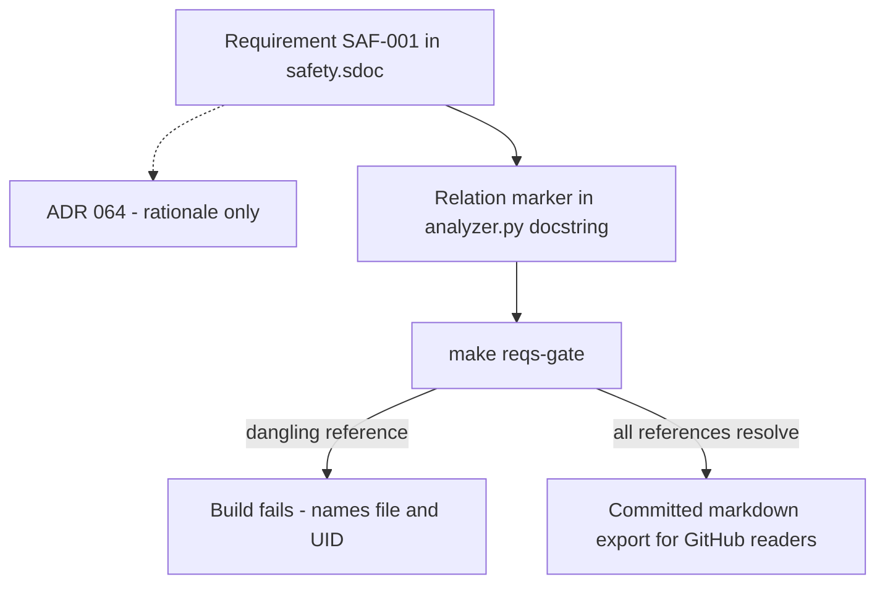

# Research 002 — StrictDoc Requirements Management: Verified Spike

| Status   | Date       | Wingman Version |
|----------|------------|-----------------|
| Draft    | 2026-08-06 | 1.7.1           |

## Question

The kobayashi_maru project evaluated moving its requirements from a hand-maintained
markdown traceability matrix to [StrictDoc](https://github.com/strictdoc-project/strictdoc)
(kobayashi_maru Research 003). That evaluation explicitly deferred the hands-on spike, so
every capability claim in it is unverified and its Phase 1 is blocked on ten open
questions.

Two questions for wingman:

1. Does the same move make sense here, given wingman has *no* requirements at all?
2. What do the ten open questions actually answer to, when the tool is run?

## Summary of Findings

**Adopt, now, at small scale.** The spike was run against StrictDoc 0.27.1 and answered
all ten open questions empirically. The two objections that would have blocked adoption —
that GitHub readers would be stranded without a markdown export, and that the install
would balloon the environment — are both **disproven by measurement**. The remaining real
risk is format churn in a tool that is still 0.x after roughly 100 releases, which is
mitigated by pinning and by a demonstrated three-format escape hatch.

The decisive capability for wingman is not the requirements document. It is that a
relation marker in a Python docstring binds a requirement to a specific function node, and
the build **fails with exit code 1** when that function or that requirement disappears.
That is drift detection a markdown table structurally cannot provide.

Adoption cost is at its global minimum: with zero existing requirements there is no
migration, only authoring.

## Wingman's Current State, Measured

Read from the repository on 2026-08-06:

| Fact | Value |
|------|-------|
| Requirements | **0** — no `REQ-` style identifiers anywhere in the repo |
| Traceability matrix | None |
| ADRs | 64, of which 61 cross-reference another ADR and 13 participate in supersede chains |
| HLDDs | 5, each with numbered Goals and Non-Goals |
| Executable acceptance criteria | Present — replay path YAML, ADR 044 and ADR 045 gates, performance thresholds |
| Automated doc validation | None |

Wingman is therefore *not* the same case as kobayashi_maru. It is missing the requirements
layer entirely, but it already has machine-checked acceptance criteria that kobayashi_maru
lacks — `tests/replay_paths/adr037_paths.yaml` encodes `expected_state`, `expected_trigger`
and `max_settle_time_s` per step, enforced by `make rr-path1-gate`.

### Measured drift

A link check and header parse across `docs/` found:

- **50 of 214 relative links are broken (23%).**
  - 47 are in `docs/code-review/` and use workspace-root-relative paths such as
    `](wingman/analyzer.py#L611)`. These resolve in the IDE but return 404 on GitHub. One
    systematic convention error, one systematic fix.
  - 3 are genuine rot: ADR 062 links `044-deterministic-runtime-replay-gate.md` when the
    real file is `044-runtime-screenshot-driven-automation-lane.md`, and ADR 009 links a
    `dual-region-ocr-architecture.md` that no longer exists.
- **17 of 64 ADRs have no parseable status header** (ADRs 001 through 015, 017, 018),
  despite CLAUDE.md mandating the format.
- **Status vocabulary is undeclared and inconsistent** — five values in use: `Accepted`
  (38), `Draft` (7), `Deferred`, `Rejected`, and `Implemented` (ADR 016 only, an undefined
  synonym for `Accepted`).

This is the concrete form of the problem kobayashi_maru Research 003 predicts. Wingman's
version has already happened and went unnoticed, because nothing in the repository fails
when a reference goes stale.

## Spike Results

Environment: StrictDoc 0.27.1, throwaway virtualenv, wingman's `uv.lock` untouched.

| # | Open question | Verified answer |
|---|---------------|-----------------|
| 1 | Real grammar and version | 0.27.1. `[DOCUMENT]` and `[REQUIREMENT]` nodes with `UID`, `TITLE`, `STATEMENT` delimited by `>>>` and `<<<`, and a `RELATIONS` block |
| 2 | Can a UID carry a dot, as in `REQ-001.1`? | **Yes.** `SAF-001.1` with a Parent relation to `SAF-001` parsed clean |
| 3 | Markdown or static export suitable for committing? | **Yes.** Eleven formats: html, html2pdf, markdown, rst, json, excel, reqif-sdoc, reqifz-sdoc, sdoc, doxygen, spdx. Markdown output is clean and readable |
| 4 | Source annotation syntax, and does it work in Python? | **Yes.** `@relation(UID, scope=function)` inside a docstring. A dedicated tree-sitter-python reader ships as a direct dependency. Scopes: `file`, `class`, `function`, `range_start` and `range_end` |
| 5 | Non-zero exit on broken links, without parsing stdout? | **Yes.** Exit code 1 with a clear stderr message, both for a dangling Parent relation and for a source marker naming a requirement that does not exist |
| 6 | Install footprint | 425 MB and 89 packages standalone, but roughly **90 MB marginal** for wingman — pandas, plotly and numpy are already present in the existing 7.4 GB virtualenv. About 1 percent |
| 7 | Is ReqIF real or nominal? | **Real.** `--formats=reqif-sdoc` produced `output.reqif`. SPDX, Doxygen, Excel and JSON also export |
| 8 | Release cadence and format stability | Roughly 100 releases, actively maintained — but **still 0.x, never reached 1.0**. This is the one substantive risk |
| 9 | Two-level decomposition, parent to child? | **Yes.** Parent relations, validated at build time |
| 10 | What does an `.sdoc` diff look like? | **Clean.** A one-line textual diff, more reviewable than a markdown table diff |

### Additional test: real wingman source

Beyond the ten questions, StrictDoc was pointed at the actual `wingman/` package
(11,085 lines of production Python) read-only:

- Parsed with **zero errors, exit code 0, in 2.4 seconds.**

That is fast enough to run as a `make` gate on every invocation.

### Correction recorded

An initial source-traceability test using `@sdoc[UID]` exited 0 on a deliberately dangling
reference, which appeared to be a silent-ignore gap. That syntax is not StrictDoc's; the
marker was skipped as an ordinary comment. With the correct `@relation(...)` marker the
same dangling reference **fails with exit 1** and names both the file and the missing UID.
The apparent gap does not exist.

## What StrictDoc Buys Wingman

### 1. A present-tense view over an append-only decision log

Sixty-four ADRs is archaeology. Answering "how does wingman detect respawn today" requires
reading ADR 062 (Rejected), ADR 064 (which supersedes it), ADR 061 (which it generalizes)
and ADR 063 (its foundation), and knowing which won. An ADR log is history. Requirements
are the flattened current-state layer over that history, citing the governing ADR as
rationale rather than restating it.

### 2. Function-level traceability that fails the build

kobayashi_maru Research 003 criticises its own matrix because twelve rows point at
`main.c` with no function granularity — "that identifies a file, not a requirement's
implementation." The `scope=function` marker binds to the real function node via
tree-sitter, and breaks loudly when the binding breaks.



### 3. Safety properties stop being re-derived per ADR

Uncommanded flight is the recurring hazard across ADRs 059, 061, 062 and 064, and the
v1.6.29 release commit. There is no single stated property that all four trace to; each
ADR restates the goal in its own words. That is exactly how a safety property silently
weakens over time.

### 4. HLDD goals stop being orphaned

`docs/hldd/005-target-tracking-hldd.md` declares five numbered goals; `tracking.enabled`
is `false` in config; the active branch is `target_tracking_improvements`. Nothing links
goal to test to status.

## Worked Example: ADR 065, a Three-Month Silent Failure

[ADR 065](../adr/065-starting-health-probe-reachability.md) is the strongest motivating
case in the repository, because it is a failure that requirements-with-verification would
have caught and that requirements-as-prose would not.

### What happened

[ADR 032](../adr/032-game-battle-alive-fallback-trigger.md) designed a battle-alive
fallback for `GAME_STARTING`: once health OCR reads a value the aircraft is demonstrably in
the world, so the mission can launch immediately rather than waiting out the post-banner
13 s settle. It shipped in v1.6.6. The code was present, the event was armed, the flag was
polled — and across roughly twenty logged production sessions it fired **twice**, both
times by accident via a state race.

The branch was unreachable. Two state gates sit in series and ADR 032 only knew about the
second, so the thread containing its new branch never started in that state. It went
unnoticed for three months because, in ADR 065's words, "a probe that never ran and a probe
that ran and saw nothing produced identical logs: silence."

### Why an ADR could not prevent this

**An ADR's acceptance criterion is checked once, at acceptance. A requirement is checked on
every build.** ADR 032 passed its acceptance in v1.6.6 and then silently stopped being
true. Nothing re-asked the question for three months.

The intent was never lost — it was written down, and code was written to match. What failed
was that the behaviour became **unfalsifiable**. This matters for scoping the tooling: a
requirement that merely restates ADR 032's intent in a second document would have stayed
green for the same three months.

### Why "as soon as possible" is the wrong requirement

The natural phrasing — *when transitioning to `GAME_STARTING`, the mission shall start as
soon as possible* — fails on three counts:

1. **It leaves the contested word undefined.** The dispute is over what "possible" means,
   and that is precisely ADR 065's still-open question: how early is `HEALTH` actually
   readable after "Good Luck"? Nobody has measured it. The phrasing restates the ambiguity
   instead of resolving it.
2. **It is unverifiable**, so no gate can be built against it.
3. **Read literally, it argues for a rejected decision.** ADR 065 Decision 2 rejected
   probing from `GAME_WAITING` on measurement — `GAME_STARTING` alone ran 87 seconds before
   "Good Luck" in the 06:02 session, so probing earlier would scan a crop for over two
   minutes while the aircraft provably does not exist. A standing "as soon as possible"
   requirement is a standing argument for that rejected option.

### The requirements that would have held

Two, not one — the property, and the observability that makes it falsifiable:

```
FR-012: Wingman shall enter the battle within 1.0 s of the first confirmed
         battle-alive indication during GAME_STARTING.

FR-012.1: The GAME_STARTING battle-alive probe shall log every attempt,
           including attempts that read no value, and shall report attempt
           count on disarm.
```

`FR-012.1` is the one that catches this in week one. (The UIDs here are
illustrative; Phase 1 shipped this pair contiguously as `FR-004` / `FR-004.1`.) It is also already implemented — it
is ADR 065 Decision 4, added only after the failure was found. A relation marker binding
`FR-012` to `_schedule_starting_health_probe` with `scope=function` additionally fails the
build if that function is deleted or renamed, which is the risk ADR 065 Decision 5 currently
guards against by hand and by convention.

Deliberately excluded from the requirement text: the constant `13`. ADR 065's open
measurement may change it. Tuning values belong in `mission.good_luck_wait_s`, not in a
requirement.

### What this example establishes

- The unit of value is the requirement **plus its gate**, never the requirement alone.
- Observability requirements are first-class. "The system shall log X" is testable and is
  frequently the requirement that makes every other requirement checkable.
- Requirements must state bounded, measurable properties. Unbounded phrasings such as "as
  soon as possible", "as fast as practical" or "immediately" are rejected at authoring
  time.

## Phase 1 Seed: The First Safety Requirement

Requested during review (2026-08-07): *when a flight-control key is pressed, exit
autopilot and enable manual control.* This is the "manual-takeover guarantees" entry
of the `SAF-` scope, and it makes a good first authoring exercise because the
user-stated form and the measured behaviour differ in exactly the way the FR-012
example warns about — the one-line phrasing is unconditional, while the shipped
handler (`_handle_maneuver_key_press`, controller.py) applies three deliberate
conditions that the requirement must state to be falsifiable:

```
SAF-001: When the operator physically presses a flight-control key
         (NOSE_UP i, NOSE_DOWN k, ROLL_LEFT j, ROLL_RIGHT l, or an arrow
         key) while wingman is commanding flight — a mission thread holds
         the mission lock, or an eject sequence is active — wingman shall
         cease all commanded flight input within 2.0 s and transition to
         GAME_BATTLE_MANUAL, and shall not re-command flight until health
         evidence indicates a death and respawn (ADR 059).

SAF-001.1: Wingman's own injected key presses, including X-server
           auto-repeat echoes delivered after release, shall never
           trigger the manual-takeover path.

SAF-001.2: Physical flight-control presses within the 2.0 s grace window
           after GAME_BATTLE or GAME_BATTLE_EJECT entry are ignored
           (stale-keystroke protection); this exception shall be logged
           when exercised.
```

The 2.0 s cessation bound is not invented — it is the bound the existing gate
`test_cancel_releases_lock_within_two_seconds` already enforces, so `SAF-001`
arrives with its gate pre-built, which is the unit-of-value rule above applied.
`SAF-001.1` is load-bearing on Linux: injected keys echo back through XRecord at
a measured ~25 Hz, and without echo discrimination every wingman eject correction
would trigger its own takeover.

One behavioural gap surfaced by drafting this, deferred to the implementer:
when **no** mission is running and no eject is active (e.g. the respawn-overlay
wait), a physical flight-control press is passed through to the game with no
state change — autopilot then restarts the mission when health returns,
potentially fighting the operator. The requirement above encodes the shipped
precondition; whether takeover should *also* latch from the idle-in-battle case
is an open decision for Phase 1, not something to settle silently in a
requirements file.

## What It Should Not Be Used For

Requirements must **not** restate ADRs. ADR 064's acceptance criterion — three clean dual
sessions, 54 real respawns, zero incorrect fires — is already better evidenced than a
requirement row would be. Duplicating it creates a second artifact to keep synchronised,
which is the precise failure this tooling exists to prevent. Requirements state the
property; the ADR is referenced for rationale.

Likewise, the replay YAML stays the source of truth for FSM acceptance criteria.
Requirements point at it; they do not re-encode it.

## Risks

| Risk | Severity | Mitigation |
|------|----------|------------|
| Format churn — tool is 0.x after ~100 releases | **Real** | Pin `strictdoc==0.27.1` exactly. Do not float a 0.x docs tool |
| `.sdoc` does not render on GitHub | Low | Commit the markdown export; verified clean output |
| Second doc convention to maintain | Low | Scope to one directory; ADRs, HLDDs and job aids are unaffected |
| Requirements drift into ADR duplication | Medium | Convention: property only, ADR referenced for rationale |
| Abandonment | Low | Escape hatch demonstrated — export to markdown, sdoc and reqif |

## Recommendation

Adopt at Phase 1 scale. Roughly 12 to 15 requirements, not 40.

### ID prefix convention — settled

Two category prefixes, set on the `PREFIX:` field of each `[DOCUMENT]` node:

| Prefix | Document | Scope |
|--------|----------|-------|
| `SAF-` | `safety.sdoc` | Safety properties. Uncommanded flight, respawn handling, manual-takeover guarantees |
| `FR-`  | `functional.sdoc` | Functional behaviour. FSM contract, mission lifecycle, timing bounds |

Category rather than level (StrictDoc's scaffold default is `HLR-`/`LLR-`), because the
safety set is the one that warrants the strictest gate and benefits from being visually
distinct in source markers. Decomposition depth is carried by dotted child UIDs — `SAF-001`
to `SAF-001.1` — which the spike verified works.

**This is deliberately settled before authoring.** The prefix is baked into every UID,
every source marker and every prose reference in ADRs; renaming it later is the exact cost
kobayashi_maru Research 003 question 2 warns about. An earlier draft of this document used
`FUN-`, rejected as unserious.

### Phase 1 items

1. `docs/requirements/` containing `safety.sdoc` (`SAF-*`, the uncommanded-flight
   properties from ADRs 059, 061, 063 and 064) and `functional.sdoc` (`FR-*`, the FSM
   contract already encoded in the replay YAML).
2. `strictdoc_config.py` at repo root with `include_source_paths` set to the `wingman`
   package.
3. `make reqs-gate` — three lines, folded into `make tp`. Exit 1 on any dangling relation.
4. `make reqs` — regenerates the committed markdown export.
5. Relation markers on the roughly ten functions implementing the safety properties.
6. Pin `strictdoc==0.27.1`.

Independently of StrictDoc, the 50 broken links and 17 missing ADR status headers should
be fixed and the status vocabulary declared in CLAUDE.md. That work is required under any
choice and is not blocked on this decision.

Deferred to a later phase: HLDD goal traceability, ReqIF interchange, and the web server
UI. None are needed to realise the Phase 1 value.

## Open Items

- ADR 066 should record the adoption decision once Phase 1 is implemented (065 is taken by
  the starting-probe reachability decision; verify the next free number at authoring time).
- ~~ADR 065's live-session measurement is a prerequisite for stating `FR-012`'s bound.~~
  **Resolved 2026-08-07:** three live sessions (54 armed windows, 33 bypasses, 40
  first-raw-read measurements) now exist. The bypass poll runs at 0.1 s once
  battle-alive is confirmed, so the 1.0 s bound in `FR-012` is comfortably
  satisfiable and can be stated as settled. The ~1.5 s confirmation latency
  measured in those sessions is upstream of "first *confirmed* indication" and
  does not count against the bound.
- **File-naming conflict to settle before creating `docs/requirements/`:** CLAUDE.md
  mandates zero-padded three-digit prefixes for every file in every `docs/`
  subdirectory, which `safety.sdoc` / `functional.sdoc` as named in Phase 1 item 1
  would violate. Either number them (`001-safety.sdoc`, `002-functional.sdoc`) or
  add an explicit CLAUDE.md exemption for `docs/requirements/`. Numbering them is
  the smaller change, but note the `PREFIX:` field, source markers, and the
  committed markdown export name are all downstream of this choice.
- kobayashi_maru Research 003 is currently blocked on the ten questions answered above;
  its status caveat can be replaced with this verified table.

## References

- kobayashi_maru Research 003 — the deferred evaluation this spike completes
- [ADR 065](../adr/065-starting-health-probe-reachability.md) — the worked example above
- [ADR 032](../adr/032-game-battle-alive-fallback-trigger.md) — the decision ADR 065 repairs
- [ADR 064](../adr/064-dual-sensor-respawn-detection.md) — respawn detection, current governing decision
- [ADR 044](../adr/044-runtime-screenshot-driven-automation-lane.md) — runtime replay lane
- [adr037_paths.yaml](../../tests/replay_paths/adr037_paths.yaml) — existing executable acceptance criteria
- [Research 001](001-hsm-qp-architecture-applicability.md) — prior cross-project applicability study
- StrictDoc project — https://github.com/strictdoc-project/strictdoc
