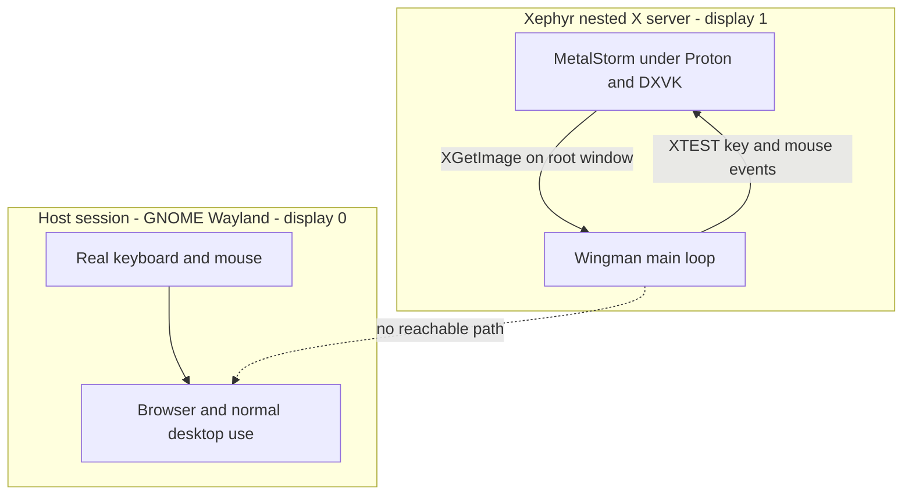
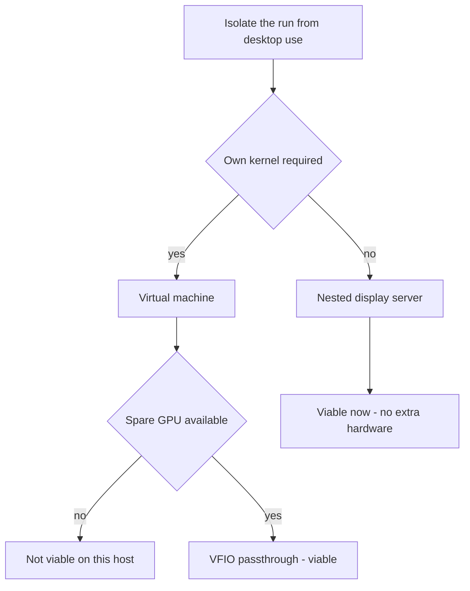

# Research 003 — Session Isolation for Unattended Runs

| Status   | Date       | Wingman Version |
|----------|------------|-----------------|
| Draft    | 2026-08-08 | 1.7.1           |

## Question

Wingman runs unattended mission loops that inject keys and mouse clicks continuously.
On the current single-desktop setup this makes the machine unusable for anything else:
the operator cannot browse, read, or type while a session runs.

Two questions:

1. Can Wingman and MetalStorm be run inside a **virtual machine** so the rest of the
   desktop is unaffected?
2. If not, what *does* provide that isolation?

## Summary of Findings

**A VM is the wrong axis, and is not viable on the current host regardless.**

The interference is a **display-server** problem, not a machine-boundary problem. Wingman
does not inject input at the kernel level — on Linux it uses XTEST against whatever X
server `$DISPLAY` names. Give it a *different X server* and it becomes structurally
incapable of typing into the desktop session. No VM, no container, no second machine.

**A nested X server (Xephyr) is the recommended approach.** Xephyr is already installed.
The isolation itself needs no code change — only environment variables — because the
capture layer already falls back to `mss` when the session is not Wayland. One small code
fix is required (`_ensure_xauthority()` is hardcoded to display `:0`), and one open
question remains (DXVK presentation performance through Xephyr), which needs a real test.

**The VM path fails on the GPU, not on Wingman.** MetalStorm renders through DXVK and
VKD3D and needs a real Vulkan driver in the guest. This host has a single integrated GPU,
so passthrough — the only VM GPU path that actually works — is unavailable.

---

## Measured Host Facts

Read from the machine on 2026-08-08:

| Fact | Value |
|------|-------|
| GPU | `00:02.0 Arrow Lake-U [Intel Graphics]` `[8086:7d67]` — **single integrated GPU, no discrete card** |
| CPU | Intel Core Ultra 7 265, 20 threads |
| RAM | 30 GB total, 24 GB available |
| Virtualization | `/dev/kvm` present, 19 IOMMU groups — KVM itself is available |
| Session type | `XDG_SESSION_TYPE=wayland` |
| `Xephyr` | Installed at `/usr/bin/Xephyr` |
| `gamescope` | **Not installed** |
| `Xvfb`, `weston`, `cage`, `xdotool`, `wmctrl` | Not installed |
| D3D12 path in use | `vkd3d-proton.cache` present in repo root, 133 KB, modified 2026-08-07 |

Host Vulkan capability was **not measured** (`vulkaninfo` is not installed), but the game
demonstrably runs today and the VKD3D shader cache confirms the D3D12-over-Vulkan path is
being exercised.

---

## Part 1 — The Three Interference Vectors

Isolation requires all three to be addressed. They are independent.

| Vector | Mechanism today | Consequence while browsing |
|--------|-----------------|----------------------------|
| **Key and mouse injection** | XTEST against `$DISPLAY` | Injected input lands in whichever window the desktop has focused — the browser |
| **Hotkey listening** | XRecord against `$DISPLAY` | The listener observes *every* keystroke on the display. Typing `i`, `j`, `k`, `l`, or `x` in another application can trip manual takeover |
| **Screen capture** | PipeWire portal, full-monitor | Any window covering the game corrupts the captured frame |

The second vector is easy to overlook and is arguably the more disruptive of the two input
problems: it means normal typing can drive the aircraft.

## Part 2 — Why Isolation Is Cheap Here

Wingman's Linux input layer is already display-scoped. Every injection site opens a fresh
X connection to `$DISPLAY` and sends XTEST events to it:

| Site | Function |
|------|----------|
| [controller.py:89](../../wingman/controller.py#L89) | `_linux_click` — mouse |
| [controller.py:143](../../wingman/controller.py#L143) | `_linux_key_event` — keyboard |
| [controller.py:267](../../wingman/controller.py#L267) | XRecord hotkey listener |
| [move_game_window.py:64](../../wingman/move_game_window.py#L64) | window placement |

XTEST events enter that X server's event queue. They do **not** pass through
`/dev/uinput` or the kernel input layer, so they cannot reach a different X server or the
host Wayland compositor. This is the property the whole approach rests on.

The capture layer cooperates too. [capture.py:548-551](../../wingman/capture.py#L548-L551)
selects the PipeWire backend only when `XDG_SESSION_TYPE` is `wayland`; otherwise it uses
`_MssBackend` and `XGetImage`. On a nested X server, `XGetImage` against the root window
returns the frame **even when that window is covered, unfocused, or on another
workspace** — because the nested server owns its own framebuffer.

### Target architecture



- The dotted edge is the point: XTEST cannot cross an X server boundary.
- The Xephyr window on the host is only a viewport. Covering it, moving it to another
  workspace, or unfocusing it does not affect capture or injection.

### Proposed invocation

```bash
Xephyr :1 -ac -screen 1920x1200 -glamor -resizeable &
DISPLAY=:1 flatpak run com.heroicgameslauncher.hgl &
DISPLAY=:1 XDG_SESSION_TYPE=x11 make rd
```

### What this changes

| Property | Today | Under a nested display |
|----------|-------|------------------------|
| Injected keys | Land wherever desktop focus is | Land in display `:1` only |
| Hotkey listener scope | Every keystroke on `:0` | Only keystrokes inside the nested display |
| Capture backend | PipeWire portal, share-screen dialog, restore token | `mss` and `XGetImage`, no dialog |
| Game window offset | Detected visually per ADR 050, or via `xwininfo` per ADR 053 | Root window is exactly 1920x1200 at origin — matches the configured `region` with no offset logic |
| Occlusion | Corrupts frames | Irrelevant |

The capture simplification is a genuine secondary benefit: the nested root window
coordinates match `config.yaml`'s `region` exactly, which removes the offset-detection
machinery from the live path.

### Known blocker — `_ensure_xauthority()` assumes display `:0`

[controller.py:30-76](../../wingman/controller.py#L30-L76) locates the mutter XWayland
auth cookie, writes an xauth database containing **only a `:0` entry**, and overrides
`XAUTHORITY` to point at it. Under `DISPLAY=:1`, python-xlib finds no matching entry and
connects with no authentication.

- Workaround: start Xephyr with `-ac` (access control disabled), as above.
- Proper fix: make the function display-aware, or skip it when `DISPLAY` is not `:0`.

This should be fixed regardless of which isolation approach is chosen.

### Open question — DXVK presentation through Xephyr

Device enumeration will succeed: DXVK opens `/dev/dri` directly and is unaffected by
which X server is in use. The uncertainty is **presentation**. Rendering into a Xephyr
window through `VK_KHR_xlib_surface` means a per-frame copy over the X protocol rather
than a direct scanout flip. This may be perfectly playable or it may be far too slow for a
flight combat game that Wingman must read on a 1.5 second tick.

**This is untested and is the single item that decides the approach.** It is a short
experiment — a working Xephyr session and a launch is enough to answer it.

### Fallback — gamescope

If Xephyr's present path is too slow, `gamescope` is the purpose-built alternative:

- Valve micro-compositor designed specifically for DXVK titles.
- Provides its own nested XWayland display, so the same `$DISPLAY` scoping argument holds
  unchanged.
- Heroic 2.22 exposes a per-game gamescope toggle, so it can be enabled without changing
  the launch tooling.
- Not currently installed on this host.

### Speculative upside — ADR 051 pitch control

ADR 051 traced the non-functional pitch axis to Wine's `GetAsyncKeyState` path reading a
stale or zeroed `XQueryKeymap` snapshot under XWayland, and worked around it by moving
pitch to the joystick binding.

XTEST key events update a real X server's **core keyboard state** directly, so
`XQueryKeymap` against Xephyr should reflect held keys correctly. It is plausible that the
keyboard pitch binding starts working again under a nested X server. This is **untested
speculation** and must not be relied on — the joystick binding stays as the supported
configuration until measured.

---

## Part 3 — Running in a Virtual Machine

### Why the game cannot run in a VM on this host

MetalStorm renders through DXVK and VKD3D (ADR 049, ADR 053; confirmed by the
`vkd3d-proton.cache` artifact). The guest therefore needs a real, modern Vulkan driver.

| Guest GPU path | Result |
|----------------|--------|
| VirtualBox or VMware SVGA 3D | OpenGL only. DXVK and VKD3D will not initialize |
| QEMU virtio-GPU with virgl | OpenGL only. Same failure |
| QEMU virtio-GPU with **Venus** Vulkan passthrough | Experimental. VKD3D-Proton routinely fails its feature checks. Not dependable for unattended runs |
| Software Vulkan, lavapipe | Initializes, then renders a 3D flight combat game at a few frames per second. Useless for a system that reads the screen to react |
| **VFIO full GPU passthrough** | Works properly — and requires a GPU that can be given away entirely |
| Intel SR-IOV or GVT | Not a production path for Arrow Lake on a consumer distribution as of mid-2026 |

This host has one GPU. Passing the integrated GPU to a guest takes the host display with
it, which defeats the entire purpose. **A VM is viable only on a machine with a discrete
GPU to dedicate.**

KVM and IOMMU are both available on this host, so the obstacle is specifically the GPU,
not virtualization support.

### Why a VM would not deliver the isolation goal anyway

There are two possible layouts, and both fail:

**Layout A — game and Wingman both inside the guest.** Capture and injection stay
coherent, and isolation genuinely holds. But the guest needs a working GPU, so this is
blocked by the table above.

**Layout B — game in the guest, Wingman on the host.** This is the intuitive split and it
does *not* work. Host XTEST injection goes to display `:0` and is delivered to the
**focused** window. The VM viewport must therefore hold focus for input to reach the
guest — meaning the operator still cannot browse. Layout B provides no isolation at all
while adding a machine boundary.

### Wingman-side breakage under a VM

Even with the GPU problem solved, three project-specific issues follow:

| Issue | Detail |
|-------|--------|
| Game window detection | ADR 053 finds the game by scanning `xwininfo -root -tree` for the `Metalstorm` window. From the host this returns the VM viewport instead, so the capture region must be pinned by hand |
| Pitch control | ADR 051's failure came from an input-indirection layer mangling async key state. A VM adds another such layer, so a repeat of that class of bug is likely |
| CPU contention | OCR is CPU-only by design (`use_gpu: false`, ADR 047). Guest game rendering and guest EasyOCR would compete for the same 20 threads |

### Anti-cheat and VM detection

Not assessed. No kernel anti-cheat is documented for MetalStorm anywhere in this
repository, and the title runs under Proton at all — which rules out the strictest
anti-cheat classes. Whether the Epic client or the game performs VM detection is
**unverified**, and would need checking before investing in a passthrough rig.

### Containers — a middle ground that solves the wrong half

A container (`distrobox`, `podman --device /dev/dri`) shares the host kernel and therefore
gets the **real GPU** — the DXVK problem disappears entirely. But a container shares the
host display socket by default, so it provides **no input isolation at all**.

This is the clearest statement of the finding: containers give GPU access without
isolation, VMs give isolation without GPU access, and a nested display server gives both
because it is operating on the correct axis.

### Choosing an approach



- "Own kernel required" is true only for driver-level or OS-level isolation. Wingman needs
  neither — it needs input and capture scoped away from the desktop session.
- "Spare GPU available" means a second GPU that the host can surrender completely.

### Full option comparison

| Approach | Input isolated | Capture survives occlusion | Real GPU | Extra hardware | Viable here |
|----------|----------------|----------------------------|----------|----------------|-------------|
| Current single-desktop setup | No | No | Yes | None | Works, but unusable alongside desktop use |
| **Xephyr nested X server** | **Yes** | **Yes** | **Yes** | **None** | **Recommended, pending the present-path test** |
| gamescope nested compositor | Yes | Yes | Yes | None | Fallback. Needs install |
| Container with `/dev/dri` | No | No | Yes | None | Solves nothing on its own |
| VM, guest software Vulkan | Yes | Yes | No | None | Unplayable frame rate |
| VM, virtio-GPU Venus | Yes | Yes | Partial | None | Experimental, undependable |
| VM, VFIO passthrough | Yes | Yes | Yes | Discrete GPU | Not on this host |
| Second physical machine | Yes | Yes | Yes | Whole machine | Works. See ADR 018 for the split-host precedent |

---

## Recommendation

1. Fix `_ensure_xauthority()` so it does not assume display `:0`. Required for any nested
   display, and correct independently of this work.
2. Test DXVK presentation through Xephyr. This is the decision point and it is a short
   experiment.
3. If frame rate holds, add a `scripts/run-isolated.sh` and a `make` target that starts
   Xephyr, launches Heroic into it, and runs Wingman against the nested display.
4. If frame rate does not hold, install gamescope and repeat the test against its nested
   XWayland display. The `$DISPLAY` scoping argument is unchanged, so only the launcher
   differs.
5. Do not pursue a VM on this host. Revisit only if a machine with a discrete GPU becomes
   the target, and check VM detection first.

## Open Items

| Item | Status |
|------|--------|
| DXVK and VKD3D frame rate through Xephyr | **Untested — decides the approach** |
| Whether `XGetImage` on the Xephyr root returns frames while the viewport is minimized | Untested. Expected to work; the nested server owns its framebuffer |
| Whether the ADR 051 pitch issue resolves under a nested X server | Untested speculation |
| MetalStorm or Epic client VM detection | Unverified. Only matters if a passthrough rig is ever built |
| Host Vulkan API level | Not measured — `vulkaninfo` not installed |
| Behaviour of the PipeWire path if `XDG_SESSION_TYPE` is overridden rather than genuinely X11 | Untested. The override is what forces `_MssBackend` selection |

## References

- [ADR 047](../adr/047-host-environment-preflight-check.md) — host environment pre-flight check; records the CPU-only OCR decision
- [ADR 049](../adr/049-linux-migration-game-and-automation-layer.md) — Linux migration: game launcher and automation layer
- [ADR 050](../adr/050-wayland-screen-capture.md) — Wayland screen capture and windowed game configuration
- [ADR 051](../adr/051-linux-pitch-control-joystick-binding.md) — Linux pitch control: joystick binding required
- [ADR 053](../adr/053-linux-one-command-launch.md) — Linux one-command launch; X11 game window detection
- [ADR 018](../adr/018-adb-input-injection-and-remote-control-architecture.md) — split-host precedent for running automation and game on separate machines
- [Job Aid 010](../job-aids/010-run-metalstorm-on-linux.md) — run MetalStorm on Linux via Heroic and Proton-GE
- [controller.py:30-76](../../wingman/controller.py#L30-L76) — `_ensure_xauthority`, the display `:0` assumption
- [capture.py:548-551](../../wingman/capture.py#L548-L551) — capture backend selection
