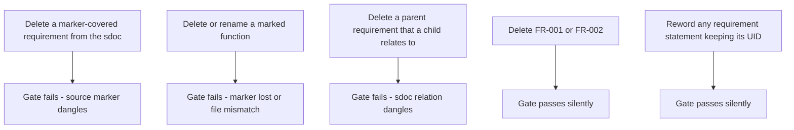

# Research 004 — Requirements Gate Deletion-Protection Coverage

| Status   | Date       | Wingman Version |
|----------|------------|-----------------|
| Draft    | 2026-08-08 | 1.7.1           |

## Question

ADR 066 adopted StrictDoc with a bidirectional traceability gate (`make reqs-gate`,
run inside `make tp`). A natural reading of that gate is "a requirement cannot be
accidentally deleted — the build would fail." Is that actually true for all twelve
Phase 1 requirements, and precisely which accidental edits does the gate catch versus
let through?

## Summary of Findings

**Ten of the twelve requirements are deletion-protected by the gate; FR-001 and
FR-002 are not.** The gate validates linkage, not content: any edit that leaves a
`relation(UID, scope=function)` marker or an sdoc Parent relation dangling fails the
build with exit 1, but a requirement nothing points at can be deleted silently, and
any requirement's statement text can be reworded without failure. The two unprotected
requirements rely on git review alone.

## Evidence — marker coverage map

Verified against the working tree on 2026-08-08 by grepping `wingman/*.py` for
`relation(` markers and `docs/requirements/*.sdoc` for `UID:` fields. Eleven markers
cover ten distinct UIDs across nine functions:

| UID       | Marker location | Enclosing function |
|-----------|-----------------|--------------------|
| SAF-001   | `wingman/controller.py:851` | `_handle_maneuver_key_press` |
| SAF-001.1 | `wingman/controller.py:852` | `_handle_maneuver_key_press` |
| SAF-001.2 | `wingman/controller.py:853` | `_handle_maneuver_key_press` |
| SAF-002   | `wingman/main.py:99` and `wingman/tick_handlers.py:223` | `_alive_transition_disposition`, `handle_alive_transition` |
| SAF-003   | `wingman/analyzer.py:1798` | `_shadow_maybe_fire` |
| SAF-004   | `wingman/analyzer.py:1609` | `_confirm_health_value` |
| SAF-005   | `wingman/controller.py:1212` | `_account_nose_hold` |
| FR-003    | `wingman/controller.py:2430` | `_start_game_starting_loop` |
| FR-004    | `wingman/analyzer.py:1482` | `_schedule_starting_health_probe` |
| FR-004.1  | `wingman/analyzer.py:1562` | `disarm_starting_health_scan` |
| **FR-001** | **none** | — |
| **FR-002** | **none** | — |

The gap is not an oversight so much as a consequence of ADR 066's own conventions:
FR-001 (FSM contract) deliberately points at the replay YAML as its source of truth
rather than at code, and FR-002 (tick cadence) describes loop timing that no single
function owns cleanly. Neither convention required a source marker, so neither
requirement acquired the deletion protection that markers provide as a side effect.

## What the gate catches versus lets through

- Scenarios one through three were negative-tested during Phase 1 (ADR 066, "Gate
  verification") — both dangling directions exit 1 naming the file and UID.
- Scenario four follows from the coverage map above: no marker or relation
  references FR-001 or FR-002, so nothing dangles when they are removed.
- Scenario five is inherent to the tool: StrictDoc traces identity through UIDs,
  not statement content. Semantic drift in a requirement statement is invisible to
  the gate in every case.

## Options for closing the FR-001 and FR-002 gap

1. **Add markers to plausible owning functions.** FR-002 has a natural home — the
   main tick loop in `wingman/main.py`. FR-001 could mark the FSM transition-table
   owner in `wingman/analyzer.py`. This is a two-line change but slightly bends the
   ADR 066 convention for FR-001, whose acceptance criteria intentionally live in
   the replay YAML: the marker would exist for deletion protection, not genuine
   traceability.
2. **Accept the gap and rely on git review.** Deleting a requirement means editing
   a `.sdoc` file, which the git rule in CLAUDE.md already forces through manual
   review. The residual risk is a deletion buried in a large diff.
3. **Extend the gate.** A count or UID-set assertion (for example, a checked-in
   list of expected UIDs) would catch any deletion regardless of marker coverage.
   More machinery than Phase 1 scale warrants; noted for completeness.

Recommendation: option 1 for FR-002 (the tick loop is a genuine implementing site,
so the marker is honest traceability, not just protection); option 2 for FR-001
unless the replay-YAML convention is revisited. No urgency — both requirements are
functional, not safety, tier.

## Relationship to existing documents

- [ADR 066](../adr/066-strictdoc-requirements-adoption.md) — records the adoption
  and the negative tests this research re-examines. Its consequence "renaming or
  deleting any of the nine marked functions fails the build" is confirmed accurate;
  this research adds the inverse-direction coverage map it did not enumerate.
- [Research 002](002-strictdoc-requirements-management-spike.md) — the adoption
  spike; the marker conventions analyzed here originate there.
