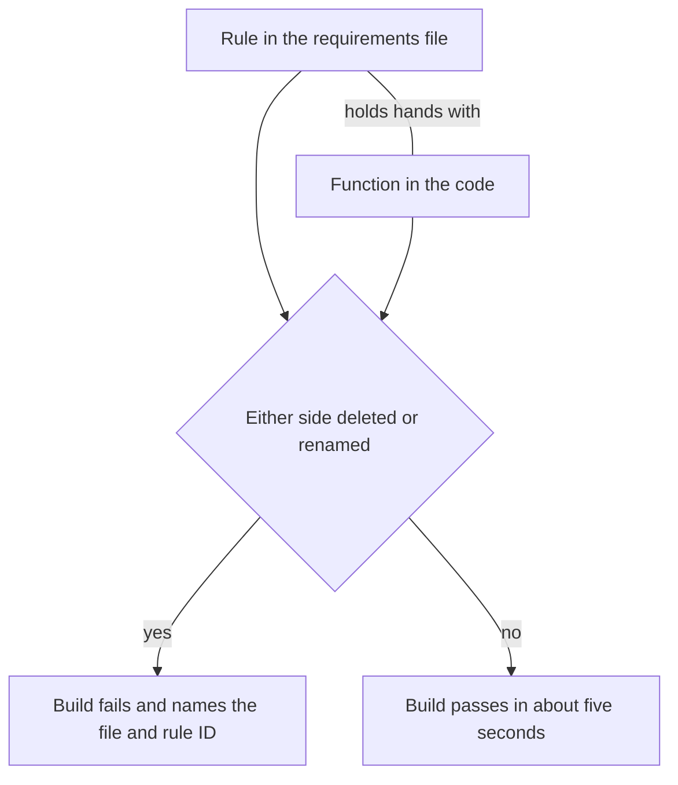

# Research 004 — Why StrictDoc: The Case for Managed Requirements, in Plain Language

| Status   | Date       | Wingman Version |
|----------|------------|-----------------|
| Draft    | 2026-08-08 | 1.7.1           |

## Question

ADR 066 adopted StrictDoc, but its argument is written for someone who already lives
in the codebase. What problem does StrictDoc actually solve for Wingman, said simply?
And how well does the protection it promises actually hold up when we check it?

## Summary of Findings

**Before StrictDoc, Wingman's most important safety rules were written down once and
never checked again. Now the build re-checks them every time, and breaking the link
between a rule and its code fails the build by name.** Four distinct benefits follow,
explained below. One honest caveat: two of the twelve rules (FR-001 and FR-002) sit
outside the automatic protection and still rely on human review.

## The problem, simply

Wingman flies a plane in a game with nobody watching. Some rules are about safety —
things like "if the pilot is dead, stop pressing the flight keys" and "when the plane
respawns, handle it exactly once, not twice."

Those rules used to live inside decision documents (ADRs). An ADR is like a diary
entry: it explains what we decided and why, and it gets checked once — on the day we
write it. Afterward, nobody and nothing re-reads it. If later code changes quietly
broke one of those rules, no alarm would go off. ADR 065 documented exactly this
failure mode happening to us.

StrictDoc changes the arrangement: the rules move out of the diary and onto a
checklist that the build re-reads on every run.

## Benefit 1 — The rules get checked every build, not once

Think of a smoke detector. Writing a rule inside an ADR is like testing the battery
only on the day you install the detector, then never again. Moving the rule into a
requirement with a gate is like a detector that tests its own battery every night and
beeps loudly the moment something is wrong.

Concretely: rules like "no commanded flight while dead" used to be re-stated
separately across ADRs 058, 059, 061, 063, and 064, each copy checked once at
acceptance. Now each rule has exactly one home — `SAF-001` through `SAF-005` for
safety, `FR-001` through `FR-004` for behavior — and `make reqs-gate` re-verifies the
rule-to-code wiring on every `make tp`. It costs about five seconds.

## Benefit 2 — The rules and the code hold hands, and letting go sets off an alarm

Every safety rule is tied to the function that implements it, using a small marker in
the code (`relation(UID, scope=function)` in the docstring). The rule points at the
code, and the code points back at the rule — like a parent and child holding hands in
a crowd.

If either hand lets go, the build fails immediately and says exactly whose hand
slipped:

- Someone deletes the **rule** but the code still references it → build fails,
  naming the file and the rule ID.
- Someone deletes or renames the **function** but the rule still expects it → build
  fails the same way.

This was not assumed to work — both failure directions were deliberately broken
during Phase 1 to confirm the alarm actually fires (ADR 066, "Gate verification").
The payoff: a refactor can no longer silently orphan a safety rule.

## Benefit 3 — Each fact is written down exactly once

When the same rule is written in three places, the three copies drift apart — someone
updates one and forgets the others, and soon nobody knows which copy is true.

StrictDoc's convention here is: every kind of fact has exactly one home, and
everything else points to it instead of copying it.

| Kind of fact | Its one home |
|--------------|--------------|
| The rule itself (what must be true) | The requirement in `docs/requirements/` |
| Why we chose the rule | The referenced ADR |
| Tuning numbers (thresholds, timings) | `wingman/config.yaml` |
| What the FSM must do, step by step | The replay YAML (`FR-001` points at it) |

No copies means nothing to drift.

## Benefit 4 — Future rules are forced to be testable

Two writing rules now bind every future requirement:

1. **Measurable statements only.** "The battle must start within 90 seconds" is
   checkable. "The battle should start as soon as possible" is not — nobody can ever
   say it failed. Vague rules are banned.
2. **No duplicating ADRs.** The requirement states *what*; the ADR it references
   explains *why*. This keeps benefit 3 true forever, not just today.

## The honest caveat — two rules are not auto-protected

Checked against the working tree on 2026-08-08: eleven markers in the code cover ten
of the twelve rules. Two have no marker pointing at them:

- **FR-001** (the FSM contract) — its detailed pass/fail criteria deliberately live
  in the replay YAML, not in code, so no function carries its marker.
- **FR-002** (tick cadence) — the timing belongs to the whole main loop rather than
  one clean function, so none was marked.

Deleting either of these from the `.sdoc` file would **not** fail the build. Their
only protection is that every change goes through human git review. Also worth
knowing: the gate checks *wiring*, not *wording* — rewording any rule while keeping
its ID passes silently, for all twelve.

Suggested disposition (no urgency — both are functional-tier, not safety-tier):

1. **FR-002**: add a marker to the main tick loop in `wingman/main.py`. The loop
   genuinely implements the rule, so the marker is honest traceability.
2. **FR-001**: accept the gap. Its truth intentionally lives in the replay YAML; a
   code marker would exist only for protection, not real traceability.

## Coverage evidence

The marker-to-function map behind the claims above, verified by grepping
`wingman/*.py` and `docs/requirements/*.sdoc`:

| Rule | Marker location | Function |
|------|-----------------|----------|
| SAF-001, SAF-001.1, SAF-001.2 | `wingman/controller.py:851-853` | `_handle_maneuver_key_press` |
| SAF-002 | `wingman/main.py:99`, `wingman/tick_handlers.py:223` | `_alive_transition_disposition`, `handle_alive_transition` |
| SAF-003 | `wingman/analyzer.py:1798` | `_shadow_maybe_fire` |
| SAF-004 | `wingman/analyzer.py:1609` | `_confirm_health_value` |
| SAF-005 | `wingman/controller.py:1212` | `_account_nose_hold` |
| FR-003 | `wingman/controller.py:2430` | `_start_game_starting_loop` |
| FR-004 | `wingman/analyzer.py:1482` | `_schedule_starting_health_probe` |
| FR-004.1 | `wingman/analyzer.py:1562` | `disarm_starting_health_scan` |
| FR-001, FR-002 | none | — |

## Relationship to existing documents

- [ADR 066](../adr/066-strictdoc-requirements-adoption.md) — the adoption decision
  and the negative tests referenced in benefit 2.
- [Research 002](002-strictdoc-requirements-management-spike.md) — the verified
  spike that recommended adoption; the conventions explained here originate there.
