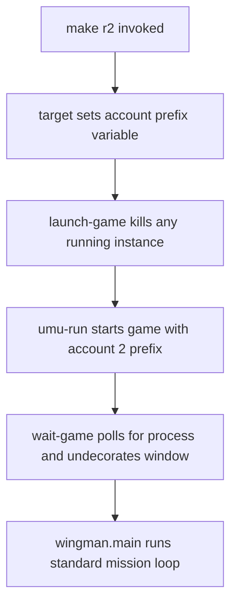

# Research 005 — Multi-Account Run Targets (make r1 / r2)

| Status | Date       | Wingman Version |
|--------|------------|-----------------|
| Active | 2026-08-21 | 1.8.5           |

## Question

Can Wingman support `make r1`, `make r2`, … where each target runs the standard
mission loop logged into a different MetalStorm account, on Linux via
Proton (umu-run, Heroic-installed game)?

## Verification 2026-08-21 — the Makefile claims hold, and the session is prefix-resident

Everything checkable without launching the game was checked.

**Makefile parameterisation — confirmed.** `WINE_PREFIX ?=` and `GAME_EXE ?=`
are real `?=` variables (Makefile:303-304), `WINEPREFIX` is passed through to
`umu-run`, and `launch-game` does `pkill -f Metalstorm.exe` with a 5s settle
before launching, so account switching gets teardown for free as claimed.
`make -n r1` resolves `WINEPREFIX` to the acct1 prefix, confirming
target-specific variables propagate to prerequisites.

**Open Question 1 — strong evidence, one residual risk.** The prefix registry
holds `[Software\\Starform\\Metalstorm]` with 72 Unity PlayerPrefs keys,
including:

```
client-settings--default_auth_token_...
client-settings--default_selectedAccountId_...
client-settings--default_generatedDeviceIdentifier_...
client-settings--default_find-accounts-for-did_...
```

plus per-account chat history, and `AppData/LocalLow/Starform/Metalstorm` — all
inside the prefix. The install directory holds only binaries and Unity data.
**The session is prefix-resident**, so one prefix per account with a single
shared `GAME_EXE` is the right scheme and the "separate install per account"
fallback is almost certainly unnecessary.

The residual risk is `generatedDeviceIdentifier` and `find-accounts-for-did`:
the backend does device-identity work, and a **copied prefix carries a
duplicate device id**. Whether it tolerates two accounts on one device id is
untested, and it is the one failure that could make this inadvisable rather
than merely unbuilt. That is why Q1 is still listed as blocking below.

## Summary of Findings (initial assessment, partly verified — see above)

Sequential per-account operation (one account at a time) looks feasible with a
small Makefile change. Simultaneous multi-instance operation is out of scope —
the input and capture architecture cannot support it (see Constraints).

### Why sequential targets should work

- The launch path is already parameterized in the Makefile: `WINE_PREFIX` and
  `GAME_EXE` are `?=` variables consumed by `launch-game`.
- MetalStorm's login session is expected to persist inside the Wine prefix
  (`drive_c/users/<user>/AppData`), not the game install directory. If that
  holds, one shared `Metalstorm.exe` plus one prefix per account gives one
  independent logged-in session per prefix.
- GNU make target-specific variables propagate to prerequisites, so per-account
  targets reduce to:

  ```make
  r1: WINE_PREFIX := $(HOME)/Games/Heroic/Prefixes/Metalstorm-acct1
  r1: r

  r2: WINE_PREFIX := $(HOME)/Games/Heroic/Prefixes/Metalstorm-acct2
  r2: r
  ```

- `launch-game` already kills any running `Metalstorm.exe` before launching, so
  account switching (`make r2` after `make r1`) gets teardown for free.
- Window management (`wait-game`, `undecorate-game-window`), capture region,
  and crop calibration are unchanged because only one instance exists at a
  time, in the same window position.

### Proposed launch and switch flow



## Constraints — why simultaneous instances are excluded

- `wingman/controller.py` injects input via XTest, which is global to the X
  display and targets whatever window has focus. Two instances would fight
  over the keyboard.
- The hotkey listener (XRecord) is display-global.
- Capture is a single configured monitor region (`config.yaml` `region:` and
  `monitor:`).
- `launch-game` enforces a single game process by design.

Window-targeted input, per-instance capture, or nested display servers would
be a separate project, not an extension of this one.

## Open Questions / Verification Plan

1. ~~**Prefix-portability of login (blocking).**~~ **RESOLVED 2026-08-21 —
   the scheme works, via the third outcome neither branch predicted.**

   Observed: the copied prefix came up **logged out**. Logging in there
   persisted across a relaunch (`make g1` twice).

   Neither predicted branch was right. The session did not travel with the
   copy, but it is not in the install directory either — it is written to the
   prefix on login. So `cp -a` carries the expensive part (Proton first-run
   setup) and none of the identity, which is the ideal split:

   - One prefix per account, one shared `GAME_EXE`. Confirmed.
   - **No risk of two targets sharing one session** — an outcome the "copy
     carries the login" branch would have had to guard against.
   - **The device id is NOT duplicated.** Direct comparison of the two
     prefixes on 2026-08-21 shows `generatedDeviceIdentifier` differs between
     them — Proton's prefix update regenerates it. The concern that motivated
     this question does not exist, and Q4's risk surface is smaller than
     assumed: the accounts are not sharing a device identity.
2. ~~**First-run bootstrap per account.**~~ **RESOLVED 2026-08-21** by the same
   test: `cp -a` an existing prefix (skipping Proton first-run entirely),
   `make gN`, log in, quit. Verified to persist. Documented in the Makefile.
3. ~~**Per-account Wingman state.**~~ **RESOLVED 2026-08-21 — and it was not
   optional.** Wingman runs a live performance-regression gate comparing the
   current session against a release baseline. Accounts at different
   progression fly different jets with different missiles, so an untagged mix
   corrupts that baseline silently and irreversibly. Implemented: the
   `WINGMAN_ACCOUNT` env var (set by `r1`/`r2`) is sanitised by
   `performance.account_tag()`, appended to `run_id`, and recorded as an
   `account` field in the JSON. MissionStatsTracker inherits it via
   `finalize(run_id=tracker.run_id)`.

   **Still open:** the regression comparison does not yet *filter* by account —
   the data is now attributable, not automatically segregated. A mixed baseline
   remains possible until that filtering is added.
4. **Anti-cheat / ToS check.** Confirm running alternate accounts through the
   same automation does not trip any single-account or device-binding
   assumptions in the game's backend.

## Implementation status 2026-08-21

A copied prefix is **not** immediately equivalent to the original. Two follow-up
steps are needed, both now automated:

- Proton's prefix update strips `Software\\Wine\\Explorer`, so the copy
  launches true-fullscreen and breaks the capture geometry —
  `ensure-virtual-desktop` runs as a dependency of every per-account target.
- Settings and keybindings do not come across usefully (the copy predates them
  or wineboot resets them) — `make sync-settings-1` copies them without identity
  (ADR 052).

| Item | Status |
|------|--------|
| `r1`/`r2` + `g1`/`g2` targets, target-specific `WINE_PREFIX` | **Done** — `make -n` verified for all four; plain `r`/`rd` unaffected |
| Bootstrap documented in Makefile comments | **Done** — four-step per-account flow, with the duplicate-device-id caveat stated inline |
| Account tag through PerformanceTracker / MissionStatsTracker | **Done** — `WINGMAN_ACCOUNT`, 5 tests including path-separator escape and length bounds |
| Virtual desktop restored on copied prefixes | **Done** — `scripts/ensure-virtual-desktop.py`, dependency of `g1`/`g2`/`r1`/`r2` |
| Settings + keybindings shared without identity | **Done** — `scripts/sync-metalstorm-settings.py`, `make sync-settings-1` (ADR 052 Q3) |
| Regression gate *filters* by account | Not done — see Q3 |
| Q1 prefix-copy login test | **Not done — still blocking** |

The targets were written before Q1 was answered on purpose: `g1` is the harness
for running the test. Adding them changes nothing until invoked.

## Reference — cloning an account prefix, keybindings included

**Tested working 2026-08-21** (2h 19m, 23 missions, 100% click-to; see Live
validation below). This is the full procedure and the reasoning behind each
step, so it can be repeated for acct3+ or on a rebuilt machine.

### The four commands

```bash
# 1. Clone the prefix — carries Proton first-run setup, NOT the login
cp -a ~/Games/Heroic/Prefixes/Metalstorm \
      ~/Games/Heroic/Prefixes/Metalstorm-acct1

# 2. Restore the virtual desktop (automatic: a dependency of g1/r1)
make ensure-virtual-desktop WINE_PREFIX=~/Games/Heroic/Prefixes/Metalstorm-acct1

# 3. Launch, log in as the new account, quit cleanly
make g1

# 4. Copy settings + keybindings across, WITHOUT identity
make sync-settings-1 DRY=--dry-run    # inspect first
make sync-settings-1
```

Then `make r1`. Step 4 must come after step 3: the target prefix needs its own
`[Software\\Starform\\Metalstorm]` key to exist before settings can be merged
into it, and that key is created at first login.

### Why step 2 exists

Proton runs a prefix update (wineboot) on first launch of a copied prefix. It
resets **Wine-owned** registry keys while leaving application keys intact, so
the copy loses `Software\\Wine\\Explorer` and launches true-fullscreen.

That is not cosmetic. The capture region, `game_window_offset`, and every
calibrated crop assume the windowed geometry, and `undecorate-game-window` has
no window to act on. A session in fullscreen produces garbage OCR and
misleading per-account performance data.

`scripts/ensure-virtual-desktop.py` restores two keys, idempotently:

```
[Software\\Wine\\Explorer]           "Desktop"="Default"
[Software\\Wine\\Explorer\\Desktops]  "Default"="1920x1200"
```

### Why step 4 cannot be a plain copy

MetalStorm stores everything in one Unity PlayerPrefs key,
`[Software\\Starform\\Metalstorm]` in the prefix's `user.reg` — 72 values that
mix two unrelated concerns:

| | Count | Examples |
|---|---|---|
| **Settings** (share these) | 38 | `inputBindingOverrides1/2`, `inputBindingOverrideIndex`, `inputSystem-v2`, `hasSelectedControlScheme`, `Screenmanager *`, HUD colours, volumes |
| **Identity** (never share) | 34 | `auth_token`, `selectedAccountId`, `generatedDeviceIdentifier`, 13x `chat-text:*`, session ids, `savedClientErrorReportAddress` |

Copying the key wholesale overwrites the target's login with the source's,
silently merging two accounts into one.

**Filtering by name prefix is not sufficient.** `client-settings--default_*` is
a *mixed* family: `audioVolume-v2`, `fullScreenMode` and `selectedRegion` sit
directly beside `auth_token` and `selectedAccountId`. It needs a per-key
allowlist.

`scripts/sync-metalstorm-settings.py` works from an **allowlist, not a
denylist**, so an identity key added by a future game version is excluded by
default rather than leaked by default. It also asserts on identity markers as a
second check, and excludes one key that matches an allowed prefix:
`air-combat-settings--default_clear-creds`, a "clear credentials on next start"
flag that can log the target account out.

### Implementation gotchas worth keeping

These cost time to discover and are easy to get wrong on a reimplementation.

1. **`user.reg` values are multi-line.** Forms are `dword:`, `hex:` and
   `hex(4):`, and long values continue across lines with a trailing backslash
   and leading whitespace. The `inputBindingOverrides1` keybinding blob is
   hundreds of lines. A line-oriented parser that ignores continuations will
   silently truncate the bindings.

2. **Never edit a prefix that is in use.** wineserver rewrites `user.reg` on
   shutdown from its in-memory copy, discarding anything written underneath it.
   Both scripts refuse to write when `wineserver` or `Metalstorm.exe` is live,
   and back up before writing.

3. **Verify with full-value comparison, not `grep -A1`.** During this work a
   `grep -A1 auth_token` diff reported the two prefixes as identical — implying
   merged accounts — because the value is multi-line hex and `-A1` only caught
   the first line. The correct check hashes the whole parsed entry:

   ```
   key                          source        acct1         same?
   auth_token                   12acac9b514f  83eaec3a4e47  different  <- must differ
   selectedAccountId            96df8c52b5c9  2041394b3a5b  different  <- must differ
   generatedDeviceIdentifier    bb0eb7d83eed  2e4dd77ab779  different  <- must differ
   inputBindingOverrides1       972d1785072e  972d1785072e  SAME       <- must match
   ```

   Those four lines are the acceptance test for the whole procedure.

4. **The device identifier regenerates.** A copied prefix does **not** carry a
   duplicate `generatedDeviceIdentifier` — Proton's prefix update regenerates
   it. This was assumed to be a risk and is not one.

5. **Re-running the sync is safe but not automatic.** It is idempotent
   (`copying: 38 setting keys (0 differ)` on a second run) but is deliberately
   *not* a launch dependency: it overwrites the target's settings, so running it
   every launch would discard any per-account tweak. Re-run it by hand after
   changing bindings on the source account.

### Applying to a third account

Add prefix variables and targets mirroring `ACCT1_PREFIX` / `r1` in the
Makefile, then follow the same four steps. Nothing in either script is
account-specific — both take source and target prefixes as arguments.

## Live validation 2026-08-21 — `make r1`, 2h 19m

First real per-account session. `ensure-virtual-desktop` applied on launch, the
game came up windowed, and the synced keybindings drove the aircraft.

```
Session duration  : 2h 19m 15s
Missions started  : 23
  Click-to finish : 23   (100%)
  Lobby exit      : 0     Unknown outcome : 0
Spawn crashes     : 0
```

Both outputs carry the tag, and the payload carries the field:

```
docs/performance/current/run_20260821_212532_acct1.json
docs/performance/current/run_20260821_212532_acct1_stats.json
  "account": "acct1", "run_id": "20260821_212532_acct1", rounds: 23
  respawn n=4290 mean=0.40s p95=0.98s   telemetry n=2092 mean=0.59s
```

**Observation worth tracking, not yet a conclusion.** Missile-evade advantage on
acct1 was 74% (36/49) with evade against 71% (10/14) without — far narrower than
the 90% vs 76% seen on the main account. That is the shape the "per-account
thresholds" risk below would take if it is real, but n=14 for the no-evade arm
is far too small to conclude anything. Worth watching across more acct1
sessions before touching any tuning.

**Note on baseline hygiene.** `make tp` writes an untagged `run_*.json` into the
same directory (`run_20260821_213722.json` landed mid-session). Pre-existing
behaviour, unrelated to multi-account, but it is the same class of problem as
Q3: the directory mixes provenance and nothing downstream filters on it.

## Disposition

**Verified and usable.** Q1 and Q2 are resolved by live test; `r1`/`r2`,
`g1`/`g2` and account tagging are implemented and gated (733 tests).

Remaining, in priority order:

1. **Q4 — anti-cheat / ToS.** Unchanged and still a maintainer judgement call,
   not a task. The device id turned out **not** to be shared across prefixes
   (see Q1), so the strongest technical argument for concern is gone; what
   remains is a policy question about one operator running two accounts.
2. **Regression gate does not filter by account (Q3).** Runs are now
   *attributable* — tagged in the filename and in an `account` JSON field — but
   not automatically *segregated*. Until the comparison filters on that field,
   a baseline built from mixed accounts is still possible.
3. **Per-account thresholds.** Accounts at different progression fly different
   jets. Tuned values in `config.yaml` (pitch bands, climb rates, telemetry
   plausibility limits) were calibrated on one account and may not transfer.
   Unknown until a second account actually flies.

**Status: Active** as of 2026-08-21 — criterion met by the 2h 19m session above.

The two follow-up steps a copied prefix needs (virtual desktop, settings sync)
are automated and documented; per-account runs produce correctly tagged,
sane-valued output.
