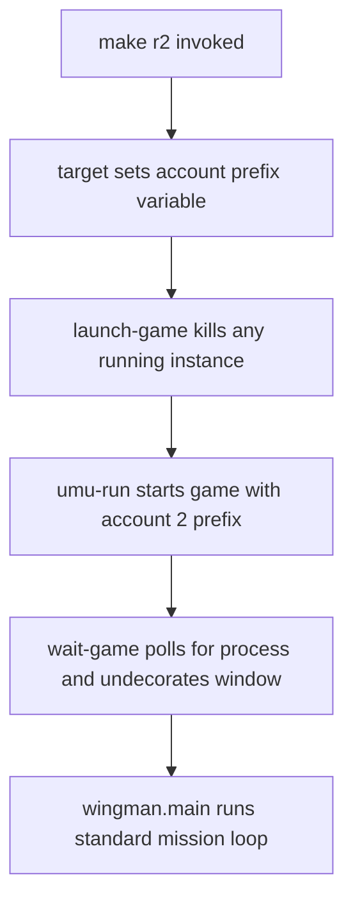

# Research 005 — Multi-Account Run Targets (make r1 / r2)

| Status | Date       | Wingman Version |
|--------|------------|-----------------|
| Draft  | 2026-08-15 | 1.8.2           |

## Question

Can Wingman support `make r1`, `make r2`, … where each target runs the standard
mission loop logged into a different MetalStorm account, on Linux via
Proton (umu-run, Heroic-installed game)?

## Summary of Findings (initial assessment, unverified)

Sequential per-account operation (one account at a time) looks feasible with a
small Makefile change. Simultaneous multi-instance operation is out of scope —
the input and capture architecture cannot support it (see Constraints).

### Why sequential targets should work

- The launch path is already parameterized in the Makefile: `WINE_PREFIX` and
  `GAME_EXE` are `?=` variables consumed by `launch-game`.
- MetalStorm's login session is expected to persist inside the Wine prefix
  (`drive_c/users/<user>/AppData`), not the game install directory. If that
  holds, one shared `Metalstorm.exe` plus one prefix per account gives one
  independent logged-in session per prefix.
- GNU make target-specific variables propagate to prerequisites, so per-account
  targets reduce to:

  ```make
  r1: WINE_PREFIX := $(HOME)/Games/Heroic/Prefixes/Metalstorm-acct1
  r1: r

  r2: WINE_PREFIX := $(HOME)/Games/Heroic/Prefixes/Metalstorm-acct2
  r2: r
  ```

- `launch-game` already kills any running `Metalstorm.exe` before launching, so
  account switching (`make r2` after `make r1`) gets teardown for free.
- Window management (`wait-game`, `undecorate-game-window`), capture region,
  and crop calibration are unchanged because only one instance exists at a
  time, in the same window position.

### Proposed launch and switch flow



## Constraints — why simultaneous instances are excluded

- `wingman/controller.py` injects input via XTest, which is global to the X
  display and targets whatever window has focus. Two instances would fight
  over the keyboard.
- The hotkey listener (XRecord) is display-global.
- Capture is a single configured monitor region (`config.yaml` `region:` and
  `monitor:`).
- `launch-game` enforces a single game process by design.

Window-targeted input, per-instance capture, or nested display servers would
be a separate project, not an extension of this one.

## Open Questions / Verification Plan

1. **Prefix-portability of login (blocking).** Copy the existing prefix to
   `Metalstorm-acct1`, launch from it, and observe whether the game comes up
   logged in as the same account.
   - If yes: session lives in the prefix; the scheme works as proposed.
   - If no (token in install dir): each account needs its own `GAME_EXE`
     (separate install) — still feasible, more disk.
2. **First-run bootstrap per account.** Confirm the one-time flow: launch the
   game with a fresh prefix (`make g` with prefix override, or `g1`/`g2`
   variants), let Proton do first-run prefix setup, log in manually, verify
   the session persists across relaunch.
3. **Per-account Wingman state.** `docs/performance/current/run_*.json` and
   MissionStatsTracker output would mix data from different accounts.
   Decide whether to pass an account tag (env var or `--account` flag) into
   `wingman.main` so performance baselines and mission stats stay separable.
   Accounts at different progression (different jets or missiles) may also
   behave differently against tuned thresholds.
4. **Anti-cheat / ToS check.** Confirm running alternate accounts through the
   same automation does not trip any single-account or device-binding
   assumptions in the game's backend.

## Proposed Implementation (pending verification)

1. Add `r1`/`r2` (and `g1`/`g2` bootstrap) targets using target-specific
   `WINE_PREFIX` overrides.
2. Document the one-time login bootstrap per prefix in the Makefile comments.
3. Optionally thread an account label into `PerformanceTracker` and
   MissionStatsTracker output filenames.

## Disposition

Open — awaiting the prefix-copy login test (Open Question 1) before any
Makefile changes.
