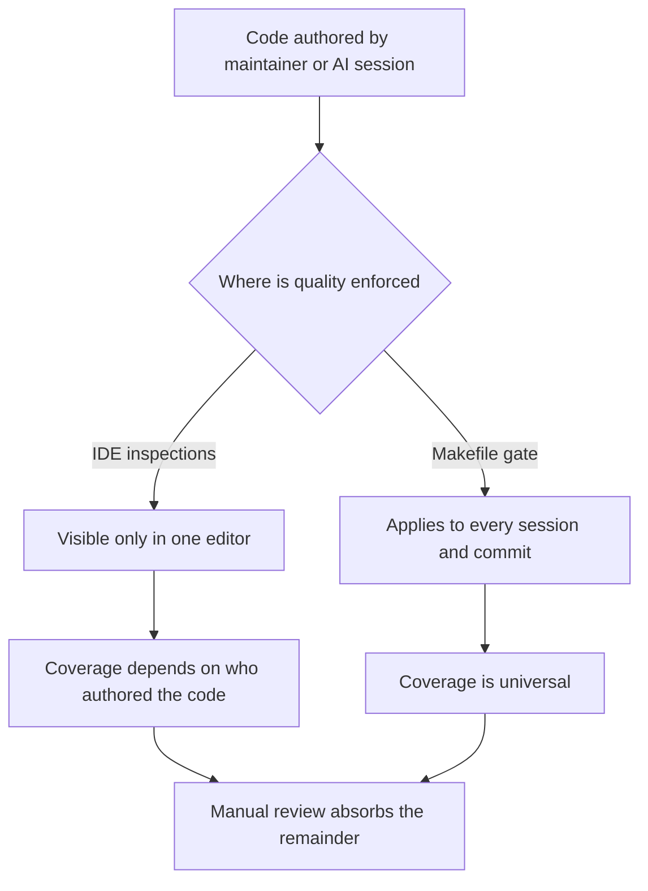

# Research 007 — PyCharm IDE Fit for This Project

| Status | Date       | Wingman Version |
|--------|------------|-----------------|
| Draft  | 2026-08-20 | 1.8.4           |

## Question

The project is developed in VSCode. Since it is predominantly Python, would
PyCharm be a better-suited development environment? If not, what closes the
gap without a migration?

## Current State

- 58 Python files, roughly 27k lines across `wingman/`, `tests/`, and
  `scripts/` — a small codebase by IDE-indexing standards.
- No `.vscode/` directory exists. The editor is used essentially unconfigured:
  no pinned interpreter, no type-checking mode, no task definitions.
- No lint, format, or type-check tooling anywhere (see Research 006).
- 50-plus Makefile targets are the real entry points for every workflow —
  tests, runtime replay gates, requirements gates, performance charts,
  calibration, and app launch. `CLAUDE.md` mandates `make <target>` over
  ad-hoc `python` or `pytest` invocations.
- `.venv` is uv-managed, with `gi` supplied by a `system_gi_bridge.pth` file
  rather than by a package installed into the environment.
- Roughly half the repository is documentation: ADRs, HLDDs, code reviews,
  research, and StrictDoc `.sdoc` requirements with generated `.md` exports,
  plus mandated Mermaid diagrams.
- The application injects keyboard and mouse input and captures the screen on
  a 1.5-second tick. Diagnosis happens through `wingman.log` and the replay
  harness in `wingman/replay.py`, not through interactive breakpoints.

## Where PyCharm's Advantages Land

PyCharm's differentiators, assessed against the conditions above rather than
in the abstract:

1. **Integrated test runner and run configurations.** This is PyCharm's
   strongest everyday feature, and it is the one the project has
   deliberately routed around. Test entry points are `make test`,
   `make tp`, `make tp-full`, `make ocr`, `make rr-path1-gate`, and
   `make rr-live-path1-gate` — composite targets that sequence pytest with
   runtime replay validation, requirements checks, and performance
   regression comparison. A PyCharm run configuration would either wrap the
   same `make` call, in which case VSCode tasks do it equally well, or
   bypass the Makefile, which `CLAUDE.md` forbids.
2. **Interactive debugger.** Weakened by the runtime model. The loop drives a
   live game through injected input; pausing at a breakpoint desynchronizes
   the thing being debugged. The established diagnostic path is log analysis
   plus deterministic screenshot replay.
3. **Interpreter and environment management.** A mild liability here. PyCharm
   actively manages interpreters and package state; the environment is
   uv-managed with a hand-placed `.pth` bridge for `gi`. VSCode points at an
   interpreter path and does not intervene.
4. **Deep framework support.** Not applicable. PyCharm's framework value
   concentrates in Django, Flask, SQLAlchemy, and database tooling. This
   project has no web framework, no ORM, and no database.
5. **Indexing and navigation at scale.** Real, but the advantage grows with
   codebase size and type coverage. At 58 files it is not a differentiator.
6. **Cross-module refactoring.** A genuine advantage, and the clearest one.
   Symbol renames spanning the analyzer, controller, tick handlers, and their
   tests are safer under PyCharm's refactoring engine than under
   text-based find-and-replace.
7. **Concurrency inspection.** Also genuine. `CLAUDE.md` carries three
   threading rules — lock release in `finally`, stoppable daemon threads,
   lock acquire timeouts on main-loop paths — and PyCharm's thread view is
   better than VSCode's for observing that behavior live.

## Where VSCode Fits Better

- **Documentation weight.** Markdown, Mermaid, and YAML tooling is stronger
  and better supported by extensions. For a repository that is roughly half
  documentation with a mandated diagram format, this is not a minor point.
- **Makefile-centric workflow.** Tasks wrap existing targets directly, with
  no parallel configuration to keep in sync.
- **Unmanaged environments.** VSCode tolerates the uv plus `.pth` arrangement
  without attempting to correct it.
- **Existing AI tooling.** The Claude Code VSCode extension and the
  `.continuerules` configuration are both in place. Migration would mean
  re-establishing that setup on the JetBrains plugin.

## The Enforcement-Layer Argument

The decisive consideration is not feature count but *where enforcement lives*.

PyCharm delivers code quality as IDE inspections — warnings surfaced in one
developer's editor. That mechanism assumes a human is looking at the editor
when the code is written. In this project, code is predominantly written by AI
sessions and reviewed by the maintainer before entering history. An AI session
does not see PyCharm's inspection highlights, so an IDE-only quality layer
covers a shrinking fraction of the code that actually gets produced.

A `make lint` target inside `make tp`, as proposed in Research 006, applies
to every session and every commit regardless of which editor produced the
code. Research 006 therefore already selected the correct architecture for the
generic quality layer; the IDE choice is downstream of it and matters less.

- PyCharm's inspections sit on the left branch.
- Ruff wired into `make tp` sits on the right branch.
- The domain rules in `CLAUDE.md` remain on the manual-review path under
  either IDE.

## Coverage Comparison

| Quality layer | PyCharm | VSCode plus Research 006 |
|---|---|---|
| Bug-class detection (bugbear, pyflakes, unused args) | IDE inspections, per-user | Gated in `make tp`, universal |
| PEP 8 and formatting | IDE inspections, per-user | Gated, plus a one-time `ruff format` pass |
| Type checking on untyped code | Weaker inference | Pylance strict mode in-editor |
| Domain rules (lock and thread patterns) | Not covered | Not covered — `CLAUDE.md` plus review |
| Cross-module rename refactoring | Strong | Weak |
| Live thread-state inspection | Strong | Weak |

## Recommendation

**Stay on VSCode.** PyCharm's strongest advantages — test runner, debugger,
framework support, environment management — are either neutralized by the
Makefile-and-replay workflow or actively mismatched to it. Its two real
advantages, refactoring and thread inspection, are occasional rather than
daily, and do not justify the migration cost or the loss of the existing AI
tooling setup.

Direct the equivalent effort at configuration the project currently lacks:

1. `.vscode/settings.json` pinning the uv-managed interpreter and enabling
   Pylance in strict or basic mode. This closes the type-checking gap and
   exceeds what PyCharm offers on largely untyped code.
2. `.vscode/tasks.json` wrapping `make tp`, `make test`, and `make ocr` so
   the gates are reachable without leaving the editor.
3. Execute Research 006 — ruff lint and format wired into `make tp`. This is
   the item that matters most, and it is IDE-independent.

Items 1 and 2 are the only additions beyond work already planned. Research 006
should be sequenced first at its step 2 (baseline triage) so the initial gate
run does not surface an untriaged backlog.

## Residual Gaps

Neither IDE mechanically enforces the domain rules in `CLAUDE.md`. The
`try: release() except RuntimeError` anti-pattern is mechanically detectable
and is the one gap where a small custom check buys something no off-the-shelf
IDE provides. Research 006 lists this as a nice-to-have; it remains the
highest-value item outside both IDEs' reach.

## Related

- Research 006 — coding standard adoption (ruff lint and format gate); the
  enforcement-layer decision this document depends on.
- Research 002 / Research 004 — prior tooling-adoption spikes, establishing
  the pattern of evaluating a tool against the real repository before
  committing to it.
