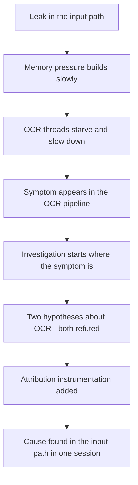

# Research 009 — Per-Operation Handle Leaks in Long-Running Automation

| Status | Date       | Wingman Version |
|--------|------------|-----------------|
| Draft  | 2026-08-23 | 1.8.5           |

## Question

Wingman leaked ~1,300 MB/h for **two months** before anyone noticed, and then
took three days and two refuted hypotheses to locate. What is generalisable —
both about the defect class and about why it stayed hidden — so the next
long-running automation project does not repeat it?

Source material: ADR 091, Performance 008. This document is the transferable
part; those two hold the incident record.

## The defect in one sentence

**A handle was constructed per operation, and its constructor mutated
process-global state that `close()` does not undo.**

`_linux_key_event` opened a new `Xlib.display.Display` for every key press and
every key release. `Display.__init__` rebuilds Xlib's resource classes:

```python
# Xlib/display.py:121
self.display.resource_classes[type_] = type(origcls.__name__, (origcls, object), dict)
```

`close()` closes the socket. It cannot un-create a class. Measured: **~16.2 KB
retained per construction, surviving `gc.collect()`**. At ~6,700 control actions
per hour that is ~80,000 constructions per long session, and 1,277 MB of
retention in 105 minutes — 96% of all heap growth.

The fix was to open one connection per process and reuse it, which also required
a lock: the per-call handles had been providing thread isolation for free.

## Why this class is easy to introduce

Per-operation construction is the *safer-looking* option and usually reads
better in review:

- It is stateless. No shared object, no lifetime question, no thread-safety
  argument to make.
- It is trivially correct under concurrency.
- It self-heals. A broken connection cannot poison the next call.
- `try/finally: close()` looks like complete cleanup, and for the *resource* it
  is. The leak is in the side effects of construction, which no one is looking
  at.

Wingman's original code even documented the retry logic around it — the author
was thinking carefully about failure modes, and still the allocation cost was
invisible. **This is not a carelessness bug. Careful code has it.**

## The rule

> Treat every handle constructor as though it registers something global,
> until you have checked that it does not.

Construct once per process and reuse. If you construct per operation, that is a
decision requiring evidence, not the default.

### Constructors that plausibly retain

Not a verified list of leaks — a list of things to *check* before calling them
in a hot path. Each is a type whose construction commonly touches interpreter-
or process-global state:

| Category | Examples |
|----------|----------|
| Display and GUI connections | X11 `Display`, GTK/Qt contexts |
| Dynamically created classes | anything calling `type()` at runtime, ORM model factories, `namedtuple` in a loop |
| Registries and caches | `logging.getLogger` handlers, `atexit` registration, `warnings` filters, `functools.lru_cache` on methods |
| Native or device contexts | CUDA contexts, GPU allocators, DB connection pools, TLS/SSL contexts |
| Plotting and rendering | matplotlib figures without explicit `close()` |
| Network sessions | HTTP sessions, gRPC channels, message-broker connections |

The common tell: **the object's own docs talk about closing it, and say nothing
about what construction registers.**

### The test that would have caught it

The cheapest possible guard, and the one now in `tests/test_input_linux.py`:

```python
def test_repeated_key_events_open_exactly_one_display(...):
    for _ in range(200):
        input_linux._linux_key_event("k", "KeyPress")
    assert len(opened) == 1
```

Count constructions across N operations and assert the count. It needs no memory
profiling, runs in milliseconds, and states the design intent directly. Write it
when you introduce a handle, not after a leak.

## Why it hid for two months

The defect is half the lesson. The other half is that a 1,300 MB/h leak ran in
plain sight.



### 1. The symptom surfaced far from the cause

Wingman's visible failure was **OCR degradation** — median rising 0.23 s to
0.55 s, p95 crossing the tick budget. Every early hypothesis was therefore about
OCR: glibc arena fragmentation across the OCR thread pool, then EasyOCR reader
churn. Both were plausible, both were tested, **both were wrong**, and both cost
days. The allocation was in the input path, which nothing had looked at.

*Generalise:* memory pressure is a **global** symptom. It surfaces wherever the
system is most latency-sensitive, which is rarely where it is caused. Resist
localising the search to the subsystem where the symptom appears.

### 2. Short sessions systematically underread

From the archived logs, RSS growth by session length:

| duration | measured rate |
|----------|---------------|
| 0.75 h | +120, +288 MB/h |
| 2 - 7 h | +952 to +1,666 MB/h |

A 45-minute smoke test showed roughly a tenth of the real rate. Every routine
test run said the system was fine.

*Generalise:* if a defect accumulates, **test duration is a detection
threshold**. Decide the shortest run that would reveal it and make that a gate,
or accept it will reach production.

### 3. There was no per-session memory record

Per-session performance JSON captured OCR timings and reaction latency —
nothing about memory. So every round of investigation restarted from whichever
log happened to survive, and no trend could accumulate across sessions.

*Generalise:* if a metric is not recorded per run, **regressions in it are
invisible by construction**. Record the resource envelope — peak RSS, live-heap
growth rate, handle and thread counts — beside the functional metrics, from the
first release.

### 4. Two false positives came from reasoning ahead of measurement

Both refuted hypotheses were mechanisms that *fit* the evidence rather than
measurements that *discriminated* between causes. What broke the deadlock was a
rule written into Performance 008 after the second failure:

> No hypothesis before that data.

The next step taken was attribution instrumentation — tracemalloc grouped by
allocation site — which named the file and line **in a single session**.

*Generalise:* after the second failed hypothesis, stop hypothesising. Build the
instrument that attributes rather than the experiment that tests a guess.

## Instrumentation lessons

These cost real time to learn and are not obvious.

### `gc.get_objects()` is blind to exactly the payloads that matter

A census built on `gc.get_objects()` was the obvious first instrument. Measured
directly:

| | 64 MB of retained `ndarray` |
|---|---|
| `gc.is_tracked(arr)` | **False** |
| returned by `gc.get_objects()` | **No** |
| seen by tracemalloc | **64.0 MB** |

A non-object-dtype numpy array cannot take part in a reference cycle, so CPython
leaves it untracked. `bytes` and `bytearray` behave the same way. **A gc census
would have reported a flat Python heap while gigabytes of frames accumulated** —
which reads exactly like "the leak is in native code" and would have closed the
correct branch of the investigation.

Use tracemalloc for payload attribution. It sees numpy allocations, and it
carries a traceback. Use the gc walk only to name the *container type*, and only
by scanning tracked containers' contents for untracked payloads.

### Measure the instrument's own cost before trusting it

| lane | cost per census |
|------|-----------------|
| tracemalloc snapshot | 15 ms |
| `gc.get_objects()` alone | 18 ms |
| gc walk plus content scan | **2,200 - 3,800 ms** |

Against a 1.5 s control loop, the content scan is a multi-second freeze — it
would have stalled through a missile engagement and corrupted the very session
it was measuring. It was made opt-in and off by default.

Also: `tracemalloc.take_snapshot()` cost **grows with accumulated traces** — 13 ms
at session start, 5,515 ms at 95 minutes. A long-running diagnostic needs a
self-disarm, or it degrades what it is measuring.

### Diagnostic runs pollute the metrics they sit beside

The session that found the leak had every OCR crop inflated 49-74% and reaction
latency +170%, purely from tracemalloc overhead. Left in the normal results
directory it would have poisoned the performance baseline and looked like a
regression.

*Generalise:* runs recorded under instrumentation need to be **quarantined by
construction** — a separate directory the aggregator does not read — not by
remembering to exclude them.

### Cross-version metrics are usually not comparable

An attempt to date the leak by correlating OCR timings with session duration
across 618 archived runs produced a clean-looking trend that **did not survive
version breakdown**: adjacent versions swung 0.170 to 0.423 on the same metric,
and a version predating the defective code entirely showed elevated values.
Pipeline changes swamped the signal.

*Generalise:* a metric is comparable across versions only if everything feeding
it held still. Date a defect from **version control**, not from telemetry
regression.

## Pre-registering criteria

After two false positives, the validation criteria for the fix were written down
**before** the confirming session ran: pass under 100 MB/h, ambiguous 100-400,
fail above 400, plus an independent OCR check and equal-elapsed comparisons
against a named control session.

This costs ten minutes and removes the possibility of grading your own homework.
Worth doing for any fix whose confirmation is a judgement call about a noisy
measurement.

## Checklist for the next project

**Design**
- Handles, connections and contexts: one per process, reused. Per-operation
  construction requires justification.
- For any handle in a hot path, check what its constructor registers globally.
- Assert construction counts in a unit test the day the handle is introduced.

**Instrumentation, from the first release**
- Log a periodic resource line: RSS, live heap, arena-retained, threads, fds,
  plus the same for any child process being driven.
- Persist the resource envelope per session, next to the functional metrics.
- Separate **live allocation** from **arena-retained** memory. Wingman chased
  fragmentation for two days because it could not tell them apart; once it
  could, the answer followed in one session.
- Distinguish your process from the ones you drive. Wingman's monitor now
  reports "wingman is a victim, not the cause" when the driven game grows and
  wingman does not — MetalStorm leaks ~215 MB/h independently, and without that
  separation it would read as wingman's fault.

**Testing**
- Pick the shortest run that would expose an accumulating defect; gate on it.
- Treat a passing short test as evidence about short runs only.
- Pin the set of handle-construction sites so adding one is a decision, not a
  merge. Wingman does this in `tests/` per ADR 092.
- Gate releases on a measured leak rate from a real session, with **three**
  outcomes — pass, fail, and insufficient data. Insufficient must never count as
  a pass; short sessions underread by roughly tenfold (see above), so a green
  light from a twenty-minute run retires the question while the defect is live.

**Investigating**
- The symptom's location is weak evidence about the cause's location.
- After two failed hypotheses, build the attributing instrument instead.
- Register pass criteria before the confirming run.

## What wingman built in response

Recording the outcome so this document is a design input, not just a
retrospective. Both mechanisms are specified in **ADR 092**.

| mechanism | detects | runs | catches unknown causes |
|-----------|---------|------|------------------------|
| Source-site guard | the known *cause* pattern | every commit | no |
| Log-based leak gate | any leak, by *symptom* | `make leak-check`, in `make tp` | **yes** |

The split matters more than either piece. The guard is cheap and immediate but
only watches what it was told to watch — which is precisely the failure this
document describes, since the cause sat where nobody was looking. The gate is
broad but says nothing until a qualifying session exists.

Two design points generalise beyond wingman:

- **Three outcomes, never two.** A leak gate that reports only pass or fail will
  report *pass* when the available data cannot support any conclusion. Given
  that short runs underread accumulating defects by an order of magnitude, that
  false green is worse than no gate. `INSUFFICIENT DATA` must be a distinct
  outcome, and a release gate should treat it as blocking.
- **Separate your process from the ones you drive, and live allocation from
  retained arena.** Wingman's post-fix sessions show RSS growing +109 MB/h with
  live allocation flat, and the driven game growing ~215 MB/h independently.
  A gate reading RSS alone would fail on both, twice wrongly.

## References

- ADR 091 — the fix, its evidence, and the thread-safety consequence
- ADR 092 — the two detection mechanisms this document's checklist calls for
- Performance 008 — the full incident record including both refuted hypotheses
- ADR 090 — the memory guard adopted as mitigation while the cause was unknown
- `wingman/heap_census.py` — the attribution instrument
- `wingman/resource_monitor.py` — the periodic resource line and its verdict logic
