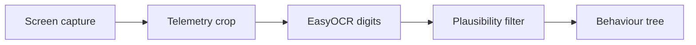

# Research 010 — What the Telemetry OCR Actually Gets Wrong

| Status | Date       | Wingman Version |
|--------|------------|-----------------|
| Draft  | 2026-08-28 | 1.8.7           |

## Question

The telemetry filter rejected 375 readings in the session of 2026-08-27. The
obvious reading of that number is "the OCR is weak, improve the OCR." Is it?

## Answer

No. The character recognition is working. What fails is *what pixels reach it*.

And the rejection count cannot tell you how accurate the reader is, in either
direction. It is a floor, not a measurement.

## The reader is not the problem

Every rejected altitude reading was compared against the truth interpolated from
the accepted readings either side of it, and the error classified by shape:

| Error shape | Count | Share |
|---------------------------|------:|------:|
| Multiple digits wrong | 294 | 79.5% |
| Digit dropped (truncated) | 66 | 17.8% |
| Digit gained | 4 | 1.1% |
| **Single digit substituted** | **6** | **1.6%** |

A weak classifier fails by confusing one character for another — 6 for 4, 8 for
3 — and produces single-digit substitutions. We have six, across a whole
session. The classifier is doing its job.

The other 97 percent is a different failure. Readings like `7` where the truth
is 2285, or `45` where it is 2852, are not misrecognised numbers; they are
numbers that were not fully present when the frame was read. 34 of 372 altitude
readings came back as one or two digits while the speed field beside them read
normally.

Two candidate explanations were tested and one was eliminated: the crops are not
bleeding into each other. Altitude matched the concurrent speed value in 1 of
372 rejections (0.3 percent), so the reader is not picking up the wrong HUD
element. What remains is the crop bounds, the HUD's own fade and animation, or a
frame grabbed mid-render — all of which are about the capture, not the reader.

ADR 097 hardened stage D. The evidence puts the defect in A or B. Stage C, the
part that "improve the OCR" would target, is the one stage the data exonerates.

## Why the rejection count cannot measure accuracy

The filter rejects readings that are *implausible* — outside the physical
envelope, or too far from the last accepted value. It has no way to notice a
reading of 6087 when the truth is 6007. That value is physically ordinary, it
passes every gate, and it is published as fact.

So the 3.9 percent of raw readings that imply impossible descent rates is a
lower bound on the error rate. The true rate is that plus an unknown number of
plausible-but-wrong readings, and no amount of studying the logs will reveal it,
because the logs only record what the filter could detect.

This cuts both ways, which is the part worth remembering:

- A **rising** rejection count is not proof the reader got worse. It may mean the errors got larger and more detectable.
- A **falling** rejection count is not proof the reader got better. It may mean the errors got subtler and slipped under the gate.

Rejection count is therefore unusable as the success metric for any OCR work.
Measuring accuracy requires frames labelled with their true values. There is no
substitute and no shortcut.

## What to do

**1. Capture the frames the filter rejects.** Blind capture is the wrong
instrument: failures are about 4 percent of readings, so a general screenshot
sweep buys hundreds of easy frames to find a handful of hard ones. Triggering
capture at the moment of rejection collects the failures pre-selected, at no
labelling cost.

The mechanism already exists and should be reused rather than reinvented:
`HealthDropoutRecorder` (ADR 080 d2) implements capture-on-anomaly against the
ADR 074 recorder contract — capped per session, never raises, capture failure
must not take down the tick loop.

**2. Label them and measure.** A few dozen frames with known true values give
the first real accuracy figure this project has had, and — more useful — show
whether the bad frames share a condition: a HUD state, a moment in the render
cycle, an altitude band, an explosion on screen.

**3. Then decide the fix.** Only after step 2 is it knowable whether the answer
is crop bounds, capture timing, an occlusion guard, or the reader after all.

## What not to do

Do not tune or retrain the recognition model on the strength of the rejection
count. It targets 1.6 percent of the observed errors, cannot be validated by the
metric that motivated it, and the evidence points elsewhere.

## Priority

This is a quality and latency improvement, not a live defect. ADR 097 already
stops every implausible reading from reaching the behaviour tree; the residual
cost is that the published altitude is occasionally stale, with a p99 age of 3
seconds. It can wait behind anything that is actually broken.

## References

- ADR 097 — the plausibility gate this sits upstream of; source of the error data
- ADR 080 d2 — `HealthDropoutRecorder`, the capture-on-anomaly precedent to reuse
- ADR 074 — the recorder contract (session cap, never raises)
- ADR 067 — metric HUD units
- Evidence: `wingman.log`, 2026-08-27 19:13 through 2026-08-28 01:35 (5147 raw readings)
