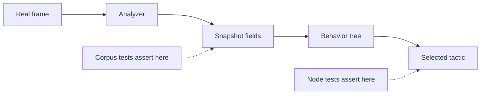

# Research 011 — Behavior-Driven Tactic Validation: Applicability

| Status | Date       | Wingman Version |
|--------|------------|-----------------|
| Draft  | 2026-08-31 | 1.8.8           |

## Question

Wingman selects tactics through a py-trees selector (ADR 024). The replay lanes
(ADR 037 / 044 / 045) feed real screenshots through the real capture and OCR
path, but their assertions name only FSM states and triggers — a search of the
repository for `expected_tactic` returns nothing, and `wingman/replay.py` has no
reference to tactics at all.

Should the replay schema be extended to assert the **selected tactic**, giving
end-to-end behavior-driven validation from real pixels to the chosen leaf?

This began as a design (drafted as HLDD 011, since withdrawn). Checking the
premise before implementing showed the premise was largely wrong, so the
document was converted to this one.

## Summary of Findings

**No, not the replay-lane extension.** The gap it targets is much smaller than
it first appeared. The analyzer-to-snapshot seam — the half that looked
untested — is already asserted field by field against real archived frames, in
tests that run in `make test`. What an end-to-end tactic assertion would add
over the existing coverage is that the two halves *compose*, which is the least
valuable link and the most expensive to build and maintain.

**Yes to one small piece**, on its own merits and not as a gate: an
operator-paced mode for the existing screenshot presenter, as a debugging bench.

## What Behavior-Driven Testing Already Exists

There is no BDD framework here — no pytest-bdd, no behave, no `.feature` files.
But `tests/test_behavior_tree.py` is given-when-then in substance, and says so
in its own docstring: *given snapshot X, assert selected tactic Y*.

- **Given** — `make_snap(**overrides)`, a named default world perturbed one
  field at a time
- **When** — `tick(harness, snap)`
- **Then** — `assert ... == TACTIC_EJECT`

Its 45 test names read as a priority specification: `eject_on_missiles_empty_beats_engage`,
`climb_yields_to_defensive_tactics`, `an_enemy_contact_outranks_regroup`,
`incoming_beats_sustain_climb`. A `FakeClock` runs scenarios over time, so
anti-flap holds and hysteresis bands are covered as sequences rather than single
ticks.

This layer is healthy and is not in question.

## The Seam Was Already Closed

The original argument was that every tactic test hand-builds its snapshot, so
`ring_short=2` is a literal nobody checks against real pixels — meaning the
analyzer could misread the world and the tree would faithfully select the wrong
tactic from a wrong snapshot with the suite green.

That argument does not survive contact with the test suite.

`tests/test_minimap_bearing.py:299` asserts exact ring occupancy on a real
archived frame, against hand-verified ground truth:

```python
rings = bin_rings(components_of_frame(load_config(), MINIMAP_FRAME))
assert rings[RING_SHORT].count == 2
assert rings[RING_MID].count == 0
assert rings[RING_LONG].count == 3
```

Three frames are covered this way — the reference frame, a desert frame with one
contact per ring, and a rim-merged frame carrying a known tuning gap. All run in
`make test`.

Coverage of the other snapshot inputs, by the same reading:

| Snapshot input | Asserted from real frames | Where |
|---|---|---|
| Ring occupancy (short, mid, long) | Yes, exact counts, three frames | `test_minimap_bearing.py` |
| Bearing | Yes, bounded ranges | `test_minimap_bearing.py` |
| Speed and altitude | Yes, accuracy gate over a 17-frame labeled corpus | `test_telemetry_corpus.py` (ADR 038) |
| Incoming | Yes, template positive and negative, plus OCR fallback | `test_analyzer.py` |
| Respawn | Yes, positive and negative | `test_analyzer.py`, `test_automated_levels.py` |

So the perception layer is checked against real pixels, and the decision layer is
checked against constructed snapshots. Both sides of the seam have coverage.



## Why the End-to-End Extension Does Not Pay

**The new information is thin.** With both halves covered, an end-to-end tactic
assertion tells you only that they compose. Composition failures are real but
rare, and they tend to be caught by the FSM assertions the replay lanes already
make, because a snapshot wrong enough to flip a tactic usually disturbs a state
or trigger too.

**The corpus cost is not comparable.** Labeling a frame as *three contacts in
the long ring* is mechanical, and the ground truth stays true forever. Labeling
a frame as *the correct tactic here is EJECT* is a judgement about the whole
tactical situation, and it goes stale whenever a threshold or hold duration is
tuned. That inverts the maintenance economics of the existing corpora.

**It would freeze incidental behaviour.** Several leaves are deliberately sticky
— minimum-hold decorators, hysteresis bands, confirm-read counts. Tactic
assertions on a timed replay would turn ordinary tuning into red tests, and the
pressure would be to loosen the assertions until they stop saying anything.

**It touches the production tick path.** The observation point would be a
callback at `tick_handlers.py:956`, `None` outside replay. Small, but it is a
branch in the hot loop bought for a thin benefit.

**Test count is not the constraint; maintenance surface is.** The suite is at
1144 tests and adding more is cheap. A new schema key, a new engine entry point,
and a corpus whose ground truth expires are not.

## What Went Wrong in the Original Analysis

Worth recording, because the failure mode is reusable.

The gap was inferred from an absence in one place — the replay schema has no
tactic assertions — without checking whether the same seam was covered
somewhere else. It was, in a differently named test file, by a different
mechanism, at a different layer. A grep for `expected_tactic` answered the
question *is this asserted in the replay lanes*, and was read as though it had
answered *is this asserted anywhere*.

The check that would have caught it is the cheap one: before designing coverage
for a gap, look for the property under every name it might have, not only the
name the proposed design would give it.

## The Piece Worth Keeping

`tests/live_screen_presenter.py` already displays scheduled screenshots inside
the capture region so the real capture and OCR path runs against real screen
pixels (ADR 045). It advances on a timer, sorted by `injection_time_s`.

A flag that advances on keypress instead — next, previous, quit — and prints the
observed tactic and the snapshot fields behind it, turns that script into a
bench for the question *why did it choose that?* when a live session does
something puzzling. It needs no schema change, no corpus, and no production
callback, because it only reads what the tree already logs.

Manual pacing must suspend timing verdicts: a settle budget is meaningless when
the operator controls the clock. This is a bench, never a gate — `make tp`
continues to run the timed lane.

## Recommendation

1. **Do not** add `expected_tactic` to the replay path schema, the assertion
   engines, or the tick-handler callback. HLDD 011 is withdrawn rather than
   deferred: if the need reappears, the analysis should start from the coverage
   table above rather than from that design.
2. **Do** add the operator-paced presenter flag when a live session next needs
   debugging. Small, independent, and useful without any of the above.
3. **If a real coverage hole appears**, close it with the pattern that already
   works here — label a frame, assert the field — rather than by plumbing
   decisions through the replay engine. That pattern is cheap, its ground truth
   does not expire, and it puts the failure message next to the component that
   is actually wrong.

## References

- ADR 024 — the shadow behavior tree and tactic priority
- ADR 037 / 044 / 045 — replay path definitions, the deterministic runtime gate,
  and the live-screen gate with its presenter
- ADR 038 — telemetry OCR corpus and its accuracy gate
- `tests/test_behavior_tree.py` — the node-level layer, 45 tests
- `tests/test_minimap_bearing.py` — ring occupancy asserted on real frames, the
  evidence that overturned the original premise
- Research 001 — the earlier applicability verdict this document follows in form
