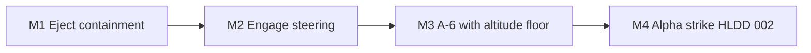

# Roadmap 001 — Flight-Quality Roadmap: Live-Data Behaviors and A-6 Integration

| Status | Date       | Wingman Version |
|--------|------------|-----------------|
| Draft  | 2026-08-09 | 1.7.2           |

## Purpose

Phase 3 (ADR 024) is complete: the behavior tree owns tactic selection and
actuation, validated across gates and live sessions. This roadmap tracks the
next stage — refining the tree's behaviors to *use live data well*, driven by
what the aircraft still does wrong in flight rather than by document status.
It supersedes the stale "Next Steps" list in `PROJECT_AI_ROADMAP.md`.

**Constraint — CPU-only:** GPU OCR is explicitly out of scope for this stage.
The project is exploring how far behavior quality can go on the CPU pipeline
(~1.0–1.4 s battle cycle, ~3 s telemetry cadence) before spending hardware on
it. Every controller designed here must be honest about that cadence.

## Milestone order

M1 and M2 are independent and may swap; M3 depends on M2 (the A-6 inherits the
steer controller); M4 assumes all three.

---

## M1 — Eject containment and descent quality

**Status: open — design in [ADR 069](../adr/069-eject-impulse-rotation-and-ballistic-descent.md) (Draft)**

ADR 069 widens this milestone: the 2026-08-10 06:21 trace showed the eject not
only risking arena exit but descending at less than half the achievable rate,
because continuous nose-down over-rotates into a high-drag mushing descent and
the angle metric saturates during acceleration. The afterburner gating below is
folded in as ADR 069 decision 8.

**Problem (observed):** The ADR 068 rework fixed the dive diagnosis bugs, but
when combat damage or decay churn exhausts the rotation budget, the jet levels
off and glides under full afterburner in whatever direction it was pointing —
sometimes out of the arena (sessions 2026-08-09 10:04, 13:12: 15 of 24 ejects
exhausted the budget mid-fight).

**Direction:** the eject is currently one-dimensional (pitch) and blind to
position. Both missing signals already exist per tick:

- Cut AFTERBURNER when no dive is established — full burner during a level
  glide is what carries the jet out of the arena; re-engage it once the dive
  confirms (it exists to accelerate the crash, not the glide).
- Use minimap position/bearing to bias the glide back toward the map interior
  when nose authority is exhausted.

**Acceptance:** a multi-session sample with zero arena exits during eject;
budget-exhausted ejects still reach respawn without manual takeover.

---

## M2 — Engage steering: hold the turn until the bearing closes

**Status: open**

**Problem (observed):** the Engage leaf issues a single coarse roll
(0.15–0.6 s hold) then sits in a 2 s shared cooldown that fine tracking also
pre-empts — the jet momentarily turns toward the target, then gives up.

**Direction:** replace nudge-and-cooldown with a closed-loop steer controller:
hold the roll input until the measured bearing error actually closes,
re-evaluated every tick against fresh minimap data, with explicit arbitration
against the fine tracking loop instead of a shared timestamp. Must remain
stable at the ~1.5 s tick / ~3 s telemetry cadence (CPU constraint above).

**Acceptance:** log traces showing sustained turns that reduce bearing error
monotonically to the deadband; engagement rate (contacts closed per mission)
measurably up vs. the current baseline in `mission_stats`.

---

## M3 — A-6 interceptor integration with an altitude floor

**Status: open — gates M4**

**Problem:** missions currently assume the J20 profile. The A-6 needs its own
launch/climb/weapons script, and its mission profile risks terrain contact.

**Direction:**

- Altitude-floor guard as a behavior-tree concern: below the configured floor,
  climbing takes priority over engage geometry. Builds on the ADR 038 CFIT
  plumbing and the now-trustworthy metric altitude (ADR 067). Note: the
  minimap shows enemies, not terrain — altitude telemetry is the terrain
  signal. Full terrain avoidance (HLDD 001) is deliberately NOT in scope;
  fly above the problem instead.
- `mission_a6` script beside `mission_j20` (launch, climb profile, weapon
  cadence), selected by config; slots in as an AttackSupport variant.

**Acceptance:** unattended A-6 sessions completing the mission loop with zero
terrain deaths and zero manual takeovers; altitude-floor activations visible
and correct in logs.

---

## M4 — Alpha strike (Design 002)

**Status: blocked on M1–M3**

`docs/hldd/002-alpha-strike-hldd.md` begins implementation once the substrate
it assumes exists: steering that holds a turn (M2), an eject that cannot leave
the map (M1), and an aircraft that cannot fly into terrain (M3).

---

## Backlog (not milestone-gated)

| Item | Source | Notes |
|------|--------|-------|
| EVADE threshold calibration + evade tactic | ADR 024 (deferred leaf) | Pick `evade_health_threshold` from session stats; write the Controller tactic; completes the last unwired leaf |
| Disengage live validation | ADR 024 acceptance note | Never fired in flight (rings always occupied); one session with `disengage_after_s` lowered |
| Afterburner re-press heuristic | ADR 068 caveat | Speed-trend check reads terminal-dive drag plateaus as missed presses (16 false re-presses / 24 ejects); bounded but weak evidence — M1's afterburner rework may subsume this |
| Legacy mph/ft naming cleanup | ADR 067 decision 4 | Cosmetic rename of config keys/variables tuned in raw display units; own change, no behavior |
| INCOMING crop bleed | CR-009 | Pre-existing open item; needs screenshot calibration |

## Explicitly out of scope for this stage

- **GPU OCR** — deferred by decision (see Constraint above); revisit only if a
  milestone demonstrably fails on CPU cadence grounds.
- **Full terrain avoidance (HLDD 001)** — superseded by the M3 altitude floor
  for the A-6's needs.
- **Phase 4 RL** — prerequisites remain in place (stable loop, blackboard,
  outcome stats); revisit after M4.
