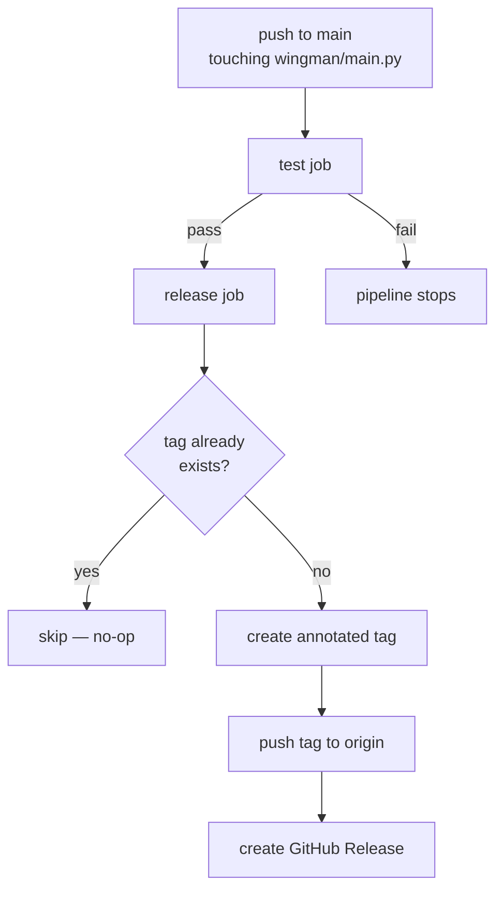

# Workflow 001 — GitHub Actions Release Process

| Status | Date       | Wingman Version |
|--------|------------|-----------------|
| Draft  | 2026-04-10 | 1.6.1           |

## Overview

Releases are automated via `.github/workflows/release.yml`. Every push to `main` that touches `wingman/main.py` triggers the pipeline. No manual tagging or release creation is required — bumping `WINGMAN_VERSION` in source is the sole release action.

## Trigger Condition

```yaml
on:
  push:
    branches: [main]
    paths:
      - 'wingman/main.py'
```

The workflow only runs when `wingman/main.py` changes on `main`. Pushes that touch other files are ignored.

## Jobs



### `test` job

Runs on `ubuntu-latest`. Steps:

1. Checkout the repository.
2. Install `uv` via `astral-sh/setup-uv@v4`.
3. Sync dependencies, excluding the `dev` group (avoids pulling in heavy `easyocr` in CI).
4. Install `pytest` and `pytest-html`.
5. Run `tests/test_analyzer.py` — the non-OCR test suite.

### `release` job

Runs after `test` passes (`needs: test`). Requires `contents: write` permission to push tags and create releases. Steps:

1. **Extract version** — greps `WINGMAN_VERSION` from `wingman/main.py` and exposes it as the step output `version`.
2. **Check tag** — runs `git rev-parse vX.Y.Z` to detect whether the tag already exists. Sets output `exists=true/false`.
3. **Create tag** *(skipped if tag exists)* — configures `github-actions[bot]` identity, creates an annotated tag `vX.Y.Z`, and pushes it.
4. **Create release** *(skipped if tag exists)* — calls `actions/create-release@v1` with the extracted version. Releases are published immediately (not draft, not pre-release).

## How to Cut a Release

1. Update `WINGMAN_VERSION` in `wingman/main.py` to the new version string.
2. Commit and push to `main` (or merge a PR that touches that file).
3. The workflow detects the new version, creates the annotated tag, and publishes the GitHub Release automatically.

## Idempotency

The tag-existence check makes the `release` job safe to re-run. If the tag `vX.Y.Z` already exists (e.g. the workflow was re-triggered without a version bump), both the tag and release steps are skipped and the job exits cleanly.

## What Is Not Automated

- Building or attaching binary/wheel artifacts to the release — the release is currently metadata only.
- Changelog generation — release notes are not populated from commits or PR descriptions.
- Version validation — there is no guard preventing a version bump that skips a semver component (e.g. `1.6.1` → `1.8.0`).
