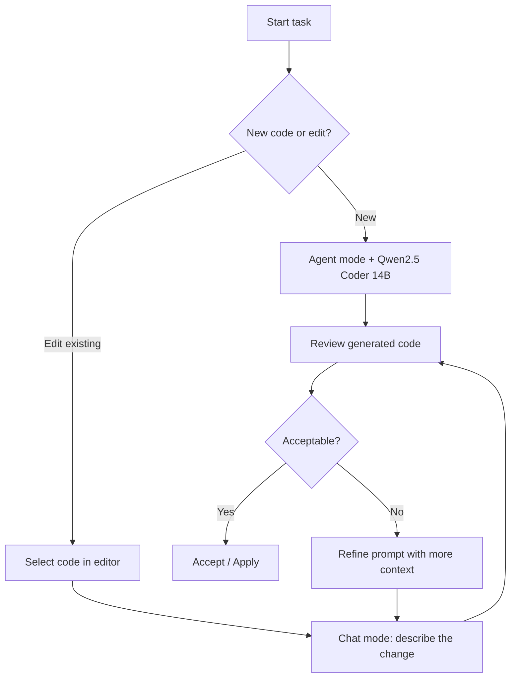
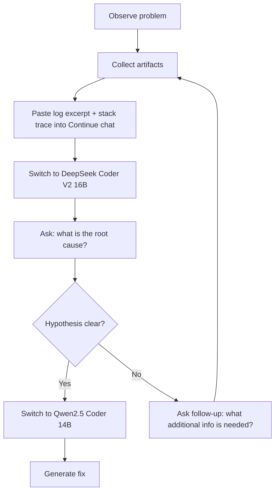

# Workflow 002 — Local Model Development with Ollama

| Status | Date       | Wingman Version |
|--------|------------|-----------------|
| Draft  | 2026-04-21 | 1.6.3           |

## Overview

This document describes how to use local LLMs served via Ollama for development — both for AI-assisted coding in VS Code (via Continue) and for Wingman's own inference calls.

## Infrastructure

Ollama runs on a dedicated machine at `192.168.50.103:11434`. Available models:

| Model | Size | Best For | Tool Support |
|---|---|---|---|
| `qwen2.5-coder:14b` | 14.8B Q4_K_M | Code completion, generation, review | Yes — Agent/edit/apply |
| `deepseek-coder-v2:16b` | 15.7B Q4_0 | General reasoning, architecture discussion | No — chat only |

Verify models are available before a session:

```bash
curl http://192.168.50.103:11434/api/tags | python -m json.tool
```

## Continue (VS Code) Setup

Config lives at `~/.continue/config.yaml`. Both remote models are configured with `chat`, `edit`, and `apply` roles. Tab autocomplete uses `qwen2.5-coder:14b`.

**Model selection guidance:**

- **Default chat/edit:** Qwen2.5 Coder 14B — purpose-built for code, faster
- **Architecture / reasoning:** DeepSeek Coder V2 16B — stronger general reasoning

Switch models from the model picker in the bottom-left of the Continue input box.

## Development Workflow

### Generating Code

Use Continue's **Agent mode** for multi-step code generation (new functions, classes, modules). Use **Chat mode** for targeted edits to existing code.



**Tips for effective code generation:**

- Give the model a one-sentence description of what the function should do, its inputs, and expected output
- Paste in any related types, dataclasses, or interfaces the generated code must conform to
- For Wingman-specific code, include the relevant section of `CLAUDE.md` constraints in your prompt (lock patterns, stop events, etc.)
- Use `@file` references in Continue to pull in adjacent modules as context

### Analyzing Problems

Use **DeepSeek Coder V2 16B** for problem analysis — its stronger reasoning handles root-cause questions better than the coder-tuned model.



**Prompt structure for bug analysis:**

```
Context: <one sentence describing the component and what it should do>

Observed behavior: <what is happening>
Expected behavior: <what should happen>

Relevant log:
<paste log lines>

Stack trace (if any):
<paste traceback>

Question: What is the most likely root cause?
```

**Tips:**

- Include actual log output — the model reasons better over real data than descriptions
- Ask for root cause first, then ask for a fix in a follow-up message; mixing both in one prompt produces vague answers
- If the model gives a generic answer, narrow the scope: "assume the rest of the system is correct, focus only on `<module>`"
- For threading/lock issues, paste the relevant `__init__`, thread body, and `cleanup()` together — the model needs all three to reason about lock lifecycle

---

## Ollama Direct API

For scripts or ad-hoc testing outside Continue:

```bash
# Chat completion
curl http://192.168.50.103:11434/api/chat -d '{
  "model": "qwen2.5-coder:14b",
  "messages": [{"role": "user", "content": "your prompt here"}],
  "stream": false
}'

# Single generate (no chat history)
curl http://192.168.50.103:11434/api/generate -d '{
  "model": "qwen2.5-coder:14b",
  "prompt": "your prompt here",
  "stream": false
}'
```

## Troubleshooting

**Continue shows no models / connection error**
- Confirm Ollama is reachable: `curl http://192.168.50.103:11434/api/tags`
- Check that `apiBase` in `~/.continue/config.yaml` includes the port (`11434`)

**Model responds slowly**
- Both models are ~9 GB; first load after idle takes 10–20 s while the model is read into VRAM
- Subsequent requests are fast once the model is resident

**Model not found error**
- Run `curl http://192.168.50.103:11434/api/tags` and confirm the exact model name (including tag) matches what's in config
